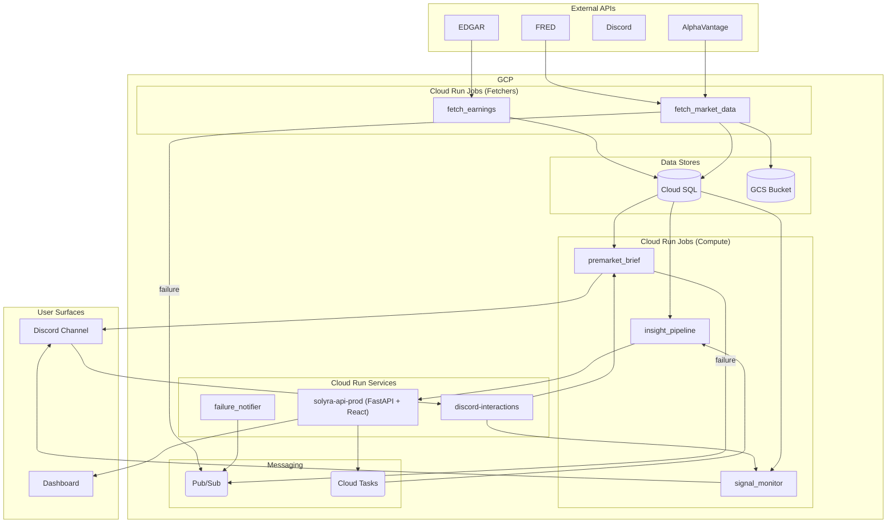

# ARCHITECTURE.md

> For deeper schema, scheduler timing, cost model, glossary, and runbook commands, see [`docs/GCP_ARCHITECTURE.md`](docs/GCP_ARCHITECTURE.md). For the visual companion, see [`Architecture.drawio`](Architecture.drawio).

## 1. System overview (one paragraph, ~80-120 words)

This system is a private stocks/trading platform deployed to the GCP project `adept-mountain-474619-d4`. It is designed for a single user or a small team, with no public authentication or per-user data partitioning. The primary delivery surfaces are Discord webhooks for scheduled briefs and a slash-command Cloud Run service, with a secondary internal React + FastAPI dashboard available via the `solyra-api-prod` Cloud Run Service. The system is comprised of approximately 76 Cloud Run Jobs that handle various data fetching, processing, and analysis tasks.

## 2. Component inventory (table form)

### 2a. Code modules

| Component | Type | Purpose | Depends on | Used by |
|---|---|---|---|---|
| [`gcp/database.py`](gcp/database.py) | code | Cloud SQL Connector | Cloud SQL | All fetchers, briefs, monitors, FastAPI router |
| [`gcp/gcs_utils.py`](gcp/gcs_utils.py) | code | GCS uploader | GCS | `fetch_market_data`, `migrate_to_gcp` |
| [`gcp/premarket_brief.py`](gcp/premarket_brief.py) | code | Pre-market brief generator | `lib/strat`, `lib/strat_levels`, `lib/indicators`, Cloud SQL, Discord | Scheduler `premarket-brief-daily` |
| [`gcp/signal_monitor.py`](gcp/signal_monitor.py) | code | Real-time intraday signal monitor | `lib/signals`, AV intraday, Discord | Scheduler `signal-monitor-daily` |
| [`gcp/insight_pipeline_job.py`](gcp/insight_pipeline_job.py) | code | AI insights generator | `lib/insights`, Cloud SQL, Vertex / Anthropic API | Scheduler `insight-pipeline-daily`, FastAPI `/insights/.../refresh` |
| [`gcp/backtest_job.py`](gcp/backtest_job.py) | code | Runs `lib/backtest.StratBacktest` | `lib/backtest`, Cloud SQL, Discord | Job `backtest` (Discord-triggered) |
| [`platform/api/main.py`](platform/api/main.py) | code | FastAPI app entry | `lib/`, Cloud SQL | Cloud Run service `solyra-api-prod` |
| [`lib/signals.py`](lib/signals.py) | code | Condition-scoring | `lib/indicators`, `lib/strat` | `signal_monitor`, FastAPI, fetchers |
| [`lib/strategies/`](lib/strategies/) | code | Strategy package | `lib/indicators`, `alert_config.json` | `signal_monitor`, FastAPI, backtest |
| [`lib/indicators.py`](lib/indicators.py) | code | Indicator math | | `signals`, `strat`, fetchers, FastAPI |
| [`lib/backtest.py`](lib/backtest.py) | code | Walk-forward backtester | `lib/signals`, `lib/indicators` | `backtest_job` |

### 2b. GCP resources

| Resource | Type | Purpose | Notes |
|---|---|---|---|
| `solyra-api-prod` | Cloud Run Service | FastAPI and React frontend | The main user-facing dashboard. |
| `discord-interactions` | Cloud Run Service | Handles Discord slash commands | Invokes Cloud Run Jobs based on commands. |
| `failure-notifier` | Cloud Run Service | Notifies on job failures | Creates GitHub issues for failed jobs. |
| `76 Cloud Run Jobs` | Cloud Run Job | Data fetching and processing | Scheduled and on-demand jobs. |
| `Cloud Scheduler` | Cloud Scheduler | Cron job trigger | Triggers most of the Cloud Run Jobs. |
| `trading-db` | Cloud SQL | PostgreSQL database | Main data store for the application. |
| `adept-mountain-474619-d4-trading-data` | GCS Bucket | Data lake | Stores raw data and parquet files. |
| `insight-pipeline-queue` | Cloud Tasks | Async task queue | For on-demand AI insight refreshes. |
| `gcp-job-failures` | Pub/Sub Topic | Failure event bus | Receives messages from the logging sink. |
| `Secret Manager` | Secret Manager | Secrets storage | Stores API keys and other secrets. |
| `Cloud Logging` | Cloud Logging | Logging | Collects logs from all services. |
| `trading-runner@...` | Service Account | Job execution identity | Roles for Cloud SQL, GCS, etc. |

## 3. Data flow (5 named subsections)

### Daily nightly write path (post-close 11 PM ET)

Scheduled jobs run to fetch the latest market data from AlphaVantage, calculate indicators, and store everything in the Cloud SQL database. Parquet snapshots of the data are also saved to a GCS bucket.

### Daily morning read path (pre-market 7-9 AM ET)

A series of jobs run to generate the pre-market brief. This includes fetching pre-market data, running analysis, and sending a summary to a Discord channel.

### On-demand AI insight refresh (Cloud Tasks)

The FastAPI backend can enqueue a task to the `insight-pipeline-queue`. A Cloud Run job processes the task, generates AI-powered insights, and stores the results in the database.

### Failure notification

A Cloud Logging sink is configured to send logs with `ERROR` severity to a Pub/Sub topic. The `failure-notifier` service consumes these messages and creates a GitHub issue with the details of the failure.

### Discord slash-command path

The `discord-interactions` service receives slash commands from Discord. It then triggers the appropriate Cloud Run Job (e.g., `/replay`, `/watch`, `/backtest`, `/validate`) to handle the command.

## 4. Architecture diagram

## 5. Reconciliation flags (review section)

### Inventory resources with no clear repo reference

- A number of `run.googleapis.com/Execution` resources are present in the inventory. These are historical records of job executions and can be ignored.
- The previous `ARCHITECTURE.md` mentioned 42 jobs, but the inventory shows 76. This discrepancy should be investigated. It's likely due to new jobs being added.

### Resources the code references that are NOT in the inventory

- The code references external APIs like AlphaVantage, FRED, and EDGAR, which are not GCP resources and won't appear in the inventory.
- The status of the Cloud Scheduler jobs could not be fully verified due to the truncated `inventory.json` file.

## 6. Open questions

- The exact purpose and dependencies of all the code modules, especially the ones in the `lib/` and `scripts/` directories, need to be documented more thoroughly.
- A full, non-truncated version of the `inventory.json` file is needed for a complete reconciliation.
- The prompt mentions a `gcloud scheduler jobs list` command. Running this command and providing the output would help in documenting the scheduler jobs.

Generated 2026-09-02 by .github/workflows/refresh-architecture-docs.yml
