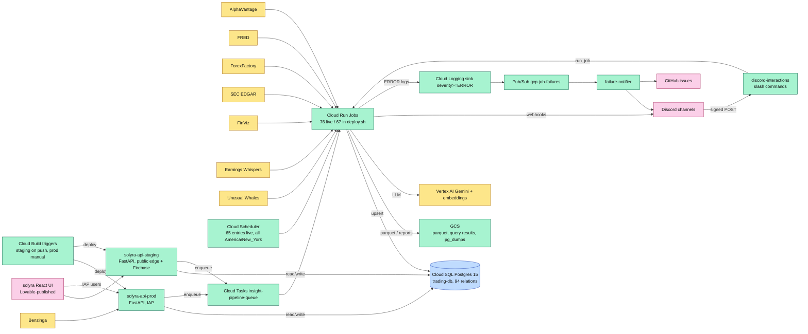

# ARCHITECTURE.md

> The single architecture reference for this repo: every Cloud Run job and service, scheduler, table, API route, deploy path, data flow and failure path, with each claim cited to a file:line, a live `gcloud` read, or a pull request. The visual companion is [`Architecture.drawio`](Architecture.drawio); the per-table write/read graph is [`DATA_DEPENDENCIES.md`](DATA_DEPENDENCIES.md); cost is [`COST_ANALYSIS.md`](COST_ANALYSIS.md).
>
> **How this file is maintained.** The tables between `<!-- inventory:*:start/end -->` markers are rendered by [`scripts/maintenance/doc_inventory.py`](scripts/maintenance/doc_inventory.py) from `gcp/deploy.sh`, `gcp/schema.sql`, `platform/api` and a live `gcloud` snapshot; the monthly refresh workflow re-renders them and updates the prose around them in place. Edit prose freely; never hand-edit inside a marker block (it is overwritten). `docs/GCP_ARCHITECTURE.md` was merged into this file on 2026-09-07 and is now a redirect stub.
>
> Live state below was read on **2026-09-07** with `gcloud` as `claude-web@` (jobs, schedulers, services, Cloud SQL, IAM, Cloud Build, domain mappings) and `scripts/db_query_cr.sh` (table stats). [#1004](https://github.com/TeneikaAskew/stocks/pull/1004) (scheduler consolidation, image pinning, Discord warm window) and [#1005](https://github.com/TeneikaAskew/stocks/pull/1005) (`phase6-playbook` schedule, hourly quality report retired) merged to `main` on 2026-09-07 and are reflected in the repo columns below. One open pull request already matches live but is not yet on `main`: [#990](https://github.com/TeneikaAskew/stocks/pull/990) (service rename, Cloud Build deploy triggers); this document is written against its branch.

## Table of contents

1. [Project facts and identities](#1-project-facts-and-identities)
2. [Topology](#2-topology)
3. [GCP services in use](#3-gcp-services-in-use)
4. [Cloud SQL](#4-cloud-sql)
5. [Schema catalog](#5-schema-catalog)
6. [Cloud Run Jobs](#6-cloud-run-jobs)
7. [Cloud Run Services, auth and the API](#7-cloud-run-services-auth-and-the-api)
8. [Cloud Scheduler timeline](#8-cloud-scheduler-timeline)
9. [External integrations](#9-external-integrations)
10. [Data flows](#10-data-flows)
11. [Failure handling](#11-failure-handling)
12. [Cost](#12-cost)
13. [Runbook anchors](#13-runbook-anchors)
14. [CI, Cloud Build and GitHub Actions](#14-ci-cloud-build-and-github-actions)
15. [Live-vs-repo reconciliation](#15-live-vs-repo-reconciliation)
16. [Code modules](#16-code-modules)
17. [Open questions](#17-open-questions)
18. [Removed since last refresh](#18-removed-since-last-refresh)
19. [Glossary](#19-glossary)

---

## 1. Project facts and identities

| Field | Value | Evidence |
|---|---|---|
| GCP project / region | `adept-mountain-474619-d4` / `us-east1` | [`gcp/deploy.sh:25`](gcp/deploy.sh#L25) |
| Cloud SQL instance | `trading-db`, PostgreSQL 15, `db-g1-small`, 191 GB SSD, PITR on | live `gcloud sql instances describe` 2026-09-07 (§4) |
| Database / user | `trading` / `trading_user` | live service env (`DB_NAME`, `DB_USER`) |
| GCS buckets | `gs://adept-mountain-474619-d4-trading-data` (data lake, query results, `sql-dumps/`), `…-cloudbuild` and `…_cloudbuild` (Cloud Build staging) | live `gcloud storage ls` |
| Container images | `us-east1-docker.pkg.dev/…/trading/trading-system` (every job, `discord-interactions`, `failure-notifier`; tags `latest`, `research`, `research-*`, `inuse-job-*` pins) and the API image `gcr.io/…/solyra-api` (both API services; the legacy `gcr.io/…/trading-platform` and `-staging` packages were deleted by `retire-legacy-images` on 2026-09-07 after prod was promoted to `solyra-api`, #1007) | [`gcp/deploy.sh:25`](gcp/deploy.sh#L25), [`platform/deploy.sh:19-25`](platform/deploy.sh#L19), live tag list (85 tags) |
| Runtime service accounts | `trading-runner@` (jobs, `discord-interactions`, `failure-notifier`): `aiplatform.user`, `artifactregistry.writer`, `cloudbuild.builds.editor`, `cloudsql.client`, `cloudsql.editor`, `logging.logWriter`, `run.developer`, `run.invoker`, `secretmanager.secretAccessor`, `serviceusage.serviceUsageConsumer`, `storage.objectAdmin`. `trading-platform-svc@` (both API services): `aiplatform.user`, `cloudsql.client`, `firebaseauth.admin`. | live `gcloud projects get-iam-policy` 2026-09-07 |
| Automation identities | `arch-refresh-bot@` (the WIF identity of both the monthly doc refresh and `deploy-staging.yml`; project roles read live 2026-09-07 04:28Z: `aiplatform.user`, `artifactregistry.reader`, `bigquery.dataViewer`, `bigquery.jobUser`, `cloudasset.viewer`, `cloudbuild.builds.editor`, `cloudscheduler.viewer`, `cloudsql.client`, `cloudsql.viewer`, `cloudtasks.viewer`, `iam.securityReviewer`, `logging.viewer`, `pubsub.viewer`, `run.admin`, `secretmanager.viewer`, `serviceusage.serviceUsageConsumer`; the six viewer roles were granted 2026-09-07 for the rebuilt live-snapshot step, see [SETUP.md §3](SETUP.md#3-grant-the-iam-roles). Resource-level: `storage.objectViewer` on the trading-data bucket (sql-dumps listing), `artifactregistry.writer` on both image repos and `artifactregistry.reader` on `gcr.io` (#1007, for `pin-images` from the deploy workflow), `iam.serviceAccountUser` on `trading-platform-svc@` and the default compute SA (deploys). The full deploy-side rationale and the least-privilege hazard it carries are in [`docs/product/09-SECURITY-AUTH.md`](docs/product/09-SECURITY-AUTH.md)), `claude-web@` (Claude Code sandbox: `editor`, `iam.serviceAccountUser`, `logging.configWriter`, `secretmanager.secretAccessor`), `playwright-tester@`, `github-actions-sheets@` (legacy), `firebase-adminsdk-fbsvc@`, default compute SA | same IAM read |
| Secrets (22) | `admin-token`, `av-api-key`, `benzinga-api-key`, `cloud-sql-connection-name`, `db-trading-pass`, `db-trading-user`, `discord-app-id`, `discord-bot-token`, `discord-public-key`, `discord-webhook-earnings`, `discord-webhook-gcp`, `discord-webhook-insights`, `discord-webhook-signals`, `ew-pass`, `ew-user`, `fred-api-key`, `gh-stocks-repo-pat`, `github-pat`, `github-repo`, `sec-user-agent`, `staging-e2e-login`, `trading-db-pass` | live `gcloud secrets list` |
| Pub/Sub | topic `gcp-job-failures`, DLQ `gcp-job-failures-dlq`, push subscription `gcp-job-failures-push` → `failure-notifier` | live; [`gcp/deploy.sh:2851`](gcp/deploy.sh#L2851) |
| Cloud Tasks | queue `insight-pipeline-queue`, max 5 concurrent dispatches, 2 attempts | live `gcloud tasks queues describe`; [`gcp/deploy.sh:388`](gcp/deploy.sh#L388) |
| Frontend | React/Vite SPA in [`TeneikaAskew/solyra`](https://github.com/TeneikaAskew/solyra), built and published with Lovable; it talks to the API services below (falls back to `solyra-api-staging` when nothing listens on `:8000`) | solyra `vite.config.ts`, `src/lib/apiTargets.ts`; stocks #957 |

**Why one container image, many jobs.** Every job's entry point is `python -m gcp.<module>` (or a `scripts/` module) on the same `trading-system` image with different `--command`/`--args`. Research jobs use the `:research` tag built by `./gcp/deploy.sh build-research` ([`gcp/deploy.sh:889`](gcp/deploy.sh#L889)), which adds scikit-learn/scipy that the main image deliberately excludes.

## 2. Topology



Three lanes: **ingest** (Scheduler → jobs → Cloud SQL/GCS), **serve** (the two API services and `discord-interactions` read Cloud SQL and dispatch jobs on demand), **observe** (Cloud Logging → Pub/Sub → `failure-notifier` → Discord + GitHub). A fourth, research, lane runs the `:research` image jobs against the same database (see [`docs/PIPELINE.md`](docs/PIPELINE.md)).

## 3. GCP services in use

| Service | Role | Live 2026-09-07 |
|---|---|---|
| Cloud SQL (PostgreSQL 15) | single source of truth for all structured data | 94 relations (66 declared in `gcp/schema.sql`, 28 created at runtime by research and analytics jobs; §5) |
| Cloud Run Jobs | every fetcher, analyzer, backfill, audit and research run | 76 jobs; 67 declared in [`gcp/deploy.sh`](gcp/deploy.sh) |
| Cloud Run Services | 4 long-lived HTTP services | `solyra-api-prod`, `solyra-api-staging`, `discord-interactions` (min-instances 1), `failure-notifier` |
| Cloud Scheduler | cron triggers, all `America/New_York` | 65 entries, none paused (`signal-quality-report-hourly` deleted 2026-09-07) |
| Cloud Build | image builds and the API deploy triggers | triggers `deploy-solyra-api-staging` (push to `main`), `deploy-solyra-api-prod` (manual), `apply-schema-on-change` (push to `main`) |
| Artifact Registry + GCR | `trading/trading-system` (448 versions, cleanup policy applied live per #1004) and the single `gcr.io/…/solyra-api` API image (legacy packages retired 2026-09-07, #1007) | live tag list, `gcloud container images list` 2026-09-07 |
| Cloud Storage | parquet snapshots, `query-results/`, `sql-dumps/` (5 weekly dumps, latest 2026-09-06), reports | live listing |
| Pub/Sub + Cloud Logging | failure pipeline (§11) | topic, DLQ, push sub, sink `gcp-job-failures-sink` |
| Secret Manager | 22 secrets, injected with `--set-secrets` ([`gcp/deploy.sh:457`](gcp/deploy.sh#L457)) | live |
| IAP | gates `solyra-api-prod` | `run.googleapis.com/iap-enabled: true` on the service |
| Identity Platform / Firebase Auth | per-request ID-token verification on `solyra-api-staging` (`AUTH_MODE=firebase`) | service env |
| Cloud Tasks | on-demand insight refresh fan-out | queue `insight-pipeline-queue` |
| Vertex AI | Gemini for briefs and the insight agents; `text-embedding-005` for journal embeddings | [`gcp/schema.sql:1424`](gcp/schema.sql#L1424) seeds every role to `gemini-3.1-flash-lite`; [`lib/agents/embeddings.py:16`](lib/agents/embeddings.py#L16) |
| BigQuery | billing export dataset `billing_export` read by the monthly doc refresh | [`.github/workflows/refresh-architecture-docs.yml`](.github/workflows/refresh-architecture-docs.yml) |

## 4. Cloud SQL

| Setting | Live value (2026-09-07) | Note |
|---|---|---|
| Engine / tier | PostgreSQL 15, `db-g1-small` | [`gcp/setup_cloud_sql.sh:106`](gcp/setup_cloud_sql.sh#L106) |
| Storage | 191 GB (auto-grown; `etf_options_snapshots` 74 GB, `market_data_intraday_other` 67 GB) | earlier docs said 55 GB |
| Network | **public IPv4 enabled** (`34.24.66.12`), one authorized network, `sslMode=ALLOW_UNENCRYPTED_AND_ENCRYPTED`, SSL not required | earlier docs said "no public IP"; the setup script never passes `--no-assign-ip`. Cloud Run connects through the Cloud SQL connector; the public IP is for the authorized-network operator path. Whether to disable it is an operator decision (§17). |
| Backups | automated daily 03:00 UTC, 7 retained, latest 2026-09-06 SUCCESSFUL | |
| Point-in-time recovery | on, 7-day transaction log retention | |
| Deletion protection | on | |
| Maintenance window | Sunday 04:00 UTC | |
| Weekly logical dump | `cloud-sql-weekly-export` job, Sunday 04:00 ET → `gs://…-trading-data/sql-dumps/trading-YYYYMMDD-HHMMSS.sql.gz`; 5 dumps present, ~15 GB each | [`gcp/deploy.sh:2451`](gcp/deploy.sh#L2451); scheduler [`gcp/deploy.sh:3423`](gcp/deploy.sh#L3423) |

**Connection model.** Every job, service and script goes through [`gcp/database.py`](gcp/database.py): `get_engine()` (Cloud SQL Python Connector + pg8000, `:76`), `query_to_dataframe` (`:167`) and its strict variant (`:193`), `upsert_dataframe` (`:333`), `bulk_copy_upsert` (`:444`), `bulk_insert_dataframe` (`:634`), `row_exists` (`:720`), `execute_sql` (`:745`) and `record_job_run` (`:813`, the `job_runs` observability writer). From the Claude Code sandbox, where port 5432 is blocked, ad-hoc SQL runs through [`scripts/db_query_cr.sh`](scripts/db_query_cr.sh) → the `db-query` job ([`gcp/deploy.sh:1663`](gcp/deploy.sh#L1663)); see [CLAUDE.md → Database access](CLAUDE.md#database-access).

## 5. Schema catalog

`gcp/schema.sql` declares **66 tables**, 2 materialized views and 1 view; the live database holds **94 relations** because research and analytics jobs create their own tables at runtime (the `strat_features_*` family, `magnitude_*`, `gamma_levels_eod`, `daily_vex`, `gamma_events`, the `*_30m_predictions` tables, `market_data_indicators*`, `market_data_cross_asset`). The declared set, with definition lines:

<!-- inventory:tables:start -->
| Relation | Kind | Defined |
|---|---|---|
| `admin_refresh_leases` | table | [`gcp/schema.sql:4013`](gcp/schema.sql#L4013) |
| `archive_yahoo_earnings_options_snapshots` | table | [`gcp/schema.sql:528`](gcp/schema.sql#L528) |
| `archive_yahoo_etf_options_snapshots` | table | [`gcp/schema.sql:525`](gcp/schema.sql#L525) |
| `archive_yahoo_market_data_daily` | table | [`gcp/schema.sql:519`](gcp/schema.sql#L519) |
| `archive_yahoo_market_data_intraday` | table | [`gcp/schema.sql:522`](gcp/schema.sql#L522) |
| `backtest_reports` | table | [`gcp/schema.sql:2960`](gcp/schema.sql#L2960) |
| `backtest_sweeps` | table | [`gcp/schema.sql:2931`](gcp/schema.sql#L2931) |
| `backtest_trades` | table | [`gcp/schema.sql:2889`](gcp/schema.sql#L2889) |
| `backtest_walk_forward_folds` | table | [`gcp/schema.sql:2986`](gcp/schema.sql#L2986) |
| `daily_rates` | table | [`gcp/schema.sql:498`](gcp/schema.sql#L498) |
| `earnings_calendar` | table | [`gcp/schema.sql:538`](gcp/schema.sql#L538) |
| `earnings_calibration` | table | [`gcp/schema.sql:3079`](gcp/schema.sql#L3079) |
| `earnings_history` | table | [`gcp/schema.sql:699`](gcp/schema.sql#L699) |
| `earnings_options_snapshots` | table | [`gcp/schema.sql:437`](gcp/schema.sql#L437) |
| `earnings_options_strategy_insights` | table | [`gcp/schema.sql:3307`](gcp/schema.sql#L3307) |
| `earnings_options_strategy_winners` | table | [`gcp/schema.sql:3335`](gcp/schema.sql#L3335) |
| `earnings_reactions` | table | [`gcp/schema.sql:745`](gcp/schema.sql#L745) |
| `earnings_upcoming_with_history` | table | [`gcp/schema.sql:3725`](gcp/schema.sql#L3725) |
| `economic_events` | table | [`gcp/schema.sql:1344`](gcp/schema.sql#L1344) |
| `etf_options_daily_greeks` | table | [`gcp/schema.sql:344`](gcp/schema.sql#L344) |
| `etf_options_snapshots` | table | [`gcp/schema.sql:150`](gcp/schema.sql#L150) |
| `exit_config_overrides` | table | [`gcp/schema.sql:2343`](gcp/schema.sql#L2343) |
| `historical_signals` | table | [`gcp/schema.sql:2029`](gcp/schema.sql#L2029) |
| `indicator_correlation` | table | [`gcp/schema.sql:3148`](gcp/schema.sql#L3148) |
| `insider_transactions` | table | [`gcp/schema.sql:951`](gcp/schema.sql#L951) |
| `insight_reports` | table | [`gcp/schema.sql:1443`](gcp/schema.sql#L1443) |
| `insight_reports_history` | table | [`gcp/schema.sql:1960`](gcp/schema.sql#L1960) |
| `insight_runs` | table | [`gcp/schema.sql:1479`](gcp/schema.sql#L1479) |
| `intraday_flow_15m` | table | [`gcp/schema.sql:384`](gcp/schema.sql#L384) |
| `intraday_gex_15m` | table | [`gcp/schema.sql:405`](gcp/schema.sql#L405) |
| `job_runs` | table | [`gcp/schema.sql:3862`](gcp/schema.sql#L3862) |
| `journal_entries` | table | [`gcp/schema.sql:1163`](gcp/schema.sql#L1163) |
| `market_data_daily` | table | [`gcp/schema.sql:12`](gcp/schema.sql#L12) |
| `market_data_intraday` | table | [`gcp/schema.sql:115`](gcp/schema.sql#L115) |
| `market_data_intraday_iwm` | partition of `market_data_intraday` | [`gcp/schema.sql:133`](gcp/schema.sql#L133) |
| `market_data_intraday_other` | partition of `market_data_intraday` | [`gcp/schema.sql:139`](gcp/schema.sql#L139) |
| `market_data_intraday_qqq` | partition of `market_data_intraday` | [`gcp/schema.sql:135`](gcp/schema.sql#L135) |
| `market_data_intraday_spx` | partition of `market_data_intraday` | [`gcp/schema.sql:137`](gcp/schema.sql#L137) |
| `market_data_intraday_spy` | partition of `market_data_intraday` | [`gcp/schema.sql:131`](gcp/schema.sql#L131) |
| `model_routing` | table | [`gcp/schema.sql:1411`](gcp/schema.sql#L1411) |
| `news_sentiment` | table | [`gcp/schema.sql:1521`](gcp/schema.sql#L1521) |
| `options_daily_features` | table | [`gcp/schema.sql:247`](gcp/schema.sql#L247) |
| `playbook_cards` | table | [`gcp/schema.sql:1270`](gcp/schema.sql#L1270) |
| `playbook_cards_staging` | table | [`gcp/schema.sql:3836`](gcp/schema.sql#L3836) |
| `premarket_analysis` | table | [`gcp/schema.sql:1216`](gcp/schema.sql#L1216) |
| `premarket_analysis_history` | table | [`gcp/schema.sql:1845`](gcp/schema.sql#L1845) |
| `ranker_runs` | table | [`gcp/schema.sql:1026`](gcp/schema.sql#L1026) |
| `realtime_gex_15m` | table | [`gcp/schema.sql:424`](gcp/schema.sql#L424) |
| `regime_combo_results` | table | [`gcp/schema.sql:3225`](gcp/schema.sql#L3225) |
| `sec_filings` | table | [`gcp/schema.sql:918`](gcp/schema.sql#L918) |
| `signal_alerts` | table | [`gcp/schema.sql:1044`](gcp/schema.sql#L1044) |
| `signal_metrics` | table | [`gcp/schema.sql:2573`](gcp/schema.sql#L2573) |
| `strat_combo_results` | table | [`gcp/schema.sql:3257`](gcp/schema.sql#L3257) |
| `strat_levels` | table | [`gcp/schema.sql:1561`](gcp/schema.sql#L1561) |
| `ticker_calibration` | table | [`gcp/schema.sql:2256`](gcp/schema.sql#L2256) |
| `ticker_info` | table | [`gcp/schema.sql:2082`](gcp/schema.sql#L2082) |
| `top_movers_daily` | table | [`gcp/schema.sql:977`](gcp/schema.sql#L977) |
| `top_movers_intraday` | table | [`gcp/schema.sql:1001`](gcp/schema.sql#L1001) |
| `trades` | table | [`gcp/schema.sql:1120`](gcp/schema.sql#L1120) |
| `user_preferences` | table | [`gcp/schema.sql:3950`](gcp/schema.sql#L3950) |
| `user_profile` | table | [`gcp/schema.sql:3981`](gcp/schema.sql#L3981) |
| `user_roles` | table | [`gcp/schema.sql:3899`](gcp/schema.sql#L3899) |
| `user_style_results` | table | [`gcp/schema.sql:3818`](gcp/schema.sql#L3818) |
| `waitlist_signups` | table | [`gcp/schema.sql:3805`](gcp/schema.sql#L3805) |
| `walk_forward_results` | table | [`gcp/schema.sql:3032`](gcp/schema.sql#L3032) |
| `watchlists` | table | [`gcp/schema.sql:2138`](gcp/schema.sql#L2138) |
| `earnings_event_outcomes` | materialized view | [`gcp/schema.sql:3473`](gcp/schema.sql#L3473) |
| `earnings_ticker_lean` | materialized view | [`gcp/schema.sql:3664`](gcp/schema.sql#L3664) |
| `v_etf_options_node` | view | [`gcp/schema.sql:281`](gcp/schema.sql#L281) |
<!-- inventory:tables:end -->

### 5.1 By domain (declared tables)

| Domain | Tables | Notes |
|---|---|---|
| Market data | `market_data_daily`, `market_data_intraday` + partitions `_spy`, `_iwm`, `_qqq`, `_spx`, `_other`, `daily_rates`, `archive_yahoo_*` (4, frozen, 0 rows live) | `market_data_daily` is the most-read table (5.5 M rows); intraday is LIST-partitioned by ticker, `_other` holds 5.6 M rows / 67 GB |
| Options | `etf_options_snapshots` (141 M rows, 74 GB), `earnings_options_snapshots`, `options_daily_features`, `etf_options_daily_greeks`, `intraday_flow_15m`, `intraday_gex_15m`, `realtime_gex_15m`, view `v_etf_options_node` | nightly chain in §10.4 |
| Calendars and catalysts | `earnings_calendar`, `earnings_history`, `earnings_reactions`, `earnings_calibration`, `earnings_options_strategy_insights`, `earnings_options_strategy_winners`, `earnings_upcoming_with_history`, MVs `earnings_event_outcomes`, `earnings_ticker_lean`, `economic_events`, `sec_filings`, `insider_transactions` (1.7 M rows), `top_movers_daily`, `top_movers_intraday`, `news_sentiment`, `ticker_info`, `watchlists` | the two MVs are dropped and rebuilt WITH NO DATA by a full `schema.sql` apply and repopulated by `refresh-earnings-views` ([`gcp/schema.sql:3452-3713`](gcp/schema.sql#L3452)) |
| Strat and signals | `strat_levels`, `ticker_calibration`, `exit_config_overrides`, `signal_alerts`, `trades`, `historical_signals`, `signal_metrics`, `playbook_cards`, `playbook_cards_staging`, `premarket_analysis`, `premarket_analysis_history` | |
| AI insights | `insight_reports`, `insight_reports_history`, `insight_runs`, `ranker_runs`, `model_routing`, `journal_entries` (pgvector embedding) | |
| Backtest and research results | `backtest_reports`, `backtest_trades`, `backtest_sweeps`, `backtest_walk_forward_folds`, `walk_forward_results`, `indicator_correlation`, `regime_combo_results`, `strat_combo_results`, `user_style_results` | |
| Users and app state | `user_roles`, `user_preferences`, `user_profile`, `admin_refresh_leases`, `waitlist_signups` | all four user tables landed 2026-09-01..06 (#956, #972, #982, #1000) |
| Ops | `job_runs` | written by `record_job_run` in every job |

There are **no foreign keys between domain tables** other than `insight_runs.report_id → insight_reports.id`; everything else joins on `ticker` and a date/timestamp, so fetchers and backfills can run in any order.

### 5.2 Live relations and sizes

<!-- inventory:dbtables:start -->
| Relation (live) | Rows (estimate; — for views) | Size | Declared in |
|---|---|---|---|
| `admin_refresh_leases` | 0 | 16 kB | `gcp/schema.sql` |
| `archive_yahoo_earnings_options_snapshots` | 0 | 24 kB | `gcp/schema.sql` |
| `archive_yahoo_etf_options_snapshots` | 0 | 40 kB | `gcp/schema.sql` |
| `archive_yahoo_market_data_daily` | 0 | 24 kB | `gcp/schema.sql` |
| `archive_yahoo_market_data_intraday` | 0 | 5920 kB | `gcp/schema.sql` |
| `backtest_reports` | 1 | 144 kB | `gcp/schema.sql` |
| `backtest_sweeps` | 45 | 96 kB | `gcp/schema.sql` |
| `backtest_trades` | 149,898 | 48 MB | `gcp/schema.sql` |
| `backtest_walk_forward_folds` | 0 | 496 kB | `gcp/schema.sql` |
| `daily_rates` | 2,916 | 424 kB | `gcp/schema.sql` |
| `daily_vex` | 218 | 936 kB | **runtime-created** (not in schema.sql) |
| `earnings_calendar` | 60,076 | 24 MB | `gcp/schema.sql` |
| `earnings_calibration` | 0 | 48 kB | `gcp/schema.sql` |
| `earnings_event_outcomes` | 0 | 24 kB | `gcp/schema.sql` (materialized view) |
| `earnings_history` | 132,353 | 41 MB | `gcp/schema.sql` |
| `earnings_options_snapshots` | 0 | 588 MB | `gcp/schema.sql` |
| `earnings_options_strategy_insights` | 0 | 104 kB | `gcp/schema.sql` |
| `earnings_options_strategy_winners` | 0 | 160 kB | `gcp/schema.sql` |
| `earnings_reactions` | 62,783 | 50 MB | `gcp/schema.sql` |
| `earnings_ticker_lean` | 0 | 32 kB | `gcp/schema.sql` (materialized view) |
| `earnings_upcoming_with_history` | 46,320 | 15 MB | `gcp/schema.sql` |
| `economic_events` | 2,981 | 648 kB | `gcp/schema.sql` |
| `etf_options_daily_greeks` | 8,042 | 976 kB | `gcp/schema.sql` |
| `etf_options_snapshots` | 141,113,379 | 74 GB | `gcp/schema.sql` |
| `exit_config_overrides` | 0 | 48 kB | `gcp/schema.sql` |
| `gamma_events` | 0 | 3456 kB | **runtime-created** (not in schema.sql) |
| `gamma_levels_eod` | 102,442 | 31 MB | **runtime-created** (not in schema.sql) |
| `historical_signals` | 96,376 | 3376 MB | `gcp/schema.sql` |
| `indicator_correlation` | 3,016 | 1512 kB | `gcp/schema.sql` |
| `insider_transactions` | 1,708,432 | 594 MB | `gcp/schema.sql` |
| `insight_reports` | 790 | 4384 kB | `gcp/schema.sql` |
| `insight_reports_history` | 846 | 3200 kB | `gcp/schema.sql` |
| `insight_runs` | 948 | 360 kB | `gcp/schema.sql` |
| `intraday_flow_15m` | 529,920 | 63 MB | `gcp/schema.sql` |
| `intraday_gex_15m` | 487,540 | 87 MB | `gcp/schema.sql` |
| `iwm_30m_predictions` | 0 | 352 kB | **runtime-created** (not in schema.sql) |
| `job_runs` | 14 | 48 kB | `gcp/schema.sql` |
| `journal_entries` | 2 | 1288 kB | `gcp/schema.sql` |
| `magnitude_per_bar_predictions` | 15,380 | 4584 kB | **runtime-created** (not in schema.sql) |
| `magnitude_walk_forward_results` | 1,695 | 1184 kB | **runtime-created** (not in schema.sql) |
| `market_data_cross_asset` | 0 | 16 kB | **runtime-created** (not in schema.sql) |
| `market_data_daily` | 5,553,479 | 3895 MB | `gcp/schema.sql` |
| `market_data_indicators` | 0 | 0 bytes | **runtime-created** (not in schema.sql) (partitioned table) |
| `market_data_indicators_iwm` | 0 | 2200 kB | **runtime-created** (not in schema.sql) |
| `market_data_indicators_other` | 0 | 16 kB | **runtime-created** (not in schema.sql) |
| `market_data_indicators_qqq` | 0 | 2224 kB | **runtime-created** (not in schema.sql) |
| `market_data_indicators_spy` | 0 | 2232 kB | **runtime-created** (not in schema.sql) |
| `market_data_intraday` | 0 | 0 bytes | `gcp/schema.sql` (partitioned table) |
| `market_data_intraday_iwm` | 2,006,813 | 512 MB | `gcp/schema.sql` |
| `market_data_intraday_other` | 5,653,650 | 67 GB | `gcp/schema.sql` |
| `market_data_intraday_qqq` | 2,281,849 | 585 MB | `gcp/schema.sql` |
| `market_data_intraday_spx` | 0 | 2144 kB | `gcp/schema.sql` |
| `market_data_intraday_spy` | 2,432,886 | 664 MB | `gcp/schema.sql` |
| `model_routing` | 0 | 24 kB | `gcp/schema.sql` |
| `news_sentiment` | 212,368 | 298 MB | `gcp/schema.sql` |
| `options_daily_features` | 8,042 | 1112 kB | `gcp/schema.sql` |
| `playbook_cards` | 72 | 144 kB | `gcp/schema.sql` |
| `playbook_cards_staging` | 0 | 16 kB | `gcp/schema.sql` |
| `premarket_analysis` | 383 | 1208 kB | `gcp/schema.sql` |
| `premarket_analysis_history` | 702 | 1664 kB | `gcp/schema.sql` |
| `qqq_30m_predictions` | 0 | 352 kB | **runtime-created** (not in schema.sql) |
| `ranker_runs` | 93 | 840 kB | `gcp/schema.sql` |
| `realtime_gex_15m` | 6,321 | 904 kB | `gcp/schema.sql` |
| `regime_combo_results` | 8,640 | 3872 kB | `gcp/schema.sql` |
| `sec_filings` | 4,274 | 1560 kB | `gcp/schema.sql` |
| `signal_alerts` | 3,011 | 2648 kB | `gcp/schema.sql` |
| `signal_metrics` | 179,485 | 58 MB | `gcp/schema.sql` |
| `spy_30m_predictions` | 0 | 352 kB | **runtime-created** (not in schema.sql) |
| `strat_combo_results` | 0 | 32 kB | `gcp/schema.sql` |
| `strat_features_15m` | 206,458 | 303 MB | **runtime-created** (not in schema.sql) |
| `strat_features_1m` | 3,105,422 | 4080 MB | **runtime-created** (not in schema.sql) |
| `strat_features_30m` | 103,261 | 152 MB | **runtime-created** (not in schema.sql) |
| `strat_features_4h` | 18,542 | 26 MB | **runtime-created** (not in schema.sql) |
| `strat_features_5m` | 587,853 | 811 MB | **runtime-created** (not in schema.sql) |
| `strat_features_60m` | 55,619 | 81 MB | **runtime-created** (not in schema.sql) |
| `strat_features_levels_15m` | 206,661 | 368 MB | **runtime-created** (not in schema.sql) |
| `strat_features_levels_1m` | 3,087,834 | 8155 MB | **runtime-created** (not in schema.sql) |
| `strat_features_levels_30m` | 103,261 | 184 MB | **runtime-created** (not in schema.sql) |
| `strat_features_levels_4h` | 18,542 | 28 MB | **runtime-created** (not in schema.sql) |
| `strat_features_levels_5m` | 617,241 | 1134 MB | **runtime-created** (not in schema.sql) |
| `strat_features_levels_60m` | 55,619 | 86 MB | **runtime-created** (not in schema.sql) |
| `strat_levels` | 13,889 | 3184 kB | `gcp/schema.sql` |
| `ticker_calibration` | 1 | 48 kB | `gcp/schema.sql` |
| `ticker_info` | 0 | 24 kB | `gcp/schema.sql` |
| `top_movers_daily` | 5,760 | 1128 kB | `gcp/schema.sql` |
| `top_movers_intraday` | 6,380 | 1152 kB | `gcp/schema.sql` |
| `trades` | 2,968 | 1360 kB | `gcp/schema.sql` |
| `user_preferences` | 1 | 32 kB | `gcp/schema.sql` |
| `user_profile` | 0 | 16 kB | `gcp/schema.sql` |
| `user_roles` | 2 | 48 kB | `gcp/schema.sql` |
| `user_style_results` | 0 | 24 kB | `gcp/schema.sql` |
| `v_etf_options_node` | — | 0 bytes | `gcp/schema.sql` (view) |
| `waitlist_signups` | 1 | 48 kB | `gcp/schema.sql` |
| `walk_forward_results` | 0 | 264 kB | `gcp/schema.sql` |
| `watchlists` | 0 | 64 kB | `gcp/schema.sql` |
<!-- inventory:dbtables:end -->

## 6. Cloud Run Jobs

76 jobs exist live; 67 are declared by a `deploy_*` function in [`gcp/deploy.sh`](gcp/deploy.sh). The other 9 were created by hand with `gcloud run jobs create` in May 2026 and are not reproducible from the repo (`backtest-playability`, `compare-tier-fires`, `exec-backtest`, `p2-build-gamma-levels`, `p2-outcomes-grid`, `p45-deep-ds`, `p7-analyze-tf`, `p7-build-multi-tf-features`, `p7a-iwm-30m-pipeline`, `p7b-next-candle-classifier`, `strat-dir-features`; 11 names, of which `p2-build-gamma-levels` is scheduled nightly by `gamma-levels-daily` and runs green). Two declared jobs are not deployed (`compute-spx-greeks-backfill`, `options-exec-backtest`). Retry policy is **`--max-retries 0` for 56 jobs and `1` for 27** (each row below says which); five fetchers omit `--task-timeout` and run at the Cloud Run default of 600 s.

<!-- inventory:jobs:start -->
| Job | Declared | Entrypoint | Memory / CPU / timeout / retries | Image | Last execution (live 2026-09-07) |
|---|---|---|---|---|---|
| `apply-schema-migrations` | [`gcp/deploy.sh:3065`](gcp/deploy.sh#L3065) | python -m gcp.apply_schema | 512Mi / 1 CPU / 600s / retries 0 | main | 2026-09-07 ok |
| `audit-brief-bias` | [`gcp/deploy.sh:2400`](gcp/deploy.sh#L2400) | python -m gcp.audit_job_runner | 1Gi / 1 CPU / 1800s / retries 0 | main | 2026-09-06 ok |
| `audit-infra-drift` | [`gcp/deploy.sh:2282`](gcp/deploy.sh#L2282) | python -m gcp.audit_infra_drift | 512Mi / 1 CPU / 300s / retries 0 | main | 2026-09-06 ok |
| `audit-magnitude-drift` | [`gcp/deploy.sh:2320`](gcp/deploy.sh#L2320) | python -m gcp.audit_magnitude_drift | 512Mi / 1 CPU / 180s / retries 0 | main | 2026-09-04 ok |
| `audit-walkforward` | [`gcp/deploy.sh:2362`](gcp/deploy.sh#L2362) | python -m gcp.audit_job_runner | 1Gi / 1 CPU / 1800s / retries 0 | main | 2026-09-05 ok |
| `auto-refresh-top-n` | [`gcp/deploy.sh:800`](gcp/deploy.sh#L800) | python -m gcp.auto_refresh_top_n | 1Gi / 1 CPU / 600s / retries 1 | main | 2026-09-04 ok |
| `backfill-daily-indicators` | [`gcp/deploy.sh:1880`](gcp/deploy.sh#L1880) | python -m gcp.fetchers.backfill_daily_indicators | 2Gi / 2 CPU / 36000s / retries 0 | main | 2026-09-06 ok |
| `backfill-ticker` | [`gcp/deploy.sh:1057`](gcp/deploy.sh#L1057) | python -m gcp.backfill_ticker | 1Gi / 1 CPU / 600s / retries 1 | main | 2026-05-04 ok |
| `backtest` | [`gcp/deploy.sh:1109`](gcp/deploy.sh#L1109) | python -m gcp.backtest_job | 2Gi / 1 CPU / 900s / retries 1 | main | 2026-04-29 ok |
| `backtest-pipeline` | [`gcp/deploy.sh:2782`](gcp/deploy.sh#L2782) | python -m scripts.run_pipeline | 8Gi / 2 CPU / 28800s / retries 0 | main | 2026-08-27 ok |
| `backtest-playability` | **not in deploy.sh** (hand-created) | python -m scripts.backtest_playability | 1Gi / 1 CPU / 1800s / retries 0 | trading-system@sha256:51f7b8b2b5bee7d24d38939321cc79e472a9c969dcb83d26b840791dd14924ea | 2026-05-14 ok |
| `build-options-daily-features` | [`gcp/deploy.sh:1551`](gcp/deploy.sh#L1551) | python -m gcp.fetchers.build_options_daily_features --incremental --days=7 | 4Gi / 2 CPU / 3600s / retries 0 | research | 2026-09-05 ok |
| `build-options-greeks` | [`gcp/deploy.sh:1514`](gcp/deploy.sh#L1514) | python -m gcp.build_options_daily_greeks --incremental --days=7 | 4Gi / 2 CPU / 3600s / retries 0 | research | 2026-09-05 ok |
| `build-realtime-gex` | [`gcp/deploy.sh:1581`](gcp/deploy.sh#L1581) | python -m gcp.build_realtime_gex --incremental --days=3 | 4Gi / 2 CPU / 1800s / retries 1 | research | 2026-09-04 ok |
| `calibrate-thresholds` | [`gcp/deploy.sh:3141`](gcp/deploy.sh#L3141) | python -m scripts.calibrate_thresholds | 1Gi / 1 CPU / 600s / retries 1 | main | 2026-07-01 ok |
| `cloud-sql-weekly-export` | [`gcp/deploy.sh:2978`](gcp/deploy.sh#L2978) | python -m gcp.sql_export_to_gcs | 512Mi / 1 CPU / 21600s / retries 0 | main | 2026-09-06 ok |
| `compare-tier-fires` | **not in deploy.sh** (hand-created) | python -m scripts.compare_tier_fires | 2Gi / 2 CPU / 1800s / retries 0 | trading-system:latest | 2026-05-04 ok |
| `compute-earnings-reactions` | [`gcp/deploy.sh:2691`](gcp/deploy.sh#L2691) | python -m gcp.fetchers.compute_earnings_reactions | 1Gi / 1 CPU / 1800s / retries 1 | main | 2026-09-06 ok |
| `compute-spx-greeks-backfill` | [`gcp/deploy.sh:3088`](gcp/deploy.sh#L3088) | python -m scripts.maintenance.compute_spx_greeks --ticker SPX | 2Gi / 1 CPU / 43200s / retries 0 | main | **not deployed** |
| `db-query` | [`gcp/deploy.sh:2188`](gcp/deploy.sh#L2188) | python -m gcp.db_query_job | 512Mi / 1 CPU / 600s / retries 0 | main | 2026-09-07 ok |
| `direction-baseline` | [`gcp/deploy.sh:1665`](gcp/deploy.sh#L1665) | python -m gcp.research.direction_program.baseline_runner --tf=5m | 8Gi / 4 CPU / 10800s / retries 0 | research | 2026-07-08 ok |
| `direction-importance` | [`gcp/deploy.sh:1700`](gcp/deploy.sh#L1700) | python -m gcp.research.direction_program.feature_importance --tf=5m | 8Gi / 4 CPU / 10800s / retries 0 | research | 2026-07-08 ok |
| `direction-phase2` | [`gcp/deploy.sh:1748`](gcp/deploy.sh#L1748) | python -m gcp.research.direction_program.phase2_ablation | 8Gi / 4 CPU / 10800s / retries 0 / tasks ${n} | research | 2026-07-11 ok |
| `direction-probe` | [`gcp/deploy.sh:1480`](gcp/deploy.sh#L1480) | python -m gcp.research.strat_engine.strat_dir_probes --experiment=e1_horizon --ticker=IWM --tf=15m --horizon=15 | 8Gi / 4 CPU / 5400s / retries 0 | research | 2026-06-21 ok |
| `earnings-long-watchlist` | [`gcp/deploy.sh:1205`](gcp/deploy.sh#L1205) | python -m gcp.earnings_long_watchlist | 512Mi / 1 CPU / 600s / retries 0 | main | 2026-09-06 ok |
| `earnings-options-backfill` | [`gcp/deploy.sh:3337`](gcp/deploy.sh#L3337) | python -m gcp.fetchers.fetch_av_earnings_options_backfill | 1Gi / 1 CPU / 32400s / retries 0 | main | 2026-05-22 ok |
| `earnings-reactions-brief` | [`gcp/deploy.sh:1172`](gcp/deploy.sh#L1172) | python -m gcp.earnings_reactions_brief | 1Gi / 1 CPU / 600s / retries 0 | main | 2026-09-04 ok |
| `earnings-sweep` | [`gcp/deploy.sh:3207`](gcp/deploy.sh#L3207) | python -m scripts.calibrate_earnings | 4Gi / 2 CPU / 1800s / retries 0 | main | 2026-05-22 ok |
| `etf-options-retention` | [`gcp/deploy.sh:2076`](gcp/deploy.sh#L2076) | python -m gcp.options_retention_job | 512Mi / 1 CPU / 3600s / retries 0 | main | 2026-09-06 ok |
| `evaluate-ew-strikes` | [`gcp/deploy.sh:2519`](gcp/deploy.sh#L2519) | python -m gcp.fetchers.evaluate_ew_strikes | 512Mi / 1 CPU / 600s / retries 1 | main | 2026-09-05 ok |
| `exec-backtest` | **not in deploy.sh** (hand-created) | python -m lib.exec_backtest.cli --mode=base | 8Gi / 4 CPU / 5400s / retries 0 | trading-system:research-exec-backtest | 2026-05-27 ok |
| `fetch-alphavantage-intraday` | [`gcp/deploy.sh:1904`](gcp/deploy.sh#L1904) | python -m gcp.fetchers.fetch_alphavantage_intraday | 2Gi / 1 CPU / 3600s / retries 1 | main | 2026-09-06 ok |
| `fetch-av-options-backfill` | [`gcp/deploy.sh:1985`](gcp/deploy.sh#L1985) | python -m gcp.fetchers.fetch_av_historical_options --tickers SPY IWM QQQ SPX --from-latest | 2Gi / 1 CPU / 43200s / retries 0 | main | 2026-09-05 ok |
| `fetch-av-options-realtime` | [`gcp/deploy.sh:2032`](gcp/deploy.sh#L2032) | python -m gcp.fetchers.fetch_av_realtime_options --tickers SPY IWM QQQ | 512Mi / 1 CPU / 600s / retries 0 | main | 2026-09-04 ok |
| `fetch-earnings-calendar` | [`gcp/deploy.sh:2464`](gcp/deploy.sh#L2464) | python scripts/fetch_earnings_calendar.py --source all --days 30 | 512Mi / 1 CPU / 1800s / retries 1 | main | 2026-09-06 ok |
| `fetch-earnings-history` | [`gcp/deploy.sh:2666`](gcp/deploy.sh#L2666) | python -m gcp.fetchers.fetch_earnings_history | 1Gi / 1 CPU / 28800s / retries 1 | main | 2026-09-07 ok |
| `fetch-economic-events` | [`gcp/deploy.sh:2436`](gcp/deploy.sh#L2436) | python -m gcp.fetchers.fetch_economic_events --source all | 512Mi / 1 CPU / 600s / retries 1 (defaults) | main | 2026-09-04 ok |
| `fetch-fred-rates` | [`gcp/deploy.sh:2411`](gcp/deploy.sh#L2411) | python -m gcp.fetchers.fetch_fred_rates | 512Mi / 1 CPU / 600s / retries 1 | main | 2026-09-06 ok |
| `fetch-insider-transactions` | [`gcp/deploy.sh:2549`](gcp/deploy.sh#L2549) | python -m gcp.fetchers.fetch_insider_transactions | 512Mi / 1 CPU / 1800s / retries 1 | main | 2026-09-04 ok |
| `fetch-market-data` | [`gcp/deploy.sh:1846`](gcp/deploy.sh#L1846) | python -m gcp.fetchers.fetch_market_data | 1Gi / 1 CPU / 5400s / retries 2 | main | 2026-09-05 ok |
| `fetch-news-sentiment` | [`gcp/deploy.sh:2810`](gcp/deploy.sh#L2810) | python -m gcp.fetchers.fetch_news_sentiment | 512Mi / 1 CPU / 600s / retries 1 (defaults) | main | 2026-09-04 ok |
| `fetch-news-sentiment-earnings` | [`gcp/deploy.sh:2837`](gcp/deploy.sh#L2837) | python -m gcp.fetchers.fetch_news_sentiment | 512Mi / 1 CPU / 600s / retries 1 (defaults) | main | 2026-09-04 ok |
| `fetch-news-sentiment-topics` | [`gcp/deploy.sh:2868`](gcp/deploy.sh#L2868) | python -m gcp.fetchers.fetch_news_sentiment | 512Mi / 1 CPU / 600s / retries 1 (defaults) | main | 2026-09-04 ok |
| `fetch-premarket-refresh` | [`gcp/deploy.sh:2492`](gcp/deploy.sh#L2492) | python -m gcp.fetchers.fetch_premarket_refresh | 512Mi / 1 CPU / 300s / retries 1 | main | 2026-09-04 ok |
| `fetch-sec-filings` | [`gcp/deploy.sh:2615`](gcp/deploy.sh#L2615) | python -m gcp.fetchers.fetch_sec_filings | 512Mi / 1 CPU / 1800s / retries 1 | main | 2026-09-04 ok |
| `fetch-top-movers` | [`gcp/deploy.sh:2587`](gcp/deploy.sh#L2587) | python -m gcp.fetchers.fetch_top_movers | 512Mi / 1 CPU / 300s / retries 0 | main | 2026-09-04 ok |
| `freshness-watchdog` | [`gcp/deploy.sh:2242`](gcp/deploy.sh#L2242) | python scripts/audit_data_freshness.py --strict | 512Mi / 1 CPU / 3600s / retries 0 | main | 2026-09-06 ok |
| `historical-signals-watchlist` | [`gcp/deploy.sh:571`](gcp/deploy.sh#L571) | python -m scripts.run_historical_signals --from-watchlist | 2Gi / 1 CPU / 1800s / retries 1 | main | 2026-09-05 ok |
| `indicator-correlation` | [`gcp/deploy.sh:705`](gcp/deploy.sh#L705) | python -m gcp.indicator_correlation_job | 1Gi / 1 CPU / 1800s / retries 1 | research | 2026-05-31 ok |
| `insight-discord-push` | [`gcp/deploy.sh:536`](gcp/deploy.sh#L536) | python -m gcp.insight_discord_push | 512Mi / 1 CPU / 120s / retries 1 | main | 2026-09-04 ok |
| `insight-pipeline` | [`gcp/deploy.sh:512`](gcp/deploy.sh#L512) | python -m gcp.insight_pipeline_job | 2Gi / 1 CPU / 1800s / retries 1 | main | 2026-09-04 ok |
| `intraday-bulk-backfill` | [`gcp/deploy.sh:3307`](gcp/deploy.sh#L3307) | python -m gcp.fetchers.fetch_alphavantage_intraday --symbols-file /app/gcp/fetchers/symbol_lists/earnings_universe.txt --start-date 2024-01-01 | 1Gi / 1 CPU / 86400s / retries 0 / tasks 4 | main | 2026-05-23 failed |
| `magnitude-engine` | [`gcp/deploy.sh:1624`](gcp/deploy.sh#L1624) | python -m gcp.research.magnitude_engine.mag_walk_forward | 8Gi / 4 CPU / 5400s / retries 0 / tasks ${plan_size} | research | 2026-08-27 ok |
| `magnitude-inference` | [`gcp/deploy.sh:1786`](gcp/deploy.sh#L1786) | python -m gcp.research.magnitude_engine.mag_inference | 1Gi / 1 CPU / 300s / retries 0 | research | 2026-09-04 ok |
| `magnitude-recal` | [`gcp/deploy.sh:1741`](gcp/deploy.sh#L1741) | python -m gcp.research.magnitude_engine.mag_walk_forward --phase=phase0 --all-cells --calibration=isotonic | 8Gi / 4 CPU / 10800s / retries 0 | research | 2026-07-12 ok |
| `options-exec-backtest` | [`gcp/deploy.sh:2143`](gcp/deploy.sh#L2143) | python -m lib.options_exec_backtest.cli --mode=base | 8Gi / 2 CPU / 14400s / retries 0 | research | **not deployed** |
| `p2-build-gamma-levels` | **not in deploy.sh** (hand-created) | python -m gcp.research.p2_build_gamma_levels | 2Gi / 2 CPU / 5400s / retries 0 | trading-system:research | 2026-09-05 ok |
| `p2-outcomes-grid` | **not in deploy.sh** (hand-created) | python -m gcp.research.p2_outcomes_grid | 4Gi / 2 CPU / 7200s / retries 0 | trading-system:research-p2 | 2026-05-23 ok |
| `p45-deep-ds` | **not in deploy.sh** (hand-created) | python -m gcp.research.p45_deep_ds_job | 16Gi / 4 CPU / 1800s / retries 0 | trading-system:research | 2026-05-24 ok |
| `p7-analyze-tf` | **not in deploy.sh** (hand-created) | python -m gcp.research.p7_analyze_tf --tf=5m | 32Gi / 8 CPU / 3600s / retries 0 | trading-system:research | 2026-05-25 ok |
| `p7-build-multi-tf-features` | **not in deploy.sh** (hand-created) | python -m gcp.research.p7_build_multi_tf_features | 16Gi / 4 CPU / 5400s / retries 0 | trading-system:research | 2026-05-25 ok |
| `p7a-iwm-30m-pipeline` | **not in deploy.sh** (hand-created) | python -m gcp.research.p7a_iwm_30m_pipeline --mode=all | 4Gi / 4 CPU / 1200s / retries 0 | trading-system:research | 2026-05-25 ok |
| `p7b-next-candle-classifier` | **not in deploy.sh** (hand-created) | python -m gcp.research.p7b_next_candle_classifier --mode=evaluate | 8Gi / 4 CPU / 5400s / retries 0 | trading-system:research | 2026-05-26 ok |
| `param-sweep` | [`gcp/deploy.sh:3174`](gcp/deploy.sh#L3174) | python -m scripts.run_param_sweep | 4Gi / 1 CPU / 21600s / retries 0 / tasks 3 | main | 2026-05-20 ok |
| `phase6-playbook` | [`gcp/deploy.sh:1346`](gcp/deploy.sh#L1346) | python -m scripts.analysis.phase6_playbook --write-db | 16Gi / 4 CPU / 3600s / retries 0 / tasks 3 | main | 2026-09-06 ok |
| `premarket-brief` | [`gcp/deploy.sh:1142`](gcp/deploy.sh#L1142) | python -m gcp.premarket_brief | 1Gi / 1 CPU / 1800s / retries 0 | main | 2026-09-07 ok |
| `premarket-playbook-resolver` | [`gcp/deploy.sh:1294`](gcp/deploy.sh#L1294) | python -m gcp.premarket_playbook_resolver | 1Gi / 1 CPU / 3600s / retries 0 | main | 2026-09-05 ok |
| `refresh-earnings-views` | [`gcp/deploy.sh:2725`](gcp/deploy.sh#L2725) | python -m gcp.refresh_earnings_views --mode=weekly | 1Gi / 1 CPU / 1200s / retries 0 | main | 2026-09-07 ok |
| `regime-combo` | [`gcp/deploy.sh:742`](gcp/deploy.sh#L742) | python -m gcp.regime_combo_job | 2Gi / 2 CPU / 3600s / retries 1 | research | 2026-09-06 ok |
| `signal-monitor` | [`gcp/deploy.sh:1227`](gcp/deploy.sh#L1227) | python -m gcp.signal_monitor | 2Gi / 1 CPU / 28800s / retries 0 | main | 2026-09-04 ok |
| `signal-monitor-eod-resolver` | [`gcp/deploy.sh:1261`](gcp/deploy.sh#L1261) | python -m gcp.signal_monitor_eod_resolver | 1Gi / 1 CPU / 3600s / retries 0 | main | 2026-09-04 ok |
| `signal-quality-alarm` | [`gcp/deploy.sh:665`](gcp/deploy.sh#L665) | python -m gcp.signal_quality_alarm | 512Mi / 1 CPU / 120s / retries 0 | main | 2026-09-05 ok |
| `signal-quality-report` | [`gcp/deploy.sh:624`](gcp/deploy.sh#L624) | python -m scripts.signal_quality_report --mode=rolling | 1Gi / 1 CPU / 3600s / retries 0 | main | 2026-09-05 ok |
| `signal-replay` | [`gcp/deploy.sh:771`](gcp/deploy.sh#L771) | python -m gcp.signal_replay | 512Mi / 1 CPU / 900s / retries 0 | main | 2026-05-17 ok |
| `strat-dir-features` | **not in deploy.sh** (hand-created) | python -m gcp.research.strat_engine.strat_dir_walk_forward_extended --ticker=IWM --tf=15m --family=baseline | 32Gi / 8 CPU / 3600s / retries 0 | trading-system:research-dir-features | 2026-05-27 cancelled |
| `strat-engine` | [`gcp/deploy.sh:1441`](gcp/deploy.sh#L1441) | python -m gcp.research.strat_engine.strat_data_builder | 8Gi / 4 CPU / 5400s / retries 0 | research | 2026-09-05 ok |
| `validate-brief` | [`gcp/deploy.sh:1083`](gcp/deploy.sh#L1083) | python -m gcp.validate_brief_job | 1Gi / 1 CPU / 300s / retries 1 | main | 2026-04-29 ok |
| `weekend-review` | [`gcp/deploy.sh:1818`](gcp/deploy.sh#L1818) | python -m gcp.weekend_review | 1Gi / 1 CPU / 600s / retries 1 (defaults) | main | 2026-09-05 ok |
<!-- inventory:jobs:end -->

Groups, for orientation: **ingest** (`fetch-*`, `backfill-*`, `intraday-bulk-backfill`), **options analytics** (`fetch-av-options-*`, `build-options-*`, `build-realtime-gex`, `etf-options-retention`), **daily analysis and delivery** (`premarket-brief`, `earnings-reactions-brief`, `earnings-long-watchlist`, `auto-refresh-top-n`, `insight-pipeline`, `insight-discord-push`, `signal-monitor`, `signal-monitor-eod-resolver`, `premarket-playbook-resolver`, `phase6-playbook`, `weekend-review`, `evaluate-ew-strikes`, `compute-earnings-reactions`, `refresh-earnings-views`), **quality and audits** (`signal-quality-report`, `signal-quality-alarm`, `freshness-watchdog`, `audit-*`), **research image** (`strat-engine`, `direction-*`, `magnitude-*`, `regime-combo`, `indicator-correlation`, `param-sweep`, `earnings-sweep`, `backtest-pipeline`, `backtest`), **ops** (`apply-schema-migrations`, `db-query`, `cloud-sql-weekly-export`, `calibrate-thresholds`, `backfill-ticker`, `validate-brief`, `signal-replay`).

## 7. Cloud Run Services, auth and the API

<!-- inventory:services:start -->
| Service | URL | Auth | Image | Instances | SA | Created |
|---|---|---|---|---|---|---|
| `discord-interactions` | https://discord-interactions-5sjtb3yl7a-ue.a.run.app | -, public invoker | trading-system | 0–5 | trading-runner@ | 2026-04-29 |
| `failure-notifier` | https://failure-notifier-5sjtb3yl7a-ue.a.run.app | - | trading-system | 0–3 | trading-runner@ | 2026-04-16 |
| `solyra-api-prod` | https://solyra-api-prod-5sjtb3yl7a-ue.a.run.app | iap (IAP) | solyra-api@sha256:fa6e190880dfd672015d927efcc49546431726b73dbaba21b8aff37556ec80b4 | 0–5 | trading-platform-svc@ | 2026-09-05 |
| `solyra-api-staging` | https://solyra-api-staging-5sjtb3yl7a-ue.a.run.app | firebase, public invoker, open_signup=1 | solyra-api | 0–5 | trading-platform-svc@ | 2026-09-05 |
<!-- inventory:services:end -->

### 7.1 The two API services

The FastAPI app in [`platform/api/main.py:47`](platform/api/main.py#L47) is deployed twice from the same image (`platform/Dockerfile`, API only; the SPA left in #957 and the catch-all at [`main.py:1334`](platform/api/main.py#L1334) is dead code guarded by an `if _dist.is_dir()`):

| | `solyra-api-prod` | `solyra-api-staging` |
|---|---|---|
| Edge auth | IAP (Google identities), `AUTH_MODE=iap` | public ingress (`allUsers` invoker), `AUTH_MODE=firebase`, `AUTH_OPEN_SIGNUP=1`, `AUTH_ALLOWED_EMAILS` empty |
| Domain | none | `api.stocks.insightscollective.org` (live domain mapping since 2026-09-06). The apex `stocks.insightscollective.org` pointed at the old `trading-platform` service until 2026-09-05, then at `solyra-api-staging` for a day, and was released so it can be the Firebase auth-email sending domain and the SPA host ([#1006](https://github.com/TeneikaAskew/stocks/pull/1006), open) |
| Image | `gcr.io/…/solyra-api` (promoted 2026-09-07; until then it served the pre-rename `trading-platform` digest) | `gcr.io/…/solyra-api` |
| Deploy | `deploy-solyra-api-prod` Cloud Build trigger, **manual only**, promotes the digest staging is serving | `deploy-solyra-api-staging` trigger on push to `main` touching `platform/`, `lib/`, `requirements.txt`, `gcp/database.py`; also `.github/workflows/deploy-staging.yml` (manual, WIF) with the interlock in [`gcp/cloudbuild/assert_no_concurrent_staging_deploy.sh`](gcp/cloudbuild/assert_no_concurrent_staging_deploy.sh) |
| Data | both read and write the **production** `trading-db` and bucket | |
| Traffic (14 days before 2026-09-05, per #990) | 0 requests on the old prod service | 1,599 requests on the old staging service |

Staging is therefore the service users actually hit, with open self-signup over production data. That exposure is tracked in [`docs/product/09-SECURITY-AUTH.md`](docs/product/09-SECURITY-AUTH.md) and #943; flipping `AUTH_OPEN_SIGNUP=0` is an operator decision.

### 7.2 Auth model (`platform/api/auth.py`)

- `AUTH_MODE` ∈ {`iap`, `firebase`, `open`} ([`auth.py:34`](platform/api/auth.py#L34), default `open` for local dev). Only `firebase` verifies a bearer token per request; `iap` trusts `X-Goog-Authenticated-User-Email`; `open` passes through.
- Open paths: exactly `/api/me` ([`auth.py:48`](platform/api/auth.py#L48)) and the prefixes `/api/health`, `/api/config/firebase`, `/api/waitlist` (`:49`); everything else under `/api/` is gated by `_path_requires_auth` (`:139`). `/api/me/preferences` and `/api/me/profile` stay gated because the open match is exact.
- Roles come from the `user_roles` table (`stored_role_for`, [`auth.py:188`](platform/api/auth.py#L188)); `is_admin = email == ADMIN_EMAIL or role == 'admin'`, `is_dev = role == 'dev'` (#956, #1000). `/api/me` returns `{email, is_admin, is_dev}`. Admin routes call `_require_admin` ([`platform/api/routers/admin.py:51`](platform/api/routers/admin.py#L51)): 401 without identity, 403 without the role; there is no shared admin token any more.
- CORS: `allow_origins` is localhost only; `allow_origin_regex` comes from `_cors_origin_regex(AUTH_MODE)` ([`main.py:78`](platform/api/main.py#L78)), which adds the Lovable preview hosts only when `AUTH_MODE != "iap"` (#981).
- Access policy on staging: `AUTH_OPEN_SIGNUP=1` allows any signed-in user; `0` plus `AUTH_ALLOWED_EMAILS` is the allow-list ([`auth.py:129`](platform/api/auth.py#L129)).
- Auth emails (verification, password reset, email change, second factor) are sent by Identity Platform, not by this API. [#1006](https://github.com/TeneikaAskew/stocks/pull/1006) (open) adds branded templates under `gcp/auth_email_templates/`, an apply script `gcp/auth_email_templates.py` that PATCHes the project config over HTTPS, and the runbook `docs/AUTH_EMAILS.md`; the emailed links land on the SPA's `/auth/action` route. Until it merges those paths do not exist on `main`.

### 7.3 API routes

20 routers under [`platform/api/routers/`](platform/api/routers/) are mounted at [`main.py:141-168`](platform/api/main.py#L141) (all with `prefix=""` except `admin`, whose router carries `/api/admin`); `grid` must be mounted before `options` because `/api/options/{ticker}/{date_str}` is greedy. Routes defined directly on the app (`/api/health`, `/api/me`, `/dev`, `/api/market/*`) are in `main.py`.

<!-- inventory:routes:start -->
| Method | Path | Defined | Purpose |
|---|---|---|---|
| `GET` | `/api/admin/data-sources` | [`platform/api/routers/admin.py:1204`](platform/api/routers/admin.py#L1204) | Per-dataset freshness/coverage, aggregated from the shared audit. |
| `POST` | `/api/admin/data-sources/{source_id}/refresh` | [`platform/api/routers/admin.py:1330`](platform/api/routers/admin.py#L1330) | Queue the dataset's Cloud Run fetcher job. |
| `GET` | `/api/admin/models` | [`platform/api/routers/admin.py:155`](platform/api/routers/admin.py#L155) |  |
| `GET` | `/api/admin/routes` | [`platform/api/routers/admin.py:128`](platform/api/routers/admin.py#L128) |  |
| `PUT` | `/api/admin/routes/{role}` | [`platform/api/routers/admin.py:135`](platform/api/routers/admin.py#L135) |  |
| `POST` | `/api/admin/strat-engine/predict` | [`platform/api/routers/admin.py:498`](platform/api/routers/admin.py#L498) | Run the frozen strat-engine type model for ONE bar. |
| `GET` | `/api/admin/strat-engine/state` | [`platform/api/routers/admin.py:481`](platform/api/routers/admin.py#L481) | Operator snapshot of the on-shelf strat-engine model state. |
| `POST` | `/api/admin/strat-engine/structure-continuation` | [`platform/api/routers/admin.py:606`](platform/api/routers/admin.py#L606) | Read-only, feature-flagged calibrated structure-continuation probability. |
| `GET` | `/api/admin/structure-brief` | [`platform/api/routers/admin.py:289`](platform/api/routers/admin.py#L289) | Dev-only readout of the strat-engine type model's structure predictions. |
| `GET` | `/api/admin/users` | [`platform/api/routers/admin.py:842`](platform/api/routers/admin.py#L842) | Every Firebase account + its stored role(s). |
| `PUT` | `/api/admin/users/{uid}/roles` | [`platform/api/routers/admin.py:886`](platform/api/routers/admin.py#L886) | Replace an account's stored role. |
| `PUT` | `/api/admin/users/{uid}/status` | [`platform/api/routers/admin.py:958`](platform/api/routers/admin.py#L958) | Enable or disable a Firebase account. |
| `GET` | `/api/analytics/summary/{ticker}` | [`platform/api/routers/analytics.py:126`](platform/api/routers/analytics.py#L126) | Summarize rows from the ``trades`` table for a ticker. |
| `POST` | `/api/analytics/trade-stats` | [`platform/api/routers/analytics.py:118`](platform/api/routers/analytics.py#L118) |  |
| `GET` | `/api/backtest/all/{ticker}` | [`platform/api/routers/backtest.py:298`](platform/api/routers/backtest.py#L298) | List all backtest runs for a ticker, sorted by timestamp descending. |
| `GET` | `/api/backtest/equity/{ticker}` | [`platform/api/routers/backtest.py:219`](platform/api/routers/backtest.py#L219) | Return equity curve from the most recent equity CSV for the given ticker, |
| `POST` | `/api/backtest/replay-trades` | [`platform/api/routers/backtest.py:419`](platform/api/routers/backtest.py#L419) | Score the signed-in user's labeled journal trades against actual bars |
| `GET` | `/api/backtest/results/{ticker}` | [`platform/api/routers/backtest.py:169`](platform/api/routers/backtest.py#L169) | Return trades from the most recent backtest CSV for the given ticker, |
| `GET` | `/api/catalysts/asof/{ticker}` | [`platform/api/routers/catalysts.py:498`](platform/api/routers/catalysts.py#L498) | Unified point-in-time catalyst view for a ticker. |
| `GET` | `/api/catalysts/events` | [`platform/api/routers/catalysts.py:142`](platform/api/routers/catalysts.py#L142) | Get catalyst events grouped by date. |
| `GET` | `/api/catalysts/snapshot/{ticker}` | [`platform/api/routers/catalysts.py:499`](platform/api/routers/catalysts.py#L499) | Unified point-in-time catalyst view for a ticker. |
| `GET` | `/api/catalysts/ticker/{ticker}` | [`platform/api/routers/catalysts.py:461`](platform/api/routers/catalysts.py#L461) | Get all catalyst events for a specific ticker. |
| `GET` | `/api/catalysts/types` | [`platform/api/routers/catalysts.py:659`](platform/api/routers/catalysts.py#L659) | Return available catalyst types and WSH upgrade info. |
| `GET` | `/api/config/firebase` | [`platform/api/routers/config.py:39`](platform/api/routers/config.py#L39) | Public runtime auth config for the frontend bootstrap. |
| `GET` | `/api/config/indicators` | [`platform/api/routers/config.py:66`](platform/api/routers/config.py#L66) | Return indicator periods, signal thresholds, and zone labels. |
| `GET` | `/api/config/market-hours` | [`platform/api/routers/config.py:122`](platform/api/routers/config.py#L122) | Return US equity market session windows + 2026 holidays. |
| `GET` | `/api/dashboard/brief/{ticker}` | [`platform/api/routers/dashboard.py:76`](platform/api/routers/dashboard.py#L76) | Return daily bias / strat status for the dashboard. |
| `GET` | `/api/earnings/calibration` | [`platform/api/routers/earnings.py:304`](platform/api/routers/earnings.py#L304) | The live calibration row (PR-A + PR-B headline finding). |
| `GET` | `/api/earnings/event/{ticker}/{event_date}` | [`platform/api/routers/earnings.py:172`](platform/api/routers/earnings.py#L172) | Single-event drill-down. |
| `GET` | `/api/earnings/health/ping` | [`platform/api/routers/earnings.py:324`](platform/api/routers/earnings.py#L324) | Lightweight warm-up endpoint hit by the keep-warm Cloud Scheduler. |
| `GET` | `/api/earnings/history/{ticker}` | [`platform/api/routers/earnings.py:138`](platform/api/routers/earnings.py#L138) | Last N quarters for one ticker — full event timeline. |
| `GET` | `/api/earnings/insights/grid` | [`platform/api/routers/earnings.py:255`](platform/api/routers/earnings.py#L255) | The 144-row Q × bucket × structure insights table (PR-B). |
| `GET` | `/api/earnings/insights/winners` | [`platform/api/routers/earnings.py:278`](platform/api/routers/earnings.py#L278) | Top-N named winners per (structure × quintile). |
| `GET` | `/api/earnings/lean` | [`platform/api/routers/earnings.py:197`](platform/api/routers/earnings.py#L197) | Per-ticker lean leaderboard. |
| `GET` | `/api/earnings/ticker/{ticker}/lean` | [`platform/api/routers/earnings.py:233`](platform/api/routers/earnings.py#L233) | Lean stats for one ticker. |
| `GET` | `/api/earnings/upcoming` | [`platform/api/routers/earnings.py:108`](platform/api/routers/earnings.py#L108) | Next N days of earnings reporters, decorated with full history. |
| `GET` | `/api/glossary/gamma` | [`platform/api/routers/glossary.py:30`](platform/api/routers/glossary.py#L30) | Return the UI-safe gamma term dictionary. |
| `GET` | `/api/health` | [`platform/api/main.py:223`](platform/api/main.py#L223) |  |
| `GET` | `/api/health/freshness` | [`platform/api/routers/health.py:70`](platform/api/routers/health.py#L70) | Return the cached freshness report (see freshness_report_dict). |
| `POST` | `/api/insights/chat` | [`platform/api/routers/insights.py:992`](platform/api/routers/insights.py#L992) | Stream a Gemini response for the given mode and message. |
| `GET` | `/api/insights/report/{ticker}` | [`platform/api/routers/insights.py:672`](platform/api/routers/insights.py#L672) | Return the most recent InsightReport for the ticker. |
| `GET` | `/api/insights/report/{ticker}/history` | [`platform/api/routers/insights.py:701`](platform/api/routers/insights.py#L701) | Return a scannable list of recent reports for the ticker. |
| `POST` | `/api/insights/report/{ticker}/refresh` | [`platform/api/routers/insights.py:736`](platform/api/routers/insights.py#L736) | Enqueue a fresh pipeline run for the ticker. |
| `GET` | `/api/insights/reports/{report_id}` | [`platform/api/routers/insights.py:710`](platform/api/routers/insights.py#L710) | Return a single insight report by row id. |
| `GET` | `/api/insights/runs/{run_id}` | [`platform/api/routers/insights.py:860`](platform/api/routers/insights.py#L860) | Poll the status of a refresh run. |
| `GET` | `/api/insights/ticker/search` | [`platform/api/routers/insights.py:452`](platform/api/routers/insights.py#L452) | Search for tickers by keyword (company name, symbol, etc). |
| `GET` | `/api/insights/ticker/{ticker}/info` | [`platform/api/routers/insights.py:467`](platform/api/routers/insights.py#L467) | Return cached ticker details (AV OVERVIEW), fetching if needed. |
| `GET` | `/api/insights/ticker/{ticker}/peers` | [`platform/api/routers/insights.py:498`](platform/api/routers/insights.py#L498) | Return peer tickers from FinViz (cached). |
| `GET` | `/api/insights/ticker/{ticker}/quote` | [`platform/api/routers/insights.py:487`](platform/api/routers/insights.py#L487) | Return latest price/volume from AV GLOBAL_QUOTE. |
| `GET` | `/api/insights/watchlist` | [`platform/api/routers/insights.py:617`](platform/api/routers/insights.py#L617) | Return today's ranked candidate tickers with score breakdowns. |
| `POST` | `/api/insights/watchlist/add` | [`platform/api/routers/insights.py:507`](platform/api/routers/insights.py#L507) | Add a ticker to the watchlist and return its info + quote. |
| `DELETE` | `/api/insights/watchlist/{ticker}` | [`platform/api/routers/insights.py:584`](platform/api/routers/insights.py#L584) | Soft-delete a ticker from the watchlist (sets removed_at=NOW()). |
| `GET` | `/api/journal/examples/{ticker}` | [`platform/api/routers/journal.py:664`](platform/api/routers/journal.py#L664) | Read-only teaching "Examples" — the UNION of the admin's own journal |
| `POST` | `/api/journal/export/{ticker}` | [`platform/api/routers/journal.py:1080`](platform/api/routers/journal.py#L1080) | Write journal trades to {ticker}_trade_tracker.csv in data/signals/. |
| `POST` | `/api/journal/import/commit` | [`platform/api/routers/journal.py:1202`](platform/api/routers/journal.py#L1202) | Insert the caller-selected `PairedTrade`s from a preview. |
| `POST` | `/api/journal/import/preview` | [`platform/api/routers/journal.py:1112`](platform/api/routers/journal.py#L1112) | Parse an uploaded broker CSV export and FIFO-pair round trips. |
| `GET` | `/api/journal/seed/{ticker}` | [`platform/api/routers/journal.py:1014`](platform/api/routers/journal.py#L1014) | Read-only admin seed pull from the automated pipeline `trades` table. |
| `POST` | `/api/journal/trades` | [`platform/api/routers/journal.py:823`](platform/api/routers/journal.py#L823) | Insert a journal entry for the signed-in user. Returns it with its id. |
| `GET` | `/api/journal/trades/{ticker}` | [`platform/api/routers/journal.py:624`](platform/api/routers/journal.py#L624) | Return the signed-in user's journal entries for the ticker, newest first. |
| `DELETE` | `/api/journal/trades/{trade_id}` | [`platform/api/routers/journal.py:979`](platform/api/routers/journal.py#L979) | Delete one of the signed-in user's journal entries by UUID. |
| `PATCH` | `/api/journal/trades/{trade_id}` | [`platform/api/routers/journal.py:897`](platform/api/routers/journal.py#L897) | Close an ACTIVE trade: sets exit_ts/exit_price, computes return_pct |
| `GET` | `/api/live/avg-volume/{ticker}` | [`platform/api/routers/live.py:317`](platform/api/routers/live.py#L317) | Return the 20-day average daily volume for RVOL calculation. |
| `GET` | `/api/live/history/{ticker}` | [`platform/api/routers/live.py:247`](platform/api/routers/live.py#L247) | Fetch last 100 1-min bars from Alpha Vantage TIME_SERIES_INTRADAY. |
| `POST` | `/api/live/indicators` | [`platform/api/routers/live.py:451`](platform/api/routers/live.py#L451) | Compute indicators and CALL/PUT signals from a bar series. |
| `GET` | `/api/live/quote/{ticker}` | [`platform/api/routers/live.py:177`](platform/api/routers/live.py#L177) | Fetch real-time quote from Alpha Vantage GLOBAL_QUOTE. |
| `POST` | `/api/live/signal-series` | [`platform/api/routers/live.py:534`](platform/api/routers/live.py#L534) | Per-bar CALL/PUT signal fires for the Charts page "Sig" overlay. |
| `GET` | `/api/live/status` | [`platform/api/routers/live.py:162`](platform/api/routers/live.py#L162) | Return current market open/closed status based on Eastern Time. |
| `GET` | `/api/magnitude/{ticker}/{tf}/at/{ts}` | [`platform/api/routers/magnitude.py:153`](platform/api/routers/magnitude.py#L153) | Return the prediction for exactly this (ticker, tf, ts). |
| `GET` | `/api/magnitude/{ticker}/{tf}/latest` | [`platform/api/routers/magnitude.py:109`](platform/api/routers/magnitude.py#L109) | Return the most-recent prediction for this (ticker, tf). |
| `GET` | `/api/market/coverage` | [`platform/api/main.py:887`](platform/api/main.py#L887) | Data coverage per symbol — drives the type-ahead's full/daily/new badges. |
| `GET` | `/api/market/data/{ticker}/{date}` | [`platform/api/main.py:561`](platform/api/main.py#L561) | Load intraday OHLCV data for a specific ticker and date. |
| `GET` | `/api/market/dates/{ticker}` | [`platform/api/main.py:494`](platform/api/main.py#L494) | List available trading dates for a ticker (Cloud SQL → local fallback). |
| `GET` | `/api/market/most-active` | [`platform/api/main.py:1134`](platform/api/main.py#L1134) | Most-active tickers snapshot, with per-ticker snapshot sparklines. |
| `GET` | `/api/market/reference/{ticker}/{date}` | [`platform/api/main.py:717`](platform/api/main.py#L717) | Get previous day OHLC reference levels for support/resistance. |
| `GET` | `/api/market/sectors` | [`platform/api/main.py:1026`](platform/api/main.py#L1026) | Sector rotation snapshot computed from SPDR sector ETF daily closes. |
| `GET` | `/api/me` | [`platform/api/main.py:234`](platform/api/main.py#L234) | Return the authenticated identity + role flags. |
| `GET` | `/api/me/preferences` | [`platform/api/routers/preferences.py:129`](platform/api/routers/preferences.py#L129) |  |
| `PUT` | `/api/me/preferences` | [`platform/api/routers/preferences.py:146`](platform/api/routers/preferences.py#L146) | Upsert the provided subset of fields and return the full stored row. |
| `GET` | `/api/me/profile` | [`platform/api/routers/profile.py:142`](platform/api/routers/profile.py#L142) |  |
| `PUT` | `/api/me/profile` | [`platform/api/routers/profile.py:159`](platform/api/routers/profile.py#L159) | Upsert the provided subset of fields and return the full stored row. |
| `GET` | `/api/movement-statement` | [`platform/api/routers/dashboard.py:444`](platform/api/routers/dashboard.py#L444) | PHASE 3 — read-only, feature-flagged movement statement. |
| `GET` | `/api/options/dates/{ticker}` | [`platform/api/routers/options.py:272`](platform/api/routers/options.py#L272) | Return up to 1000 most-recent snapshot dates that have AlphaVantage data |
| `POST` | `/api/options/greeks` | [`platform/api/routers/options.py:555`](platform/api/routers/options.py#L555) | Single source of truth for GEX/VEX/max-pain/implied-move/nodes. |
| `GET` | `/api/options/live/{ticker}/{date_str}` | [`platform/api/routers/options.py:435`](platform/api/routers/options.py#L435) | Fetch the AlphaVantage HISTORICAL_OPTIONS chain live, with the same |
| `GET` | `/api/options/{ticker}/grid` | [`platform/api/routers/grid.py:529`](platform/api/routers/grid.py#L529) | Live 2-D strike × expiration grid. |
| `GET` | `/api/options/{ticker}/grid/timeseries` | [`platform/api/routers/grid.py:903`](platform/api/routers/grid.py#L903) | Per-strike GEX time-series for a single expiration over the last |
| `GET` | `/api/options/{ticker}/nodes` | [`platform/api/routers/grid.py:794`](platform/api/routers/grid.py#L794) | Live semantic taxonomy — King / Gates / Midpoints / Hedge Nodes / |
| `GET` | `/api/options/{ticker}/{date_str}` | [`platform/api/routers/options.py:343`](platform/api/routers/options.py#L343) | Return the AlphaVantage option chain for `ticker` on `date_str` |
| `GET` | `/api/options/{ticker}/{date_str}/grid` | [`platform/api/routers/grid.py:618`](platform/api/routers/grid.py#L618) | Historical 2-D grid for a past date — EOD only. |
| `GET` | `/api/options/{ticker}/{date_str}/levels` | [`platform/api/routers/options.py:611`](platform/api/routers/options.py#L611) | Stratalyst-style King/Gate/Spot/Flip taxonomy for a Cloud SQL snapshot. |
| `GET` | `/api/options/{ticker}/{date_str}/nodes` | [`platform/api/routers/grid.py:844`](platform/api/routers/grid.py#L844) | Historical semantic taxonomy — EOD only. |
| `POST` | `/api/playbook/evaluate` | [`platform/api/routers/playbook.py:695`](platform/api/routers/playbook.py#L695) | Evaluate playbook condition strings against a live snapshot. |
| `GET` | `/api/playbook/{ticker}` | [`platform/api/routers/playbook.py:288`](platform/api/routers/playbook.py#L288) | Return structured setup cards for a ticker from ``playbook_cards``. |
| `GET` | `/api/reports/list/{ticker}` | [`platform/api/routers/playbook.py:349`](platform/api/routers/playbook.py#L349) | List available phase report files for a given ticker (from GCS). |
| `GET` | `/api/reports/{ticker}/{phase}` | [`platform/api/routers/playbook.py:405`](platform/api/routers/playbook.py#L405) | Return the raw markdown text of a specific phase report for a ticker from GCS. |
| `GET` | `/api/signals/{ticker}` | [`platform/api/routers/signals.py:155`](platform/api/routers/signals.py#L155) | Return historical signals for a ticker. |
| `GET` | `/api/signals/{ticker}/similar` | [`platform/api/routers/signals.py:257`](platform/api/routers/signals.py#L257) | Return historical signals similar to the supplied bar's conditions. |
| `POST` | `/api/style/mine-and-validate` | [`platform/api/routers/backtest.py:597`](platform/api/routers/backtest.py#L597) | Mine the caller's closed journal trades into a condition profile, |
| `POST` | `/api/waitlist` | [`platform/api/routers/waitlist.py:81`](platform/api/routers/waitlist.py#L81) |  |
| `GET` | `/dev` | [`platform/api/main.py:385`](platform/api/main.py#L385) |  |
| `GET` | `/{full_path:path}` | [`platform/api/main.py:1334`](platform/api/main.py#L1334) | SPA fallback — serve index.html for any non-API, non-asset route. |
<!-- inventory:routes:end -->

### 7.4 `discord-interactions`

Deployed by [`gcp/deploy.sh:513`](gcp/deploy.sh#L513) (`uvicorn gcp.discord_interactions.main:app`, port 8080, `--allow-unauthenticated`, min-instances 1 with CPU throttling off so the 3-second Discord ack is met). Verifies Ed25519 signatures with `discord-public-key`, then dispatches Cloud Run Jobs through `run_v2.JobsClient.run_job` with env overrides ([`gcp/discord_interactions/main.py:222`](gcp/discord_interactions/main.py#L222)). Registered commands ([`scripts/discord/register_commands.py`](scripts/discord/register_commands.py)): `/replay ticker date [refresh]` (brief + insight for a past date; runs `backfill-ticker` first for unknown tickers), `/replay-signals date start end [tickers]` (→ `signal-replay`), `/watchlist add|remove|list`, `/validate ticker date` (→ `validate-brief`), `/backtest ticker` (→ `backtest`). #1004 added a 09:00–16:30 ET warm window: the `discord-warm-open`/`-close` schedulers (`_schedule_min_instances` in `gcp/deploy.sh`) PATCH the service's `minInstanceCount` so the instance is paid for only during market hours; outside it the first slash command after an idle gap cold-starts.

### 7.5 `failure-notifier`

Deployed by [`gcp/deploy.sh:2922`](gcp/deploy.sh#L2922); stdlib `http.server`, no FastAPI. Receives the Pub/Sub push, posts to the `discord-webhook-gcp` channel and opens or comments on a GitHub issue labelled `gcp-job-failure,<job_name>` ([`gcp/failure_notifier.py:8`](gcp/failure_notifier.py#L8)). `POST /reconcile` ([`gcp/failure_notifier.py:582`](gcp/failure_notifier.py#L582)), fired hourly by `reconcile-failure-notifier-hourly`, closes issues whose job has since succeeded.

## 8. Cloud Scheduler timeline

All entries run in `America/New_York`. `gcp/deploy.sh` declares 65 entries <!-- verify-docs-ok: repo-declared count; the live count is stated in the same paragraph --> and live has 65: #1004 consolidated the per-hour news and sec-filings entries into `news-sentiment-hourly`, `news-topics-hourly` and `sec-filings-intraday` (each created through `_schedule_verified`, which deletes the per-hour entries only after the replacement reads back ENABLED) and added the Discord warm window; #1005 added `phase6-playbook-daily` and retired `signal-quality-report-hourly`, whose live entry (PAUSED since 2026-05-05) was deleted on 2026-09-07. The table carries both views.

<!-- inventory:schedulers:start -->
| Scheduler | Cron (America/New_York) | Target | Args override | State (live) | Last attempt |
|---|---|---|---|---|---|
| `audit-brief-bias-weekly` | `0 10 * * 0` | `audit-brief-bias` |  | ENABLED | 2026-09-06 |
| `audit-infra-drift-daily` | `30 12 * * *` | `audit-infra-drift` |  | ENABLED | 2026-09-06 |
| `audit-magnitude-drift-daily` | `55 9 * * 1-5` | `audit-magnitude-drift` |  | ENABLED | 2026-09-04 |
| `audit-walkforward-weekly` | `0 9 * * 6` | `audit-walkforward` |  | ENABLED | 2026-09-05 |
| `auto-refresh-top-n` | `10 8 * * 1-5` | `auto-refresh-top-n` |  | ENABLED | 2026-09-04 |
| `av-intraday-monthly` | `0 21 1 * *` | `fetch-alphavantage-intraday` |  | ENABLED | 2026-09-02 |
| `av-intraday-nightly` | `0 21 * * 1-6` | `fetch-alphavantage-intraday` | --symbol=ALL --force | ENABLED | 2026-09-06 |
| `av-options-daily` | `0 21 * * 1-5` | `fetch-av-options-backfill` |  | ENABLED | 2026-09-05 |
| `av-options-monthly` | `0 5 1 * *` | `fetch-av-options-backfill` |  | ENABLED | 2026-09-01 |
| `av-options-realtime` | `*/5 9-15 * * 1-5` | `fetch-av-options-realtime` |  | ENABLED | 2026-09-04 |
| `backfill-indicators-daily` | `30 2 * * 1-6` | `backfill-daily-indicators` |  | ENABLED | 2026-09-05 |
| `backfill-indicators-weekly` | `0 3 * * 0` | `backfill-daily-indicators` | BACKFILL_MODE=full | ENABLED | 2026-09-06 |
| `calibrate-thresholds-quarterly` | `0 2 1 1,4,7,10 *` | `calibrate-thresholds` |  | ENABLED |  |
| `cloud-sql-weekly-export-sunday` | `0 4 * * 0` | `cloud-sql-weekly-export` |  | ENABLED | 2026-09-06 |
| `daily-earnings-refresh-calendar` | `0 19 * * 1-5` | `fetch-earnings-calendar` |  | ENABLED | 2026-09-04 |
| `daily-earnings-refresh-history` | `15 19 * * 1-5` | `fetch-earnings-history` |  | ENABLED | 2026-09-04 |
| `daily-earnings-refresh-reactions` | `30 19 * * 1-5` | `compute-earnings-reactions` |  | ENABLED | 2026-09-04 |
| `discord-warm-close` | `30 16 * * 1-5` | `discord-interactions (service, minInstanceCount patch)` | minInstanceCount=0 | ENABLED | 2026-09-07 |
| `discord-warm-open` | `0 9 * * 1-5` | `discord-interactions (service, minInstanceCount patch)` | minInstanceCount=1 | ENABLED |  |
| `earnings-long-watchlist-sunday` | `45 19 * * 0` | `earnings-long-watchlist` |  | ENABLED | 2026-09-06 |
| `earnings-reactions-brief-daily` | `35 8 * * 1-5` | `earnings-reactions-brief` |  | ENABLED | 2026-09-04 |
| `economic-events-daily` | `0 7 * * 1-5` | `fetch-economic-events` |  | ENABLED | 2026-09-04 |
| `evaluate-ew-strikes-daily` | `0 23 * * 1-5` | `evaluate-ew-strikes` |  | ENABLED | 2026-09-05 |
| `fetch-market-data-daily` | `0 23 * * 1-5` | `fetch-market-data` |  | ENABLED | 2026-09-05 |
| `fred-rates-daily` | `30 6 * * *` | `fetch-fred-rates` |  | ENABLED | 2026-09-06 |
| `freshness-watchdog-hourly` | `0 9-19 * * 1-5` | `freshness-watchdog` |  | ENABLED | 2026-09-04 |
| `freshness-watchdog-nightly` | `30 19 * * *` | `freshness-watchdog` |  | ENABLED | 2026-09-06 |
| `gamma-levels-daily` | `30 22 * * 1-5` | `p2-build-gamma-levels` |  | ENABLED | 2026-09-05 |
| `historical-signals-watchlist-daily` | `0 1 * * 2-6` | `historical-signals-watchlist` |  | ENABLED | 2026-09-05 |
| `insider-transactions-daily` | `0 7 * * 1-5` | `fetch-insider-transactions` |  | ENABLED | 2026-09-04 |
| `insight-discord-push-daily` | `15 9 * * 1-5` | `insight-discord-push` |  | ENABLED | 2026-09-04 |
| `insight-pipeline-daily` | `45 8 * * 1-5` | `insight-pipeline` |  | ENABLED | 2026-09-04 |
| `magnitude-inference-daily` | `25 9 * * 1-5` | `magnitude-inference` |  | ENABLED | 2026-09-04 |
| `news-sentiment-earnings-0600` | `0 6 * * 1-5` | `fetch-news-sentiment-earnings` |  | ENABLED | 2026-09-04 |
| `news-sentiment-hourly` | `0 8-17 * * 1-5` | `fetch-news-sentiment` |  | ENABLED |  |
| `news-topics-hourly` | `5 8-17 * * 1-5` | `fetch-news-sentiment-topics` |  | ENABLED |  |
| `options-daily-features` | `0 22 * * 1-5` | `build-options-daily-features` |  | ENABLED | 2026-09-05 |
| `options-daily-greeks` | `15 23 * * 1-5` | `build-options-greeks` |  | ENABLED | 2026-09-05 |
| `options-retention-daily` | `0 2 * * *` | `etf-options-retention` |  | ENABLED | 2026-09-06 |
| `orb-15m-alert` | `45 9 * * 1-5` | `signal-monitor` | --mode=orb-snapshot --window=15m | ENABLED | 2026-09-04 |
| `orb-30m-alert` | `0 10 * * 1-5` | `signal-monitor` | --mode=orb-snapshot --window=30m | ENABLED | 2026-09-04 |
| `phase6-playbook-daily` | `30 4 * * 1-5` | `phase6-playbook` |  | ENABLED |  |
| `premarket-brief-daily` | `30 8 * * 1-5` | `premarket-brief` |  | ENABLED | 2026-09-04 |
| `premarket-brief-sunday` | `0 21 * * 0` | `premarket-brief` |  | ENABLED | 2026-09-07 |
| `premarket-playbook-resolver-daily` | `15 21 * * 1-5` | `premarket-playbook-resolver` |  | ENABLED | 2026-09-05 |
| `premarket-refresh-daily` | `20 8 * * 1-5` | `fetch-premarket-refresh` |  | ENABLED | 2026-09-04 |
| `realtime-gex-daily` | `0 17 * * 1-5` | `build-realtime-gex` |  | ENABLED | 2026-09-04 |
| `reconcile-failure-notifier-hourly` | `0 * * * *` | `https://failure-notifier-5sjtb3yl7a-ue.a.run.app/reconcile` |  | ENABLED | 2026-09-07 |
| `refresh-earnings-views-daily` | `30 7 * * 1-5` | `refresh-earnings-views` | --mode=daily | ENABLED | 2026-09-04 |
| `refresh-earnings-views-weekly` | `0 20 * * 0` | `refresh-earnings-views` |  | ENABLED | 2026-09-07 |
| `regime-combo-weekly` | `0 5 * * 0` | `regime-combo` |  | ENABLED | 2026-09-06 |
| `sec-filings-intraday` | `0 7,10,13,17 * * 1-5` | `fetch-sec-filings` |  | ENABLED |  |
| `signal-monitor-daily` | `25 9 * * 1-5` | `signal-monitor` |  | ENABLED | 2026-09-04 |
| `signal-monitor-eod-resolver-daily` | `30 16 * * 1-5` | `signal-monitor-eod-resolver` |  | ENABLED | 2026-09-04 |
| `signal-quality-alarm-daily` | `0 2 * * 2-6` | `signal-quality-alarm` |  | ENABLED | 2026-09-05 |
| `signal-quality-report-nightly` | `0 1 * * 2-6` | `signal-quality-report` | --mode=historical --lookback-days=2 | ENABLED | 2026-09-05 |
| `strat-engine-daily` | `35 23 * * 1-5` | `strat-engine` |  | ENABLED | 2026-09-05 |
| `strat-enrich-daily` | `0 2 * * 2-6` | `strat-engine` | -m gcp.research.strat_engine.strat_enrich_levels --mode=backfill-all | ENABLED | 2026-09-05 |
| `top-movers-daily` | `15 16 * * 1-5` | `fetch-top-movers` |  | ENABLED | 2026-09-04 |
| `top-movers-intraday-close` | `5 16 * * 1-5` | `fetch-top-movers` | --intraday-snapshot | ENABLED | 2026-09-04 |
| `top-movers-intraday-hourly` | `30 9-15 * * 1-5` | `fetch-top-movers` | --intraday-snapshot | ENABLED | 2026-09-04 |
| `weekend-review-weekly` | `0 9 * * 6` | `weekend-review` |  | ENABLED | 2026-09-05 |
| `weekly-earnings-refresh-calendar` | `0 19 * * 0` | `fetch-earnings-calendar` |  | ENABLED | 2026-09-06 |
| `weekly-earnings-refresh-history` | `15 19 * * 0` | `fetch-earnings-history` |  | ENABLED | 2026-09-06 |
| `weekly-earnings-refresh-reactions` | `30 19 * * 0` | `compute-earnings-reactions` |  | ENABLED | 2026-09-06 |
<!-- inventory:schedulers:end -->

**Daily rhythm (ET, weekdays unless stated; from the live crons above)**

| Time | Fires |
|---|---|
| 01:00 Tue–Sat | `historical-signals-watchlist-daily`, `signal-quality-report-nightly` (`--mode=historical --lookback-days=2`) |
| 02:00 | `options-retention-daily` (daily); `signal-quality-alarm-daily`, `strat-enrich-daily` (Tue–Sat) |
| 02:30 Mon–Sat | `backfill-indicators-daily` |
| 03:00 Sun | `backfill-indicators-weekly` (`BACKFILL_MODE=full` override) |
| 04:00 Sun | `cloud-sql-weekly-export-sunday` |
| 04:30 | `phase6-playbook-daily` (#1005; 3 parallel tasks, 16 Gi each) |
| 05:00 Sun | `regime-combo-weekly` |
| 06:00 | `news-sentiment-earnings-0600` |
| 06:30 daily | `fred-rates-daily` |
| 07:00 | `economic-events-daily`, `insider-transactions-daily`, `sec-filings-intraday` (07, 10, 13, 17) |
| 07:30 | `refresh-earnings-views-daily` (`--mode=daily`) |
| 08:00–17:00 hourly | `news-sentiment-hourly` (:00), `news-topics-hourly` (:05) |
| 08:10 / 08:20 / 08:30 / 08:35 / 08:45 | `auto-refresh-top-n` → `premarket-refresh-daily` → `premarket-brief-daily` → `earnings-reactions-brief-daily` → `insight-pipeline-daily` |
| 09:00 | `discord-warm-open` (#1004); `freshness-watchdog-hourly` 09:00–19:00 |
| 09:15 / 09:25 | `insight-discord-push-daily`; `signal-monitor-daily` and `magnitude-inference-daily` |
| 09:00–15:55 every 5 min | `av-options-realtime` |
| 09:30–15:30 hourly | `top-movers-intraday-hourly` |
| 09:45 / 10:00 | `orb-15m-alert` / `orb-30m-alert` (`signal-monitor --mode=orb-snapshot`) |
| 09:55 | `audit-magnitude-drift-daily` |
| 12:30 daily | `audit-infra-drift-daily` |
| 16:05 / 16:15 / 16:30 | `top-movers-intraday-close`, `top-movers-daily`, `signal-monitor-eod-resolver-daily`, `discord-warm-close` |
| 17:00 | `realtime-gex-daily` |
| 19:00 / 19:15 / 19:30 | `daily-earnings-refresh-{calendar,history,reactions}` (and the `weekly-*` trio on Sunday); `freshness-watchdog-nightly` 19:30 daily |
| 19:45 Sun / 20:00 Sun | `earnings-long-watchlist-sunday`, `refresh-earnings-views-weekly` |
| 21:00 | `av-options-daily` (Mon–Fri), `av-intraday-nightly` (Mon–Sat, `--symbol=ALL --force`), `premarket-brief-sunday` (Sun: week-ahead mode) |
| 21:15 | `premarket-playbook-resolver-daily` |
| 22:00 / 22:30 | `options-daily-features`, `gamma-levels-daily` (→ hand-created `p2-build-gamma-levels`) |
| 23:00 / 23:15 / 23:35 | `fetch-market-data-daily` + `evaluate-ew-strikes-daily`, `options-daily-greeks`, `strat-engine-daily` |
| Sat 09:00 / Sun 10:00 | `weekend-review-weekly`, `audit-walkforward-weekly` / `audit-brief-bias-weekly` |
| hourly | `reconcile-failure-notifier-hourly` |
| monthly / quarterly | `av-intraday-monthly` (1st 21:00), `av-options-monthly` (1st 05:00), `calibrate-thresholds-quarterly` (1st of Jan/Apr/Jul/Oct 02:00, never fired yet) |

**Why these times.**

- `premarket-refresh-daily` fires at 08:20 so today's `gap_pct` exists before the brief reads it.
- `premarket-brief-daily` fires at 08:30, after the refresh and after the top-N insight reports are warm.
- `auto-refresh-top-n` fires at 08:10 and pre-warms the top-3 insight reports through Cloud Tasks.
- `signal-monitor-daily` fires at 09:25, five minutes before the open, so the rolling indicator window is warm.
- `fetch-market-data-daily` fires at 23:00 because AlphaVantage publishes the closing day's 1-minute bars with several hours of lag.
- `daily-earnings-refresh-calendar` (19:00), `-history` (19:15) and `-reactions` (19:30) run in sequence so the next morning's brief reads a settled calendar.
- `av-options-daily` (21:00), `options-daily-features` (22:00) and `options-daily-greeks` (23:15) form the options chain: snapshot, then features, then Greeks, after the daily bar lands.

## 9. External integrations

| Provider | Used for | Auth | Failure mode |
|---|---|---|---|
| AlphaVantage | `TIME_SERIES_DAILY_ADJUSTED`, `TIME_SERIES_INTRADAY` (realtime entitlement), `EARNINGS`, `EARNINGS_CALENDAR`, `INSIDER_TRANSACTIONS`, `TOP_GAINERS_LOSERS`, `OVERVIEW`, `NEWS_SENTIMENT`, `HISTORICAL_OPTIONS`, `REALTIME_OPTIONS`, `GLOBAL_QUOTE` | `av-api-key` (+ `ALPHA_VANTAGE_API_KEY` alias) | rate-limit returns an empty body, not an error; every fetcher budgets calls and fails loud on empty results (CLAUDE.md Rule 3.7) |
| FRED | `DGS3MO` → `daily_rates`; release calendar for `economic_events` | `fred-api-key` | Greeks read the last valid rate date |
| ForexFactory | `ff_calendar_thisweek.json` (event times) | none | falls back to FRED-only events (no times) |
| SEC EDGAR | `company_tickers.json`, `submissions/CIK*.json` → `sec_filings` | `sec-user-agent` | 429/5xx retried with backoff and a per-run budget (#947) |
| FinViz | peers and ticker news (`lib/ticker_info.py`, `gcp/fetchers/fetch_rss_news.py`) | none (HTML) | brittle; `fetch_rss_news.py` has no deploy block and is not scheduled |
| Earnings Whispers | strategy and strike picks in `earnings_calendar` | `ew-user`/`ew-pass` cookie flow; four historical exports are committed under `archive/google-apps-script/data/` (#998) | falls back to AlphaVantage + Unusual Whales |
| Unusual Whales | earnings calendar with market-cap ranking | API key | falls back to AlphaVantage |
| Benzinga | catalyst calendar for the catalysts router | `benzinga-api-key` | page degrades; not a scheduled fetcher |
| Vertex AI | Gemini for `brief_explanations` (`BRIEF_LLM_MODEL`, default `gemini-3.1-flash-lite`, [`gcp/brief_explanations.py:86`](gcp/brief_explanations.py#L86)) and the six insight roles in `model_routing`; `text-embedding-005` for `journal_entries.embedding` | ADC via `trading-runner@` / `trading-platform-svc@` | `BRIEF_LLM_DISABLE=1` bypasses the brief LLM; reflection memory is skipped without embeddings |
| Discord | four webhooks (`discord-webhook-insights` → `DISCORD_WEBHOOK_URL`, `-signals`, `-earnings`, `-gcp`) and the interactions endpoint | webhook URL secrets; Ed25519 on inbound | pushes retried with backoff |
| GitHub | `failure-notifier` issues; `gh-api.yml` REST bridge; `handle-workflow-failure.yml` | `github-pat`, `PR_WORKFLOW_TOKEN` | issue creation failure is logged, Discord still posts |

## 10. Data flows

### 10.1 Nightly write path (post-close)

1. **21:00** `av-options-daily` → `fetch-av-options-backfill` (`fetch_av_historical_options --tickers SPY IWM QQQ SPX --from-latest`) appends the day's option chain to `etf_options_snapshots`; `av-intraday-nightly` pulls the prior session's 1-minute bars into `market_data_intraday`.
2. **21:15** `premarket-playbook-resolver` walks the day's RTH bars for every `(analysis_date, ticker)` in `premarket_analysis` and records trigger/target/stop outcomes.
3. **22:00** `build-options-daily-features` materializes `options_daily_features` from the snapshots; **22:30** `p2-build-gamma-levels` (hand-created job) writes `gamma_levels_eod`.
4. **23:00** `fetch-market-data` upserts daily OHLCV + indicators into `market_data_daily` (and the current month's intraday), writes parquet to GCS; `evaluate-ew-strikes` scores the Earnings Whispers picks into `earnings_calendar.ew_*`.
5. **23:15** `build-options-greeks` writes `etf_options_daily_greeks`; **23:35** `strat-engine-daily` runs `strat_data_builder` to refresh `strat_features_*`; **02:00** `strat-enrich-daily` runs `strat_enrich_levels --mode=backfill-all`.
6. **01:00–03:00** `historical-signals-watchlist`, `signal-quality-report-nightly`, `signal-quality-alarm`, `backfill-daily-indicators`, `options-retention`.

### 10.2 Morning read path

```mermaid
sequenceDiagram
    autonumber
    participant SCH as Scheduler
    participant F as fred-rates / economic-events / insider / sec-filings / refresh-earnings-views
    participant DB as Cloud SQL
    participant AR as auto-refresh-top-n
    participant CT as Cloud Tasks
    participant IP as insight-pipeline
    participant PR as premarket-refresh
    participant PB as premarket-brief
    participant EB as earnings-reactions-brief
    participant ID as insight-discord-push
    participant DC as Discord
    SCH->>F: 06:30 → 07:30
    F->>DB: upsert
    SCH->>AR: 08:10
    AR->>DB: rank watchlist, insert queued insight_runs
    AR->>CT: enqueue top-N
    CT->>IP: run_job per ticker
    IP->>DB: insight_reports / insight_runs
    SCH->>PR: 08:20
    PR->>DB: gap_pct, pre_high/low/vwap on market_data_daily
    SCH->>PB: 08:30
    PB->>DB: read daily + levels; write premarket_analysis, premarket_analysis_history, strat_levels
    PB->>DC: insights webhook (3 embeds) + earnings webhook
    SCH->>EB: 08:35
    EB->>DC: earnings webhook
    SCH->>IP: 08:45 (batch mode)
    SCH->>ID: 09:15
    ID->>DB: today's insight_reports
    ID->>DC: one embed per ticker
```

### 10.3 Intraday signal flow

`signal-monitor` (09:25, `--max-retries 0`, 8 h timeout) polls AlphaVantage intraday every 60 s for the watchlist, maintains a rolling window, calls `lib.indicators.add_signal_indicators` (the lean tier of the one indicator engine) and `lib.strat`, evaluates `lib/strategies/` (momentum, mean reversion, agreement, catalyst and gamma proximity, brief bias), enforces the emergency exposure ceiling (#933) and the daily trade cap, and on a fire writes `signal_alerts`, posts to the signals webhook, and on close writes `trades` through `gcp/trade_logger.py`. `orb-15m-alert` / `orb-30m-alert` invoke the same job with `--mode=orb-snapshot`. At 16:30 `signal-monitor-eod-resolver` replays the day's bars per alert and records target/stop/time-expiry outcomes. Replay of any past day runs the same code path (`REPLAY_DATE` env or `scripts/replay_signal_monitor.py`, CLAUDE.md Rule 3.6).

### 10.4 Options analytics chain

`fetch-av-options-realtime` (every 5 min in RTH) and `fetch-av-options-backfill` (21:00) feed `etf_options_snapshots` → `build-options-daily-features` (22:00) → `build-options-greeks` (23:15, reads `daily_rates` for the risk-free rate) → `build-realtime-gex` (17:00) writes `realtime_gex_15m`; `gcp/build_intraday_gex.py` / `build_intraday_flow.py` produce `intraday_gex_15m` / `intraday_flow_15m` (no scheduler; run manually). `etf-options-retention` (02:00) prunes old snapshot rows. The grid, options and glossary routers read these tables; `lib/gamma.py` is the one GEX/VEX implementation.

### 10.5 On-demand AI insight refresh

The UI calls `POST /api/insights/report/{ticker}/refresh` ([`platform/api/routers/insights.py:751`](platform/api/routers/insights.py#L751)); the router inserts a `queued` `insight_runs` row and enqueues a Cloud Tasks task on `insight-pipeline-queue` that hits the `insight-pipeline` job's `:run` endpoint with `INSIGHT_RUN_ID`/`INSIGHT_TICKER` overrides; the job runs the 14-node agent graph in `lib/agents/` and writes `insight_reports` (+ history). The UI polls `GET /api/insights/runs/{run_id}`.

### 10.6 Discord command flow

`/replay ticker date` → `discord-interactions` verifies the signature, defers, checks `market_data_daily` for the ticker, dispatches `backfill-ticker` if absent, then `premarket-brief` (`BRIEF_AS_OF`, `BRIEF_TICKERS`) and `insight-pipeline` (`INSIGHT_AS_OF`, `INSIGHT_TICKERS`); results arrive on the webhooks. `/replay-signals` → `signal-replay`; `/validate` → `validate-brief`; `/backtest` → `backtest`; `/watchlist` mutates `watchlists` directly.

### 10.7 Discord channel routing

| Secret → env var | Channel | Posting modules |
|---|---|---|
| `discord-webhook-insights` → `DISCORD_WEBHOOK_URL` ([`gcp/deploy.sh:426`](gcp/deploy.sh#L426)) | insights | `premarket_brief`, `insight_discord_push`, `weekend_review`, `validate_brief_job`, `backtest_job`, `earnings_long_watchlist`, `audit_*` |
| `discord-webhook-signals` → `DISCORD_WEBHOOK_SIGNALS_URL` | signals | `signal_monitor`, `signal_monitor_eod_resolver`, `signal_quality_alarm`, `signal_replay` |
| `discord-webhook-earnings` → `DISCORD_WEBHOOK_EARNINGS_URL` | earnings | `premarket_brief` (earnings embed), `earnings_reactions_brief` |
| `discord-webhook-gcp` | GCP errors | `failure_notifier` |

A missing channel-specific env var falls back to the insights webhook so the operator is always notified.

### 10.8 Backtest and research lane

`backtest` (Discord), `backtest-pipeline` (`scripts/run_pipeline.py`, walk-forward orchestrator, 8 h timeout), `param-sweep` (writes `exit_config_overrides` + `walk_forward_results`), `earnings-sweep` (writes `earnings_calibration` and the strategy insight tables), `calibrate-thresholds` (quarterly, `ticker_calibration`), `regime-combo` (weekly, `regime_combo_results` + `indicator_correlation`), `indicator-correlation`, `strat-engine` and the `direction-*` / `magnitude-*` jobs (research image) write their own result tables. Research produces evidence, never trades: promoted features go into `lib/indicators.py`, which every consumer shares ([`docs/PIPELINE.md`](docs/PIPELINE.md), [`docs/STRAT_ENGINE_AND_COMBO_PIPELINE.md`](docs/STRAT_ENGINE_AND_COMBO_PIPELINE.md)).

### 10.9 Deploy pipeline

Jobs: `./gcp/deploy.sh build` → Cloud Build → `trading-system:latest`; `./gcp/deploy.sh <job>` creates-or-updates one job; `./gcp/deploy.sh schedulers` reconciles Cloud Scheduler; `all` does everything (dispatch table at [`gcp/deploy.sh:4525`](gcp/deploy.sh#L4525), 57 targets). Every build and deploy is bracketed by `pin-images` (#1004), which tags the digest each job and service currently runs as `inuse-job-<job>` / `inuse-svc-<revision>` so the Artifact Registry cleanup policy (keep tagged + 10 newest, delete untagged older than 14 days) never removes a serving image. API: push to `main` → `deploy-solyra-api-staging` (inline docker build, immutable per-commit tag, deploy by digest) → operator runs `gcloud builds triggers run deploy-solyra-api-prod --branch=main` to promote the exact digest staging serves ([`gcp/cloudbuild/README.md`](gcp/cloudbuild/README.md)). Schema: push touching `gcp/schema.sql` → `apply-schema-on-change` <!-- verify-docs-ok: Cloud Build trigger, read live 2026-09-07 --> → `apply-schema-migrations` job (`gcp/apply_schema.py`, atomic groups between `-- ATOMIC-BEGIN/END`, #983).

### 10.10 Failure flow

Job logs `severity>=ERROR` → sink `gcp-job-failures-sink` (filter excludes `failure-notifier` itself and `CreateJob`/`UpdateJob` audit entries) → topic → push subscription → `failure-notifier` → Discord (`discord-webhook-gcp`) + GitHub issue (dedup on the open issue) → hourly `/reconcile` closes issues whose job has since succeeded. `signal-quality-alarm` and `freshness-watchdog --strict` exit non-zero on purpose so the same path files an issue.

## 11. Failure handling

1. **Per-job retries**: `--max-retries 0` is the norm (56 of 67 declared jobs); the 27 `--max-retries 1` jobs are idempotent fetchers whose transient upstream failures are worth one retry. Long-running `signal-monitor` never retries (a restart would drop its window).
2. **Notification**: the pipeline in §10.10, ~60 s from exit to Discord; GitHub Actions failures use the separate `handle-workflow-failure.yml` reusable workflow.
3. **Idempotent writes**: every fetcher upserts with `ON CONFLICT` keys, so re-running a failed job is safe. `apply_schema.py` is re-runnable but drops and recreates the two earnings materialized views, which is why `deploy-staging.yml` follows an apply with `refresh-earnings-views`.
4. **Fail loud, no silent fallbacks**: data-access code raises rather than returning empty frames (CLAUDE.md Rule 3.7; [`docs/audits/FALLBACK_AUDIT_2026-05-13.md`](docs/audits/FALLBACK_AUDIT_2026-05-13.md)).
5. **Drift detection**: `audit-infra-drift` (daily, image digests and orphan schedulers, Discord), `freshness-watchdog` (hourly RTH + nightly, per-table freshness budgets from `scripts/audit_data_freshness.py`), and [`scripts/verify_docs_against_live.py`](scripts/verify_docs_against_live.py) (docs vs live, #990).

## 12. Cost

See [`COST_ANALYSIS.md`](COST_ANALYSIS.md) (regenerated monthly from the BigQuery billing export) and the 2026-09-06 audit [`docs/audits/COST_AUDIT_2026-09-06.md`](docs/audits/COST_AUDIT_2026-09-06.md) (#1004): run rate about $6.50/day list, dominated by Cloud SQL, Cloud Run job CPU and, until the cleanup policy took effect, Artifact Registry storage.

## 13. Runbook anchors

```bash
# Deploy
./gcp/deploy.sh build                 # rebuild + push trading-system:latest
./gcp/deploy.sh build-research        # the :research image
./gcp/deploy.sh fetchers              # every fetcher job
./gcp/deploy.sh schedulers            # reconcile Cloud Scheduler
./gcp/deploy.sh <job-target>          # one job; targets: ./gcp/deploy.sh help
./gcp/deploy.sh pin-images            # tag in-use digests inuse-job-*/inuse-svc-* (runs around every build/deploy; --no-sweep keeps stale pins)
./gcp/deploy.sh registry-cleanup      # pin-images, then apply the Artifact Registry cleanup policy
./gcp/deploy.sh retire-legacy-images  # delete the pre-#990 gcr.io/trading-platform(-staging) packages; refuses while a service runs one
gcloud builds triggers run deploy-solyra-api-prod --branch=main   # promote API to prod

# Inspect live state
gcloud run jobs list --region us-east1
gcloud scheduler jobs list --location us-east1
gcloud run jobs executions list --job=premarket-brief --region us-east1 --limit 5
gcloud logging read 'resource.type="cloud_run_job" resource.labels.job_name="premarket-brief"' --limit 50
python -m scripts.maintenance.doc_inventory --live        # repo vs live reconciliation
python scripts/verify_docs_against_live.py                # docs vs live

# Run a job now
gcloud run jobs execute premarket-brief --region us-east1 --wait
gcloud run jobs execute insight-pipeline --region us-east1 --update-env-vars=INSIGHT_AS_OF=2026-09-04,INSIGHT_TICKERS=AMD
gcloud run jobs execute signal-monitor --region us-east1 --update-env-vars="REPLAY_DATE=2026-09-04,REPLAY_TICKERS=SPY,IWM,QQQ" --wait

# SQL
./scripts/db_query_cr.sh -q "SELECT max(date) FROM market_data_daily"        # from any sandbox (443 only)
cloud-sql-proxy adept-mountain-474619-d4:us-east1:trading-db --port 5432 &     # desktop with 5432 egress
PGPASSWORD=$(gcloud secrets versions access latest --secret=db-trading-pass) psql -h 127.0.0.1 -U trading_user -d trading

# Stop / start the database (cost only; every scheduled job fails while stopped)
gcloud sql instances patch trading-db --activation-policy=NEVER
gcloud sql instances patch trading-db --activation-policy=ALWAYS
```

Backup and restore procedures are in [CLAUDE.md → Backup and disaster recovery](CLAUDE.md#backup-and-disaster-recovery); incident playbooks in [`RUNBOOK.md`](RUNBOOK.md).

## 14. CI, Cloud Build and GitHub Actions

| Surface | File | Trigger | Does |
|---|---|---|---|
| Backtest pipeline CI | [`.github/workflows/backtest-pipeline.yml`](.github/workflows/backtest-pipeline.yml) | push to `main`/`claude/**` touching `lib/`, `scripts/`, `tests/`; PRs; nightly canary | runs the hermetic test suite; the heavy report job moved to the `backtest-pipeline` Cloud Run job |
| Staging deploy (manual) | [`.github/workflows/deploy-staging.yml`](.github/workflows/deploy-staging.yml) | `workflow_dispatch`, `main` only, WIF | optional schema apply → mat-view repopulate → build + deploy `solyra-api-staging` → health check |
| GitHub REST bridge | [`.github/workflows/gh-api.yml`](.github/workflows/gh-api.yml) | `workflow_dispatch` | runs a GitHub REST call on a runner for sandboxes whose `api.github.com` access is fenced |
| Failure handler | [`.github/workflows/handle-workflow-failure.yml`](.github/workflows/handle-workflow-failure.yml) | `workflow_call` | opens/updates an issue and draft PR on any workflow failure |
| Daily docs-vs-live check | [`.github/workflows/verify-docs-against-live.yml`](.github/workflows/verify-docs-against-live.yml) | weekdays 09:00 ET, dispatch, push to `main` touching the verifier | runs `scripts/verify_docs_against_live.py` against live GCP over WIF; a drifted schedule, count or service name in any of the 40 operational docs fails the run (#990) |
| Monthly doc refresh | [`.github/workflows/refresh-architecture-docs.yml`](.github/workflows/refresh-architecture-docs.yml) | 1st of month 06:00 UTC + dispatch | snapshots live GCP, renders the inventory blocks in this file and `DATA_DEPENDENCIES.md`, has Gemini update the prose, gates the result, opens a PR |
| Retired | `fetch-market-data.yml.disabled` | — | superseded by the `fetch-market-data` job |
| Cloud Build | [`gcp/cloudbuild/`](gcp/cloudbuild/) | `deploy-solyra-api-staging` (push to `main`), `deploy-solyra-api-prod` (manual), `apply-schema-on-change` (push to `main`) | the API and schema deploy paths (§10.9) <!-- verify-docs-ok: Cloud Build trigger names, read live with gcloud builds triggers list 2026-09-07 --> |

## 15. Live-vs-repo reconciliation

<!-- inventory:reconcile:start -->
Live read 2026-09-07T04:35:16Z. Repo declares 67 jobs / 65 schedulers; live has 76 / 65. <!-- verify-docs-ok: repo-declared and live counts side by side -->

**Jobs live but not in deploy.sh** (11): `backtest-playability`, `compare-tier-fires`, `exec-backtest`, `p2-build-gamma-levels`, `p2-outcomes-grid`, `p45-deep-ds`, `p7-analyze-tf`, `p7-build-multi-tf-features`, `p7a-iwm-30m-pipeline`, `p7b-next-candle-classifier`, `strat-dir-features`
**Jobs in deploy.sh but not live** (2): `compute-spx-greeks-backfill`, `options-exec-backtest`
**Schedulers live but not in deploy.sh** (0): none
**Schedulers in deploy.sh but not live** (0): none
**Schedulers paused** (0): none
**Live schedulers targeting a missing job** (0): none
**deploy.sh schedulers targeting a job deploy.sh never creates** (1): `gamma-levels-daily`
**Cron drift (same name, different cron)** (0): none
**Jobs whose last execution failed** (1): `intraday-bulk-backfill`
**Jobs that have never executed** (0): none
<!-- inventory:reconcile:end -->

Interpretation (2026-09-07): the live-only jobs are hand-created research jobs from May plus `exec-backtest` (research image `research-exec-backtest`, last run 2026-05-27); `p2-build-gamma-levels` is the one that matters because a scheduler depends on it (#829, #834). Schedulers reconcile exactly: `signal-quality-report-hourly` (retired by #1005) was deleted live on 2026-09-07. `gamma-levels-daily` still targets a job `deploy.sh` never creates. Every job has executed at least once: the latest execution is read per job from `status.latestCreatedExecution`, so a weekly or on-demand job is no longer hidden behind the five-minute options refresh; the two non-green latest runs are `intraday-bulk-backfill` (failed 2026-05-23, a one-off backfill) and `strat-dir-features` (cancelled 2026-05-27, hand-created research). Live table drift (28 runtime relations) is in §5.2.

## 16. Code modules

Production modules with their first docstring line and the job(s) whose entrypoint they are. The shared math lives in `lib/` and is imported by jobs, the API and scripts alike, so indicators, Strat classification, gamma and strategy logic exist in exactly one place (CLAUDE.md "one source of truth for math").

<!-- inventory:modules:start -->
| Module | Purpose (first docstring line) | Cloud Run Job(s) |
|---|---|---|
| [`gcp/apply_schema.py`](gcp/apply_schema.py) | Apply ``gcp/schema.sql`` to Cloud SQL. | `apply-schema-migrations` |
| [`gcp/audit_infra_drift.py`](gcp/audit_infra_drift.py) | Cloud Run Job: infra-drift detector with Discord alerting. | `audit-infra-drift` |
| [`gcp/audit_job_runner.py`](gcp/audit_job_runner.py) | Cloud Run Job: generic audit-script wrapper with GCS report + GitHub issue comment. | `audit-brief-bias`, `audit-walkforward` |
| [`gcp/audit_magnitude_drift.py`](gcp/audit_magnitude_drift.py) | Cloud Run Job: magnitude-engine prediction-distribution drift detector. | `audit-magnitude-drift` |
| [`gcp/auto_refresh_top_n.py`](gcp/auto_refresh_top_n.py) | Cloud Run Job: pre-warm the AI insight cache for the top-N ranker tickers. | `auto-refresh-top-n` |
| [`gcp/backfill_ticker.py`](gcp/backfill_ticker.py) | Backfill historical data for a single ticker — Cloud Run Job. | `backfill-ticker` |
| [`gcp/backtest_job.py`](gcp/backtest_job.py) | Strategy backtest — Cloud Run Job wrapper. | `backtest` |
| [`gcp/brief_explanations.py`](gcp/brief_explanations.py) | LLM-generated explanations for the pre-market brief. | — |
| [`gcp/build_intraday_flow.py`](gcp/build_intraday_flow.py) | Build / refresh `intraday_flow_15m` — the MATERIALIZED per-15m-bucket | — |
| [`gcp/build_intraday_gex.py`](gcp/build_intraday_gex.py) | Build / refresh `intraday_gex_15m` — MATERIALIZED reconstructed intraday | — |
| [`gcp/build_options_daily_greeks.py`](gcp/build_options_daily_greeks.py) | Build / refresh `etf_options_daily_greeks` — the MATERIALIZED daily | `build-options-greeks` |
| [`gcp/build_realtime_gex.py`](gcp/build_realtime_gex.py) | Build / refresh `realtime_gex_15m` — MATERIALIZED per-15m-bucket REAL intraday | `build-realtime-gex` |
| [`gcp/database.py`](gcp/database.py) | Cloud SQL (PostgreSQL) connection utilities. | — |
| [`gcp/db_maintenance.py`](gcp/db_maintenance.py) | Non-transactional DB maintenance (VACUUM / ANALYZE / REINDEX). | — |
| [`gcp/db_query_job.py`](gcp/db_query_job.py) | Cloud Run Job entrypoint: ad-hoc DB query → GCS results. | `db-query` |
| [`gcp/earnings_long_watchlist.py`](gcp/earnings_long_watchlist.py) | Cloud Run Job — weekly long-side earnings watchlist ("Next NVAX"). | `earnings-long-watchlist` |
| [`gcp/earnings_reactions_brief.py`](gcp/earnings_reactions_brief.py) | Earnings-reactions brief -- Cloud Run Job triggered by Cloud Scheduler at | `earnings-reactions-brief` |
| [`gcp/failure_notifier.py`](gcp/failure_notifier.py) | GCP Cloud Run Job failure notifier. | — |
| [`gcp/gcs_utils.py`](gcp/gcs_utils.py) | Google Cloud Storage utility helpers shared across gcp/ modules. | — |
| [`gcp/historical_signals.py`](gcp/historical_signals.py) | Cloud SQL helpers for the ``historical_signals`` table. | — |
| [`gcp/indicator_correlation_job.py`](gcp/indicator_correlation_job.py) | Intraday indicator → forward-return correlation / Information Coefficient (Cloud Run Job). | `indicator-correlation` |
| [`gcp/insight_discord_push.py`](gcp/insight_discord_push.py) | Cloud Run Job — push the day's AI Insight reports to Discord. | `insight-discord-push` |
| [`gcp/insight_pipeline_job.py`](gcp/insight_pipeline_job.py) | Cloud Run Job entry point for the AI Insights agent pipeline. | `insight-pipeline` |
| [`gcp/migrate_to_gcp.py`](gcp/migrate_to_gcp.py) | Migrate all local Parquet data to GCS (raw backup) + Cloud SQL (structured). | — |
| [`gcp/options_retention_job.py`](gcp/options_retention_job.py) | Cloud Run Job: prune stale REALTIME rows from etf_options_snapshots. | `etf-options-retention` |
| [`gcp/premarket_brief.py`](gcp/premarket_brief.py) | Pre-market brief -- Cloud Run Job triggered by Cloud Scheduler at 8:30 AM ET. | `premarket-brief` |
| [`gcp/premarket_playbook_resolver.py`](gcp/premarket_playbook_resolver.py) | End-of-day resolver for brief-playbook outcomes. | `premarket-playbook-resolver` |
| [`gcp/refresh_earnings_views.py`](gcp/refresh_earnings_views.py) | Cloud Run Job — refresh the earnings frontend mat views + upcoming table. | `refresh-earnings-views` |
| [`gcp/regime_combo_job.py`](gcp/regime_combo_job.py) | Regime combination miner (Cloud Run Job) — Effort A, scheduled. | `regime-combo` |
| [`gcp/signal_monitor.py`](gcp/signal_monitor.py) | Real-time signal monitor -- Cloud Run Service during market hours. | `signal-monitor` |
| [`gcp/signal_monitor_eod_resolver.py`](gcp/signal_monitor_eod_resolver.py) | End-of-day signal_alerts reconciliation — Cloud Run Job. | `signal-monitor-eod-resolver` |
| [`gcp/signal_quality_alarm.py`](gcp/signal_quality_alarm.py) | Phase 0.5 spec item #6 — clean-rate regression alarm. | `signal-quality-alarm` |
| [`gcp/signal_replay.py`](gcp/signal_replay.py) | Re-post stored signal_alerts to Discord for a historical time window. | `signal-replay` |
| [`gcp/sql_export_to_gcs.py`](gcp/sql_export_to_gcs.py) | Weekly Cloud SQL → GCS logical backup. | `cloud-sql-weekly-export` |
| [`gcp/trade_logger.py`](gcp/trade_logger.py) | Trade logger — appends trades to Cloud SQL and/or daily parquet files. | — |
| [`gcp/validate_brief_job.py`](gcp/validate_brief_job.py) | Validate brief/insight accuracy — Cloud Run Job wrapper. | `validate-brief` |
| [`gcp/weekend_review.py`](gcp/weekend_review.py) | Weekend review -- Cloud Run Job triggered Saturday morning. | `weekend-review` |
| [`gcp/fetchers/_watchlist.py`](gcp/fetchers/_watchlist.py) | Shared helper: load the configured watchlist for every consumer. | — |
| [`gcp/fetchers/backfill_daily_indicators.py`](gcp/fetchers/backfill_daily_indicators.py) | Self-healing backfill of derived indicator columns in market_data_daily. | `backfill-daily-indicators` |
| [`gcp/fetchers/build_options_daily_features.py`](gcp/fetchers/build_options_daily_features.py) | Populate the materialized `options_daily_features` table (perf fix). | `build-options-daily-features` |
| [`gcp/fetchers/compute_earnings_reactions.py`](gcp/fetchers/compute_earnings_reactions.py) | Cloud Run Job: Populate earnings_reactions from earnings_history ⨝ market_data_daily. | `compute-earnings-reactions` |
| [`gcp/fetchers/evaluate_ew_strikes.py`](gcp/fetchers/evaluate_ew_strikes.py) | EW strike verdict evaluator — runs after market close to score how | `evaluate-ew-strikes` |
| [`gcp/fetchers/fetch_alphavantage_intraday.py`](gcp/fetchers/fetch_alphavantage_intraday.py) | Cloud Run Job: Fetch AlphaVantage 1-min historical intraday → Cloud SQL. | `fetch-alphavantage-intraday`, `intraday-bulk-backfill` |
| [`gcp/fetchers/fetch_av_earnings_options_backfill.py`](gcp/fetchers/fetch_av_earnings_options_backfill.py) | Cloud Run Job: backfill T-1 options snapshots for every earnings event. | `earnings-options-backfill` |
| [`gcp/fetchers/fetch_av_historical_options.py`](gcp/fetchers/fetch_av_historical_options.py) | Cloud Run Job: Fetch daily AV HISTORICAL_OPTIONS and write to Cloud SQL. | `fetch-av-options-backfill` |
| [`gcp/fetchers/fetch_av_indicators.py`](gcp/fetchers/fetch_av_indicators.py) | Phase-2 fetcher — AlphaVantage pre-computed indicators. | — |
| [`gcp/fetchers/fetch_av_realtime_options.py`](gcp/fetchers/fetch_av_realtime_options.py) | Cloud Run Job: Fetch intraday AV REALTIME_OPTIONS and write to Cloud SQL. | `fetch-av-options-realtime` |
| [`gcp/fetchers/fetch_cross_asset.py`](gcp/fetchers/fetch_cross_asset.py) | Phase-4 fetcher — cross-asset features (VIX/UST10Y/DXY/Oil/Gold). | — |
| [`gcp/fetchers/fetch_earnings_history.py`](gcp/fetchers/fetch_earnings_history.py) | Cloud Run Job: Fetch historical quarterly earnings from AV EARNINGS → Cloud SQL. | `fetch-earnings-history` |
| [`gcp/fetchers/fetch_economic_events.py`](gcp/fetchers/fetch_economic_events.py) | Cloud Run Job: Fetch economic events and write to Cloud SQL. | `fetch-economic-events` |
| [`gcp/fetchers/fetch_fred_rates.py`](gcp/fetchers/fetch_fred_rates.py) | Cloud Run Job: Fetch the FRED 3-month Treasury rate into Cloud SQL. | `fetch-fred-rates` |
| [`gcp/fetchers/fetch_insider_transactions.py`](gcp/fetchers/fetch_insider_transactions.py) | Cloud Run Job: Fetch insider transactions from AV INSIDER_TRANSACTIONS → Cloud SQL. | `fetch-insider-transactions` |
| [`gcp/fetchers/fetch_market_data.py`](gcp/fetchers/fetch_market_data.py) | Cloud Run Job: Fetch daily market data and write to Cloud SQL. | `fetch-market-data` |
| [`gcp/fetchers/fetch_news_sentiment.py`](gcp/fetchers/fetch_news_sentiment.py) | Fetch news sentiment data from AlphaVantage NEWS_SENTIMENT endpoint. | `fetch-news-sentiment`, `fetch-news-sentiment-earnings`, `fetch-news-sentiment-topics` |
| [`gcp/fetchers/fetch_premarket_refresh.py`](gcp/fetchers/fetch_premarket_refresh.py) | Pre-market refresh fetcher — runs at 8:20 AM ET (premarket-refresh-daily), before the 8:30 brief. | `fetch-premarket-refresh` |
| [`gcp/fetchers/fetch_rss_news.py`](gcp/fetchers/fetch_rss_news.py) | Fetch news from RSS feeds + FinViz, score with FinBERT + Gemini Flash. | — |
| [`gcp/fetchers/fetch_sec_filings.py`](gcp/fetchers/fetch_sec_filings.py) | Cloud Run Job: Poll SEC EDGAR for recent filings (8-K, 10-Q, 10-K) → Cloud SQL. | `fetch-sec-filings` |
| [`gcp/fetchers/fetch_top_movers.py`](gcp/fetchers/fetch_top_movers.py) | Cloud Run Job: Fetch AV TOP_GAINERS_LOSERS daily snapshot → Cloud SQL. | `fetch-top-movers` |
| [`gcp/research/p2_build_gamma_levels.py`](gcp/research/p2_build_gamma_levels.py) | Phase 2 Step 1: Build per-(ticker, date) gamma levels table from EOD chains. | — |
| [`gcp/research/p2_outcomes_grid.py`](gcp/research/p2_outcomes_grid.py) | Phase 2 Step 2: Walk 10 years of 1-min RTH bars, fire gamma alerts via | — |
| [`gcp/research/p45_deep_ds_job.py`](gcp/research/p45_deep_ds_job.py) | Phase 4.5 — Deep-data-science predictability audit (Cloud Run Job version). | — |
| [`gcp/research/p7_build_multi_tf_features.py`](gcp/research/p7_build_multi_tf_features.py) | Phase 7 — Multi-Timeframe Strat-Sequence Dataset Builder (Cloud Run Job). | — |
| [`gcp/research/strat_engine/breakout_meta_walk_forward.py`](gcp/research/strat_engine/breakout_meta_walk_forward.py) | Strat Engine — BREAKOUT META-LABEL walk-forward (STRAT-BREAKOUT-META). | — |
| [`gcp/research/strat_engine/dir_feature_sweep.py`](gcp/research/strat_engine/dir_feature_sweep.py) | Direction feature-and-target sweep — the "did we REALLY exhaust direction?" test. | — |
| [`gcp/research/strat_engine/dir_regime_walk_forward.py`](gcp/research/strat_engine/dir_regime_walk_forward.py) | Strat Engine — REGIME-CONDITIONAL direction walk-forward (DIR-REGIME). | — |
| [`gcp/research/strat_engine/intraday_momentum.py`](gcp/research/strat_engine/intraday_momentum.py) | Strat Engine — INTRADAY MOMENTUM (INTRADAY-MOM). | — |
| [`gcp/research/strat_engine/strat_config.py`](gcp/research/strat_engine/strat_config.py) | Strat Directionality Engine — shared config. | — |
| [`gcp/research/strat_engine/strat_corr_combos.py`](gcp/research/strat_engine/strat_corr_combos.py) | Stage 3b — Indicator-COMBINATION mining for next_bar_type. | — |
| [`gcp/research/strat_engine/strat_corr_indicators.py`](gcp/research/strat_engine/strat_corr_indicators.py) | Stage 3 — Correlation — `strat_corr_indicators.py`. | — |
| [`gcp/research/strat_engine/strat_data_builder.py`](gcp/research/strat_engine/strat_data_builder.py) | Strat Engine — Multi-Timeframe Strat-Features Dataset Builder. | `strat-engine` |
| [`gcp/research/strat_engine/strat_data_pipeline.py`](gcp/research/strat_engine/strat_data_pipeline.py) | Strat Engine — Stage 1 pipeline orchestrator. | — |
| [`gcp/research/strat_engine/strat_dataset.py`](gcp/research/strat_engine/strat_dataset.py) | Shared dataset loader for the Strat Directionality Engine. | — |
| [`gcp/research/strat_engine/strat_dir_probes.py`](gcp/research/strat_engine/strat_dir_probes.py) | Strat Engine — DIRECTION label-reframe probes (Phase 1 of the | `direction-probe` |
| [`gcp/research/strat_engine/strat_dir_report.py`](gcp/research/strat_engine/strat_dir_report.py) | Strat Engine — one-week DIRECTION-target report. | — |
| [`gcp/research/strat_engine/strat_dir_walk_forward.py`](gcp/research/strat_engine/strat_dir_walk_forward.py) | Strat Engine — DIRECTION-target walk-forward. | — |
| [`gcp/research/strat_engine/strat_dir_walk_forward_extended.py`](gcp/research/strat_engine/strat_dir_walk_forward_extended.py) | Strat Engine — DIRECTION-target walk-forward, EXTENDED feature set. | — |
| [`gcp/research/strat_engine/strat_ece_snapshot.py`](gcp/research/strat_engine/strat_ece_snapshot.py) | Strat Engine — live ECE snapshot writer. | — |
| [`gcp/research/strat_engine/strat_eda_baserates.py`](gcp/research/strat_engine/strat_eda_baserates.py) | Stage 2 — EDA — `strat_eda_baserates.py`. | — |
| [`gcp/research/strat_engine/strat_enrich_levels.py`](gcp/research/strat_engine/strat_enrich_levels.py) | Stage 1b — Levels enrichment — `strat_enrich_levels.py`. | — |
| [`gcp/research/strat_engine/strat_ftfc_assemble.py`](gcp/research/strat_engine/strat_ftfc_assemble.py) | Stage 5 — FTFC assembly — `strat_ftfc_assemble.py`. | — |
| [`gcp/research/strat_engine/strat_leakage_audit.py`](gcp/research/strat_engine/strat_leakage_audit.py) | Enrichment leakage audit — flags whether ORB, historical levels, or | — |
| [`gcp/research/strat_engine/strat_orchestrator.py`](gcp/research/strat_engine/strat_orchestrator.py) | Strat Directionality Engine — orchestrator. | — |
| [`gcp/research/strat_engine/strat_pred_diagnose.py`](gcp/research/strat_engine/strat_pred_diagnose.py) | Diagnostic for a saved Stage 4 model — pull the metrics JSON, show per-bin | — |
| [`gcp/research/strat_engine/strat_pred_per_class.py`](gcp/research/strat_engine/strat_pred_per_class.py) | Per-class discrimination diagnostic — answers the gate the reviewer | — |
| [`gcp/research/strat_engine/strat_pred_report.py`](gcp/research/strat_engine/strat_pred_report.py) | Strat Engine — one-week prediction-vs-actual report with TYPE + DIRECTION lenses. | — |
| [`gcp/research/strat_engine/strat_pred_serve.py`](gcp/research/strat_engine/strat_pred_serve.py) | Strat Engine — single-prediction serving module. | — |
| [`gcp/research/strat_engine/strat_pred_train.py`](gcp/research/strat_engine/strat_pred_train.py) | Stage 4 — Model — `strat_pred_train.py`. | — |
| [`gcp/research/strat_engine/strat_readout.py`](gcp/research/strat_engine/strat_readout.py) | Stage 6 — Read-out — `strat_readout.py`. | — |
| [`gcp/research/strat_engine/strat_walk_forward.py`](gcp/research/strat_engine/strat_walk_forward.py) | Strat Engine — anchored walk-forward stability check. | — |
| [`gcp/research/strat_engine/strat_walk_forward_adaptive.py`](gcp/research/strat_engine/strat_walk_forward_adaptive.py) | Strat Engine — walk-forward with ADAPTIVE recalibration. | — |
| [`gcp/research/magnitude_engine/mag_config.py`](gcp/research/magnitude_engine/mag_config.py) | Magnitude Engine — shared config. | — |
| [`gcp/research/magnitude_engine/mag_dataset.py`](gcp/research/magnitude_engine/mag_dataset.py) | Magnitude Engine — dataset loader. | — |
| [`gcp/research/magnitude_engine/mag_inference.py`](gcp/research/magnitude_engine/mag_inference.py) | Cloud Run Job: live per-bar magnitude inference. | `magnitude-inference` |
| [`gcp/research/magnitude_engine/mag_leakage_audit.py`](gcp/research/magnitude_engine/mag_leakage_audit.py) | Magnitude Engine — leakage audit. | — |
| [`gcp/research/magnitude_engine/mag_pred_train.py`](gcp/research/magnitude_engine/mag_pred_train.py) | Magnitude Engine — model + featurize + ECE. | — |
| [`gcp/research/magnitude_engine/mag_walk_forward.py`](gcp/research/magnitude_engine/mag_walk_forward.py) | Magnitude Engine — anchored walk-forward. | `magnitude-engine`, `magnitude-recal` |
| [`gcp/discord_interactions/main.py`](gcp/discord_interactions/main.py) | Discord Interactions endpoint — Cloud Run service. | — |
| [`lib/api_client.py`](lib/api_client.py) | Resilient HTTP client for external API calls. | — |
| [`lib/backtest.py`](lib/backtest.py) | Event-driven backtesting engine. | — |
| [`lib/broker_import.py`](lib/broker_import.py) | Broker CSV import core — parse, detect, FIFO round-trip pairing. | — |
| [`lib/chart_voter.py`](lib/chart_voter.py) | Chart-page teaching voter — the July-6 (pre-#700) 5-condition readout. | — |
| [`lib/combo_mining.py`](lib/combo_mining.py) | Shared, label-agnostic indicator-combination mining. | — |
| [`lib/config.py`](lib/config.py) | Typed configuration loaded from alert_config.json. | — |
| [`lib/data_loader.py`](lib/data_loader.py) | Unified data loading with column normalization and multi-source priority. | — |
| [`lib/earnings_reactions.py`](lib/earnings_reactions.py) | Earnings-reaction analytics — playability score + archetype tagging. | — |
| [`lib/gamma.py`](lib/gamma.py) | Gamma exposure analytics — single source of truth for the platform. | — |
| [`lib/gamma_glossary.py`](lib/gamma_glossary.py) | Cross-framework gamma vocabulary dictionary — single source of truth. | — |
| [`lib/indicators.py`](lib/indicators.py) | Consolidated technical indicator functions. | — |
| [`lib/insights.py`](lib/insights.py) | Template-driven insight generator for backtest results. | — |
| [`lib/logging_config.py`](lib/logging_config.py) | Centralized logging configuration for the trading system. | — |
| [`lib/movement_statement.py`](lib/movement_statement.py) | Movement-statement assembler — PHASE 2 (feature-flagged, NOT user-facing). | — |
| [`lib/options_greeks.py`](lib/options_greeks.py) | Black-Scholes-Merton implied volatility solve and Greeks computation for | — |
| [`lib/options_intraday.py`](lib/options_intraday.py) | Intraday option repricing from EOD snapshots + 1-min underlying bars. | — |
| [`lib/signals.py`](lib/signals.py) | Signal generation — 3-of-5 condition scoring for CALL and PUT entries, | — |
| [`lib/strat.py`](lib/strat.py) | The Strat candle classification system. | — |
| [`lib/strat_levels.py`](lib/strat_levels.py) | Strat Levels Engine — multi-timeframe level classification, PMG, room-to-run. | — |
| [`lib/style_miner.py`](lib/style_miner.py) | Style miner — derives a user's trading-style condition profile from their | — |
| [`lib/ticker_info.py`](lib/ticker_info.py) | Ticker metadata, peers, and news from Alpha Vantage + FinViz. | — |
| [`lib/trading_analysis.py`](lib/trading_analysis.py) | Historical Stock Price Analysis with Technical Indicators and Trading Signals. | — |
| [`lib/walk_forward.py`](lib/walk_forward.py) | Walk-forward validation and parameter sensitivity analysis. | — |
| [`lib/agents/anthropic_adapter.py`](lib/agents/anthropic_adapter.py) | Anthropic Claude adapter for LLMClient. | — |
| [`lib/agents/embeddings.py`](lib/agents/embeddings.py) | Vertex text-embedding-005 wrapper for journal reflection memory. | — |
| [`lib/agents/llm_client.py`](lib/agents/llm_client.py) | Provider-agnostic LLM client interface. | — |
| [`lib/agents/model_routing.py`](lib/agents/model_routing.py) | Read/write helpers for the `model_routing` Cloud SQL table. | — |
| [`lib/agents/orchestrator.py`](lib/agents/orchestrator.py) | Async orchestrator for the AI Insights pipeline. | — |
| [`lib/agents/pricing.py`](lib/agents/pricing.py) | LLM pricing table and cost calculation. | — |
| [`lib/agents/prompts.py`](lib/agents/prompts.py) | System prompts for every agent in the pipeline. | — |
| [`lib/agents/schema.py`](lib/agents/schema.py) | Pydantic models for the AI Insights agent pipeline. | — |
| [`lib/agents/summarizers.py`](lib/agents/summarizers.py) | Deterministic SQL summarizers for the agent pipeline. | — |
| [`lib/agents/trade_planner.py`](lib/agents/trade_planner.py) | Deterministic per-persona trade-plan calculator. | — |
| [`lib/agents/vertex_adapter.py`](lib/agents/vertex_adapter.py) | Vertex AI Gemini adapter for LLMClient. | — |
| [`lib/strategies/agreement.py`](lib/strategies/agreement.py) | Phase 1.6 — strategy-agreement detection. | — |
| [`lib/strategies/base.py`](lib/strategies/base.py) | Phase 0.8 — Signal dataclass + Strategy abstract base. | — |
| [`lib/strategies/brief_bias.py`](lib/strategies/brief_bias.py) | Premarket-brief bias resolver — visibility-only Phase 1. | — |
| [`lib/strategies/calibration.py`](lib/strategies/calibration.py) | Tier-A per-ticker calibration reader. | — |
| [`lib/strategies/catalyst_proximity.py`](lib/strategies/catalyst_proximity.py) | Phase 1.5 — catalyst-proximity tagging on every signal. | — |
| [`lib/strategies/config.py`](lib/strategies/config.py) | Phase 0.8 — Tier-B + Tier-C constants for the strategies package. | — |
| [`lib/strategies/exit_config_overrides.py`](lib/strategies/exit_config_overrides.py) | Per-ticker exit-config overrides reader. | — |
| [`lib/strategies/gamma_proximity.py`](lib/strategies/gamma_proximity.py) | Gamma-proximity alerts — King/Gate/Flip detection for live signal monitor. | — |
| [`lib/strategies/insight_cache.py`](lib/strategies/insight_cache.py) | InsightCache — signal_monitor's read-side adapter for insight_reports. | — |
| [`lib/strategies/mean_reversion.py`](lib/strategies/mean_reversion.py) | Phase 0.8 — Mean-reversion strategy (CALL = buy oversold dips). | — |
| [`lib/strategies/momentum.py`](lib/strategies/momentum.py) | Phase 0.8 — Momentum strategy (CALL = buy strength). | — |
| [`lib/strategies/timeframe.py`](lib/strategies/timeframe.py) | Phase 1 — assign a timeframe tag to every signal at fire time. | — |
| [`platform/api/auth.py`](platform/api/auth.py) | App-level authentication, gated by the AUTH_MODE env var. | — |
| [`platform/api/gcs_reader.py`](platform/api/gcs_reader.py) | Shared GCS reader for platform API routers. | — |
| [`platform/api/main.py`](platform/api/main.py) | Trading Platform API - FastAPI backend | — |
| [`platform/api/routers/admin.py`](platform/api/routers/admin.py) | Admin router — model-routing dashboard backend. | — |
| [`platform/api/routers/analytics.py`](platform/api/routers/analytics.py) | Analytics router — trade stats computed server-side. | — |
| [`platform/api/routers/backtest.py`](platform/api/routers/backtest.py) | Backtest router — reads directly from GCS with in-memory TTL caching. | — |
| [`platform/api/routers/catalysts.py`](platform/api/routers/catalysts.py) | Catalysts router — Benzinga Calendar API corporate events by ticker. | — |
| [`platform/api/routers/config.py`](platform/api/routers/config.py) | Config router — exposes server-side configuration to the frontend. | — |
| [`platform/api/routers/dashboard.py`](platform/api/routers/dashboard.py) | Dashboard aggregation router. | — |
| [`platform/api/routers/earnings.py`](platform/api/routers/earnings.py) | Earnings router — reads from the frontend data prep mat views. | — |
| [`platform/api/routers/glossary.py`](platform/api/routers/glossary.py) | Glossary router — UI-safe term dictionary. | — |
| [`platform/api/routers/grid.py`](platform/api/routers/grid.py) | Grid + Nodes router — 2-D strike × expiration heatmap surface. | — |
| [`platform/api/routers/health.py`](platform/api/routers/health.py) | Health / freshness router. | — |
| [`platform/api/routers/insights.py`](platform/api/routers/insights.py) | AI Insights router — structured multi-agent report endpoints. | — |
| [`platform/api/routers/journal.py`](platform/api/routers/journal.py) | Journal router — Cloud SQL-backed trade journal with local fallback. | — |
| [`platform/api/routers/live.py`](platform/api/routers/live.py) | Live market data router. | — |
| [`platform/api/routers/magnitude.py`](platform/api/routers/magnitude.py) | FastAPI router for the live magnitude predictions surface. | — |
| [`platform/api/routers/options.py`](platform/api/routers/options.py) | Options flow router — Cloud SQL reader over etf_options_snapshots. | — |
| [`platform/api/routers/playbook.py`](platform/api/routers/playbook.py) | Playbook and reports router. | — |
| [`platform/api/routers/preferences.py`](platform/api/routers/preferences.py) | Preferences router — per-user appearance settings, synced across devices. | — |
| [`platform/api/routers/profile.py`](platform/api/routers/profile.py) | Profile router — per-user account settings beyond appearance. | — |
| [`platform/api/routers/signals.py`](platform/api/routers/signals.py) | Signals router — reads from Cloud SQL ``historical_signals``. | — |
| [`platform/api/routers/waitlist.py`](platform/api/routers/waitlist.py) | Waitlist router — public signup capture for the Solyra landing page. | — |
<!-- inventory:modules:end -->

## 17. Open questions

1. Cloud SQL has a public IPv4 with `ALLOW_UNENCRYPTED_AND_ENCRYPTED`; Cloud Run does not need it. Disable or require SSL? (operator decision)
2. `solyra-api-staging` runs open self-signup against production data and owns the public hostname (#943, #990 §exposure). Flip `AUTH_OPEN_SIGNUP=0`?
3. Eleven live jobs have no `deploy_*` function. Either add them to `gcp/deploy.sh` (at least `p2-build-gamma-levels`, which is scheduled) or delete them; `compute-spx-greeks-backfill` and `options-exec-backtest` are the reverse case.
4. 28 runtime-created tables (`strat_features_*`, `magnitude_*`, `gamma_levels_eod`, …) are outside `gcp/schema.sql` and therefore outside the migration path and the freshness audit.
5. `gcp/fetchers/fetch_rss_news.py` writes `news_sentiment` but is neither deployed nor scheduled.
6. `calibrate-thresholds-quarterly` has never fired (`lastAttemptTime` empty); the next slot is 2026-10-01 02:00 ET.

## 18. Removed since last refresh

- 2026-09-07: `docs/GCP_ARCHITECTURE.md` merged into this file (stub left). The 2026-09-02 generated layout was replaced; its headings map as follows. "1. System overview (one paragraph, ~80-120 words)" → the header note and §2. "2. Component inventory (table form)", "2a. Code modules", "2b. GCP resources" → §16 (modules), §3 (services in use), §6 (jobs), §7 (services). "3. Data flow (5 named subsections)" with "Daily nightly write path (post-close 11 PM ET)", "Daily morning read path (pre-market 7-9 AM ET)", "On-demand AI insight refresh (Cloud Tasks)", "Failure notification", "Discord slash-command path" → §10.1, §10.2, §10.5, §10.10, §10.6. "4. Architecture diagram" → §2. "5. Reconciliation flags (review section)" with "Inventory resources with no clear repo reference" and "Resources the code references that are NOT in the inventory" → §15. "6. Open questions" → §17. No Cloud Run job, scheduler, service or table described in the 2026-05-22 or 2026-09-02 versions was dropped without appearing in §6, §8, §7 or §5.
- Retired surfaces no longer described: `trading-platform` / `trading-platform-staging` services (deleted 2026-09-06), `deploy-platform-staging.yml` / `promote-platform-prod.yml` workflows (replaced by Cloud Build triggers), `db-query.yml` (replaced by `scripts/db_query_cr.sh`), `download-google-sheets.yml`, GitHub Pages `chart-viewer`, Google Apps Script (archived under `archive/`).

## 19. Glossary

| Term | Meaning |
|---|---|
| Strat / FTFC | Rob Smith's Strat candle classification (1, 2U, 2D, 3) and Full Time Frame Continuity; `lib/strat.py`, [`docs/STRAT_METHODOLOGY.md`](docs/STRAT_METHODOLOGY.md) |
| ORB | Opening Range Breakout, 15/30-minute variants captured by the `orb-*-alert` schedulers |
| PDH/PDL/PWH/PWL/PMH/PML/PQH/PQL/PYH/PYL | previous day/week/month/quarter/year high/low levels in `strat_levels` (`lib/strat_levels.py`) |
| GEX / VEX | dealer gamma / vega exposure per strike, `lib/gamma.py`; see [`docs/gamma_levels.md`](docs/gamma_levels.md) |
| MFE | maximum favourable excursion of a trade |
| as_of | the universal time cutoff for replays (`BRIEF_AS_OF`, `INSIGHT_AS_OF`, `REPLAY_DATE`); nothing dated on or after it may be read |
| `insight_runs.trigger` | `on_demand` (UI), `scheduled` (cron), `local_dev`, `manual_batch` |
| `watchlists.in_brief` / `in_insight` | per-surface flags; `/watchlist add` defaults both to false |
| Research image | `trading-system:research`, the main image plus scikit-learn/scipy, for Lane-2 jobs |
| Marker block | a `<!-- inventory:<name>:start/end -->` region rendered by `doc_inventory.py`; never hand-edit |

---

Generated 2026-09-07 by hand from the audit in [`docs/audits/ARCHITECTURE_DOCS_AUDIT_2026-09-07.md`](docs/audits/ARCHITECTURE_DOCS_AUDIT_2026-09-07.md); inventory blocks rendered by `scripts/maintenance/doc_inventory.py` from the 2026-09-07 live snapshot. The monthly refresh updates this line.
