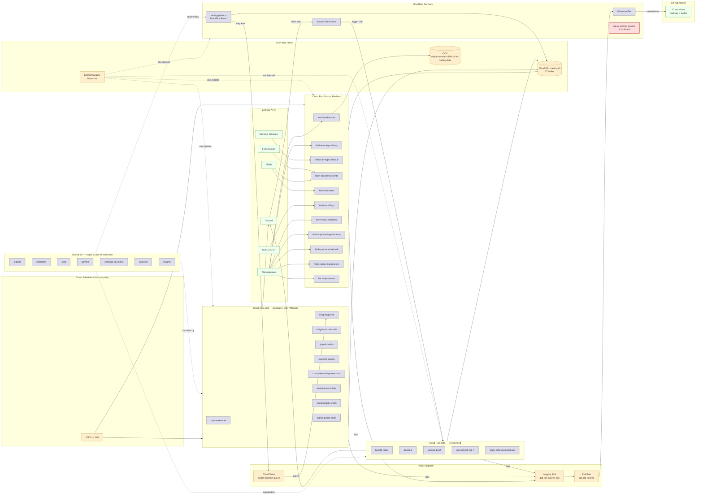

# ARCHITECTURE

## System overview

This is a private stocks-trading research and signal-delivery platform deployed on Google Cloud (project `adept-mountain-474619-d4`, region `us-east1`). It is single-user / small-team — there is no end-user account system, no public web auth, and no per-user data partitioning. The primary delivery surface is **Discord** (via webhooks for scheduled briefs and a Cloud Run service for slash-command interactions); a secondary delivery surface is the **internal React + FastAPI dashboard** at the `trading-platform` Cloud Run service.

The system runs as a fleet of **27 production Cloud Run Jobs** orchestrated by Cloud Scheduler. Most jobs follow a common shape: pull data from an external API (AlphaVantage, FRED, EDGAR, ForexFactory, Earnings Whispers), upsert to Cloud SQL Postgres (`trading-db`), optionally write a parquet snapshot to GCS (`adept-mountain-474619-d4-trading-data`), and exit. A second class of jobs (premarket-brief, insight-pipeline, signal-monitor, weekend-review, signal-quality-alarm) reads from Cloud SQL, computes derived analytics using shared `lib/` modules, and posts results to Discord.

Three cross-cutting capabilities sit alongside the job fleet: (1) a **failure-notifier** Cloud Run service that consumes a Pub/Sub topic fed by a Cloud Logging sink filtered for Cloud Run Job ERRORs, and creates labeled GitHub issues; (2) a **Cloud Tasks queue** (`insight-pipeline-queue`) that lets the FastAPI dashboard enqueue on-demand AI-insight refreshes; (3) a **GitHub Actions** layer that mirrors several jobs as backups and runs heavier integration suites (backtests, freshness audits, sheet downloads). Math is concentrated in `lib/` and consumed identically by Cloud Run Jobs, the FastAPI router, and CLI scripts — per `CLAUDE.md` "one source of truth for math."

## Component inventory

### Code modules

| Component | Type | Purpose | Depends on | Used by |
|---|---|---|---|---|
| [`gcp/database.py`](gcp/database.py) | code | Cloud SQL Connector → SQLAlchemy engine + `upsert_dataframe()` / `query_to_dataframe()` helpers | Cloud SQL `trading-db`, secrets `cloud-sql-connection-name`/`db-trading-user`/`db-trading-pass` | Every fetcher, brief, monitor, FastAPI router |
| [`gcp/gcs_utils.py`](gcp/gcs_utils.py) | code | Pandas → Parquet → GCS uploader | GCS bucket `adept-mountain-474619-d4-trading-data` | `fetch_market_data`, `migrate_to_gcp` |
| [`gcp/premarket_brief.py`](gcp/premarket_brief.py) | code | Pre-market brief generator (Strat, FTFC, levels, earnings reaction profile, Discord embed) | `lib.strat`, `lib.strat_levels`, `lib.indicators`, `lib.earnings_reactions`, Cloud SQL, Discord webhook | Scheduler `premarket-brief-daily` / `-sunday` |
| [`gcp/signal_monitor.py`](gcp/signal_monitor.py) | code | Real-time intraday signal monitor + ORB snapshots + level-break alerts | `lib.signals`, `lib.indicators`, AV intraday, Discord | Scheduler `signal-monitor-daily`, `orb-15m-alert`, `orb-30m-alert` |
| [`gcp/insight_pipeline_job.py`](gcp/insight_pipeline_job.py) | code | Multi-agent AI insights generator (scheduled batch + on-demand via Cloud Tasks) | `lib.insights`, `lib.agents`, Cloud SQL, Vertex / Anthropic API | Scheduler `insight-pipeline-daily`, FastAPI `/insights/.../refresh` |
| [`gcp/insight_discord_push.py`](gcp/insight_discord_push.py) | code | Reads `insight_reports`, posts daily digest to Discord | Cloud SQL, Discord webhook | Scheduler `insight-discord-push-daily` |
| [`gcp/weekend_review.py`](gcp/weekend_review.py) | code | Weekly trade-log review vs backtest expectations | Cloud SQL `trades` table, Discord | Scheduler `weekend-review-weekly` |
| [`gcp/auto_refresh_top_n.py`](gcp/auto_refresh_top_n.py) | code | Ranks tickers, enqueues top-N to Cloud Tasks for insight refresh | `lib.agents.ranker`, Cloud Tasks queue | Job `auto-refresh-top-n` |
| [`gcp/backfill_ticker.py`](gcp/backfill_ticker.py) | code | One-shot per-ticker backfill (daily + intraday + news + indicators) for `/replay` Discord command | All fetchers, Cloud SQL | Job `backfill-ticker` (Discord-triggered) |
| [`gcp/backtest_job.py`](gcp/backtest_job.py) | code | Runs `lib.backtest.StratBacktest` for `/backtest` Discord command | `lib.backtest`, Discord | Job `backtest` (Discord-triggered, 2 GiB) |
| [`gcp/validate_brief_job.py`](gcp/validate_brief_job.py) | code | Validates premarket brief accuracy for `/validate` Discord command | Cloud SQL, Discord | Job `validate-brief` |
| [`gcp/signal_quality_alarm.py`](gcp/signal_quality_alarm.py) | code | Compares trailing-7d clean-rate vs prior-7d, alarms on drop, exits non-zero on alarm so failure-notifier creates GitHub issue | Cloud SQL, Discord | Scheduler `signal-quality-alarm-daily` |
| [`gcp/apply_schema.py`](gcp/apply_schema.py) | code | One-shot schema migration runner (idempotent — every statement `IF NOT EXISTS`) | Cloud SQL, [`gcp/schema.sql`](gcp/schema.sql) | Job `apply-schema-migrations` |
| [`gcp/migrate_to_gcp.py`](gcp/migrate_to_gcp.py) | code | One-shot data migration: parquet → GCS + Cloud SQL | GCS, Cloud SQL | `./gcp/deploy.sh migrate` |
| [`gcp/fetchers/fetch_market_data.py`](gcp/fetchers/fetch_market_data.py) | code | Daily AV OHLCV + indicators; `--backfill` mode chains historical 10y bootstrap | AV API, Cloud SQL, GCS | Scheduler `fetch-market-data-daily` |
| [`gcp/fetchers/fetch_alphavantage_intraday.py`](gcp/fetchers/fetch_alphavantage_intraday.py) | code | Monthly full-month 1-min intraday snapshot | AV API, Cloud SQL | Scheduler `av-intraday-monthly` |
| [`gcp/fetchers/fetch_fred_rates.py`](gcp/fetchers/fetch_fred_rates.py) | code | DGS3MO risk-free rate (BSM Greeks input) | FRED API, Cloud SQL | Scheduler `fred-rates-daily` |
| [`gcp/fetchers/fetch_economic_events.py`](gcp/fetchers/fetch_economic_events.py) | code | Macro events (ForexFactory + FRED) | ForexFactory, FRED, Cloud SQL | Scheduler `economic-events-daily` |
| [`gcp/fetchers/fetch_earnings_calendar.py`](gcp/fetchers/fetch_earnings_calendar.py) | code | Upcoming earnings + Earnings Whispers strikes | EW credentials, Cloud SQL | Scheduler `earnings-calendar-daily` |
| [`gcp/fetchers/fetch_earnings_history.py`](gcp/fetchers/fetch_earnings_history.py) | code | AV EARNINGS quarterly history; chains `_run_backfill()` post-fetch | AV API, Cloud SQL | Scheduler `earnings-history-weekly` |
| [`gcp/fetchers/compute_earnings_reactions.py`](gcp/fetchers/compute_earnings_reactions.py) | code | Joins history × OHLCV → playability scores + archetype tags | Cloud SQL only | Scheduler `compute-earnings-reactions-daily` |
| [`gcp/fetchers/fetch_premarket_refresh.py`](gcp/fetchers/fetch_premarket_refresh.py) | code | 8:20 ET pre-open gap data refresh for ~50 tickers | AV API, Cloud SQL | Scheduler `premarket-refresh-daily` |
| [`gcp/fetchers/evaluate_ew_strikes.py`](gcp/fetchers/evaluate_ew_strikes.py) | code | Scores EW strike picks against intraday bars | Cloud SQL only | Scheduler `evaluate-ew-strikes-daily` |
| [`gcp/fetchers/fetch_sec_filings.py`](gcp/fetchers/fetch_sec_filings.py) | code | EDGAR 8-K/10-Q/10-K | EDGAR, Cloud SQL | Schedulers `sec-filings-{0700,1000,1300,1700}` |
| [`gcp/fetchers/fetch_insider_transactions.py`](gcp/fetchers/fetch_insider_transactions.py) | code | Form 4 insider buys/sells | AV API, Cloud SQL | Scheduler `insider-transactions-daily` |
| [`gcp/fetchers/fetch_top_movers.py`](gcp/fetchers/fetch_top_movers.py) | code | AV top movers post-close | AV API, Cloud SQL | Scheduler `top-movers-daily` |
| [`gcp/fetchers/fetch_news_sentiment.py`](gcp/fetchers/fetch_news_sentiment.py) | code | News sentiment (ticker mode + topic mode) | AV API, Cloud SQL | Schedulers `news-sentiment-{08..17}00`, `news-topics-{08..17}05` |
| [`gcp/fetchers/_watchlist.py`](gcp/fetchers/_watchlist.py) | code | Shared `load_watchlist()` helper (reads `watchlists` table) | Cloud SQL `watchlists` | All ticker-resolving fetchers |
| [`platform/api/main.py`](platform/api/main.py) | code | FastAPI app entry; mounts 13 routers | All `lib/`, Cloud SQL | Cloud Run service `trading-platform` |
| [`platform/api/routers/insights.py`](platform/api/routers/insights.py) | code | AI insights CRUD; `/refresh` enqueues Cloud Tasks | Cloud Tasks `insight-pipeline-queue`, Cloud SQL | FastAPI |
| [`platform/api/routers/*.py`](platform/api/routers/) | code | 12 other routers (live, options, playbook, backtest, signals, journal, dashboard, catalysts, admin, analytics, config, health) | Cloud SQL, `lib/` | FastAPI |
| [`platform/src/main.tsx`](platform/src/main.tsx) | code | React app entry (renders into `#root`) | `platform/src/App.tsx` | Browser via `trading-platform` service |
| [`lib/signals.py`](lib/signals.py) | code | 3-of-5 condition scoring for CALL/PUT signals | `lib.indicators`, `lib.strat` | `signal_monitor`, FastAPI, fetchers |
| [`lib/indicators.py`](lib/indicators.py) | code | Pure indicator math (Wilder's RSI/EMA/ATR/VWAP/Stoch) | — | `signals`, `strat`, fetchers, FastAPI |
| [`lib/gamma.py`](lib/gamma.py) | code | Canonical GEX/VEX (single source of truth) | `lib.options_greeks` | FastAPI options router |
| [`lib/strat.py`](lib/strat.py) | code | Rob Smith Strat (1/2U/2D/3, combos, FTFC) | `lib.indicators` | `premarket_brief`, `signal_monitor`, FastAPI |
| [`lib/earnings_reactions.py`](lib/earnings_reactions.py) | code | Post-earnings playability + archetype | — | `compute_earnings_reactions`, `premarket_brief` |
| [`lib/strat_levels.py`](lib/strat_levels.py) | code | Support/resistance levels from chart structure | `lib.indicators` | `premarket_brief`, `signal_monitor` |
| [`lib/backtest.py`](lib/backtest.py) | code | Walk-forward backtester | `lib.signals`, `lib.indicators` | `backtest_job`, GitHub Actions |
| [`lib/options_greeks.py`](lib/options_greeks.py) | code | Black-Scholes Greeks | — | `lib.gamma`, FastAPI |
| [`lib/insights.py`](lib/insights.py) | code | AI insights agent pipeline | Anthropic / Vertex SDK | `insight_pipeline_job` |
| [`lib/data_loader.py`](lib/data_loader.py) | code | Cloud SQL / parquet loader | `gcp.database` | All consumers |
| [`lib/config.py`](lib/config.py) | code | `IndicatorConfig`, `SignalConfig`, `StratConfig` | `alert_config.json`, env | Everywhere |
| [`gcp/deploy.sh`](gcp/deploy.sh) | code (ops) | One-stop deploy: builds image, creates/updates 27 Jobs + 4 Services + 28+ Schedulers + Pub/Sub + Cloud Tasks queue | gcloud CLI | Manual ops |
| [`gcp/schema.sql`](gcp/schema.sql) | code (ops) | All `CREATE TABLE IF NOT EXISTS` statements (27 tables) | — | `apply_schema.py` |

### GCP resources

| Component | Type | Purpose | Depends on | Used by |
|---|---|---|---|---|
| `trading-db` | Cloud SQL (Postgres) | Single instance, holds all 27 trading tables | — | Every Cloud Run Job, FastAPI |
| `adept-mountain-474619-d4-trading-data` | GCS Bucket | Parquet snapshots (raw OHLCV, intraday, options) | — | `fetch_market_data`, `migrate_to_gcp` |
| `adept-mountain-474619-d4_cloudbuild` | GCS Bucket | Cloud Build source archive (auto-managed) | — | `gcloud builds submit` |
| `trading` Artifact Registry | Docker repo | Holds `trading-system` image (one image, all jobs) | Cloud Build | All Cloud Run Jobs + Services |
| `gcr.io` Artifact Registry | Docker repo | Legacy GCR (likely auto-created) | — | Unknown — see Reconciliation |
| `insight-pipeline-queue` | Cloud Tasks Queue | On-demand insight refresh enqueueing | — | FastAPI `/insights/.../refresh` → `insight-pipeline` Job |
| `gcp-job-failures` | Pub/Sub Topic | Receives Logging sink output for failed Cloud Run Jobs | `gcp-job-failures-sink` | `failure-notifier` service |
| `gcp-job-failures-dlq` | Pub/Sub Topic | Dead-letter for `gcp-job-failures-push` | — | Pub/Sub subscription DLQ |
| `gcp-job-failures-push` | Pub/Sub Subscription | Push subscription → `failure-notifier` Cloud Run | `gcp-job-failures` topic | `failure-notifier` service |
| `gcp-job-failures-sink` | Cloud Logging Sink | Filters `severity>=ERROR AND resource.type=cloud_run_job AND job_name!=failure-notifier` → Pub/Sub | — | Pub/Sub topic |
| `_Default` / `_Required` Logging | Log Buckets + Sinks | GCP-managed default log retention | — | All services (auto) |
| 19 Secret Manager secrets | Secret Manager | Credentials + config (see Resource references below) | — | Cloud Run Jobs (env injection in `deploy.sh`) |
| `trading-platform` | Cloud Run Service | FastAPI dashboard backend | `lib/`, Cloud SQL | Browser via React app |
| `discord-interactions` | Cloud Run Service | Discord slash-command HTTP endpoint | Discord public key, Cloud Tasks | Discord |
| `failure-notifier` | Cloud Run Service | Pub/Sub-driven GitHub-issue creator | `github-pat`, `github-repo` secrets | Pub/Sub push subscription |
| `signal-monitor` | Cloud Run Service | **Likely orphaned** — see Reconciliation | — | Unknown |
| `trading-runner` | Service Account | Runtime identity for Cloud Run Jobs | — | All Jobs |
| `playwright-tester` | Service Account | E2E test runner | — | GitHub Actions |
| `github-actions-sheets` | Service Account | Google Sheets download workflow | — | `download-google-sheets.yml` |
| `28960574877-compute@developer` | Service Account | Default Compute SA | — | Default builds |
| 27 Cloud Run Jobs | Cloud Run | Scheduled / on-demand processing | Cloud SQL, AV/FRED/EDGAR/EW, Discord | Cloud Scheduler (most), Cloud Tasks (insight-pipeline), manual (apply-schema-migrations, backtest, validate-brief, backfill-ticker) |
| 28+ Cloud Scheduler jobs | Cloud Scheduler | Cron triggers for Run Jobs | Cloud Run Jobs | Cloud Run Job invocation API |
| `billing_export` BigQuery Dataset | BigQuery | GCP billing export (auto-populated) | — | None in this repo (use for `/cost` analytics if added) |

## Data flow

### Daily nightly write path (post-close 11 PM ET)

1. **Cloud Scheduler** fires `fetch-market-data-daily` (cron `0 23 * * 1-5`) → invokes the `fetch-market-data` Cloud Run Job's `:run` endpoint.
2. The job ([`gcp/fetchers/fetch_market_data.py`](gcp/fetchers/fetch_market_data.py)) authenticates to Cloud SQL via the **Cloud SQL Python Connector** (using secrets `cloud-sql-connection-name`, `db-trading-user`, `db-trading-pass`), pulls AV `TIME_SERIES_DAILY_ADJUSTED` for ~25 tickers (watchlist + earnings-window + top movers), computes indicators via `lib/indicators.py`, and **upserts to `market_data_daily`** (`ON CONFLICT (ticker, date) DO UPDATE`).
3. In parallel, the same scheduler fires `compute-earnings-reactions-daily` and `evaluate-ew-strikes-daily`, which read `earnings_history × market_data_daily × earnings_calendar` and write `earnings_reactions` / `earnings_calendar.ew_*` columns respectively.
4. A parquet snapshot of the day's OHLCV is uploaded to `gs://adept-mountain-474619-d4-trading-data/raw/...` via [`gcp/gcs_utils.py`](gcp/gcs_utils.py).

### Daily morning read path (pre-market 7-9 AM ET)

1. **7:00 AM ET** — `economic-events-daily` populates `economic_events`.
2. **7:00 AM ET** — `insider-transactions-daily` populates `insider_transactions`.
3. **7:15 AM ET** — `earnings-calendar-daily` refreshes `earnings_calendar` with today's reporters.
4. **8:20 AM ET** — `premarket-refresh-daily` ([`gcp/fetchers/fetch_premarket_refresh.py`](gcp/fetchers/fetch_premarket_refresh.py)) polls AV intraday for ~50 tickers and writes `gap_pct`, `pre_high`, `pre_low`, `pre_vwap` to `market_data_daily`.
5. **8:30 AM ET** — `premarket-brief-daily` ([`gcp/premarket_brief.py`](gcp/premarket_brief.py)) reads everything, runs `lib.strat.compute_strat_status`, `lib.strat_levels.build_level_map`, `lib.earnings_reactions.conditional_lean_summary`, formats a multi-embed Discord message, posts via the `discord-webhook` secret, and persists the analysis to `premarket_analysis`.
6. **8:45 AM ET** — `insight-pipeline-daily` runs the multi-agent AI pipeline for SPY/IWM/QQQ; results land in `insight_runs` + `insight_reports`.
7. **9:15 AM ET** — `insight-discord-push-daily` reads the morning's `insight_reports` and pushes the digest to Discord.
8. **9:25 AM ET** — `signal-monitor-daily` ([`gcp/signal_monitor.py`](gcp/signal_monitor.py)) starts the rolling 60-second loop until 4:00 PM ET, polling AV intraday and posting CALL/PUT alerts when conditions clear thresholds. ORB snapshots fire as separate scheduler invocations at 9:45 (15m) and 10:00 (30m).

### On-demand AI insight refresh (Cloud Tasks)

1. User clicks "Refresh insight" in the React dashboard.
2. Browser → `trading-platform` Cloud Run Service → [`platform/api/routers/insights.py`](platform/api/routers/insights.py) `POST /api/insights/report/{ticker}/refresh`.
3. Router enqueues a task on `insight-pipeline-queue` (Cloud Tasks) targeting the `insight-pipeline` Job's `:run` endpoint with env vars `INSIGHT_RUN_ID` + `INSIGHT_TICKER`.
4. Cloud Tasks delivers the task; the Job picks up the override env, runs a single-ticker pipeline, and writes one row to `insight_reports` / `insight_runs`. Max-attempts=2 guards against transient failures; max-concurrent-dispatches=5 caps parallelism.

### Failure notification

1. Any Cloud Run Job exits non-zero or logs `severity>=ERROR`.
2. **`gcp-job-failures-sink`** Cloud Logging sink filters those entries and writes them to the **`gcp-job-failures`** Pub/Sub topic.
3. **`gcp-job-failures-push`** push subscription delivers each message to the **`failure-notifier`** Cloud Run service.
4. The service uses `github-pat` + `github-repo` secrets to create a labeled GitHub issue (`workflow-failure,...,automated`) with the failed job name, run URL, and last 50 log lines (per [`CLAUDE.md`](CLAUDE.md) Automated Workflow Failure Handling spec).
5. `signal-quality-alarm` is a **deliberate** failure-emitter: it exits non-zero when the trailing-7d clean-rate drops more than 3 pp, so the same pipeline auto-creates a quality-alarm issue.

### Discord slash-command path

1. Discord sends an interaction (e.g. `/replay TICKER`) to **`discord-interactions`** Cloud Run Service (port 8080).
2. The service verifies the request via the `discord-public-key` secret, then invokes the appropriate Cloud Run Job (`backfill-ticker`, `backtest`, `validate-brief`) via the Run API.
3. The triggered Job posts results back to Discord via `discord-webhook`.

## Architecture diagram

## Reconciliation flags

### Inventory resources with no clear repo reference (possibly orphaned — review)

> **Verified 2026-05-02** via `gcloud run services describe` / `jobs describe` and `gcloud scheduler jobs list`. Findings annotated below.

1. **Cloud Run Service `signal-monitor`** (created 2026-02-23) — **CONFIRMED BROKEN.** `Ready: False` with message *"The user-provided container failed to start and listen on the port defined provi..."*. Has no URL, no traffic, no working revision. The Cloud Run **Job** of the same name (`gcp/signal_monitor.py`) is the active surface. **Action: safe to delete.**
2. **Cloud Run Job `fetch-av-options-backfill`** (created 2026-04-12) — **NOT ORPHANED.** Survey miss: maps to existing module [`gcp/fetchers/fetch_av_historical_options.py`](gcp/fetchers/fetch_av_historical_options.py). Job command: `python -m gcp.fetchers.fetch_av_historical_options --tickers SPY IWM QQQ SPX --start-date 2016-04-10 --end-date 2026-04-11`. One-shot historical options backfill.
3. **Cloud Run Job `fetch-earnings-options`** (created 2026-04-26) — **CONFIRMED BROKEN.** Job command is `python -m gcp.fetchers.fetch_earnings_options` but no such module exists in the repo (verified via `find gcp -name "*earnings_options*"`). Every execution would `ModuleNotFoundError`. No scheduler binding. **Action: safe to delete.**
4. **Artifact Registry repository `gcr.io`** — **NOT LEGACY.** [`platform/deploy.sh:11`](platform/deploy.sh) pushes the platform service image there: `IMAGE="gcr.io/${PROJECT_ID}/${SERVICE}"`. The Cloud Run Jobs use the `trading` repo in `us-east1`; the platform service uses `gcr.io`. Two parallel image paths.
5. **Secret `trading-db-pass`** — **NOT A DUPLICATE.** Used by [`platform/deploy.sh:15`](platform/deploy.sh) for the FastAPI service's DB password. [`gcp/deploy.sh`](gcp/deploy.sh) uses `db-trading-pass` for the Cloud Run Jobs. Two parallel deploy paths, two separate secrets — could be unified for cleaner ops, but neither is orphan.
6. **Secret `gh-stocks-repo-pat`** — **NOT A DUPLICATE.** [`gcp/deploy.sh:1028`](gcp/deploy.sh) reads `gh-stocks-repo-pat` from this same project as a **bootstrap source** for creating `github-pat` on a fresh deploy. Removing it would break the bootstrap path.
7. **Secret `gcs-trading-bucket`** — **CONFIRMED ORPHAN.** Written by [`gcp/setup_cloud_sql.sh:195`](gcp/setup_cloud_sql.sh) but never read by any code (verified: zero matches for `GCS_TRADING_BUCKET` or `gcs-trading-bucket` outside the setup script). Runtime takes the bucket name as a function argument; callers pass `f"{PROJECT_ID}-trading-data"` or `os.environ.get('GCS_BUCKET')`. **Deleted 2026-05-02.**
8. **`billing_export` BigQuery Dataset + 2 tables** — GCP billing export, auto-populated; no code in this repo queries it. Not an orphan, but is unused capacity for future cost-analysis features.
9. **3 GitHub Actions–created service accounts (`playwright-tester`, `github-actions-sheets`)** — referenced in workflow YAMLs only; no Python code touches them. Not orphaned, but flagged here so you know they exist.
10. **511 `run.googleapis.com/Execution` entries in inventory** — these are historical job-run records (one per scheduled execution since the project started). Not infrastructure to manage, but they pad the inventory; ignore.

### Resources the code references that are NOT in the inventory

1. **Cloud Scheduler jobs** — [`gcp/deploy.sh`](gcp/deploy.sh) creates scheduler entries that are not surfaced by the default Cloud Asset Inventory dump. **Verified separately on 2026-05-02 via `gcloud scheduler jobs list`: 49 scheduler jobs, all ENABLED, no drift detected.** Full listing in [`gcp_schedulers.json`](gcp_schedulers.json) (gitignored). The 49 vs the previously-estimated "28+" reflects the hourly `news-sentiment-{0800..1700}` and `news-topics-{0805..1705}` loops being expanded as 10 entries each rather than counted as one cron expression.
2. **Vertex AI / Anthropic API endpoints** — `lib/insights.py` and the agents pipeline call out to either Vertex Gemini or Anthropic Claude (model routing config in `model_routing` table). These are external endpoints with no GCP resource representation; flagged so you know the dependency exists.
3. **GitHub Pages deployment target** — `.github/workflows/deploy-trading-apps.yml` deploys chart-viewer / options-heatseeker to GitHub Pages. Not a GCP resource.
4. **`google-apps-script/`** — directory exists in repo with sheet automation scripts, but Google Apps Script projects are not GCP resources; they live under script.google.com. Mentioned because [`CLAUDE.md`](CLAUDE.md) calls them out as part of the system.
5. ~~`benzinga-api-key` secret~~ — **resolved.** Used by [`platform/api/routers/catalysts.py:79`](platform/api/routers/catalysts.py) and [`scripts/fetch_catalyst_calendar.py:112`](scripts/fetch_catalyst_calendar.py). Active.

## Open questions

1. ~~`fetch-av-options-backfill` and `fetch-earnings-options` Jobs~~ — **resolved.** Backfill is real (maps to `fetch_av_historical_options.py`); earnings-options is broken (missing module).
2. ~~Cloud Scheduler completeness~~ — **resolved.** 49 schedulers verified, all enabled.
3. ~~`signal-monitor` Service vs Job~~ — **resolved.** Service is broken (`Ready: False`).
4. ~~`benzinga-api-key` consumer~~ — **resolved.** Used by FastAPI catalysts router + catalyst calendar script.
5. ~~`gcr.io` Artifact Registry repo~~ — **resolved.** Active target for `platform/deploy.sh`.
6. ~~`fetch-news-sentiment-topics` Job~~ — **resolved.** Both `fetch-news-sentiment` and `fetch-news-sentiment-topics` jobs run the same module (`python -m gcp.fetchers.fetch_news_sentiment`) with no args; mode differentiation is via env vars. Two job entries, one Python module — unusual but intentional.
7. ~~Duplicate secrets~~ — **resolved.** `trading-db-pass` is the platform service's DB secret (parallel to `db-trading-pass` used by jobs). `gh-stocks-repo-pat` is a bootstrap source for `github-pat`. Both pairs are intentional.
8. **Unification opportunity** — `db-trading-pass` and `trading-db-pass` hold the same DB password under different secret names because they're populated by different deploy scripts. Consolidating to one secret would simplify ops at the cost of a one-time platform redeploy.
