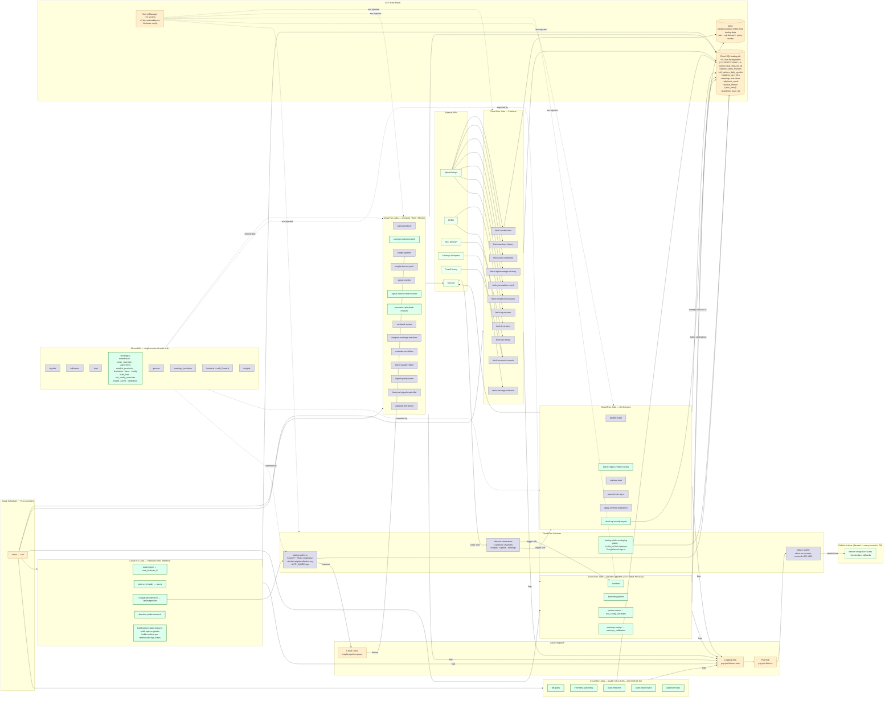

# ARCHITECTURE

> **Last refreshed:** 2026-06-23 — full inventory regen after the May 22 → June 23 wave: **Firebase auth end-to-end + per-user scoping** (#623 platform-auth, #626 per-user journal, #635 per-user watchlist), the **strat-directionality engine** replacing the deprecated P7b classifier (#622, #639, #646), the **magnitude inference pipeline** going live (#625, #629, #637), the **3-phase structure-continuation / Movement Read** rollout behind feature flags (#647 Phase 1, #649 Phase 2, #650 Phase 3), **materialized-view perf jobs** for options/GEX/earnings (#600, #613, #624), **realtime options** ingestion + 30-day retention (#ce0dcd0, #dac40f3), and the **GHA → Cloud Run** migration of db-query / freshness-watchdog / audit jobs (2026-05-30 outage response).
>
> _Previous refresh: 2026-05-22 (PR #510 `/replay-signals`, #511 playbook resolver, #512 self-healing indicators, #513 backtest pipeline → GCP, #514 earnings-reactions brief, #532 earnings $-attribution)._

## System overview

This is a private stocks-trading research and signal-delivery platform deployed on Google Cloud (project `adept-mountain-474619-d4`, region `us-east1`). The primary delivery surface is **Discord** (via **three routed webhook channels** — insights, signals, earnings — see Discord channel routing below); a secondary delivery surface is the **React + FastAPI dashboard** at the `trading-platform` Cloud Run service. As of June 2026 the dashboard is **multi-user**: it has a real authentication layer (`platform/api/auth.py` `AUTH_MODE` middleware — `firebase` / `iap` / `open`) and **per-user data partitioning** for the trade journal (`journal_entries.user_email`) and watchlist (`watchlists.user_id`). Production is currently served behind **Cloud IAP**; **Firebase email/Google sign-in** is live on a separate public `trading-platform-staging` service and is the planned production auth once the GCIP authorized-domain flip lands. See the **Authentication** data-flow section below.

The system runs as a fleet of **~62 production Cloud Run Jobs** orchestrated by Cloud Scheduler (**~77 cron entries** in `gcp/deploy.sh` once the two hourly news loops are expanded — verified 2026-06-23). Most jobs follow a common shape: pull data from an external API (AlphaVantage, FRED, EDGAR, ForexFactory, Earnings Whispers, Benzinga), upsert to Cloud SQL Postgres (`trading-db`), optionally write a parquet snapshot to GCS (`adept-mountain-474619-d4-trading-data`), and exit. A second class of jobs (premarket-brief, earnings-reactions-brief, insight-pipeline, signal-monitor, signal-monitor-eod-resolver, premarket-playbook-resolver, weekend-review, signal-quality-alarm, signal-replay, historical-signals-watchlist, calibrate-thresholds, param-sweep, earnings-sweep) reads from Cloud SQL, computes derived analytics using shared `lib/` modules, and posts results to Discord or writes back to calibration tables. A third, newer class are **research / ML-inference jobs** — `strat-engine` (Strat directionality features → `strat_features_<tf>`), `magnitude-inference` (live per-bar magnitude predictions), and `direction-probe` (offline research) — plus **materialized-view builders** (`build-options-daily-features`, `build-options-greeks`, `build-realtime-gex`, `refresh-earnings-views`) that pre-compute heavy aggregates so request-time and signal-time paths never full-scan the large options tables (CLAUDE.md Rule 0). The backtest pipeline is fully GCP-native — see Backtest pipeline below.

Three cross-cutting capabilities sit alongside the job fleet: (1) a **failure-notifier** Cloud Run service that consumes a Pub/Sub topic fed by a Cloud Logging sink filtered for Cloud Run Job ERRORs, and creates labeled GitHub issues; (2) a **Cloud Tasks queue** (`insight-pipeline-queue`) that lets the FastAPI dashboard enqueue on-demand AI-insight refreshes; (3) a thinned **GitHub Actions** layer that runs heavier integration suites and break-glass manual fallbacks — several formerly-GHA workloads (ad-hoc Cloud SQL access, freshness-watchdog, walk-forward and brief-bias audits) **migrated to Cloud Run Jobs on 2026-05-30** after a GHA-platform outage. Ad-hoc Cloud SQL access is now the `db-query` Cloud Run Job driven by [`scripts/db_query_cr.sh`](scripts/db_query_cr.sh) (the old `db-query.yml` workflow is deleted). Math is concentrated in `lib/` and consumed identically by Cloud Run Jobs, the FastAPI router, and CLI scripts — per `CLAUDE.md` "one source of truth for math."

## Component inventory

### Code modules

| Component | Type | Purpose | Depends on | Used by |
|---|---|---|---|---|
| [`gcp/database.py`](gcp/database.py) | code | Cloud SQL Connector → SQLAlchemy engine + `upsert_dataframe()` / `query_to_dataframe()` helpers | Cloud SQL `trading-db`, secrets `cloud-sql-connection-name`/`db-trading-user`/`db-trading-pass` | Every fetcher, brief, monitor, FastAPI router |
| [`gcp/gcs_utils.py`](gcp/gcs_utils.py) | code | Pandas → Parquet → GCS uploader | GCS bucket `adept-mountain-474619-d4-trading-data` | `fetch_market_data`, `migrate_to_gcp` |
| [`gcp/premarket_brief.py`](gcp/premarket_brief.py) | code | Pre-market brief generator (Strat, FTFC, levels, earnings reaction profile, **brief-bias playability scores** from PR #532, Discord embed) | `lib.strat`, `lib.strat_levels`, `lib.indicators`, `lib.earnings_reactions`, `lib.strategies.brief_bias`, Cloud SQL, Discord `insights` webhook | Scheduler `premarket-brief-daily` / `-sunday` |
| [`gcp/brief_explanations.py`](gcp/brief_explanations.py) | code | **NEW (PR #532)** — LLM-generated natural-language explanations attached to each premarket-brief recommendation; co-resident with `premarket_brief.py` | Anthropic/Vertex SDK, Cloud SQL | `premarket_brief.py` |
| [`gcp/earnings_reactions_brief.py`](gcp/earnings_reactions_brief.py) | code | **NEW (PR #514)** — 8:35 AM ET Discord embed ranking the day's reporters by historical post-earnings playability + archetype; posts to dedicated earnings channel | `lib.earnings_reactions`, `lib.strategies.brief_bias`, Cloud SQL, Discord `earnings` webhook | Scheduler `earnings-reactions-brief-daily` |
| [`gcp/signal_monitor.py`](gcp/signal_monitor.py) | code | Real-time intraday signal monitor + ORB snapshots + level-break alerts; posts to dedicated signals Discord channel | `lib.signals`, `lib.strategies`, `lib.indicators`, AV intraday, Discord `signals` webhook | Scheduler `signal-monitor-daily`, `orb-15m-alert`, `orb-30m-alert` |
| [`gcp/signal_monitor_eod_resolver.py`](gcp/signal_monitor_eod_resolver.py) | code | **NEW (PR #512)** — 4:30 PM ET reconciler: walks the day's `signal_alerts`, replays intraday bars to record `target_hit/stop_hit/eod_close` outcome columns | Cloud SQL `signal_alerts`, `market_data_intraday`, `lib.strategies.exit_config_overrides` | Scheduler `signal-monitor-eod-resolver-daily` |
| [`gcp/premarket_playbook_resolver.py`](gcp/premarket_playbook_resolver.py) | code | **NEW (PR #511)** — 4:30 PM ET reconciler: walks RTH 1-min bars for each (analysis_date, ticker) in `premarket_analysis`, records `trigger_hit/target_hit/stop_hit` outcomes to `premarket_analysis_history` | Cloud SQL, `market_data_intraday` | Scheduler `premarket-playbook-resolver-daily` |
| [`gcp/signal_replay.py`](gcp/signal_replay.py) | code | **NEW (PR #510)** — `/replay-signals` Discord slash command backend: re-posts stored `signal_alerts` for a date + ET time block to the signals Discord channel | Cloud SQL, Discord `signals` webhook | Job `signal-replay` (Discord-triggered) |
| [`gcp/insight_pipeline_job.py`](gcp/insight_pipeline_job.py) | code | Multi-agent AI insights generator (scheduled batch + on-demand via Cloud Tasks) | `lib.insights`, `lib.agents`, `lib.strategies.insight_cache`, Cloud SQL, Vertex / Anthropic API | Scheduler `insight-pipeline-daily`, FastAPI `/insights/.../refresh` |
| [`gcp/insight_discord_push.py`](gcp/insight_discord_push.py) | code | Reads `insight_reports`, posts daily digest to Discord `insights` channel | Cloud SQL, Discord webhook | Scheduler `insight-discord-push-daily` |
| [`gcp/weekend_review.py`](gcp/weekend_review.py) | code | Weekly trade-log review vs backtest expectations | Cloud SQL `trades` table, Discord | Scheduler `weekend-review-weekly` |
| [`gcp/auto_refresh_top_n.py`](gcp/auto_refresh_top_n.py) | code | Ranks tickers, enqueues top-N to Cloud Tasks for insight refresh | `lib.agents.ranker`, Cloud Tasks queue | Job `auto-refresh-top-n` |
| [`gcp/backfill_ticker.py`](gcp/backfill_ticker.py) | code | One-shot per-ticker backfill (daily + intraday + news + indicators) for `/replay` Discord command | All fetchers, Cloud SQL | Job `backfill-ticker` (Discord-triggered) |
| [`gcp/backtest_job.py`](gcp/backtest_job.py) | code | Runs `lib.backtest.StratBacktest` for `/backtest` Discord command; writes to `backtest_runs/_trades/_sweeps` (PR #513). Job is now sized 8 GiB / 8h timeout (PR #515) | `lib.backtest`, `lib.walk_forward`, Cloud SQL `backtest_*` tables, Discord | Job `backtest` (Discord-triggered), `backtest-pipeline` (walk-forward orchestrator), `param-sweep` (on-demand) |
| [`gcp/validate_brief_job.py`](gcp/validate_brief_job.py) | code | Validates premarket brief accuracy for `/validate` Discord command | Cloud SQL, Discord | Job `validate-brief` |
| [`gcp/signal_quality_alarm.py`](gcp/signal_quality_alarm.py) | code | Compares trailing-7d clean-rate vs prior-7d, alarms on drop, exits non-zero on alarm so failure-notifier creates GitHub issue. Posts to signals channel. | Cloud SQL, Discord `signals` webhook | Scheduler `signal-quality-alarm-daily` |
| [`gcp/historical_signals.py`](gcp/historical_signals.py) | code | Backing module for `historical-signals-watchlist` Job; thin wrapper over `scripts.run_historical_signals` for the daily 1 AM 90-day backfill | Cloud SQL, `scripts.run_historical_signals` | Job `historical-signals-watchlist` |
| [`gcp/sql_export_to_gcs.py`](gcp/sql_export_to_gcs.py) | code | **NEW** — gzipped `pg_dump` exporter; wired to `cloud-sql-weekly-export` Cloud Run Job (Sunday 04:00 UTC) writing to `gs://${PROJECT_ID}-trading-data/sql-dumps/` (closes the third backup layer per CLAUDE.md backup posture) | Cloud SQL, GCS | Scheduler `cloud-sql-weekly-export-weekly` |
| [`gcp/trade_logger.py`](gcp/trade_logger.py) | code | Trade-log persistence helper used by `weekend-review` and on-demand validation paths | Cloud SQL `trades` table | `weekend_review.py`, `validate_brief_job.py` |
| [`gcp/apply_schema.py`](gcp/apply_schema.py) | code | One-shot schema migration runner (idempotent — every statement `IF NOT EXISTS`) | Cloud SQL, [`gcp/schema.sql`](gcp/schema.sql) | Job `apply-schema-migrations` |
| [`gcp/migrate_to_gcp.py`](gcp/migrate_to_gcp.py) | code | One-shot data migration: parquet → GCS + Cloud SQL | GCS, Cloud SQL | `./gcp/deploy.sh migrate` |
| [`scripts/calibrate_thresholds.py`](scripts/calibrate_thresholds.py) | code | Quarterly per-ticker threshold calibration; writes `ticker_calibration` (RSI ranges + per-strategy MIN_CONDITIONS); manual override always available | Cloud SQL, `lib/strategies/calibration.py` | Cloud Run Job `calibrate-thresholds`, Scheduler `calibrate-thresholds-quarterly` (cron `0 2 1 1,4,7,10 *`) |
| [`scripts/run_historical_signals.py`](scripts/run_historical_signals.py) | code | Daily 1am batch backfill of 90-day historical `signal_alerts` for the watchlist; also catches up newly-added watchlist tickers same day | Cloud SQL `market_data_intraday_*` partitions, `lib.strategies` | Cloud Run Job `historical-signals-watchlist`, Scheduler `historical-signals-watchlist-daily` (cron `0 1 * * 2-6`) |
| [`scripts/maintenance/compute_spx_greeks.py`](scripts/maintenance/compute_spx_greeks.py) | code | One-shot SPX historical Greeks backfill for `gex_snapshots`; manual one-shot, 12h timeout, no scheduler binding | Cloud SQL, `lib.options_greeks`, `lib.gamma` | Cloud Run Job `compute-spx-greeks-backfill` (manual `gcloud run jobs execute`) |
| [`gcp/fetchers/fetch_market_data.py`](gcp/fetchers/fetch_market_data.py) | code | Daily AV OHLCV + indicators; `--backfill` mode chains historical 10y bootstrap | AV API, Cloud SQL, GCS | Scheduler `fetch-market-data-daily` |
| [`gcp/fetchers/fetch_alphavantage_intraday.py`](gcp/fetchers/fetch_alphavantage_intraday.py) | code | Monthly full-month 1-min intraday snapshot | AV API, Cloud SQL | Scheduler `av-intraday-monthly` |
| [`gcp/fetchers/fetch_fred_rates.py`](gcp/fetchers/fetch_fred_rates.py) | code | DGS3MO risk-free rate (BSM Greeks input) | FRED API, Cloud SQL | Scheduler `fred-rates-daily` |
| [`gcp/fetchers/fetch_economic_events.py`](gcp/fetchers/fetch_economic_events.py) | code | Macro events (ForexFactory + FRED) | ForexFactory, FRED, Cloud SQL | Scheduler `economic-events-daily` |
| [`scripts/fetch_earnings_calendar.py`](scripts/fetch_earnings_calendar.py) | code | Upcoming earnings + Earnings Whispers strikes (verified 2026-05-01: Cloud Run Job actually invokes `python scripts/fetch_earnings_calendar.py`, no `gcp/fetchers/` variant exists) | EW credentials, Cloud SQL | Scheduler `earnings-calendar-daily` |
| [`gcp/fetchers/fetch_earnings_history.py`](gcp/fetchers/fetch_earnings_history.py) | code | AV EARNINGS quarterly history; chains `_run_backfill()` post-fetch | AV API, Cloud SQL | Scheduler `earnings-history-weekly` |
| [`gcp/fetchers/compute_earnings_reactions.py`](gcp/fetchers/compute_earnings_reactions.py) | code | Joins history × OHLCV → playability scores + archetype tags | Cloud SQL only | Scheduler `compute-earnings-reactions-daily` |
| [`gcp/fetchers/fetch_premarket_refresh.py`](gcp/fetchers/fetch_premarket_refresh.py) | code | 8:20 ET pre-open gap data refresh for ~50 tickers | AV API, Cloud SQL | Scheduler `premarket-refresh-daily` |
| [`gcp/fetchers/evaluate_ew_strikes.py`](gcp/fetchers/evaluate_ew_strikes.py) | code | Scores EW strike picks against intraday bars | Cloud SQL only | Scheduler `evaluate-ew-strikes-daily` |
| [`gcp/fetchers/fetch_sec_filings.py`](gcp/fetchers/fetch_sec_filings.py) | code | EDGAR 8-K/10-Q/10-K | EDGAR, Cloud SQL | Schedulers `sec-filings-{0700,1000,1300,1700}` |
| [`gcp/fetchers/fetch_insider_transactions.py`](gcp/fetchers/fetch_insider_transactions.py) | code | Form 4 insider buys/sells | AV API, Cloud SQL | Scheduler `insider-transactions-daily` |
| [`gcp/fetchers/fetch_top_movers.py`](gcp/fetchers/fetch_top_movers.py) | code | AV top movers post-close | AV API, Cloud SQL | Scheduler `top-movers-daily` |
| [`gcp/fetchers/fetch_news_sentiment.py`](gcp/fetchers/fetch_news_sentiment.py) | code | News sentiment (ticker mode + topic mode) | AV API, Cloud SQL | Schedulers `news-sentiment-{08..17}00`, `news-topics-{08..17}05` |
| [`gcp/fetchers/_watchlist.py`](gcp/fetchers/_watchlist.py) | code | Shared `load_watchlist()` helper (reads `watchlists` table) | Cloud SQL `watchlists` | All ticker-resolving fetchers |
| [`gcp/fetchers/fetch_rss_news.py`](gcp/fetchers/fetch_rss_news.py) | code | RSS + FinViz news collector → FinBERT (CPU) bulk sentiment + Gemini Flash for top articles; per-watchlist-ticker | RSS feeds, FinViz, `lib.ticker_info`, FinBERT, Vertex Gemini | **NOT YET DEPLOYED** — exists in repo, no `gcp/deploy.sh` block, no scheduler binding (see Reconciliation §12) |
| [`gcp/fetchers/fetch_av_historical_options.py`](gcp/fetchers/fetch_av_historical_options.py) | code | Historical options chain backfill (SPY/IWM/QQQ/SPX from 2016 onward). Now driven by daily scheduler `av-options-daily` (replaced GH workflow per PR #489) | AV API, Cloud SQL `etf_options_snapshots` | Cloud Run Job `fetch-av-options-backfill`, Scheduler `av-options-daily` (9 PM ET) |
| [`gcp/fetchers/fetch_av_earnings_options_backfill.py`](gcp/fetchers/fetch_av_earnings_options_backfill.py) | code | **NEW** — mirrors `fetch_av_historical_options` but for the earnings-window symbol set; backfills `earnings_options_snapshots` | AV API, Cloud SQL `earnings_options_snapshots` | Cloud Run Job `fetch-av-earnings-options-backfill` (on-demand) |
| [`gcp/fetchers/backfill_daily_indicators.py`](gcp/fetchers/backfill_daily_indicators.py) | code | **NEW (PR #461)** — self-healing indicator coverage: auto-discovers NULL `atr_14/rsi_14/macd/ema_*/bb_*` columns in `market_data_daily` and recomputes them | `lib.indicators`, Cloud SQL | Scheduler `backfill-indicators-daily` (2:30 AM ET Mon-Sat), `backfill-indicators-weekly` (3 AM ET Sun full sweep) |
| [`gcp/fetchers/intraday_bulk_backfill.py`](gcp/fetchers/intraday_bulk_backfill.py) | code | Multi-day intraday bulk backfill harness for historical replay seeding | AV API, Cloud SQL `market_data_intraday_*` partitions | Cloud Run Job `intraday-bulk-backfill` (on-demand) |
| [`platform/api/main.py`](platform/api/main.py) | code | FastAPI app entry; mounts **17 routers** + installs `AUTH_MODE` auth middleware; serves the built React SPA (single-port) | All `lib/`, `platform/api/auth.py`, Cloud SQL | Cloud Run service `trading-platform` |
| [`platform/api/auth.py`](platform/api/auth.py) | code | **NEW (#623)** — `AUTH_MODE` middleware (`firebase` verify Firebase ID token / `iap` trust `X-Goog-Authenticated-User-Email` / `open` no-op); pre-auth prefixes `/api/health`, `/api/me`, `/api/config/firebase`; `current_user_email(request)` identity accessor; 401 invalid-token / 403 disallowed (fail-closed, Rule 3.7) | Firebase Admin SDK, env `AUTH_MODE`/`AUTH_ALLOWED_EMAILS`/`AUTH_OPEN_SIGNUP` | `main.py`, every per-user router |
| [`platform/api/routers/insights.py`](platform/api/routers/insights.py) | code | AI insights CRUD; `/refresh` enqueues Cloud Tasks; **per-user watchlist endpoints** thread `_watchlist_owner(request)` into add/remove/load (#635) | Cloud Tasks `insight-pipeline-queue`, Cloud SQL `watchlists`, `lib.agents` | FastAPI |
| [`platform/api/routers/journal.py`](platform/api/routers/journal.py) | code | **Per-user trade journal** CRUD; `_journal_owner(request)=current_user_email() or "local"`; fail-closed 503 in prod if Cloud SQL unreachable (#626) | Cloud SQL `journal_entries` | FastAPI |
| [`platform/api/routers/magnitude.py`](platform/api/routers/magnitude.py) | code | **NEW** — `GET /api/magnitude/predictions`; serves the live per-bar magnitude-model output written by the `magnitude-inference` Job | Cloud SQL | FastAPI |
| [`platform/api/routers/earnings.py`](platform/api/routers/earnings.py) | code | **NEW (#624)** — earnings calendar/history endpoints backed by the earnings materialized views (`earnings_upcoming_with_history`, `earnings_event_outcomes`, `earnings_ticker_lean`) | Cloud SQL mat-views | FastAPI |
| [`platform/api/routers/config.py`](platform/api/routers/config.py) | code | `GET /api/config/firebase` (pre-auth — bootstraps SPA + login), `/config/indicators`, `/config/market-hours` | env Firebase config, `alert_config.json` | FastAPI, `main.tsx` bootstrap |
| [`platform/api/routers/*.py`](platform/api/routers/) | code | Remaining routers (live, dashboard incl. `/api/movement-statement`, options, grid, playbook, signals, backtest, catalysts, admin, analytics, health incl. `/health/freshness`, glossary) | Cloud SQL, `lib/` | FastAPI |
| [`platform/src/main.tsx`](platform/src/main.tsx) | code | React app entry — bootstraps `GET /api/config/firebase`, initialises Firebase, installs the bearer-token `authedFetch` wrapper, then renders `App` inside `AuthGate` | `platform/src/App.tsx`, `src/lib/{firebase,authedFetch,runtimeConfig}.ts` | Browser via `trading-platform` service |
| [`platform/src/components/auth/`](platform/src/components/auth/) | code | **NEW (#623)** — `SignInScreen.tsx` (Google SSO + email/password), `AuthGate.tsx` (top-level gate, firebase-mode only), `SignOutButton.tsx` | `src/lib/firebase.ts`, `hooks/useUser.ts` | React app shell |
| [`lib/signals.py`](lib/signals.py) | code | Legacy condition-scoring entry point (live monitor's mean-reversion path post Phase 0.7 — free-score conditions dropped #229) | `lib.indicators`, `lib.strat` | `signal_monitor` (MR path), FastAPI, fetchers |
| [`lib/strategies/`](lib/strategies/) | code | Phase 0.8 unified strategy package — `momentum.py`, `mean_reversion.py`, `agreement.py` (stacked-signal `AGREEMENT_BONUS`), `catalyst_proximity.py` (empirical multipliers per Phase 1.5), `timeframe.py` (28-bucket `EMPIRICAL_LOOKUP`, +8.2pp clean-rate vs placeholder per #223), `config.py`, `base.py` | `lib.indicators`, `alert_config.json` | `signal_monitor`, FastAPI, backtest |
| [`lib/strategies/brief_bias.py`](lib/strategies/brief_bias.py) | code | **NEW (PR #532 — Earnings $-attribution)** — scores brief-playbook playability bias from PR-A (stock), PR-B (options), PR-C (intraday repricer) signals; consumed by `premarket_brief.py` and `earnings_reactions_brief.py` | Cloud SQL, `lib.earnings_reactions` | `premarket_brief`, `earnings_reactions_brief`, `verify-brief-bias.yml` workflow |
| [`lib/strategies/exit_config_overrides.py`](lib/strategies/exit_config_overrides.py) | code | **NEW (PR #532)** — walk-forward-derived per-(symbol, strategy) exit-parameter overrides (target%, stop%, hold-time). Populated by `param-sweep` Job, consumed by `signal_monitor_eod_resolver` and the live monitor's exit logic | Cloud SQL `exit_config_overrides` table | `signal_monitor_eod_resolver`, `param-sweep` Job |
| [`lib/strategies/insight_cache.py`](lib/strategies/insight_cache.py) | code | Pre-warming + in-memory cache for AI insight rankings (as-of safe; read-only re-use of recent insight runs) | Cloud SQL `insight_reports` | `insight_pipeline_job` |
| [`lib/strategies/calibration.py`](lib/strategies/calibration.py) | code | Per-ticker RSI ranges + per-strategy `MIN_CONDITIONS` thresholds (was at `scripts/calibrate_thresholds.py`, now modularized; written by `calibrate-thresholds` Job to `ticker_calibration`) | Cloud SQL `ticker_calibration` | `calibrate-thresholds` Job, `signal_monitor` |
| [`lib/indicators.py`](lib/indicators.py) | code | Pure indicator math (Wilder's RSI/EMA/ATR/VWAP/Stoch) | — | `signals`, `strat`, fetchers, FastAPI |
| [`lib/gamma.py`](lib/gamma.py) | code | Canonical GEX/VEX (single source of truth) | `lib.options_greeks` | FastAPI options router |
| [`lib/strat.py`](lib/strat.py) | code | Rob Smith Strat (1/2U/2D/3, combos, FTFC) | `lib.indicators` | `premarket_brief`, `signal_monitor`, FastAPI |
| [`lib/earnings_reactions.py`](lib/earnings_reactions.py) | code | Post-earnings playability + archetype | — | `compute_earnings_reactions`, `premarket_brief` |
| [`lib/strat_levels.py`](lib/strat_levels.py) | code | Support/resistance levels from chart structure | `lib.indicators` | `premarket_brief`, `signal_monitor` |
| [`lib/backtest.py`](lib/backtest.py) | code | Walk-forward backtester | `lib.signals`, `lib.indicators`, `lib.walk_forward` | `backtest_job`, GitHub Actions |
| [`lib/walk_forward.py`](lib/walk_forward.py) | code | Walk-forward fold generator + replay engine | — | `lib.backtest`, Track E per-ticker calibration |
| [`lib/options_greeks.py`](lib/options_greeks.py) | code | Black-Scholes Greeks | — | `lib.gamma`, FastAPI |
| [`lib/insights.py`](lib/insights.py) | code | AI insights agent pipeline | Anthropic / Vertex SDK | `insight_pipeline_job` |
| [`lib/data_loader.py`](lib/data_loader.py) | code | Cloud SQL / parquet loader | `gcp.database` | All consumers |
| [`lib/config.py`](lib/config.py) | code | `IndicatorConfig`, `SignalConfig`, `StratConfig`, `RankerConfig` | `alert_config.json`, env | Everywhere |
| [`lib/trading_analysis.py`](lib/trading_analysis.py) | code | Legacy `MarketAnalyzer` (~1.7 KLOC) — Phase 0.8 source for `lib/strategies/momentum.py` (split out from `trading_analysis.py:799-836`); still imported by `scripts/run_historical_signals.py` for the daily 1am backfill | `lib.indicators`, `lib.config` | `historical-signals-watchlist` Job, `lib.strategies.momentum` (lineage reference) |
| [`lib/ticker_info.py`](lib/ticker_info.py) | code | Ticker metadata (AV OVERVIEW), peers (FinViz), news (FinViz), aliases (`ticker_info` table cache) | AV API, FinViz HTML, Cloud SQL `ticker_info`, `lib.api_client` | FastAPI [`platform/api/routers/insights.py`](platform/api/routers/insights.py), [`gcp/fetchers/fetch_rss_news.py`](gcp/fetchers/fetch_rss_news.py) |
| [`lib/api_client.py`](lib/api_client.py) | code | Resilient HTTP helper (retry + exponential backoff) for external APIs | `requests` | `lib.ticker_info` (currently only consumer; available for fetchers) |
| [`lib/logging_config.py`](lib/logging_config.py) | code | Cloud-Run-friendly structured-JSON logging setup | — | All Jobs / Services (single `setup_logging()` import) |
| [`lib/movement_statement.py`](lib/movement_statement.py) | code | **NEW (#649, flag-gated)** — single source of truth for the "Movement Read": assembles continuation-prob headline + levels reach-rates + expected-move + regime context; `is_enabled()` reads `MOVEMENT_STATEMENT_ENABLED` at call time; missing pieces yield explicit `status="UNAVAILABLE"` (Rule 3.7) | `gcp/research/strat_engine`, Cloud SQL | `platform/api` `/api/movement-statement`, `MovementRead.tsx` |
| [`gcp/research/strat_engine/`](gcp/research/strat_engine/) | code | **NEW — Strat directionality engine** (replaces deprecated P7b classifier). `strat_data_builder.py` (incremental featurize → `strat_features_<tf>`), `strat_enrich_levels.py` (ORB/historical/order-block levels), `strat_pred_train.py` / `strat_walk_forward.py` / `strat_dir_probes.py` (research), `strat_pred_serve.py` (inference) | `lib.strat`, `lib.strat_levels`, `lib.indicators`, LightGBM, Cloud SQL | Jobs `strat-engine` (23:35 ET), `strat-enrich-daily` (02:00 ET), `direction-probe` (research) |
| [`gcp/research/magnitude_engine/`](gcp/research/magnitude_engine/) | code | **NEW — Magnitude engine.** `mag_dataset.py` / `mag_pred_train.py` / `mag_walk_forward.py` / `mag_leakage_audit.py` (research; FAIL on gate-7) + `mag_inference.py` (productionized live per-bar inference, `--persist-production-model`) | LightGBM, Cloud SQL, `lib.indicators` | Job `magnitude-inference` (09:25 ET) → `/api/magnitude/predictions`; `magnitude-engine` (research, on-demand) |
| [`gcp/fetchers/build_options_daily_features.py`](gcp/fetchers/) | code | **NEW — mat-view builder** → `options_daily_features` (PCR vol/OI, 25Δ IV skew, ATM IV). Replaces a 52 GB request-time scan with a ~2.6k-row/ticker table (Rule 0) | Cloud SQL `etf_options_snapshots` | Job `build-options-daily-features` (22:00 ET), Scheduler `options-daily-features` |
| [`gcp/fetchers/build_options_greeks.py`](gcp/fetchers/) | code | **NEW — mat-view builder** → `etf_options_daily_greeks` (dealer GEX/DEX, short-DTE DEX, vanna, charm) | Cloud SQL, `lib.options_greeks`, `lib.gamma` | Job `build-options-greeks`, Scheduler `gamma-levels-daily` (22:30 ET) |
| [`gcp/fetchers/build_realtime_gex.py`](gcp/fetchers/) | code | **NEW — mat-view builder** → `realtime_gex_15m` (real intraday GEX/DEX from the realtime-options feed) | Cloud SQL `realtime` options rows | Job `build-realtime-gex`, Scheduler `realtime-gex-daily` (17:00 ET) |
| [`gcp/fetchers/fetch_av_options_realtime.py`](gcp/fetchers/) | code | **NEW** — every-5-min RTH realtime options snapshot (AV realtime tier, 600 req/min) | AV realtime API, Cloud SQL | Job `fetch-av-options-realtime`, Scheduler `av-options-realtime` (`*/5 9-15 * * 1-5`) |
| [`gcp/fetchers/etf_options_retention.py`](gcp/fetchers/) | code | **NEW** — daily prune of REALTIME options rows >30 days old (caps ~2.6M rows/day unbounded growth) | Cloud SQL | Job `etf-options-retention`, Scheduler `options-retention-daily` (02:00 ET) |
| [`gcp/fetchers/refresh_earnings_views.py`](gcp/fetchers/) | code | **NEW (#624)** — refreshes the 3 earnings materialized views (`earnings_event_outcomes`, `earnings_ticker_lean`, `earnings_upcoming_with_history`) | Cloud SQL | Job `refresh-earnings-views`, Schedulers `refresh-earnings-views-daily`/`-weekly` |
| [`gcp/db_query_job.py`](gcp/db_query_job.py) | code | **NEW (2026-05-30)** — ad-hoc SQL runner Cloud Run Job (replaces deleted `db-query.yml`); runs `gcp/queries/run_query.py`, writes results to GCS; driven by `scripts/db_query_cr.sh` over 443 | Cloud SQL, GCS | Job `db-query` (dispatched on-demand) |
| `gcp/audit_*` / freshness-watchdog | code (ops) | **NEW (2026-05-30 GHA→CR migration)** — `freshness-watchdog` (hourly + nightly data-freshness check), `audit-infra-drift` (drift vs repo, 08:30 ET), `audit-walkforward` (Sat), `audit-brief-bias` (Sun) | Cloud SQL, GCP SDKs | Jobs `freshness-watchdog`, `audit-infra-drift`, `audit-walkforward`, `audit-brief-bias` |
| [`gcp/deploy.sh`](gcp/deploy.sh) | code (ops) | One-stop deploy: builds image(s), creates/updates **~62 Jobs + 3 Services + ~77 Scheduler crons** + Pub/Sub + Cloud Tasks queue. `deploy_*` functions + `./gcp/deploy.sh <target>` subcommands; `build-research` target builds the LightGBM/SHAP research image used by `strat-engine` / `magnitude-*` / mat-view builders | gcloud CLI | Manual ops |
| [`platform/deploy.sh`](platform/deploy.sh) | code (ops) | Builds + deploys the `trading-platform` service image. Modes: default (prod revision), `STAGING=1` (staging-tagged revision at 0% traffic), **`STAGING_SERVICE=1`** (separate public `trading-platform-staging` service, no IAP, `AUTH_MODE=firebase`). Now the **primary platform deploy path** — the GHA `deploy-platform-staging.yml` / `promote-platform-prod.yml` workflows were deleted | gcloud CLI, Cloud Build | Manual ops |
| [`gcp/schema.sql`](gcp/schema.sql) | code (ops) | All `CREATE TABLE IF NOT EXISTS` statements (**57 statements; ~55 logical user-facing tables** + 5 `market_data_intraday_*` LIST-partition children + `archive_yahoo_*` archives + `*_history` audit copies). Note: the runtime `strat_features_{1m,5m,15m,30m,60m,4h}` tables are **created by the `strat-engine` Job**, not by this file | — | `apply_schema.py` |

### GCP resources

| Component | Type | Purpose | Depends on | Used by |
|---|---|---|---|---|
| `trading-db` | Cloud SQL (Postgres) | Single instance, **57 `CREATE TABLE` statements** (~55 user-facing + 5 `market_data_intraday_*` LIST partitions + archives + history audit copies) plus the 6 runtime `strat_features_<tf>` tables built by `strat-engine`. Recent additions: `options_daily_features`, `etf_options_daily_greeks`, `realtime_gex_15m`, `earnings_upcoming_with_history`, `playbook_cards`, `ranker_runs`, `journal_entries` (per-user), per-user `watchlists.user_id`, and new outcome/llm columns on `signal_alerts` & `premarket_analysis` | — | Every Cloud Run Job, FastAPI |
| `adept-mountain-474619-d4-trading-data` | GCS Bucket | Parquet snapshots (raw OHLCV, intraday, options) | — | `fetch_market_data`, `migrate_to_gcp` |
| `adept-mountain-474619-d4_cloudbuild` | GCS Bucket | Cloud Build source archive (auto-managed) | — | `gcloud builds submit` |
| `trading` Artifact Registry | Docker repo | Holds `trading-system` image (one image, all jobs) | Cloud Build | All Cloud Run Jobs + Services |
| `gcr.io` Artifact Registry | Docker repo | Legacy GCR (likely auto-created) | — | Unknown — see Reconciliation |
| `insight-pipeline-queue` | Cloud Tasks Queue | On-demand insight refresh enqueueing | — | FastAPI `/insights/.../refresh` → `insight-pipeline` Job |
| `gcp-job-failures` | Pub/Sub Topic | Receives Logging sink output for failed Cloud Run Jobs | `gcp-job-failures-sink` | `failure-notifier` service |
| `gcp-job-failures-dlq` | Pub/Sub Topic | Dead-letter for `gcp-job-failures-push` | — | Pub/Sub subscription DLQ |
| `gcp-job-failures-push` | Pub/Sub Subscription | Push subscription → `failure-notifier` Cloud Run | `gcp-job-failures` topic | `failure-notifier` service |
| `gcp-job-failures-sink` | Cloud Logging Sink | Filters `severity>=ERROR AND resource.type=cloud_run_job AND job_name!=failure-notifier` → Pub/Sub | — | Pub/Sub topic |
| `_Default` / `_Required` Logging | Log Buckets + Sinks | GCP-managed default log retention | — | All services (auto) |
| ~21 Secret Manager secrets | Secret Manager | Credentials + config (see Resource references below) incl. the 3 Discord webhooks and the **Firebase config** (`firebase-api-key` etc.) consumed by the staging service | — | Cloud Run Jobs + Services (env injection in `deploy.sh` / `platform/deploy.sh`) |
| `trading-platform` | Cloud Run Service | FastAPI dashboard backend serving the React SPA single-port; custom domain `stocks.insightscollective.org` (Cloud Run domain mapping, Google-managed TLS). **Prod runs `AUTH_MODE=iap`** (IAP-gated) | `lib/`, `platform/api/auth.py`, Cloud SQL | Browser via React app + custom domain |
| `trading-platform-staging` | Cloud Run Service | **NEW (optional)** — public staging service (`--allow-unauthenticated`, NO IAP) running **`AUTH_MODE=firebase`** (Firebase email/Google sign-in, self-signup or allow-list). The proving ground for production Firebase auth. Deployed via `STAGING_SERVICE=1 ./platform/deploy.sh` | same image as `trading-platform`, Firebase, Cloud SQL | Browser (Firebase login) |
| `discord-interactions` | Cloud Run Service | Discord slash-command HTTP endpoint | Discord public key, Cloud Tasks | Discord |
| `failure-notifier` | Cloud Run Service | Pub/Sub-driven GitHub-issue creator | `github-pat`, `github-repo` secrets | Pub/Sub push subscription |
| ~~`signal-monitor` Cloud Run Service~~ | — | **Deleted 2026-05-15** — the active surface is the `signal-monitor` Cloud Run **Job** | — | — |
| `trading-runner` | Service Account | Runtime identity for Cloud Run Jobs | — | All Jobs |
| `playwright-tester` | Service Account | E2E test runner | — | GitHub Actions |
| `github-actions-sheets` | Service Account | Google Sheets download workflow | — | `download-google-sheets.yml` |
| `28960574877-compute@developer` | Service Account | Default Compute SA | — | Default builds |
| **~62 deploy targets / 71 live Jobs** | Cloud Run | `gcp/deploy.sh` defines ~62 Job deploy targets; **`gcloud run jobs list` shows 71 live Jobs (verified 2026-06-23)**. The 9-job delta is manually-created research/experiment Jobs not in `deploy.sh` (`p2-build-gamma-levels`, `p2-outcomes-grid`, `p45-deep-ds`, `p7-analyze-tf`, `p7-build-multi-tf-features`, `p7a-iwm-30m-pipeline`, `strat-dir-features`, `exec-backtest`, `backtest-playability`, `compare-tier-fires`) plus the lingering deprecated `p7b-next-candle-classifier` (scheduler disabled but the Job resource was never deleted — cleanup candidate). Scheduled / on-demand processing. New since 2026-05-22: `strat-engine`, `direction-probe`, `magnitude-inference`, `build-options-daily-features`, `build-options-greeks`, `build-realtime-gex`, `fetch-av-options-realtime`, `etf-options-retention`, `refresh-earnings-views`, `db-query`, `freshness-watchdog`, `audit-infra-drift`, `audit-walkforward`, `audit-brief-bias`. **Retired:** `p7b-classifier` (DEPRECATED 2026-05-25 → replaced by `strat-engine`); `fetch-earnings-options` (broken module, removed) | Cloud SQL, AV/FRED/EDGAR/EW/Benzinga, Discord | Cloud Scheduler (most), Cloud Tasks (insight-pipeline), Discord interactions (backtest, validate-brief, backfill-ticker, signal-replay), manual (apply-schema-migrations, compute-spx-greeks-backfill, param-sweep, earnings-sweep, db-query, intraday-bulk-backfill) |
| ~77 repo crons / 80 live | Cloud Scheduler | `gcp/deploy.sh` defines ~77 crons (57 explicit `_schedule*` calls, minus the commented-out `p7b-classifier-daily`, plus 20 from the two hourly loops `news-sentiment-{08..17}00` ×10 and `news-topics-{08..17}05` ×10); **`gcloud scheduler jobs list` shows 80 live (verified 2026-06-23)** — the small delta is manually-created research schedulers. New entries since last refresh: `strat-engine-daily` (23:35 ET), `strat-enrich-daily` (02:00 ET Tue–Sat), `magnitude-inference-daily` (09:25 ET), `options-daily-features` (22:00 ET), `gamma-levels-daily` (22:30 ET), `realtime-gex-daily` (17:00 ET), `av-options-realtime` (`*/5 9-15 * * 1-5`), `options-retention-daily` (02:00 ET), `refresh-earnings-views-daily`/`-weekly`, `freshness-watchdog-hourly`/`-nightly`, `audit-infra-drift-daily` (08:30 ET), `audit-walkforward-weekly` (Sat), `audit-brief-bias-weekly` (Sun) | Cloud Run Jobs | Cloud Run Job invocation API |
| `billing_export` BigQuery Dataset | BigQuery | GCP billing export (auto-populated) | — | None in this repo (use for `/cost` analytics if added) |

## Data flow

### Daily nightly write path (post-close 11 PM ET)

1. **Cloud Scheduler** fires `fetch-market-data-daily` (cron `0 23 * * 1-5`) → invokes the `fetch-market-data` Cloud Run Job's `:run` endpoint.
2. The job ([`gcp/fetchers/fetch_market_data.py`](gcp/fetchers/fetch_market_data.py)) authenticates to Cloud SQL via the **Cloud SQL Python Connector** (using secrets `cloud-sql-connection-name`, `db-trading-user`, `db-trading-pass`), pulls AV `TIME_SERIES_DAILY_ADJUSTED` for ~25 tickers (watchlist + earnings-window + top movers), computes indicators via `lib/indicators.py`, and **upserts to `market_data_daily`** (`ON CONFLICT (ticker, date) DO UPDATE`).
3. In parallel, the same scheduler fires `compute-earnings-reactions-daily` and `evaluate-ew-strikes-daily`, which read `earnings_history × market_data_daily × earnings_calendar` and write `earnings_reactions` / `earnings_calendar.ew_*` columns respectively.
4. A parquet snapshot of the day's OHLCV is uploaded to `gs://adept-mountain-474619-d4-trading-data/raw/...` via [`gcp/gcs_utils.py`](gcp/gcs_utils.py).
5. **9:00 PM ET (Tue–Sat)** — `av-intraday-nightly` runs an incremental pull for the prior trading day's intraday bars (separate from the monthly full-month snapshot at `av-intraday-monthly`).
6. **1:00 AM ET (Tue–Sat)** — `historical-signals-watchlist-daily` ([`scripts/run_historical_signals.py`](scripts/run_historical_signals.py)) recomputes 90 days of `signal_alerts` for every watchlist ticker, picking up any tickers added to the watchlist that day. Quarterly (1st of Jan/Apr/Jul/Oct, 02:00 UTC) `calibrate-thresholds-quarterly` ([`scripts/calibrate_thresholds.py`](scripts/calibrate_thresholds.py)) re-derives per-ticker RSI ranges and per-strategy `MIN_CONDITIONS` thresholds from the trailing window, writing back to `ticker_calibration`.
7. **Materialized-view builders (post-close, Rule 0).** To keep request-time and signal-time paths off the multi-GB options tables, three builders pre-aggregate after the options fetch lands: `realtime-gex-daily` (**17:00 ET** → `realtime_gex_15m`), `options-daily-features` (**22:00 ET** → `options_daily_features`), and `gamma-levels-daily` (**22:30 ET** → `etf_options_daily_greeks`). The earnings mat-views refresh via `refresh-earnings-views-daily`/`-weekly`.
8. **11:35 PM ET (Mon–Fri)** — `strat-engine-daily` ([`gcp/research/strat_engine/strat_data_builder.py`](gcp/research/strat_engine/)) incrementally featurizes SPY/IWM/QQQ across all timeframes since each cell's cached `max(bar_date)`, writing the runtime `strat_features_<tf>` tables. Then **02:00 ET (Tue–Sat)** `strat-enrich-daily` backfills ORB / historical / order-block levels (`strat_features_levels_<tf>`) with a >1y lookback (idempotent `ON CONFLICT`).
9. **02:00 ET (daily)** — `options-retention-daily` prunes REALTIME options rows older than 30 days, bounding the every-5-minute realtime feed's growth.

### Daily morning read path (pre-market 7-9 AM ET)

1. **7:00 AM ET** — `economic-events-daily` populates `economic_events`.
2. **7:00 AM ET** — `insider-transactions-daily` populates `insider_transactions`.
3. **7:15 AM ET** — `earnings-calendar-daily` refreshes `earnings_calendar` with today's reporters.
4. **8:20 AM ET** — `premarket-refresh-daily` ([`gcp/fetchers/fetch_premarket_refresh.py`](gcp/fetchers/fetch_premarket_refresh.py)) polls AV intraday for ~50 tickers and writes `gap_pct`, `pre_high`, `pre_low`, `pre_vwap` to `market_data_daily`.
5. **8:30 AM ET** — `premarket-brief-daily` ([`gcp/premarket_brief.py`](gcp/premarket_brief.py)) reads everything, runs `lib.strat.compute_strat_status`, `lib.strat_levels.build_level_map`, `lib.earnings_reactions.conditional_lean_summary`, **scores playbook playability via `lib.strategies.brief_bias` (PR #532)**, attaches LLM-generated natural-language explanations via [`gcp/brief_explanations.py`](gcp/brief_explanations.py), formats a multi-embed Discord message, posts via the `discord-webhook-insights` secret, and persists the analysis to `premarket_analysis`.
6. **8:35 AM ET** — `earnings-reactions-brief-daily` ([`gcp/earnings_reactions_brief.py`](gcp/earnings_reactions_brief.py)) reads today's earnings reporters, ranks them by historical post-earnings playability + archetype, and posts a dedicated embed to the **earnings** Discord channel (PR #514).
7. **8:45 AM ET** — `insight-pipeline-daily` runs the multi-agent AI pipeline for SPY/IWM/QQQ; results land in `insight_runs` + `insight_reports`.
8. **9:15 AM ET** — `insight-discord-push-daily` reads the morning's `insight_reports` and pushes the digest to the **insights** Discord channel.
9. **9:25 AM ET** — `magnitude-inference-daily` ([`gcp/research/magnitude_engine/mag_inference.py`](gcp/research/magnitude_engine/)) scores recent bars with the persisted production magnitude model and writes per-bar predictions (served read-only at `/api/magnitude/predictions`).
10. **9:25 AM ET** — `signal-monitor-daily` ([`gcp/signal_monitor.py`](gcp/signal_monitor.py)) starts the rolling 60-second loop until 4:00 PM ET, polling AV intraday and posting CALL/PUT alerts to the **signals** Discord channel when conditions clear thresholds. Per-fire scoring: `total_score = (base_score + strat_bonus + agreement_bonus) × proximity_multiplier`, where `agreement_bonus` is `AGREEMENT_BONUS` (+1.0) if both momentum + mean-reversion strategies agree on a bar (#231), and `proximity_multiplier` is the empirical catalyst-window weight from `lib/strategies/catalyst_proximity.py` (#227). Raw `base_score` and `proximity_multiplier` both persist on `signal_alerts` for post-hoc analysis. ORB snapshots fire as separate scheduler invocations at 9:45 (15m) and 10:00 (30m). Exit thresholds (target/stop/hold-time) are looked up per (symbol, strategy) from `exit_config_overrides` populated by the walk-forward `param-sweep` Job (PR #532).
11. **4:30 PM ET** — Two reconcilers run in parallel:
    - `signal-monitor-eod-resolver-daily` ([`gcp/signal_monitor_eod_resolver.py`](gcp/signal_monitor_eod_resolver.py), PR #512) walks the day's `signal_alerts`, replays intraday bars, and writes `target_hit/stop_hit/eod_close` columns — closing the resolution loop for live alerts.
    - `premarket-playbook-resolver-daily` ([`gcp/premarket_playbook_resolver.py`](gcp/premarket_playbook_resolver.py), PR #511) walks RTH 1-min bars for each (analysis_date, ticker) in `premarket_analysis`, records `trigger_hit/target_hit/stop_hit` outcomes to `premarket_analysis_history` for backtest expectations.

### On-demand AI insight refresh (Cloud Tasks)

1. User clicks "Refresh insight" in the React dashboard.
2. Browser → `trading-platform` Cloud Run Service → [`platform/api/routers/insights.py`](platform/api/routers/insights.py) `POST /api/insights/report/{ticker}/refresh`.
3. Router enqueues a task on `insight-pipeline-queue` (Cloud Tasks) targeting the `insight-pipeline` Job's `:run` endpoint with env vars `INSIGHT_RUN_ID` + `INSIGHT_TICKER`.
4. Cloud Tasks delivers the task; the Job picks up the override env, runs a single-ticker pipeline, and writes one row to `insight_reports` / `insight_runs`. Max-attempts=2 guards against transient failures; max-concurrent-dispatches=5 caps parallelism.

### Authentication & per-user request path

The dashboard moved from "no auth, single-user" to a real authentication layer in June 2026 (#623). Identity resolution is centralized in [`platform/api/auth.py`](platform/api/auth.py), selected by the `AUTH_MODE` env var:

| `AUTH_MODE` | How identity is established | Where used |
|---|---|---|
| `firebase` | Frontend obtains a Firebase ID token; every gated `/api/*` request carries `Authorization: Bearer <token>`; middleware verifies it (Firebase Admin SDK) and extracts the email | `trading-platform-staging` (public) |
| `iap` | Cloud IAP gates the service; identity is the `X-Goog-Authenticated-User-Email` header IAP injects | `trading-platform` (production today) |
| `open` | No-op; `current_user_email()` is `None` | local dev |

Request flow (firebase mode):

1. Browser boots: `main.tsx` fetches `GET /api/config/firebase` (a **pre-auth** prefix), initialises the Firebase JS SDK, and installs [`authedFetch`](platform/src/lib/authedFetch.ts) which injects the bearer token on every same-origin `/api/*` call.
2. `AuthGate` shows `SignInScreen` (Google SSO or email/password) until Firebase reports a signed-in user; `useUser()` then polls `/api/me` for the server-verified `{ email, is_admin }`.
3. On a gated request, the auth middleware verifies the token. **Invalid → 401**; **valid but not allow-listed → 403** (fail-closed per CLAUDE.md Rule 3.7 — never a silent downgrade). Allow policy is open self-signup (`AUTH_OPEN_SIGNUP=1`) or an explicit `AUTH_ALLOWED_EMAILS` list.
4. Per-user routers scope their queries by the verified email: the **journal** (`journal.py`, `_journal_owner = current_user_email() or "local"`) reads/writes `journal_entries WHERE user_email = ?`, failing **closed with 503** in production if Cloud SQL is unreachable rather than leaking a shared local file; the **watchlist** (`insights.py`, `_watchlist_owner = current_user_email() or "default"`) reads/writes `watchlists` keyed by `user_id`, with `in_brief`/`in_insight`/`signals` surface flags that downstream fetchers honour via [`gcp/fetchers/_watchlist.py`](gcp/fetchers/_watchlist.py). **Known gap:** the insight *generation* pipeline (`insight_reports`) is still shared, so per-user watchlist scoping stops at the ranker — see Reconciliation.

The `/admin` surface is gated separately by an `X-Admin-Token` header or an IAP email match, independent of the Firebase user.

### Failure notification

1. Any Cloud Run Job exits non-zero or logs `severity>=ERROR`.
2. **`gcp-job-failures-sink`** Cloud Logging sink filters those entries and writes them to the **`gcp-job-failures`** Pub/Sub topic.
3. **`gcp-job-failures-push`** push subscription delivers each message to the **`failure-notifier`** Cloud Run service.
4. The service uses `github-pat` + `github-repo` secrets to create a labeled GitHub issue (`workflow-failure,...,automated`) with the failed job name, run URL, and last 50 log lines (per [`CLAUDE.md`](CLAUDE.md) Automated Workflow Failure Handling spec).
5. `signal-quality-alarm` is a **deliberate** failure-emitter: it exits non-zero when the trailing-7d clean-rate drops more than 3 pp, so the same pipeline auto-creates a quality-alarm issue.

### Discord slash-command path

1. Discord sends an interaction (e.g. `/replay TICKER`, `/replay-signals`, `/backtest`, `/validate`) to **`discord-interactions`** Cloud Run Service (port 8080).
2. The service verifies the request via the `discord-public-key` secret, then invokes the appropriate Cloud Run Job (`backfill-ticker`, `signal-replay`, `backtest`, `validate-brief`) via the Run API.
3. The triggered Job posts results back to Discord via the **per-job-routed** webhook secret (see Discord channel routing below).

### Discord channel routing (3 webhooks, 3 channels)

Originally a single `discord-webhook-insights` secret carried every embed. As of mid-May 2026 the firehose is split into **three dedicated webhooks** (verified in [`gcp/deploy.sh`](gcp/deploy.sh) env injection):

| Webhook secret | Env var consumed by jobs | Channel intent | Posting jobs |
|---|---|---|---|
| `discord-webhook-insights` | `DISCORD_WEBHOOK_URL` | Insights digest, premarket brief, weekend review | `premarket-brief`, `insight-discord-push`, `weekend-review`, `validate-brief`, `/replay` |
| `discord-webhook-signals` | `DISCORD_WEBHOOK_SIGNALS_URL` (commit 7ee56e1) | Live signal alerts, ORB snapshots, quality alarms | `signal-monitor`, `orb-15m-alert`, `orb-30m-alert`, `signal-quality-alarm`, `signal-quality-report`, `signal-replay` |
| `discord-webhook-earnings` | `DISCORD_WEBHOOK_EARNINGS_URL` (PR #491) | Earnings-reactions brief, earnings embeds carved out of the main brief | `earnings-reactions-brief`, the earnings-embed code path inside `premarket-brief` |

If a job posts to a channel and the corresponding env var is unset, it falls back to the `insights` webhook to preserve "always notify the operator" semantics. Routing is a deploy-time choice — `gcp/deploy.sh` sets the env var bindings per Job.

### Backtest pipeline (migrated to GCP — PR #513)

Previously a heavy GitHub Actions workflow that produced CSV artifacts; now fully GCP-native:

1. **`backtest` Job** — Discord `/backtest` slash command path. Runs `lib.backtest.StratBacktest`. Sized **8 GiB / 8h timeout / 4 CPU** (PR #515 widened from 2 GiB after OOM events on multi-year sweeps).
2. **`backtest-pipeline` Job** — walk-forward orchestrator that fans out parameter combinations and writes one row per fold to `walk_forward_results`. Triggered manually or by [`backtest-pipeline.yml`](.github/workflows/backtest-pipeline.yml).
3. **`param-sweep` Job** — scans candidate exit-parameter grids per (symbol, strategy), selects the walk-forward winner, and **auto-applies the winner to `exit_config_overrides`** so the next live `signal-monitor` run picks up the calibrated thresholds. On-demand; backs the closed-loop calibration story behind PR #532.
4. **`earnings-sweep` Job** — analogous to `param-sweep` but calibrates earnings-reactions lookback knobs, writing to the `earnings_calibration` table.

All four jobs write to three shared schema additions: `backtest_runs` (one row per pipeline run, rendered markdown report), `backtest_trades` (individual simulated trades), `backtest_sweeps` (per-(timeframe, combo) result vector).

### Platform deploy (script-driven)

The two-stage GitHub Actions deploy (`deploy-platform-staging.yml` + `promote-platform-prod.yml`) was **deleted**; platform deploys are now driven directly by [`platform/deploy.sh`](platform/deploy.sh), which builds the image with Cloud Build and deploys via the Cloud Run control-plane (443-safe from the sandbox). Three modes:

1. **Default** — `./platform/deploy.sh` builds and deploys a new production revision of `trading-platform` (prod runs `AUTH_MODE=iap`).
2. **`STAGING=1`** — deploys a `staging`-tagged revision of the prod service at 0% traffic for smoke-testing; promote by routing traffic to the tag (`gcloud run services update-traffic --to-tags=staging=100`). Service-level IAM is left untouched so the staging tag stays IAP-gated.
3. **`STAGING_SERVICE=1`** — deploys the **separate public `trading-platform-staging` service** (`--allow-unauthenticated`, no IAP) running `AUTH_MODE=firebase`. This is where Firebase email/Google sign-in is exercised end-to-end before flipping production.

Production is served at the custom domain **`stocks.insightscollective.org`** — a Cloud Run domain mapping with Google-managed TLS, gated by IAP. The generated `*.run.app` URL remains as a fallback. The same trading-system image is built once and reused across services.

## Architecture diagram

## Reconciliation flags

### Inventory resources with no clear repo reference (possibly orphaned — review)

> **2026-06-23 re-audit deltas** (appended; older 2026-05-02 findings retained below for history):
>
> - **`p7b-classifier` / `p7b-next-candle-classifier` Job** — **DEPRECATED, but the Job resource still exists live.** Deprecated 2026-05-25 (`deploy_p7b_classifier_DEPRECATED()` in `gcp/deploy.sh`; the `p7b-classifier-daily` scheduler line is commented out, so it no longer fires). Superseded by the **`strat-engine`** directionality engine. `gcloud run jobs list` (2026-06-23) still shows `p7b-next-candle-classifier` — the deployment was disabled but the Job resource was never deleted. **Cleanup candidate** (`gcloud run jobs delete p7b-next-candle-classifier`).
> - **`fetch-earnings-options` Job** — the broken job from §3 below (missing module) was removed; the working earnings-options backfill is `fetch-av-earnings-options-backfill`.
> - **`gcp/fetchers/fetch_rss_news.py`** — **STILL UNDEPLOYED** as of 2026-06-23 (no `deploy.sh` block, no scheduler). Status unchanged from the 2026-05-08 finding (§12 below); confirm intended status.
> - **Per-user watchlist gap** — `journal_entries` is fully per-user (#626); the watchlist *endpoints* thread `_watchlist_owner` (#635), but the insight-*generation* pipeline (`insight_reports`) is still shared, so a user's ranked candidates are personalised while the generated reports are global. Documented follow-up.
> - **Firebase prod flip pending** — `AUTH_MODE=firebase` runs only on `trading-platform-staging`; production is still `iap` until GCIP `authorizedDomains` includes the prod domain (per `docs/PLATFORM_AUDIT_2026-06-19.md`).
> - **`gamma-levels-daily` scheduler → job-name drift** — **CONFIRMED.** `gcloud run jobs list` (2026-06-23) shows **both** `p2-build-gamma-levels` (manually created, the actual scheduler target) **and** `build-options-greeks` (the `gcp/deploy.sh` deploy target). The scheduler fires `p2-build-gamma-levels`, which has no `deploy_*` function — so a `deploy.sh`-only redeploy would not rebuild the job the cron actually runs. **Reconcile:** either repoint `gamma-levels-daily` at `build-options-greeks` and delete `p2-build-gamma-levels`, or add a deploy block for `p2-build-gamma-levels`.

> **Verified 2026-05-02** via `gcloud run services describe` / `jobs describe` and `gcloud scheduler jobs list`. Findings annotated below.

1. ~~**Cloud Run Service `signal-monitor`**~~ — **deleted 2026-05-15** following the 2026-05-08 audit; the active surface is the Cloud Run Job of the same name backed by [`gcp/signal_monitor.py`](gcp/signal_monitor.py). Diagram updated to remove the orphan reference.
2. **Cloud Run Job `fetch-av-options-backfill`** (created 2026-04-12) — **NOT ORPHANED.** Survey miss: maps to existing module [`gcp/fetchers/fetch_av_historical_options.py`](gcp/fetchers/fetch_av_historical_options.py). Job command: `python -m gcp.fetchers.fetch_av_historical_options --tickers SPY IWM QQQ SPX --start-date 2016-04-10 --end-date 2026-04-11`. One-shot historical options backfill.
3. **Cloud Run Job `fetch-earnings-options`** (created 2026-04-26) — **CONFIRMED BROKEN.** Job command is `python -m gcp.fetchers.fetch_earnings_options` but no such module exists in the repo (verified via `find gcp -name "*earnings_options*"`). Every execution would `ModuleNotFoundError`. No scheduler binding. **Action: safe to delete.**
4. **Artifact Registry repository `gcr.io`** — **NOT LEGACY.** [`platform/deploy.sh:11`](platform/deploy.sh) pushes the platform service image there: `IMAGE="gcr.io/${PROJECT_ID}/${SERVICE}"`. The Cloud Run Jobs use the `trading` repo in `us-east1`; the platform service uses `gcr.io`. Two parallel image paths.
5. **Secret `trading-db-pass`** — **NOT A DUPLICATE.** Used by [`platform/deploy.sh:15`](platform/deploy.sh) for the FastAPI service's DB password. [`gcp/deploy.sh`](gcp/deploy.sh) uses `db-trading-pass` for the Cloud Run Jobs. Two parallel deploy paths, two separate secrets — could be unified for cleaner ops, but neither is orphan.
6. **Secret `gh-stocks-repo-pat`** — **NOT A DUPLICATE.** [`gcp/deploy.sh:1028`](gcp/deploy.sh) reads `gh-stocks-repo-pat` from this same project as a **bootstrap source** for creating `github-pat` on a fresh deploy. Removing it would break the bootstrap path.
7. **Secret `gcs-trading-bucket`** — **CONFIRMED ORPHAN.** Written by [`gcp/setup_cloud_sql.sh:195`](gcp/setup_cloud_sql.sh) but never read by any code (verified: zero matches for `GCS_TRADING_BUCKET` or `gcs-trading-bucket` outside the setup script). Runtime takes the bucket name as a function argument; callers pass `f"{PROJECT_ID}-trading-data"` or `os.environ.get('GCS_BUCKET')`. **Deleted 2026-05-02.**
8. **`billing_export` BigQuery Dataset + 2 tables** — GCP billing export, auto-populated; no code in this repo queries it. Not an orphan, but is unused capacity for future cost-analysis features.
9. **3 GitHub Actions–created service accounts (`playwright-tester`, `github-actions-sheets`)** — referenced in workflow YAMLs only; no Python code touches them. Not orphaned, but flagged here so you know they exist.
10. **511 `run.googleapis.com/Execution` entries in inventory** — these are historical job-run records (one per scheduled execution since the project started). Not infrastructure to manage, but they pad the inventory; ignore.
11. **Cloud Run Job `fetch-catalyst-calendar`** — **OPEN.** Surfaced by Track F audit 2026-05-08: appears as a deployed Cloud Run Job in `Architecture.drawio` (id `job_fcc`) but has no creation block in [`gcp/deploy.sh`](gcp/deploy.sh). The script [`scripts/fetch_catalyst_calendar.py`](scripts/fetch_catalyst_calendar.py) exists and is consumed by the FastAPI catalysts router; its consumer secret `benzinga-api-key` is real. Either the Job was created via a non-deploy.sh path (manual `gcloud run jobs create`) and is genuine, or the diagram reference is stale. **Action: run `gcloud run jobs list --filter="metadata.name=fetch-catalyst-calendar"` and either add the deployment block to `deploy.sh` or remove from the diagram.**
12. **Module [`gcp/fetchers/fetch_rss_news.py`](gcp/fetchers/fetch_rss_news.py) is undeployed code.** Surfaced by Track F audit 2026-05-08. The module implements a 5-step RSS + FinViz news pipeline (collect → dedup → match-tickers → FinBERT sentiment → Gemini Flash summarization) but has no `gcloud run jobs create fetch-rss-news` block in `gcp/deploy.sh`, no scheduler binding, and no GH Actions workflow that invokes it. Either it's intended to ship soon (in which case there's a deployment-PR queue gap) or it's a half-landed feature that should be removed. **Action: confirm intended status before next ARCHITECTURE.md regen.**
13. **Module [`gcp/trade_logger.py`](gcp/trade_logger.py)** — **OPEN (newly surfaced 2026-05-22).** Module exists with a single helper to persist trade rows, but no deploy.sh wiring, no scheduler, no router import. Likely a half-landed scaffold ahead of a forthcoming trade-journal Job. **Action: confirm intended use; either wire it to `weekend-review`/`validate-brief` or remove.**
14. **Job `cloud-sql-weekly-export`** — **NEW.** PR #389-derived: writes `pg_dump` to `gs://${PROJECT_ID}-trading-data/sql-dumps/` on Sundays 04:00 UTC. Closes the third backup layer in CLAUDE.md's backup posture; verify first dump landed via `gcloud storage ls gs://${PROJECT_ID}-trading-data/sql-dumps/`.

### Resources the code references that are NOT in the inventory

1. **Cloud Scheduler jobs** — [`gcp/deploy.sh`](gcp/deploy.sh) creates scheduler entries that are not surfaced by the default Cloud Asset Inventory dump. **Re-verified 2026-06-23 against `gcp/deploy.sh`: ~77 scheduler crons total** — 57 explicit `_schedule*` calls inside `deploy_schedulers()` (minus the commented-out `p7b-classifier-daily`), plus the two hourly loops expanded as 10 entries each (`news-sentiment-{0800..1700}` and `news-topics-{0805..1705}`). The growth from the prior ~50 reflects the new research/ML and materialized-view schedulers (`strat-engine-daily`, `strat-enrich-daily`, `magnitude-inference-daily`, `options-daily-features`, `gamma-levels-daily`, `realtime-gex-daily`, `av-options-realtime`, `options-retention-daily`, `refresh-earnings-views-*`, `freshness-watchdog-*`, the three `audit-*`).
2. **Vertex AI / Anthropic API endpoints** — `lib/insights.py` and the agents pipeline call out to either Vertex Gemini or Anthropic Claude (model routing config in `model_routing` table). These are external endpoints with no GCP resource representation; flagged so you know the dependency exists.
3. **`google-apps-script/`** — directory exists in repo with sheet automation scripts, but Google Apps Script projects are not GCP resources; they live under script.google.com. Mentioned because [`CLAUDE.md`](CLAUDE.md) calls them out as part of the system.
4. ~~`benzinga-api-key` secret~~ — **resolved.** Used by [`platform/api/routers/catalysts.py:79`](platform/api/routers/catalysts.py) and [`scripts/fetch_catalyst_calendar.py:112`](scripts/fetch_catalyst_calendar.py). Active.

## Open questions

**2026-06-23 additions:**

- **A. Prod Firebase cutover.** When does production flip from `AUTH_MODE=iap` to `firebase`? Blocked on GCIP `authorizedDomains` + prod env flip. Until then the IAP and Firebase paths are both maintained.
- **B. Per-user insight generation.** Should the insight *pipeline* become per-user (currently only the watchlist ranker is), or is the shared `insight_reports` model intentional? Affects whether a private journal can ever leak into another user's report context.
- **C. `gamma-levels-daily` job-name drift** (Reconciliation re-audit) — confirm the live job name and reconcile `deploy.sh`.
- **D. Magnitude engine status.** The magnitude research verdict was FAIL on gate-7, yet `magnitude-inference` ships live predictions to `/api/magnitude/predictions`. Confirm the inference output is labelled "research / not a trade signal" wherever it surfaces.
- **E. `fetch_rss_news.py`** still undeployed (Reconciliation §12) — ship or remove.

---

1. ~~`fetch-av-options-backfill` and `fetch-earnings-options` Jobs~~ — **resolved.** Backfill is real (maps to `fetch_av_historical_options.py`); earnings-options is broken (missing module).
2. ~~Cloud Scheduler completeness~~ — **resolved.** 49 schedulers verified, all enabled.
3. ~~`signal-monitor` Service vs Job~~ — **resolved.** Service is broken (`Ready: False`).
4. ~~`benzinga-api-key` consumer~~ — **resolved.** Used by FastAPI catalysts router + catalyst calendar script.
5. ~~`gcr.io` Artifact Registry repo~~ — **resolved.** Active target for `platform/deploy.sh`.
6. ~~`fetch-news-sentiment-topics` Job~~ — **resolved.** Both `fetch-news-sentiment` and `fetch-news-sentiment-topics` jobs run the same module (`python -m gcp.fetchers.fetch_news_sentiment`) with no args; mode differentiation is via env vars. Two job entries, one Python module — unusual but intentional.
7. ~~Duplicate secrets~~ — **resolved.** `trading-db-pass` is the platform service's DB secret (parallel to `db-trading-pass` used by jobs). `gh-stocks-repo-pat` is a bootstrap source for `github-pat`. Both pairs are intentional.
8. **Unification opportunity** — `db-trading-pass` and `trading-db-pass` hold the same DB password under different secret names because they're populated by different deploy scripts. Consolidating to one secret would simplify ops at the cost of a one-time platform redeploy.
9. **Auto-refresh workflow has never produced a PR.** [`.github/workflows/refresh-architecture-docs.yml`](.github/workflows/refresh-architecture-docs.yml) (introduced in PR #232, switched to Gemini 2.5 Pro in #238) is configured to regenerate this file monthly on `0 6 1 * *`, but `git log --all --author="arch-refresh-bot"` returns empty and no "Monthly architecture doc refresh" PR has ever been opened. Either the workflow is silently failing (WIF auth, Gemini exit code, BigQuery billing-export discovery) or the diff filter consumes every regenerated file as "timestamp-only" and reverts. The 2026-05-22 manual refresh (this update) is therefore the de-facto stewardship pattern, same as the 2026-05-08 Track F audit. **Action: dispatch the workflow with `dry_run=true` and inspect the run logs to confirm whether it works at all.** If it does, the next monthly run will reconcile the manual edits with live `gcp_inventory.json` automatically.
10. **`fetch-catalyst-calendar` Job deployment status** (per Reconciliation §11 above).
11. **`gcp/trade_logger.py` intended consumer** (per Reconciliation §13 above).
12. **First `cloud-sql-weekly-export` dump verification** (per Reconciliation §14 above) — once the first Sunday 04:00 UTC run completes, confirm the gz file gunzips cleanly per the CLAUDE.md healthcheck recipe.
