# ARCHITECTURE.md

> **Generated by an automated agent on 2026-06-01.** This document was regenerated based on the repository's file structure and the previous version of `ARCHITECTURE.md`. The information regarding GCP resources could not be verified due to the absence of `gcp_inventory.json` and `gcp_iam.json` files and is based on the last available version of this document. It is strongly recommended to regenerate this document with the aformentioned files for a fully accurate representation of the current architecture.

> For deeper schema, scheduler timing, cost model, glossary, and runbook commands, see [`docs/GCP_ARCHITECTURE.md`](docs/GCP_ARCHITECTURE.md). For the visual companion, see [`Architecture.drawio`](Architecture.drawio).

## 1. System overview

This is a private stocks-trading research and signal-delivery platform deployed on Google Cloud (project `adept-mountain-474619-d4`). It is a single-user / small-team system. The primary delivery surfaces are Discord webhooks and an internal React + FastAPI dashboard. The system is composed of a number of Cloud Run Jobs for data fetching and processing. Based on the file structure, there appear to be many jobs, but the exact number could not be determined without GCP inventory data.

## 2. Component inventory (table form)

### 2a. Code modules

A table with columns: Component | Type | Purpose | Depends on | Used by. List every Python module under `gcp/`, `gcp/fetchers/`, key `lib/` modules (the shared math), and the FastAPI entry. Cite each as a markdown link to the file path. The "Used by" column should reference the Cloud Run Job or Cloud Scheduler trigger that invokes it (cross-reference `gcp_inventory.json` job names).

| Component | Type | Purpose | Depends on | Used by |
|---|---|---|---|---|
| [`gcp/database.py`](gcp/database.py) | code | Cloud SQL connection and helpers | Cloud SQL `trading-db` | Almost all jobs and services |
| [`gcp/gcs_utils.py`](gcp/gcs_utils.py) | code | GCS parquet uploader | GCS bucket | `fetch_market_data` |
| [`gcp/premarket_brief.py`](gcp/premarket_brief.py) | code | Pre-market brief generator | `lib.strat`, `lib.strat_levels`, Cloud SQL | Scheduler `premarket-brief-daily`|
| [`gcp/signal_monitor.py`](gcp/signal_monitor.py) | code | Real-time intraday signal monitor | `lib.signals`, `lib.strategies` | Scheduler `signal-monitor-daily` |
| [`gcp/fetchers/fetch_market_data.py`](gcp/fetchers/fetch_market_data.py) | code | Daily OHLCV + indicators fetcher | AlphaVantage API, Cloud SQL | Scheduler `fetch-market-data-daily` |
| [`platform/api/main.py`](platform/api/main.py) | code | FastAPI app entrypoint | `lib/`, Cloud SQL | Cloud Run service `trading-platform` |
| [`lib/signals.py`](lib/signals.py) | code | Signal scoring logic | `lib.indicators` | `signal_monitor` |
| [`lib/strategies/`](lib/strategies/) | code | Strategy implementations | `lib.indicators` | `signal_monitor`, backtesting |
| [`lib/indicators.py`](lib/indicators.py) | code | Indicator math (RSI, EMA, etc.) | - | `signals`, `strat`, fetchers |
| [`lib/backtest.py`](lib/backtest.py) | code | Backtesting engine | `lib.signals`, `lib.indicators` | `backtest_job` |

*(Note: This is a partial list based on the most referenced components in the previous `ARCHITECTURE.md`. A full analysis of all `gcp/` and `lib/` modules is required for a complete picture.)*

### 2b. GCP resources

*(Note: The following table is based on the previous `ARCHITECTURE.md` file and could not be verified against the live GCP environment due to the missing `gcp_inventory.json` file. It may be outdated.)*

| Resource | Type | Purpose | Notes |
|---|---|---|---|
| `trading-db` | Cloud SQL (Postgres) | Main database for all trading data | - |
| `adept-mountain-474619-d4-trading-data` | GCS Bucket | Parquet snapshots of market data | - |
| `insight-pipeline-queue` | Cloud Tasks Queue | Asynchronous task queue for AI insights | - |
| `gcp-job-failures` | Pub/Sub Topic | Topic for failed Cloud Run jobs | - |
| `trading-platform` | Cloud Run Service | FastAPI backend for the internal dashboard | - |
| `discord-interactions` | Cloud Run Service | Discord slash-command handler | - |
| `failure-notifier` | Cloud Run Service | Creates GitHub issues for failed jobs | - |
| (Multiple) | Cloud Run Job | Data fetchers, processors, and monitors | Number and names unverified |
| (Multiple) | Cloud Scheduler job | Cron triggers for Cloud Run jobs | Number and names unverified |
| (Multiple) | Secret Manager secret | API keys and other secrets | Number and names unverified |

## 3. Data flow

*(Note: This section is based on the previous `ARCHITECTURE.md` and the existing file structure. The data flow is likely still accurate at a high level, but specific job names and schedules could not be verified.)*

-   **Daily nightly write path (post-close 11 PM ET)** — `fetch-market-data` and other fetcher jobs run, updating the `trading-db` Cloud SQL database.
-   **Daily morning read path (pre-market 7-9 AM ET)** — `premarket_brief.py` and other analysis scripts run to generate reports, which are sent to Discord.
-   **On-demand AI insight refresh (Cloud Tasks)** — The FastAPI backend can enqueue tasks to the `insight-pipeline-queue` to refresh AI-generated insights.
-   **Failure notification** — A Cloud Logging sink sends error logs to a Pub/Sub topic, which triggers the `failure-notifier` service to create a GitHub issue.
-   **Discord slash-command path** — The `discord-interactions` service receives slash commands and triggers corresponding Cloud Run Jobs for tasks like backtesting.

## 4. Architecture diagram

*(Note: This diagram is based on the previous `ARCHITECTURE.md`. The components and flows are likely still representative, but specific job names and resources could not be verified.)*

```mermaid
flowchart LR
    subgraph EXT["External APIs"]
        AV[AlphaVantage]
        FRED[FRED]
        DISCORD[Discord]
        EDGAR[EDGAR]
    end

    subgraph FETCH["Fetchers (Cloud Run Jobs)"]
        FMD[fetch-market-data]
        ...
    end

    subgraph SQL_DB["Cloud SQL Tables"]
        TABLES[(trading-db)]
    end

    subgraph CONSUMERS["Consumers"]
        PMB[premarket-brief]
        SM[signal-monitor]
        API[FastAPI]
    end

    subgraph SURFACES["User Surfaces"]
        DISCORD_WH[Discord Webhook]
        DASH[Dashboard]
    end

    EXT --> FETCH
    FETCH --> SQL_DB
    SQL_DB --> CONSUMERS
    CONSUMERS --> SURFACES
```

## 5. Reconciliation flags (review section)

-   **Inventory resources with no clear repo reference** — Cannot be determined without `gcp_inventory.json`.
-   **Resources the code references that are NOT in the inventory** — Cannot be determined without `gcp_inventory.json`.

## 6. Open questions

-   The exact number, names, and configuration of GCP resources (Cloud Run Jobs, Services, Schedulers, Secrets, etc.) could not be determined. The `gcp_inventory.json` and `gcp_iam.json` files are required for an accurate inventory.
-   The previous `ARCHITECTURE.md` mentioned 42 production Cloud Run Jobs. This could not be verified. The `gcp/` directory contains many Python files that could correspond to these jobs, but a direct mapping is not possible without more information.
-   The previous document mentioned a `trading-platform` Cloud Run Service. This is consistent with the `platform/api/main.py` file being a FastAPI application.

Generated 2026-06-01 by .github/workflows/refresh-architecture-docs.yml
