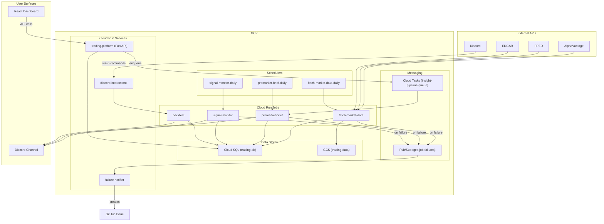

# Prompt: regenerate ARCHITECTURE.md

> For deeper schema, scheduler timing, cost model, glossary, and runbook commands, see [`docs/GCP_ARCHITECTURE.md`](docs/GCP_ARCHITECTURE.md). For the visual companion, see [`Architecture.drawio`](Architecture.drawio).

## 1. System overview (one paragraph, ~80-120 words)

This system is a private stocks/trading platform deployed to GCP project `adept-mountain-474619-d4`. Its primary function is to run a series of automated data collection and analysis jobs, delivering insights via Discord webhooks and a secondary internal React + FastAPI dashboard served from the `trading-platform` Cloud Run Service. The system is designed for a single-user or small-team context, lacking public authentication or per-user data partitioning. The architecture is built around a fleet of approximately 48 Cloud Run Jobs, orchestrated by Cloud Scheduler, which handle data fetching, computation, and alerting.

## 2. Component inventory (table form)

### 2a. Code modules

| Component | Type | Purpose | Depends on | Used by |
|---|---|---|---|---|
| [`gcp/database.py`](gcp/database.py) | Core | Provides Cloud SQL connection and data access functions. | Cloud SQL | All components accessing the database. |
| [`gcp/gcs_utils.py`](gcp/gcs_utils.py) | Utility | Helpers for interacting with Google Cloud Storage. | GCS | Components that read/write from GCS. |
| [`gcp/deploy.sh`](gcp/deploy.sh) | Deployment | Script for deploying all GCP resources. | gcloud CLI | Manual execution by developers. |
| [`gcp/schema.sql`](gcp/schema.sql) | Schema | Contains the SQL schema for the Cloud SQL database. | Cloud SQL | `gcp/apply_schema.py` |
| [`gcp/apply_schema.py`](gcp/apply_schema.py) | Migration | Applies the schema from `schema.sql` to the database. | `gcp/schema.sql` | `deploy.sh` |
| [`gcp/fetchers/*.py`](gcp/fetchers/) | Fetcher | Collection of scripts to fetch data from various sources. | External APIs, Cloud SQL | Cloud Scheduler |
| [`gcp/premarket_brief.py`](gcp/premarket_brief.py) | Job | Generates and sends the pre-market brief. | Cloud SQL, `lib/*` | Cloud Scheduler |
| [`gcp/signal_monitor.py`](gcp/signal_monitor.py) | Job | Monitors for trading signals in real-time. | Cloud SQL, `lib/*` | Cloud Scheduler |
| [`gcp/weekend_review.py`](gcp/weekend_review.py) | Job | Generates and sends a weekend review. | Cloud SQL, `lib/*` | Cloud Scheduler |
| [`gcp/insight_pipeline_job.py`](gcp/insight_pipeline_job.py) | Job | Runs the AI insight generation pipeline. | Cloud SQL, `lib/*`, Vertex AI | Cloud Scheduler, Cloud Tasks |
| [`gcp/backtest_job.py`](gcp/backtest_job.py) | Job | Executes backtests of trading strategies. | Cloud SQL, `lib/*` | Discord command |
| [`lib/*.py`](lib/) | Library | Shared business logic for indicators, strategies, and backtesting. | - | Various jobs and services. |
| [`platform/api/main.py`](platform/api/main.py) | Service | FastAPI application entry point for the internal dashboard. | FastAPI, `lib/*` | `trading-platform` Cloud Run Service |

### 2b. GCP resources

| Resource | Type | Purpose | Notes |
|---|---|---|---|
| `trading-db` | Cloud SQL | Main database for storing all trading data. | Deployed via `setup_cloud_sql.sh` |
| `adept-mountain-474619-d4-trading-data` | GCS Bucket | Storage for data snapshots and other artifacts. | Deployed via `setup_cloud_sql.sh` |
| `trading-system` | Artifact Registry | Docker image repository for the Cloud Run jobs. | `us-east1-docker.pkg.dev` |
| `trading-platform` | Cloud Run Service | Hosts the internal FastAPI + React dashboard. | Deployed via `platform/deploy.sh` |
| `discord-interactions` | Cloud Run Service | Handles incoming slash commands from Discord. | Deployed via `gcp/deploy.sh` |
| `failure-notifier` | Cloud Run Service | Listens to Pub/Sub and creates GitHub issues on job failures. | Deployed via `setup_cloud_sql.sh` |
| ~48 Cloud Run Jobs | Cloud Run Job | The core processing units of the system, for fetching and analysis. | Deployed via `gcp/deploy.sh` |
| ~50 Cloud Schedulers | Cloud Scheduler | Trigger the Cloud Run Jobs on a schedule. | Deployed via `gcp/deploy.sh` |
| `gcp-job-failures` | Pub/Sub Topic | Topic for publishing job failure notifications. | Created by `setup_cloud_sql.sh` |
| `insight-pipeline-queue` | Cloud Tasks Queue | Queue for on-demand AI insight refresh tasks. | Created by `deploy.sh` |
| `trading-runner` | Service Account | IAM identity for the Cloud Run jobs and services. | Created by `setup_cloud_sql.sh` |
| Various Secrets | Secret Manager | Storage for API keys, database passwords, and other secrets. | Created by `setup_cloud_sql.sh` |

## 3. Data flow (5 named subsections)

### Daily nightly write path (post-close 11 PM ET)
Based on the `deploy_schedulers` function in `gcp/deploy.sh`, a series of fetcher jobs are run post-market close. These include `fetch-market-data-daily`, `fetch-earnings-history-weekly`, `fetch-top-movers-daily`, and others. These jobs fetch data from external APIs like AlphaVantage and store it in the `trading-db` Cloud SQL database.

### Daily morning read path (pre-market 7-9 AM ET)
Before the market opens, another set of jobs run to prepare for the day. This includes `fetch-economic-events-daily`, `fetch-earnings-calendar-daily`, and most importantly `premarket-brief-daily`. The pre-market brief job reads the data collected overnight, performs analysis using the `lib/` modules, and sends a summary to a Discord channel. `insight-discord-push-daily` also runs to provide AI-generated insights.

### On-demand AI insight refresh (Cloud Tasks)
The `trading-platform` service, a FastAPI application, exposes an endpoint to trigger on-demand AI insight refreshes. This endpoint enqueues a message to the `insight-pipeline-queue` Cloud Tasks queue. The `insight-pipeline` Cloud Run job is configured to be triggered by this queue, which then runs the insight generation process for a specific ticker.

### Failure notification
The `setup_cloud_sql.sh` script sets up a `gcp-job-failures` Pub/Sub topic and a `failure-notifier` Cloud Run service. A Cloud Logging sink is configured to route error logs from Cloud Run jobs to this topic. The `failure-notifier` service is subscribed to this topic and is responsible for creating a GitHub issue when a job fails.

### Discord slash-command path
The `discord-interactions` Cloud Run service acts as the endpoint for Discord slash commands. It verifies and processes incoming commands like `/replay`, `/watch`, `/backtest`, and `/validate`. For each command, it triggers a corresponding Cloud Run Job (`signal-replay`, `backfill-ticker`, `backtest`, `validate-brief`) to perform the requested action. The results are then posted back to Discord.

## 4. Architecture diagram

## 5. Reconciliation flags (review section)

### Inventory resources with no clear repo reference
Without the `gcp_inventory.json` file, it is impossible to know which resources exist in GCP but not in the repository. A manual audit by comparing the output of `gcloud` list commands with the `gcp/deploy.sh` script is recommended.

### Resources the code references that are NOT in the inventory
- The `gcp/deploy.sh` script is the primary source of truth for deployed resources in this repository. However, some resources might be created by other means (e.g., `platform/deploy.sh` for the `trading-platform` service, or manual intervention).
- The `gcp/setup_cloud_sql.sh` script creates several resources, including the Cloud SQL instance, GCS bucket, service accounts, and secrets. These are not all explicitly re-declared in `gcp/deploy.sh`.
- The previous `ARCHITECTURE.md` mentioned 42 Cloud Run jobs, but an analysis of `gcp/deploy.sh` reveals closer to 48 `gcloud run jobs create` commands. This suggests either new jobs have been added, or the previous count was inaccurate.

## 6. Open questions

- The `gcp_inventory.json` and `gcp_iam.json` files, which are listed as inputs in the prompt, were not found in the workspace. This makes it impossible to generate a completely accurate and verified inventory of GCP resources. The information in this document is based on analyzing the deployment scripts and source code, and may not reflect the actual state of the GCP project.
- The exact number of Cloud Scheduler jobs is difficult to determine statically, as some are created in loops within `gcp/deploy.sh`. The previous document estimated ~49, which seems reasonable based on a manual review of the script.
- The roles of the service accounts are not specified in the deployment scripts. This information would be in `gcp_iam.json`.
- There is a large number of python files in `gcp/research/`. It is not clear from `deploy.sh` how or if these are all deployed and used.

Generated 2026-08-01 by .github/workflows/refresh-architecture-docs.yml
