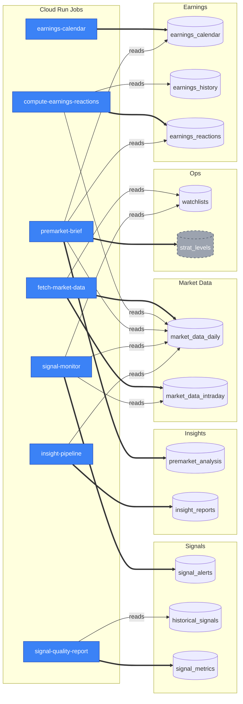

# Data Dependencies — table-level write/read graph

**Generated 2026-06-01.** Audit of every Cloud SQL table in [`gcp/schema.sql`](gcp/schema.sql) (46 tables) cross-referenced against every writer / reader in `gcp/`, `lib/`, `scripts/`, `platform/api/`. Cite-driven — every claim links to a `file:line`.

This doc complements [ARCHITECTURE.md](ARCHITECTURE.md) (which lists the Cloud Run Jobs by code module). Where ARCHITECTURE.md says "Job X runs Module Y," this doc answers "Module Y writes Table Z, and Tables Z is read by Modules A/B/C."

> ⚠️ **Partition handling.** `market_data_intraday` is a Postgres LIST-partitioned table. The 5 child tables (`_spy`, `_iwm`, `_qqq`, `_spx`, `_other`) are **routed transparently** — every writer/reader targets the parent and Postgres routes by `ticker`. They appear in the inventory below for completeness but the §2/§3 entries collapse them under the parent.

> 🔧 **Ad-hoc data access.** The project may have ad-hoc ways to access the database, for example, through a database query tool or a command-line interface. These are not enumerated as a writer/reader in §2/§3 because they can target any table.

---

## 1. Table inventory

| Table | One-line purpose |
|---|---|
| `market_data_daily` | Daily OHLCV + 50+ indicators (RSI, EMA, ATR, gap_pct, pre_high/low/vwap) keyed by `(ticker, date)`. |
| `market_data_intraday` | LIST-partitioned 1-min/5-min intraday OHLCV bars (parent table; auto-routes by ticker). |
| `market_data_intraday_spy` | Partition of `market_data_intraday` for `ticker='SPY'`. |
| `market_data_intraday_iwm` | Partition for `ticker='IWM'`. |
| `market_data_intraday_qqq` | Partition for `ticker='QQQ'`. |
| `market_data_intraday_spx` | Partition for `ticker='SPX'`. |
| `market_data_intraday_other` | DEFAULT partition for all other tickers. |
| `etf_options_snapshots` | ETF options chains with Greeks (AV EOD or Yahoo intraday); per-contract rows. |
| `earnings_options_snapshots` | Per-contract earnings-week options chains (legacy Yahoo path; **not actively written**). |
| `daily_rates` | Daily DGS3MO risk-free rate + sp500_div_yld (BSM Greeks input). |
| `archive_yahoo_market_data_daily` | Frozen pre-AV-migration archive of daily Yahoo rows. |
| `archive_yahoo_market_data_intraday` | Frozen Yahoo intraday archive. |
| `archive_yahoo_etf_options_snapshots` | Frozen Yahoo ETF options archive. |
| `archive_yahoo_earnings_options_snapshots` | Frozen Yahoo earnings options archive. |
| `earnings_calendar` | Upcoming earnings (date/time/EPS est) + Earnings Whispers strike picks; multi-source. |
| `earnings_history` | AV EARNINGS quarterly history per `(ticker, fiscal_date_ending)`. |
| `earnings_reactions` | Computed playability scores + archetype tags from `earnings_history × OHLCV`. |
| `sec_filings` | EDGAR 8-K/10-Q/10-K filing metadata + accession numbers. |
| `insider_transactions` | Form 4 insider buys/sells per `(ticker, transaction_date)`. |
| `top_movers_daily` | Daily AV top-gainers / -losers / -active list. |
| `ranker_runs` | Audit trail of ranker invocations (write-only). |
| `signal_alerts` | Real-time CALL/PUT alert log written by signal_monitor. |
| `trades` | Logged trade tickets (live or backtest); used by weekend_review. |
| `journal_entries` | Trader's journal text + pgvector embedding for reflection memory retrieval. |
| `premarket_analysis` | Per-`(analysis_date, ticker)` snapshot of the morning's brief — RSI, gap, levels, lean. |
| `economic_events` | Macro/economic calendar events from ForexFactory/FRED. |
| `model_routing` | Maps agent role → LLM provider/model (admin-controlled routing). |
| `insight_reports` | Latest AI-insight per `(ticker, as_of)` — overwritten with each refresh. |
| `insight_runs` | Run-level audit row (status, started/completed, model+token usage) keyed by run id. |
| `news_sentiment` | Per-article sentiment + ticker tagging (AV NEWS_SENTIMENT primarily). |
| `strat_levels` | Persisted Strat-engine level map (write-only audit). |
| `premarket_analysis_history` | Append-only history of `premarket_analysis` writes (compliance/replay). |
| `insight_reports_history` | Append-only history of `insight_reports` writes (compliance/replay). |
| `historical_signals` | Backtested/replayed signals — entry_time, strategy, outcome features. |
| `ticker_info` | Cached AV OVERVIEW + FinViz peers JSON per ticker (24h TTL). |
| `watchlists` | Active ticker watchlist `(user_id, ticker, source, signals/insights flags, soft-delete)`. |
| `ticker_calibration` | Per-ticker calibrated thresholds from `scripts/calibrate_thresholds.py`; read at signal time. |
| `exit_config_overrides` | Per-ticker exit strategy overrides (targets, stops). |
| `signal_metrics` | Per-`(ticker, entry_time, strategy)` quality metrics row from `signal_quality_report`. |
| `backtest_trades` | Per-trade results from a backtest run. |
| `backtest_sweeps` | Per-timeframe-combo results from a backtest sweep. |
| `backtest_reports` | High-level summary report for a backtest run. |
| `backtest_walk_forward_folds` | Per-fold metrics from a walk-forward validation run. |
| `walk_forward_results` | Per-parameter-combo results from a walk-forward optimization. |
| `earnings_calibration` | Tuned parameters for the earnings playability score. |
| `indicator_correlation`| Correlation metrics between indicators and forward returns. |
| `regime_combo_results`| Predictive indicator combinations for market regimes. |
| `strat_combo_results`| Predictive indicator combinations for Strat candle patterns. |
| `earnings_options_strategy_insights`| Historical options P&L breakdown by quintile and structure. |
| `earnings_options_strategy_winners`| Top-10 historical options trade winners by category. |

---

## 2. Write graph

*This section is auto-generated by searching for SQL INSERT/UPDATE/DELETE statements and pandas `to_sql` / `upsert_dataframe` calls.*

### `market_data_daily`
- [`gcp/fetchers/fetch_market_data.py`](gcp/fetchers/fetch_market_data.py) - `upsert_dataframe`
- [`gcp/fetchers/fetch_premarket_refresh.py`](gcp/fetchers/fetch_premarket_refresh.py) - `INSERT ... ON CONFLICT`
- [`gcp/premarket_brief.py`](gcp/premarket_brief.py) - `DELETE FROM market_data_daily`
- [`gcp/backfill_ticker.py`](gcp/backfill_ticker.py) - `upsert_dataframe`
- [`gcp/migrate_to_gcp.py`](gcp/migrate_to_gcp.py) - `bulk_insert_dataframe` (one-shot historical)

### `market_data_intraday` (and partitions)
- [`gcp/fetchers/fetch_market_data.py`](gcp/fetchers/fetch_market_data.py) - `upsert_dataframe`
- [`gcp/fetchers/fetch_alphavantage_intraday.py`](gcp/fetchers/fetch_alphavantage_intraday.py) - `upsert_dataframe`
- [`gcp/migrate_to_gcp.py`](gcp/migrate_to_gcp.py) - `bulk_insert_dataframe` (one-shot historical)

### `etf_options_snapshots`
- [`gcp/fetchers/fetch_av_historical_options.py`](gcp/fetchers/fetch_av_historical_options.py) - `upsert_dataframe`
- [`scripts/maintenance/compute_spx_greeks.py`](scripts/maintenance/compute_spx_greeks.py) - `UPDATE`

### `earnings_options_snapshots`
- [`gcp/migrate_to_gcp.py`](gcp/migrate_to_gcp.py) - (one-shot historical) **No live writer.**

### `daily_rates`
- [`gcp/fetchers/fetch_fred_rates.py`](gcp/fetchers/fetch_fred_rates.py) - `upsert_dataframe`

### `archive_yahoo_*` (4 tables)
- `scripts/archive_yahoo_data.py` - one-shot historical writes.

### `earnings_calendar`
- [`scripts/fetch_earnings_calendar.py`](scripts/fetch_earnings_calendar.py) - `upsert_dataframe`
- [`gcp/fetchers/evaluate_ew_strikes.py`](gcp/fetchers/evaluate_ew_strikes.py) - `UPDATE`

### `earnings_history`
- [`gcp/fetchers/fetch_earnings_history.py`](gcp/fetchers/fetch_earnings_history.py) - `upsert_dataframe`

### `earnings_reactions`
- [`gcp/fetchers/compute_earnings_reactions.py`](gcp/fetchers/compute_earnings_reactions.py) - `upsert_dataframe`

### `sec_filings`
- [`gcp/fetchers/fetch_sec_filings.py`](gcp/fetchers/fetch_sec_filings.py) - `upsert_dataframe`

### `insider_transactions`
- [`gcp/fetchers/fetch_insider_transactions.py`](gcp/fetchers/fetch_insider_transactions.py) - `upsert_dataframe`

### `top_movers_daily`
- [`gcp/fetchers/fetch_top_movers.py`](gcp/fetchers/fetch_top_movers.py) - `upsert_dataframe`

### `ranker_runs`
- `lib/agents/ranker/rank.py` - `INSERT INTO` (audit trail)

### `signal_alerts`
- [`gcp/signal_monitor.py`](gcp/signal_monitor.py) - `upsert_dataframe` and `UPDATE` for exits
- [`gcp/signal_monitor_eod_resolver.py`](gcp/signal_monitor_eod_resolver.py) - `UPDATE` for EOD exits

### `trades`
- [`gcp/trade_logger.py`](gcp/trade_logger.py) - `upsert_dataframe`

### `journal_entries`
- `platform/api/routers/journal.py` - `INSERT` and `DELETE`
- `scripts/backfill_journal_embeddings.py` - `UPDATE` for pgvector backfill

### `premarket_analysis`
- [`gcp/premarket_brief.py`](gcp/premarket_brief.py) - `upsert_dataframe`
- [`gcp/premarket_playbook_resolver.py`](gcp/premarket_playbook_resolver.py) - `UPDATE` with playbook outcomes

### `economic_events`
- [`gcp/fetchers/fetch_economic_events.py`](gcp/fetchers/fetch_economic_events.py) - `upsert_dataframe`

### `model_routing`
- `lib/agents/model_routing.py` - `INSERT ... ON CONFLICT`

### `insight_reports`
- [`gcp/insight_pipeline_job.py`](gcp/insight_pipeline_job.py) - `upsert_dataframe`
- `platform/api/routers/insights.py` - on-demand `upsert`

### `insight_runs`
- [`gcp/insight_pipeline_job.py`](gcp/insight_pipeline_job.py) - `INSERT` and `UPDATE`
- [`gcp/auto_refresh_top_n.py`](gcp/auto_refresh_top_n.py) - `INSERT`
- `platform/api/routers/insights.py` - `INSERT` and `UPDATE`

### `news_sentiment`
- [`gcp/fetchers/fetch_news_sentiment.py`](gcp/fetchers/fetch_news_sentiment.py) - `upsert_dataframe`

### `strat_levels`
- [`lib/strat_levels.py`](lib/strat_levels.py) (called by `gcp/premarket_brief.py`) - `INSERT INTO`

### `premarket_analysis_history`
- [`gcp/premarket_brief.py`](gcp/premarket_brief.py) - `bulk_insert_dataframe`

### `insight_reports_history`
- [`gcp/insight_pipeline_job.py`](gcp/insight_pipeline_job.py) - `INSERT`

### `historical_signals`
- [`gcp/historical_signals.py`](gcp/historical_signals.py) - `DELETE` and `bulk_insert_dataframe`

### `ticker_info`
- [`lib/ticker_info.py`](lib/ticker_info.py) - `INSERT ... ON CONFLICT`

### `watchlists`
- `gcp/discord_interactions/main.py` - `/watch add` (`INSERT`) and `/watch remove` (`UPDATE`)
- [`gcp/fetchers/_watchlist.py`](gcp/fetchers/_watchlist.py) - `upsert`

### `ticker_calibration`
- `scripts/calibrate_thresholds.py` - `upsert_dataframe`

### `exit_config_overrides`
- `scripts/run_param_sweep.py` - `INSERT ... ON CONFLICT`

### `signal_metrics`
- `scripts/signal_quality_report.py` - `INSERT ... ON CONFLICT`

### `backtest_*` tables
- `scripts/run_backtest.py` and `scripts/run_timeframe_sweep.py` write to `backtest_trades` and `backtest_sweeps`.
- `scripts/generate_backtest_report.py` writes to `backtest_reports`.
- The walk-forward validator writes to `backtest_walk_forward_folds`.

### `walk_forward_results`
- `scripts/run_param_sweep.py` - `INSERT`

### `earnings_calibration`
- `scripts/calibrate_earnings.py` - `INSERT ... ON CONFLICT`

### `indicator_correlation`
- [`gcp/indicator_correlation_job.py`](gcp/indicator_correlation_job.py) - `upsert_dataframe`

### `regime_combo_results`
- [`gcp/regime_combo_job.py`](gcp/regime_combo_job.py) - `upsert_dataframe`

### `strat_combo_results`
- `gcp/research/strat_engine/strat_combo_miner.py` - `upsert_dataframe`

### `earnings_options_strategy_insights`
- `scripts/calibrate_earnings.py` - `INSERT ... ON CONFLICT`

### `earnings_options_strategy_winners`
- `scripts/calibrate_earnings.py` - `INSERT ... ON CONFLICT`

---

## 3. Read graph

*This section is auto-generated by searching for SQL `SELECT` statements. `tests/` are excluded.*

### `market_data_daily`
- **Core consumers:** `gcp/premarket_brief.py`, `gcp/signal_monitor.py`, `gcp/fetchers/compute_earnings_reactions.py`, `lib/data_loader.py` (backtests), `platform/api/` (multiple routers).
- **Supporting reads:** `gcp/fetchers/fetch_market_data.py` (staleness), `lib/agents/*` (context), `lib/strat_levels.py`.

### `market_data_intraday`
- **Core consumers:** `gcp/historical_signals.py` (replay), `lib/data_loader.py` (backtests), `gcp/premarket_playbook_resolver.py`.
- **Supporting reads:** `gcp/fetchers/fetch_market_data.py` (staleness), various scripts for analysis.

### `etf_options_snapshots`
- **Core consumers:** `lib/agents/summarizers.py` (gamma context), `platform/api/routers/options.py`.
- **Supporting reads:** `gcp/fetchers/fetch_av_historical_options.py` (staleness), `lib/data_loader.py`.

### `earnings_options_snapshots`
- **Zero live readers.** Only `lib/data_loader.py` can read it, but no live code path calls it with the required `source='earnings'`.

### `daily_rates`
- `lib/options_greeks.py` - BSM model input.

### `archive_yahoo_*` (4 tables)
- **Zero readers in code.** For manual forensics only.

### `earnings_calendar`
- **Core consumers:** `gcp/premarket_brief.py`, `lib/strategies/catalyst_proximity.py`, `platform/api/routers/catalysts.py`.
- **Supporting reads:** Multiple `gcp/fetchers/*` for context, `lib/agents/*` for context.

### `earnings_history`
- `gcp/fetchers/compute_earnings_reactions.py` (primary input), `platform/api/routers/catalysts.py`.

### `earnings_reactions`
- `lib/earnings_reactions.py` (used by `gcp/premarket_brief.py` and agents).

### `sec_filings`
- `lib/agents/*`, `lib/strategies/catalyst_proximity.py`, `platform/api/routers/catalysts.py`.

### `insider_transactions`
- `lib/agents/*`, `platform/api/routers/catalysts.py`.

### `top_movers_daily`
- `lib/agents/ranker/candidates.py` - Narrow use for candidate generation.

### `ranker_runs`
- **Zero readers** - Write-only audit trail.

### `signal_alerts`
- `lib/agents/summarizers.py` (context), `gcp/signal_monitor_eod_resolver.py` (find open alerts).

### `trades`
- `gcp/weekend_review.py`, `platform/api/routers/analytics.py`.

### `journal_entries`
- `platform/api/routers/journal.py`, `lib/agents/summarizers.py` (reflection memory).

### `premarket_analysis`
- `platform/api/routers/dashboard.py`, `gcp/validate_brief_job.py`.

### `economic_events`
- `gcp/premarket_brief.py`, `lib/agents/*`, `lib/strategies/catalyst_proximity.py`.

### `model_routing`
- `lib/agents/model_routing.py` (read by all agent-based jobs).

### `insight_reports`
- `gcp/insight_discord_push.py`, `platform/api/routers/insights.py`, `gcp/auto_refresh_top_n.py`.

### `insight_runs`
- `platform/api/routers/insights.py`.

### `news_sentiment`
- `lib/agents/*`, `platform/api/routers/catalysts.py`, `gcp/insight_discord_push.py`.

### `strat_levels`
- **Zero live readers.** The engine recomputes levels at runtime.

### `premarket_analysis_history`
- **Zero live readers.** Audit trail for future replay.

### `insight_reports_history`
- **Zero live readers.** Audit trail.

### `historical_signals`
- `platform/api/routers/signals.py`, `scripts/signal_quality_report.py`.

### `ticker_info`
- `lib/ticker_info.py` (cache read, used by many components).

### `watchlists`
- **Core consumers:** `gcp/fetchers/_watchlist.py` (canonical loader), `gcp/signal_monitor.py`.
- **Supporting reads:** `gcp/discord_interactions/main.py`.

### `ticker_calibration`
- `lib/strategies/calibration.py` (read by `gcp/signal_monitor.py`).

### `exit_config_overrides`
- `lib/strategies/exit_config_overrides.py` (read by `gcp/signal_monitor.py`).

### `signal_metrics`
- `gcp/signal_quality_alarm.py`.

---

## 4. Multi-writer tables (coordination risks)

| Table | Writers | Why a coordination risk |
|---|---|---|
| `market_data_daily` | `fetch_market_data`, `fetch_premarket_refresh`, `premarket_brief` (DELETE), `backfill_ticker` | **High.** Multiple writers touch the same rows. `fetch_premarket_refresh` updates pre-market fields, and must not clobber EOD data. The `premarket_brief` `DELETE` could race with an `INSERT`. |
| `earnings_calendar`| `fetch_earnings_calendar`, `evaluate_ew_strikes` | **Medium.** `evaluate_ew_strikes` `UPDATE`s rows from the main fetcher. Order of operations matters. A typo in `data_source` in the fetcher can create duplicate rows. |
| `watchlists` | `discord_interactions`, `_watchlist.py`, `backfill_ticker` | **Low.** All writers use `(user_id, ticker)` primary key. Soft-delete via `removed_at` needs to be handled consistently by all writers. |
| `insight_reports`| `insight_pipeline_job`, `insights` FastAPI router | **Medium.** Two live writers on `(ticker, as_of)`. Potential for race conditions if not coordinated. |
| `insight_runs` | `insight_pipeline_job`, `insights` router, `auto_refresh_top_n` | **Low.** All writers `INSERT` new rows with UUIDs. `UPDATE`s on status are on different rows. |
| `signal_alerts` | `signal_monitor` (live), `signal_monitor_eod_resolver` (EOD sweep) | **Low.** The EOD resolver only `UPDATE`s rows that are still `is_open=TRUE`, so it doesn't conflict with the live monitor's inserts. |

---

## 5. Orphan tables

| Table | Writers | Readers | Status |
|---|---|---|---|
| `archive_yahoo_*` (4 tables) | 1 (one-shot) | 0 | **Intentional (audit trail)**. Legacy data for manual forensics. |
| `earnings_options_snapshots`| 1 (one-shot) | 0 live | **Drop candidate**. The job to populate this is broken. |
| `ranker_runs` | 1 | 0 | **Intentional (audit trail)**. Write-only by design. |
| `strat_levels` | 1 | 0 live | **Intentional (audit trail)**. Engine recomputes at runtime. |
| `premarket_analysis_history` | 1 | 0 live | **Intentional (audit trail)**. For compliance and future replay. |
| `insight_reports_history` | 1 | 0 live | **Intentional (audit trail)**. For compliance and future replay. |

---

## 6. Blast radius per Cloud Run Job

| Job | Tables written | Downstream consumers | Severity |
|---|---|---|---|
| **`fetch-market-data`** | `market_data_daily`, `market_data_intraday` | Nearly all other jobs and services depend on this. | **Highest** |
| **`earnings-calendar`**| `earnings_calendar` | `premarket_brief`, `compute_earnings_reactions`, agents, API | **Very high** |
| **`premarket-brief`**| `premarket_analysis`, `premarket_analysis_history` | Dashboard UI, validation jobs | **High** |
| **`insight-pipeline`**| `insight_reports`, `insight_runs`, `insight_reports_history` | `insight_discord_push`, Dashboard UI, auto-refresh job | **High** |
| **`signal-monitor`**| `signal_alerts` | `signal_monitor_eod_resolver`, agents (context) | **High** |
| **`fetch-fred-rates`** | `daily_rates` | `lib/options_greeks` (cascades to all options analytics) | **Medium** |
| **`compute-earnings-reactions`**|`earnings_reactions`| `premarket_brief` (playability scores) | **Medium** |
| **`fetch-news-sentiment`**| `news_sentiment` | Agents, API, Discord push | **Medium** |
| **`indicator-correlation`**| `indicator_correlation` | (Future analytics) | **Low** |
| **`regime-combo`**| `regime_combo_results` | (Future analytics) | **Low** |
| **`signal-quality-report`**| `signal_metrics` | `signal_quality_alarm` | **Low** |
| **`trade-logger`**| `trades` | `weekend-review` | **Low** |
| **`failure-notifier`**| (none) | GitHub issues | **None** |

---

## 7. Mermaid graph

Generated 2026-06-01 by .github/workflows/refresh-architecture-docs.yml
