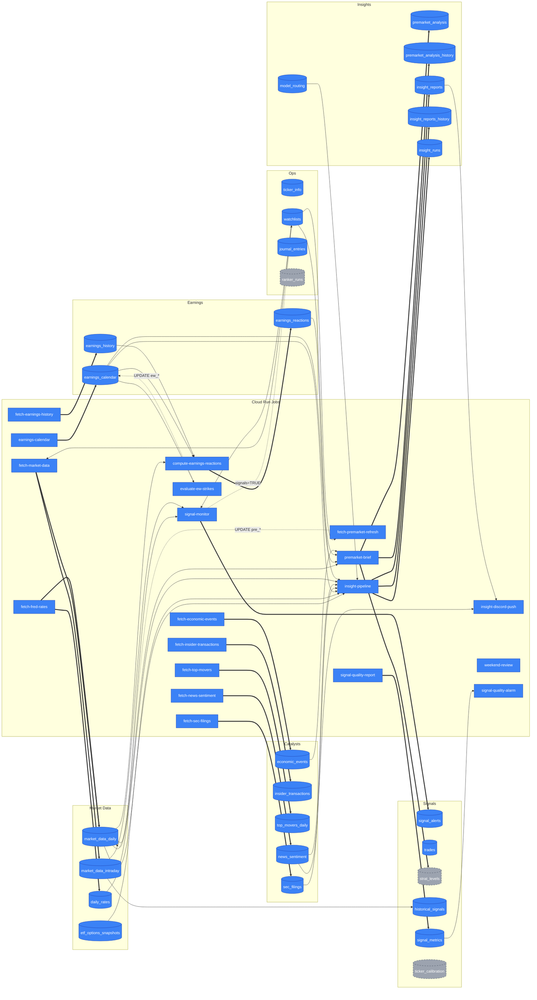

# Data Dependencies — table-level write/read graph

**Generated 2026-05-01.** Audit of every Cloud SQL table in [`gcp/schema.sql`](gcp/schema.sql) (38 tables) cross-referenced against every writer / reader in `gcp/`, `lib/`, `scripts/`, `platform/api/`. Cite-driven — every claim links to a `file:line`.

This doc complements [ARCHITECTURE.md](ARCHITECTURE.md) (which lists the 27 Cloud Run Jobs by code module). Where ARCHITECTURE.md says "Job X runs Module Y," this doc answers "Module Y writes Table Z, and Tables Z is read by Modules A/B/C."

> ⚠️ **Partition handling.** `market_data_intraday` is a Postgres LIST-partitioned table. The 5 child tables (`_spy`, `_iwm`, `_qqq`, `_spx`, `_other`) are **routed transparently** — every writer/reader targets the parent and Postgres routes by `ticker`. They appear in the inventory below for completeness but the §2/§3 entries collapse them under the parent.

> 🔧 **Ad-hoc data access.** [`.github/workflows/db-query.yml`](.github/workflows/db-query.yml) (added in #235) runs arbitrary SQL inside a GitHub-Actions runner — it's the only path that works from the sandboxed Claude Code on the web environment, which can't reach Cloud SQL on TCP 5432/3307. Reads default to rolled-back transactions; writes require explicit `commit=true`. It is not enumerated as a writer/reader in §2/§3 because it can target any table — treat it as a generic operator tool, not a pipeline component. See [`CLAUDE.md`](CLAUDE.md#database-access) for invocation patterns.

---

## 1. Table inventory

| Table | One-line purpose |
|---|---|
| `market_data_daily` | Daily OHLCV + 50+ indicators (RSI, EMA, ATR, gap_pct, pre_high/low/vwap) keyed by `(ticker, date)`. |
| `market_data_intraday` | LIST-partitioned 1-min/5-min intraday OHLCV bars (parent table; auto-routes by ticker). |
| `market_data_intraday_spy` | Partition of `market_data_intraday` for `ticker='SPY'`. |
| `market_data_intraday_iwm` | Partition for `ticker='IWM'`. |
| `market_data_intraday_qqq` | Partition for `ticker='QQQ'`. |
| `market_data_intraday_spx` | Partition for `ticker='SPX'`. |
| `market_data_intraday_other` | DEFAULT partition for all other tickers. |
| `etf_options_snapshots` | ETF options chains with Greeks (AV EOD or Yahoo intraday); per-contract rows. |
| `earnings_options_snapshots` | Per-contract earnings-week options chains (legacy Yahoo path; **not actively written**). |
| `daily_rates` | Daily DGS3MO risk-free rate + sp500_div_yld (BSM Greeks input). |
| `archive_yahoo_market_data_daily` | Frozen pre-AV-migration archive of daily Yahoo rows. |
| `archive_yahoo_market_data_intraday` | Frozen Yahoo intraday archive. |
| `archive_yahoo_etf_options_snapshots` | Frozen Yahoo ETF options archive. |
| `archive_yahoo_earnings_options_snapshots` | Frozen Yahoo earnings options archive. |
| `earnings_calendar` | Upcoming earnings (date/time/EPS est) + Earnings Whispers strike picks; multi-source. |
| `earnings_history` | AV EARNINGS quarterly history per `(ticker, fiscal_date_ending)`. |
| `earnings_reactions` | Computed playability scores + archetype tags from `earnings_history × OHLCV`. |
| `sec_filings` | EDGAR 8-K/10-Q/10-K filing metadata + accession numbers. |
| `insider_transactions` | Form 4 insider buys/sells per `(ticker, transaction_date)`. |
| `top_movers_daily` | Daily AV top-gainers / -losers / -active list. |
| `ranker_runs` | Audit trail of ranker invocations (write-only). |
| `signal_alerts` | Real-time CALL/PUT alert log written by signal_monitor. |
| `trades` | Logged trade tickets (live or backtest); used by weekend_review. |
| `journal_entries` | Trader's journal text + pgvector embedding for reflection memory retrieval. |
| `premarket_analysis` | Per-`(analysis_date, ticker)` snapshot of the morning's brief — RSI, gap, levels, lean. |
| `economic_events` | Macro/economic calendar events from ForexFactory/FRED. |
| `model_routing` | Maps agent role → LLM provider/model (admin-controlled routing). |
| `insight_reports` | Latest AI-insight per `(ticker, as_of)` — overwritten with each refresh. |
| `insight_runs` | Run-level audit row (status, started/completed, model+token usage) keyed by run id. |
| `news_sentiment` | Per-article sentiment + ticker tagging (AV NEWS_SENTIMENT primarily). |
| `strat_levels` | Persisted Strat-engine level map (write-only audit). |
| `premarket_analysis_history` | Append-only history of `premarket_analysis` writes (compliance/replay). |
| `insight_reports_history` | Append-only history of `insight_reports` writes (compliance/replay). |
| `historical_signals` | Backtested/replayed signals — entry_time, strategy, outcome features. |
| `ticker_info` | Cached AV OVERVIEW + FinViz peers JSON per ticker (24h TTL). |
| `watchlists` | Active ticker watchlist `(user_id, ticker, source, signals/insights flags, soft-delete)`. |
| `ticker_calibration` | Per-ticker calibrated thresholds from `scripts/calibrate_thresholds.py`; read at signal time by `lib/strategies/calibration.py` (Tier-A resolver) with Tier-B fallback to `lib/strategies/config.py` constants. |
| `signal_metrics` | Per-`(ticker, entry_time, strategy)` quality metrics row from `signal_quality_report`. |

**38 tables.** 5 are intraday partitions of `market_data_intraday`; the remaining 33 are independent.

---

## 2. Write graph

### `market_data_daily`
- [`gcp/fetchers/fetch_market_data.py:404`](gcp/fetchers/fetch_market_data.py#L404) — `upsert_dataframe(..., 'market_data_daily', ['ticker','date'])` (per-ticker)
- [`gcp/fetchers/fetch_market_data.py:463`](gcp/fetchers/fetch_market_data.py#L463) — batch upsert
- [`gcp/fetchers/fetch_market_data.py:731`](gcp/fetchers/fetch_market_data.py#L731) — `_run_backfill` upsert
- [`gcp/fetchers/fetch_premarket_refresh.py:251`](gcp/fetchers/fetch_premarket_refresh.py#L251) — `INSERT … ON CONFLICT (gap_pct, pre_high, pre_low, pre_vwap)`
- [`gcp/fetchers/fetch_fred_rates.py:138`](gcp/fetchers/fetch_fred_rates.py#L138) — SP500 close upsert as `ticker='SPX'`
- [`gcp/premarket_brief.py:79`](gcp/premarket_brief.py#L79) — `DELETE FROM market_data_daily WHERE close IS NULL` (cleanup)
- [`gcp/backfill_ticker.py:375`](gcp/backfill_ticker.py#L375), [`:414`](gcp/backfill_ticker.py#L414) — Discord `/replay`
- [`gcp/migrate_to_gcp.py:188`](gcp/migrate_to_gcp.py#L188), [`:640`](gcp/migrate_to_gcp.py#L640) — one-shot historical
- [`scripts/backfill_watchlist_data.py:233`](scripts/backfill_watchlist_data.py#L233) — coverage backfill
- [`scripts/backfill_spx_from_options.py:138`](scripts/backfill_spx_from_options.py#L138) — parity-derived SPX
- 3× `scripts/_backfill_*.py` — one-shot historical INSERTs

### `market_data_intraday` (and partitions)
- [`gcp/fetchers/fetch_market_data.py:432`](gcp/fetchers/fetch_market_data.py#L432) — `upsert_dataframe(..., 'market_data_intraday', ['ticker','interval','ts'])`
- [`gcp/fetchers/fetch_alphavantage_intraday.py:175`](gcp/fetchers/fetch_alphavantage_intraday.py#L175) — monthly snapshot
- [`gcp/migrate_to_gcp.py:234`](gcp/migrate_to_gcp.py#L234) — `DELETE` + `:238` `bulk_insert_dataframe(..., chunksize=5000)`

### `etf_options_snapshots`
- [`gcp/fetchers/fetch_av_historical_options.py:155`](gcp/fetchers/fetch_av_historical_options.py#L155) — `upsert_dataframe`
- `gcp/migrate_to_gcp.py:370,429,441,472` — one-shot historical Yahoo migration
- [`scripts/maintenance/compute_spx_greeks.py:149`](scripts/maintenance/compute_spx_greeks.py#L149) — `UPDATE` (BSM-Greeks fill)

### `earnings_options_snapshots`
- [`gcp/migrate_to_gcp.py:506`](gcp/migrate_to_gcp.py#L506) — one-shot historical Yahoo only. **No live writer.**

### `daily_rates`
- [`gcp/fetchers/fetch_fred_rates.py:134`](gcp/fetchers/fetch_fred_rates.py#L134) — `upsert_dataframe`
- [`gcp/fetchers/fetch_fred_rates.py:141`](gcp/fetchers/fetch_fred_rates.py#L141) — second upsert for `sp500_div_yld`

### `archive_yahoo_*` (4 tables)
- `scripts/archive_yahoo_data.py:59,64,69,74` — chunked INSERTs via dynamic SQL (`'archive': 'archive_yahoo_<table>'` config dict). One-shot only.

### `earnings_calendar`
- [`scripts/fetch_earnings_calendar.py:895`](scripts/fetch_earnings_calendar.py#L895) — `upsert_dataframe(..., conflict_cols=['ticker','earnings_date','strategy','data_source'])` — **multi-source** (yfinance / EW / etc.)
- [`gcp/fetchers/evaluate_ew_strikes.py:170`](gcp/fetchers/evaluate_ew_strikes.py#L170) — `UPDATE … SET ew_*` (post-evaluation)

### `earnings_history`
- [`gcp/fetchers/fetch_earnings_history.py:384`](gcp/fetchers/fetch_earnings_history.py#L384) — `upsert_dataframe`
- 3× `scripts/_backfill_*.py` — one-shot historical

### `earnings_reactions`
- [`gcp/fetchers/compute_earnings_reactions.py:359`](gcp/fetchers/compute_earnings_reactions.py#L359) — `upsert_dataframe`
- `scripts/_apply_phase1_schema.py:195-235` — schema test (one-shot)

### `sec_filings`
- [`gcp/fetchers/fetch_sec_filings.py:303`](gcp/fetchers/fetch_sec_filings.py#L303) — `upsert_dataframe`

### `insider_transactions`
- [`gcp/fetchers/fetch_insider_transactions.py:226`](gcp/fetchers/fetch_insider_transactions.py#L226) — `upsert_dataframe`

### `top_movers_daily`
- [`gcp/fetchers/fetch_top_movers.py:133`](gcp/fetchers/fetch_top_movers.py#L133) — `upsert_dataframe`

### `ranker_runs`
- [`lib/agents/ranker/rank.py:154`](lib/agents/ranker/rank.py#L154) — `INSERT INTO ranker_runs ...` (audit trail, swallowed on error)

### `signal_alerts`
- [`gcp/signal_monitor.py:566`](gcp/signal_monitor.py#L566) — `upsert_dataframe`. Persisted columns include both `base_score` (raw 3-of-5 condition count) and `total_score = (base_score + strat_bonus + agreement_bonus) × proximity_multiplier` per Phase 1.5 (#227) + Phase 1.6 (#231). `strategy_agreement` JSONB carries the per-fire agreement detail; `proximity_multiplier` persists for post-hoc weighting analysis. Free-score conditions (`stoch_rsi_not_*`, `near_*_emas`) were dropped in Phase 0.7 (#229), reducing candidate fires by 77% and stacked-agreement rate from 16.3% → 0% on the SPY 2026-05-01 holdout.
- [`scripts/backfill_signals.py:227`](scripts/backfill_signals.py#L227) — one-shot replay

### `trades`
- [`gcp/trade_logger.py:66`](gcp/trade_logger.py#L66) — `upsert_dataframe`
- [`gcp/trade_logger.py:69`](gcp/trade_logger.py#L69) — `bulk_insert_dataframe` (when `entry_time` is null)
- [`gcp/migrate_to_gcp.py:677`](gcp/migrate_to_gcp.py#L677), [`scripts/backfill_signals.py:231`](scripts/backfill_signals.py#L231) — one-shots

### `journal_entries`
- [`platform/api/routers/journal.py:147`](platform/api/routers/journal.py#L147) — INSERT (FastAPI POST)
- [`:204`](platform/api/routers/journal.py#L204) — DELETE
- [`scripts/backfill_journal_embeddings.py:79`](scripts/backfill_journal_embeddings.py#L79) — `UPDATE` for pgvector backfill

### `premarket_analysis`
- [`gcp/premarket_brief.py:2118`](gcp/premarket_brief.py#L2118), [`:2134`](gcp/premarket_brief.py#L2134) — two `upsert_dataframe(..., ['analysis_date','ticker'])` paths (replay-aware)
- [`scripts/_cycle_test_brief_persist.py:102,120`](scripts/_cycle_test_brief_persist.py#L102) — test cleanup `DELETE`

### `economic_events`
- [`gcp/fetchers/fetch_economic_events.py:400`](gcp/fetchers/fetch_economic_events.py#L400) — `upsert_dataframe(..., ['event_date','event_name'])`

### `model_routing`
- [`lib/agents/model_routing.py:175`](lib/agents/model_routing.py#L175) — `INSERT … ON CONFLICT (role) DO UPDATE` (admin write)

### `insight_reports`
- [`gcp/insight_pipeline_job.py:301`](gcp/insight_pipeline_job.py#L301), [`:328`](gcp/insight_pipeline_job.py#L328) — two upsert paths
- [`platform/api/routers/insights.py:300`](platform/api/routers/insights.py#L300) — FastAPI on-demand upsert
- [`scripts/generate_historical_report.py:65`](scripts/generate_historical_report.py#L65) — one-shot

### `insight_runs`
- [`gcp/insight_pipeline_job.py:177`](gcp/insight_pipeline_job.py#L177) — INSERT
- [`:200,206,215`](gcp/insight_pipeline_job.py#L200) — UPDATEs (status transitions)
- [`gcp/auto_refresh_top_n.py:98`](gcp/auto_refresh_top_n.py#L98) — INSERT
- [`gcp/discord_interactions/main.py:370`](gcp/discord_interactions/main.py#L370) — cache-hit audit row
- `platform/api/routers/insights.py:213,266,272,281` — FastAPI INSERT + UPDATEs

### `news_sentiment`
- [`gcp/fetchers/fetch_news_sentiment.py:343`](gcp/fetchers/fetch_news_sentiment.py#L343) — `upsert_dataframe(..., ['ticker','published_ts','url'])`
- [`gcp/fetchers/fetch_rss_news.py:708`](gcp/fetchers/fetch_rss_news.py#L708) — **NOT in ARCHITECTURE.md's 27-job list** — likely repo-only, verify deployment status
- [`gcp/backfill_ticker.py:449`](gcp/backfill_ticker.py#L449) — Discord `/replay`
- 2× `scripts/backfill_*.py` — one-shots

### `strat_levels`
- [`lib/strat_levels.py:1070`](lib/strat_levels.py#L1070) — `INSERT INTO strat_levels` (called by [`gcp/premarket_brief.py:1027`](gcp/premarket_brief.py#L1027) via `persist_level_map`)

### `premarket_analysis_history`
- [`gcp/premarket_brief.py:2100`](gcp/premarket_brief.py#L2100) — `bulk_insert_dataframe`
- [`scripts/backfill_history_tables.py:123`](scripts/backfill_history_tables.py#L123) — one-shot

### `insight_reports_history`
- [`gcp/insight_pipeline_job.py:261`](gcp/insight_pipeline_job.py#L261) — INSERT
- [`scripts/backfill_history_tables.py:169`](scripts/backfill_history_tables.py#L169) — one-shot

### `historical_signals`
- [`gcp/historical_signals.py:114,117`](gcp/historical_signals.py#L114) — `DELETE` (cleanup before replay)
- [`gcp/historical_signals.py:180`](gcp/historical_signals.py#L180) — bulk INSERT. `timeframe_tag` is assigned from `lib/strategies/timeframe.py::EMPIRICAL_LOOKUP` (28-bucket dict literal, auto-generated from full 91k-row signal_metrics dataset) per #223 — 91.5% holdout clean-rate vs the prior 83.3% placeholder. Cold-start buckets fall back to the placeholder. Re-train cadence: weekly during early operational period, monthly steady-state — regenerate via `scripts/analyze_timeframe_heuristic.py`.
- [`scripts/backfill_timeframe_tags.py:153`](scripts/backfill_timeframe_tags.py#L153) — `UPDATE … SET timeframe_tag` (one-shot, re-tags existing rows after a lookup refresh)
- [`gcp/backfill_ticker.py:435`](gcp/backfill_ticker.py#L435) — Discord `/replay` (likely; table name resolved at runtime)

### `ticker_info`
- [`lib/ticker_info.py:61`](lib/ticker_info.py#L61) — `INSERT … ON CONFLICT DO UPDATE` (cache-on-fetch)
- [`lib/ticker_info.py:450`](lib/ticker_info.py#L450) — `UPDATE` (cache refresh)

### `watchlists`
- [`gcp/backfill_ticker.py:241`](gcp/backfill_ticker.py#L241) — Discord `/replay` adds
- [`gcp/discord_interactions/main.py:598`](gcp/discord_interactions/main.py#L598) — `/watch add`
- [`:634`](gcp/discord_interactions/main.py#L634) — `/watch remove` (soft-delete via `removed_at`)
- [`gcp/fetchers/_watchlist.py:249`](gcp/fetchers/_watchlist.py#L249), [`:286`](gcp/fetchers/_watchlist.py#L286) — programmatic upserts
- [`gcp/signal_monitor.py:111`](gcp/signal_monitor.py#L111) — comment-only reference; runtime UPDATE for signals=TRUE seed

### `ticker_calibration`
- [`scripts/calibrate_thresholds.py:266`](scripts/calibrate_thresholds.py#L266) — `upsert_dataframe` (**write-only — no live readers**)

### `signal_metrics`
- [`scripts/signal_quality_report.py:459`](scripts/signal_quality_report.py#L459) — `INSERT … ON CONFLICT DO UPDATE`

---

## 3. Read graph

### `market_data_daily`
- [`gcp/premarket_brief.py:184,466`](gcp/premarket_brief.py#L184) — `LEFT JOIN market_data_daily`
- [`gcp/fetchers/fetch_market_data.py:264,600`](gcp/fetchers/fetch_market_data.py#L264) — staleness checks
- [`gcp/fetchers/fetch_premarket_refresh.py:146`](gcp/fetchers/fetch_premarket_refresh.py#L146) — pre-UPDATE read
- [`gcp/fetchers/compute_earnings_reactions.py:289`](gcp/fetchers/compute_earnings_reactions.py#L289) — OHLCV for reaction window
- [`gcp/backfill_ticker.py:267`](gcp/backfill_ticker.py#L267) — `/replay` validation
- [`gcp/discord_interactions/main.py:327`](gcp/discord_interactions/main.py#L327) — ticker-exists check
- [`lib/data_loader.py:261,440`](lib/data_loader.py#L261) — backtest dataloader
- [`lib/earnings_reactions.py:277`](lib/earnings_reactions.py#L277) — reaction-window read
- [`lib/agents/summarizers.py:83,638,840`](lib/agents/summarizers.py#L83) — agent context bundle (3 queries)
- `lib/agents/ranker/signals.py:56,134,310,357,360` — ranker feature SQL
- [`platform/api/routers/dashboard.py:140,258`](platform/api/routers/dashboard.py#L140) — KPI cards, indicator chart
- [`platform/api/routers/live.py:287`](platform/api/routers/live.py#L287) — live indicator recompute
- [`platform/api/routers/catalysts.py:592`](platform/api/routers/catalysts.py#L592) — price context
- `platform/api/main.py:419,494` — legacy endpoints
- `scripts/audit_data_freshness.py`, `scripts/backfill_*.py`, `scripts/_earnings_reaction_*.py` (5 files), `scripts/backfill_and_replay.py`

### `market_data_intraday`
- [`gcp/historical_signals.py:244`](gcp/historical_signals.py#L244) — replay bars
- [`gcp/fetchers/fetch_market_data.py:359`](gcp/fetchers/fetch_market_data.py#L359) — staleness check
- [`gcp/backfill_ticker.py:346`](gcp/backfill_ticker.py#L346) — `/replay`
- [`lib/data_loader.py:182`](lib/data_loader.py#L182) — backtest 1-min loader
- `platform/api/main.py:241,614,632` — legacy intraday endpoints
- `scripts/run_historical_signals.py:143`, `scripts/replay_signal_monitor.py:105`, `scripts/calibrate_thresholds.py:208`, `scripts/signal_quality_report.py:405` (`MAX(ts)` freshness), `scripts/backfill_signals.py:52`, `scripts/_signal_evaluation.py:174,213`, `scripts/validation/validate_brief_accuracy.py:245,309,536`

### `market_data_intraday_{spy,iwm,qqq,spx,other}`
**Dynamic — Postgres LIST partition routing.** No code references partitions directly; all reads/writes go through the parent.

### `etf_options_snapshots`
- [`gcp/fetchers/fetch_av_historical_options.py:128`](gcp/fetchers/fetch_av_historical_options.py#L128) — skip-if-present
- `gcp/migrate_to_gcp.py:294` — distinct snapshot dates
- `lib/agents/summarizers.py:356,361,435,440` — gamma context (4 queries)
- `lib/agents/ranker/signals.py:113,117` — ranker GEX features
- [`lib/data_loader.py:397,415`](lib/data_loader.py#L397) — dynamic etf-vs-earnings table read
- `platform/api/routers/options.py:198,209,265,277,282` — chains + nearest-date endpoints
- `scripts/backfill_spx_from_options.py:59-178`, `scripts/maintenance/compute_spx_greeks.py:91,101,121`, `scripts/audit_data_freshness.py:443`, `scripts/analysis/options_pnl_translation.py:200`

### `earnings_options_snapshots`
- [`lib/data_loader.py:397,415`](lib/data_loader.py#L397) — dynamic table read (when `source='earnings'`). **No other production reader.**

### `daily_rates`
- [`lib/options_greeks.py:94,101`](lib/options_greeks.py#L94) — `SELECT dgs3mo, sp500_div_yld FROM daily_rates WHERE date = :d` (BSM input)

### `archive_yahoo_*` (4 tables)
**Zero readers in code.** Forensics-only; manual psql.

### `earnings_calendar`
- [`gcp/premarket_brief.py:183,465`](gcp/premarket_brief.py#L183) — earnings-window context
- [`gcp/fetchers/fetch_market_data.py:528,583`](gcp/fetchers/fetch_market_data.py#L528) — earnings-window resolver
- [`gcp/fetchers/fetch_premarket_refresh.py:86,111`](gcp/fetchers/fetch_premarket_refresh.py#L86) — pre-market resolver
- [`gcp/fetchers/fetch_sec_filings.py:173`](gcp/fetchers/fetch_sec_filings.py#L173), [`gcp/fetchers/fetch_insider_transactions.py:127`](gcp/fetchers/fetch_insider_transactions.py#L127), [`gcp/fetchers/fetch_earnings_history.py:236`](gcp/fetchers/fetch_earnings_history.py#L236) — resolvers
- [`gcp/fetchers/compute_earnings_reactions.py:267`](gcp/fetchers/compute_earnings_reactions.py#L267) — fallback timing map
- [`gcp/fetchers/evaluate_ew_strikes.py:152`](gcp/fetchers/evaluate_ew_strikes.py#L152) — EW strike candidates
- [`lib/agents/summarizers.py:939`](lib/agents/summarizers.py#L939) — agent earnings context
- [`lib/agents/ranker/candidates.py:89`](lib/agents/ranker/candidates.py#L89) — ranker candidate source
- [`lib/strategies/catalyst_proximity.py:229`](lib/strategies/catalyst_proximity.py#L229) — catalyst gate
- [`platform/api/routers/catalysts.py:295,565`](platform/api/routers/catalysts.py#L295) — catalyst panel

### `earnings_history`
- [`gcp/fetchers/compute_earnings_reactions.py:247,391`](gcp/fetchers/compute_earnings_reactions.py#L247) — OHLCV joins
- [`gcp/fetchers/fetch_market_data.py:591`](gcp/fetchers/fetch_market_data.py#L591), [`gcp/fetchers/fetch_earnings_history.py:268`](gcp/fetchers/fetch_earnings_history.py#L268) — distinct-tickers / known-tickers
- `lib/agents/ranker/signals.py:356`, `platform/api/routers/catalysts.py:579` (last-earnings panel)

### `earnings_reactions`
- [`lib/earnings_reactions.py:223,387`](lib/earnings_reactions.py#L223) — aggregate stats + per-ticker reaction profile (called by `premarket_brief`, `summarizers`)

### `sec_filings`
- `lib/agents/summarizers.py:968`, `lib/agents/ranker/signals.py:542`, `lib/agents/ranker/candidates.py:116`, `lib/strategies/catalyst_proximity.py:271`, `platform/api/routers/catalysts.py:378,539`

### `insider_transactions`
- `lib/agents/ranker/signals.py:422`, `lib/agents/ranker/candidates.py:144`, `platform/api/routers/catalysts.py:337,552`

### `top_movers_daily`
- `lib/agents/ranker/signals.py:496`, `lib/agents/ranker/candidates.py:169` only — **narrow.**

### `ranker_runs`
**Zero readers** — write-only audit (intentional).

### `signal_alerts`
- [`lib/agents/summarizers.py:526,543`](lib/agents/summarizers.py#L526) — agent recent-alert context
- 3× `scripts/_signal_eval*.py` — eval scripts (one-shots)

### `trades`
- [`gcp/trade_logger.py:91,114,141`](gcp/trade_logger.py#L91) — `get_daily_trades` / `get_weekly_trades` / `get_all_trades` (called by `gcp/weekend_review.py:33`)
- [`lib/data_loader.py:474`](lib/data_loader.py#L474) — backtest trade logs
- [`platform/api/routers/analytics.py:143`](platform/api/routers/analytics.py#L143) — summary endpoint

### `journal_entries`
- [`lib/agents/summarizers.py:1199`](lib/agents/summarizers.py#L1199) — pgvector reflection memory retrieval
- `platform/api/routers/journal.py:106,113,167,169` — CRUD GETs
- `scripts/backfill_journal_embeddings.py:59` — embedding backfill

### `premarket_analysis`
- [`gcp/premarket_brief.py:2171`](gcp/premarket_brief.py#L2171) — replay-aware re-read
- [`gcp/discord_interactions/main.py:340`](gcp/discord_interactions/main.py#L340) — `/replay` cache check
- [`platform/api/routers/dashboard.py:100,107`](platform/api/routers/dashboard.py#L100) — brief KPI endpoint
- [`scripts/validation/validate_brief_accuracy.py:334`](scripts/validation/validate_brief_accuracy.py#L334) — accuracy validator (called by `gcp/validate_brief_job.py:105`)

### `economic_events`
- [`gcp/premarket_brief.py:542`](gcp/premarket_brief.py#L542) — events panel
- `lib/agents/summarizers.py:930`, `lib/agents/ranker/candidates.py:195`, `lib/strategies/catalyst_proximity.py:189`, `platform/api/routers/catalysts.py:265`

### `model_routing`
- [`lib/agents/model_routing.py:108`](lib/agents/model_routing.py#L108) — `load_routes_snapshot()` (called from `platform/api/routers/insights.py:36`, `gcp/insight_pipeline_job.py`, agent orchestrator)

### `insight_reports`
- [`gcp/insight_discord_push.py:86,97`](gcp/insight_discord_push.py#L86) — daily-digest reader
- [`gcp/insight_pipeline_job.py:349`](gcp/insight_pipeline_job.py#L349) — existing-row check
- [`gcp/auto_refresh_top_n.py:70`](gcp/auto_refresh_top_n.py#L70) — skip-if-fresh
- [`gcp/discord_interactions/main.py:352`](gcp/discord_interactions/main.py#L352) — `/replay` cache
- `platform/api/routers/insights.py:126,147,183` — list/detail/get-by-id

### `insight_runs`
- [`platform/api/routers/insights.py:232`](platform/api/routers/insights.py#L232) — list runs / status

### `news_sentiment`
- [`gcp/insight_discord_push.py:264,280`](gcp/insight_discord_push.py#L264) — sentiment-coloured catalyst dots
- [`gcp/fetchers/fetch_news_sentiment.py:159`](gcp/fetchers/fetch_news_sentiment.py#L159) — incremental cursor
- `lib/agents/summarizers.py:953,1114,1131` — agent news context (3 queries)
- `lib/agents/ranker/signals.py:194,268` — ranker sentiment features
- `platform/api/routers/catalysts.py:201,526` — news panel

### `strat_levels`
**Zero readers** — write-only persistence; engine recomputes from `market_data_daily` at runtime.

### `premarket_analysis_history`
**No live readers.** Only test + one-shot count check. Audit / future replay.

### `insight_reports_history`
**No live readers.** Only one-shot count check. Audit / future replay.

### `historical_signals`
- [`gcp/historical_signals.py:95,98`](gcp/historical_signals.py#L95) — incremental cursor
- `platform/api/routers/signals.py:115,138,318,360` — count/list/stats/matches (4 endpoints)
- `scripts/analyze_timeframe_heuristic.py:316`, `scripts/backfill_timeframe_tags.py:73` — JOIN with signal_metrics
- `scripts/signal_quality_report.py:380` — quality compute base

### `ticker_info`
- [`lib/ticker_info.py:98`](lib/ticker_info.py#L98) — cache lookup (called from `platform/api/routers/insights.py:413,424` etc.)

### `watchlists`
- [`gcp/fetchers/_watchlist.py:90`](gcp/fetchers/_watchlist.py#L90) — canonical `load_watchlist()`
- [`gcp/fetchers/fetch_market_data.py:587`](gcp/fetchers/fetch_market_data.py#L587) — direct read
- `gcp/discord_interactions/main.py:173,654` — `/replay` recent-tickers + `/watch list`

### `ticker_calibration`
- [`lib/strategies/calibration.py:_latest_calibration`](lib/strategies/calibration.py) — Tier-A resolver, called by `gcp/signal_monitor.py` per-ticker on every fire to resolve `CALL_RSI_RANGE` / `PUT_RSI_RANGE`. Falls back to Tier-B constants in `lib/strategies/config.py` when row is missing/stale (>180d)/NULL-percentiled.

### `signal_metrics`
- [`gcp/signal_quality_alarm.py:174`](gcp/signal_quality_alarm.py#L174) — clean-rate trailing-7d compute
- `scripts/analyze_timeframe_heuristic.py:317`, `scripts/backfill_timeframe_tags.py:74` — heuristic analysis (one-shot)

---

## 4. Multi-writer tables (coordination risks)

| Table | Writers | Risk |
|---|---|---|
| `market_data_daily` | `fetch_market_data` (canonical), `fetch_premarket_refresh` (UPDATE pre_*), `fetch_fred_rates` (SPX from FRED), `backfill_ticker`, `premarket_brief` (NULL-close DELETE), 3 backfill scripts | **High.** 4 production writers race on `(ticker, date)` PK. The 8:20 ET pre-market UPDATE writes only `gap_pct`/`pre_high`/`pre_low`/`pre_vwap` and must NOT clobber post-close OHLCV from `fetch_market_data`. The brief's NULL-close DELETE could remove rows another writer just inserted if not ordered. |
| `earnings_calendar` | `fetch_earnings_calendar` (multi-source: yfinance/EW/etc.), `evaluate_ew_strikes` (UPDATE ew_*) | Conflict key is `(ticker, earnings_date, strategy, data_source)`. A typo in `data_source` value creates duplicate rows. EW evaluator UPDATEs by primary key after fetch — order matters. |
| `watchlists` | `backfill_ticker`, `discord_interactions` (`/watch add`/`remove`), `_watchlist.py` | Soft-delete via `removed_at`. Re-adding a removed row needs to clear `removed_at` — verify each path handles this. |
| `insight_reports` | `insight_pipeline_job`, `insights` router (FastAPI on-demand), `generate_historical_report` | Two live writers race on `(ticker, as_of)`. If one normalizes to date and the other to timestamp, you get duplicate rows. |
| `insight_runs` | `insight_pipeline_job`, `insights` router, `auto_refresh_top_n`, `discord_interactions` | Four writers all INSERT new rows with self-generated UUIDs (no conflict). The `UPDATE … SET status='completed'` path is split between job + router — last-write-wins on Cloud Tasks retries. |
| `news_sentiment` | `fetch_news_sentiment` (canonical), `fetch_rss_news` (NOT deployed), `backfill_ticker`, 2 backfill scripts | Conflict on `(ticker, published_ts, url)`. Same article URL with slightly different `published_ts` → duplicate rows. |
| `trades` | `trade_logger` (live), `migrate_to_gcp` (one-shot), `backfill_signals` | Live writer uses `bulk_insert_dataframe` (no conflict resolution) when `entry_time` is null — risk of dupes. |
| `signal_alerts` | `signal_monitor` (live), `backfill_signals` (replay) | Replay can clobber live alerts if `alert_ts` matches; verify replay uses different precision. |
| `historical_signals` | `historical_signals.py` (canonical, DELETE-then-INSERT), `backfill_ticker:435` (likely), `backfill_timeframe_tags` (UPDATE) | DELETEs by ticker before re-inserting. Two replays on the same ticker → one's DELETE wipes the other's insert in flight. |
| `etf_options_snapshots` | `fetch_av_historical_options`, `migrate_to_gcp` (one-shot), `compute_spx_greeks.py` (UPDATE) | Concurrent re-fetch from AV could overwrite computed Greeks (delta/gamma/theta/vega/rho). |
| `premarket_analysis_history` / `insight_reports_history` | live writer + one-shot from current table | Append-only — one-shot can produce duplicates if run after live writes have started. |

---

## 5. Orphan tables

| Table | Writers | Readers | Status |
|---|---|---|---|
| `archive_yahoo_market_data_daily` | 1 (one-shot) | 0 | Legacy — Yahoo migration archive, manual SQL only |
| `archive_yahoo_market_data_intraday` | 1 (one-shot) | 0 | Legacy archive |
| `archive_yahoo_etf_options_snapshots` | 1 (one-shot) | 0 | Legacy archive |
| `archive_yahoo_earnings_options_snapshots` | 1 (one-shot) | 0 | Legacy archive |
| `earnings_options_snapshots` | 1 (one-shot Yahoo migration) | 1 (`lib/data_loader.py` dynamic, only when `source='earnings'`, no live caller passes that) | **Effectively orphan.** Cloud Run Job `fetch-earnings-options` is broken per ARCHITECTURE.md:271. |
| `ranker_runs` | 1 (`lib/agents/ranker/rank.py`) | 0 | Write-only audit (intentional) |
| `strat_levels` | 1 (`lib/strat_levels.py`) | 0 | Write-only persistence; engine recomputes at runtime |
| `premarket_analysis_history` | 2 | 0 live | Append-only audit / future replay |
| `insight_reports_history` | 2 | 0 live | Append-only audit / future replay |

**Drop candidates:** the 4 `archive_yahoo_*` tables (forensic-only, no automated workflow) + `earnings_options_snapshots` (broken job + zero live callers).
**Resolved (was decision-needed):** `ticker_calibration` is now read by `lib/strategies/calibration.py` (Tier-A resolver) as of the per-ticker RSI calibration PR. The Cloud Run Job `calibrate-thresholds` was also missing from production at that time and was deployed as part of the same change.

---

## 6. Blast radius per Cloud Run Job

Each row: if the **Job** stops running, the listed **downstream consumers** lose fresh data from the **Tables Written**.

| Job | Tables written | Direct downstream consumers | Severity |
|---|---|---|---|
| **`fetch-market-data`** | `market_data_daily`, `market_data_intraday(_*)` | `premarket_brief`, `signal_monitor`, `compute_earnings_reactions`, `fetch_premarket_refresh`, `evaluate_ew_strikes`, `insight_pipeline_job`, `summarizers`, `ranker.signals`, `backfill_ticker`, `historical_signals`, `data_loader`, `earnings_reactions`, `routers/dashboard|live|catalysts|main`, 6+ scripts | **Highest blast** — this is the spine. |
| **`earnings-calendar`** (`scripts/fetch_earnings_calendar.py`) | `earnings_calendar` | `premarket_brief`, `fetch_market_data`, `fetch_premarket_refresh`, `fetch_sec_filings`, `fetch_insider_transactions`, `fetch_earnings_history`, `compute_earnings_reactions`, `evaluate_ew_strikes`, `summarizers`, `ranker.candidates`, `catalyst_proximity`, `routers/catalysts` | **Very high** — 12+ consumers. |
| **`fetch-fred-rates`** | `daily_rates`, `market_data_daily` (SPX) | `lib/options_greeks` (BSM Greeks input → cascades to options router, `compute_spx_greeks`); SPX market_data_daily affects every SPX consumer | High — Greeks fall back to last valid date. |
| **`fetch-economic-events`** | `economic_events` | `premarket_brief` (macro panel), `summarizers`, `ranker.candidates`, `catalyst_proximity`, `routers/catalysts` | Medium — macro context only. |
| **`fetch-earnings-history`** | `earnings_history` | `compute_earnings_reactions` (chained!), `fetch_market_data:591`, `ranker.signals`, `routers/catalysts` | Medium — chains into `compute_earnings_reactions` automatically. |
| **`compute-earnings-reactions`** | `earnings_reactions` | `lib/earnings_reactions` (read by `premarket_brief` + `summarizers`) | Medium — brief loses conditional-lean section. |
| **`fetch-premarket-refresh`** | `market_data_daily` (UPDATE pre_*) | `premarket_brief` reads pre_*; `signal_monitor` uses `gap_pct` for ORB context | Medium — degrades 8:30 brief but doesn't break it. |
| **`evaluate-ew-strikes`** | `earnings_calendar` (UPDATE ew_*) | `premarket_brief:465` (earnings-window block), `routers/catalysts` | Low — supplementary fields only. |
| **`fetch-sec-filings`** | `sec_filings` | `summarizers`, `ranker.signals|candidates`, `catalyst_proximity`, `routers/catalysts` | Medium — agents lose SEC context. |
| **`fetch-insider-transactions`** | `insider_transactions` | `ranker.signals|candidates`, `routers/catalysts` | Low — narrow. |
| **`fetch-top-movers`** | `top_movers_daily` | `ranker.signals|candidates` only | Very narrow. |
| **`fetch-news-sentiment`** + **`-topics`** | `news_sentiment` | `insight_discord_push`, `summarizers` (3×), `ranker.signals` (2×), `routers/catalysts` | Medium — insight digest loses sentiment dots; agents lose news context. |
| **`premarket-brief`** | `premarket_analysis`, `premarket_analysis_history`, `strat_levels`, `market_data_daily` (DELETE-only) | `routers/dashboard` (KPI cards), `discord_interactions` (`/replay` cache), `validate_brief_accuracy` | Medium — dashboard KPIs go stale. |
| **`signal-monitor`** | `signal_alerts`, `watchlists` (signals=TRUE seed) | `summarizers` (recent-alerts); watchlist UPDATE affects `_watchlist.load_watchlist()` consumers | Medium. |
| **`insight-pipeline`** | `insight_reports`, `insight_reports_history`, `insight_runs` | `insight_discord_push`, `auto_refresh_top_n`, `discord_interactions`, `routers/insights` (4 endpoints), `validate_brief_accuracy` | High — dashboard insights + Discord digest both go stale. |
| **`insight-discord-push`** | (none) | Discord-only | None. |
| **`weekend-review`** | (none) | Discord-only | None. |
| **`auto-refresh-top-n`** | `insight_runs` (audit only) | Triggers `insight-pipeline` via Cloud Tasks | None — pauses auto-refresh, doesn't break tables. |
| **`backfill-ticker`** (Discord `/replay`) | `market_data_daily`, `market_data_intraday`, `news_sentiment`, `historical_signals`, `watchlists` | Same as those tables' readers | On-demand only — failure affects only the user issuing `/replay`. |
| **`backtest`** + **`validate-brief`** | (none) | Discord-only | None. |
| **`signal-quality-alarm`** | (none, Discord + non-zero exit) | Reads `signal_metrics` written by `signal-quality-report`; if upstream fails → alarm reads stale and may false-pos | Medium. |
| **`signal-quality-report`** | `signal_metrics` | `signal_quality_alarm`, eval scripts | Medium — alarm goes silent. |
| **`apply-schema-migrations`** | (DDL only) | Gates all 38 tables | Highest blast on failure (no new column rollouts). |
| **`fetch-av-options-backfill`** | `etf_options_snapshots` | Same as table's readers | Backfill-window only. |
| **`fetch-earnings-options`** | (BROKEN — module missing per ARCHITECTURE.md:271) | (none firing) | None — already not running. |

---

## 7. Mermaid graph

**Legend:** thick arrow `==>` is a primary INSERT/UPSERT write; dashed labelled arrow `-.->`  is an UPDATE-only path. Reader edges only show the heaviest consumers (full read graph in §3 above).

---

## Notes for follow-up work

1. **The `earnings_options_snapshots` orphan** — Cloud Run Job `fetch-earnings-options` is confirmed broken per ARCHITECTURE.md:271. Either rebuild the fetcher (probably `gcp/fetchers/fetch_earnings_options.py`) or drop the table from the schema.

2. **~~`ticker_calibration` is populated but unread~~** — RESOLVED. `lib/strategies/calibration.py` reads the table at signal time (Tier A) with Tier-B fallback to `lib/strategies/config.py` constants. `gcp/signal_monitor.py` calls the resolver per-ticker on every fire and logs the resolved range with a `tier=A|B` audit tag. Investigation also surfaced that the `calibrate-thresholds` Cloud Run Job had never been deployed (scheduler was firing into a 404 void); the job and a SQLAlchemy 2.x bind-param bug in the calibrator were both fixed in the same change.

3. **`fetch_rss_news.py` writes `news_sentiment` but isn't in ARCHITECTURE.md's 27-job list.** Either deploy it or delete it.

4. **The 4 `archive_yahoo_*` tables** have zero readers in code. Forensic-only. Worth confirming nobody uses them via psql before considering a drop.

5. **Multi-writer `market_data_daily`** has 4 production writers and a DELETE path. Highest coordination risk in the codebase. If a sequencing bug ever appears, this is the first place to look — the 8:20 ET pre-market UPDATE writes only `gap_pct`/`pre_high`/`pre_low`/`pre_vwap`; if any other writer accidentally clobbers those columns post-pre-market, the brief at 8:30 ET reads garbage.
