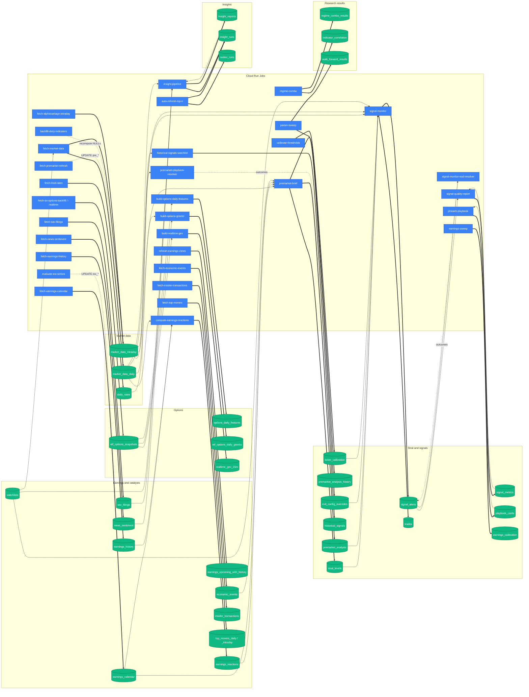

# Data Dependencies — table-level write/read graph

**Generated 2026-09-07** from [`gcp/schema.sql`](gcp/schema.sql), a whole-word scan of `gcp/`, `lib/`, `scripts/` and `platform/api` (tests and `archive/` excluded), and the 2026-09-07 live table statistics, by [`scripts/maintenance/doc_inventory.py`](scripts/maintenance/doc_inventory.py). Every citation is a `file:line` you can open. The blocks between `<!-- inventory:*:start/end -->` markers are re-rendered by the monthly refresh; the prose between them is maintained by hand.

This doc complements [ARCHITECTURE.md](ARCHITECTURE.md) §5 (schema by domain) and §6 (jobs). Where ARCHITECTURE says "job X runs module Y", this doc answers "module Y writes table Z, and Z is read by A, B, C".

> **Partition handling.** `market_data_intraday` is LIST-partitioned by ticker; the five children (`_spy`, `_iwm`, `_qqq`, `_spx`, `_other`) are routed by Postgres and never named in code, so they appear in §1 and §5 but have no entries of their own in §2/§3.
>
> **Runtime tables.** The live database holds 28 relations that `gcp/schema.sql` does not declare (`strat_features_*`, `magnitude_*`, `gamma_levels_eod`, `daily_vex`, `gamma_events`, `*_30m_predictions`, `market_data_indicators*`, `market_data_cross_asset`); they are created by research and analytics jobs at runtime. They are listed in §1b with row counts but have no write/read graph here because their names are built dynamically in code.
>
> **Ad-hoc access.** [`scripts/db_query_cr.sh`](scripts/db_query_cr.sh) → the `db-query` Cloud Run Job can read or (with `--commit`) write any table. It is an operator tool, not a pipeline component, and is not listed as a writer or reader.

---

## 1. Table inventory (declared in `gcp/schema.sql`)

<!-- inventory:tables:start -->
| Relation | Kind | Defined |
|---|---|---|
| `admin_refresh_leases` | table | [`gcp/schema.sql:4013`](gcp/schema.sql#L4013) |
| `archive_yahoo_earnings_options_snapshots` | table | [`gcp/schema.sql:528`](gcp/schema.sql#L528) |
| `archive_yahoo_etf_options_snapshots` | table | [`gcp/schema.sql:525`](gcp/schema.sql#L525) |
| `archive_yahoo_market_data_daily` | table | [`gcp/schema.sql:519`](gcp/schema.sql#L519) |
| `archive_yahoo_market_data_intraday` | table | [`gcp/schema.sql:522`](gcp/schema.sql#L522) |
| `backtest_reports` | table | [`gcp/schema.sql:2960`](gcp/schema.sql#L2960) |
| `backtest_sweeps` | table | [`gcp/schema.sql:2931`](gcp/schema.sql#L2931) |
| `backtest_trades` | table | [`gcp/schema.sql:2889`](gcp/schema.sql#L2889) |
| `backtest_walk_forward_folds` | table | [`gcp/schema.sql:2986`](gcp/schema.sql#L2986) |
| `daily_rates` | table | [`gcp/schema.sql:498`](gcp/schema.sql#L498) |
| `earnings_calendar` | table | [`gcp/schema.sql:538`](gcp/schema.sql#L538) |
| `earnings_calibration` | table | [`gcp/schema.sql:3079`](gcp/schema.sql#L3079) |
| `earnings_history` | table | [`gcp/schema.sql:699`](gcp/schema.sql#L699) |
| `earnings_options_snapshots` | table | [`gcp/schema.sql:437`](gcp/schema.sql#L437) |
| `earnings_options_strategy_insights` | table | [`gcp/schema.sql:3307`](gcp/schema.sql#L3307) |
| `earnings_options_strategy_winners` | table | [`gcp/schema.sql:3335`](gcp/schema.sql#L3335) |
| `earnings_reactions` | table | [`gcp/schema.sql:745`](gcp/schema.sql#L745) |
| `earnings_upcoming_with_history` | table | [`gcp/schema.sql:3725`](gcp/schema.sql#L3725) |
| `economic_events` | table | [`gcp/schema.sql:1344`](gcp/schema.sql#L1344) |
| `etf_options_daily_greeks` | table | [`gcp/schema.sql:344`](gcp/schema.sql#L344) |
| `etf_options_snapshots` | table | [`gcp/schema.sql:150`](gcp/schema.sql#L150) |
| `exit_config_overrides` | table | [`gcp/schema.sql:2343`](gcp/schema.sql#L2343) |
| `historical_signals` | table | [`gcp/schema.sql:2029`](gcp/schema.sql#L2029) |
| `indicator_correlation` | table | [`gcp/schema.sql:3148`](gcp/schema.sql#L3148) |
| `insider_transactions` | table | [`gcp/schema.sql:951`](gcp/schema.sql#L951) |
| `insight_reports` | table | [`gcp/schema.sql:1443`](gcp/schema.sql#L1443) |
| `insight_reports_history` | table | [`gcp/schema.sql:1960`](gcp/schema.sql#L1960) |
| `insight_runs` | table | [`gcp/schema.sql:1479`](gcp/schema.sql#L1479) |
| `intraday_flow_15m` | table | [`gcp/schema.sql:384`](gcp/schema.sql#L384) |
| `intraday_gex_15m` | table | [`gcp/schema.sql:405`](gcp/schema.sql#L405) |
| `job_runs` | table | [`gcp/schema.sql:3862`](gcp/schema.sql#L3862) |
| `journal_entries` | table | [`gcp/schema.sql:1163`](gcp/schema.sql#L1163) |
| `market_data_daily` | table | [`gcp/schema.sql:12`](gcp/schema.sql#L12) |
| `market_data_intraday` | table | [`gcp/schema.sql:115`](gcp/schema.sql#L115) |
| `market_data_intraday_iwm` | partition of `market_data_intraday` | [`gcp/schema.sql:133`](gcp/schema.sql#L133) |
| `market_data_intraday_other` | partition of `market_data_intraday` | [`gcp/schema.sql:139`](gcp/schema.sql#L139) |
| `market_data_intraday_qqq` | partition of `market_data_intraday` | [`gcp/schema.sql:135`](gcp/schema.sql#L135) |
| `market_data_intraday_spx` | partition of `market_data_intraday` | [`gcp/schema.sql:137`](gcp/schema.sql#L137) |
| `market_data_intraday_spy` | partition of `market_data_intraday` | [`gcp/schema.sql:131`](gcp/schema.sql#L131) |
| `model_routing` | table | [`gcp/schema.sql:1411`](gcp/schema.sql#L1411) |
| `news_sentiment` | table | [`gcp/schema.sql:1521`](gcp/schema.sql#L1521) |
| `options_daily_features` | table | [`gcp/schema.sql:247`](gcp/schema.sql#L247) |
| `playbook_cards` | table | [`gcp/schema.sql:1270`](gcp/schema.sql#L1270) |
| `playbook_cards_staging` | table | [`gcp/schema.sql:3836`](gcp/schema.sql#L3836) |
| `premarket_analysis` | table | [`gcp/schema.sql:1216`](gcp/schema.sql#L1216) |
| `premarket_analysis_history` | table | [`gcp/schema.sql:1845`](gcp/schema.sql#L1845) |
| `ranker_runs` | table | [`gcp/schema.sql:1026`](gcp/schema.sql#L1026) |
| `realtime_gex_15m` | table | [`gcp/schema.sql:424`](gcp/schema.sql#L424) |
| `regime_combo_results` | table | [`gcp/schema.sql:3225`](gcp/schema.sql#L3225) |
| `sec_filings` | table | [`gcp/schema.sql:918`](gcp/schema.sql#L918) |
| `signal_alerts` | table | [`gcp/schema.sql:1044`](gcp/schema.sql#L1044) |
| `signal_metrics` | table | [`gcp/schema.sql:2573`](gcp/schema.sql#L2573) |
| `strat_combo_results` | table | [`gcp/schema.sql:3257`](gcp/schema.sql#L3257) |
| `strat_levels` | table | [`gcp/schema.sql:1561`](gcp/schema.sql#L1561) |
| `ticker_calibration` | table | [`gcp/schema.sql:2256`](gcp/schema.sql#L2256) |
| `ticker_info` | table | [`gcp/schema.sql:2082`](gcp/schema.sql#L2082) |
| `top_movers_daily` | table | [`gcp/schema.sql:977`](gcp/schema.sql#L977) |
| `top_movers_intraday` | table | [`gcp/schema.sql:1001`](gcp/schema.sql#L1001) |
| `trades` | table | [`gcp/schema.sql:1120`](gcp/schema.sql#L1120) |
| `user_preferences` | table | [`gcp/schema.sql:3950`](gcp/schema.sql#L3950) |
| `user_profile` | table | [`gcp/schema.sql:3981`](gcp/schema.sql#L3981) |
| `user_roles` | table | [`gcp/schema.sql:3899`](gcp/schema.sql#L3899) |
| `user_style_results` | table | [`gcp/schema.sql:3818`](gcp/schema.sql#L3818) |
| `waitlist_signups` | table | [`gcp/schema.sql:3805`](gcp/schema.sql#L3805) |
| `walk_forward_results` | table | [`gcp/schema.sql:3032`](gcp/schema.sql#L3032) |
| `watchlists` | table | [`gcp/schema.sql:2138`](gcp/schema.sql#L2138) |
| `earnings_event_outcomes` | materialized view | [`gcp/schema.sql:3473`](gcp/schema.sql#L3473) |
| `earnings_ticker_lean` | materialized view | [`gcp/schema.sql:3664`](gcp/schema.sql#L3664) |
| `v_etf_options_node` | view | [`gcp/schema.sql:281`](gcp/schema.sql#L281) |
<!-- inventory:tables:end -->

### 1b. Live relations, rows and sizes (2026-09-07)

<!-- inventory:dbtables:start -->
| Relation (live) | Rows (estimate) | Size | Declared in |
|---|---|---|---|
| `admin_refresh_leases` | 0 | 16 kB | `gcp/schema.sql` |
| `archive_yahoo_earnings_options_snapshots` | 0 | 24 kB | `gcp/schema.sql` |
| `archive_yahoo_etf_options_snapshots` | 0 | 40 kB | `gcp/schema.sql` |
| `archive_yahoo_market_data_daily` | 0 | 24 kB | `gcp/schema.sql` |
| `archive_yahoo_market_data_intraday` | 0 | 5920 kB | `gcp/schema.sql` |
| `backtest_reports` | 1 | 144 kB | `gcp/schema.sql` |
| `backtest_sweeps` | 45 | 96 kB | `gcp/schema.sql` |
| `backtest_trades` | 149,898 | 48 MB | `gcp/schema.sql` |
| `backtest_walk_forward_folds` | 0 | 496 kB | `gcp/schema.sql` |
| `daily_rates` | 2,916 | 424 kB | `gcp/schema.sql` |
| `daily_vex` | 218 | 936 kB | **runtime-created** (not in schema.sql) |
| `earnings_calendar` | 60,076 | 24 MB | `gcp/schema.sql` |
| `earnings_calibration` | 0 | 48 kB | `gcp/schema.sql` |
| `earnings_event_outcomes` | 0 | 24 kB | `gcp/schema.sql` |
| `earnings_history` | 132,353 | 41 MB | `gcp/schema.sql` |
| `earnings_options_snapshots` | 0 | 588 MB | `gcp/schema.sql` |
| `earnings_options_strategy_insights` | 0 | 104 kB | `gcp/schema.sql` |
| `earnings_options_strategy_winners` | 0 | 160 kB | `gcp/schema.sql` |
| `earnings_reactions` | 62,783 | 50 MB | `gcp/schema.sql` |
| `earnings_ticker_lean` | 0 | 32 kB | `gcp/schema.sql` |
| `earnings_upcoming_with_history` | 46,320 | 15 MB | `gcp/schema.sql` |
| `economic_events` | 2,981 | 648 kB | `gcp/schema.sql` |
| `etf_options_daily_greeks` | 8,042 | 976 kB | `gcp/schema.sql` |
| `etf_options_snapshots` | 141,113,379 | 74 GB | `gcp/schema.sql` |
| `exit_config_overrides` | 0 | 48 kB | `gcp/schema.sql` |
| `gamma_events` | 0 | 3456 kB | **runtime-created** (not in schema.sql) |
| `gamma_levels_eod` | 102,442 | 31 MB | **runtime-created** (not in schema.sql) |
| `historical_signals` | 96,376 | 3376 MB | `gcp/schema.sql` |
| `indicator_correlation` | 3,016 | 1512 kB | `gcp/schema.sql` |
| `insider_transactions` | 1,708,432 | 594 MB | `gcp/schema.sql` |
| `insight_reports` | 790 | 4384 kB | `gcp/schema.sql` |
| `insight_reports_history` | 846 | 3200 kB | `gcp/schema.sql` |
| `insight_runs` | 948 | 360 kB | `gcp/schema.sql` |
| `intraday_flow_15m` | 529,920 | 63 MB | `gcp/schema.sql` |
| `intraday_gex_15m` | 487,540 | 87 MB | `gcp/schema.sql` |
| `iwm_30m_predictions` | 0 | 352 kB | **runtime-created** (not in schema.sql) |
| `job_runs` | 14 | 48 kB | `gcp/schema.sql` |
| `journal_entries` | 2 | 1288 kB | `gcp/schema.sql` |
| `magnitude_per_bar_predictions` | 15,380 | 4584 kB | **runtime-created** (not in schema.sql) |
| `magnitude_walk_forward_results` | 1,695 | 1184 kB | **runtime-created** (not in schema.sql) |
| `market_data_cross_asset` | 0 | 16 kB | **runtime-created** (not in schema.sql) |
| `market_data_daily` | 5,553,479 | 3895 MB | `gcp/schema.sql` |
| `market_data_indicators` | 0 | 0 bytes | **runtime-created** (not in schema.sql) |
| `market_data_indicators_iwm` | 0 | 2200 kB | **runtime-created** (not in schema.sql) |
| `market_data_indicators_other` | 0 | 16 kB | **runtime-created** (not in schema.sql) |
| `market_data_indicators_qqq` | 0 | 2224 kB | **runtime-created** (not in schema.sql) |
| `market_data_indicators_spy` | 0 | 2232 kB | **runtime-created** (not in schema.sql) |
| `market_data_intraday` | 0 | 0 bytes | `gcp/schema.sql` |
| `market_data_intraday_iwm` | 2,006,813 | 512 MB | `gcp/schema.sql` |
| `market_data_intraday_other` | 5,653,650 | 67 GB | `gcp/schema.sql` |
| `market_data_intraday_qqq` | 2,281,849 | 585 MB | `gcp/schema.sql` |
| `market_data_intraday_spx` | 0 | 2144 kB | `gcp/schema.sql` |
| `market_data_intraday_spy` | 2,432,886 | 664 MB | `gcp/schema.sql` |
| `model_routing` | 0 | 24 kB | `gcp/schema.sql` |
| `news_sentiment` | 212,368 | 298 MB | `gcp/schema.sql` |
| `options_daily_features` | 8,042 | 1112 kB | `gcp/schema.sql` |
| `playbook_cards` | 72 | 144 kB | `gcp/schema.sql` |
| `playbook_cards_staging` | 0 | 16 kB | `gcp/schema.sql` |
| `premarket_analysis` | 383 | 1208 kB | `gcp/schema.sql` |
| `premarket_analysis_history` | 702 | 1664 kB | `gcp/schema.sql` |
| `qqq_30m_predictions` | 0 | 352 kB | **runtime-created** (not in schema.sql) |
| `ranker_runs` | 93 | 840 kB | `gcp/schema.sql` |
| `realtime_gex_15m` | 6,321 | 904 kB | `gcp/schema.sql` |
| `regime_combo_results` | 8,640 | 3872 kB | `gcp/schema.sql` |
| `sec_filings` | 4,274 | 1560 kB | `gcp/schema.sql` |
| `signal_alerts` | 3,011 | 2648 kB | `gcp/schema.sql` |
| `signal_metrics` | 179,485 | 58 MB | `gcp/schema.sql` |
| `spy_30m_predictions` | 0 | 352 kB | **runtime-created** (not in schema.sql) |
| `strat_combo_results` | 0 | 32 kB | `gcp/schema.sql` |
| `strat_features_15m` | 206,458 | 303 MB | **runtime-created** (not in schema.sql) |
| `strat_features_1m` | 3,105,422 | 4080 MB | **runtime-created** (not in schema.sql) |
| `strat_features_30m` | 103,261 | 152 MB | **runtime-created** (not in schema.sql) |
| `strat_features_4h` | 18,542 | 26 MB | **runtime-created** (not in schema.sql) |
| `strat_features_5m` | 587,853 | 811 MB | **runtime-created** (not in schema.sql) |
| `strat_features_60m` | 55,619 | 81 MB | **runtime-created** (not in schema.sql) |
| `strat_features_levels_15m` | 206,661 | 368 MB | **runtime-created** (not in schema.sql) |
| `strat_features_levels_1m` | 3,087,834 | 8155 MB | **runtime-created** (not in schema.sql) |
| `strat_features_levels_30m` | 103,261 | 184 MB | **runtime-created** (not in schema.sql) |
| `strat_features_levels_4h` | 18,542 | 28 MB | **runtime-created** (not in schema.sql) |
| `strat_features_levels_5m` | 617,241 | 1134 MB | **runtime-created** (not in schema.sql) |
| `strat_features_levels_60m` | 55,619 | 86 MB | **runtime-created** (not in schema.sql) |
| `strat_levels` | 13,889 | 3184 kB | `gcp/schema.sql` |
| `ticker_calibration` | 1 | 48 kB | `gcp/schema.sql` |
| `ticker_info` | 0 | 24 kB | `gcp/schema.sql` |
| `top_movers_daily` | 5,760 | 1128 kB | `gcp/schema.sql` |
| `top_movers_intraday` | 6,380 | 1152 kB | `gcp/schema.sql` |
| `trades` | 2,968 | 1360 kB | `gcp/schema.sql` |
| `user_preferences` | 1 | 32 kB | `gcp/schema.sql` |
| `user_profile` | 0 | 16 kB | `gcp/schema.sql` |
| `user_roles` | 2 | 48 kB | `gcp/schema.sql` |
| `user_style_results` | 0 | 24 kB | `gcp/schema.sql` |
| `waitlist_signups` | 1 | 48 kB | `gcp/schema.sql` |
| `walk_forward_results` | 0 | 264 kB | `gcp/schema.sql` |
| `watchlists` | 0 | 64 kB | `gcp/schema.sql` |

Declared in `gcp/schema.sql` but absent live: `v_etf_options_node`
<!-- inventory:dbtables:end -->

---

## 2. Write graph

A "write" is `upsert_dataframe` / `bulk_copy_upsert` / `bulk_insert_dataframe`, `INSERT INTO`, `UPDATE`, `DELETE FROM`, `to_sql`, `TRUNCATE`, `REFRESH MATERIALIZED VIEW` or `ON CONFLICT` within three lines of the table name, including through a module constant (`TABLE = "…"`). Writers under `scripts/` are one-shot or operator-run unless a Cloud Run Job's entrypoint names them (see §6).

<!-- inventory:writes:start -->
### `admin_refresh_leases`
- [`platform/api/routers/admin.py`](platform/api/routers/admin.py) — line [1260](platform/api/routers/admin.py#L1260), [1263](platform/api/routers/admin.py#L1263), [1286](platform/api/routers/admin.py#L1286)

### `archive_yahoo_earnings_options_snapshots`
- _no writer found in gcp/, lib/, scripts/, platform/api_

### `archive_yahoo_etf_options_snapshots`
- _no writer found in gcp/, lib/, scripts/, platform/api_

### `archive_yahoo_market_data_daily`
- _no writer found in gcp/, lib/, scripts/, platform/api_

### `archive_yahoo_market_data_intraday`
- _no writer found in gcp/, lib/, scripts/, platform/api_

### `backtest_reports`
- [`scripts/generate_backtest_report.py`](scripts/generate_backtest_report.py) — line [379](scripts/generate_backtest_report.py#L379), [387](scripts/generate_backtest_report.py#L387)

### `backtest_sweeps`
- [`scripts/run_timeframe_sweep.py`](scripts/run_timeframe_sweep.py) — line [65](scripts/run_timeframe_sweep.py#L65)

### `backtest_trades`
- [`scripts/run_backtest.py`](scripts/run_backtest.py) — line [78](scripts/run_backtest.py#L78)

### `backtest_walk_forward_folds`
- [`scripts/run_walk_forward.py`](scripts/run_walk_forward.py) — line [144](scripts/run_walk_forward.py#L144)

### `daily_rates`
- [`gcp/fetchers/fetch_fred_rates.py`](gcp/fetchers/fetch_fred_rates.py) — line [113](gcp/fetchers/fetch_fred_rates.py#L113), [120](gcp/fetchers/fetch_fred_rates.py#L120), [170](gcp/fetchers/fetch_fred_rates.py#L170), [171](gcp/fetchers/fetch_fred_rates.py#L171)

### `earnings_calendar`
- [`gcp/fetchers/evaluate_ew_strikes.py`](gcp/fetchers/evaluate_ew_strikes.py) — line [170](gcp/fetchers/evaluate_ew_strikes.py#L170)
- [`scripts/fetch_earnings_calendar.py`](scripts/fetch_earnings_calendar.py) — line [1198](scripts/fetch_earnings_calendar.py#L1198), [1201](scripts/fetch_earnings_calendar.py#L1201)

### `earnings_calibration`
- [`scripts/calibrate_earnings.py`](scripts/calibrate_earnings.py) — line [156](scripts/calibrate_earnings.py#L156)

### `earnings_event_outcomes`
- _no writer found in gcp/, lib/, scripts/, platform/api_

### `earnings_history`
- [`gcp/fetchers/fetch_earnings_history.py`](gcp/fetchers/fetch_earnings_history.py) — line [536](gcp/fetchers/fetch_earnings_history.py#L536), [539](gcp/fetchers/fetch_earnings_history.py#L539), [540](gcp/fetchers/fetch_earnings_history.py#L540)

### `earnings_options_snapshots`
- [`gcp/fetchers/fetch_av_earnings_options_backfill.py`](gcp/fetchers/fetch_av_earnings_options_backfill.py) — line [348](gcp/fetchers/fetch_av_earnings_options_backfill.py#L348)
- [`gcp/migrate_to_gcp.py`](gcp/migrate_to_gcp.py) — line [506](gcp/migrate_to_gcp.py#L506), [534](gcp/migrate_to_gcp.py#L534)

### `earnings_options_strategy_insights`
- [`scripts/backtest_playability.py`](scripts/backtest_playability.py) — line [744](scripts/backtest_playability.py#L744), [997](scripts/backtest_playability.py#L997)

### `earnings_options_strategy_winners`
- [`scripts/backtest_playability.py`](scripts/backtest_playability.py) — line [746](scripts/backtest_playability.py#L746), [1005](scripts/backtest_playability.py#L1005)

### `earnings_reactions`
- [`gcp/fetchers/compute_earnings_reactions.py`](gcp/fetchers/compute_earnings_reactions.py) — line [18](gcp/fetchers/compute_earnings_reactions.py#L18), [688](gcp/fetchers/compute_earnings_reactions.py#L688), [771](gcp/fetchers/compute_earnings_reactions.py#L771), [774](gcp/fetchers/compute_earnings_reactions.py#L774)

### `earnings_ticker_lean`
- _no writer found in gcp/, lib/, scripts/, platform/api_

### `earnings_upcoming_with_history`
- [`gcp/refresh_earnings_views.py`](gcp/refresh_earnings_views.py) — line [168](gcp/refresh_earnings_views.py#L168), [301](gcp/refresh_earnings_views.py#L301), [306](gcp/refresh_earnings_views.py#L306), [363](gcp/refresh_earnings_views.py#L363)

### `economic_events`
- [`gcp/fetchers/fetch_economic_events.py`](gcp/fetchers/fetch_economic_events.py) — line [400](gcp/fetchers/fetch_economic_events.py#L400), [401](gcp/fetchers/fetch_economic_events.py#L401)

### `etf_options_daily_greeks`
- [`gcp/build_options_daily_greeks.py`](gcp/build_options_daily_greeks.py) — line [62](gcp/build_options_daily_greeks.py#L62)

### `etf_options_snapshots`
- [`gcp/fetchers/fetch_av_historical_options.py`](gcp/fetchers/fetch_av_historical_options.py) — line [162](gcp/fetchers/fetch_av_historical_options.py#L162)
- [`gcp/fetchers/fetch_av_realtime_options.py`](gcp/fetchers/fetch_av_realtime_options.py) — line [256](gcp/fetchers/fetch_av_realtime_options.py#L256)
- [`gcp/migrate_to_gcp.py`](gcp/migrate_to_gcp.py) — line [379](gcp/migrate_to_gcp.py#L379), [438](gcp/migrate_to_gcp.py#L438), [450](gcp/migrate_to_gcp.py#L450), [461](gcp/migrate_to_gcp.py#L461), [491](gcp/migrate_to_gcp.py#L491)
- [`gcp/options_retention_job.py`](gcp/options_retention_job.py) — line [79](gcp/options_retention_job.py#L79)
- [`platform/api/routers/grid.py`](platform/api/routers/grid.py) — line [505](platform/api/routers/grid.py#L505)
- [`scripts/maintenance/compute_spx_greeks.py`](scripts/maintenance/compute_spx_greeks.py) — line [149](scripts/maintenance/compute_spx_greeks.py#L149)
- [`scripts/validate_track2_live.py`](scripts/validate_track2_live.py) — line [80](scripts/validate_track2_live.py#L80), [112](scripts/validate_track2_live.py#L112)

### `exit_config_overrides`
- [`scripts/run_param_sweep.py`](scripts/run_param_sweep.py) — line [134](scripts/run_param_sweep.py#L134)

### `historical_signals`
- [`gcp/historical_signals.py`](gcp/historical_signals.py) — line [114](gcp/historical_signals.py#L114), [117](gcp/historical_signals.py#L117), [221](gcp/historical_signals.py#L221)
- [`scripts/backfill_timeframe_tags.py`](scripts/backfill_timeframe_tags.py) — line [172](scripts/backfill_timeframe_tags.py#L172)
- [`scripts/run_historical_signals.py`](scripts/run_historical_signals.py) — line [112](scripts/run_historical_signals.py#L112)
- [`scripts/signal_quality_report.py`](scripts/signal_quality_report.py) — line [429](scripts/signal_quality_report.py#L429)

### `indicator_correlation`
- [`gcp/indicator_correlation_job.py`](gcp/indicator_correlation_job.py) — line [17](gcp/indicator_correlation_job.py#L17), [725](gcp/indicator_correlation_job.py#L725), [726](gcp/indicator_correlation_job.py#L726)

### `insider_transactions`
- [`gcp/fetchers/fetch_insider_transactions.py`](gcp/fetchers/fetch_insider_transactions.py) — line [227](gcp/fetchers/fetch_insider_transactions.py#L227), [231](gcp/fetchers/fetch_insider_transactions.py#L231), [232](gcp/fetchers/fetch_insider_transactions.py#L232)

### `insight_reports`
- [`gcp/insight_pipeline_job.py`](gcp/insight_pipeline_job.py) — line [285](gcp/insight_pipeline_job.py#L285), [302](gcp/insight_pipeline_job.py#L302), [333](gcp/insight_pipeline_job.py#L333)
- [`platform/api/routers/insights.py`](platform/api/routers/insights.py) — line [343](platform/api/routers/insights.py#L343)
- [`scripts/backfill_history_tables.py`](scripts/backfill_history_tables.py) — line [142](scripts/backfill_history_tables.py#L142)
- [`scripts/generate_historical_report.py`](scripts/generate_historical_report.py) — line [8](scripts/generate_historical_report.py#L8), [67](scripts/generate_historical_report.py#L67)

### `insight_reports_history`
- [`gcp/insight_pipeline_job.py`](gcp/insight_pipeline_job.py) — line [250](gcp/insight_pipeline_job.py#L250), [261](gcp/insight_pipeline_job.py#L261)
- [`scripts/backfill_history_tables.py`](scripts/backfill_history_tables.py) — line [142](scripts/backfill_history_tables.py#L142), [169](scripts/backfill_history_tables.py#L169)

### `insight_runs`
- [`gcp/auto_refresh_top_n.py`](gcp/auto_refresh_top_n.py) — line [98](gcp/auto_refresh_top_n.py#L98)
- [`gcp/discord_interactions/main.py`](gcp/discord_interactions/main.py) — line [377](gcp/discord_interactions/main.py#L377)
- [`gcp/insight_pipeline_job.py`](gcp/insight_pipeline_job.py) — line [177](gcp/insight_pipeline_job.py#L177), [200](gcp/insight_pipeline_job.py#L200), [206](gcp/insight_pipeline_job.py#L206), [215](gcp/insight_pipeline_job.py#L215)
- [`platform/api/routers/insights.py`](platform/api/routers/insights.py) — line [256](platform/api/routers/insights.py#L256), [309](platform/api/routers/insights.py#L309), [315](platform/api/routers/insights.py#L315), [324](platform/api/routers/insights.py#L324)
- [`scripts/backfill_history_tables.py`](scripts/backfill_history_tables.py) — line [144](scripts/backfill_history_tables.py#L144)

### `intraday_flow_15m`
- [`gcp/build_intraday_flow.py`](gcp/build_intraday_flow.py) — line [73](gcp/build_intraday_flow.py#L73)

### `intraday_gex_15m`
- [`gcp/build_intraday_gex.py`](gcp/build_intraday_gex.py) — line [186](gcp/build_intraday_gex.py#L186)

### `job_runs`
- [`gcp/database.py`](gcp/database.py) — line [847](gcp/database.py#L847)

### `journal_entries`
- [`platform/api/routers/journal.py`](platform/api/routers/journal.py) — line [480](platform/api/routers/journal.py#L480), [936](platform/api/routers/journal.py#L936), [986](platform/api/routers/journal.py#L986)
- [`scripts/backfill_journal_embeddings.py`](scripts/backfill_journal_embeddings.py) — line [79](scripts/backfill_journal_embeddings.py#L79)

### `market_data_daily`
- [`gcp/backfill_ticker.py`](gcp/backfill_ticker.py) — line [329](gcp/backfill_ticker.py#L329), [436](gcp/backfill_ticker.py#L436), [504](gcp/backfill_ticker.py#L504)
- [`gcp/fetchers/backfill_daily_indicators.py`](gcp/fetchers/backfill_daily_indicators.py) — line [415](gcp/fetchers/backfill_daily_indicators.py#L415)
- [`gcp/fetchers/fetch_market_data.py`](gcp/fetchers/fetch_market_data.py) — line [436](gcp/fetchers/fetch_market_data.py#L436), [512](gcp/fetchers/fetch_market_data.py#L512), [520](gcp/fetchers/fetch_market_data.py#L520), [561](gcp/fetchers/fetch_market_data.py#L561), [804](gcp/fetchers/fetch_market_data.py#L804), [938](gcp/fetchers/fetch_market_data.py#L938)
- [`gcp/fetchers/fetch_premarket_refresh.py`](gcp/fetchers/fetch_premarket_refresh.py) — line [8](gcp/fetchers/fetch_premarket_refresh.py#L8), [215](gcp/fetchers/fetch_premarket_refresh.py#L215), [251](gcp/fetchers/fetch_premarket_refresh.py#L251), [256](gcp/fetchers/fetch_premarket_refresh.py#L256), [257](gcp/fetchers/fetch_premarket_refresh.py#L257), [258](gcp/fetchers/fetch_premarket_refresh.py#L258), [320](gcp/fetchers/fetch_premarket_refresh.py#L320)
- [`gcp/migrate_to_gcp.py`](gcp/migrate_to_gcp.py) — line [121](gcp/migrate_to_gcp.py#L121), [134](gcp/migrate_to_gcp.py#L134), [186](gcp/migrate_to_gcp.py#L186), [600](gcp/migrate_to_gcp.py#L600), [667](gcp/migrate_to_gcp.py#L667)
- [`gcp/premarket_brief.py`](gcp/premarket_brief.py) — line [256](gcp/premarket_brief.py#L256)
- [`scripts/backfill_and_replay.py`](scripts/backfill_and_replay.py) — line [324](scripts/backfill_and_replay.py#L324), [488](scripts/backfill_and_replay.py#L488)
- [`scripts/backfill_watchlist_data.py`](scripts/backfill_watchlist_data.py) — line [181](scripts/backfill_watchlist_data.py#L181), [233](scripts/backfill_watchlist_data.py#L233)
- [`scripts/deep_backfill_ticker.py`](scripts/deep_backfill_ticker.py) — line [6](scripts/deep_backfill_ticker.py#L6), [43](scripts/deep_backfill_ticker.py#L43), [102](scripts/deep_backfill_ticker.py#L102)

### `market_data_intraday`
- [`gcp/backfill_ticker.py`](gcp/backfill_ticker.py) — line [525](gcp/backfill_ticker.py#L525)
- [`gcp/fetchers/fetch_alphavantage_intraday.py`](gcp/fetchers/fetch_alphavantage_intraday.py) — line [307](gcp/fetchers/fetch_alphavantage_intraday.py#L307)
- [`gcp/fetchers/fetch_market_data.py`](gcp/fetchers/fetch_market_data.py) — line [464](gcp/fetchers/fetch_market_data.py#L464)
- [`gcp/migrate_to_gcp.py`](gcp/migrate_to_gcp.py) — line [210](gcp/migrate_to_gcp.py#L210), [244](gcp/migrate_to_gcp.py#L244), [247](gcp/migrate_to_gcp.py#L247)
- [`scripts/backfill_and_replay.py`](scripts/backfill_and_replay.py) — line [351](scripts/backfill_and_replay.py#L351)

### `market_data_intraday_iwm`
- _no writer found in gcp/, lib/, scripts/, platform/api_

### `market_data_intraday_other`
- _no writer found in gcp/, lib/, scripts/, platform/api_

### `market_data_intraday_qqq`
- _no writer found in gcp/, lib/, scripts/, platform/api_

### `market_data_intraday_spx`
- _no writer found in gcp/, lib/, scripts/, platform/api_

### `market_data_intraday_spy`
- _no writer found in gcp/, lib/, scripts/, platform/api_

### `model_routing`
- [`lib/agents/model_routing.py`](lib/agents/model_routing.py) — line [177](lib/agents/model_routing.py#L177)

### `news_sentiment`
- [`gcp/backfill_ticker.py`](gcp/backfill_ticker.py) — line [538](gcp/backfill_ticker.py#L538)
- [`gcp/fetchers/fetch_news_sentiment.py`](gcp/fetchers/fetch_news_sentiment.py) — line [375](gcp/fetchers/fetch_news_sentiment.py#L375), [376](gcp/fetchers/fetch_news_sentiment.py#L376)
- [`gcp/fetchers/fetch_rss_news.py`](gcp/fetchers/fetch_rss_news.py) — line [699](gcp/fetchers/fetch_rss_news.py#L699), [710](gcp/fetchers/fetch_rss_news.py#L710), [711](gcp/fetchers/fetch_rss_news.py#L711)
- [`scripts/backfill_and_replay.py`](scripts/backfill_and_replay.py) — line [652](scripts/backfill_and_replay.py#L652)
- [`scripts/backfill_news_sentiment.py`](scripts/backfill_news_sentiment.py) — line [101](scripts/backfill_news_sentiment.py#L101), [102](scripts/backfill_news_sentiment.py#L102)

### `options_daily_features`
- [`lib/features/experimental/options_derived.py`](lib/features/experimental/options_derived.py) — line [396](lib/features/experimental/options_derived.py#L396)

### `playbook_cards`
- [`scripts/analysis/phase6_playbook.py`](scripts/analysis/phase6_playbook.py) — line [943](scripts/analysis/phase6_playbook.py#L943), [990](scripts/analysis/phase6_playbook.py#L990), [993](scripts/analysis/phase6_playbook.py#L993), [1027](scripts/analysis/phase6_playbook.py#L1027), [1097](scripts/analysis/phase6_playbook.py#L1097)

### `playbook_cards_staging`
- [`platform/api/routers/backtest.py`](platform/api/routers/backtest.py) — line [782](platform/api/routers/backtest.py#L782)

### `premarket_analysis`
- [`gcp/premarket_brief.py`](gcp/premarket_brief.py) — line [3289](gcp/premarket_brief.py#L3289), [3290](gcp/premarket_brief.py#L3290), [3305](gcp/premarket_brief.py#L3305), [3307](gcp/premarket_brief.py#L3307)
- [`gcp/premarket_playbook_resolver.py`](gcp/premarket_playbook_resolver.py) — line [98](gcp/premarket_playbook_resolver.py#L98), [478](gcp/premarket_playbook_resolver.py#L478)
- [`gcp/signal_monitor.py`](gcp/signal_monitor.py) — line [544](gcp/signal_monitor.py#L544)
- [`scripts/backfill_history_tables.py`](scripts/backfill_history_tables.py) — line [96](scripts/backfill_history_tables.py#L96)

### `premarket_analysis_history`
- [`gcp/premarket_brief.py`](gcp/premarket_brief.py) — line [3262](gcp/premarket_brief.py#L3262), [3263](gcp/premarket_brief.py#L3263)
- [`scripts/backfill_history_tables.py`](scripts/backfill_history_tables.py) — line [96](scripts/backfill_history_tables.py#L96), [123](scripts/backfill_history_tables.py#L123)

### `ranker_runs`
- [`lib/agents/ranker/rank.py`](lib/agents/ranker/rank.py) — line [158](lib/agents/ranker/rank.py#L158)

### `realtime_gex_15m`
- [`gcp/build_realtime_gex.py`](gcp/build_realtime_gex.py) — line [128](gcp/build_realtime_gex.py#L128), [135](gcp/build_realtime_gex.py#L135)

### `regime_combo_results`
- [`gcp/regime_combo_job.py`](gcp/regime_combo_job.py) — line [189](gcp/regime_combo_job.py#L189), [190](gcp/regime_combo_job.py#L190)

### `sec_filings`
- [`gcp/fetchers/fetch_sec_filings.py`](gcp/fetchers/fetch_sec_filings.py) — line [581](gcp/fetchers/fetch_sec_filings.py#L581), [582](gcp/fetchers/fetch_sec_filings.py#L582), [583](gcp/fetchers/fetch_sec_filings.py#L583)

### `signal_alerts`
- [`gcp/signal_monitor.py`](gcp/signal_monitor.py) — line [1598](gcp/signal_monitor.py#L1598), [1599](gcp/signal_monitor.py#L1599), [1601](gcp/signal_monitor.py#L1601), [2179](gcp/signal_monitor.py#L2179), [2182](gcp/signal_monitor.py#L2182), [2204](gcp/signal_monitor.py#L2204)
- [`gcp/signal_monitor_eod_resolver.py`](gcp/signal_monitor_eod_resolver.py) — line [379](gcp/signal_monitor_eod_resolver.py#L379), [380](gcp/signal_monitor_eod_resolver.py#L380), [382](gcp/signal_monitor_eod_resolver.py#L382), [400](gcp/signal_monitor_eod_resolver.py#L400)
- [`scripts/backfill_signals.py`](scripts/backfill_signals.py) — line [227](scripts/backfill_signals.py#L227), [228](scripts/backfill_signals.py#L228)
- [`scripts/replay_signal_monitor.py`](scripts/replay_signal_monitor.py) — line [10](scripts/replay_signal_monitor.py#L10), [283](scripts/replay_signal_monitor.py#L283)

### `signal_metrics`
- [`scripts/signal_quality_report.py`](scripts/signal_quality_report.py) — line [426](scripts/signal_quality_report.py#L426), [461](scripts/signal_quality_report.py#L461), [656](scripts/signal_quality_report.py#L656)

### `strat_combo_results`
- _no writer found in gcp/, lib/, scripts/, platform/api_

### `strat_levels`
- [`lib/strat_levels.py`](lib/strat_levels.py) — line [1732](lib/strat_levels.py#L1732)

### `ticker_calibration`
- [`scripts/calibrate_thresholds.py`](scripts/calibrate_thresholds.py) — line [25](scripts/calibrate_thresholds.py#L25), [313](scripts/calibrate_thresholds.py#L313), [487](scripts/calibrate_thresholds.py#L487), [489](scripts/calibrate_thresholds.py#L489)

### `ticker_info`
- [`lib/ticker_info.py`](lib/ticker_info.py) — line [58](lib/ticker_info.py#L58), [63](lib/ticker_info.py#L63), [447](lib/ticker_info.py#L447), [452](lib/ticker_info.py#L452)

### `top_movers_daily`
- [`gcp/fetchers/fetch_top_movers.py`](gcp/fetchers/fetch_top_movers.py) — line [291](gcp/fetchers/fetch_top_movers.py#L291), [294](gcp/fetchers/fetch_top_movers.py#L294), [295](gcp/fetchers/fetch_top_movers.py#L295)

### `top_movers_intraday`
- [`gcp/fetchers/fetch_top_movers.py`](gcp/fetchers/fetch_top_movers.py) — line [261](gcp/fetchers/fetch_top_movers.py#L261), [264](gcp/fetchers/fetch_top_movers.py#L264), [265](gcp/fetchers/fetch_top_movers.py#L265)

### `trades`
- [`gcp/migrate_to_gcp.py`](gcp/migrate_to_gcp.py) — line [705](gcp/migrate_to_gcp.py#L705), [707](gcp/migrate_to_gcp.py#L707), [716](gcp/migrate_to_gcp.py#L716), [735](gcp/migrate_to_gcp.py#L735)
- [`gcp/signal_monitor.py`](gcp/signal_monitor.py) — line [2179](gcp/signal_monitor.py#L2179), [2181](gcp/signal_monitor.py#L2181), [2184](gcp/signal_monitor.py#L2184), [2187](gcp/signal_monitor.py#L2187), [2218](gcp/signal_monitor.py#L2218)
- [`gcp/signal_monitor_eod_resolver.py`](gcp/signal_monitor_eod_resolver.py) — line [379](gcp/signal_monitor_eod_resolver.py#L379), [383](gcp/signal_monitor_eod_resolver.py#L383), [387](gcp/signal_monitor_eod_resolver.py#L387), [390](gcp/signal_monitor_eod_resolver.py#L390), [393](gcp/signal_monitor_eod_resolver.py#L393), [413](gcp/signal_monitor_eod_resolver.py#L413)
- [`gcp/trade_logger.py`](gcp/trade_logger.py) — line [68](gcp/trade_logger.py#L68), [71](gcp/trade_logger.py#L71)
- [`scripts/analysis/phase7_feedback_loop.py`](scripts/analysis/phase7_feedback_loop.py) — line [276](scripts/analysis/phase7_feedback_loop.py#L276)
- [`scripts/backfill_signals.py`](scripts/backfill_signals.py) — line [231](scripts/backfill_signals.py#L231), [232](scripts/backfill_signals.py#L232)
- [`scripts/strat_struct_backtest.py`](scripts/strat_struct_backtest.py) — line [154](scripts/strat_struct_backtest.py#L154)

### `user_preferences`
- [`platform/api/routers/preferences.py`](platform/api/routers/preferences.py) — line [172](platform/api/routers/preferences.py#L172)

### `user_profile`
- [`platform/api/routers/profile.py`](platform/api/routers/profile.py) — line [184](platform/api/routers/profile.py#L184)

### `user_roles`
- [`platform/api/routers/admin.py`](platform/api/routers/admin.py) — line [932](platform/api/routers/admin.py#L932), [945](platform/api/routers/admin.py#L945)

### `user_style_results`
- [`platform/api/routers/backtest.py`](platform/api/routers/backtest.py) — line [752](platform/api/routers/backtest.py#L752)

### `v_etf_options_node`
- _no writer found in gcp/, lib/, scripts/, platform/api_

### `waitlist_signups`
- [`platform/api/routers/waitlist.py`](platform/api/routers/waitlist.py) — line [108](platform/api/routers/waitlist.py#L108)

### `walk_forward_results`
- [`scripts/run_param_sweep.py`](scripts/run_param_sweep.py) — line [108](scripts/run_param_sweep.py#L108)

### `watchlists`
- [`gcp/backfill_ticker.py`](gcp/backfill_ticker.py) — line [223](gcp/backfill_ticker.py#L223), [242](gcp/backfill_ticker.py#L242), [246](gcp/backfill_ticker.py#L246)
- [`gcp/discord_interactions/main.py`](gcp/discord_interactions/main.py) — line [655](gcp/discord_interactions/main.py#L655), [691](gcp/discord_interactions/main.py#L691)
- [`gcp/fetchers/_watchlist.py`](gcp/fetchers/_watchlist.py) — line [258](gcp/fetchers/_watchlist.py#L258), [262](gcp/fetchers/_watchlist.py#L262), [263](gcp/fetchers/_watchlist.py#L263), [295](gcp/fetchers/_watchlist.py#L295)
- [`gcp/signal_monitor.py`](gcp/signal_monitor.py) — line [288](gcp/signal_monitor.py#L288), [291](gcp/signal_monitor.py#L291)
<!-- inventory:writes:end -->

---

## 3. Read graph

A "read" is `SELECT`, `FROM`, `JOIN`, `query_to_dataframe`, `read_sql` or `row_exists` within three lines of the table name. Tests are excluded.

<!-- inventory:reads:start -->
### `admin_refresh_leases`
- _no readr found in gcp/, lib/, scripts/, platform/api_

### `archive_yahoo_earnings_options_snapshots`
- _no readr found in gcp/, lib/, scripts/, platform/api_

### `archive_yahoo_etf_options_snapshots`
- _no readr found in gcp/, lib/, scripts/, platform/api_

### `archive_yahoo_market_data_daily`
- _no readr found in gcp/, lib/, scripts/, platform/api_

### `archive_yahoo_market_data_intraday`
- _no readr found in gcp/, lib/, scripts/, platform/api_

### `backtest_reports`
- [`scripts/generate_backtest_report.py`](scripts/generate_backtest_report.py) — line [664](scripts/generate_backtest_report.py#L664), [666](scripts/generate_backtest_report.py#L666)

### `backtest_sweeps`
- [`scripts/generate_backtest_report.py`](scripts/generate_backtest_report.py) — line [166](scripts/generate_backtest_report.py#L166), [175](scripts/generate_backtest_report.py#L175), [181](scripts/generate_backtest_report.py#L181), [184](scripts/generate_backtest_report.py#L184)

### `backtest_trades`
- [`scripts/generate_backtest_report.py`](scripts/generate_backtest_report.py) — line [127](scripts/generate_backtest_report.py#L127), [141](scripts/generate_backtest_report.py#L141), [150](scripts/generate_backtest_report.py#L150), [153](scripts/generate_backtest_report.py#L153), [646](scripts/generate_backtest_report.py#L646)
- [`scripts/run_pipeline.py`](scripts/run_pipeline.py) — line [72](scripts/run_pipeline.py#L72), [87](scripts/run_pipeline.py#L87)

### `backtest_walk_forward_folds`
- [`scripts/calibrate_iwm_strat.py`](scripts/calibrate_iwm_strat.py) — line [179](scripts/calibrate_iwm_strat.py#L179), [199](scripts/calibrate_iwm_strat.py#L199)
- [`scripts/generate_backtest_report.py`](scripts/generate_backtest_report.py) — line [201](scripts/generate_backtest_report.py#L201), [214](scripts/generate_backtest_report.py#L214), [221](scripts/generate_backtest_report.py#L221), [224](scripts/generate_backtest_report.py#L224)

### `daily_rates`
- [`gcp/fetchers/fetch_fred_rates.py`](gcp/fetchers/fetch_fred_rates.py) — line [23](gcp/fetchers/fetch_fred_rates.py#L23)
- [`lib/options_exec_backtest/engine.py`](lib/options_exec_backtest/engine.py) — line [161](lib/options_exec_backtest/engine.py#L161), [162](lib/options_exec_backtest/engine.py#L162)
- [`lib/options_exec_backtest/pricing.py`](lib/options_exec_backtest/pricing.py) — line [9](lib/options_exec_backtest/pricing.py#L9)
- [`lib/options_exec_backtest/runner.py`](lib/options_exec_backtest/runner.py) — line [207](lib/options_exec_backtest/runner.py#L207), [214](lib/options_exec_backtest/runner.py#L214)
- [`lib/options_greeks.py`](lib/options_greeks.py) — line [108](lib/options_greeks.py#L108), [110](lib/options_greeks.py#L110), [124](lib/options_greeks.py#L124), [131](lib/options_greeks.py#L131)

### `earnings_calendar`
- [`gcp/earnings_long_watchlist.py`](gcp/earnings_long_watchlist.py) — line [119](gcp/earnings_long_watchlist.py#L119), [149](gcp/earnings_long_watchlist.py#L149)
- [`gcp/earnings_reactions_brief.py`](gcp/earnings_reactions_brief.py) — line [243](gcp/earnings_reactions_brief.py#L243), [293](gcp/earnings_reactions_brief.py#L293)
- [`gcp/fetchers/compute_earnings_reactions.py`](gcp/fetchers/compute_earnings_reactions.py) — line [9](gcp/fetchers/compute_earnings_reactions.py#L9), [62](gcp/fetchers/compute_earnings_reactions.py#L62), [557](gcp/fetchers/compute_earnings_reactions.py#L557), [567](gcp/fetchers/compute_earnings_reactions.py#L567), [827](gcp/fetchers/compute_earnings_reactions.py#L827)
- [`gcp/fetchers/evaluate_ew_strikes.py`](gcp/fetchers/evaluate_ew_strikes.py) — line [152](gcp/fetchers/evaluate_ew_strikes.py#L152)
- [`gcp/fetchers/fetch_earnings_history.py`](gcp/fetchers/fetch_earnings_history.py) — line [251](gcp/fetchers/fetch_earnings_history.py#L251), [265](gcp/fetchers/fetch_earnings_history.py#L265), [295](gcp/fetchers/fetch_earnings_history.py#L295)
- [`gcp/fetchers/fetch_insider_transactions.py`](gcp/fetchers/fetch_insider_transactions.py) — line [127](gcp/fetchers/fetch_insider_transactions.py#L127), [136](gcp/fetchers/fetch_insider_transactions.py#L136)
- [`gcp/fetchers/fetch_market_data.py`](gcp/fetchers/fetch_market_data.py) — line [630](gcp/fetchers/fetch_market_data.py#L630), [733](gcp/fetchers/fetch_market_data.py#L733)
- [`gcp/fetchers/fetch_news_sentiment.py`](gcp/fetchers/fetch_news_sentiment.py) — line [163](gcp/fetchers/fetch_news_sentiment.py#L163), [172](gcp/fetchers/fetch_news_sentiment.py#L172)
- [`gcp/fetchers/fetch_premarket_refresh.py`](gcp/fetchers/fetch_premarket_refresh.py) — line [86](gcp/fetchers/fetch_premarket_refresh.py#L86), [111](gcp/fetchers/fetch_premarket_refresh.py#L111)
- [`gcp/fetchers/fetch_sec_filings.py`](gcp/fetchers/fetch_sec_filings.py) — line [428](gcp/fetchers/fetch_sec_filings.py#L428), [437](gcp/fetchers/fetch_sec_filings.py#L437)
- [`gcp/premarket_brief.py`](gcp/premarket_brief.py) — line [369](gcp/premarket_brief.py#L369), [769](gcp/premarket_brief.py#L769)
- [`gcp/refresh_earnings_views.py`](gcp/refresh_earnings_views.py) — line [157](gcp/refresh_earnings_views.py#L157)
- [`lib/agents/ranker/candidates.py`](lib/agents/ranker/candidates.py) — line [89](lib/agents/ranker/candidates.py#L89)
- [`lib/agents/summarizers.py`](lib/agents/summarizers.py) — line [1262](lib/agents/summarizers.py#L1262)
- [`lib/earnings_reactions.py`](lib/earnings_reactions.py) — line [338](lib/earnings_reactions.py#L338)
- [`lib/strategies/catalyst_proximity.py`](lib/strategies/catalyst_proximity.py) — line [235](lib/strategies/catalyst_proximity.py#L235)
- [`platform/api/routers/catalysts.py`](platform/api/routers/catalysts.py) — line [332](platform/api/routers/catalysts.py#L332), [339](platform/api/routers/catalysts.py#L339), [519](platform/api/routers/catalysts.py#L519), [602](platform/api/routers/catalysts.py#L602)
- [`scripts/analysis/earnings_reaction_walkforward.py`](scripts/analysis/earnings_reaction_walkforward.py) — line [18](scripts/analysis/earnings_reaction_walkforward.py#L18)
- [`scripts/fetch_earnings_calendar.py`](scripts/fetch_earnings_calendar.py) — line [153](scripts/fetch_earnings_calendar.py#L153), [329](scripts/fetch_earnings_calendar.py#L329), [357](scripts/fetch_earnings_calendar.py#L357), [1208](scripts/fetch_earnings_calendar.py#L1208), [1209](scripts/fetch_earnings_calendar.py#L1209)

### `earnings_calibration`
- [`lib/earnings_reactions.py`](lib/earnings_reactions.py) — line [107](lib/earnings_reactions.py#L107), [434](lib/earnings_reactions.py#L434)
- [`platform/api/routers/earnings.py`](platform/api/routers/earnings.py) — line [309](platform/api/routers/earnings.py#L309)
- [`scripts/calibrate_earnings.py`](scripts/calibrate_earnings.py) — line [268](scripts/calibrate_earnings.py#L268)

### `earnings_event_outcomes`
- [`gcp/refresh_earnings_views.py`](gcp/refresh_earnings_views.py) — line [63](gcp/refresh_earnings_views.py#L63), [200](gcp/refresh_earnings_views.py#L200)
- [`platform/api/routers/earnings.py`](platform/api/routers/earnings.py) — line [4](platform/api/routers/earnings.py#L4), [153](platform/api/routers/earnings.py#L153), [178](platform/api/routers/earnings.py#L178)

### `earnings_history`
- [`gcp/fetchers/compute_earnings_reactions.py`](gcp/fetchers/compute_earnings_reactions.py) — line [3](gcp/fetchers/compute_earnings_reactions.py#L3), [5](gcp/fetchers/compute_earnings_reactions.py#L5), [9](gcp/fetchers/compute_earnings_reactions.py#L9), [57](gcp/fetchers/compute_earnings_reactions.py#L57), [61](gcp/fetchers/compute_earnings_reactions.py#L61), [547](gcp/fetchers/compute_earnings_reactions.py#L547), [559](gcp/fetchers/compute_earnings_reactions.py#L559), [795](gcp/fetchers/compute_earnings_reactions.py#L795) (+2 more)
- [`gcp/fetchers/fetch_earnings_history.py`](gcp/fetchers/fetch_earnings_history.py) — line [330](gcp/fetchers/fetch_earnings_history.py#L330), [372](gcp/fetchers/fetch_earnings_history.py#L372), [374](gcp/fetchers/fetch_earnings_history.py#L374)
- [`gcp/fetchers/fetch_market_data.py`](gcp/fetchers/fetch_market_data.py) — line [715](gcp/fetchers/fetch_market_data.py#L715), [741](gcp/fetchers/fetch_market_data.py#L741)
- [`lib/agents/ranker/signals.py`](lib/agents/ranker/signals.py) — line [356](lib/agents/ranker/signals.py#L356)
- [`platform/api/routers/catalysts.py`](platform/api/routers/catalysts.py) — line [519](platform/api/routers/catalysts.py#L519), [616](platform/api/routers/catalysts.py#L616)
- [`scripts/backfill_watchlist_data.py`](scripts/backfill_watchlist_data.py) — line [141](scripts/backfill_watchlist_data.py#L141)

### `earnings_options_snapshots`
- [`gcp/fetchers/fetch_av_earnings_options_backfill.py`](gcp/fetchers/fetch_av_earnings_options_backfill.py) — line [189](gcp/fetchers/fetch_av_earnings_options_backfill.py#L189)
- [`scripts/backtest_playability.py`](scripts/backtest_playability.py) — line [383](scripts/backtest_playability.py#L383), [551](scripts/backtest_playability.py#L551)

### `earnings_options_strategy_insights`
- [`platform/api/routers/earnings.py`](platform/api/routers/earnings.py) — line [263](platform/api/routers/earnings.py#L263), [270](platform/api/routers/earnings.py#L270)

### `earnings_options_strategy_winners`
- [`gcp/earnings_long_watchlist.py`](gcp/earnings_long_watchlist.py) — line [100](gcp/earnings_long_watchlist.py#L100), [130](gcp/earnings_long_watchlist.py#L130), [136](gcp/earnings_long_watchlist.py#L136)
- [`platform/api/routers/earnings.py`](platform/api/routers/earnings.py) — line [288](platform/api/routers/earnings.py#L288), [295](platform/api/routers/earnings.py#L295)

### `earnings_reactions`
- [`gcp/earnings_reactions_brief.py`](gcp/earnings_reactions_brief.py) — line [24](gcp/earnings_reactions_brief.py#L24), [348](gcp/earnings_reactions_brief.py#L348)
- [`gcp/fetchers/compute_earnings_reactions.py`](gcp/fetchers/compute_earnings_reactions.py) — line [3](gcp/fetchers/compute_earnings_reactions.py#L3), [867](gcp/fetchers/compute_earnings_reactions.py#L867), [883](gcp/fetchers/compute_earnings_reactions.py#L883)
- [`gcp/fetchers/fetch_av_earnings_options_backfill.py`](gcp/fetchers/fetch_av_earnings_options_backfill.py) — line [232](gcp/fetchers/fetch_av_earnings_options_backfill.py#L232)
- [`lib/earnings_reactions.py`](lib/earnings_reactions.py) — line [506](lib/earnings_reactions.py#L506), [540](lib/earnings_reactions.py#L540), [704](lib/earnings_reactions.py#L704)
- [`scripts/analysis/earnings_reaction_walkforward.py`](scripts/analysis/earnings_reaction_walkforward.py) — line [79](scripts/analysis/earnings_reaction_walkforward.py#L79), [440](scripts/analysis/earnings_reaction_walkforward.py#L440)
- [`scripts/backtest_playability.py`](scripts/backtest_playability.py) — line [77](scripts/backtest_playability.py#L77)

### `earnings_ticker_lean`
- [`gcp/refresh_earnings_views.py`](gcp/refresh_earnings_views.py) — line [63](gcp/refresh_earnings_views.py#L63), [179](gcp/refresh_earnings_views.py#L179)
- [`platform/api/routers/earnings.py`](platform/api/routers/earnings.py) — line [219](platform/api/routers/earnings.py#L219), [238](platform/api/routers/earnings.py#L238)

### `earnings_upcoming_with_history`
- [`platform/api/routers/earnings.py`](platform/api/routers/earnings.py) — line [122](platform/api/routers/earnings.py#L122), [124](platform/api/routers/earnings.py#L124)

### `economic_events`
- [`gcp/premarket_brief.py`](gcp/premarket_brief.py) — line [831](gcp/premarket_brief.py#L831), [846](gcp/premarket_brief.py#L846)
- [`gcp/research/magnitude_engine/mag_dataset.py`](gcp/research/magnitude_engine/mag_dataset.py) — line [131](gcp/research/magnitude_engine/mag_dataset.py#L131)
- [`lib/agents/ranker/candidates.py`](lib/agents/ranker/candidates.py) — line [195](lib/agents/ranker/candidates.py#L195)
- [`lib/agents/summarizers.py`](lib/agents/summarizers.py) — line [1253](lib/agents/summarizers.py#L1253)
- [`lib/gamma_glossary.py`](lib/gamma_glossary.py) — line [260](lib/gamma_glossary.py#L260)
- [`lib/strategies/catalyst_proximity.py`](lib/strategies/catalyst_proximity.py) — line [195](lib/strategies/catalyst_proximity.py#L195)
- [`platform/api/routers/catalysts.py`](platform/api/routers/catalysts.py) — line [302](platform/api/routers/catalysts.py#L302), [310](platform/api/routers/catalysts.py#L310)
- [`platform/api/routers/grid.py`](platform/api/routers/grid.py) — line [787](platform/api/routers/grid.py#L787)
- [`scripts/check_event_window_concentration.py`](scripts/check_event_window_concentration.py) — line [60](scripts/check_event_window_concentration.py#L60)

### `etf_options_daily_greeks`
- [`lib/features/flow_direction.py`](lib/features/flow_direction.py) — line [516](lib/features/flow_direction.py#L516)

### `etf_options_snapshots`
- [`gcp/build_intraday_gex.py`](gcp/build_intraday_gex.py) — line [61](gcp/build_intraday_gex.py#L61)
- [`gcp/build_realtime_gex.py`](gcp/build_realtime_gex.py) — line [64](gcp/build_realtime_gex.py#L64)
- [`gcp/fetchers/fetch_av_historical_options.py`](gcp/fetchers/fetch_av_historical_options.py) — line [45](gcp/fetchers/fetch_av_historical_options.py#L45), [134](gcp/fetchers/fetch_av_historical_options.py#L134), [232](gcp/fetchers/fetch_av_historical_options.py#L232)
- [`gcp/migrate_to_gcp.py`](gcp/migrate_to_gcp.py) — line [303](gcp/migrate_to_gcp.py#L303), [466](gcp/migrate_to_gcp.py#L466)
- [`gcp/options_retention_job.py`](gcp/options_retention_job.py) — line [1](gcp/options_retention_job.py#L1), [65](gcp/options_retention_job.py#L65), [68](gcp/options_retention_job.py#L68), [73](gcp/options_retention_job.py#L73), [75](gcp/options_retention_job.py#L75)
- [`gcp/premarket_brief.py`](gcp/premarket_brief.py) — line [164](gcp/premarket_brief.py#L164), [191](gcp/premarket_brief.py#L191)
- [`gcp/research/p2_build_gamma_levels.py`](gcp/research/p2_build_gamma_levels.py) — line [5](gcp/research/p2_build_gamma_levels.py#L5), [126](gcp/research/p2_build_gamma_levels.py#L126)
- [`gcp/research/p7_build_multi_tf_features.py`](gcp/research/p7_build_multi_tf_features.py) — line [161](gcp/research/p7_build_multi_tf_features.py#L161)
- [`gcp/research/strat_engine/breakout_meta_walk_forward.py`](gcp/research/strat_engine/breakout_meta_walk_forward.py) — line [98](gcp/research/strat_engine/breakout_meta_walk_forward.py#L98), [117](gcp/research/strat_engine/breakout_meta_walk_forward.py#L117), [124](gcp/research/strat_engine/breakout_meta_walk_forward.py#L124)
- [`gcp/research/strat_engine/strat_data_builder.py`](gcp/research/strat_engine/strat_data_builder.py) — line [247](gcp/research/strat_engine/strat_data_builder.py#L247)
- [`gcp/research/strat_engine/strat_dir_walk_forward_extended.py`](gcp/research/strat_engine/strat_dir_walk_forward_extended.py) — line [10](gcp/research/strat_engine/strat_dir_walk_forward_extended.py#L10)
- [`lib/agents/ranker/signals.py`](lib/agents/ranker/signals.py) — line [113](lib/agents/ranker/signals.py#L113), [117](lib/agents/ranker/signals.py#L117)
- [`lib/agents/summarizers.py`](lib/agents/summarizers.py) — line [522](lib/agents/summarizers.py#L522), [527](lib/agents/summarizers.py#L527), [601](lib/agents/summarizers.py#L601), [649](lib/agents/summarizers.py#L649), [655](lib/agents/summarizers.py#L655), [676](lib/agents/summarizers.py#L676), [682](lib/agents/summarizers.py#L682)
- [`lib/data_loader.py`](lib/data_loader.py) — line [556](lib/data_loader.py#L556), [598](lib/data_loader.py#L598)
- [`lib/features/experimental/options_derived.py`](lib/features/experimental/options_derived.py) — line [3](lib/features/experimental/options_derived.py#L3), [67](lib/features/experimental/options_derived.py#L67), [115](lib/features/experimental/options_derived.py#L115)
- [`lib/features/flow_direction.py`](lib/features/flow_direction.py) — line [4](lib/features/flow_direction.py#L4), [408](lib/features/flow_direction.py#L408), [445](lib/features/flow_direction.py#L445)
- [`lib/options_exec_backtest/__init__.py`](lib/options_exec_backtest/__init__.py) — line [12](lib/options_exec_backtest/__init__.py#L12)
- [`lib/options_exec_backtest/iv_lookup.py`](lib/options_exec_backtest/iv_lookup.py) — line [11](lib/options_exec_backtest/iv_lookup.py#L11), [127](lib/options_exec_backtest/iv_lookup.py#L127)
- [`lib/options_intraday.py`](lib/options_intraday.py) — line [165](lib/options_intraday.py#L165)
- [`platform/api/routers/grid.py`](platform/api/routers/grid.py) — line [14](platform/api/routers/grid.py#L14), [233](platform/api/routers/grid.py#L233), [239](platform/api/routers/grid.py#L239), [263](platform/api/routers/grid.py#L263), [269](platform/api/routers/grid.py#L269), [310](platform/api/routers/grid.py#L310), [316](platform/api/routers/grid.py#L316), [630](platform/api/routers/grid.py#L630) (+1 more)
- [`platform/api/routers/options.py`](platform/api/routers/options.py) — line [295](platform/api/routers/options.py#L295), [306](platform/api/routers/options.py#L306), [369](platform/api/routers/options.py#L369), [375](platform/api/routers/options.py#L375), [388](platform/api/routers/options.py#L388), [620](platform/api/routers/options.py#L620)
- [`scripts/analysis/calibrate_intraday_theta.py`](scripts/analysis/calibrate_intraday_theta.py) — line [13](scripts/analysis/calibrate_intraday_theta.py#L13), [52](scripts/analysis/calibrate_intraday_theta.py#L52)
- [`scripts/analysis/options_pnl_translation.py`](scripts/analysis/options_pnl_translation.py) — line [258](scripts/analysis/options_pnl_translation.py#L258), [359](scripts/analysis/options_pnl_translation.py#L359)
- [`scripts/audit_data_freshness.py`](scripts/audit_data_freshness.py) — line [979](scripts/audit_data_freshness.py#L979)
- [`scripts/backfill_watchlist_data.py`](scripts/backfill_watchlist_data.py) — line [125](scripts/backfill_watchlist_data.py#L125)
- [`scripts/implied_vs_realized_check.py`](scripts/implied_vs_realized_check.py) — line [25](scripts/implied_vs_realized_check.py#L25), [72](scripts/implied_vs_realized_check.py#L72), [114](scripts/implied_vs_realized_check.py#L114), [129](scripts/implied_vs_realized_check.py#L129)
- [`scripts/maintenance/compute_spx_greeks.py`](scripts/maintenance/compute_spx_greeks.py) — line [91](scripts/maintenance/compute_spx_greeks.py#L91), [101](scripts/maintenance/compute_spx_greeks.py#L101), [113](scripts/maintenance/compute_spx_greeks.py#L113), [121](scripts/maintenance/compute_spx_greeks.py#L121)

### `exit_config_overrides`
- [`lib/strategies/exit_config_overrides.py`](lib/strategies/exit_config_overrides.py) — line [4](lib/strategies/exit_config_overrides.py#L4), [104](lib/strategies/exit_config_overrides.py#L104)
- [`scripts/run_param_sweep.py`](scripts/run_param_sweep.py) — line [13](scripts/run_param_sweep.py#L13), [143](scripts/run_param_sweep.py#L143)

### `historical_signals`
- [`gcp/historical_signals.py`](gcp/historical_signals.py) — line [95](gcp/historical_signals.py#L95), [98](gcp/historical_signals.py#L98)
- [`platform/api/routers/signals.py`](platform/api/routers/signals.py) — line [1](platform/api/routers/signals.py#L1), [115](platform/api/routers/signals.py#L115), [138](platform/api/routers/signals.py#L138), [166](platform/api/routers/signals.py#L166), [318](platform/api/routers/signals.py#L318), [360](platform/api/routers/signals.py#L360)
- [`scripts/analyze_timeframe_heuristic.py`](scripts/analyze_timeframe_heuristic.py) — line [316](scripts/analyze_timeframe_heuristic.py#L316), [476](scripts/analyze_timeframe_heuristic.py#L476)
- [`scripts/backfill_timeframe_tags.py`](scripts/backfill_timeframe_tags.py) — line [73](scripts/backfill_timeframe_tags.py#L73), [126](scripts/backfill_timeframe_tags.py#L126)
- [`scripts/replay_signal_monitor.py`](scripts/replay_signal_monitor.py) — line [107](scripts/replay_signal_monitor.py#L107)
- [`scripts/signal_quality_report.py`](scripts/signal_quality_report.py) — line [279](scripts/signal_quality_report.py#L279), [382](scripts/signal_quality_report.py#L382)

### `indicator_correlation`
- _no readr found in gcp/, lib/, scripts/, platform/api_

### `insider_transactions`
- [`gcp/earnings_reactions_brief.py`](gcp/earnings_reactions_brief.py) — line [396](gcp/earnings_reactions_brief.py#L396)
- [`lib/agents/ranker/candidates.py`](lib/agents/ranker/candidates.py) — line [144](lib/agents/ranker/candidates.py#L144)
- [`lib/agents/ranker/signals.py`](lib/agents/ranker/signals.py) — line [422](lib/agents/ranker/signals.py#L422)
- [`platform/api/routers/catalysts.py`](platform/api/routers/catalysts.py) — line [374](platform/api/routers/catalysts.py#L374), [383](platform/api/routers/catalysts.py#L383), [518](platform/api/routers/catalysts.py#L518), [589](platform/api/routers/catalysts.py#L589)
- [`scripts/backfill_watchlist_data.py`](scripts/backfill_watchlist_data.py) — line [148](scripts/backfill_watchlist_data.py#L148)

### `insight_reports`
- [`gcp/auto_refresh_top_n.py`](gcp/auto_refresh_top_n.py) — line [70](gcp/auto_refresh_top_n.py#L70)
- [`gcp/discord_interactions/main.py`](gcp/discord_interactions/main.py) — line [354](gcp/discord_interactions/main.py#L354), [357](gcp/discord_interactions/main.py#L357)
- [`gcp/insight_discord_push.py`](gcp/insight_discord_push.py) — line [86](gcp/insight_discord_push.py#L86), [97](gcp/insight_discord_push.py#L97), [241](gcp/insight_discord_push.py#L241), [415](gcp/insight_discord_push.py#L415), [663](gcp/insight_discord_push.py#L663)
- [`gcp/insight_pipeline_job.py`](gcp/insight_pipeline_job.py) — line [357](gcp/insight_pipeline_job.py#L357)
- [`lib/strategies/insight_cache.py`](lib/strategies/insight_cache.py) — line [274](lib/strategies/insight_cache.py#L274)
- [`platform/api/routers/insights.py`](platform/api/routers/insights.py) — line [157](platform/api/routers/insights.py#L157), [169](platform/api/routers/insights.py#L169), [190](platform/api/routers/insights.py#L190), [226](platform/api/routers/insights.py#L226)
- [`scripts/backfill_and_replay.py`](scripts/backfill_and_replay.py) — line [549](scripts/backfill_and_replay.py#L549)
- [`scripts/backfill_history_tables.py`](scripts/backfill_history_tables.py) — line [3](scripts/backfill_history_tables.py#L3), [154](scripts/backfill_history_tables.py#L154), [156](scripts/backfill_history_tables.py#L156), [188](scripts/backfill_history_tables.py#L188), [189](scripts/backfill_history_tables.py#L189)
- [`scripts/validation/validate_brief_accuracy.py`](scripts/validation/validate_brief_accuracy.py) — line [365](scripts/validation/validate_brief_accuracy.py#L365)

### `insight_reports_history`
- [`scripts/backfill_history_tables.py`](scripts/backfill_history_tables.py) — line [4](scripts/backfill_history_tables.py#L4), [159](scripts/backfill_history_tables.py#L159)

### `insight_runs`
- [`gcp/discord_interactions/main.py`](gcp/discord_interactions/main.py) — line [400](gcp/discord_interactions/main.py#L400)
- [`gcp/insight_pipeline_job.py`](gcp/insight_pipeline_job.py) — line [156](gcp/insight_pipeline_job.py#L156)
- [`platform/api/routers/insights.py`](platform/api/routers/insights.py) — line [275](platform/api/routers/insights.py#L275)
- [`scripts/backfill_history_tables.py`](scripts/backfill_history_tables.py) — line [174](scripts/backfill_history_tables.py#L174)

### `intraday_flow_15m`
- [`gcp/build_intraday_flow.py`](gcp/build_intraday_flow.py) — line [92](gcp/build_intraday_flow.py#L92)
- [`lib/features/intraday_flow.py`](lib/features/intraday_flow.py) — line [185](lib/features/intraday_flow.py#L185)

### `intraday_gex_15m`
- [`gcp/build_intraday_gex.py`](gcp/build_intraday_gex.py) — line [198](gcp/build_intraday_gex.py#L198)
- [`gcp/build_realtime_gex.py`](gcp/build_realtime_gex.py) — line [5](gcp/build_realtime_gex.py#L5)
- [`lib/features/intraday_gex.py`](lib/features/intraday_gex.py) — line [226](lib/features/intraday_gex.py#L226), [227](lib/features/intraday_gex.py#L227), [231](lib/features/intraday_gex.py#L231), [226](lib/features/intraday_gex.py#L226)

### `job_runs`
- [`platform/api/routers/admin.py`](platform/api/routers/admin.py) — line [1105](platform/api/routers/admin.py#L1105), [1106](platform/api/routers/admin.py#L1106)
- [`scripts/audit_data_freshness.py`](scripts/audit_data_freshness.py) — line [1172](scripts/audit_data_freshness.py#L1172), [1173](scripts/audit_data_freshness.py#L1173), [1184](scripts/audit_data_freshness.py#L1184)

### `journal_entries`
- [`lib/agents/summarizers.py`](lib/agents/summarizers.py) — line [1541](lib/agents/summarizers.py#L1541)
- [`platform/api/routers/backtest.py`](platform/api/routers/backtest.py) — line [452](platform/api/routers/backtest.py#L452), [624](platform/api/routers/backtest.py#L624)
- [`platform/api/routers/journal.py`](platform/api/routers/journal.py) — line [329](platform/api/routers/journal.py#L329), [510](platform/api/routers/journal.py#L510), [604](platform/api/routers/journal.py#L604), [641](platform/api/routers/journal.py#L641), [733](platform/api/routers/journal.py#L733), [913](platform/api/routers/journal.py#L913)
- [`scripts/backfill_journal_embeddings.py`](scripts/backfill_journal_embeddings.py) — line [59](scripts/backfill_journal_embeddings.py#L59)

### `market_data_daily`
- [`gcp/backfill_ticker.py`](gcp/backfill_ticker.py) — line [288](gcp/backfill_ticker.py#L288), [353](gcp/backfill_ticker.py#L353)
- [`gcp/build_intraday_gex.py`](gcp/build_intraday_gex.py) — line [56](gcp/build_intraday_gex.py#L56), [73](gcp/build_intraday_gex.py#L73), [79](gcp/build_intraday_gex.py#L79)
- [`gcp/discord_interactions/main.py`](gcp/discord_interactions/main.py) — line [332](gcp/discord_interactions/main.py#L332)
- [`gcp/fetchers/backfill_daily_indicators.py`](gcp/fetchers/backfill_daily_indicators.py) — line [117](gcp/fetchers/backfill_daily_indicators.py#L117), [216](gcp/fetchers/backfill_daily_indicators.py#L216), [222](gcp/fetchers/backfill_daily_indicators.py#L222), [252](gcp/fetchers/backfill_daily_indicators.py#L252)
- [`gcp/fetchers/compute_earnings_reactions.py`](gcp/fetchers/compute_earnings_reactions.py) — line [3](gcp/fetchers/compute_earnings_reactions.py#L3), [600](gcp/fetchers/compute_earnings_reactions.py#L600), [659](gcp/fetchers/compute_earnings_reactions.py#L659), [883](gcp/fetchers/compute_earnings_reactions.py#L883)
- [`gcp/fetchers/fetch_fred_rates.py`](gcp/fetchers/fetch_fred_rates.py) — line [17](gcp/fetchers/fetch_fred_rates.py#L17)
- [`gcp/fetchers/fetch_market_data.py`](gcp/fetchers/fetch_market_data.py) — line [299](gcp/fetchers/fetch_market_data.py#L299), [717](gcp/fetchers/fetch_market_data.py#L717), [725](gcp/fetchers/fetch_market_data.py#L725), [750](gcp/fetchers/fetch_market_data.py#L750), [1011](gcp/fetchers/fetch_market_data.py#L1011)
- [`gcp/fetchers/fetch_premarket_refresh.py`](gcp/fetchers/fetch_premarket_refresh.py) — line [13](gcp/fetchers/fetch_premarket_refresh.py#L13), [146](gcp/fetchers/fetch_premarket_refresh.py#L146)
- [`gcp/migrate_to_gcp.py`](gcp/migrate_to_gcp.py) — line [147](gcp/migrate_to_gcp.py#L147), [611](gcp/migrate_to_gcp.py#L611)
- [`gcp/premarket_brief.py`](gcp/premarket_brief.py) — line [365](gcp/premarket_brief.py#L365), [370](gcp/premarket_brief.py#L370), [770](gcp/premarket_brief.py#L770), [2313](gcp/premarket_brief.py#L2313)
- [`gcp/premarket_playbook_resolver.py`](gcp/premarket_playbook_resolver.py) — line [116](gcp/premarket_playbook_resolver.py#L116)
- [`gcp/refresh_earnings_views.py`](gcp/refresh_earnings_views.py) — line [140](gcp/refresh_earnings_views.py#L140)
- [`gcp/research/p2_outcomes_grid.py`](gcp/research/p2_outcomes_grid.py) — line [144](gcp/research/p2_outcomes_grid.py#L144), [149](gcp/research/p2_outcomes_grid.py#L149)
- [`gcp/research/p45_deep_ds_job.py`](gcp/research/p45_deep_ds_job.py) — line [110](gcp/research/p45_deep_ds_job.py#L110), [111](gcp/research/p45_deep_ds_job.py#L111)
- [`gcp/research/p7_build_multi_tf_features.py`](gcp/research/p7_build_multi_tf_features.py) — line [112](gcp/research/p7_build_multi_tf_features.py#L112)
- [`gcp/research/strat_engine/strat_data_builder.py`](gcp/research/strat_engine/strat_data_builder.py) — line [198](gcp/research/strat_engine/strat_data_builder.py#L198)
- [`gcp/research/strat_engine/strat_data_pipeline.py`](gcp/research/strat_engine/strat_data_pipeline.py) — line [127](gcp/research/strat_engine/strat_data_pipeline.py#L127)
- [`gcp/research/strat_engine/strat_leakage_audit.py`](gcp/research/strat_engine/strat_leakage_audit.py) — line [112](gcp/research/strat_engine/strat_leakage_audit.py#L112), [114](gcp/research/strat_engine/strat_leakage_audit.py#L114), [116](gcp/research/strat_engine/strat_leakage_audit.py#L116)
- [`lib/agents/ranker/signals.py`](lib/agents/ranker/signals.py) — line [56](lib/agents/ranker/signals.py#L56), [134](lib/agents/ranker/signals.py#L134), [310](lib/agents/ranker/signals.py#L310), [357](lib/agents/ranker/signals.py#L357), [360](lib/agents/ranker/signals.py#L360)
- [`lib/agents/summarizers.py`](lib/agents/summarizers.py) — line [184](lib/agents/summarizers.py#L184), [204](lib/agents/summarizers.py#L204), [332](lib/agents/summarizers.py#L332), [938](lib/agents/summarizers.py#L938), [1163](lib/agents/summarizers.py#L1163)
- [`lib/agents/trade_planner.py`](lib/agents/trade_planner.py) — line [88](lib/agents/trade_planner.py#L88), [96](lib/agents/trade_planner.py#L96)
- [`lib/data_loader.py`](lib/data_loader.py) — line [172](lib/data_loader.py#L172), [376](lib/data_loader.py#L376), [402](lib/data_loader.py#L402), [566](lib/data_loader.py#L566), [581](lib/data_loader.py#L581)
- [`lib/earnings_reactions.py`](lib/earnings_reactions.py) — line [594](lib/earnings_reactions.py#L594)
- [`lib/features/experimental/cross_asset.py`](lib/features/experimental/cross_asset.py) — line [45](lib/features/experimental/cross_asset.py#L45)
- [`lib/features/experimental/vol_regime.py`](lib/features/experimental/vol_regime.py) — line [52](lib/features/experimental/vol_regime.py#L52)
- [`lib/options_greeks.py`](lib/options_greeks.py) — line [533](lib/options_greeks.py#L533)
- [`lib/strategies/gamma_proximity.py`](lib/strategies/gamma_proximity.py) — line [42](lib/strategies/gamma_proximity.py#L42)
- [`platform/api/main.py`](platform/api/main.py) — line [688](platform/api/main.py#L688), [763](platform/api/main.py#L763), [907](platform/api/main.py#L907), [1032](platform/api/main.py#L1032), [1044](platform/api/main.py#L1044), [1046](platform/api/main.py#L1046)
- [`platform/api/routers/catalysts.py`](platform/api/routers/catalysts.py) — line [519](platform/api/routers/catalysts.py#L519), [629](platform/api/routers/catalysts.py#L629)
- [`platform/api/routers/dashboard.py`](platform/api/routers/dashboard.py) — line [83](platform/api/routers/dashboard.py#L83), [142](platform/api/routers/dashboard.py#L142), [260](platform/api/routers/dashboard.py#L260)
- [`platform/api/routers/live.py`](platform/api/routers/live.py) — line [332](platform/api/routers/live.py#L332)
- [`scripts/audit_data_freshness.py`](scripts/audit_data_freshness.py) — line [964](scripts/audit_data_freshness.py#L964), [971](scripts/audit_data_freshness.py#L971), [1095](scripts/audit_data_freshness.py#L1095), [1103](scripts/audit_data_freshness.py#L1103)
- [`scripts/backfill_and_replay.py`](scripts/backfill_and_replay.py) — line [370](scripts/backfill_and_replay.py#L370), [542](scripts/backfill_and_replay.py#L542)
- [`scripts/backfill_watchlist_data.py`](scripts/backfill_watchlist_data.py) — line [109](scripts/backfill_watchlist_data.py#L109)
- [`scripts/deep_backfill_ticker.py`](scripts/deep_backfill_ticker.py) — line [127](scripts/deep_backfill_ticker.py#L127)
- [`scripts/strat_backtest.py`](scripts/strat_backtest.py) — line [37](scripts/strat_backtest.py#L37)

### `market_data_intraday`
- [`gcp/backfill_ticker.py`](gcp/backfill_ticker.py) — line [406](gcp/backfill_ticker.py#L406)
- [`gcp/build_intraday_gex.py`](gcp/build_intraday_gex.py) — line [106](gcp/build_intraday_gex.py#L106)
- [`gcp/build_realtime_gex.py`](gcp/build_realtime_gex.py) — line [22](gcp/build_realtime_gex.py#L22), [99](gcp/build_realtime_gex.py#L99)
- [`gcp/fetchers/fetch_alphavantage_intraday.py`](gcp/fetchers/fetch_alphavantage_intraday.py) — line [207](gcp/fetchers/fetch_alphavantage_intraday.py#L207)
- [`gcp/fetchers/fetch_market_data.py`](gcp/fetchers/fetch_market_data.py) — line [391](gcp/fetchers/fetch_market_data.py#L391)
- [`gcp/historical_signals.py`](gcp/historical_signals.py) — line [266](gcp/historical_signals.py#L266), [285](gcp/historical_signals.py#L285)
- [`gcp/indicator_correlation_job.py`](gcp/indicator_correlation_job.py) — line [4](gcp/indicator_correlation_job.py#L4)
- [`gcp/premarket_playbook_resolver.py`](gcp/premarket_playbook_resolver.py) — line [20](gcp/premarket_playbook_resolver.py#L20), [362](gcp/premarket_playbook_resolver.py#L362), [524](gcp/premarket_playbook_resolver.py#L524)
- [`gcp/regime_combo_job.py`](gcp/regime_combo_job.py) — line [4](gcp/regime_combo_job.py#L4)
- [`gcp/research/strat_engine/breakout_meta_walk_forward.py`](gcp/research/strat_engine/breakout_meta_walk_forward.py) — line [339](gcp/research/strat_engine/breakout_meta_walk_forward.py#L339)
- [`gcp/signal_monitor.py`](gcp/signal_monitor.py) — line [375](gcp/signal_monitor.py#L375), [405](gcp/signal_monitor.py#L405), [1745](gcp/signal_monitor.py#L1745)
- [`gcp/signal_monitor_eod_resolver.py`](gcp/signal_monitor_eod_resolver.py) — line [18](gcp/signal_monitor_eod_resolver.py#L18)
- [`lib/data_loader.py`](lib/data_loader.py) — line [172](lib/data_loader.py#L172), [288](lib/data_loader.py#L288), [301](lib/data_loader.py#L301)
- [`lib/features/intraday_flow.py`](lib/features/intraday_flow.py) — line [124](lib/features/intraday_flow.py#L124)
- [`lib/options_intraday.py`](lib/options_intraday.py) — line [253](lib/options_intraday.py#L253), [574](lib/options_intraday.py#L574), [585](lib/options_intraday.py#L585)
- [`lib/strat_levels.py`](lib/strat_levels.py) — line [622](lib/strat_levels.py#L622)
- [`platform/api/main.py`](platform/api/main.py) — line [506](platform/api/main.py#L506), [911](platform/api/main.py#L911), [1231](platform/api/main.py#L1231), [1249](platform/api/main.py#L1249)
- [`scripts/analysis/momentum_eligibility.py`](scripts/analysis/momentum_eligibility.py) — line [12](scripts/analysis/momentum_eligibility.py#L12)
- [`scripts/analysis/per_ticker_calibration.py`](scripts/analysis/per_ticker_calibration.py) — line [208](scripts/analysis/per_ticker_calibration.py#L208)
- [`scripts/backfill_and_replay.py`](scripts/backfill_and_replay.py) — line [459](scripts/backfill_and_replay.py#L459)
- [`scripts/backfill_signals.py`](scripts/backfill_signals.py) — line [4](scripts/backfill_signals.py#L4), [52](scripts/backfill_signals.py#L52)
- [`scripts/backfill_watchlist_data.py`](scripts/backfill_watchlist_data.py) — line [117](scripts/backfill_watchlist_data.py#L117)
- [`scripts/calibrate_thresholds.py`](scripts/calibrate_thresholds.py) — line [24](scripts/calibrate_thresholds.py#L24), [217](scripts/calibrate_thresholds.py#L217), [232](scripts/calibrate_thresholds.py#L232)
- [`scripts/compare_tier_fires.py`](scripts/compare_tier_fires.py) — line [3](scripts/compare_tier_fires.py#L3), [65](scripts/compare_tier_fires.py#L65)
- [`scripts/replay_signal_monitor.py`](scripts/replay_signal_monitor.py) — line [103](scripts/replay_signal_monitor.py#L103), [118](scripts/replay_signal_monitor.py#L118), [225](scripts/replay_signal_monitor.py#L225)
- [`scripts/run_historical_signals.py`](scripts/run_historical_signals.py) — line [143](scripts/run_historical_signals.py#L143)
- [`scripts/signal_quality_report.py`](scripts/signal_quality_report.py) — line [407](scripts/signal_quality_report.py#L407), [410](scripts/signal_quality_report.py#L410)
- [`scripts/validation/validate_brief_accuracy.py`](scripts/validation/validate_brief_accuracy.py) — line [247](scripts/validation/validate_brief_accuracy.py#L247), [311](scripts/validation/validate_brief_accuracy.py#L311), [538](scripts/validation/validate_brief_accuracy.py#L538)

### `market_data_intraday_iwm`
- _no readr found in gcp/, lib/, scripts/, platform/api_

### `market_data_intraday_other`
- _no readr found in gcp/, lib/, scripts/, platform/api_

### `market_data_intraday_qqq`
- _no readr found in gcp/, lib/, scripts/, platform/api_

### `market_data_intraday_spx`
- _no readr found in gcp/, lib/, scripts/, platform/api_

### `market_data_intraday_spy`
- _no readr found in gcp/, lib/, scripts/, platform/api_

### `model_routing`
- [`lib/agents/__init__.py`](lib/agents/__init__.py) — line [11](lib/agents/__init__.py#L11)
- [`lib/agents/llm_client.py`](lib/agents/llm_client.py) — line [6](lib/agents/llm_client.py#L6)
- [`lib/agents/model_routing.py`](lib/agents/model_routing.py) — line [110](lib/agents/model_routing.py#L110)

### `news_sentiment`
- [`gcp/fetchers/fetch_news_sentiment.py`](gcp/fetchers/fetch_news_sentiment.py) — line [191](gcp/fetchers/fetch_news_sentiment.py#L191)
- [`gcp/insight_discord_push.py`](gcp/insight_discord_push.py) — line [264](gcp/insight_discord_push.py#L264), [280](gcp/insight_discord_push.py#L280)
- [`lib/agents/ranker/signals.py`](lib/agents/ranker/signals.py) — line [194](lib/agents/ranker/signals.py#L194), [268](lib/agents/ranker/signals.py#L268)
- [`lib/agents/summarizers.py`](lib/agents/summarizers.py) — line [1276](lib/agents/summarizers.py#L1276), [1425](lib/agents/summarizers.py#L1425), [1437](lib/agents/summarizers.py#L1437), [1454](lib/agents/summarizers.py#L1454)
- [`lib/features/experimental/news_sentiment.py`](lib/features/experimental/news_sentiment.py) — line [83](lib/features/experimental/news_sentiment.py#L83)
- [`platform/api/routers/catalysts.py`](platform/api/routers/catalysts.py) — line [98](platform/api/routers/catalysts.py#L98), [518](platform/api/routers/catalysts.py#L518), [563](platform/api/routers/catalysts.py#L563)
- [`scripts/backfill_news_sentiment.py`](scripts/backfill_news_sentiment.py) — line [2](scripts/backfill_news_sentiment.py#L2)
- [`scripts/backfill_watchlist_data.py`](scripts/backfill_watchlist_data.py) — line [133](scripts/backfill_watchlist_data.py#L133)

### `options_daily_features`
- [`lib/features/experimental/options_derived.py`](lib/features/experimental/options_derived.py) — line [355](lib/features/experimental/options_derived.py#L355), [462](lib/features/experimental/options_derived.py#L462)

### `playbook_cards`
- [`platform/api/routers/playbook.py`](platform/api/routers/playbook.py) — line [7](platform/api/routers/playbook.py#L7), [119](platform/api/routers/playbook.py#L119), [138](platform/api/routers/playbook.py#L138), [143](platform/api/routers/playbook.py#L143), [150](platform/api/routers/playbook.py#L150), [290](platform/api/routers/playbook.py#L290)
- [`scripts/analysis/phase6_playbook.py`](scripts/analysis/phase6_playbook.py) — line [281](scripts/analysis/phase6_playbook.py#L281)
- [`scripts/audit_data_freshness.py`](scripts/audit_data_freshness.py) — line [218](scripts/audit_data_freshness.py#L218)

### `playbook_cards_staging`
- _no readr found in gcp/, lib/, scripts/, platform/api_

### `premarket_analysis`
- [`gcp/discord_interactions/main.py`](gcp/discord_interactions/main.py) — line [342](gcp/discord_interactions/main.py#L342), [345](gcp/discord_interactions/main.py#L345)
- [`gcp/premarket_brief.py`](gcp/premarket_brief.py) — line [7](gcp/premarket_brief.py#L7), [3281](gcp/premarket_brief.py#L3281), [3297](gcp/premarket_brief.py#L3297), [3342](gcp/premarket_brief.py#L3342)
- [`gcp/premarket_playbook_resolver.py`](gcp/premarket_playbook_resolver.py) — line [320](gcp/premarket_playbook_resolver.py#L320), [326](gcp/premarket_playbook_resolver.py#L326), [503](gcp/premarket_playbook_resolver.py#L503), [586](gcp/premarket_playbook_resolver.py#L586)
- [`lib/movement_statement.py`](lib/movement_statement.py) — line [21](lib/movement_statement.py#L21), [218](lib/movement_statement.py#L218), [244](lib/movement_statement.py#L244)
- [`lib/strategies/brief_bias.py`](lib/strategies/brief_bias.py) — line [83](lib/strategies/brief_bias.py#L83), [156](lib/strategies/brief_bias.py#L156)
- [`platform/api/routers/dashboard.py`](platform/api/routers/dashboard.py) — line [83](platform/api/routers/dashboard.py#L83), [102](platform/api/routers/dashboard.py#L102), [109](platform/api/routers/dashboard.py#L109)
- [`scripts/backfill_history_tables.py`](scripts/backfill_history_tables.py) — line [3](scripts/backfill_history_tables.py#L3), [104](scripts/backfill_history_tables.py#L104), [106](scripts/backfill_history_tables.py#L106), [127](scripts/backfill_history_tables.py#L127), [128](scripts/backfill_history_tables.py#L128)
- [`scripts/validation/validate_brief_accuracy.py`](scripts/validation/validate_brief_accuracy.py) — line [336](scripts/validation/validate_brief_accuracy.py#L336)

### `premarket_analysis_history`
- [`scripts/backfill_history_tables.py`](scripts/backfill_history_tables.py) — line [4](scripts/backfill_history_tables.py#L4), [109](scripts/backfill_history_tables.py#L109)

### `ranker_runs`
- _no readr found in gcp/, lib/, scripts/, platform/api_

### `realtime_gex_15m`
- [`gcp/build_realtime_gex.py`](gcp/build_realtime_gex.py) — line [146](gcp/build_realtime_gex.py#L146)
- [`lib/features/intraday_gex.py`](lib/features/intraday_gex.py) — line [226](lib/features/intraday_gex.py#L226)

### `regime_combo_results`
- [`gcp/regime_combo_job.py`](gcp/regime_combo_job.py) — line [7](gcp/regime_combo_job.py#L7), [51](gcp/regime_combo_job.py#L51)

### `sec_filings`
- [`lib/agents/ranker/candidates.py`](lib/agents/ranker/candidates.py) — line [116](lib/agents/ranker/candidates.py#L116)
- [`lib/agents/ranker/signals.py`](lib/agents/ranker/signals.py) — line [542](lib/agents/ranker/signals.py#L542)
- [`lib/agents/summarizers.py`](lib/agents/summarizers.py) — line [1291](lib/agents/summarizers.py#L1291)
- [`lib/strategies/catalyst_proximity.py`](lib/strategies/catalyst_proximity.py) — line [277](lib/strategies/catalyst_proximity.py#L277)
- [`platform/api/routers/catalysts.py`](platform/api/routers/catalysts.py) — line [415](platform/api/routers/catalysts.py#L415), [424](platform/api/routers/catalysts.py#L424), [518](platform/api/routers/catalysts.py#L518), [573](platform/api/routers/catalysts.py#L573), [576](platform/api/routers/catalysts.py#L576)
- [`scripts/backfill_watchlist_data.py`](scripts/backfill_watchlist_data.py) — line [155](scripts/backfill_watchlist_data.py#L155)

### `signal_alerts`
- [`gcp/indicator_correlation_job.py`](gcp/indicator_correlation_job.py) — line [506](gcp/indicator_correlation_job.py#L506)
- [`gcp/signal_monitor.py`](gcp/signal_monitor.py) — line [889](gcp/signal_monitor.py#L889)
- [`gcp/signal_monitor_eod_resolver.py`](gcp/signal_monitor_eod_resolver.py) — line [141](gcp/signal_monitor_eod_resolver.py#L141)
- [`gcp/signal_quality_alarm.py`](gcp/signal_quality_alarm.py) — line [197](gcp/signal_quality_alarm.py#L197)
- [`gcp/signal_replay.py`](gcp/signal_replay.py) — line [8](gcp/signal_replay.py#L8), [109](gcp/signal_replay.py#L109), [117](gcp/signal_replay.py#L117)
- [`lib/agents/summarizers.py`](lib/agents/summarizers.py) — line [812](lib/agents/summarizers.py#L812), [829](lib/agents/summarizers.py#L829)
- [`platform/api/routers/journal.py`](platform/api/routers/journal.py) — line [365](platform/api/routers/journal.py#L365), [681](platform/api/routers/journal.py#L681), [786](platform/api/routers/journal.py#L786)
- [`scripts/analysis/per_factor_walkforward.py`](scripts/analysis/per_factor_walkforward.py) — line [13](scripts/analysis/per_factor_walkforward.py#L13), [254](scripts/analysis/per_factor_walkforward.py#L254)
- [`scripts/analysis/per_ticker_calibration.py`](scripts/analysis/per_ticker_calibration.py) — line [6](scripts/analysis/per_ticker_calibration.py#L6), [93](scripts/analysis/per_ticker_calibration.py#L93), [196](scripts/analysis/per_ticker_calibration.py#L196), [893](scripts/analysis/per_ticker_calibration.py#L893)
- [`scripts/analysis/verify_brief_bias.py`](scripts/analysis/verify_brief_bias.py) — line [53](scripts/analysis/verify_brief_bias.py#L53), [153](scripts/analysis/verify_brief_bias.py#L153)
- [`scripts/backfill_signals.py`](scripts/backfill_signals.py) — line [2](scripts/backfill_signals.py#L2)
- [`scripts/replay_signal_monitor.py`](scripts/replay_signal_monitor.py) — line [212](scripts/replay_signal_monitor.py#L212)

### `signal_metrics`
- [`gcp/signal_quality_alarm.py`](gcp/signal_quality_alarm.py) — line [174](gcp/signal_quality_alarm.py#L174), [198](gcp/signal_quality_alarm.py#L198)
- [`scripts/analyze_timeframe_heuristic.py`](scripts/analyze_timeframe_heuristic.py) — line [1](scripts/analyze_timeframe_heuristic.py#L1), [317](scripts/analyze_timeframe_heuristic.py#L317), [476](scripts/analyze_timeframe_heuristic.py#L476)
- [`scripts/backfill_timeframe_tags.py`](scripts/backfill_timeframe_tags.py) — line [10](scripts/backfill_timeframe_tags.py#L10), [74](scripts/backfill_timeframe_tags.py#L74)
- [`scripts/signal_quality_report.py`](scripts/signal_quality_report.py) — line [5](scripts/signal_quality_report.py#L5)

### `strat_combo_results`
- _no readr found in gcp/, lib/, scripts/, platform/api_

### `strat_levels`
- [`lib/indicators.py`](lib/indicators.py) — line [537](lib/indicators.py#L537)
- [`lib/strat_levels.py`](lib/strat_levels.py) — line [623](lib/strat_levels.py#L623), [959](lib/strat_levels.py#L959), [1592](lib/strat_levels.py#L1592)

### `ticker_calibration`
- [`lib/config.py`](lib/config.py) — line [367](lib/config.py#L367)
- [`lib/strategies/calibration.py`](lib/strategies/calibration.py) — line [3](lib/strategies/calibration.py#L3), [91](lib/strategies/calibration.py#L91), [110](lib/strategies/calibration.py#L110), [119](lib/strategies/calibration.py#L119)
- [`scripts/analysis/per_ticker_calibration.py`](scripts/analysis/per_ticker_calibration.py) — line [216](scripts/analysis/per_ticker_calibration.py#L216)
- [`scripts/compare_tier_fires.py`](scripts/compare_tier_fires.py) — line [7](scripts/compare_tier_fires.py#L7)
- [`scripts/refresh_calibration_table.py`](scripts/refresh_calibration_table.py) — line [74](scripts/refresh_calibration_table.py#L74)

### `ticker_info`
- [`lib/ticker_info.py`](lib/ticker_info.py) — line [95](lib/ticker_info.py#L95), [99](lib/ticker_info.py#L99)

### `top_movers_daily`
- [`lib/agents/ranker/candidates.py`](lib/agents/ranker/candidates.py) — line [169](lib/agents/ranker/candidates.py#L169)
- [`lib/agents/ranker/signals.py`](lib/agents/ranker/signals.py) — line [496](lib/agents/ranker/signals.py#L496)

### `top_movers_intraday`
- [`platform/api/main.py`](platform/api/main.py) — line [1139](platform/api/main.py#L1139), [1157](platform/api/main.py#L1157), [1158](platform/api/main.py#L1158)

### `trades`
- [`gcp/db_query_job.py`](gcp/db_query_job.py) — line [18](gcp/db_query_job.py#L18)
- [`gcp/research/strat_engine/breakout_meta_walk_forward.py`](gcp/research/strat_engine/breakout_meta_walk_forward.py) — line [5](gcp/research/strat_engine/breakout_meta_walk_forward.py#L5)
- [`gcp/research/strat_engine/strat_walk_forward.py`](gcp/research/strat_engine/strat_walk_forward.py) — line [513](gcp/research/strat_engine/strat_walk_forward.py#L513)
- [`gcp/signal_monitor.py`](gcp/signal_monitor.py) — line [2183](gcp/signal_monitor.py#L2183)
- [`gcp/trade_logger.py`](gcp/trade_logger.py) — line [94](gcp/trade_logger.py#L94), [109](gcp/trade_logger.py#L109), [117](gcp/trade_logger.py#L117), [143](gcp/trade_logger.py#L143)
- [`gcp/weekend_review.py`](gcp/weekend_review.py) — line [26](gcp/weekend_review.py#L26)
- [`lib/backtest.py`](lib/backtest.py) — line [11](lib/backtest.py#L11), [326](lib/backtest.py#L326), [357](lib/backtest.py#L357), [358](lib/backtest.py#L358)
- [`lib/data_loader.py`](lib/data_loader.py) — line [174](lib/data_loader.py#L174), [598](lib/data_loader.py#L598), [615](lib/data_loader.py#L615)
- [`lib/insights.py`](lib/insights.py) — line [39](lib/insights.py#L39), [854](lib/insights.py#L854)
- [`lib/movement_statement.py`](lib/movement_statement.py) — line [221](lib/movement_statement.py#L221)
- [`lib/style_miner.py`](lib/style_miner.py) — line [80](lib/style_miner.py#L80)
- [`platform/api/routers/analytics.py`](platform/api/routers/analytics.py) — line [128](platform/api/routers/analytics.py#L128), [138](platform/api/routers/analytics.py#L138), [143](platform/api/routers/analytics.py#L143)
- [`platform/api/routers/backtest.py`](platform/api/routers/backtest.py) — line [7](platform/api/routers/backtest.py#L7), [171](platform/api/routers/backtest.py#L171)
- [`platform/api/routers/journal.py`](platform/api/routers/journal.py) — line [10](platform/api/routers/journal.py#L10), [13](platform/api/routers/journal.py#L13), [330](platform/api/routers/journal.py#L330), [331](platform/api/routers/journal.py#L331), [338](platform/api/routers/journal.py#L338), [365](platform/api/routers/journal.py#L365), [368](platform/api/routers/journal.py#L368), [677](platform/api/routers/journal.py#L677) (+3 more)
- [`scripts/analysis/per_factor_walkforward.py`](scripts/analysis/per_factor_walkforward.py) — line [15](scripts/analysis/per_factor_walkforward.py#L15)
- [`scripts/analysis/phase4_setup_discovery.py`](scripts/analysis/phase4_setup_discovery.py) — line [270](scripts/analysis/phase4_setup_discovery.py#L270)
- [`scripts/backfill_signals.py`](scripts/backfill_signals.py) — line [2](scripts/backfill_signals.py#L2)
- [`scripts/generate_backtest_report.py`](scripts/generate_backtest_report.py) — line [127](scripts/generate_backtest_report.py#L127), [136](scripts/generate_backtest_report.py#L136)
- [`scripts/run_pipeline.py`](scripts/run_pipeline.py) — line [71](scripts/run_pipeline.py#L71), [87](scripts/run_pipeline.py#L87)

### `user_preferences`
- [`platform/api/routers/preferences.py`](platform/api/routers/preferences.py) — line [120](platform/api/routers/preferences.py#L120)

### `user_profile`
- [`platform/api/routers/profile.py`](platform/api/routers/profile.py) — line [133](platform/api/routers/profile.py#L133)

### `user_roles`
- [`platform/api/auth.py`](platform/api/auth.py) — line [209](platform/api/auth.py#L209), [254](platform/api/auth.py#L254)
- [`platform/api/routers/admin.py`](platform/api/routers/admin.py) — line [783](platform/api/routers/admin.py#L783), [808](platform/api/routers/admin.py#L808), [809](platform/api/routers/admin.py#L809)

### `user_style_results`
- _no readr found in gcp/, lib/, scripts/, platform/api_

### `v_etf_options_node`
- _no readr found in gcp/, lib/, scripts/, platform/api_

### `waitlist_signups`
- _no readr found in gcp/, lib/, scripts/, platform/api_

### `walk_forward_results`
- [`scripts/run_param_sweep.py`](scripts/run_param_sweep.py) — line [12](scripts/run_param_sweep.py#L12), [89](scripts/run_param_sweep.py#L89)

### `watchlists`
- [`gcp/discord_interactions/main.py`](gcp/discord_interactions/main.py) — line [178](gcp/discord_interactions/main.py#L178), [711](gcp/discord_interactions/main.py#L711)
- [`gcp/fetchers/_watchlist.py`](gcp/fetchers/_watchlist.py) — line [90](gcp/fetchers/_watchlist.py#L90)
- [`gcp/fetchers/fetch_market_data.py`](gcp/fetchers/fetch_market_data.py) — line [737](gcp/fetchers/fetch_market_data.py#L737)
- [`gcp/insight_pipeline_job.py`](gcp/insight_pipeline_job.py) — line [478](gcp/insight_pipeline_job.py#L478)
- [`gcp/premarket_brief.py`](gcp/premarket_brief.py) — line [959](gcp/premarket_brief.py#L959)
- [`lib/agents/ranker/candidates.py`](lib/agents/ranker/candidates.py) — line [236](lib/agents/ranker/candidates.py#L236)
- [`platform/api/routers/insights.py`](platform/api/routers/insights.py) — line [588](platform/api/routers/insights.py#L588)
- [`scripts/analysis/per_ticker_calibration.py`](scripts/analysis/per_ticker_calibration.py) — line [223](scripts/analysis/per_ticker_calibration.py#L223), [227](scripts/analysis/per_ticker_calibration.py#L227), [890](scripts/analysis/per_ticker_calibration.py#L890), [908](scripts/analysis/per_ticker_calibration.py#L908)
- [`scripts/run_historical_signals.py`](scripts/run_historical_signals.py) — line [94](scripts/run_historical_signals.py#L94), [130](scripts/run_historical_signals.py#L130)
<!-- inventory:reads:end -->

---

## 4. Multi-writer tables (coordination risks)

Tables with two or more writing files. The risk in each case is the same shape: two writers with different conflict keys or different column subsets on the same row.

<!-- inventory:multiwriter:start -->
| Table | Writers | Files |
|---|---|---|
| `earnings_calendar` | 2 | `gcp/fetchers/evaluate_ew_strikes.py`, `scripts/fetch_earnings_calendar.py` |
| `earnings_options_snapshots` | 2 | `gcp/fetchers/fetch_av_earnings_options_backfill.py`, `gcp/migrate_to_gcp.py` |
| `etf_options_snapshots` | 7 | `gcp/fetchers/fetch_av_historical_options.py`, `gcp/fetchers/fetch_av_realtime_options.py`, `gcp/migrate_to_gcp.py`, `gcp/options_retention_job.py`, `platform/api/routers/grid.py`, `scripts/maintenance/compute_spx_greeks.py`, `scripts/validate_track2_live.py` |
| `historical_signals` | 4 | `gcp/historical_signals.py`, `scripts/backfill_timeframe_tags.py`, `scripts/run_historical_signals.py`, `scripts/signal_quality_report.py` |
| `insight_reports` | 4 | `gcp/insight_pipeline_job.py`, `platform/api/routers/insights.py`, `scripts/backfill_history_tables.py`, `scripts/generate_historical_report.py` |
| `insight_reports_history` | 2 | `gcp/insight_pipeline_job.py`, `scripts/backfill_history_tables.py` |
| `insight_runs` | 5 | `gcp/auto_refresh_top_n.py`, `gcp/discord_interactions/main.py`, `gcp/insight_pipeline_job.py`, `platform/api/routers/insights.py`, `scripts/backfill_history_tables.py` |
| `journal_entries` | 2 | `platform/api/routers/journal.py`, `scripts/backfill_journal_embeddings.py` |
| `market_data_daily` | 9 | `gcp/backfill_ticker.py`, `gcp/fetchers/backfill_daily_indicators.py`, `gcp/fetchers/fetch_market_data.py`, `gcp/fetchers/fetch_premarket_refresh.py`, `gcp/migrate_to_gcp.py`, `gcp/premarket_brief.py`, `scripts/backfill_and_replay.py`, `scripts/backfill_watchlist_data.py`, `scripts/deep_backfill_ticker.py` |
| `market_data_intraday` | 5 | `gcp/backfill_ticker.py`, `gcp/fetchers/fetch_alphavantage_intraday.py`, `gcp/fetchers/fetch_market_data.py`, `gcp/migrate_to_gcp.py`, `scripts/backfill_and_replay.py` |
| `news_sentiment` | 5 | `gcp/backfill_ticker.py`, `gcp/fetchers/fetch_news_sentiment.py`, `gcp/fetchers/fetch_rss_news.py`, `scripts/backfill_and_replay.py`, `scripts/backfill_news_sentiment.py` |
| `premarket_analysis` | 4 | `gcp/premarket_brief.py`, `gcp/premarket_playbook_resolver.py`, `gcp/signal_monitor.py`, `scripts/backfill_history_tables.py` |
| `premarket_analysis_history` | 2 | `gcp/premarket_brief.py`, `scripts/backfill_history_tables.py` |
| `signal_alerts` | 4 | `gcp/signal_monitor.py`, `gcp/signal_monitor_eod_resolver.py`, `scripts/backfill_signals.py`, `scripts/replay_signal_monitor.py` |
| `trades` | 7 | `gcp/migrate_to_gcp.py`, `gcp/signal_monitor.py`, `gcp/signal_monitor_eod_resolver.py`, `gcp/trade_logger.py`, `scripts/analysis/phase7_feedback_loop.py`, `scripts/backfill_signals.py`, `scripts/strat_struct_backtest.py` |
| `watchlists` | 4 | `gcp/backfill_ticker.py`, `gcp/discord_interactions/main.py`, `gcp/fetchers/_watchlist.py`, `gcp/signal_monitor.py` |
<!-- inventory:multiwriter:end -->

Notes on the ones that matter operationally:

- **`market_data_daily`** — `fetch_market_data` is canonical (nightly OHLCV + indicators); `fetch_premarket_refresh` UPDATEs only `gap_pct`/`pre_*` at 08:20; `backfill_daily_indicators` recomputes NULL indicator columns; `premarket_brief` DELETEs NULL-close placeholder rows; `backfill_ticker` and the two backfill scripts are on-demand. Ordering is enforced by the schedule (08:20 before 08:30, 23:00 after close).
- **`etf_options_snapshots`** — `fetch_av_historical_options` (nightly) and `fetch_av_realtime_options` (every 5 min in RTH) both upsert on `(ticker, snapshot_ts, contract)`; `options_retention_job` DELETEs by age; `compute_spx_greeks` UPDATEs Greek columns; the grid router writes derived rows. A re-fetch can overwrite computed Greeks.
- **`signal_alerts` / `trades`** — `signal_monitor` (live fires and closes), `signal_monitor_eod_resolver` (outcome columns), and the replay/backfill scripts. Replays must not clobber live alerts; `scripts/replay_signal_monitor.py` mocks the upsert (CLAUDE.md Rule 3.6).
- **`insight_reports` / `insight_runs`** — the pipeline job, the insights router (on-demand), `auto_refresh_top_n` and `discord_interactions` all insert runs with their own UUIDs; the `status` UPDATE path is shared between job and router.
- **`watchlists`** — `backfill_ticker`, `discord_interactions` (`/watchlist`), `_watchlist.py` and `signal_monitor` (seed flags); soft-delete via `removed_at`.

---

## 5. Orphan tables

<!-- inventory:orphans:start -->
| Table | Writers | Readers | Status |
|---|---|---|---|
| `admin_refresh_leases` | 1 | 0 | write-only (no reader in code) |
| `archive_yahoo_earnings_options_snapshots` | 0 | 0 | no writer and no reader in code |
| `archive_yahoo_etf_options_snapshots` | 0 | 0 | no writer and no reader in code |
| `archive_yahoo_market_data_daily` | 0 | 0 | no writer and no reader in code |
| `archive_yahoo_market_data_intraday` | 0 | 0 | no writer and no reader in code |
| `earnings_event_outcomes` | 0 | 2 | read-only (no writer names it in code) |
| `earnings_ticker_lean` | 0 | 2 | read-only (no writer names it in code) |
| `indicator_correlation` | 1 | 0 | write-only (no reader in code) |
| `market_data_intraday_iwm` | 0 | 0 | partition of `market_data_intraday` — routed by Postgres, never named in code; name built at runtime in `gcp/research/p2_outcomes_grid.py`, `scripts/analysis/per_ticker_calibration.py` |
| `market_data_intraday_other` | 0 | 0 | partition of `market_data_intraday` — routed by Postgres, never named in code; name built at runtime in `gcp/research/p2_outcomes_grid.py`, `scripts/analysis/per_ticker_calibration.py` |
| `market_data_intraday_qqq` | 0 | 0 | partition of `market_data_intraday` — routed by Postgres, never named in code; name built at runtime in `gcp/research/p2_outcomes_grid.py`, `scripts/analysis/per_ticker_calibration.py` |
| `market_data_intraday_spx` | 0 | 0 | partition of `market_data_intraday` — routed by Postgres, never named in code; name built at runtime in `gcp/research/p2_outcomes_grid.py`, `scripts/analysis/per_ticker_calibration.py` |
| `market_data_intraday_spy` | 0 | 0 | partition of `market_data_intraday` — routed by Postgres, never named in code; name built at runtime in `gcp/research/p2_outcomes_grid.py`, `scripts/analysis/per_ticker_calibration.py` |
| `playbook_cards_staging` | 1 | 0 | write-only (no reader in code) |
| `ranker_runs` | 1 | 0 | write-only (no reader in code) |
| `strat_combo_results` | 0 | 0 | no writer and no reader in code |
| `user_style_results` | 1 | 0 | write-only (no reader in code) |
| `v_etf_options_node` | 0 | 0 | no writer and no reader in code |
| `waitlist_signups` | 1 | 0 | write-only (no reader in code) |
<!-- inventory:orphans:end -->

Reading the statuses: the four `archive_yahoo_*` tables are frozen forensics (0 rows live); `earnings_event_outcomes` / `earnings_ticker_lean` are materialized views refreshed by `gcp/refresh_earnings_views.py` (the `REFRESH MATERIALIZED VIEW` names are in a tuple the scanner does not follow); `ranker_runs`, `admin_refresh_leases`, `user_style_results`, `playbook_cards_staging`, `waitlist_signups` and `indicator_correlation` are write-only audit or staging tables; `strat_combo_results` and `v_etf_options_node` have no code reference and are drop candidates pending an operator decision.

---

## 6. Blast radius per Cloud Run Job

If the job stops, the listed readers lose fresh data from the tables it writes. Tables are attributed to the job's entrypoint module plus the repo modules it imports directly; `job_runs` (written by `gcp/database.py` for every job) is excluded so it does not appear on every row.

<!-- inventory:blast:start -->
| Job | Entry module | Tables written (entry module + its direct repo imports) | Readers of those tables |
|---|---|---|---|
| `apply-schema-migrations` | `gcp/apply_schema.py` | — (Discord / GCS / no Cloud SQL write found) | — |
| `audit-brief-bias` | `gcp/audit_job_runner.py` | — (Discord / GCS / no Cloud SQL write found) | — |
| `audit-infra-drift` | `gcp/audit_infra_drift.py` | — (Discord / GCS / no Cloud SQL write found) | — |
| `audit-magnitude-drift` | `gcp/audit_magnitude_drift.py` | — (Discord / GCS / no Cloud SQL write found) | — |
| `audit-walkforward` | `gcp/audit_job_runner.py` | — (Discord / GCS / no Cloud SQL write found) | — |
| `auto-refresh-top-n` | `gcp/auto_refresh_top_n.py` | `insight_runs` | `gcp/discord_interactions/main.py`, `gcp/insight_pipeline_job.py`, `platform/api/routers/insights.py`, `scripts/backfill_history_tables.py` |
| `backfill-daily-indicators` | `gcp/fetchers/backfill_daily_indicators.py` | `market_data_daily` | `gcp/backfill_ticker.py`, `gcp/build_intraday_gex.py`, `gcp/discord_interactions/main.py`, `gcp/fetchers/compute_earnings_reactions.py`, `gcp/fetchers/fetch_fred_rates.py`, `gcp/fetchers/fetch_market_data.py`, `gcp/fetchers/fetch_premarket_refresh.py`, `gcp/migrate_to_gcp.py`, `gcp/premarket_brief.py`, `gcp/premarket_playbook_resolver.py`, `gcp/refresh_earnings_views.py`, `gcp/research/p2_outcomes_grid.py` (+23) |
| `backfill-ticker` | `gcp/backfill_ticker.py` | `market_data_daily`, `market_data_intraday`, `news_sentiment`, `watchlists` | `gcp/build_intraday_gex.py`, `gcp/build_realtime_gex.py`, `gcp/discord_interactions/main.py`, `gcp/fetchers/_watchlist.py`, `gcp/fetchers/backfill_daily_indicators.py`, `gcp/fetchers/compute_earnings_reactions.py`, `gcp/fetchers/fetch_alphavantage_intraday.py`, `gcp/fetchers/fetch_fred_rates.py`, `gcp/fetchers/fetch_market_data.py`, `gcp/fetchers/fetch_news_sentiment.py`, `gcp/fetchers/fetch_premarket_refresh.py`, `gcp/historical_signals.py` (+51) |
| `backtest` | `gcp/backtest_job.py` | `backtest_trades` | `scripts/generate_backtest_report.py`, `scripts/run_pipeline.py` |
| `backtest-pipeline` | `scripts/run_pipeline.py` | — (Discord / GCS / no Cloud SQL write found) | — |
| `build-options-daily-features` | `gcp/fetchers/build_options_daily_features.py` | `options_daily_features` | — |
| `build-options-greeks` | `gcp/build_options_daily_greeks.py` | `etf_options_daily_greeks` | — |
| `build-realtime-gex` | `gcp/build_realtime_gex.py` | `realtime_gex_15m` | — |
| `calibrate-thresholds` | `scripts/calibrate_thresholds.py` | `ticker_calibration` | `lib/config.py`, `lib/strategies/calibration.py`, `scripts/analysis/per_ticker_calibration.py`, `scripts/compare_tier_fires.py`, `scripts/refresh_calibration_table.py` |
| `cloud-sql-weekly-export` | `gcp/sql_export_to_gcs.py` | — (Discord / GCS / no Cloud SQL write found) | — |
| `compute-earnings-reactions` | `gcp/fetchers/compute_earnings_reactions.py` | `earnings_reactions` | `gcp/earnings_reactions_brief.py`, `gcp/fetchers/fetch_av_earnings_options_backfill.py`, `lib/earnings_reactions.py`, `scripts/analysis/earnings_reaction_walkforward.py`, `scripts/backtest_playability.py` |
| `compute-spx-greeks-backfill` | `scripts/maintenance/compute_spx_greeks.py` | `etf_options_snapshots` | `gcp/build_intraday_gex.py`, `gcp/build_realtime_gex.py`, `gcp/fetchers/fetch_av_historical_options.py`, `gcp/migrate_to_gcp.py`, `gcp/options_retention_job.py`, `gcp/premarket_brief.py`, `gcp/research/p2_build_gamma_levels.py`, `gcp/research/p7_build_multi_tf_features.py`, `gcp/research/strat_engine/breakout_meta_walk_forward.py`, `gcp/research/strat_engine/strat_data_builder.py`, `gcp/research/strat_engine/strat_dir_walk_forward_extended.py`, `lib/agents/ranker/signals.py` (+14) |
| `db-query` | `gcp/db_query_job.py` | — (Discord / GCS / no Cloud SQL write found) | — |
| `direction-baseline` | `gcp/research/direction_program/baseline_runner.py` | — (Discord / GCS / no Cloud SQL write found) | — |
| `direction-importance` | `gcp/research/direction_program/feature_importance.py` | — (Discord / GCS / no Cloud SQL write found) | — |
| `direction-phase2` | `gcp/research/direction_program/phase2_ablation.py` | — (Discord / GCS / no Cloud SQL write found) | — |
| `direction-probe` | `gcp/research/strat_engine/strat_dir_probes.py` | — (Discord / GCS / no Cloud SQL write found) | — |
| `earnings-long-watchlist` | `gcp/earnings_long_watchlist.py` | — (Discord / GCS / no Cloud SQL write found) | — |
| `earnings-options-backfill` | `gcp/fetchers/fetch_av_earnings_options_backfill.py` | `earnings_options_snapshots` | `scripts/backtest_playability.py` |
| `earnings-reactions-brief` | `gcp/earnings_reactions_brief.py` | `market_data_daily`, `premarket_analysis`, `premarket_analysis_history` | `gcp/backfill_ticker.py`, `gcp/build_intraday_gex.py`, `gcp/discord_interactions/main.py`, `gcp/fetchers/backfill_daily_indicators.py`, `gcp/fetchers/compute_earnings_reactions.py`, `gcp/fetchers/fetch_fred_rates.py`, `gcp/fetchers/fetch_market_data.py`, `gcp/fetchers/fetch_premarket_refresh.py`, `gcp/migrate_to_gcp.py`, `gcp/premarket_playbook_resolver.py`, `gcp/refresh_earnings_views.py`, `gcp/research/p2_outcomes_grid.py` (+27) |
| `earnings-sweep` | `scripts/calibrate_earnings.py` | `earnings_calibration`, `earnings_options_strategy_insights`, `earnings_options_strategy_winners` | `gcp/earnings_long_watchlist.py`, `platform/api/routers/earnings.py` |
| `etf-options-retention` | `gcp/options_retention_job.py` | `etf_options_snapshots` | `gcp/build_intraday_gex.py`, `gcp/build_realtime_gex.py`, `gcp/fetchers/fetch_av_historical_options.py`, `gcp/migrate_to_gcp.py`, `gcp/premarket_brief.py`, `gcp/research/p2_build_gamma_levels.py`, `gcp/research/p7_build_multi_tf_features.py`, `gcp/research/strat_engine/breakout_meta_walk_forward.py`, `gcp/research/strat_engine/strat_data_builder.py`, `gcp/research/strat_engine/strat_dir_walk_forward_extended.py`, `lib/agents/ranker/signals.py`, `lib/agents/summarizers.py` (+14) |
| `evaluate-ew-strikes` | `gcp/fetchers/evaluate_ew_strikes.py` | `earnings_calendar`, `market_data_daily`, `market_data_intraday` | `gcp/backfill_ticker.py`, `gcp/build_intraday_gex.py`, `gcp/build_realtime_gex.py`, `gcp/discord_interactions/main.py`, `gcp/earnings_long_watchlist.py`, `gcp/earnings_reactions_brief.py`, `gcp/fetchers/backfill_daily_indicators.py`, `gcp/fetchers/compute_earnings_reactions.py`, `gcp/fetchers/fetch_alphavantage_intraday.py`, `gcp/fetchers/fetch_earnings_history.py`, `gcp/fetchers/fetch_fred_rates.py`, `gcp/fetchers/fetch_insider_transactions.py` (+53) |
| `fetch-alphavantage-intraday` | `gcp/fetchers/fetch_alphavantage_intraday.py` | `market_data_intraday` | `gcp/backfill_ticker.py`, `gcp/build_intraday_gex.py`, `gcp/build_realtime_gex.py`, `gcp/fetchers/fetch_market_data.py`, `gcp/historical_signals.py`, `gcp/indicator_correlation_job.py`, `gcp/premarket_playbook_resolver.py`, `gcp/regime_combo_job.py`, `gcp/research/strat_engine/breakout_meta_walk_forward.py`, `gcp/signal_monitor.py`, `gcp/signal_monitor_eod_resolver.py`, `lib/data_loader.py` (+15) |
| `fetch-av-options-backfill` | `gcp/fetchers/fetch_av_historical_options.py` | `etf_options_snapshots`, `watchlists` | `gcp/build_intraday_gex.py`, `gcp/build_realtime_gex.py`, `gcp/discord_interactions/main.py`, `gcp/fetchers/fetch_market_data.py`, `gcp/insight_pipeline_job.py`, `gcp/migrate_to_gcp.py`, `gcp/options_retention_job.py`, `gcp/premarket_brief.py`, `gcp/research/p2_build_gamma_levels.py`, `gcp/research/p7_build_multi_tf_features.py`, `gcp/research/strat_engine/breakout_meta_walk_forward.py`, `gcp/research/strat_engine/strat_data_builder.py` (+21) |
| `fetch-av-options-realtime` | `gcp/fetchers/fetch_av_realtime_options.py` | `etf_options_snapshots` | `gcp/build_intraday_gex.py`, `gcp/build_realtime_gex.py`, `gcp/fetchers/fetch_av_historical_options.py`, `gcp/migrate_to_gcp.py`, `gcp/options_retention_job.py`, `gcp/premarket_brief.py`, `gcp/research/p2_build_gamma_levels.py`, `gcp/research/p7_build_multi_tf_features.py`, `gcp/research/strat_engine/breakout_meta_walk_forward.py`, `gcp/research/strat_engine/strat_data_builder.py`, `gcp/research/strat_engine/strat_dir_walk_forward_extended.py`, `lib/agents/ranker/signals.py` (+15) |
| `fetch-earnings-calendar` | `scripts/fetch_earnings_calendar.py` | `earnings_calendar` | `gcp/earnings_long_watchlist.py`, `gcp/earnings_reactions_brief.py`, `gcp/fetchers/compute_earnings_reactions.py`, `gcp/fetchers/evaluate_ew_strikes.py`, `gcp/fetchers/fetch_earnings_history.py`, `gcp/fetchers/fetch_insider_transactions.py`, `gcp/fetchers/fetch_market_data.py`, `gcp/fetchers/fetch_news_sentiment.py`, `gcp/fetchers/fetch_premarket_refresh.py`, `gcp/fetchers/fetch_sec_filings.py`, `gcp/premarket_brief.py`, `gcp/refresh_earnings_views.py` (+6) |
| `fetch-earnings-history` | `gcp/fetchers/fetch_earnings_history.py` | `earnings_history`, `market_data_daily`, `market_data_intraday`, `watchlists` | `gcp/backfill_ticker.py`, `gcp/build_intraday_gex.py`, `gcp/build_realtime_gex.py`, `gcp/discord_interactions/main.py`, `gcp/fetchers/backfill_daily_indicators.py`, `gcp/fetchers/compute_earnings_reactions.py`, `gcp/fetchers/fetch_alphavantage_intraday.py`, `gcp/fetchers/fetch_fred_rates.py`, `gcp/fetchers/fetch_premarket_refresh.py`, `gcp/historical_signals.py`, `gcp/indicator_correlation_job.py`, `gcp/insight_pipeline_job.py` (+46) |
| `fetch-economic-events` | `gcp/fetchers/fetch_economic_events.py` | `economic_events` | `gcp/premarket_brief.py`, `gcp/research/magnitude_engine/mag_dataset.py`, `lib/agents/ranker/candidates.py`, `lib/agents/summarizers.py`, `lib/gamma_glossary.py`, `lib/strategies/catalyst_proximity.py`, `platform/api/routers/catalysts.py`, `platform/api/routers/grid.py`, `scripts/check_event_window_concentration.py` |
| `fetch-fred-rates` | `gcp/fetchers/fetch_fred_rates.py` | `daily_rates` | `lib/options_exec_backtest/engine.py`, `lib/options_exec_backtest/pricing.py`, `lib/options_exec_backtest/runner.py`, `lib/options_greeks.py` |
| `fetch-insider-transactions` | `gcp/fetchers/fetch_insider_transactions.py` | `insider_transactions`, `watchlists` | `gcp/discord_interactions/main.py`, `gcp/earnings_reactions_brief.py`, `gcp/fetchers/fetch_market_data.py`, `gcp/insight_pipeline_job.py`, `gcp/premarket_brief.py`, `lib/agents/ranker/candidates.py`, `lib/agents/ranker/signals.py`, `platform/api/routers/catalysts.py`, `platform/api/routers/insights.py`, `scripts/analysis/per_ticker_calibration.py`, `scripts/backfill_watchlist_data.py`, `scripts/run_historical_signals.py` |
| `fetch-market-data` | `gcp/fetchers/fetch_market_data.py` | `market_data_daily`, `market_data_intraday`, `watchlists` | `gcp/backfill_ticker.py`, `gcp/build_intraday_gex.py`, `gcp/build_realtime_gex.py`, `gcp/discord_interactions/main.py`, `gcp/fetchers/backfill_daily_indicators.py`, `gcp/fetchers/compute_earnings_reactions.py`, `gcp/fetchers/fetch_alphavantage_intraday.py`, `gcp/fetchers/fetch_fred_rates.py`, `gcp/fetchers/fetch_premarket_refresh.py`, `gcp/historical_signals.py`, `gcp/indicator_correlation_job.py`, `gcp/insight_pipeline_job.py` (+46) |
| `fetch-news-sentiment` | `gcp/fetchers/fetch_news_sentiment.py` | `news_sentiment`, `watchlists` | `gcp/discord_interactions/main.py`, `gcp/fetchers/fetch_market_data.py`, `gcp/insight_discord_push.py`, `gcp/insight_pipeline_job.py`, `gcp/premarket_brief.py`, `lib/agents/ranker/candidates.py`, `lib/agents/ranker/signals.py`, `lib/agents/summarizers.py`, `lib/features/experimental/news_sentiment.py`, `platform/api/routers/catalysts.py`, `platform/api/routers/insights.py`, `scripts/analysis/per_ticker_calibration.py` (+3) |
| `fetch-news-sentiment-earnings` | `gcp/fetchers/fetch_news_sentiment.py` | `news_sentiment`, `watchlists` | `gcp/discord_interactions/main.py`, `gcp/fetchers/fetch_market_data.py`, `gcp/insight_discord_push.py`, `gcp/insight_pipeline_job.py`, `gcp/premarket_brief.py`, `lib/agents/ranker/candidates.py`, `lib/agents/ranker/signals.py`, `lib/agents/summarizers.py`, `lib/features/experimental/news_sentiment.py`, `platform/api/routers/catalysts.py`, `platform/api/routers/insights.py`, `scripts/analysis/per_ticker_calibration.py` (+3) |
| `fetch-news-sentiment-topics` | `gcp/fetchers/fetch_news_sentiment.py` | `news_sentiment`, `watchlists` | `gcp/discord_interactions/main.py`, `gcp/fetchers/fetch_market_data.py`, `gcp/insight_discord_push.py`, `gcp/insight_pipeline_job.py`, `gcp/premarket_brief.py`, `lib/agents/ranker/candidates.py`, `lib/agents/ranker/signals.py`, `lib/agents/summarizers.py`, `lib/features/experimental/news_sentiment.py`, `platform/api/routers/catalysts.py`, `platform/api/routers/insights.py`, `scripts/analysis/per_ticker_calibration.py` (+3) |
| `fetch-premarket-refresh` | `gcp/fetchers/fetch_premarket_refresh.py` | `market_data_daily`, `market_data_intraday`, `watchlists` | `gcp/backfill_ticker.py`, `gcp/build_intraday_gex.py`, `gcp/build_realtime_gex.py`, `gcp/discord_interactions/main.py`, `gcp/fetchers/backfill_daily_indicators.py`, `gcp/fetchers/compute_earnings_reactions.py`, `gcp/fetchers/fetch_alphavantage_intraday.py`, `gcp/fetchers/fetch_fred_rates.py`, `gcp/historical_signals.py`, `gcp/indicator_correlation_job.py`, `gcp/insight_pipeline_job.py`, `gcp/migrate_to_gcp.py` (+45) |
| `fetch-sec-filings` | `gcp/fetchers/fetch_sec_filings.py` | `sec_filings`, `watchlists` | `gcp/discord_interactions/main.py`, `gcp/fetchers/fetch_market_data.py`, `gcp/insight_pipeline_job.py`, `gcp/premarket_brief.py`, `lib/agents/ranker/candidates.py`, `lib/agents/ranker/signals.py`, `lib/agents/summarizers.py`, `lib/strategies/catalyst_proximity.py`, `platform/api/routers/catalysts.py`, `platform/api/routers/insights.py`, `scripts/analysis/per_ticker_calibration.py`, `scripts/backfill_watchlist_data.py` (+1) |
| `fetch-top-movers` | `gcp/fetchers/fetch_top_movers.py` | `top_movers_daily`, `top_movers_intraday` | `lib/agents/ranker/candidates.py`, `lib/agents/ranker/signals.py`, `platform/api/main.py` |
| `freshness-watchdog` | `scripts/audit_data_freshness.py` | — (Discord / GCS / no Cloud SQL write found) | — |
| `historical-signals-watchlist` | `scripts/run_historical_signals.py` | `historical_signals`, `watchlists` | `gcp/discord_interactions/main.py`, `gcp/fetchers/fetch_market_data.py`, `gcp/insight_pipeline_job.py`, `gcp/premarket_brief.py`, `lib/agents/ranker/candidates.py`, `platform/api/routers/insights.py`, `platform/api/routers/signals.py`, `scripts/analysis/per_ticker_calibration.py`, `scripts/analyze_timeframe_heuristic.py`, `scripts/backfill_timeframe_tags.py`, `scripts/replay_signal_monitor.py`, `scripts/signal_quality_report.py` |
| `indicator-correlation` | `gcp/indicator_correlation_job.py` | `indicator_correlation` | — |
| `insight-discord-push` | `gcp/insight_discord_push.py` | `market_data_daily`, `model_routing`, `premarket_analysis`, `premarket_analysis_history` | `gcp/backfill_ticker.py`, `gcp/build_intraday_gex.py`, `gcp/discord_interactions/main.py`, `gcp/fetchers/backfill_daily_indicators.py`, `gcp/fetchers/compute_earnings_reactions.py`, `gcp/fetchers/fetch_fred_rates.py`, `gcp/fetchers/fetch_market_data.py`, `gcp/fetchers/fetch_premarket_refresh.py`, `gcp/migrate_to_gcp.py`, `gcp/premarket_playbook_resolver.py`, `gcp/refresh_earnings_views.py`, `gcp/research/p2_outcomes_grid.py` (+29) |
| `insight-pipeline` | `gcp/insight_pipeline_job.py` | `insight_reports`, `insight_reports_history`, `insight_runs`, `model_routing`, `watchlists` | `gcp/auto_refresh_top_n.py`, `gcp/discord_interactions/main.py`, `gcp/fetchers/fetch_market_data.py`, `gcp/insight_discord_push.py`, `gcp/premarket_brief.py`, `lib/agents/__init__.py`, `lib/agents/llm_client.py`, `lib/agents/ranker/candidates.py`, `lib/strategies/insight_cache.py`, `platform/api/routers/insights.py`, `scripts/analysis/per_ticker_calibration.py`, `scripts/backfill_and_replay.py` (+3) |
| `intraday-bulk-backfill` | `gcp/fetchers/fetch_alphavantage_intraday.py` | `market_data_intraday` | `gcp/backfill_ticker.py`, `gcp/build_intraday_gex.py`, `gcp/build_realtime_gex.py`, `gcp/fetchers/fetch_market_data.py`, `gcp/historical_signals.py`, `gcp/indicator_correlation_job.py`, `gcp/premarket_playbook_resolver.py`, `gcp/regime_combo_job.py`, `gcp/research/strat_engine/breakout_meta_walk_forward.py`, `gcp/signal_monitor.py`, `gcp/signal_monitor_eod_resolver.py`, `lib/data_loader.py` (+15) |
| `magnitude-engine` | `gcp/research/magnitude_engine/mag_walk_forward.py` | — (Discord / GCS / no Cloud SQL write found) | — |
| `magnitude-inference` | `gcp/research/magnitude_engine/mag_inference.py` | — (Discord / GCS / no Cloud SQL write found) | — |
| `magnitude-recal` | `gcp/research/magnitude_engine/mag_walk_forward.py` | — (Discord / GCS / no Cloud SQL write found) | — |
| `options-exec-backtest` | `lib/options_exec_backtest/cli.py` | — (Discord / GCS / no Cloud SQL write found) | — |
| `param-sweep` | `scripts/run_param_sweep.py` | `exit_config_overrides`, `walk_forward_results` | `lib/strategies/exit_config_overrides.py` |
| `phase6-playbook` | `scripts/analysis/phase6_playbook.py` | `playbook_cards` | `platform/api/routers/playbook.py`, `scripts/audit_data_freshness.py` |
| `premarket-brief` | `gcp/premarket_brief.py` | `market_data_daily`, `premarket_analysis`, `premarket_analysis_history`, `strat_levels`, `watchlists` | `gcp/backfill_ticker.py`, `gcp/build_intraday_gex.py`, `gcp/discord_interactions/main.py`, `gcp/fetchers/backfill_daily_indicators.py`, `gcp/fetchers/compute_earnings_reactions.py`, `gcp/fetchers/fetch_fred_rates.py`, `gcp/fetchers/fetch_market_data.py`, `gcp/fetchers/fetch_premarket_refresh.py`, `gcp/insight_pipeline_job.py`, `gcp/migrate_to_gcp.py`, `gcp/premarket_playbook_resolver.py`, `gcp/refresh_earnings_views.py` (+28) |
| `premarket-playbook-resolver` | `gcp/premarket_playbook_resolver.py` | `premarket_analysis`, `strat_levels` | `gcp/discord_interactions/main.py`, `gcp/premarket_brief.py`, `lib/indicators.py`, `lib/movement_statement.py`, `lib/strategies/brief_bias.py`, `platform/api/routers/dashboard.py`, `scripts/backfill_history_tables.py`, `scripts/validation/validate_brief_accuracy.py` |
| `refresh-earnings-views` | `gcp/refresh_earnings_views.py` | `earnings_upcoming_with_history` | `platform/api/routers/earnings.py` |
| `regime-combo` | `gcp/regime_combo_job.py` | `indicator_correlation`, `regime_combo_results` | — |
| `signal-monitor` | `gcp/signal_monitor.py` | `premarket_analysis`, `signal_alerts`, `strat_levels`, `trades`, `watchlists` | `gcp/db_query_job.py`, `gcp/discord_interactions/main.py`, `gcp/fetchers/fetch_market_data.py`, `gcp/indicator_correlation_job.py`, `gcp/insight_pipeline_job.py`, `gcp/premarket_brief.py`, `gcp/premarket_playbook_resolver.py`, `gcp/research/strat_engine/breakout_meta_walk_forward.py`, `gcp/research/strat_engine/strat_walk_forward.py`, `gcp/signal_monitor_eod_resolver.py`, `gcp/signal_quality_alarm.py`, `gcp/signal_replay.py` (+22) |
| `signal-monitor-eod-resolver` | `gcp/signal_monitor_eod_resolver.py` | `signal_alerts`, `trades` | `gcp/db_query_job.py`, `gcp/indicator_correlation_job.py`, `gcp/research/strat_engine/breakout_meta_walk_forward.py`, `gcp/research/strat_engine/strat_walk_forward.py`, `gcp/signal_monitor.py`, `gcp/signal_quality_alarm.py`, `gcp/signal_replay.py`, `gcp/trade_logger.py`, `gcp/weekend_review.py`, `lib/agents/summarizers.py`, `lib/backtest.py`, `lib/insights.py` (+13) |
| `signal-quality-alarm` | `gcp/signal_quality_alarm.py` | — (Discord / GCS / no Cloud SQL write found) | — |
| `signal-quality-report` | `scripts/signal_quality_report.py` | `historical_signals`, `signal_metrics` | `gcp/signal_quality_alarm.py`, `platform/api/routers/signals.py`, `scripts/analyze_timeframe_heuristic.py`, `scripts/backfill_timeframe_tags.py`, `scripts/replay_signal_monitor.py` |
| `signal-replay` | `gcp/signal_replay.py` | — (Discord / GCS / no Cloud SQL write found) | — |
| `strat-engine` | `gcp/research/strat_engine/strat_data_builder.py` | — (Discord / GCS / no Cloud SQL write found) | — |
| `validate-brief` | `gcp/validate_brief_job.py` | — (Discord / GCS / no Cloud SQL write found) | — |
| `weekend-review` | `gcp/weekend_review.py` | `trades` | `gcp/db_query_job.py`, `gcp/research/strat_engine/breakout_meta_walk_forward.py`, `gcp/research/strat_engine/strat_walk_forward.py`, `gcp/signal_monitor.py`, `lib/backtest.py`, `lib/data_loader.py`, `lib/insights.py`, `lib/movement_statement.py`, `lib/style_miner.py`, `platform/api/routers/analytics.py`, `platform/api/routers/backtest.py`, `platform/api/routers/journal.py` (+5) |
<!-- inventory:blast:end -->

Hand-created live jobs (no `deploy_*` function, so not in the table above): `p2-build-gamma-levels` writes `gamma_levels_eod`; the `p7*`, `p45-deep-ds`, `strat-dir-features`, `exec-backtest`, `backtest-playability` and `compare-tier-fires` jobs write research tables or GCS reports only.

---

## 7. Mermaid graph

Job → table writes (thick) and the heaviest reads (thin), by domain. Full lists are in §2/§3.

Thick `==>` is a primary INSERT/UPSERT; dashed `-.->` is an UPDATE-only path.

---

## 8. Notes for follow-up work

1. `strat_combo_results` and `v_etf_options_node` have no writer or reader in code — confirm nobody queries them by hand, then drop.
2. `earnings_options_snapshots` has 0 live rows but 588 MB of dead space; its only production writer is the on-demand `earnings-options-backfill`. A `VACUUM FULL` or drop is an operator call.
3. `gcp/fetchers/fetch_rss_news.py` writes `news_sentiment` but has no `deploy_*` function and no scheduler.
4. The 28 runtime-created relations are outside the schema migration path (`gcp/schema.sql` + `apply-schema-migrations`) and outside `scripts/audit_data_freshness.py`; `strat_features_levels_1m` alone is 8 GB.
5. `market_data_intraday_other` (5.7 M rows, 67 GB) is larger than the three ETF partitions combined; it holds every non-ETF ticker ever backfilled and has more index than data ([`docs/audits/COST_AUDIT_2026-09-06.md`](docs/audits/COST_AUDIT_2026-09-06.md) §7).

## 9. Removed since last refresh

- 2026-09-07: the 2026-09-02 layout's "1. Table inventory" became "1. Table inventory (declared in `gcp/schema.sql`)" plus "1b. Live relations"; its "`market_data_intraday` (and partitions)" write-graph subsection became the per-table `market_data_intraday` subsection (partitions are routed by Postgres and are listed in §1 and §5 only). Every table that had a §2/§3 entry still has one.

Generated 2026-09-07 by hand from the audit in [`docs/audits/ARCHITECTURE_DOCS_AUDIT_2026-09-07.md`](docs/audits/ARCHITECTURE_DOCS_AUDIT_2026-09-07.md); inventory blocks rendered by `scripts/maintenance/doc_inventory.py`. The monthly refresh updates this line.
