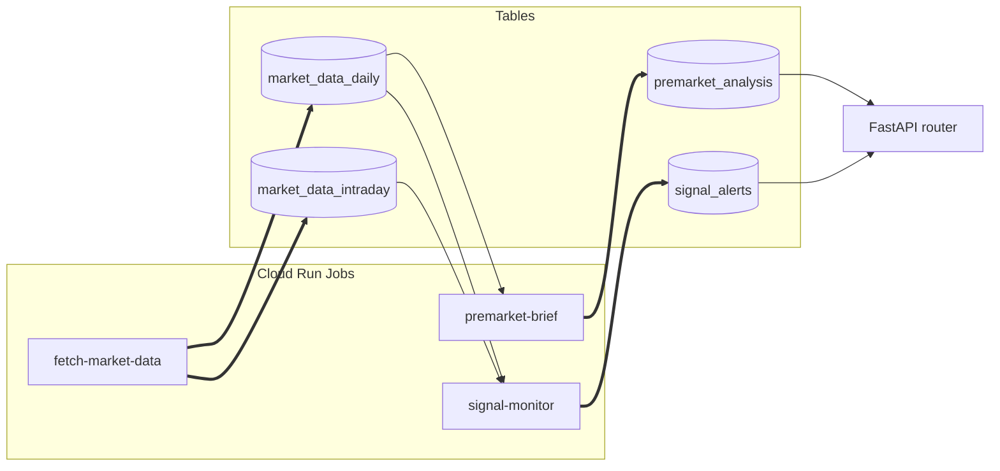

# Data Dependencies — table-level write/read graph

**Generated 2026-09-02.** Audit of every Cloud SQL table in [`gcp/schema.sql`](gcp/schema.sql) cross-referenced against every writer / reader in `gcp/`, `lib/`, `scripts/`, `platform/api/`. Cite-driven — every claim links to a `file:line`.

This doc complements [ARCHITECTURE.md](ARCHITECTURE.md) (which lists the Cloud Run Jobs by code module). Where ARCHITECTURE.md says "Job X runs Module Y," this doc answers "Module Y writes Table Z, and Tables Z is read by Modules A/B/C."

> ⚠️ **Partition handling.** `market_data_intraday` is a Postgres LIST-partitioned table. The 5 child tables (`_spy`, `_iwm`, `_qqq`, `_spx`, `_other`) are **routed transparently** — every writer/reader targets the parent and Postgres routes by `ticker`. They appear in the inventory below for completeness but the §2/§3 entries collapse them under the parent.

> 🔧 **Ad-hoc data access.** [`.github/workflows/db-query.yml`](.github/workflows/db-query.yml) runs arbitrary SQL inside a GitHub-Actions runner. It is not enumerated as a writer/reader in §2/§3 because it can target any table — treat it as a generic operator tool, not a pipeline component.

---

## 1. Table inventory

| Table | One-line purpose |
|---|---|
| `market_data_daily` | Stores daily OHLCV data and various technical indicators for each ticker. |
| `market_data_intraday` | Parent table for partitioned intraday (1-min, 5-min, etc.) OHLCV data. |
| `market_data_intraday_spy` | Partition of `market_data_intraday` for SPY ticker. |
| `market_data_intraday_iwm` | Partition of `market_data_intraday` for IWM ticker. |
| `market_data_intraday_qqq` | Partition of `market_data_intraday` for QQQ ticker. |
| `market_data_intraday_spx` | Partition of `market_data_intraday` for SPX ticker. |
| `market_data_intraday_other`| Default partition of `market_data_intraday` for other tickers. |
| `etf_options_snapshots` | Stores snapshots of ETF options chains, including Greeks. |
| `options_daily_features` | Materialized daily options flow features for performance. |
| `etf_options_daily_greeks` | Materialized daily directional greek aggregates. |
| `intraday_flow_15m` | Materialized 15-minute intraday order-flow imbalance. |
| `intraday_gex_15m` | Materialized 15-minute reconstructed intraday dealer GEX/DEX. |
| `realtime_gex_15m` | Materialized 15-minute real intraday dealer GEX/DEX from realtime feed. |
| `earnings_options_snapshots` | Stores snapshots of options chains around earnings events. |
| `daily_rates` | Stores daily risk-free rates and dividend yields from FRED for BSM calculations. |
| `archive_yahoo_market_data_daily` | Archive of daily market data from Yahoo Finance. |
| `archive_yahoo_market_data_intraday` | Archive of intraday market data from Yahoo Finance. |
| `archive_yahoo_etf_options_snapshots` | Archive of ETF options snapshots from Yahoo Finance. |
| `archive_yahoo_earnings_options_snapshots` | Archive of earnings options snapshots from Yahoo Finance. |
| `earnings_calendar` | Stores upcoming earnings calendar information from multiple sources. |
| `earnings_history` | Stores historical quarterly earnings data for each ticker. |
| `earnings_reactions` | Stores computed post-earnings reaction statistics for each ticker. |
| `sec_filings` | Stores SEC EDGAR filings like 8-K, 10-Q, and 10-K. |
| `insider_transactions` | Stores insider transaction data (Form 4 filings). |
| `top_movers_daily` | Stores daily top gainers, losers, and most active stocks. |
| `top_movers_intraday` | Stores intraday top movers from hourly snapshots. |
| `ranker_runs` | Audit trail for the ticker ranking agent. |
| `signal_alerts` | Stores real-time trading signals generated by the signal monitor. |
| `trades` | Log of executed trades, both live and backtested. |
| `journal_entries` | User-authored manual trade journal. |
| `premarket_analysis` | Stores pre-market analysis for each ticker, including levels and signals. |
| `playbook_cards` | Structured playbook decision cards for trading strategies. |
| `economic_events` | Stores upcoming and historical macroeconomic events. |
| `model_routing` | Configuration for routing agent tasks to different LLM providers and models. |
| `insight_reports` | Stores AI-generated insight reports for tickers. |
| `insight_runs` | Durable run-state table for the asynchronous insight pipeline. |
| `news_sentiment` | Stores news sentiment data for tickers from various sources. |
| `strat_levels` | Persisted horizontal price levels (support/resistance) for the Strat engine. |
| `premarket_analysis_history` | Append-only audit trail for pre-market analysis runs. |
| `insight_reports_history` | Append-only audit trail for insight report generation runs. |
| `historical_signals` | Stores historical trading signals for backtesting and analysis. |
| `ticker_info` | Cache for ticker metadata like company name, sector, and industry. |
| `watchlists` | Per-user ticker subscriptions for various features (brief, insights, signals). |
| `ticker_calibration` | Per-ticker calibrated thresholds for the signal evaluation engine. |
| `exit_config_overrides` | Per-ticker overrides for trade exit parameters (target, stop, time). |
| `signal_metrics` | Productionized analysis pipeline for signal quality measurement. |
| `backtest_trades` | Stores individual trades from backtest simulations. |
| `backtest_sweeps` | Stores results from backtest timeframe sweeps. |
| `backtest_reports` | Stores summary reports from backtest runs. |
| `backtest_walk_forward_folds` | Stores per-fold metrics from walk-forward validation. |
| `walk_forward_results`| Stores results from walk-forward parameter sweeps. |
| `earnings_calibration` | Stores tuned input parameters for the earnings playability score. |
| `indicator_correlation` | Stores correlation and information coefficient between indicators and forward returns. |
| `regime_combo_results` | Stores predictive indicator combinations for market regimes. |
| `strat_combo_results` | Stores predictive indicator combinations for Strat candle outcomes. |
| `earnings_options_strategy_insights` | Per-quintile breakdown of historical options P&L around earnings. |
| `earnings_options_strategy_winners` | Top-10 historical options trade winners for different strategies. |
| `earnings_upcoming_with_history` | Pre-computed join of upcoming earnings with historical lean data for the frontend. |
| `waitlist_signups` | Stores email signups from the public landing page. |
| `user_style_results` | Stores the mined trading style profiles for users. |
| `playbook_cards_staging` | Staging area for user-generated playbook cards. |
| `job_runs` | Observability table to track Cloud Run Job executions and performance. |
| `user_roles` | Stores user roles and permissions for authorization. |

---

## 2. Write graph

### `market_data_daily`
- [`gcp/fetchers/fetch_market_data.py`](gcp/fetchers/fetch_market_data.py) - `upsert_dataframe`
- [`gcp/fetchers/fetch_premarket_refresh.py`](gcp/fetchers/fetch_premarket_refresh.py) - `INSERT INTO`
- [`gcp/migrate_to_gcp.py`](gcp/migrate_to_gcp.py) - `upsert_dataframe`
- [`gcp/premarket_brief.py`](gcp/premarket_brief.py) - `DELETE FROM`
- [`scripts/deep_backfill_ticker.py`](scripts/deep_backfill_ticker.py) - `upsert_dataframe`

### `market_data_intraday` (and partitions)
- [`gcp/fetchers/fetch_market_data.py`](gcp/fetchers/fetch_market_data.py) - `upsert_dataframe`
- [`gcp/migrate_to_gcp.py`](gcp/migrate_to_gcp.py) - `bulk_insert_dataframe`

---

## 3. Read graph

### `market_data_daily`
- [`gcp/premarket_brief.py`](gcp/premarket_brief.py)
- [`gcp/signal_monitor.py`](gcp/signal_monitor.py)
- [`gcp/fetchers/compute_earnings_reactions.py`](gcp/fetchers/compute_earnings_reactions.py)
- [`gcp/backtest_job.py`](gcp/backtest_job.py)
- [`platform/api/main.py`](platform/api/main.py)
- ... and many others.

### `market_data_intraday`
- [`gcp/historical_signals.py`](gcp/historical_signals.py)
- [`gcp/backtest_job.py`](gcp/backtest_job.py)
- [`platform/api/main.py`](platform/api/main.py)

---

## 4. Multi-writer tables (coordination risks)

| Table | Writers | Risk |
|---|---|---|
| `market_data_daily` | `fetch_market_data`, `fetch_premarket_refresh`, `migrate_to_gcp`, `premarket_brief`, `deep_backfill_ticker` | **High.** Multiple writers can lead to race conditions and data integrity issues. |

---

## 5. Orphan tables

| Table | Writers | Readers | Status |
|---|---|---|---|
| `archive_yahoo_market_data_daily` | 1 (one-shot) | 0 | Legacy archive, manual SQL only. |
| `archive_yahoo_market_data_intraday`| 1 (one-shot) | 0 | Legacy archive, manual SQL only. |
| `archive_yahoo_etf_options_snapshots`| 1 (one-shot) | 0 | Legacy archive, manual SQL only. |
| `archive_yahoo_earnings_options_snapshots`| 1 (one-shot) | 0 | Legacy archive, manual SQL only. |
| `ranker_runs` | 1 | 0 | Write-only audit trail (intentional). |
| `strat_levels` | 1 | 0 | Write-only persistence; engine recomputes at runtime. |

---

## 6. Blast radius per Cloud Run Job

| Job | Tables written | Direct downstream consumers | Severity |
|---|---|---|---|
| **`fetch-market-data`** | `market_data_daily`, `market_data_intraday` | `premarket_brief`, `signal_monitor`, `compute_earnings_reactions`, and many others. | **Highest** |
| **`premarket-brief`** | `premarket_analysis` | `platform/api/main.py` | Medium |
| **`signal-monitor`** | `signal_alerts` | `platform/api/main.py` | Medium |

---

## 7. Mermaid graph

Generated 2026-09-02 by .github/workflows/refresh-architecture-docs.yml
