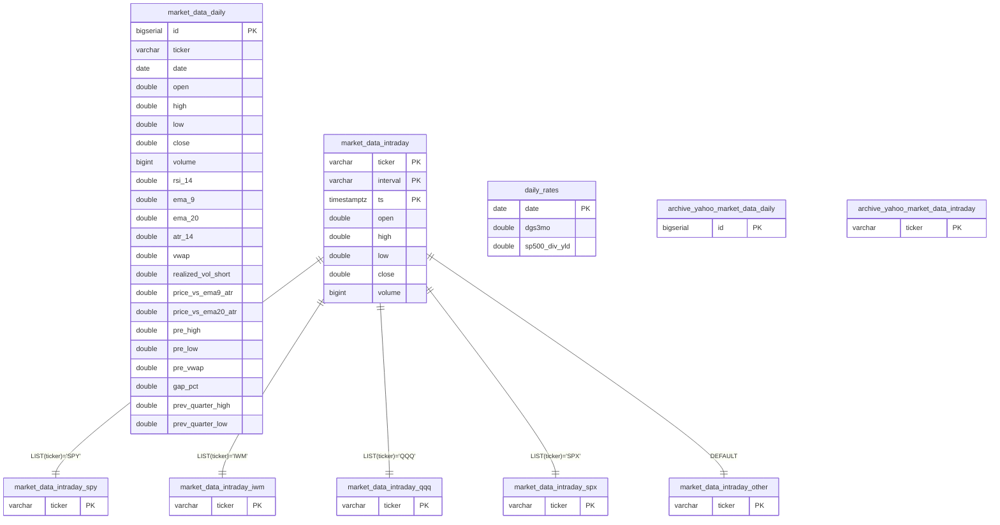
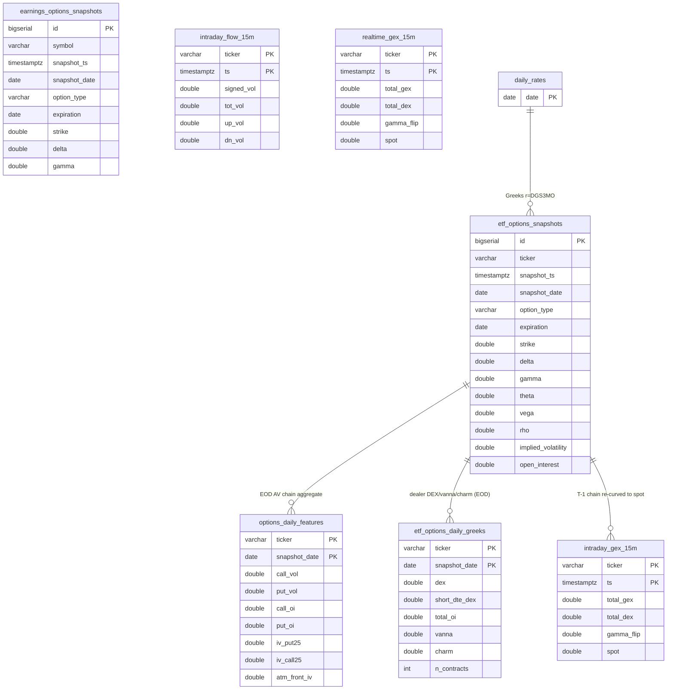
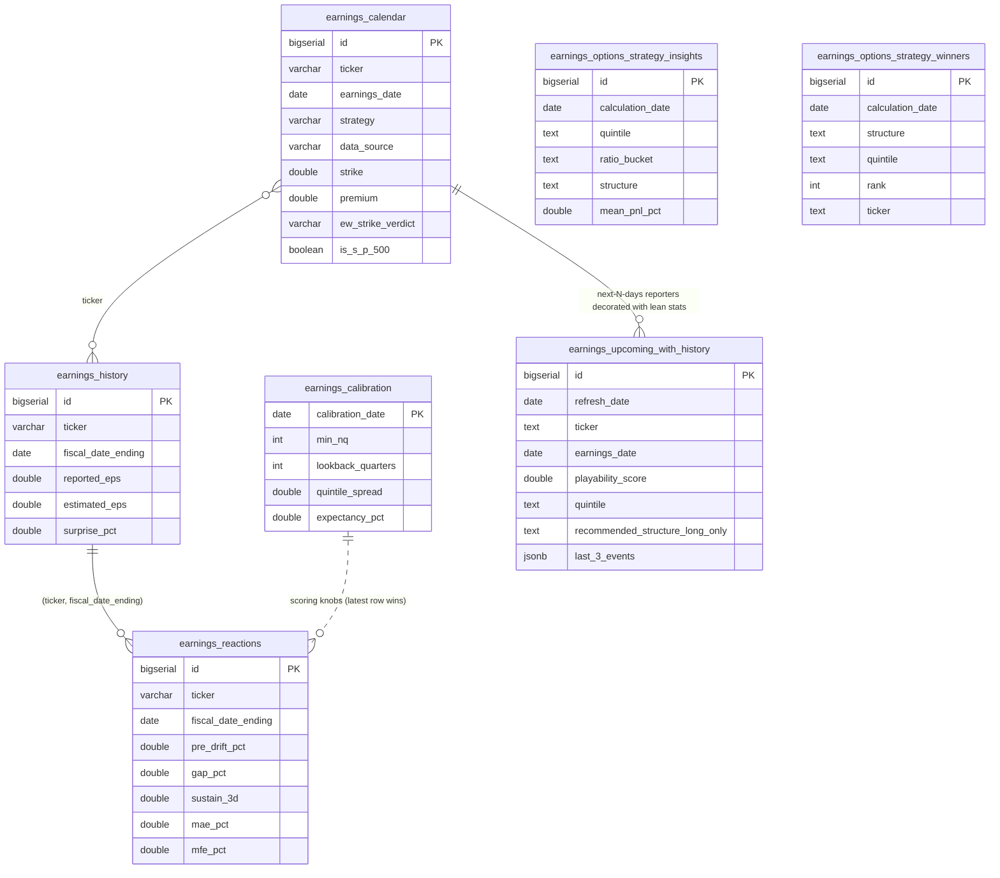
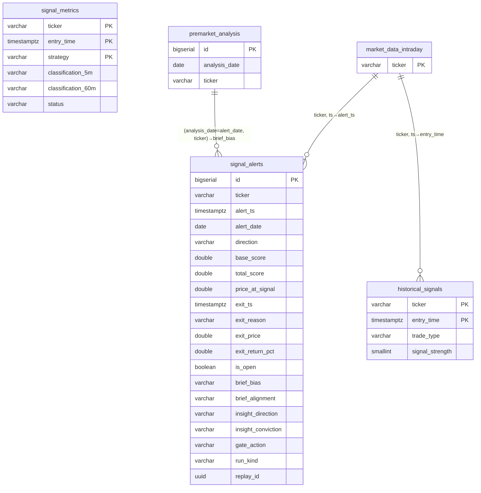
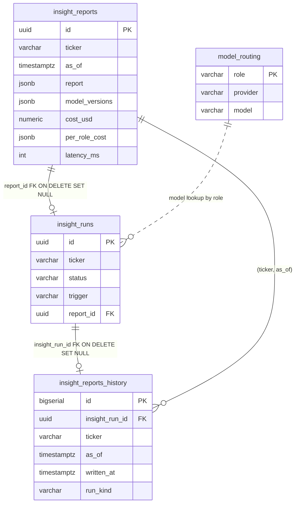
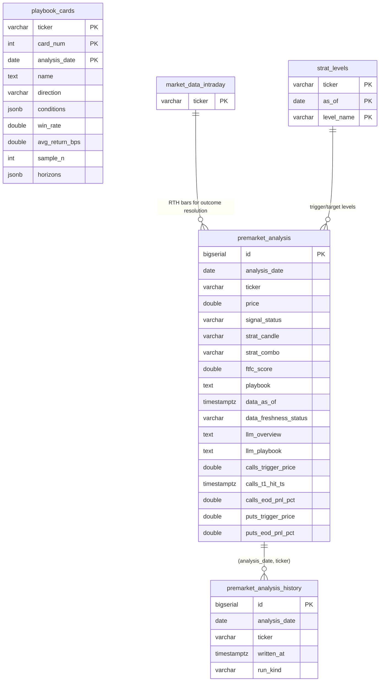
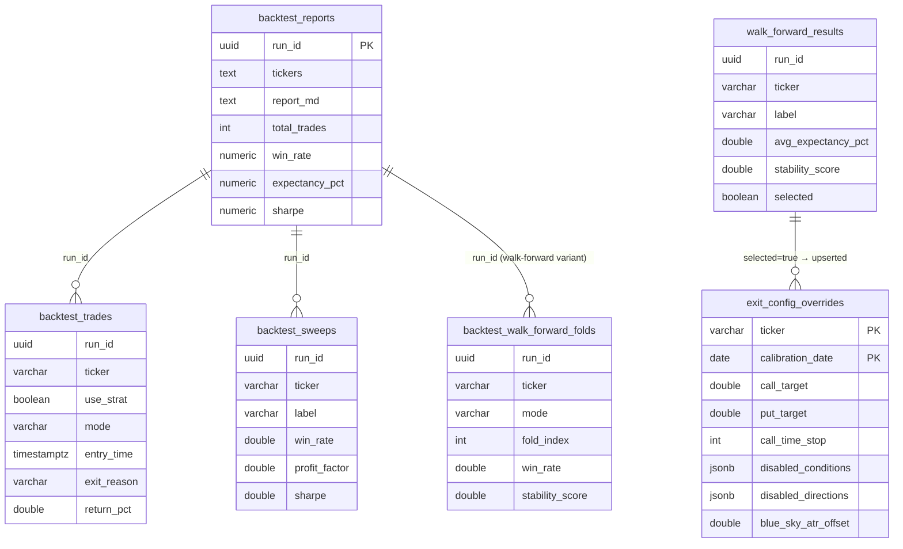
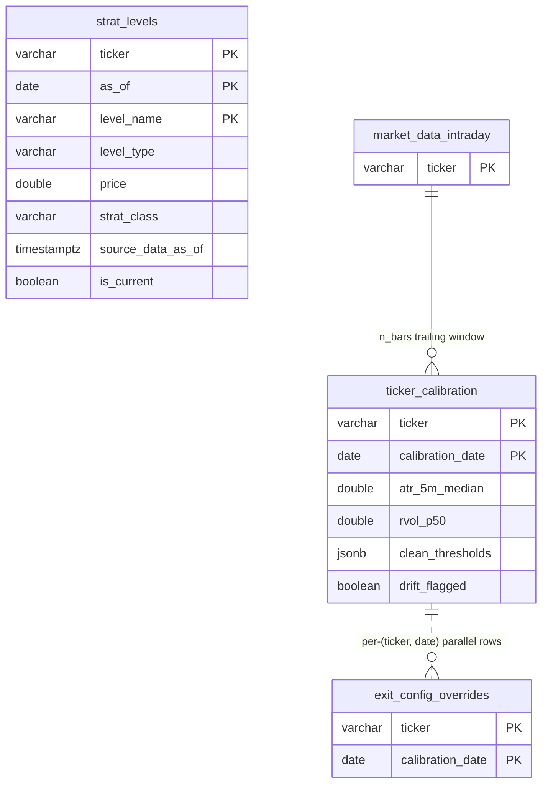
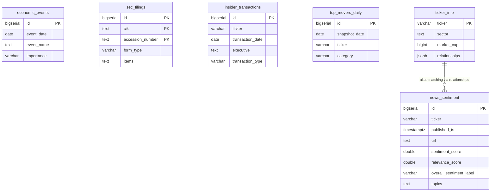
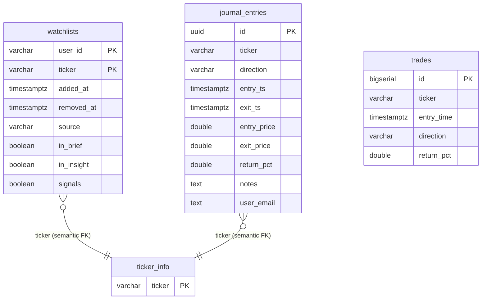

# ENTITY-RELATIONSHIP DIAGRAM (ERD)

> **Companion to** [`ARCHITECTURE.md`](ARCHITECTURE.md) (system overview), [`FRONTEND.md`](FRONTEND.md) (React app), and [`docs/GCP_ARCHITECTURE.md`](docs/GCP_ARCHITECTURE.md) §5 (schema catalog).
> **Source of truth:** [`gcp/schema.sql`](gcp/schema.sql) (~3,570 lines, **57 `CREATE TABLE` statements**). Where this doc and a verbal summary disagree, `gcp/schema.sql` wins.
> **Companion diagram:** [`ERD.drawio`](ERD.drawio) (maintained separately).
> **Last refreshed:** 2026-06-23 (covers the May 22 → June 23 wave: per-user data (`journal_entries.user_email`, `watchlists.user_id`), the options-feature / Greeks materialization layer (`options_daily_features`, `etf_options_daily_greeks`, `intraday_gex_15m`, `intraday_flow_15m`, `realtime_gex_15m`), typed playbook cards, the brief-playbook outcome resolver columns, signal_alerts exit + direction-gate columns, the earnings views/refresh table, and the runtime `strat_features_<tf>` engine tables).

## TL;DR

- **57 `CREATE TABLE` statements** in `trading-db` (Cloud SQL Postgres `us-east1`): ~55 logical user-facing tables **+ 5 LIST partitions** of `market_data_intraday` (`_spy`, `_iwm`, `_qqq`, `_spx`, `_other`). The 55 user-facing tables include 4 `archive_yahoo_*` legacy mirrors and 2 `*_history` audit shadows.
- **Plus 6 runtime tables** — `strat_features_{1m,5m,15m,30m,60m,4h}` — that are **NOT in `gcp/schema.sql`**. They are created on demand by the `strat-engine` Cloud Run Job (see `gcp/research/strat_engine/`). Documented in their own clearly-labeled section below.
- **Plus 3 SQL objects** that are not base tables: `v_etf_options_node` (a `VIEW` over `etf_options_snapshots`), and two materialized views — `earnings_event_outcomes` and `earnings_ticker_lean` — that feed the regular table `earnings_upcoming_with_history`.
- **Very few hard `FOREIGN KEY` constraints.** The schema is "facts and timeseries," not OLTP. Relationships are **semantic** — `ticker` is the dominant join key, with `date`, `as_of`, `analysis_date`, `snapshot_date`, `run_id`, `fiscal_date_ending` as secondary axes. The only enforced FKs are `insight_runs.report_id → insight_reports.id` and `insight_reports_history.insight_run_id → insight_runs.id` (both `ON DELETE SET NULL`).
- **Idempotency contract everywhere.** Most tables enforce a composite `UNIQUE(...)` that doubles as the `ON CONFLICT` target in fetchers — a re-run after a partial failure converges, doesn't duplicate (CLAUDE.md Rule 0.4).
- **Per-user data now exists.** `journal_entries.user_email` and `watchlists.user_id` scope rows to a verified signed-in identity. The brief/insight/signal jobs still read the shared `user_id='default'` watchlist; the insights pipeline itself is not yet per-user (documented residual gap).
- **Audit-log pairs.** Append-only `*_history` shadows of `premarket_analysis` and `insight_reports` exist so every run (scheduled / manual / replay) leaves a permanent fingerprint without overwriting the canonical "latest" row.
- **One LIST-partitioned table.** `market_data_intraday` is split by `ticker` into 5 partition children. All queries go through the parent — partitioning is transparent.
- **One vector extension.** `CREATE EXTENSION vector` is present (pgvector). No `vector` columns are currently declared on a base table in `schema.sql`; the extension is kept available for reflection-memory search over journal notes computed in the application layer.
- **No stored procedures.** One generic `set_updated_at()` trigger function backs four `trg_*_updated` triggers; all other logic lives in Python (`lib/`, `gcp/`, `platform/api/`).

## How to read this doc

Tables are grouped into logical clusters by purpose. Each cluster has:

1. A **Mermaid `erDiagram`** showing the tables, primary keys, and the join columns wiring them together.
2. A **table-by-table breakdown** with primary key, important uniqueness constraints, the writer job(s), and notes on the relationship semantics.

Conventions:

- `PK` = primary key (real or composite).
- `UQ` = a uniqueness constraint that doubles as the `ON CONFLICT` target for upserts.
- `★` next to a table name = added or materially extended in the 2026-05-22 → 2026-06-23 wave.
- Italic `(semantic FK)` = no `REFERENCES` clause but the column joins to another table by convention.
- All `ticker` columns are case-sensitive strings (`SPY`, `IWM`, `QQQ`, `SPX`, …).
- Column types shown are the actual `schema.sql` types (`DOUBLE PRECISION`, `VARCHAR(n)`, `JSONB`, `TIMESTAMPTZ`, …).

---

## 1. Market data cluster

The bedrock — every other cluster joins back to here via `(ticker, date)` or `(ticker, ts)`.



| Table | PK / UQ | Writer | Notes |
|---|---|---|---|
| `market_data_daily` ★ | `id` PK · `UQ (ticker, date)` | `fetch-market-data`, `backfill-daily-indicators`, `analyze-market-data` | OHLCV + ~50 indicator/feature columns. Trigger `trg_market_data_daily_updated` bumps `updated_at`. **New columns (wave):** promoted vol/momentum features `realized_vol_short`, `price_vs_ema9_atr`, `price_vs_ema20_atr`, `ema_spread_atr`, `ema9_slope`, `bb_squeeze`, `rsi_divergence`; pre-market context `pre_high`, `pre_low`, `pre_vwap`, `pre_volume`, `gap_pct`, `pre_range_atr`; prior-quarter Strat levels `prev_quarter_{high,low,open,close,hl_mid,oc_mid}` + `at_prev_quarter_{high,low}` / `broke_prev_quarter_{high,low}` (SMALLINT flags); `adjusted_close`. |
| `market_data_intraday` | PK `(ticker, interval, ts)` | `fetch-alphavantage-intraday`, `fetch-premarket-refresh`, `intraday-bulk-backfill` | LIST-partitioned by `ticker`. Use the parent table for all queries — Postgres routes to the right child. `interval ∈ {1min,5min,15min,30min,1h}`. |
| `market_data_intraday_{spy,iwm,qqq,spx,other}` | inherits | (auto via partition routing) | 5 partition children. `_other` is the `DEFAULT` partition; any ticker not in the named four lands there. |
| `daily_rates` | PK `date` | `fetch-fred-rates` | `dgs3mo` (3-month Treasury risk-free rate, BSM Greeks `r`) + `sp500_div_yld` (configurable constant — FRED has no clean S&P 500 dividend-yield series). |
| `archive_yahoo_market_data_{daily,intraday}` | `LIKE` source `INCLUDING ALL` | `scripts/archive_yahoo_data.py` (one-shot) | Legacy Yahoo Finance data from the pre-AlphaVantage cutover. Not written to in production. |

**Join axes:** `ticker` → every cluster. `(ticker, date)` → `signal_alerts(alert_date)`, `premarket_analysis(analysis_date)`, `earnings_calendar(earnings_date)`. `daily_rates.date` → options Greeks consume `r` from FRED.

---

## 2. Options, Greeks & flow cluster ★

The per-contract snapshot tables (`etf_options_snapshots`, `earnings_options_snapshots`) are huge (~14M rows) and are the source for a **materialization layer** added this wave: small daily/15-min aggregate tables so per-experiment loaders never re-scan the raw snapshots (CLAUDE.md Rule 0). `v_etf_options_node` is a non-materialized `VIEW` exposing per-(snapshot, expiration, strike) net-gamma/vega aggregates.



| Table | PK / UQ | Writer | Notes |
|---|---|---|---|
| `etf_options_snapshots` | `id` PK · `UQ (ticker, snapshot_ts, option_type, expiration, strike)` | `fetch-av-options-backfill` (EOD), `fetch-av-options-realtime` (5-min RTH, `market_session='REALTIME'`) | Per-contract calls/puts. Greeks via `lib/options_greeks.py` using `daily_rates.dgs3mo`. `market_session` distinguishes `EOD` vs `REALTIME` rows. Drives `lib/gamma.py` → GEX/VEX, King/Gate/Spot/Flip. `etf-options-retention` prunes REALTIME rows after 30 days. |
| `earnings_options_snapshots` | `id` PK · `UQ (symbol, snapshot_ts, option_type, expiration, strike)` | `fetch-av-earnings-options-backfill` | Mirrors the ETF table for earnings-window tickers; key column is `symbol`, not `ticker`. Includes bid/ask/last + full Greeks + `underlying_price`. |
| `options_daily_features` ★ | PK `(ticker, snapshot_date)` | `build-options-daily-features` (22:00 ET) | One row/ticker/day: call/put volume + OI, 25Δ put/call IV (skew), front/back ATM IV. PCR and IV-skew features for the brief. |
| `etf_options_daily_greeks` ★ | PK `(ticker, snapshot_date)` | `build-options-greeks` (`gamma-levels-daily` 22:30 ET) | Materialized DAILY dealer-direction Greeks: `dex`, `short_dte_dex` (0-2DTE charm-pin slice), `total_oi`, `vanna`, `charm`, `n_contracts`. Sign convention = dealer (opposite of net-long customer). Backed by a partial covering index `idx_etf_options_eod_agg` built OUT-OF-BAND via `CREATE INDEX CONCURRENTLY` (cannot run inside the transactional schema-apply). |
| `intraday_flow_15m` ★ | PK `(ticker, ts)` | `build-intraday-flow` | Materialized per-15m order-flow imbalance from the 1-min `market_data_intraday`: `signed_vol`, `tot_vol`, `up_vol`, `dn_vol`, `n_min`. `ts` = UTC 15m bar-open on the strat grid. Joiner derives ofi_norm / ofi_3bar / cvd. |
| `intraday_gex_15m` ★ | PK `(ticker, ts)` | `build-intraday-gex` | Materialized per-15m **reconstructed** dealer GEX/DEX: walks the prior-day (T-1) EOD chain forward to each intraday spot (delta-gamma re-curve). `total_gex`, `total_dex`, `total_oi`, `gamma_flip`, `spot`. |
| `realtime_gex_15m` ★ | PK `(ticker, ts)` | `build-realtime-gex` (`realtime-gex-daily` 17:00 ET) | Materialized per-15m **real** dealer GEX/DEX from captured `market_session='REALTIME'` greeks (live since 2026-05-23). Same shape as `intraday_gex_15m` but exact rather than re-curved; shorter history. |
| `archive_yahoo_etf_options_snapshots`, `archive_yahoo_earnings_options_snapshots` | `LIKE` source `INCLUDING ALL` | `scripts/archive_yahoo_data.py` (one-shot) | Legacy Yahoo options chains. |

**Non-table:** `v_etf_options_node` — `CREATE OR REPLACE VIEW` over `etf_options_snapshots` (filtered `data_source='alphavantage'`), exposing per-(ticker, snapshot_ts, expiration, strike) `net_gamma` / `net_vega` and per-side gamma×OI / vega×OI. The dollar GEX/VEX multipliers stay in the Python layer so callers share one source of truth.

---

## 3. Earnings cluster ★

Calendar × history × OHLCV converge in `earnings_reactions`; `earnings_calibration` drives playability scoring; two materialized views (`earnings_event_outcomes`, `earnings_ticker_lean`) and a daily-refreshed regular table (`earnings_upcoming_with_history`) power the frontend "this week" page; `earnings_options_strategy_{insights,winners}` hold the calibrated options-structure attribution.



| Table | PK / UQ | Writer | Notes |
|---|---|---|---|
| `earnings_calendar` ★ | `id` PK · `UQ (ticker, earnings_date, strategy, data_source)` | `fetch-earnings-calendar`, `evaluate-ew-strikes`, `compute-earnings-reactions` | One row per (ticker, date, strategy=EW/UW/AV, data_source). EW strike picks, premium, score, hit/miss verdict. UW liquidity enrichments (`is_s_p_500`, `stock_volume`, `options_volume`, `open_interest`, `rv_1d_last_12q`, `last_1d_reactions`), EPS beat/miss (`eps_actual`, `eps_surprise_pct`), and the EW strike verdict block (`ew_strike_verdict`, `ew_strike_move_pct`, `ew_minutes_to_hit`, `ew_minutes_in_zone`, `ew_day_change_pct`, `ew_{high,low,close}_on_day`). Trigger `trg_earnings_calendar_updated`. |
| `earnings_history` | `id` PK · `UQ (ticker, fiscal_date_ending)` | `fetch-earnings-history` (weekly) | AV `EARNINGS` — reported vs estimated EPS, surprise %, BMO/AMC. |
| `earnings_reactions` | `id` PK · `UQ (ticker, fiscal_date_ending)` | `compute-earnings-reactions` | Joins `earnings_history × market_data_daily` → pre-drift, gap, sustain horizons, MAE/MFE, archetype tag. |
| `earnings_calibration` | PK `calibration_date` | `earnings-sweep` (`scripts/calibrate_earnings.py`) | Calibrated playability knobs (`min_nq`, `lookback_quarters`) + OOS metrics + Q5 directional dollar attribution (`avg_win_pct`, `payoff_ratio`, `expectancy_pct`, …, `best_hold_horizon_days`) + options-side attribution (`avg_implied_move_pct`, `realized_vs_implied_ratio`, `avg_long_straddle_pnl_pct`, …). Latest dated row wins. |
| `earnings_upcoming_with_history` ★ | `id` PK · `UQ (refresh_date, ticker, earnings_date)` | `refresh-earnings-views` (07:30 ET daily + weekly Sun) — **regular table**, refreshed via DELETE+INSERT | Decorates the next N days of reporters with their lean stats: playability/quintile/archetype, BOTH recommendation modes (`recommended_structure_long_only`, `recommended_structure_ic_mode`), historical beat-rate / gap / reversal stats, and `last_3_events` JSONB. Single-query source for the frontend "this week" page. |
| `earnings_options_strategy_insights` ★ | `id` PK · `UQ (calculation_date, quintile, ratio_bucket, structure)` | `earnings-sweep --options-insights` | Per-(quintile × ratio_bucket × structure) options P&L breakdown across all quintiles + long/short structures. Persisted so the report outlives the 30-day Cloud Run log retention. |
| `earnings_options_strategy_winners` ★ | `id` PK | `earnings-sweep --options-insights` | Top-10 historical winners per (calculation_date × structure × quintile) — surfaces "the next NVAX." |

**Non-tables (materialized views, refreshed by `refresh-earnings-views`):**
- `earnings_event_outcomes` — per-event long/short options outcomes derived from `earnings_reactions × earnings_options_snapshots`; unique index `idx_eeo_ticker_date`.
- `earnings_ticker_lean` — per-ticker rollup (`lean_score`, winner counts) over `earnings_event_outcomes`; unique index `idx_etl_ticker`. Feeds `earnings_upcoming_with_history`.

---

## 4. Signals cluster ★

`signal_alerts` is the live wire; `historical_signals` is the 90-day backfill; `signal_metrics` is the quality classification. This wave added the **exit-resolution** and **direction-gate** column families to `signal_alerts`.



| Table | PK / UQ | Writer | Notes |
|---|---|---|---|
| `signal_alerts` ★ | `id` PK | `signal-monitor` (insert), `signal-monitor-eod-resolver` (exit cols, 16:30 ET), `signal-replay` (replay rows) | Live alerts. Raw `base_score` / `strat_bonus` / `total_score` kept separate. ORB levels, `conditions_met` + `strategy_agreement` JSONB, `level_broken`. **New exit columns:** `exit_ts`, `exit_reason` (`target`/`time_stop`/`rsi_extreme`/`eod_close`), `exit_price`, `exit_return_pct`, `is_open` (DEFAULT FALSE; partial index on open rows). **Brief↔live coordination:** `brief_bias`, `brief_alignment`, `brief_setup_count`. **Direction gate (shadow mode):** `insight_direction`, `insight_conviction`, `insight_regime`, `gate_action` (`pass`/`suppress`/`downgrade`/`tag`/`annotate`), `gate_reason`, `thesis_invalidated`. **Replay tagging:** `run_kind` (DEFAULT `'live'`), `replay_id` UUID. |
| `historical_signals` | PK `(ticker, entry_time)` · `ON CONFLICT DO NOTHING` | `historical-signals-watchlist` (1 AM), `trading_analysis.py`, `signal_monitor` | 90-day rolling backfill of the 5-condition voter. `signal_strength` SMALLINT (3..5 conditions met). Per-horizon forward returns + `extra` JSONB (ORB / order-block levels). |
| `signal_metrics` | PK `(ticker, entry_time, strategy)` | `signal-quality-report` | Classification per horizon (5m/15m/30m/60m/90m/120m/240m): CLEAN_HIT / WRONG_DIRECTION / NOISE / MIXED. `status ∈ {pending, final}`. |

---

## 5. Insights (AI pipeline) cluster

The only cluster with **real `FOREIGN KEY`** constraints.



| Table | PK / UQ | Writer | Notes |
|---|---|---|---|
| `insight_reports` | `id` (UUID) PK · `UQ (ticker, as_of)` | `insight-pipeline` (8:45 ET batch + Cloud Tasks on-demand) | Canonical "latest report per (ticker, as_of)". JSONB InsightReport, `per_role_cost` JSONB breakdown, total `cost_usd`, `latency_ms`, `model_versions`. GIN index on `report` for JSONB direction/conviction filters. |
| `insight_runs` | `id` (UUID) PK | `insight-pipeline` | Durable async state. `status ∈ {queued, running, done, failed}`. `trigger ∈ {on_demand, scheduled, local_dev, manual_batch, cache_hit, replay_refresh}` (the final CHECK includes all six). `report_id` FK ON DELETE SET NULL. |
| `insight_reports_history` | `id` PK · `UQ (ticker, as_of, written_at)` | `insight-pipeline` (all modes) | Append-only audit shadow. `insight_run_id` FK ON DELETE SET NULL → `insight_runs.id`. `run_kind`, `triggered_by`, `per_role_cost`. |
| `model_routing` | PK `role` | manual seed (schema migration) | Per-role LLM routing for `analyst/bull/bear/judge/trader/risk/portfolio_manager`. Seeded to Vertex `gemini-3.1-flash-lite` (2026-05-11). Trigger `trg_model_routing_updated`. |

---

## 6. Premarket analysis & playbook cluster ★

`premarket_analysis` gained two large column families this wave: data-freshness + LLM-commentary persistence, and the **structured brief-playbook outcome** tracker (`calls_*` / `puts_*` trigger/stop/target inputs and resolved hit-ts/MAE/MFE/PnL outcomes). The new typed `playbook_cards` table replaces the fragile regex-parse of the phase6 playbook markdown.



| Table | PK / UQ | Writer | Notes |
|---|---|---|---|
| `premarket_analysis` ★ | `id` PK · `UQ (analysis_date, ticker)` | `premarket-brief` (8:30 ET + Sunday), `premarket-playbook-resolver` (outcome cols, 16:30 ET) | Morning analysis: Strat candle/combo, FTFC, levels, ORB recommendation, LLM `playbook` prose. **Freshness + commentary:** `data_as_of` (last OHLCV bar used), `data_freshness_status` (`fresh` / `STALE_DAILY_DATA` / NULL), `llm_overview`, `llm_orb_explanation`, `llm_analysis`, `llm_playbook`. **Outcome tracker:** STRUCTURED inputs `calls_trigger_price/_name`, `calls_stop_price/_name`, `calls_t1/t2/t3_price` (+ mirrored `puts_*`); RESOLVED outcomes `calls_trigger_hit_ts`, `calls_t{1,2,3}_hit_ts`, `calls_stop_hit_ts`, `calls_reversal_after_trigger`, `calls_time_to_t1_min`, `calls_mae_pct`, `calls_mfe_pct`, `calls_eod_pnl_pct`, `calls_eod_pnl_dollar` (+ mirrored `puts_*`); `outcome_resolved_at`, `outcome_resolver_version`. |
| `premarket_analysis_history` | `id` PK · `UQ (analysis_date, ticker, written_at)` | `premarket-brief` (all modes) | Append-only audit shadow mirroring the canonical columns + `written_at`, `run_kind`, `triggered_by`, `notes`. |
| `playbook_cards` ★ | PK `(ticker, card_num, analysis_date)` | `scripts/analysis/phase6_playbook.py` (`--write-db`) | Typed source of truth for `/api/playbook`, replacing the markdown regex-parse. `direction ∈ {CALL,PUT,NEUTRAL}`, `conditions` JSONB, `win_rate` (fraction 0..1; **NULL — never 0 — when unresolved**, Rule 3.7), `avg_return_bps`, `sample_n`, target/stop, `horizons` JSONB (per-hold-window win-rate/return) + `best_horizon_*`. `analysis_date` keys historical "view as of." |

---

## 7. Backtest & calibration cluster

A backtest run's output spreads across `backtest_trades/_sweeps/_reports`, plus walk-forward folds and parameter-sweep results. The selected walk-forward winner is auto-applied to `exit_config_overrides` so the next live `signal-monitor` picks it up.



| Table | PK / UQ | Writer | Notes |
|---|---|---|---|
| `backtest_reports` | PK `run_id` (UUID) | `backtest`, `backtest-pipeline` | One row per pipeline invocation. `tickers TEXT[]`, `report_md`, aggregate metrics, `created_at`. |
| `backtest_trades` | `UQ (run_id, ticker, mode, …)` | `backtest`, `backtest-pipeline` | One row per simulated trade. `use_strat` BOOLEAN, `mode`, `exit_reason`, `return_pct`, MAE/MFE. |
| `backtest_sweeps` | `UQ (run_id, ticker, label)` | `backtest-pipeline` | Per-(timeframe × combo) result vector. `label` e.g. `'1m'`, `'1m+15m'`. |
| `backtest_walk_forward_folds` ★ | `UQ (run_id, ticker, mode, fold_index)` | `param-sweep` | Per-fold OOS metrics (train/test windows, win_rate, profit_factor, expectancy, sharpe, max_dd); `stability_score` denormalised across folds. |
| `walk_forward_results` | `UQ (run_id, ticker, label)` | `param-sweep` (`scripts/run_param_sweep.py`) | Per-parameter-combo walk-forward sweep with OOS aggregates (`avg_expectancy_pct`, `std_expectancy_pct`, `stability_score` = fraction of profitable folds). `selected=true` rows promoted to `exit_config_overrides`. |
| `exit_config_overrides` | PK `(ticker, calibration_date)` | `param-sweep` (auto-apply), manual seed | Per-ticker exit thresholds (`call_target`/`put_target`/`call_stop`/`put_stop`/`call_time_stop`/`put_time_stop`), `consecutive_periods`, `disabled_conditions` JSONB, `disabled_directions` JSONB (per-ticker direction kill switch), `blue_sky_atr_offset`. Read by `signal_monitor` / `signal_monitor_eod_resolver` / `lib/signals.py`. |
| `earnings_calibration` | — | — | (See earnings cluster §3.) |

---

## 8. Strategy configuration cluster

Small but load-bearing tables that drive the live monitor and the brief.



| Table | PK / UQ | Writer | Notes |
|---|---|---|---|
| `strat_levels` | PK `(ticker, as_of, level_name)` | `premarket-brief` (`lib.strat_levels.persist_level_map()`) | Horizontal price markers. `strat_class` (widened to VARCHAR(16)) e.g. `Failed_2U`. `source_data_as_of` is a freshness tag separate from `as_of`. `is_current` toggles when a new brief supersedes. |
| `ticker_calibration` | PK `(ticker, calibration_date)` | `calibrate-thresholds` (quarterly) | Per-ticker percentile thresholds: ATR medians per timeframe, RVOL/RSI percentiles, `clean_/wrong_/noise_thresholds` JSONB, `drift_flagged`. |
| `exit_config_overrides` | PK `(ticker, calibration_date)` | `param-sweep` | (See §7.) Parallel to `ticker_calibration` by `(ticker, calibration_date)` shape but driven by a different job. |

---

## 9. Research & analytics cluster ★

Indicator-correlation and combo-mining outputs from the research engines. All statistics are NULLABLE — a NULL means "could not be computed," never 0 (Rule 3.7).

| Table | PK / UQ | Writer | Notes |
|---|---|---|---|
| `indicator_correlation` ★ | `id` PK · `UQ (computed_date, window_*, ticker, indicator, horizon)` (see schema) | `indicator-correlation-job` | One row per (ticker, indicator, horizon) for a trailing window. `rank_ic` (Spearman / Information Coefficient) + `pearson`. The `POOLED` ticker stacks all tickers for cross-sectional ranking. |
| `regime_combo_results` ★ | `id` PK · `UQ (computed_date, window_start, window_end, ticker, horizon_min, target_class, conditions)` | regime combo miner | Indicator-combination → forward-move-class (`BIG`/`UP`/`DOWN`/`FLAT`) OOS hit-rate / base-rate / `lift` / `support`. |
| `strat_combo_results` ★ | `id` PK · `UQ (computed_date, window_start, window_end, ticker, tf, target_class, conditions)` | strat combo miner | Indicator-combination → NEXT Strat candle (`1`/`2U`/`2D`/`3`) per ticker × timeframe, OOS `hit_rate` / `base_rate` / `lift` / `support`. |
| `ranker_runs` | PK `id` (UUID) | `premarket-brief` (decision log) | One row per `lib.agents.ranker.rank_tickers()` call: `candidate_count`, `excluded_count`, `weights_used` JSONB, `results` JSONB (ranked list with per-factor breakdowns), `duration_ms`. |

---

## 10. News & sentiment cluster

External catalyst signal — independent of OHLCV, consumed by `lib.strategies.catalyst_proximity` and the AI insight agents.



| Table | PK / UQ | Writer | Notes |
|---|---|---|---|
| `news_sentiment` | `id` PK · `UQ (ticker, published_ts, url)` | `fetch-news-sentiment`, `-earnings`, `-topics` | AV `NEWS_SENTIMENT` + RSS + FinViz. Per-ticker `sentiment_score` + `relevance_score`, article-level `overall_sentiment_score/_label`, `topics TEXT[]` (GIN-indexed). |
| `economic_events` | `id` PK · `UQ (event_date, event_name)` | `fetch-economic-events` | ForexFactory + FRED. `importance ∈ {high, medium, low}`. |
| `sec_filings` | `id` PK · `UQ (cik, accession_number)` | `fetch-sec-filings` (4×/day) | 8-K / 10-Q / 10-K. `items TEXT[]` (GIN-indexed). `ticker` nullable. |
| `insider_transactions` | `id` PK · `UQ (ticker, transaction_date, executive, transaction_type, shares, share_price)` | `fetch-insider-transactions` | Form 4. Ranker clusters 3+ same-direction transactions within 30 days. |
| `top_movers_daily` | `id` PK · `UQ (snapshot_date, ticker, category)` | `fetch-top-movers` | `category ∈ {gainer, loser, most_active}`. |
| `ticker_info` | PK `ticker` | `lib.ticker_info` | Company metadata cache. `raw_json` (full AV `OVERVIEW`), `relationships` JSONB (peers, used by news alias-matching). Trigger `trg_ticker_info_updated`. |

---

## 11. User & admin cluster ★

Per-user CRUD. This wave made the journal and watchlist **per-user**.



| Table | PK / UQ | Writer | Notes |
|---|---|---|---|
| `watchlists` ★ | PK `(user_id, ticker)` | user dashboard, Discord `/watchlist`, seed | `user_id VARCHAR(320)` DEFAULT `'default'` (shared admin-curated list that drives the brief/insight/signal jobs; a signed-in user's rows are owned by their verified email). Soft-delete via `removed_at IS NULL`; `source ∈ {ui,cli,admin,seed}`. Per-surface flags `in_brief` / `in_insight` / `signals` (all DEFAULT FALSE; IWM/QQQ/SPY seeded `signals=TRUE`). Partial indexes `idx_watchlists_active` and `idx_watchlists_ticker` on active rows. |
| `journal_entries` ★ | PK `id` (UUID) | user API (per-user) | Manual user trade log (separate from automated `trades`). **`user_email TEXT`** scopes each row to its owner; index `idx_journal_entries_user_ticker_ts (user_email, ticker, entry_ts DESC)` plus the legacy `(ticker, entry_ts DESC)`. `direction` CHECK (`CALL`/`PUT`). Trigger `set_journal_updated_at`. |
| `trades` | PK `id` | `signal-monitor` | Automated pipeline trades — mirrors `signal_alerts` output once positions close. Separate from user `journal_entries`. |

---

## Runtime feature tables — `strat_features_<tf>` (NOT in `gcp/schema.sql`)

> These six tables are **created at runtime** by the `strat-engine` Cloud Run Job, not by the canonical `gcp/schema.sql` / `apply-schema-migrations` path. The DDL lives in `gcp/research/strat_engine/` (`strat_data_builder.py` issues the `CREATE TABLE IF NOT EXISTS` for `strat_features_4h`; the others are defined alongside in the strat-engine schema). They are documented here for completeness but do **not** count toward the 57 `CREATE TABLE` total in `schema.sql`.

The `strat-engine` job (`gcp/research/strat_engine/`, daily 23:35 ET incremental featurize, 8 GiB / 4 CPU / 5400 s) builds one bar-level feature table **per timeframe**:

| Runtime table | Timeframe | Grain |
|---|---|---|
| `strat_features_1m` | 1-minute | per (ticker, ts) |
| `strat_features_5m` | 5-minute | per (ticker, ts) |
| `strat_features_15m` | 15-minute | per (ticker, ts) |
| `strat_features_30m` | 30-minute | per (ticker, ts) |
| `strat_features_60m` | 60-minute | per (ticker, ts) |
| `strat_features_4h` | 4-hour | per (ticker, ts) |

The driving timeframe list is `TF_LIST = [1m, 5m, 15m, 30m, 60m, 4h]` in `gcp/research/strat_engine/strat_data_builder.py`.

**Shape (all six share a schema; 4h shown verbatim in `strat_data_builder.py`):**
PK `(ticker, ts)`; OHLCV; Strat classification (`strat_candle`, `prev_strat_candle`, `strat_combo`, `is_continuation`, `is_reversal`, `is_inside`, `strat_setup`, `consecutive_1s`, `trigger_high`, `trigger_low`); the full indicator set (EMAs 9/20/50/200, SMA 50/200, RSI 9/14, StochRSI, MACD, ATR 14/20, Bollinger, OBV, RVOL, VWAP, and the ATR-normalised/derived features `*_atr`, `ema9_slope`, `bb_squeeze`, `rsi_divergence`, `realized_vol_z`, …); forward-return labels (`fwd_close_{5,15,30,60}bars`, `fwd_ret_{5,15,30,60}bars_bps`); and the cross-asset / dealer-flow context columns (`vix_close`/`vix_tercile`, `total_gex`/`gex_tercile`, `total_vex`/`vex_tercile`, `dealer_regime`, `gamma_regime`, `gamma_balance_price`, `gamma_flip`, `dist_to_gamma_flip_pct`, `distance_to_king_pct`, `distance_to_gate_pct`).

A companion `strat_features_levels_{tf}` table (also runtime-built by the strat-engine) carries the per-bar level enrichment populated by `strat-enrich-daily` (02:00 ET Tue–Sat). These engines replace the deprecated P7b classifier (disabled 2026-05-25).

---

## Master cross-cluster join map

Wire columns thread the schema together:

| Wire | Tables it joins |
|---|---|
| `ticker` | nearly every table except `daily_rates`, `economic_events`, `model_routing`, `earnings_calibration`, `ranker_runs`, `backtest_reports` |
| `(ticker, date)` | `market_data_daily` ↔ `premarket_analysis(analysis_date)` ↔ `signal_alerts(alert_date)` ↔ `earnings_calendar(earnings_date)` |
| `(ticker, ts)` | `market_data_intraday` ↔ `signal_alerts(alert_ts)` ↔ `historical_signals(entry_time)` ↔ `intraday_{flow,gex}_15m` ↔ `realtime_gex_15m` ↔ `strat_features_<tf>` |
| `(ticker, snapshot_date)` | `etf_options_snapshots` ↔ `options_daily_features` ↔ `etf_options_daily_greeks` |
| `(ticker, fiscal_date_ending)` | `earnings_history` ↔ `earnings_reactions` |
| `(ticker, calibration_date)` | `ticker_calibration` ↔ `exit_config_overrides` |
| `run_id` (UUID) | `backtest_reports` ↔ `backtest_trades` ↔ `backtest_sweeps` ↔ `backtest_walk_forward_folds` ↔ `walk_forward_results` |
| `user_email` / `user_id` | `journal_entries.user_email`, `watchlists.user_id` (per-user ownership) |

The two real `FOREIGN KEY` chains in the insights cluster:

```
insight_reports.id ← insight_runs.report_id (FK, ON DELETE SET NULL)
insight_runs.id    ← insight_reports_history.insight_run_id (FK, ON DELETE SET NULL)
```

Every other join is a query-time semantic match — schema-enforced FKs would make idempotent re-runs harder, and these tables already enforce uniqueness via composite `UNIQUE` constraints used as `ON CONFLICT` targets.

---

## Triggers, extensions, views, conventions

**Triggers** (all `BEFORE UPDATE … FOR EACH ROW EXECUTE FUNCTION set_updated_at()`):

| Trigger | Table |
|---|---|
| `trg_earnings_calendar_updated` | `earnings_calendar` |
| `trg_market_data_daily_updated` | `market_data_daily` |
| `trg_ticker_info_updated` | `ticker_info` |
| `trg_model_routing_updated` | `model_routing` |
| `set_journal_updated_at` | `journal_entries` |

**Extensions:** `CREATE EXTENSION IF NOT EXISTS vector;` (pgvector). The extension is installed; no base table currently declares a `vector` column in `schema.sql`.

**Views / materialized views (not base tables):**
- `v_etf_options_node` — `VIEW` over `etf_options_snapshots` (per-strike net gamma/vega aggregates).
- `earnings_event_outcomes`, `earnings_ticker_lean` — `MATERIALIZED VIEW`s feeding `earnings_upcoming_with_history`, refreshed by `refresh-earnings-views`.

**Idempotency contract.** Every fetcher table has a composite `UNIQUE(...)` matched by `ON CONFLICT (...) DO UPDATE`/`DO NOTHING`. Re-running a fetcher after a partial failure converges; it doesn't duplicate (CLAUDE.md Rule 0.4).

**Audit trail pattern.** Tables that ship to Discord or drive trading decisions have a `*_history` shadow that an append-only writer hits on every run, with `UNIQUE(parent_pk..., written_at)`. Currently: `premarket_analysis_history`, `insight_reports_history`.

**Data-freshness tagging.** `data_as_of` / `source_data_as_of` / `data_freshness_status` columns let an audit detect a downstream artifact built on stale upstream data — the schema-level enforcement of CLAUDE.md Rule 3.7 ("no silent fallbacks"). The new options/Greeks materialization tables carry `computed_at`, and the financial-statistic tables (`playbook_cards`, `indicator_correlation`, `earnings_calibration`, …) store NULL — never 0 — for unresolved values.

## What's NOT in this schema (and where it lives)

- **`strat_features_<tf>` runtime tables** — built by `strat-engine`, DDL in `gcp/research/strat_engine/` (see the runtime section above), not in `schema.sql`.
- **GCS objects** (`raw/` parquet snapshots, `sql-dumps/` weekly pg_dump, `query-results/`) — see ARCHITECTURE.md §"Backup and disaster recovery."
- **GitHub Actions artifacts** — retained by GitHub.
- **Discord channel history** — Discord retains; not in our DB.
- **IAP / Firebase identity** — Google IdP; `/api/me` resolves email/admin flag per-request. There is no `users` table; ownership is carried inline via `journal_entries.user_email` and `watchlists.user_id`.

## Open questions / drift

1. **No FK on the brief↔alert link** — `signal_alerts` references the brief via `(alert_date, ticker)`/`brief_bias` semantically. An FK would couple the `signal-monitor` write path to brief existence, which we don't want (alerts must fire even if the brief failed). Intentional.
2. **Insights pipeline is not yet per-user** — endpoint wiring (`_watchlist_owner`, `_journal_owner`) is per-user, but the insight pipeline still reads/writes the shared `insight_reports` rows and the `user_id='default'` watchlist. Documented residual gap.
3. **`exit_config_overrides.calibration_date` is independent of `ticker_calibration.calibration_date`** — both quarterly but driven by different jobs (`param-sweep` vs `calibrate-thresholds`). In practice their dates align; nothing enforces it.
4. **`archive_yahoo_*` tables** — never written to in production; retained for forensic queries against the pre-AlphaVantage era. Candidate for cold-storage export.
