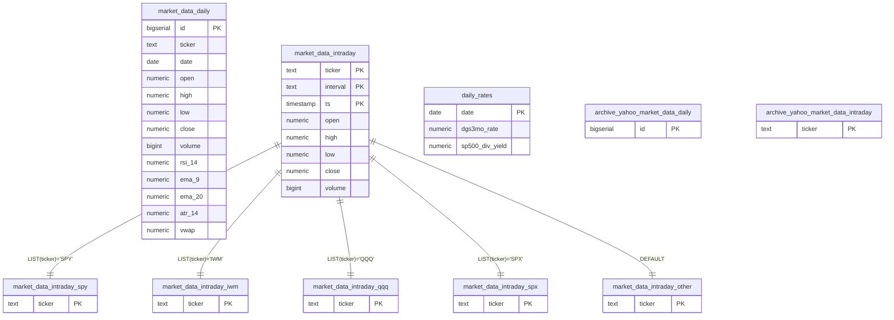
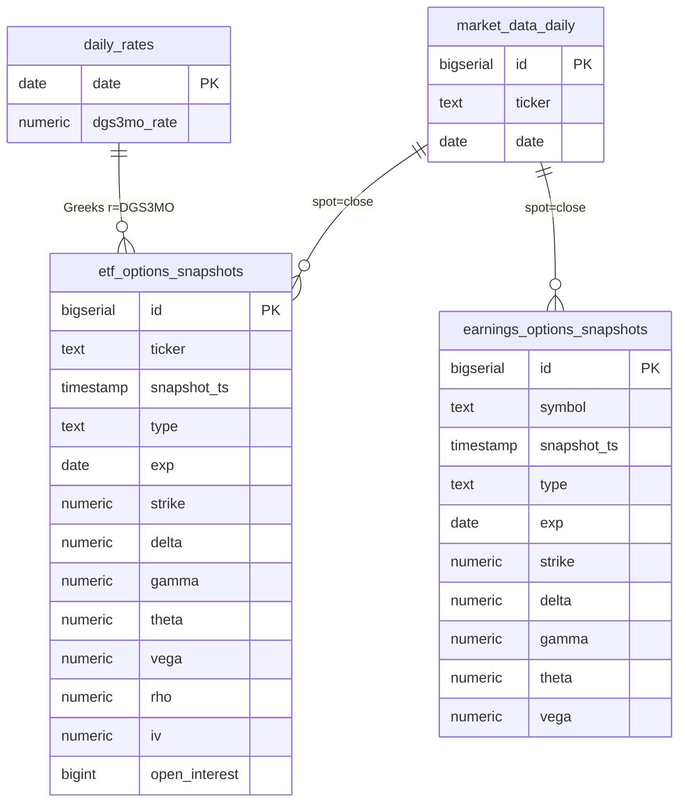
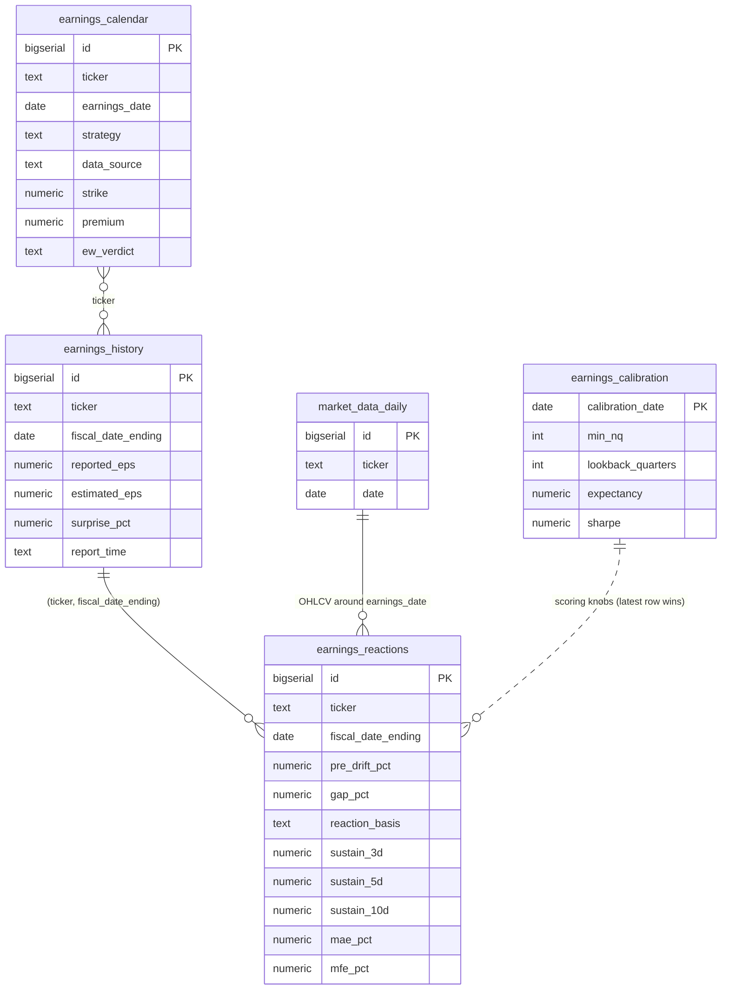
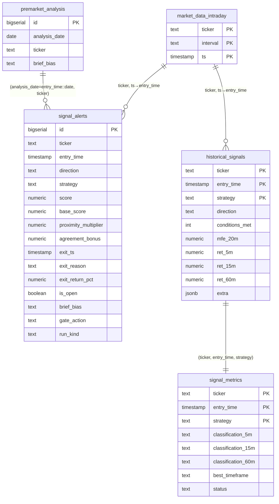
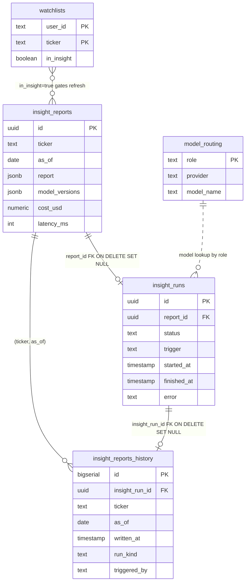
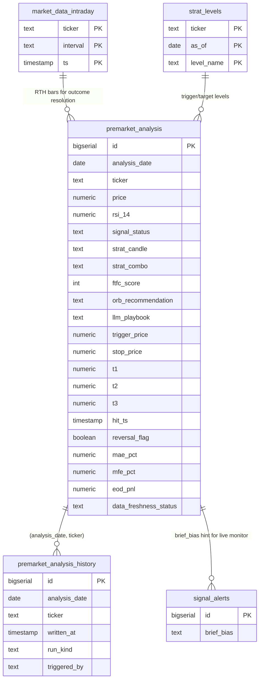
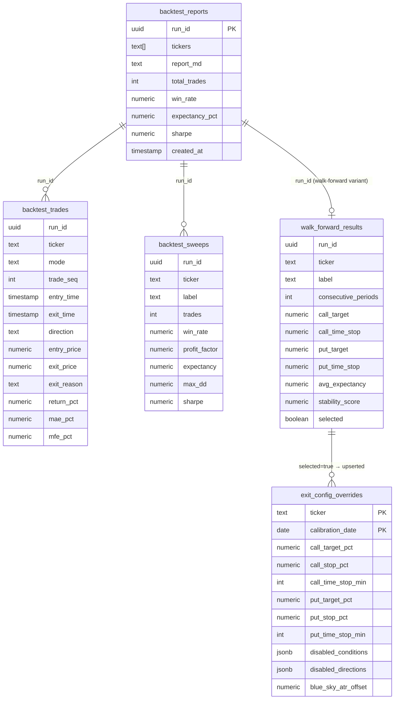
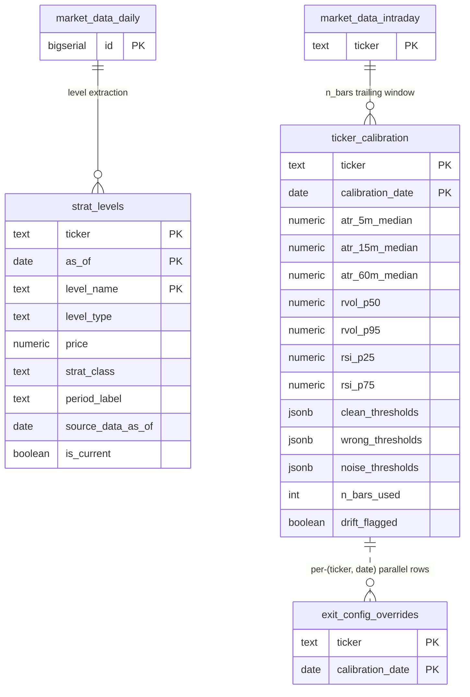
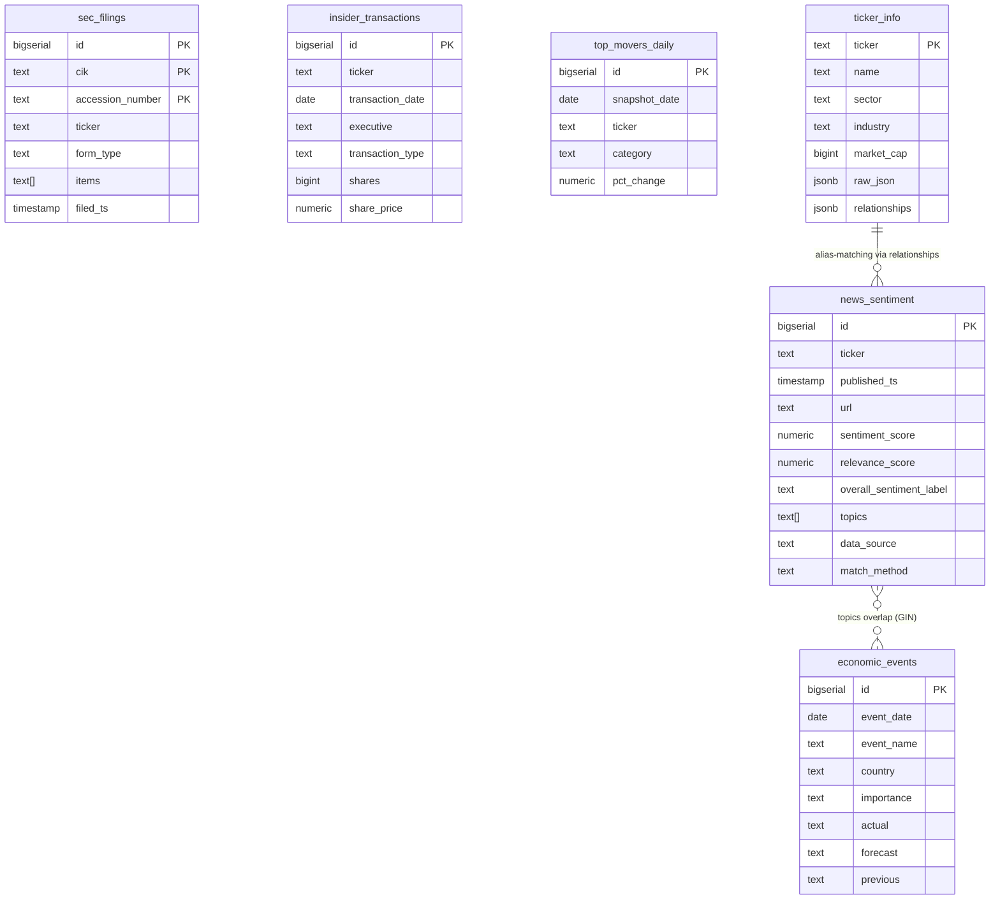
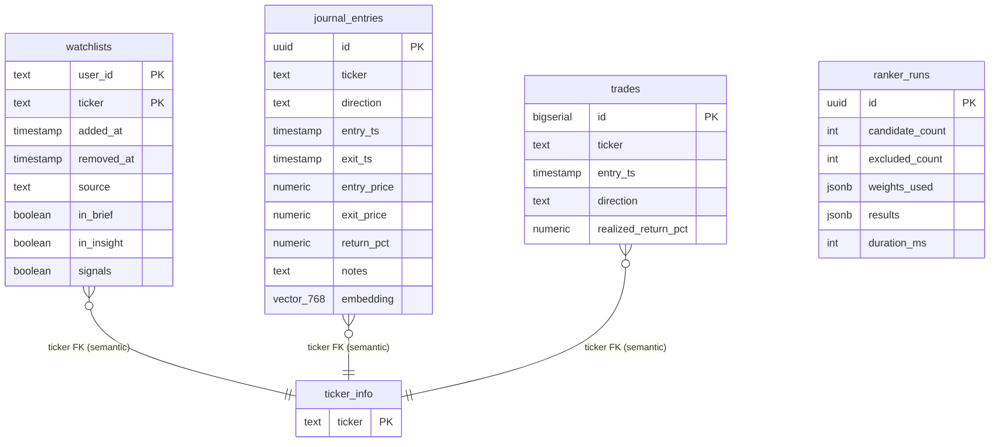

# ENTITY-RELATIONSHIP DIAGRAM (ERD)

> **Companion to** [`ARCHITECTURE.md`](ARCHITECTURE.md) (system overview), [`FRONTEND.md`](FRONTEND.md) (React app), and [`docs/GCP_ARCHITECTURE.md`](docs/GCP_ARCHITECTURE.md) §5 (schema catalog).
> **Source of truth:** [`gcp/schema.sql`](gcp/schema.sql) (2,575 lines, 44 `CREATE TABLE` statements).
> **Companion diagram:** [`ERD.drawio`](ERD.drawio).
> **Last refreshed:** 2026-05-22 (covers the May 8–22 wave: backtest pipeline migration, `exit_config_overrides`, `earnings_calibration`, `premarket_analysis_history`, `insight_reports_history`).

## TL;DR

- **44 tables** in `trading-db` (Cloud SQL Postgres `us-east1`): 38 logical user-facing tables + 5 LIST partitions of `market_data_intraday` + 4 `archive_yahoo_*` legacy tables + 2 `*_history` audit shadows.
- **Very few hard `FOREIGN KEY` constraints.** The schema is "facts and timeseries," not OLTP. Relationships are **semantic** — `ticker` is the dominant join key, with `date`, `as_of`, `analysis_date`, `run_id`, `fiscal_date_ending` as secondary axes. The only enforced FKs are `insight_runs.report_id → insight_reports.id` and `insight_reports_history.insight_run_id → insight_runs.id` (both `ON DELETE SET NULL`).
- **Idempotency contract everywhere.** Most tables enforce a composite `UNIQUE(...)` that gets used as `ON CONFLICT` target in fetchers — a re-run after a partial failure converges, doesn't duplicate.
- **Audit-log pairs.** Append-only `*_history` shadows of `premarket_analysis` and `insight_reports` exist so every run (scheduled / manual / replay) leaves a permanent fingerprint without overwriting the canonical "latest" row.
- **One LIST-partitioned table.** `market_data_intraday` is split by `ticker` into 5 partition children: `_spy`, `_iwm`, `_qqq`, `_spx`, `_other`. All queries go through the parent — partitioning is transparent.
- **One vector column.** `journal_entries.embedding vector(768)` (pgvector, Vertex `text-embedding-005`) for reflection memory.
- **No views, no stored procedures.** Six trigger-backed `set_updated_at()` functions; all other logic lives in Python (`lib/`, `gcp/`, `platform/api/`).

## How to read this doc

Tables are grouped into **9 logical clusters** by purpose. Each cluster has:

1. A **Mermaid `erDiagram`** showing the tables, primary keys, and the join columns wiring them together.
2. A **table-by-table breakdown** with primary key, important uniqueness constraints, the writer job(s), and notes on the relationship semantics.

A consolidated "master diagram" appears at the end for printing.

Conventions:

- `PK` = primary key (real or composite).
- `UQ` = a uniqueness constraint that doubles as the `ON CONFLICT` target for upserts.
- `★` next to a table name = added in the 2026-05-08 → 2026-05-22 wave.
- Italic `(semantic FK)` = no `REFERENCES` clause but the column joins to another table by convention.
- All `ticker` columns are case-sensitive strings (`SPY`, `IWM`, `QQQ`, `SPX`, …).

---

## 1. Market data cluster

The bedrock — every other cluster joins back to here via `(ticker, date)` or `(ticker, ts)`.



| Table | PK / UQ | Writer | Notes |
|---|---|---|---|
| `market_data_daily` | `id` PK · `UQ (ticker, date)` | `fetch-market-data`, `backfill-daily-indicators` | OHLCV + ~30 indicator columns (RSI, EMA, ATR, MACD, BB, VWAP). Trigger `trg_market_data_daily_updated` bumps `updated_at`. |
| `market_data_intraday` | PK `(ticker, interval, ts)` | `fetch-alphavantage-intraday`, `fetch-premarket-refresh`, `intraday-bulk-backfill` | LIST-partitioned by `ticker`. Use the parent table for all queries — Postgres routes to the right child. |
| `market_data_intraday_{spy,iwm,qqq,spx,other}` | inherits | (auto via partition routing) | 5 partition children. `_other` is the `DEFAULT` partition; any ticker not in the named four lands there. |
| `daily_rates` | PK `date` | `fetch-fred-rates` | DGS3MO risk-free rate (BSM Greeks input) + S&P 500 dividend yield. |
| `archive_yahoo_market_data_{daily,intraday}` | mirrors above | manual migration (one-shot) | Legacy Yahoo Finance data from the pre-AV cutover. Not written to in production. |

**Join axes:** `ticker` → every cluster. `(ticker, date)` → `signal_alerts`, `premarket_analysis`, `historical_signals`, `earnings_calendar`. `daily_rates.date` → `etf_options_snapshots.snapshot_ts::date` (Greeks consume `r` from FRED).

---

## 2. Options & Greeks cluster



| Table | PK / UQ | Writer | Notes |
|---|---|---|---|
| `etf_options_snapshots` | `id` PK · `UQ (ticker, snapshot_ts, type, exp, strike)` | `fetch-av-options-backfill` (daily 9 PM ET), historical bulk path | Per-contract calls/puts. Greeks computed via `lib/options_greeks.py` using `daily_rates.dgs3mo_rate` as `r`. Drives `lib/gamma.py` → GEX/VEX, King/Gate/Spot/Flip levels. |
| `earnings_options_snapshots` | `id` PK · `UQ (symbol, snapshot_ts, type, exp, strike)` ★ | `fetch-av-earnings-options-backfill` | Mirrors the ETF table but for earnings-window tickers; key column is `symbol`, not `ticker`. |
| `archive_yahoo_etf_options_snapshots` | mirrors | manual migration | Legacy Yahoo options chain. |
| `archive_yahoo_earnings_options_snapshots` | mirrors | manual migration | Legacy Yahoo earnings options. |

---

## 3. Earnings cluster

The cluster with the densest internal joins — calendar × history × OHLCV converges in `earnings_reactions`, then the new (May 22) `earnings_calibration` knob row drives the playability scoring.



| Table | PK / UQ | Writer | Notes |
|---|---|---|---|
| `earnings_calendar` | `id` PK · `UQ (ticker, earnings_date, strategy, data_source)` | `fetch-earnings-calendar`, `evaluate-ew-strikes`, `compute-earnings-reactions` | One row per (ticker, date, strategy=EW/UW/AV, data_source). Holds EW strike picks, premium, score, hit/miss verdict, minutes-to-hit. Trigger `trg_earnings_calendar_updated`. |
| `earnings_history` | `id` PK · `UQ (ticker, fiscal_date_ending)` | `fetch-earnings-history` (weekly) | AV `EARNINGS` endpoint — reported vs estimated EPS, surprise %, BMO/AMC. |
| `earnings_reactions` | `id` PK · `UQ (ticker, fiscal_date_ending)` | `compute-earnings-reactions` | Joins `earnings_history × market_data_daily` to compute pre-drift, gap, sustain horizons, MAE/MFE, archetype tag. |
| `earnings_calibration` ★ | PK `calibration_date` | `earnings-sweep` | Calibrated playability knobs (min_nq, lookback_quarters) + Q5 directional attribution + straddle pricing. Latest dated row wins. |

---

## 4. Signals cluster

The "what fired and what happened" cluster. `signal_alerts` is the live wire; `historical_signals` is the daily backfill (90-day rolling); `signal_metrics` is the quality classification computed by the quality-report job.



| Table | PK / UQ | Writer | Notes |
|---|---|---|---|
| `signal_alerts` | `id` PK | `signal-monitor` (writes), `signal-monitor-eod-resolver` ★ (updates exit cols), `signal-replay` ★ (re-posts) | Live alerts. Stores raw `base_score`, `proximity_multiplier`, `agreement_bonus` separately so post-hoc analysis can deconstruct the total. Exit columns (`exit_ts`, `exit_reason`, `exit_return_pct`, `is_open`) are populated by the 4:30 PM EOD resolver. `brief_bias`/`brief_alignment` columns join semantically to `premarket_analysis`. `run_kind ∈ {live, replay, backfill}`. |
| `historical_signals` | PK `(ticker, entry_time, strategy)` | `historical-signals-watchlist` (1 AM daily), `trading_analysis.py` (momentum), `signal_monitor` (mean_reversion) | 90-day rolling backfill. MFE-at-20-min + 7 per-horizon returns (5/10/15/20/30/45/60 min). `extra` JSONB carries ORB and order-block levels. |
| `signal_metrics` | PK `(ticker, entry_time, strategy)` | `signal-quality-report` | Classification per horizon (5m/15m/30m/60m/90m/120m/240m): CLEAN_HIT / WRONG_DIRECTION / NOISE / MIXED. `status ∈ {pending, final}`. Joins 1-to-1 with `historical_signals`. |

---

## 5. Insights (AI pipeline) cluster

The only cluster with **real `FOREIGN KEY`** constraints.



| Table | PK / UQ | Writer | Notes |
|---|---|---|---|
| `insight_reports` | `id` (UUID) PK · `UQ (ticker, as_of)` | `insight-pipeline` (8:45 ET batch + Cloud Tasks on-demand) | The canonical "latest report per (ticker, as_of)". Holds the JSONB InsightReport, per-role cost breakdown, total `cost_usd`, `latency_ms`, model_versions. |
| `insight_runs` | `id` (UUID) PK | `insight-pipeline` | Durable async state. `status ∈ {queued, running, done, failed}`. `trigger ∈ {scheduled, on_demand, local_dev, manual_batch, cache_hit, replay_refresh}`. `report_id` is FK ON DELETE SET NULL → if the report row gets archived/deleted, the run history is preserved. |
| `insight_reports_history` ★ | `id` PK · `UQ (ticker, as_of, written_at)` | `insight-pipeline` (all modes) | Append-only audit shadow of `insight_reports`. Phase 1 protection plan; every run leaves a row. Same (ticker, as_of, written_at) cannot duplicate. |
| `model_routing` | PK `role` | manual (seeded in schema migration) | Per-role LLM routing: `analyst/bull/bear/judge/trader/risk/portfolio_manager`. As of 2026-05-11 every role points to Vertex `gemini-3.1-flash-lite`. Trigger `trg_model_routing_updated`. |

---

## 6. Premarket analysis & playbook cluster



| Table | PK / UQ | Writer | Notes |
|---|---|---|---|
| `premarket_analysis` | `id` PK · `UQ (analysis_date, ticker)` | `premarket-brief` (8:30 ET batch + 8:30 Sunday), `premarket-playbook-resolver` ★ (writes outcome cols 4:30 PM) | The morning's full analysis: Strat candle/combo, FTFC, levels, LLM playbook prose, ORB recommendation. Outcome columns (`trigger_price`, `stop_price`, `t1`/`t2`/`t3`, `hit_ts`, `reversal_flag`, `mae_pct`/`mfe_pct`, `eod_pnl`) are populated by the 4:30 resolver replaying 1-min RTH bars. |
| `premarket_analysis_history` ★ | `id` PK · `UQ (analysis_date, ticker, written_at)` | `premarket-brief` (all run modes) | Append-only audit shadow. Mirrors the canonical schema + `written_at`, `run_kind ∈ {scheduled, manual, replay, backfill}`, `triggered_by`, `notes`. |

---

## 7. Backtest cluster ★ (PR #513 — May 2026)

A fully new cluster that landed in PR #513 plus PR #532. Three tables hold one run's output (`backtest_runs/_trades/_sweeps`), a fourth holds walk-forward sweep results, and the calibrated winners get **auto-applied** to `exit_config_overrides` so the next live `signal-monitor` run picks them up.



| Table | PK / UQ | Writer | Notes |
|---|---|---|---|
| `backtest_reports` ★ | PK `run_id` (UUID) | `backtest`, `backtest-pipeline` | One row per pipeline invocation. `tickers TEXT[]`, rendered `report_md`, aggregate metrics. `created_at` is the canonical run timestamp. |
| `backtest_trades` ★ | no PK · `UQ (run_id, ticker, mode, trade_seq)` | `backtest`, `backtest-pipeline` | One row per simulated trade. `mode ∈ {momentum, mean_reversion, agreement}`. Captures `exit_reason` (target / stop_loss / time_stop), `conditions_met` (comma-joined). |
| `backtest_sweeps` ★ | no PK · `UQ (run_id, ticker, label)` | `backtest-pipeline` | Per-(timeframe × combo) result vector. `label` examples: `'1m'`, `'1m+15m'`, `'5m+30m'`. |
| `walk_forward_results` ★ | no PK · `UQ (run_id, ticker, label)` | `param-sweep` | Per-parameter-combo walk-forward sweep with OOS metrics (`avg_expectancy`, `stability_score` = % of folds profitable). `selected=true` rows are promoted to `exit_config_overrides`. |
| `exit_config_overrides` ★ | PK `(ticker, calibration_date)` | `param-sweep` (auto-apply), manual seed | Per-ticker exit thresholds (target/stop/time-stop separate for calls vs puts). `disabled_conditions`/`disabled_directions` JSONB lets a ticker opt out of specific strategy conditions. Read by `signal_monitor` and `signal_monitor_eod_resolver`. |

---

## 8. Strategy configuration cluster

Three small but load-bearing tables that drive both the live monitor and the brief.



| Table | PK / UQ | Writer | Notes |
|---|---|---|---|
| `strat_levels` | PK `(ticker, as_of, level_name)` | `premarket-brief` (via `lib.strat_levels.persist_level_map()`) | Horizontal price markers (trigger / stop / target / S/R). `strat_class` example: `Failed_2U`. `source_data_as_of` is a freshness tag separate from `as_of` (the brief date) so audit can detect stale-data-driven levels. `is_current` flag toggles when a new brief supersedes. |
| `ticker_calibration` | PK `(ticker, calibration_date)` | `calibrate-thresholds` (quarterly) | Per-ticker percentile thresholds: ATR medians per timeframe, RVOL p25/p50/p75/p95, RSI p25/p75. `clean_thresholds`/`wrong_thresholds`/`noise_thresholds` JSONB. `drift_flagged` if the latest window diverges >2σ from the previous quarter. |
| `exit_config_overrides` ★ | PK `(ticker, calibration_date)` | `param-sweep` | (See backtest cluster.) Parallel to `ticker_calibration` by `(ticker, calibration_date)` shape — they could be joined to produce a "complete per-ticker config" view, but no such view exists. |

---

## 9. News & sentiment cluster

External catalyst signal — independent of OHLCV, all written by their respective fetchers, consumed by `lib.strategies.catalyst_proximity` and the AI insight agents.



| Table | PK / UQ | Writer | Notes |
|---|---|---|---|
| `news_sentiment` | `id` PK · `UQ (ticker, published_ts, url)` | `fetch-news-sentiment`, `fetch-news-sentiment-earnings`, `fetch-news-sentiment-topics` | AV `NEWS_SENTIMENT` + RSS + FinViz. Per-ticker `sentiment_score` + `relevance_score`, plus `overall_sentiment_label` (article-level). `topics TEXT[]` (GIN-indexed for fast catalyst lookups). `match_method ∈ {direct, title_regex, alias_match, relationship, llm}`. |
| `economic_events` | `id` PK · `UQ (event_date, event_name)` | `fetch-economic-events` | ForexFactory + FRED. `importance ∈ {high, medium, low}`. Consumed by catalyst-proximity scoring. |
| `sec_filings` | `id` PK · `UQ (cik, accession_number)` | `fetch-sec-filings` (4×/day) | 8-K / 10-Q / 10-K. `items TEXT[]` (8-K item codes — 1.01 M&A, 5.02 exec changes, etc.) GIN-indexed. `ticker` is nullable (some filers map ambiguously). |
| `insider_transactions` | `id` PK · `UQ (ticker, transaction_date, executive, transaction_type, shares, share_price)` | `fetch-insider-transactions` | Form 4. Ranker clusters 3+ same-direction transactions within 30 days as a signal. |
| `top_movers_daily` | `id` PK · `UQ (snapshot_date, ticker, category)` | `fetch-top-movers` | Daily gainers/losers/most-active. `category ∈ {gainer, loser, most_active}`. |
| `ticker_info` | PK `ticker` | `lib.ticker_info` (on first watchlist add or refresh) | Company metadata cache. `raw_json` is the full AV `OVERVIEW`. `relationships` JSONB holds peers / industry-peers, used by news alias-matching. Trigger `trg_ticker_info_updated`. |

---

## 10. Admin & control cluster

User-facing CRUD + decision logs.



| Table | PK / UQ | Writer | Notes |
|---|---|---|---|
| `watchlists` | PK `(user_id, ticker)` | user dashboard, Discord `/watchlist`, seed | `user_id` defaults to `'default'` (no auth layer yet). Soft-delete: `removed_at IS NULL` ⇒ active. Per-surface flags (`in_brief`/`in_insight`/`signals`) let the same ticker opt into the brief but out of live alerts. Index on active rows. |
| `journal_entries` | PK `id` (UUID) | user API | Manual user trade log (separate from automated `trades`). `embedding vector(768)` is a pgvector column populated with Vertex `text-embedding-005` over the `notes` field, used for "find similar past trades" reflection-memory search. Trigger `set_journal_updated_at`. |
| `trades` | PK `id` | `signal-monitor` | Automated pipeline trades — mirrors `signal_alerts` output once positions close. Separate from user `journal_entries`. |
| `ranker_runs` | PK `id` (UUID) | `premarket-brief` (decision log) | One row per `lib.agents.ranker.rank_tickers()` call. `weights_used`/`results` JSONB hold the full ranking with per-factor breakdowns. Lets us audit why the ranker chose the day's tickers. |

---

## Master cross-cluster join map

Five "wire" columns thread the schema together. If you remember these you can navigate the whole DB:

| Wire | Tables it joins |
|---|---|
| `ticker` | every table except `daily_rates`, `economic_events`, `model_routing`, `earnings_calibration`, `ranker_runs`, `backtest_reports` |
| `(ticker, date)` | `market_data_daily` ↔ `premarket_analysis(analysis_date)` ↔ `signal_alerts(entry_time::date)` ↔ `earnings_calendar(earnings_date)` |
| `(ticker, ts)` | `market_data_intraday` ↔ `signal_alerts(entry_time)` ↔ `historical_signals(entry_time)` ↔ `signal_metrics(entry_time)` |
| `(ticker, fiscal_date_ending)` | `earnings_history` ↔ `earnings_reactions` |
| `run_id` (UUID) | `backtest_reports` ↔ `backtest_trades` ↔ `backtest_sweeps` ↔ `walk_forward_results` |

Plus the two real `FOREIGN KEY` chains in the insights cluster:

```
insight_reports.id ← insight_runs.report_id (FK, ON DELETE SET NULL)
insight_runs.id ← insight_reports_history.insight_run_id (FK, ON DELETE SET NULL)
```

These FKs exist because the insights cluster is genuinely OLTP-ish (write-now, lookup-later, must not orphan history). Every other join is a query-time semantic match — schema-enforced FKs would make idempotent re-runs harder, and these tables already enforce uniqueness via composite `UNIQUE` constraints used as `ON CONFLICT` targets.

---

## Triggers, extensions, conventions

**Triggers** (all `BEFORE UPDATE … FOR EACH ROW EXECUTE FUNCTION set_updated_at()`):

| Trigger | Table |
|---|---|
| `trg_earnings_calendar_updated` | `earnings_calendar` |
| `trg_market_data_daily_updated` | `market_data_daily` |
| `trg_ticker_info_updated` | `ticker_info` |
| `trg_model_routing_updated` | `model_routing` |
| `set_journal_updated_at` | `journal_entries` |

**Extensions:**

- `pgvector` — required for `journal_entries.embedding vector(768)`.

**No views, no stored procedures, no materialized views.** All query logic lives in Python (`lib/`, `gcp/`, `platform/api/routers/`). The schema is treated as a "fact store"; derived views are computed on read.

**Idempotency contract.** Every fetcher table has a composite `UNIQUE(...)` matched by `ON CONFLICT (...) DO UPDATE` in the fetcher code. Re-running a fetcher after a partial failure converges; it doesn't duplicate. This is a property the entire codebase relies on (CLAUDE.md Rule 0.4 "idempotent re-runs").

**Audit trail pattern.** Tables that ship to Discord or drive trading decisions have a `*_history` shadow that an append-only writer hits on every run (scheduled / manual / replay), with `UNIQUE(parent_pk..., written_at)` so the same write_at instant can't duplicate. Currently: `premarket_analysis_history`, `insight_reports_history`. The pattern is generalizable — if `signal_alerts` ever needs a `_history`, follow this template.

**Data-freshness tagging.** A few tables carry an explicit `data_as_of` / `source_data_as_of` / `data_freshness_status` column so an audit can detect a downstream artifact built on stale upstream data (e.g. brief computed from yesterday's OHLCV because the fetcher slipped). This is the schema-level enforcement of CLAUDE.md Rule 3.7 ("no silent fallbacks").

## What's NOT in this schema (and where it lives)

- **GCS objects** (`raw/` parquet snapshots, `sql-dumps/` weekly pg_dump) — not represented here; see ARCHITECTURE.md §"Backup and disaster recovery."
- **GitHub Actions artifacts** (run logs, backtest CSVs) — retained by GitHub, not by us.
- **Discord channel history** — Discord retains; not in our DB.
- **IAP / IAM identity** — Google IdP; `/api/me` resolves email/admin flag per-request, no `users` table in the DB.
- **`gex_snapshots`** (mentioned in some legacy code paths) — exists only as a one-shot output of `compute-spx-greeks-backfill` and is computed on-read from `etf_options_snapshots`; not a persisted top-level table in the current schema.

## Open questions / drift

1. **No FK on `signal_alerts.brief_ticker_date`** — the alert references the brief via `(analysis_date, ticker)` semantically. Adding an FK would couple the `signal-monitor` write path to brief existence, which we don't want (alerts must fire even if the brief failed). Documented as intentional.
2. **`exit_config_overrides` calibration_date is independent of `ticker_calibration.calibration_date`** — they're both quarterly but driven by different jobs (`calibrate-thresholds` vs `param-sweep`). In practice their dates align; nothing enforces that.
3. **`archive_yahoo_*` tables** — never written to in production but retained for forensic queries against the pre-AlphaVantage era. Candidate for migration to a separate `archive` schema or cold-storage GCS export if Cloud SQL storage cost becomes meaningful.
