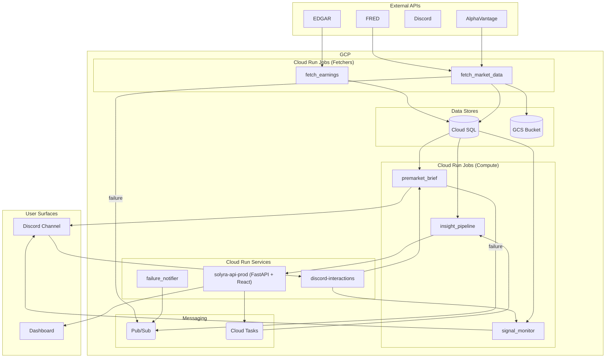

# Stocks Trading Platform

A private stocks/trading platform on GCP for a single user or small team. It delivers scheduled briefs and real-time alerts to Discord, and provides an internal dashboard for analysis. The system uses a fleet of ~76 Cloud Run Jobs for data fetching, processing, and signal generation, all orchestrated by Cloud Scheduler. The primary user surfaces are Discord for interactions and a React/FastAPI dashboard for deep analysis.

---

## Documentation map

This repo documents itself. Read these in order if you're new — or jump to whichever one matches what you're trying to do.

| Document | Purpose | Read this when |
|---|---|---|
| [ARCHITECTURE.md](ARCHITECTURE.md) | System overview, components, and data flows. | You want the 30,000-ft view of how the pieces fit together. |
| [DATA_DEPENDENCIES.md](DATA_DEPENDENCIES.md) | Per-table write/read graph and data lineage. | You're changing a data source and need to know what it impacts. |
| [COST_ANALYSIS.md](COST_ANALYSIS.md) | GCP billing rollup mapped to components. | You want to know what's driving cost. |
| [RUNBOOK.md](RUNBOOK.md) | Disaster recovery playbooks for common failure scenarios. | Something is on fire and you need a checklist. |
| [DASHBOARD_SPEC.md](DASHBOARD_SPEC.md) | Specification for the operator-facing signal quality dashboard. | You want to build out the UI for monitoring signal performance. |
| [SETUP.md](SETUP.md) | One-time setup for the auto-doc-refresh workflow. | You're enabling the monthly documentation auto-refresh. |
| [CLAUDE.md](CLAUDE.md) | Project rules and instructions for AI agents. | You are an AI agent or are collaborating with one on this repo. |
| [docs/DATA_PIPELINE.md](docs/DATA_PIPELINE.md) | Per-table freshness budgets and reliability targets. | You're triaging a stale data incident. |
| [docs/GCP_IMPLEMENTATION_GUIDE.md](docs/GCP_IMPLEMENTATION_GUIDE.md) | Narrative guide to the GCP infrastructure and deployment. | You want more detailed context on the GCP setup. |

---

## Architecture at a glance

The system runs as a fleet of ~76 Cloud Run Jobs orchestrated by Cloud Scheduler. Most jobs follow the shape *pull external API → upsert Cloud SQL*. A second class of jobs reads from Cloud SQL, computes derived analytics, and posts results to Discord.

Full per-table flow is in [DATA_DEPENDENCIES.md](DATA_DEPENDENCIES.md).

---

## Cost at a glance

- **~$209/month run-rate** based on partial data for August 2026.
- **Biggest line item:** Cloud Run Services CPU (`$47.89`).
- **Top recommendation:** Implement Artifact Registry retention policies (estimated saving: `$20-25/mo`).

Full breakdown: [COST_ANALYSIS.md](COST_ANALYSIS.md).

---

## Quick start

### I want to run this locally

1.  Run `make install` to install Python and Node dependencies.
2.  Ensure you have a `.env` file with `GOOGLE_APPLICATION_CREDENTIALS` pointing to your `.gcp-key.json`. See [CLAUDE.md](CLAUDE.md) for full setup.
3.  Run `make dev` to start the FastAPI backend and Vite frontend.
4.  Available routes once running: `/`, `/live`, `/charts`, `/options`, `/playbook`, `/backtest`, `/reports`, `/signals`, `/journal`, `/insights`, `/admin`.

### I want to add a new fetcher

1.  Add a new Python module in `gcp/fetchers/`.
2.  Add a `deploy_<name>()` function to `gcp/deploy.sh`.
3.  Add the new function to `deploy_fetchers()` and a new scheduler entry in `deploy_schedulers()` within `gcp/deploy.sh`.
4.  If adding a new table, add the schema to `gcp/schema.sql`.
5.  Update [ARCHITECTURE.md](ARCHITECTURE.md) and [DATA_DEPENDENCIES.md](DATA_DEPENDENCIES.md).

### Something is broken

See [RUNBOOK.md](RUNBOOK.md) for detailed failure scenarios and recovery steps. The system has a failure-notifier flow (Cloud Logging sink → Pub/Sub → Cloud Run Service → GitHub issue) which automatically creates issues for most job failures. See [ARCHITECTURE.md §3 "Failure notification"](ARCHITECTURE.md#3-data-flow-5-named-subsections) for details.

---

## Maintenance

Documentation auto-refreshes monthly via [`.github/workflows/refresh-architecture-docs.yml`](.github/workflows/refresh-architecture-docs.yml). This workflow regenerates `ARCHITECTURE.md`, `DATA_DEPENDENCIES.md`, `COST_ANALYSIS.md`, and this `README.md`. Bot PRs with these changes should be reviewed and merged within a week.

The `RUNBOOK.md` and `DASHBOARD_SPEC.md` are operator-edited and not part of the auto-generation process.

---

## License and contact

No explicit license has been added to this repo. Treat as **all rights reserved** until that changes. Contact: see git log / GitHub repo owner.

---
Generated 2026-09-02 by .github/workflows/refresh-architecture-docs.yml
