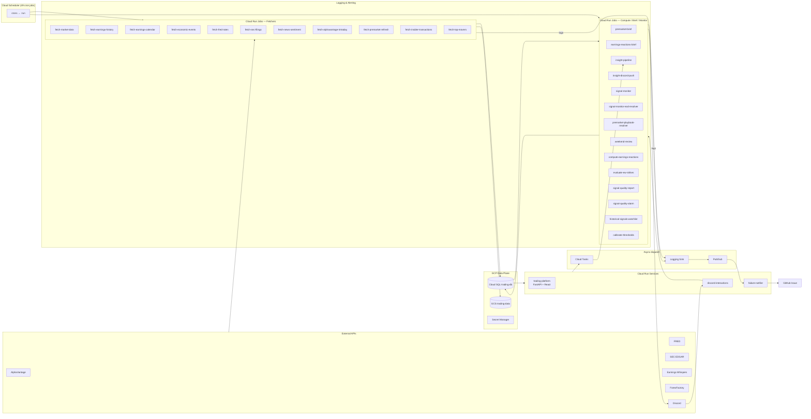

# Stocks Trading Platform

This is a private stocks-trading research and signal-delivery platform deployed on Google Cloud. It is designed for a single user or a small team. The primary delivery surface is **Discord** for scheduled briefs and interactive commands, with a secondary internal **React + FastAPI dashboard** for detailed analysis.

## Status

-yellow)

> Note: Cost data is stale. See [COST_ANALYSIS.md](COST_ANALYSIS.md) for details.

## Documentation Map

| Document | Purpose | Read this when... |
|---|---|---|
| [ARCHITECTURE.md](ARCHITECTURE.md) | High-level system overview, component inventory, and data flow diagrams. | You want to understand the overall structure of the system. |
| [DATA_DEPENDENCIES.md](DATA_DEPENDENCIES.md) | Detailed data flow graph showing which jobs read from and write to which tables. | You need to understand the data lineage for a specific table or job. |
| [COST_ANALYSIS.md](COST_ANALYSIS.md) | Breakdown of GCP costs by service and component. | You want to understand the cost drivers of the platform. |
| [RUNBOOK.md](RUNBOOK.md) | Disaster recovery playbooks for common failure scenarios. | Something is broken and you need a step-by-step guide to fix it. |
| [DASHBOARD_SPEC.md](DASHBOARD_SPEC.md) | Specification for the signal quality and backtesting dashboard. | You want to understand the vision for the platform's UI. |
| [SETUP.md](SETUP.md) | Instructions for setting up the automated documentation refresh workflow. | You are setting up the project for the first time. |
| [CLAUDE.md](CLAUDE.md) | Guidelines and rules for AI agents working within this repository. | You are an AI agent or are working with one on this codebase. |
| [docs/DATA_PIPELINE.md](docs/DATA_PIPELINE.md) | Per-table freshness budgets and reliability improvement plans. | You are investigating stale data issues. |
| [docs/GCP_IMPLEMENTATION_GUIDE.md](docs/GCP_IMPLEMENTATION_GUIDE.md) | Narrative guide to the GCP implementation details. | You need a deeper, more narrative understanding of the GCP setup. |
| [QUICK_REFERENCE.md](QUICK_REFERENCE.md) | A quick reference for common commands and procedures. | You need a quick reminder of how to do something. |
| [FRONTEND.md](FRONTEND.md) | Details about the frontend architecture and components. | You are working on the React dashboard. |
| [ERD.md](ERD.md) | Entity-Relationship Diagram for the database schema. | You need to understand the database schema and relationships. |
| [BACKTEST_RESULTS.md](BACKTEST_RESULTS.md) | A summary of backtesting results. | You want to see the performance of the trading strategies. |

## Architecture at a Glance

The system runs as a fleet of **42 production Cloud Run Jobs** orchestrated by Cloud Scheduler via ~49 cron entries. Most jobs pull data from external APIs, upsert to Cloud SQL, and optionally write a parquet snapshot to GCS. A second class of jobs computes derived analytics and posts results to Discord or the internal dashboard.

Full per-table flow is in [DATA_DEPENDENCIES.md](DATA_DEPENDENCIES.md).

## Cost at a Glance

- **Headline monthly run-rate:** ~\$13/month (based on stale data from March 2026).
- **Biggest line item:** Cloud SQL (historically ~92% of spend).
- **Top recommendation:** Resolve billing data export issue to get current cost data.

> The cost analysis is currently unable to generate fresh reports. See [COST_ANALYSIS.md](COST_ANALYSIS.md) for full details.

## Quick Start

### I want to run this locally

1.  **Install dependencies**: `make install` (Python) and `cd platform && npm install` (Node.js).
2.  **Set up environment**: Create `.env` and `.gcp-key.json` files as described in [CLAUDE.md](CLAUDE.md).
3.  **Run servers**: `make dev`.
4.  **Access**:
    - FastAPI backend: `http://localhost:8000`
    - Vite frontend: `http://localhost:5173`
    - Available routes: `/`, `/live`, `/charts`, `/options`, `/playbook`, `/backtest`, `/reports`, `/signals`, `/journal`, `/insights`, `/admin`.

### I want to add a new fetcher

1.  Create a new Python module in `gcp/fetchers/`.
2.  Add a `deploy_<name>()` function in `gcp/deploy.sh`.
3.  Add your new function to `deploy_fetchers()` and a new cron job in `deploy_schedulers()` within `gcp/deploy.sh`.
4.  If you have a new table, add the schema to `gcp/schema.sql`.
5.  Update [ARCHITECTURE.md](ARCHITECTURE.md) and [DATA_DEPENDENCIES.md](DATA_DEPENDENCIES.md).

### Something is broken

Consult the [RUNBOOK.md](RUNBOOK.md) for step-by-step failure scenarios. The system has an automated failure-notifier that creates GitHub issues for any Cloud Run Job that errors. See [ARCHITECTURE.md §3 "Failure notification"](ARCHITECTURE.md#failure-notification) for details on this flow.

## Maintenance

This repository uses a monthly GitHub Actions workflow to automatically refresh key documentation (`ARCHITECTURE.md`, `DATA_DEPENDENCIES.md`, `COST_ANALYSIS.md`, `README.md`).

- **Workflow file**: [`.github/workflows/refresh-architecture-docs.yml`](.github/workflows/refresh-architecture-docs.yml)
- **Review**: Bot-created PRs should be reviewed and merged promptly to avoid documentation drift.
- **Manual Docs**: `RUNBOOK.md` and `DASHBOARD_SPEC.md` are operator-edited and not part of the automated refresh.

## License and Contact

No explicit license has been added to this repo. Treat as **all rights reserved** until that changes. Contact: see git log / GitHub repo owner.

---
*Generated 2026-07-01 by .github/workflows/refresh-architecture-docs.yml*.
