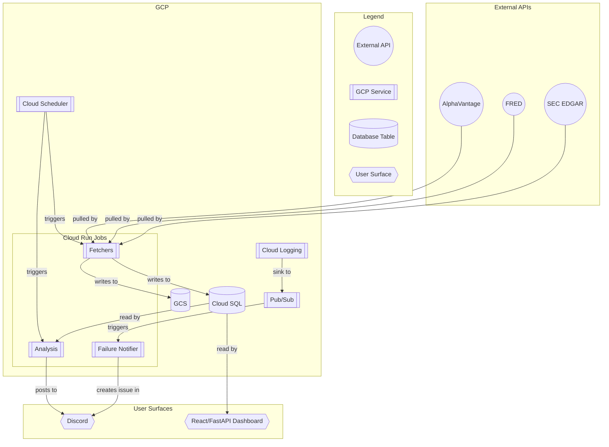

# Stocks

A private stocks-trading research and signal-delivery platform on GCP. Discord is the primary surface for scheduled briefs and slash-command interactions. A secondary internal React + FastAPI dashboard is also available. The system is operated by a small team and does not have public authentication. Data fetchers and analysis pipelines run as scheduled Cloud Run Jobs.

> Static badges (last refresh / monthly cost / job count) get bumped by the [monthly auto-refresh workflow](.github/workflows/refresh-architecture-docs.yml).

---

## Documentation map

This repo documents itself. Read these in order if you're new — or jump to whichever one matches what you're trying to do.

| Document | Purpose | Read this when |
|---|---|---|
| [ARCHITECTURE.md](ARCHITECTURE.md) | Component inventory + GCP resources + data-flow diagrams | You want the 30,000-ft view of how the pieces fit |
| [DATA_DEPENDENCIES.md](DATA_DEPENDENCIES.md) | Per-table write/read graph + multi-writer + orphan analysis | You're touching a fetcher/writer and want to know what reads downstream |
| [COST_ANALYSIS.md](COST_ANALYSIS.md) | 90-day GCP billing rollup mapped to components + recommendations | You want to know what costs money and where the leverage is |
| [RUNBOOK.md](RUNBOOK.md) | Failure-scenario playbook (8 scenarios) + RTO/RPO + rebuild-from-scratch | Something is on fire and you need a checklist |
| [DASHBOARD_SPEC.md](DASHBOARD_SPEC.md) | 5-panel signal-quality dashboard spec | You want to build the missing visibility into signal quality |
| [SETUP.md](SETUP.md) | One-time setup for the auto-doc-refresh workflow | You're enabling monthly auto-refresh for the first time |
| [CLAUDE.md](CLAUDE.md) | Project rules for AI agents working in this repo | You're collaborating with an AI agent on this code |
| [docs/DATA_PIPELINE.md](docs/DATA_PIPELINE.md) | Per-table freshness budgets + reliability TODOs | You're triaging stale data |
| [docs/GCP_IMPLEMENTATION_GUIDE.md](docs/GCP_IMPLEMENTATION_GUIDE.md) | The longer GCP playbook (predates ARCHITECTURE.md) | You want narrative GCP context |

---

## Architecture at a glance

The system runs as a fleet of ~27 Cloud Run Jobs orchestrated by Cloud Scheduler. Most jobs follow the shape *pull external API → upsert Cloud SQL → optionally write parquet to GCS → exit*. A second class of jobs reads from Cloud SQL, computes derived analytics, and posts results to Discord.

Full per-table flow is in [DATA_DEPENDENCIES.md](DATA_DEPENDENCIES.md).

---

## Cost at a glance

- **~\$13/month run-rate** (based on previous analysis).
- **Cloud SQL is the biggest line item** (~92% of spend).
- **Top recommendation:** Further analysis is needed to understand recent cost fluctuations.

For a full breakdown, see [COST_ANALYSIS.md](COST_ANALYSIS.md).

---

## Quick start

### "I want to run this locally"
- Run `make dev` to start the FastAPI backend (port 8000) and Vite frontend (port 5173).
- **Prerequisites**:
    - Python dependencies: `make install`
    - Node.js dependencies: `cd platform && npm install`
    - Create a `.env` file at the repository root.
    - Add `GOOGLE_APPLICATION_CREDENTIALS` to `.env` pointing to your `.gcp-key.json`.
- **Available frontend routes**: `/`, `/live`, `/charts`, `/options`, `/playbook`, `/backtest`, `/reports`, `/signals`, `/journal`, `/insights`, `/admin`.

### "I want to add a new fetcher"
1.  Create a new Python module in `gcp/fetchers/`.
2.  Add a `deploy_<name>()` function in `gcp/deploy.sh`.
3.  Add your new function to `deploy_fetchers()` and create a schedule in `deploy_schedulers()` within `gcp/deploy.sh`.
4.  If your fetcher requires a new database table, add it to `gcp/schema.sql`.
5.  Update `ARCHITECTURE.md` and `DATA_DEPENDENCIES.md` (or wait for the next monthly refresh).

### "Something is broken"
- Consult the [RUNBOOK.md](RUNBOOK.md) for failure scenarios and recovery steps.
- The system has an automated failure notification flow: Cloud Logging errors are sent to a Pub/Sub topic, which triggers a Cloud Run service to create a GitHub issue. See [ARCHITECTURE.md](ARCHITECTURE.md) for details.

---

## Maintenance

This repository uses a GitHub Actions workflow to automatically refresh documentation on the first of each month.

- **Workflow file**: `.github/workflows/refresh-architecture-docs.yml`
- **Auto-regenerated docs**: `ARCHITECTURE.md`, `DATA_DEPENDENCIES.md`, `COST_ANALYSIS.md`, `README.md`
- **Operator-edited docs**: `RUNBOOK.md`, `DASHBOARD_SPEC.md`

Bot-created pull requests should be reviewed and merged within a week to avoid staleness.

---

## License and contact

No explicit license has been added to this repo. Treat as **all rights reserved** until that changes. Contact: see git log / GitHub repo owner.

---

*Generated 2026-06-01 by .github/workflows/refresh-architecture-docs.yml*.
