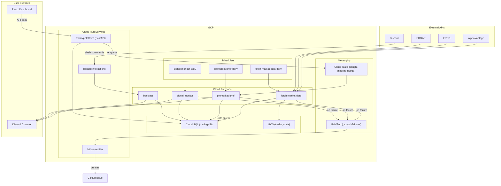

# Stocks Trading & Analysis Platform

This system is a private stocks/trading platform deployed to GCP. Its primary function is to run automated data collection and analysis jobs, delivering insights via Discord webhooks and a secondary internal React + FastAPI dashboard. The architecture is built around a fleet of approximately 48 Cloud Run Jobs, orchestrated by Cloud Scheduler, for a single-user or small-team context.


> Static badges are updated by the [monthly auto-refresh workflow](.github/workflows/refresh-architecture-docs.yml).

---

## Documentation map

This repo documents itself. Read these in order if you're new, or jump to whichever one matches your task.

| Document | Purpose | Read this when... |
|---|---|---|
| [ARCHITECTURE.md](ARCHITECTURE.md) | High-level system design, component inventory, and data flow diagrams. | You want the 30,000-ft view of how the pieces fit together. |
| [DATA_DEPENDENCIES.md](DATA_DEPENDENCIES.md) | Per-table write/read graph, multi-writer analysis, and blast radius. | You're changing a data job and need to know what it will impact. |
| [COST_ANALYSIS.md](COST_ANALYSIS.md) | GCP billing rollup mapped to components, with reduction recommendations. | You want to know what costs money and where the leverage is. |
| [RUNBOOK.md](RUNBOOK.md) | Failure-scenario playbook (8 scenarios), RTO/RPO, and rebuild-from-scratch guide. | Something is on fire and you need a checklist. |
| [DASHBOARD_SPEC.md](DASHBOARD_SPEC.md) | Spec for a 5-panel signal-quality dashboard (not yet built). | You want to build visibility into signal quality and performance. |
| [SETUP.md](SETUP.md) | One-time setup for the auto-doc-refresh workflow (WIF, IAM, secrets). | You're enabling the monthly auto-documentation for the first time. |
| [CLAUDE.md](CLAUDE.md) | Project-specific rules and instructions for AI agents working in this repo. | You are an AI assistant collaborating on this codebase. |
| [docs/DATA_PIPELINE.md](docs/DATA_PIPELINE.md) | Per-table freshness budgets and reliability TODOs. | You are triaging a stale data incident. |
| [docs/GCP_IMPLEMENTATION_GUIDE.md](docs/GCP_IMPLEMENTATION_GUIDE.md) | Narrative-style GCP playbook that predates `ARCHITECTURE.md`. | You want more historical context on the GCP setup. |

---

## Architecture at a glance

The system runs as a fleet of ~48 Cloud Run Jobs on GCP, orchestrated by Cloud Scheduler. Most jobs follow a pattern of pulling data from external APIs, upserting it into a central Cloud SQL database, and backing it up to GCS. A separate class of jobs consumes this data to generate analytics, such as the pre-market brief, which are then posted to Discord.



Full per-table flow is in [DATA_DEPENDENCIES.md](DATA_DEPENDENCIES.md).

---

## Cost at a glance

*   **~\$13/month run-rate** (Note: `billing_90d.json` was not found during the last refresh, this is a historical value).
*   **Cloud SQL is the biggest line item**, accounting for over 90% of the spend.
*   **Top recommendation:** Investigate billing credits, as a recent 72% drop in cost might be temporary.

For a full breakdown, see [COST_ANALYSIS.md](COST_ANALYSIS.md).

---

## Quick start

### I want to run this locally

```bash
# Install Python and Node dependencies
make install
cd platform && npm install && cd ..

# Start the backend (FastAPI on :8000) and frontend (Vite on :5173)
make dev
```

- **Prerequisites:** You'll need an `.env` file at the repo root with `GOOGLE_APPLICATION_CREDENTIALS` pointing to your `.gcp-key.json` service account file. See [CLAUDE.md](CLAUDE.md#technology-stack) for the full environment setup.
- **Frontend routes:** `/`, `/live`, `/charts`, `/options`, `/playbook`, `/backtest`, `/reports`, `/signals`, `/journal`, `/insights`, `/admin`.

### I want to add a new fetcher

1.  Add a new Python module in [`gcp/fetchers/`](gcp/fetchers/).
2.  Add a corresponding `deploy_<name>()` function in [`gcp/deploy.sh`](gcp/deploy.sh).
3.  Add your new deploy function to the `deploy_fetchers()` and `deploy_schedulers()` functions in the same script.
4.  If you're adding a new table, define it in [`gcp/schema.sql`](gcp/schema.sql) and run `./gcp/deploy.sh apply-schema`.
5.  Update [ARCHITECTURE.md](ARCHITECTURE.md) and [DATA_DEPENDENCIES.md](DATA_DEPENDENCIES.md) to reflect your changes (or wait for the next monthly refresh).

### Something is broken

Consult the [RUNBOOK.md](RUNBOOK.md). It contains detailed playbooks for 8 common failure scenarios. The system has an automated failure-notifier (Cloud Logging → Pub/Sub → Cloud Run → GitHub Issue) that creates a GitHub issue for any Cloud Run Job that exits with an error. See [ARCHITECTURE.md §3 "Failure notification"](ARCHITECTURE.md#failure-notification) for details.

---

## Maintenance

Documentation is automatically refreshed monthly by the [`.github/workflows/refresh-architecture-docs.yml`](.github/workflows/refresh-architecture-docs.yml) GitHub Actions workflow. This workflow opens a pull request with any significant changes. Bot PRs should be reviewed and merged within a week.

- **Auto-regenerated:** `ARCHITECTURE.md`, `DATA_DEPENDENCIES.md`, `COST_ANALYSIS.md`, `README.md`.
- **Operator-edited:** `RUNBOOK.md`, `DASHBOARD_SPEC.md`.

---

## License and contact

> No explicit license has been added to this repo. Treat as **all rights reserved** until that changes. Contact: see git log / GitHub repo owner.

---

Generated 2026-08-01 by .github/workflows/refresh-architecture-docs.yml
