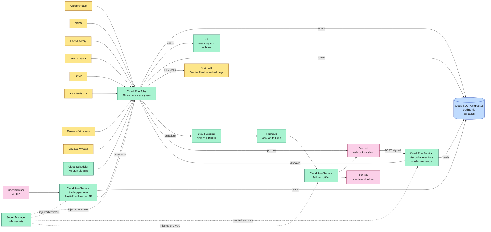
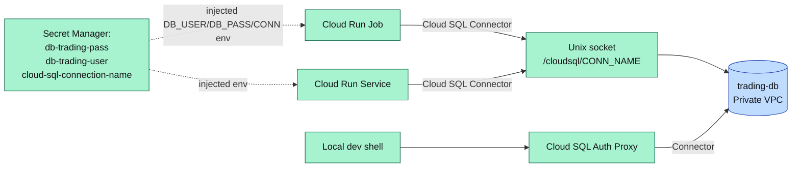
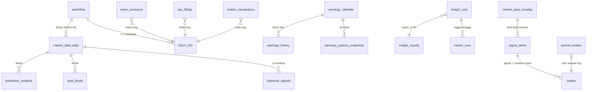
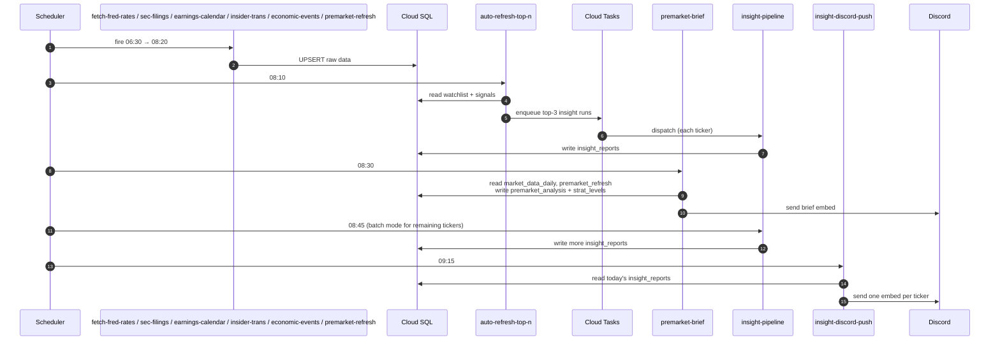
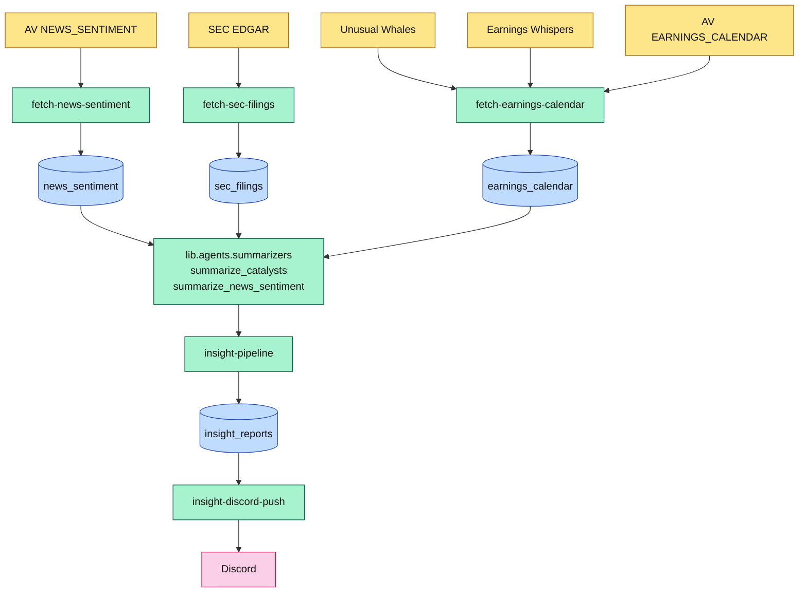
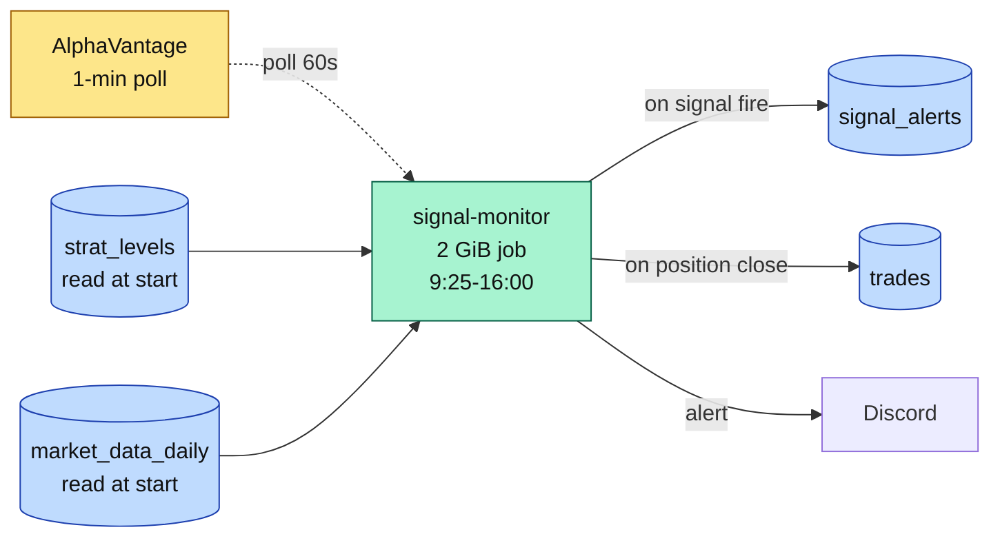
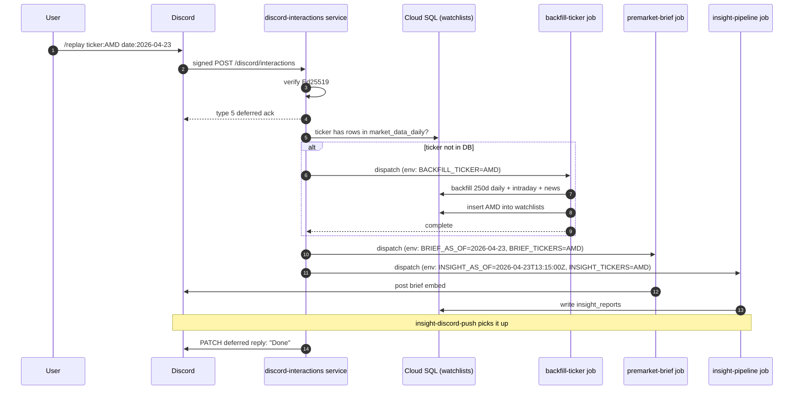
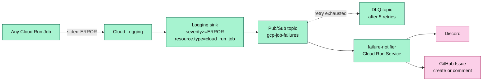

# GCP Architecture Deep-Dive

**Audience:** engineers, operators, anyone trying to understand what's running, why, and where the data lives.
**Scope:** every GCP service, Cloud Run job/service, Cloud SQL table, scheduled trigger, external integration, failure path, and cost line currently in production for this trading system.
**Last updated:** 2026-05-04
**Companion docs:** [`BRIEFING_DECK.md`](BRIEFING_DECK.md) (narrative overview), [`GCP_IMPLEMENTATION_GUIDE.md`](GCP_IMPLEMENTATION_GUIDE.md) (how to deploy), [`STRAT_METHODOLOGY.md`](STRAT_METHODOLOGY.md) (the analytical core).

> For the live-state snapshot of Cloud Run Jobs/Services/Schedulers (auto-regenerated monthly by [`refresh-architecture-docs.yml`](../.github/workflows/refresh-architecture-docs.yml) against `gcloud asset search-all-resources`), see [`ARCHITECTURE.md`](../ARCHITECTURE.md). For the visual companion, see [`Architecture.drawio`](../Architecture.drawio). This deep-dive is hand-maintained and may lag the inventory by up to a month between regen runs.

---

## Table of contents

1. [Project facts](#1-project-facts)
2. [Topology — the big picture](#2-topology--the-big-picture)
3. [GCP service inventory](#3-gcp-service-inventory)
4. [Cloud SQL — the heart of the system](#4-cloud-sql--the-heart-of-the-system)
5. [Cloud SQL schema catalog](#5-cloud-sql-schema-catalog)
6. [Cloud Run Jobs catalog](#6-cloud-run-jobs-catalog)
7. [Cloud Run Services catalog](#7-cloud-run-services-catalog)
8. [Cloud Scheduler — the daily timeline](#8-cloud-scheduler--the-daily-timeline)
9. [External integrations](#9-external-integrations)
10. [Data-flow patterns](#10-data-flow-patterns)
11. [Failure-handling architecture](#11-failure-handling-architecture)
12. [Cost model](#12-cost-model)
13. [Operational runbook anchors](#13-operational-runbook-anchors)
14. [Glossary](#14-glossary)

---

## 1. Project facts

| Field | Value |
|---|---|
| GCP project ID | `adept-mountain-474619-d4` |
| Default region | `us-east1` |
| Cloud SQL instance | `trading-db` (PostgreSQL 15, `db-g1-small`, 20 GB SSD auto-grow) |
| Database / user | `trading` / `trading_user` |
| GCS bucket | `gs://adept-mountain-474619-d4-trading-data` |
| Artifact Registry | `us-east1-docker.pkg.dev/adept-mountain-474619-d4/trading` |
| Default service account | `trading-runner@adept-mountain-474619-d4.iam.gserviceaccount.com` |
| SA roles granted | `cloudsql.client`, `storage.objectAdmin`, `run.invoker`, `secretmanager.secretAccessor` (+ `run.developer` for the discord-interactions service so it can dispatch jobs) |
| Container image | `us-east1-docker.pkg.dev/adept-mountain-474619-d4/trading/trading-system` (single image, runs every job + service) |
| Pub/Sub topic | `gcp-job-failures` (+ DLQ topic + Cloud Logging sink `gcp-job-failures-sink`) |

**Why one container image, many jobs?** Every job's entry point is `python -m gcp.<module>`. Same image, different `--command` / `--args` per job. Single-image strategy keeps Cloud Build minutes low (one build, many deploys), Artifact Registry storage minimal, and dependency drift impossible.

---

## 2. Topology — the big picture



**Read this diagram top-to-bottom in three lanes:**

1. **Ingest lane (top)** — Cloud Scheduler fires Cloud Run Jobs that pull from external APIs and land data in Cloud SQL + GCS.
2. **Serve lane (middle)** — `trading-platform` (the dashboard) and `discord-interactions` (slash commands) read from Cloud SQL and dispatch the same Cloud Run Jobs on demand.
3. **Observe lane (bottom)** — Cloud Logging watches every Cloud Run Job for errors, pipes them through Pub/Sub to the failure-notifier service, which fans out to Discord + GitHub.

---

## 3. GCP service inventory

Every GCP service the system actually uses, with the role it plays.

| Service | Role | Always-free covers it? |
|---|---|---|
| **Cloud SQL (Postgres 15)** | Single source of truth for all structured data. **38 tables (33 logical + 5 partition children of `market_data_intraday`)**. Always-on. | ❌ No free tier — $35–50/mo |
| **Cloud Run Jobs** | All scheduled batch work. Every fetcher, every analyzer, every backfill is a Cloud Run Job. | ✅ Mostly within free tier (180k vCPU-sec, 360k GB-sec/mo) |
| **Cloud Run Services** | 3 long-lived HTTP services, all `min-instances=0`. | ✅ Free at idle |
| **Cloud Scheduler** | **49 cron triggers** (31 distinct scheduler jobs / 49 when hourly news-sentiment + news-topics loops are expanded — verified 2026-05-02). Each is an HTTP push that invokes a Cloud Run Job's `:run` endpoint with OAuth identity = the runtime SA. | ⚠️ Only 3 free; ~46 paid jobs ≈ $4.60/mo |
| **Artifact Registry** | Single Docker repo `trading` holds the `trading-system` image. | ⚠️ 0.5 GB free; one image stays under |
| **Cloud Build** | Builds the Docker image when `gcp/deploy.sh build` runs. | ✅ 120 min/day free, plenty |
| **Cloud Storage (GCS)** | Raw parquet archives, daily snapshots, archived Yahoo data. Bucket lifecycle rule moves old objects to nearline. | ✅ 5 GB-month free |
| **Pub/Sub** | Single topic `gcp-job-failures` + DLQ for the failure pipeline. | ✅ 10 GB/mo free, low traffic |
| **Cloud Logging** | Captures every job's stdout/stderr; ERROR-level entries trigger the Pub/Sub sink. | ✅ 50 GB/mo free, well under |
| **Secret Manager** | All credentials (DB pass, API keys, Discord tokens, GitHub PAT). | ⚠️ 6 free; ~14 secrets ≈ $0.50/mo |
| **IAP (Identity-Aware Proxy)** | Auto-managed IAP gates the trading-platform service to bictech.org Google identities. | ✅ Free (auto-managed mode) |
| **Cloud Tasks** | One queue `insight-pipeline-queue` — used by the platform's "Refresh insight" button to enqueue per-ticker runs without blocking the request. | ✅ 1M ops/mo free |
| **Vertex AI** | Gemini 2.0 Flash for the brief's per-ticker explanations and the AI Insight pipeline persona LLMs. `text-embedding-005` for journal-entry embeddings. | ⚠️ Pay-per-token; ~$3–5/mo at current usage |

**APIs explicitly enabled** (`gcp/setup_cloud_sql.sh:38-46`):
`sqladmin`, `run`, `cloudscheduler`, `storage`, `artifactregistry`, `cloudbuild`, `secretmanager`, `tasks` (added later), `pubsub`, `aiplatform`.

---

## 4. Cloud SQL — the heart of the system

This is the database every other component reads from or writes to. If it's down, the whole platform is down.

### 4.1 Instance specs

| Setting | Value | Why |
|---|---|---|
| Engine | PostgreSQL 15 | pgvector extension required for journal embeddings; native partitioning for intraday data |
| Tier | `db-g1-small` (1 vCPU, 1.7 GB RAM, shared) | Cheapest tier that handles the workload (~700K rows, daily writes ~10K rows). Could downsize to `db-f1-micro` for ~$25/mo savings if you're willing to live with tighter RAM during historical_signals backfill |
| Storage | 20 GB SSD, **auto-grow on** | Auto-grow means the disk expands as needed; never run out, never overprovision |
| Backups | Automatic, 03:00 UTC | Daily; 7-day retention by default |
| Maintenance window | Sundays 04:00 UTC | Off-hours for US users |
| Deletion protection | **ON** | The instance literally cannot be deleted from CLI/Console without first disabling this flag. Important — losing this DB loses everything |
| Connectivity | Cloud SQL Auth Proxy + IAM | No public IP. Cloud Run jobs connect via `--add-cloudsql-instances` + Unix socket. Local dev uses the auth proxy |

### 4.2 Connection model



The single library entry point is `gcp/database.py`. Every consumer (every fetcher, every router, every test) imports `upsert_dataframe`, `query_to_dataframe`, `is_cloud_sql_configured` from there. No direct `psycopg` or `pg8000` calls outside that module.

---

## 5. Cloud SQL schema catalog

The full table list — **38 tables (33 logical + 5 partition children of `market_data_intraday`)** per [`gcp/schema.sql`](../gcp/schema.sql) — is broken into seven logical domains. **Bold** = primary writer, *italics* = primary reader.

### 5.1 Market data (raw OHLCV + indicators)

| Table | Purpose | Writers | Readers |
|---|---|---|---|
| `market_data_daily` | Daily OHLCV + 60+ derived indicator columns + pre-market context per ticker per date. The single most-read table in the system. ETF tickers only (SPY/IWM/QQQ + watchlist/earnings names); the SPX *index* has no OHLCV feed and is not stored here. | **`fetch-market-data`** (11 PM nightly), **`fetch-premarket-refresh`** (8:20 AM), **`backfill-ticker`** (on demand) | *premarket-brief*, *insight-pipeline*, *historical_signals*, *signal-monitor*, *trading-platform* (`/api/dashboard/brief/{ticker}`), *Charts page* |
| `market_data_intraday` | 1-minute OHLCV bars. **Partitioned by ticker** (`PARTITION BY LIST (ticker)`) — five child partitions: `market_data_intraday_spy`, `_iwm`, `_qqq`, `_spx`, `_other` ([`gcp/schema.sql:106-114`](../gcp/schema.sql#L106)). ~30M+ rows. | **`fetch-alphavantage-intraday`** (monthly), **`fetch-market-data`** (current month) | *signal-monitor*, *historical_signals*, *brief premarket-context calc* |
| `earnings_reactions` | Per-event playability scores + archetype tags joining `earnings_history × market_data_daily` ([`gcp/schema.sql:472`](../gcp/schema.sql#L472)). | **`compute-earnings-reactions`** (weekdays 23:00) | *premarket-brief earnings reaction profile*, *insight-pipeline* |
| `daily_rates` | Risk-free rate (`DGS3MO`) + S&P dividend yield (configured constant). Used by Black-Scholes Greeks computations. | **`fetch-fred-rates`** (daily 6:30 AM) | *`lib.options_greeks`*, *backtest job* |
| `archive_yahoo_*` | Frozen archive of pre-AV-migration Yahoo data (4 tables: daily, intraday, etf_options, earnings_options). Read-only forensics. | one-shot migration script, never written again | manual queries only |

### 5.2 Options data

| Table | Purpose | Writers | Readers |
|---|---|---|---|
| `etf_options_snapshots` | Snapshots of the SPY / IWM / QQQ / SPX option chain — strike, IV, Greeks (delta/gamma/theta/vega/rho), volume, OI, underlying price. ~24M rows. | **`fetch-av-historical-options`** (after-close) | *gamma analytics*, *Strat playbook*, *insight pipeline (catalysts)*, *charts gamma overlay* |
| `earnings_options_snapshots` | Same shape as etf_options_snapshots but for tickers around their earnings date. | **`fetch-av-historical-options`** with earnings ticker list | *premarket brief earnings embed*, *EW strike eval* |

### 5.3 Calendars + reference data

| Table | Purpose | Writers | Readers |
|---|---|---|---|
| `earnings_calendar` | Forward-looking earnings dates from 3 sources: AlphaVantage (date-of-truth), Unusual Whales (market-mover ranking), Earnings Whispers (strategy + strike picks). One row per `(ticker, earnings_date, strategy, data_source)`. | **`fetch-earnings-calendar`** (weekdays 7:15 AM), **`evaluate-ew-strikes`** (after-hours, fills `ew_*_on_day`) | *premarket-brief*, *insight-pipeline*, *catalysts router*, *ranker* |
| `earnings_history` | Historical quarterly EPS — `reportedDate`, `reportedEPS`, `estimatedEPS`, `surprise`, `surprisePercentage`, going back 10+ years from AV `EARNINGS` endpoint. | **`fetch-earnings-history`** (Sun 6 AM weekly) | *future ranker post-earnings reaction signal* |
| `economic_events` | Macro events with date + time + importance (CPI, NFP, FOMC, etc.). ForexFactory (preferred — has times) + FRED (fallback). | **`fetch-economic-events`** (weekdays 7 AM) | *premarket-brief Economic Calendar embed*, *catalysts page* |
| `sec_filings` | Form 8-K / 10-Q / 10-K filings from SEC EDGAR with item codes (1.01 M&A, 5.02 exec change, etc.). | **`fetch-sec-filings`** (4 slots/day post-PR-#157) | *insight-pipeline catalyst dots*, *ranker `_candidates_from_8k`*, *Catalysts page* |
| `insider_transactions` | Form 4 filings — every officer/director buy or sell. | **`fetch-insider-transactions`** (weekdays 7 AM) | *ranker insider_buying / insider_selling signals*, *Catalysts page* |
| `top_movers_daily` | AV `TOP_GAINERS_LOSERS` daily snapshot — top gainers / losers / most-active. | **`fetch-top-movers`** (weekdays 4:15 PM) | *ranker* |
| `news_sentiment` | Sentiment-scored articles from AV, RSS, FinViz. ~5 columns of scores (per-ticker + article-level + topic array). | **`fetch-news-sentiment`** (every market hour), **`fetch-news-sentiment-topics`**, **`fetch-rss-news`** | *insight-pipeline summarize_news_sentiment*, *Discord catalyst dots*, *Catalysts page* |
| `ticker_info` | AV `OVERVIEW` cache — name, sector, industry, market_cap, description, peers (FinViz). One row per ticker. | `lib.ticker_info` (called on watchlist add) | *every fetcher's alias-matching pipeline*, *WatchlistPanel UI* |
| `watchlists` | **The active universe.** Per-user soft-deletable list of tickers with `in_brief` / `in_insight` per-surface flags. | platform UI Add-Ticker, `/watchlist add` slash command, `backfill-ticker` job | *every fetcher reads `_watchlist.resolve_tickers()`*, *insight-pipeline*, *premarket-brief*, *historical-signals-watchlist* |

### 5.4 Strat-specific tables

| Table | Purpose | Writers | Readers |
|---|---|---|---|
| `strat_levels` | Long table of horizontal price markers (PDH, PDL, PWH, PWL, PMH, PML, PQH, PQL, PYH, PYL, current opens, gaps). Populated nightly per ticker. | **`premarket-brief`** via `lib.strat_levels.persist_level_map()` | *brief playbook*, *signal-monitor `check_level_breaks`*, *trade planner `select_trigger_and_regime`* |
| `ticker_calibration` | Per-ticker calibrated RSI bands and other Tier A inputs (PR #248) — drives the `lib.strategies.mean_reversion` per-ticker thresholds ([`gcp/schema.sql:1506`](../gcp/schema.sql#L1506)). | **`calibrate-thresholds`** (quarterly) | *`lib.strategies.mean_reversion`*, *signal-monitor* |

### 5.5 Pipeline output tables

| Table | Purpose | Writers | Readers |
|---|---|---|---|
| `premarket_analysis` | One row per `(analysis_date, ticker)` — the brief's per-ticker decision packet (price, RSI, FTFC, Strat candle/combo, ORB recommendation, playbook, gap_pct). UPSERTed each morning. | **`premarket-brief`** | *trading-platform `/api/dashboard`*, *insight-pipeline (reads brief context)* |
| `premarket_analysis_history` | **Append-only audit trail** — every actual brief execution captured before the canonical `premarket_analysis` row gets overwritten by a re-run. | brief on every run | *forensics*, *replay validation* |
| `signal_alerts` | Real-time signal fires — direction, score, level_broken, ORB levels, indicators at signal time. | **`signal-monitor`** during market hours | *Live Market page*, *trades page* |
| `trades` | Auto-pipeline trade ledger — entry/exit, return %, `signal_strength`, the conditions met. | **`signal-monitor`** when a position closes | *Trades page*, *backtest comparator*, *weekend-review* |
| `journal_entries` | **User-authored** trade log (separate from `trades` so user data and pipeline data are never mixed). Has a 768-dim `embedding` column (Vertex `text-embedding-005`) for reflection memory. | platform UI POST `/api/journal` | *journal page*, *Reflection memory in insight pipeline* |
| `historical_signals` | Materialized signal-fire history per `(ticker, entry_time)` with MFE / N-min returns. | **`historical-signals-watchlist`** (Tue–Sat 1 AM) | *signals router `_query_signals_sql`*, *Charts page Similar Setups card* |
| `insight_reports` | One row per `(ticker, as_of)` — the AI Insight payload (JSONB). Contains entry/stop/targets, persona plans, catalysts, risk flags, costs, latency. | **`insight-pipeline`** (8:45 weekdays + on-demand) | *insight-discord-push (9:15)*, *Insights page*, *Discord `/replay`* |
| `insight_reports_history` | Append-only audit trail for `insight_reports` (same UPSERT-protection pattern as `premarket_analysis_history`). | insight-pipeline on every run | *forensics* |
| `insight_runs` | Durable run-state for async pipeline execution — `queued / running / done / failed` + `trigger ∈ {on_demand, scheduled, local_dev, manual_batch}` + reference to `report_id`. | insight-pipeline (state machine) | *platform UI status indicator* |
| `ranker_runs` | One row per `lib.agents.ranker.rank_tickers` call — captures inputs (weights) + ranked output (JSONB). Reproducibility audit. | **`auto-refresh-top-n`**, *platform UI ranker calls* | *rationale display*, *historical comparison* |
| `model_routing` | Per-role model routing config (e.g. PM persona = Gemini Pro, Analyst = Flash). One row per role. | seed migration, occasional manual UPDATE | *insight pipeline* |
| `signal_metrics` | Trailing clean-rate / fire-rate / agreement metrics computed by the Phase 0.5 quality jobs ([`gcp/schema.sql:1673`](../gcp/schema.sql#L1673)). Drives the alarm threshold in `signal-quality-alarm`. | **`signal-quality-report`** (hourly + nightly) | *`signal-quality-alarm`*, *trading-platform analytics router* |

### 5.6 Schema relationships



There are **no formal foreign keys** between domain tables — only the `insight_runs.report_id → insight_reports.id` reference. Everything else is logically connected by `ticker` (and `date` / `as_of`) but not constrained at the DB level. This is intentional: it lets fetchers be fully independent and lets backfills run without strict ordering.

---

## 6. Cloud Run Jobs catalog

28 jobs (per [`gcp/deploy.sh`](../gcp/deploy.sh)). Every one runs on the same `trading-system` image, differing only in `--command` and `--args`. All defaulting to retry policy `--max-retries 1` unless noted.

### 6.1 Data ingestion (the fetchers)

| Job | Memory / Timeout | Schedule (ET) | What it pulls | Writes to |
|---|---|---|---|---|
| `fetch-market-data` | 1 GiB / 30 min | weekdays 23:00 | AV `TIME_SERIES_DAILY_ADJUSTED` (split-adjusted) + intraday for current month | `market_data_daily`, `market_data_intraday`, GCS parquet |
| `fetch-premarket-refresh` | 512 MiB / 5 min | weekdays 08:20 | AV intraday for today's pre-market (4 AM–9:30 AM ET) | UPSERTs `pre_high/pre_low/pre_vwap/pre_volume/gap_pct/pre_range_atr` on `market_data_daily` |
| `fetch-alphavantage-intraday` | 2 GiB / 1 hr | 1st of month, 21:00 | AV `TIME_SERIES_INTRADAY` 1-min bars, full month | `market_data_intraday` |
| `fetch-fred-rates` | 512 MiB / 10 min | daily 06:30 | FRED `DGS3MO` (3-month T-bill) | `daily_rates` |
| `fetch-economic-events` | 512 MiB / – | weekdays 07:00 | ForexFactory JSON + FRED releases | `economic_events` |
| `fetch-earnings-calendar` | 512 MiB / 5 min | weekdays 07:15 | AV `EARNINGS_CALENDAR` + Unusual Whales calendar + Earnings Whispers strategy picks | `earnings_calendar` |
| `fetch-earnings-history` | 1 GiB / 30 min | Sun 06:00 | AV `EARNINGS` historical quarterly EPS | `earnings_history` |
| `fetch-sec-filings` | 512 MiB / 30 min | weekdays 07:00, 10:00, 13:00, 17:00 (4 slots — see PR #157) | SEC EDGAR submissions JSON | `sec_filings` |
| `fetch-insider-transactions` | 512 MiB / 30 min | weekdays 07:00 | AV `INSIDER_TRANSACTIONS` Form-4 filings | `insider_transactions` |
| `fetch-top-movers` | 512 MiB / – | weekdays 16:15 | AV `TOP_GAINERS_LOSERS` snapshot | `top_movers_daily` |
| `fetch-news-sentiment` | 512 MiB / – | weekdays hourly during market hours | AV `NEWS_SENTIMENT` per watchlist ticker | `news_sentiment` |
| `fetch-news-sentiment-topics` | 512 MiB / – | weekdays hourly @ :05 | AV `NEWS_SENTIMENT` by topic (M&A, earnings, etc.) — captures non-watchlist names | `news_sentiment` |
| `fetch-av-options-backfill` ¹ | – | one-shot historical | AV `HISTORICAL_OPTIONS` for ETFs (SPY/IWM/QQQ/SPX) + earnings tickers; module is [`gcp/fetchers/fetch_av_historical_options.py`](../gcp/fetchers/fetch_av_historical_options.py). | `etf_options_snapshots`, `earnings_options_snapshots` |

¹ Deployed manually outside [`gcp/deploy.sh`](../gcp/deploy.sh) — see [`ARCHITECTURE.md`](../ARCHITECTURE.md) reconciliation §5 (item 2). The repo also contains [`gcp/fetchers/fetch_rss_news.py`](../gcp/fetchers/fetch_rss_news.py) but it is **not** deployed as a Cloud Run Job; per [`DATA_DEPENDENCIES.md`](../DATA_DEPENDENCIES.md) it is pending an "either deploy or delete" decision.

### 6.2 Analysis + delivery

| Job | Memory / Timeout | Schedule (ET) | What it does |
|---|---|---|---|
| `premarket-brief` | 1 GiB / 30 min | weekdays 08:30 + Sun 09:00 | Loads daily data → computes Strat / FTFC / level map → renders 3-embed Discord brief (overview + ticker analysis + economic calendar) → persists to `premarket_analysis` |
| `auto-refresh-top-n` | 1 GiB / 10 min | weekdays 08:10 | Runs `lib.agents.ranker.rank_tickers()` → picks top N (default 3) → enqueues per-ticker insight runs into Cloud Tasks (so they pre-warm before brief at 8:30) |
| `insight-pipeline` | 2 GiB / 30 min | weekdays 08:45 + on-demand | Multi-agent AI pipeline (analyst / PM / risk personas) → entry zones, stops, targets, persona plans → `insight_reports` |
| `insight-discord-push` | 512 MiB / 2 min | weekdays 09:15 | Reads today's `insight_reports`, formats one Discord embed per ticker with title-led news field |
| `signal-monitor` | 2 GiB / 8 hr | weekdays 09:25 (runs until close) | Polls AV every 60 sec → maintains rolling indicator window → fires `signal_alerts` + writes `trades` on close |
| `signal-monitor` (ORB modes) | 2 GiB / – | weekdays 09:45 (15-min ORB), 10:00 (30-min ORB) | Same image, different `--args`: `--mode=orb-snapshot --window=15m / 30m` |
| `signal-quality-report` | 1 GiB / 60 min / `--max-retries 0` ([`gcp/deploy.sh:184`](../gcp/deploy.sh#L184)) | weekdays hourly 10:00–16:00 + nightly Tue–Sat 01:00 | Phase 0.5 quality monitoring — computes trailing clean-rate / fire-rate / agreement metrics across `signal_alerts` and writes to `signal_metrics`. |
| `signal-quality-alarm` | 512 MiB / 2 min / `--max-retries 0` ([`gcp/deploy.sh:225`](../gcp/deploy.sh#L225)) | weekdays Tue–Sat 02:00 | Reads `signal_metrics`; deliberately exits non-zero when trailing-7d clean-rate drops > 3 pp vs prior 7d, which the failure-notifier converts into a labeled GitHub issue. |
| `weekend-review` | 1 GiB / – | Sat 09:00 | Aggregates the week's trades, compares actual vs backtest, posts Discord summary |
| `evaluate-ew-strikes` | 512 MiB / 10 min | weekdays 23:00 | Scores how each EW strike pick played out: HIT / MISS / KEPT / ASSIGNED + minutes-to-hit + minutes-in-zone |
| `compute-earnings-reactions` | 1 GiB / 30 min ([`gcp/deploy.sh:834`](../gcp/deploy.sh#L834)) | weekdays 23:00 | Joins `earnings_history × market_data_daily` → playability scores + archetype tags → `earnings_reactions`. |
| `calibrate-thresholds` | 1 GiB / 10 min ([`gcp/deploy.sh:986`](../gcp/deploy.sh#L986)) | quarterly (1st of Jan/Apr/Jul/Oct, 02:00) | Per-ticker RSI band recalibration (PR #248) — writes `ticker_calibration` consumed by `lib.strategies.mean_reversion`. |
| `historical-signals-watchlist` | 2 GiB / 30 min | Tue–Sat 01:00 | Iterates watchlist → runs `trading_analysis.py` → bulk-inserts to `historical_signals` |
| `validate-brief` | 1 GiB / 5 min | on-demand (Discord `/validate` Slice 3) | Replays a trading day's brief playbook + AI plan against the actual intraday session |
| `backtest` | 2 GiB / 15 min | on-demand (Discord `/backtest` Slice 3) | Wraps `scripts/run_backtest.py` for arbitrary ticker + window |
| `backfill-ticker` | 1 GiB / 10 min | on-demand (Discord `/replay TICKER` for new tickers) | AV daily-full + intraday + news + indicators + pre-market context for a single new ticker |

### 6.3 One-shot ops

| Job | Purpose |
|---|---|
| `apply-schema-migrations` | Reads `gcp/schema.sql` and applies it to live DB (idempotent — the schema uses `IF NOT EXISTS` everywhere) |
| `compute-spx-greeks-backfill` | One-off: backfill Greeks for SPX options snapshots |

---

## 7. Cloud Run Services catalog

Three long-lived HTTP services, all with `min-instances=0` so they cost nothing at idle.

### 7.1 `trading-platform` — the dashboard

| Aspect | Value |
|---|---|
| Image | Same `trading-system` image. Multi-stage Dockerfile builds Vite SPA + serves it via FastAPI |
| Memory / CPU | 512 MiB / 1 vCPU |
| Scaling | 0–5 instances |
| Auth | **IAP (Identity-Aware Proxy) auto-managed** scoped to `bictech.org` Google identities. Admin email (`teneika@bictech.org`) bypasses the optional in-app token gate |
| Endpoints | `/api/health`, `/api/me`, `/api/dashboard/*`, `/api/insights/*`, `/api/signals/*`, `/api/catalysts/*`, `/api/admin/*`, `/api/journal/*`, `/api/charts/*`, `/api/ranker/*`, `/dev` (admin-only diagnostic), and the SPA at `/` |
| Cloud SQL | `--add-cloudsql-instances` connector path |
| URL | `trading-platform-…run.app` |
| Deploy path | Deployed by [`platform/deploy.sh`](../platform/deploy.sh) (separate from [`gcp/deploy.sh`](../gcp/deploy.sh)). Image lives in `gcr.io/adept-mountain-474619-d4/trading-platform`, **not** `us-east1-docker.pkg.dev/.../trading`. See [`ARCHITECTURE.md`](../ARCHITECTURE.md) reconciliation §5 (item 4). |

This is the only thing a human directly hits in a browser.

### 7.2 `discord-interactions` — the slash command service

| Aspect | Value |
|---|---|
| Memory / CPU | 512 MiB / 1 vCPU |
| Scaling | 0–5 instances |
| Auth | `--allow-unauthenticated` (Discord can't IAM-auth). Verifies Ed25519 signatures via `pynacl` so untrusted callers get rejected at the FastAPI layer. |
| Endpoint | `POST /discord/interactions` (Discord-required path) + `GET /health` |
| Slash commands | `/replay`, `/watchlist`, `/validate`, `/backtest` (Slices 2 + 3 still stubbed) |
| Dispatch | Calls `google.cloud.run_v2.JobsClient.run_job(request=RunJobRequest(name=..., overrides=...))` to fire the relevant Cloud Run Job with env-var overrides like `INSIGHT_AS_OF` / `BRIEF_AS_OF` / `BRIEF_TICKERS` |
| Required IAM | Runtime SA needs `roles/run.developer` to dispatch jobs |

### 7.3 `failure-notifier` — observability fan-out

| Aspect | Value |
|---|---|
| Memory / CPU | 512 MiB / 1 vCPU |
| Scaling | 0–3 instances |
| Auth | OIDC-bound to the Pub/Sub push subscription |
| Implementation | stdlib `http.server` (no FastAPI dep) + `requests` + `tenacity` |
| Trigger | Pub/Sub push from `gcp-job-failures` topic (which is fed by Cloud Logging sink filtering `severity>=ERROR AND resource.type="cloud_run_job"`) |
| Outputs | (1) Discord webhook embed with clickable "View logs" link to Cloud Console; (2) GitHub issue labelled `gcp-job-failure,<job_name>` — repeat failures append a comment to the existing open issue (dedup pattern) |
| Self-loop guard | Sink filter excludes `resource.labels.job_name="failure-notifier"`, plus a runtime check that drops events whose job_name is the notifier itself |

---

## 8. Cloud Scheduler — the daily timeline

**31 distinct scheduler jobs / 49 when the hourly `news-sentiment-{0800..1700}` and `news-topics-{0805..1705}` loops are expanded** (verified 2026-05-02 against [`gcp/deploy.sh`](../gcp/deploy.sh)). All times Eastern. **Weekdays = Mon–Fri** unless otherwise noted.

```mermaid
gantt
    title Daily Cloud Scheduler triggers (US/Eastern)
    dateFormat HH:mm
    axisFormat %H:%M

    section Pre-market
    fred-rates                    :a1, 06:30, 5m
    fetch-economic-events         :a2, 07:00, 10m
    fetch-sec-filings (slot 1/4)  :a3, 07:00, 5m
    fetch-insider-transactions    :a4, 07:00, 5m
    fetch-earnings-calendar       :a5, 07:15, 5m
    auto-refresh-top-n            :a6, 08:10, 10m
    fetch-premarket-refresh       :a7, 08:20, 5m
    premarket-brief               :a8, 08:30, 10m
    insight-pipeline              :a9, 08:45, 25m

    section Intraday
    insight-discord-push          :b1, 09:15, 2m
    signal-monitor (open)         :b2, 09:25, 30m
    orb-15m-alert                 :b3, 09:45, 5m
    orb-30m-alert                 :b4, 10:00, 5m
    fetch-sec-filings (slot 2/4)  :b5, 10:00, 5m
    signal-quality-report-hourly  :b6, 10:00, 60m
    fetch-sec-filings (slot 3/4)  :b7, 13:00, 5m
    fetch-news-sentiment*         :b8, 14:00, 10m

    section Post-market
    fetch-top-movers              :c1, 16:15, 5m
    fetch-sec-filings (slot 4/4)  :c2, 17:00, 5m
    fetch-market-data             :c3, 23:00, 30m
    evaluate-ew-strikes           :c4, 23:00, 10m
    compute-earnings-reactions    :c5, 23:00, 30m
```



> *`fetch-news-sentiment` represents an hourly loop: `news-sentiment-{0800..1700}` and `news-topics-{0805..1705}` run every market hour 08:00–17:00 ET (10 entries each, 20 total). The Gantt shows one representative entry to keep the daily-rhythm visualization readable.

**Why these times** (the load-bearing rationale):

- **06:30 fred-rates** — FRED publishes overnight; we fetch before any consumer needs `r` for Greeks.
- **07:00–07:15 calendar fetchers** — pull catalysts before any analytic job opens. `sec-filings` 07:00 is the slot the brief + insight pipeline actually depend on; the other three slots (10/13/17) only refresh the Catalysts page intra-day (per PR #157 cleanup).
- **08:10 auto-refresh-top-n** — front-runs the brief by 20 min so its dispatched insight runs finish before 08:30; uses Cloud Tasks (max 5 concurrent) so top-3 reports are ready in ~90 sec.
- **08:20 premarket-refresh** — must run BEFORE the 08:30 brief so today's `gap_pct` is populated when the brief LEFT JOINs (PR #168 moved this from 08:30 → 08:20 specifically for this reason).
- **08:30 premarket-brief** — fires the morning Discord embed.
- **08:45 insight-pipeline** — runs after the brief so it can read today's `premarket_analysis`.
- **09:15 insight-discord-push** — 30 min after pipeline finishes; reads `insight_reports` and pushes one embed per ticker.
- **09:25 signal-monitor** — 5 min before market open so the rolling indicator window is warm.
- **09:45 / 10:00 ORB snapshots** — capture the 15-min and 30-min opening range for the playbook.
- **16:15 top-movers** — 15 min after close so AV's daily snapshot has settled.
- **23:00 market-data + evaluate-ew-strikes** — late enough that AV daily bars have settled (was 17:00 originally; PR #133 moved to 23:00 because ~30% of days were getting partial coverage).

### 8.1 Weekly + monthly triggers

| Cron | Job | Purpose |
|---|---|---|
| Sat 09:00 | `weekend-review` | Week's-trades retrospective Discord post |
| Sun 06:00 | `fetch-earnings-history` | Backfill historical EPS for new tickers |
| Sun 09:00 | `premarket-brief` | Week-ahead earnings + economic calendar digest |
| Tue–Sat 01:00 | `historical-signals-watchlist` | Nightly signal-history extension for every watchlist ticker |
| Tue–Sat 01:00 | `signal-quality-report-nightly` | Phase 0.5 nightly quality rollup into `signal_metrics` ([`gcp/deploy.sh:1365`](../gcp/deploy.sh#L1365)) |
| Tue–Sat 02:00 | `signal-quality-alarm-daily` | Reads `signal_metrics`, exits non-zero on > 3 pp clean-rate drop ([`gcp/deploy.sh:1375`](../gcp/deploy.sh#L1375)) |
| 1st of month, 21:00 | `fetch-alphavantage-intraday` | Full-month 1-min bars per ticker |
| 1st of Jan/Apr/Jul/Oct, 02:00 | `calibrate-thresholds-quarterly` | Per-ticker RSI band recalibration → `ticker_calibration` ([`gcp/deploy.sh:1347`](../gcp/deploy.sh#L1347)) |

---

## 9. External integrations

Every external API the system depends on, with the role and the failure mode if it goes dark.

| Provider | What we fetch | How auth | Failure mode |
|---|---|---|---|
| **AlphaVantage** | `TIME_SERIES_DAILY_ADJUSTED`, `TIME_SERIES_INTRADAY` (with `entitlement=realtime` after PR #171), `EARNINGS`, `EARNINGS_CALENDAR`, `INSIDER_TRANSACTIONS`, `TOP_GAINERS_LOSERS`, `OVERVIEW`, `SYMBOL_SEARCH`, `NEWS_SENTIMENT`, `HISTORICAL_OPTIONS`, `REALTIME_BULK_QUOTES`, `GLOBAL_QUOTE` | API key (`av-api-key` secret + `ALPHA_VANTAGE_API_KEY` env alias) | Premium tier 150 req/min, 1200/day. Hitting the limit returns an empty response (no HTTP error), so we gate every fetcher with budget tracking and a top-N earnings cap |
| **FRED** | `DGS3MO`, releases calendar | API key (`fred-api-key`) | Rate-limited but generous; failures logged and skipped (rates table holds last value) |
| **ForexFactory** | `ff_calendar_thisweek.json` mirror via FairEconomyMedia | None (open URL) | Fall back to FRED-only (no times) if ForexFactory 404s |
| **SEC EDGAR** | `company_tickers.json`, `submissions/CIK*.json` | None; descriptive `User-Agent` required | Free; 10 RPS rate limit; we run at ~7 RPS |
| **FinViz** | Per-ticker peers + `ticker_news` | None (HTML scrape) | Brittle; failures degrade RSS pipeline gracefully |
| **RSS feeds (×11)** | Seeking Alpha, Yahoo Finance (×3), CNBC (×2), MarketWatch (×3), Investing.com (×4), NASDAQ trade halts | None | Per-feed fault isolation; a dead feed doesn't block the others |
| **Earnings Whispers** | Strategy + strike picks via authenticated cookie / CSRF flow | login form (creds in env) | Brittle; falls back to AV+UW only |
| **Unusual Whales** | Earnings calendar with market-cap ranking | API key | Falls back to AV-only |
| **Vertex AI (Gemini Flash)** | `lib.adapters.vertex.VertexAdapter` for brief explanations + insight pipeline persona LLMs | ADC via runtime SA | `BRIEF_LLM_DISABLE=1` env bypasses the entire layer in emergencies |
| **Vertex AI (text-embedding-005)** | 768-dim embeddings for `journal_entries.embedding` | ADC | Reflection memory disabled if down (insight pipeline skips that summarizer block) |
| **Discord** | Webhook (push) + Interactions endpoint (signed POST) | webhook URL secret + Ed25519 verify on signed requests | Push fails are retried with backoff; interactions service returns 503 if the public key isn't loaded |
| **GitHub** | Issues API for failure-notifier | PAT (`github-pat`) | Failure to create an issue is logged but doesn't block Discord notification |

---

## 10. Data-flow patterns

Five canonical flow patterns cover ~95% of what the platform does.

### 10.1 The morning workflow (08:00–09:30 ET)



**Critical ordering:** `premarket-refresh` (08:20) MUST finish before `premarket-brief` (08:30) reads from `market_data_daily` for today's `gap_pct`. PR #168 moved premarket-refresh from 08:30 → 08:20 to enforce this margin.

### 10.2 Catalyst → Insight → Discord (data flow)



### 10.3 Real-time signal flow (intraday)



### 10.4 The Discord `/replay` flow



### 10.5 Failure flow



The notifier dedupes — repeat failures of the same job comment on the existing open issue rather than spamming.

---

## 11. Failure-handling architecture

Three independent layers:

1. **Per-job retry** — Cloud Run Jobs default to `--max-retries 1` (one automatic retry on non-zero exit). `signal-monitor` is `--max-retries 0` because it's a long-running 8h task; restarting it in mid-session would drop the rolling window.
2. **Logging sink → Pub/Sub → notifier** — described in §10.5. ~60 sec end-to-end from job exit to Discord ping.
3. **Idempotency at the data layer** — every fetcher uses `upsert_dataframe` with conflict-keyed UPSERT. Re-running any failed job is safe — duplicate writes are no-ops. This is what makes manual `gcloud run jobs execute` recovery trivial.

### Special cases

- **GitHub Actions failure handling** is a separate system (see `scripts/handle_workflow_failure.py` and CLAUDE.md §"Automated Workflow Failure Handling"). The Cloud Run failure notifier was the GCP-side equivalent added in PR #82.
- **The notifier itself failing** would create a self-loop. Sink filter excludes `job_name="failure-notifier"` and the runtime double-checks the same field before posting.
- **Cloud SQL outage** — every fetcher tolerates SQL-down by raising and exiting non-zero (which lights up the failure pipeline). The brief and insight pipeline each have a final `try/except` that posts a degraded embed to Discord rather than going silent.

---

## 12. Cost model

Estimated monthly run-rate at current usage. **Cloud SQL is ~70% of the bill.**

| Service | Estimate | Notes |
|---|---|---|
| Cloud SQL `db-g1-small` + 20 GB SSD + backups | **$35–50** | Always-on, never-free. Biggest lever: stop instance during quiet windows or downsize to `db-f1-micro` |
| Cloud Scheduler (49 jobs, 3 free) | **$4.60** | Each paid job is $0.10/mo |
| Cloud Run Jobs vCPU + memory | **$1–5** | Slight overage on the 180k vCPU-sec free tier; biggest consumers are signal-monitor (8 hr/day) and historical-signals-watchlist |
| Cloud Run Services | **$0–1** | All min-instances=0, near-zero idle cost |
| Vertex AI Gemini Flash | **$3–5** | Per-brief ~$0.005, per-insight ~$0.10. Can be killed via `BRIEF_LLM_DISABLE=1` |
| Secret Manager (~14 secrets, 6 free) | **$0.50** | $0.06/secret-version-month |
| Cloud Storage (under 5 GB) | **$0–1** | Within free tier |
| Pub/Sub | **$0** | Way under 10 GB/mo free |
| Cloud Logging | **$0–2** | Under 50 GB/mo free |
| Artifact Registry (one image) | **$0–0.50** | Within 0.5 GB free |
| Cloud Build | **$0** | Manual builds only; well under 120 min/day |
| **Total** | **~$45–70/month** | |

**External APIs not on this list** (the system also pays for):

- AlphaVantage premium tier ~$50/mo (150 req/min, 1200/day, options data).
- FRED — free.
- SEC EDGAR — free.
- Discord — free.
- Earnings Whispers / Unusual Whales — separate subscriptions.

---

## 13. Operational runbook anchors

Most-needed `gcloud` commands when something's on fire. The full deploy script reference lives in [`GCP_IMPLEMENTATION_GUIDE.md`](GCP_IMPLEMENTATION_GUIDE.md).

### 13.1 Deploy / redeploy

```bash
bash gcp/deploy.sh build         # rebuild + push image
bash gcp/deploy.sh fetchers      # redeploy every fetcher job
bash gcp/deploy.sh schedulers    # apply scheduler config (idempotent)
bash gcp/deploy.sh insights      # rebuild image + redeploy insight pipeline
bash gcp/deploy.sh discord       # redeploy discord-interactions service
bash gcp/deploy.sh notifier      # redeploy failure-notifier service
bash gcp/deploy.sh all           # everything
```

### 13.2 Inspect live state

```bash
# What jobs exist?
gcloud run jobs list --region us-east1

# What scheduler triggers exist?
gcloud scheduler jobs list --location us-east1

# Last execution of a job
gcloud run jobs executions list --job=premarket-brief --region us-east1 --limit 5

# Tail logs for a specific job
gcloud logging read 'resource.type="cloud_run_job" resource.labels.job_name="premarket-brief"' \
    --project adept-mountain-474619-d4 --limit 50 \
    --format='value(timestamp,textPayload)' --order=desc

# Connect to Cloud SQL via auth proxy (read-only check)
cloud-sql-proxy adept-mountain-474619-d4:us-east1:trading-db --port 5432 &
PGPASSWORD=$(gcloud secrets versions access latest --secret=db-trading-pass) \
psql -h 127.0.0.1 -U trading_user -d trading -c "SELECT max(date) FROM market_data_daily;"
```

### 13.3 Manually trigger a job

```bash
gcloud run jobs execute premarket-brief --region us-east1 --wait
gcloud run jobs execute fetch-market-data --region us-east1 --args=--date,2026-04-30
gcloud run jobs execute insight-pipeline --region us-east1 \
    --update-env-vars=INSIGHT_AS_OF=2026-04-23,INSIGHT_TICKERS=AMD
```

### 13.4 Stop / start the database (cost reduction)

```bash
gcloud sql instances patch trading-db --activation-policy=NEVER  # stop (storage cost only)
gcloud sql instances patch trading-db --activation-policy=ALWAYS # start
```

**Warning:** stopping the DB during scheduled hours will fail every job that runs against it and spam the failure-notifier. See the cost-reduction discussion in [`docs/external/cost_review.md`](external/cost_review.md) (if generated) or the chat history.

---

## 14. Glossary

| Term | Meaning |
|---|---|
| **Strat / FTFC** | Rob Smith's "The Strat" methodology. FTFC = Full Time Frame Continuity (alignment of candle directions across timeframes). See `docs/STRAT_METHODOLOGY.md`. |
| **ORB** | Opening Range Breakout — the high/low of the first N minutes of trading. 5/15/30 minute variants. |
| **PDH/PDL/PWH/PWL/PMH/PML/PQH/PQL/PYH/PYL** | Previous Day High / Low, Week, Month, Quarter, Year. The "level map" the trade planner walks for trigger selection. |
| **PMG** | Pivot, Magnet, Gap — the temporal classification of horizontal levels in `lib.strat_levels`. |
| **MFE** | Maximum Favorable Excursion — the best unrealized P&L during a trade's lifetime. |
| **EW / UW / AV** | Earnings Whispers / Unusual Whales / AlphaVantage — the three earnings data sources. |
| **8-K** | SEC form for material events (M&A, exec changes, Reg-FD). Item codes 1.01, 2.01, 5.02, 7.01, 8.01 are the high-impact ones we filter on. |
| **as_of** | Universal time-cutoff parameter — every replay-able analytic respects an `as_of` so historical replays don't read future bars (PR #135 fixed a tz-leak in this). |
| **insight_runs.trigger** | `on_demand` (UI refresh) / `scheduled` (cron) / `local_dev` / `manual_batch` (gcloud execute). |
| **IAP** | Identity-Aware Proxy — Google's auto-managed SSO gate in front of Cloud Run, scoped to a specific Google domain. |
| **Cloud SQL Auth Proxy** | A binary/connector that brokers connections to Cloud SQL using IAM auth instead of public IPs + passwords. |
| **`watchlists.in_brief / in_insight`** | Per-surface flags. `/watchlist add` defaults both to FALSE so adding peers (e.g. NVDA, AMD for `/similar` comparison) doesn't auto-bloat the morning brief or burn LLM budget. |

---

## Appendix A — file pointers

- `gcp/deploy.sh` — every `deploy_*` function + the scheduler block (see §6, §7, §8).
- `gcp/setup_cloud_sql.sh` — the one-time provisioning script (Cloud SQL, GCS, IAM, secrets) (see §1, §4).
- `gcp/schema.sql` — full DDL (see §5).
- `gcp/database.py` — single library entry point for Cloud SQL access.
- `gcp/fetchers/*.py` — ingest jobs (see §6.1).
- `gcp/premarket_brief.py`, `gcp/insight_pipeline_job.py`, `gcp/insight_discord_push.py`, `gcp/signal_monitor.py`, `gcp/historical_signals.py`, `gcp/auto_refresh_top_n.py`, `gcp/backfill_ticker.py`, `gcp/weekend_review.py`, `gcp/validate_brief_job.py`, `gcp/backtest_job.py`, `gcp/evaluate_ew_strikes.py` — analyzer + delivery jobs.
- `gcp/discord_interactions/main.py` — slash-command service (see §7.2).
- `gcp/failure_notifier.py` — failure-pipeline service (see §7.3, §11).
- `lib/agents/` — multi-agent insight pipeline (the consumer side of the catalyst tables).
- `platform/api/routers/` — FastAPI routers reading from Cloud SQL (the trading-platform service's HTTP surface).

## Appendix B — when to update this doc

- A new Cloud Run Job is added (update §6 + §8 + §10).
- A new Cloud SQL table is created (update §5).
- A new external API is integrated (update §9).
- A schedule changes by ≥30 minutes (update §8 timing).
- The Cloud SQL tier or instance config changes (update §4 + §12).
- A new Cloud Run Service is added (update §7).
- The failure-notifier topology changes (update §11).

If you only changed *behavior* of an existing job (different SQL, different sources within the same provider, schedule shifted by minutes), update the changelog in `docs/changelog/CHANGELOG_*.md` and skip this doc.
