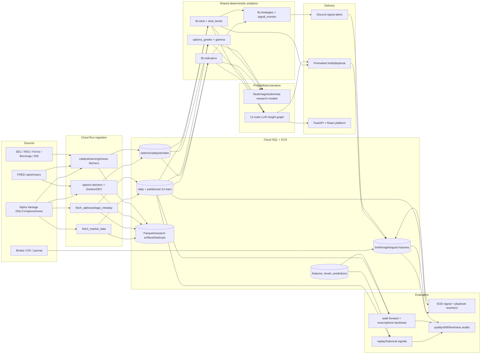
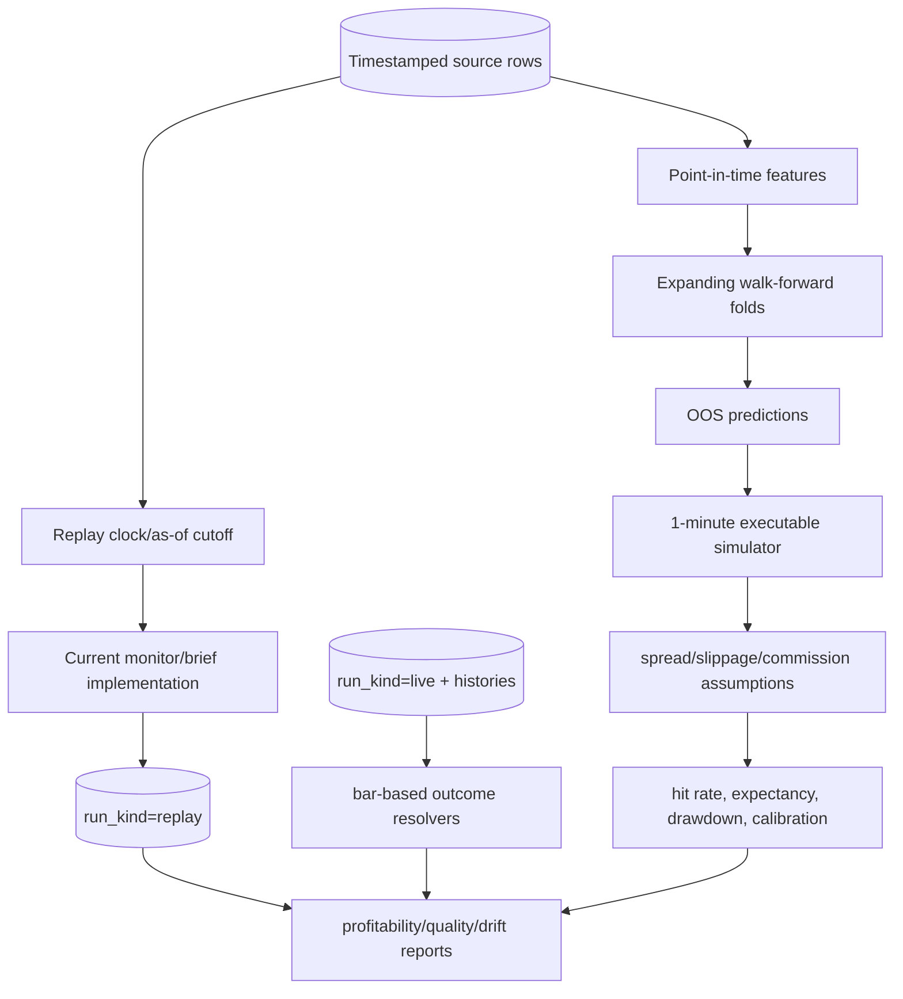

# Full Codebase Review — Stocks / Market Intelligence System

**Audit date:** 2026-08-27  
**Scope:** all 1,436 tracked files, including production Python/GCP jobs, shared libraries, SQL schema, React/FastAPI platform, research engines, scripts, tests, notebooks, archives, CI/deployment, and historical audit/design documents. Generated/vendor files under `platform/node_modules` were inventoried but not treated as application source.  
**Method:** repository-wide static tracing; targeted history review; reconciliation against the experiment registry and the 2026-08-25 profitability audit; full Python test suite; frontend unit/build/lint checks; no production writes, alerts, trades, or deployments. Production-result numbers below are evidence reported by the repository's production-query audits, not independently re-queried during this local review.

## 1. Executive Summary

### The 10 most important things to know

1. **The repository is not a trustworthy autonomous trading system today.** Its best-supported output is a deterministic, two-sided premarket level map; its live indicator alert book lost 5.4 percentage points over 740 June–August fires before costs, and its score did not rank outcomes (`weak` outperformed `perfect`).
2. **The strongest retained component is the premarket structural-level framework, but only under a strict execution assumption.** Backfilled results were positive each recorded month, yet essentially all of the measured edge disappears when entry moves from the touched trigger price to the trigger minute's close. This is evidence for resting orders, not for chasing alerts.
3. **Historical level computation had a proven off-by-one defect.** Filtering out the analysis day and then selecting `iloc[-2]` returned day-before-yesterday and analogous stale periods. The current brief path passes `analysis_date` and uses `< cutoff`, which fixes it; legacy callers that omit `analysis_date` deliberately retain the unsafe positional convention.
4. **Historical replay previously leaked future daily bars into LLM context.** A timezone comparison exception was swallowed and the unfiltered frame continued downstream. Current code handles the cutoff, but any replay evidence generated before PR #135 must be discarded or rerun.
5. **The premarket outcome resolver silently stopped producing labels for over two months.** It ran before nightly intraday ingestion, skipped every row, and exited successfully. It is now scheduled later, sweeps unresolved dates, and was backfilled, but this incident proves that job success is not equivalent to analytical success.
6. **The live signal engine is late relative to the useful level event.** Fires after T1 or after invalidation have negative forward returns; suppressing them was positive in a train/holdout split. The new level-state gate is correctly shadow-only pending live prospective confirmation.
7. **Most ML direction research is a well-documented negative result.** Direction classifiers failed exhaustive feature/target sweeps. The repository should retain these nulls and stop adding ordinary OHLCV/indicator features in the hope that an LLM or larger model will manufacture direction.
8. **The one claimed structural ML edge is not yet production-grade.** Breakout meta-labeling is net-positive robustly only for IWM 5-minute data, lacks a formal purge/embargo and latency/tick execution model, and is explicitly not shippable across tickers.
9. **The 11-node LLM pipeline is an expensive narrative layer, not a validated alpha engine.** July/August day-direction accuracy was approximately coin-flip; 89% of reports had low conviction. It receives structured deterministic inputs but can turn weak/conflicting evidence into polished trade plans. Its outputs are versioned by model route, but prompt/code/data versions are insufficient for exact reconstruction.
10. **Engineering quality is mixed: strong regression testing and substantial provenance improvements coexist with oversized modules, duplicated math, open-by-default API auth, schema-as-migration sprawl, and a deployment script that is itself an operational control plane.** These increase the chance that a correct research result and production behavior diverge.

**Overall system health:** **High Risk**  
**Analytical trustworthiness:** **Low** overall; **Moderate** for deterministic prior-period levels and Strat candle classification; **Unknown-to-low** for trade profitability.  
**Production readiness:** **Not ready** for automated recommendations or execution. It is usable as a research/decision-support platform with explicit caveats and alert gates kept in shadow mode.

## 2. Recommended Strategic Decision

## PAUSE AND VALIDATE

Pause new signal/model features. The repository contains valuable foundations—canonical OHLCV storage, point-in-time-aware level construction, a conservative executable backtest, structured history tables, and unusually candid negative research—but current production conclusions mix several incompatible generations of logic, execution conventions, and evaluation targets. The indicator engine has not demonstrated net value; prior replay and level bugs invalidate part of the historical record; and the apparent level edge is execution-sensitive.

This is not a recommendation to discard the repository. Retain the data platform, deterministic indicator/Strat primitives, level builder, provenance tables, replay clock, and conservative execution simulators. Freeze decision rules, reconstruct a point-in-time dataset, prospectively validate level orders and level-state gating, and only then decide which alert and LLM surfaces survive.

## 3. System Architecture

### Major components



### End-to-end market and signal flow

```mermaid
sequenceDiagram
  participant V as Vendors
  participant F as Fetchers
  participant DB as Cloud SQL
  participant B as Premarket brief
  participant M as Signal monitor
  participant L as LLM agents
  participant D as Discord/API
  participant R as Resolvers/replay
  V->>F: daily/intraday/options/catalyst payloads
  F->>DB: normalized upserts + source timestamps
  DB->>B: daily bars strictly before analysis_date
  B->>B: indicators, Strat/FTFC, previous levels, triggers/targets
  B->>DB: canonical row + append-only history
  B->>D: two-sided playbook/brief
  DB->>M: overlapping 1m windows + latest brief
  M->>M: rolling indicators, strategies, ORB, level-state, gates
  M->>DB: signal_alert + context
  M->>D: CALL/PUT fire and exits
  DB->>L: as-of context bundle
  L->>DB: model-routed report + history/cost
  L->>D: narrative insight/trade plan
  DB->>R: signal/brief + bars available by timestamp
  R->>DB: outcome labels; replay rows separated by run_kind/replay_id
```

### Evaluation and replay flow



### Representative workflow trace

| Stage | Current implementation | Important state/assumption transition |
|---|---|---|
| Daily origin | `gcp/fetchers/fetch_market_data.py` → `market_data_daily` | Vendor adjusted close is stored separately; most OHLC analytics use raw OHLC, so split handling must be tested around events. |
| Intraday origin | `gcp/fetchers/fetch_alphavantage_intraday.py` → ticker-partitioned `market_data_intraday` | `TIMESTAMPTZ` is canonical; callers must convert to Eastern before session logic. |
| Indicators | `lib/indicators.py`; legacy equivalents in `lib/trading_analysis.py` | Multiple naming conventions (`RSI14_W`, `RSI14`, `rsi_14`) and duplicate implementations create parity risk. |
| Previous levels | `lib/strat_levels.compute_previous_levels` | Safe only when `analysis_date` is supplied; period keys are strictly earlier than the analysis period. |
| Premarket brief | `gcp/premarket_brief.generate_premarket_brief` | Filters daily bars `< analysis_date`, calculates deterministic context, then constructs level-trigger assignments around yesterday's close. |
| Live signals | `gcp/signal_monitor.SignalMonitor` + `lib/strategies` | Overlapping polling windows require watermarks/deduplication; config gates may be off, shadow, or enforce. |
| LLM insight | `gcp/insight_pipeline_job` → `lib.agents.orchestrator` | Four analysts, bull/bear, judge, trader, three risk personas, portfolio manager transform the same structured evidence into prose/plan. |
| Persistence | `signal_alerts`, `premarket_analysis(_history)`, `insight_reports(_history)` | Canonical rows can be updated; history is better but still lacks complete code/data/prompt identity. |
| Outcome | `signal_monitor_eod_resolver.py`, `premarket_playbook_resolver.py` | Bar high/low establishes touches; same-bar ordering is unknowable and differs by simulator policy. |
| Replay/backtest | `scripts/replay_signal_monitor.py`, `lib/backtest.py`, `lib/exec_backtest`, `lib/options_exec_backtest` | Replays current code over old data; execution backtests are more conservative than outcome resolvers and are not equivalent evidence. |

## 4. What Is Working Well

- **Prior-period selection is now explicit and testable.** `analysis_date` yields strict previous-day/week/month/quarter/year aggregates and avoids dependence on whether an in-progress daily row exists.
- **Session timezone awareness is substantially better than the historical baseline.** ORB enrichment explicitly converts UTC timestamps to `America/New_York`; the monitor and tests include timezone/replay-clock coverage.
- **Missingness is increasingly treated as unknown, not zero.** Recent fixes preserve missing RVOL and unavailable gamma; schema comments and tests reinforce this contract.
- **The executable underlying backtest is conservative on ambiguous bars.** It uses the next predicted-bar window, gap-aware stop fills, stop-first same-minute collisions, and explicit costs. This is worth retaining as the minimum bar-data simulator.
- **Research records negative results rather than hiding them.** The registry distinguishes direction failure, magnitude/variance-risk failure, archived net-negative pipelines, and the narrow breakout-meta result.
- **Append-only histories and run-kind separation materially improve auditability.** Premarket and insight histories coexist with canonical rows; live and replay signal populations can be separated.
- **Testing is broad and correctness-oriented.** The suite includes historical level regressions, timezone cases, missingness, schema/query contracts, replay parity, signal gates, outcome resolvers, model routing, and frontend behavior—not merely snapshots.
- **Operational audits exist for freshness, drift, nullity, and failure notification.** These are the correct controls, although several still alert without failing the job.

## 5. Critical Findings

No presently active defect was proven to be **Critical** (immediate uncontrolled trading, destructive data loss, or exposed production secret) in this read-only audit. Two historical high-severity defects—future-bar replay leakage and the resolver outage—were severe enough to invalidate evidence, but current code contains targeted remediations. Their historical outputs remain invalid until rerun.

## 6. High-Priority Findings

### H1 — Live alert profitability and scoring are not validated

- **Finding:** The primary live indicator alert engine produced −5.4 percentage points across 740 June–August fires before costs, while score/strength did not rank results. Direction was not useful beyond roughly 30 minutes and the book was structurally long-biased.
- **Severity:** High
- **Category:** Quant / Correctness
- **Evidence:** `docs/audits/PROFITABILITY_REVIEW_2026-08-25.md` §§1, 6, 10–14; signal decisions in `gcp/signal_monitor.py`; scoring in `lib/strategies/momentum.py`, `mean_reversion.py`, and `agreement.py`.
- **Why it matters:** A system that cannot rank its own alerts and loses before friction cannot support sizing, confidence labels, or recommendations.
- **Confidence:** High for the recorded period; medium for future regimes.
- **Recommended action:** Keep all new gates shadow-only; freeze the current rule version; compare against no-signal, always-long/short, opening-drift, and level-only baselines prospectively.
- **Validation:** Minimum one untouched quarter plus rolling walk-forward evaluation by ticker, side, regime, and configuration generation; report net expectancy and drawdown, not only hit rate.

### H2 — Historical replay had proven future-data leakage

- **Finding:** Before PR #135, timezone-naive indexes compared with an aware cutoff raised an exception that was swallowed; processing continued on the full frame and supplied future bars to Strat and the LLM.
- **Severity:** High
- **Category:** Data / Correctness
- **Evidence:** `docs/changelog/CHANGELOG_2026-04-27_to_2026-05-03.md` documents impossible ARM replay levels and 5/7 contaminated cases; current cutoff paths are in `gcp/premarket_brief.py` and as-of summarizers.
- **Why it matters:** Replay is the evidence base for evaluating historical briefs and agent behavior. Future bars make entry zones and explanations look prescient.
- **Confidence:** High.
- **Recommended action:** Mark every pre-fix replay artifact invalid; regenerate from immutable snapshots using an assertion that maximum source timestamp is at or before the decision cutoff.
- **Validation:** Persist a per-section `max_source_ts`; fail replay if any exceeds `as_of`; rerun known ARM/AMD/CARS cases and randomized dates.

### H3 — Previous-period levels were historically off by one; unsafe fallback remains

- **Finding:** The old pipeline filtered today out and then selected the second-to-last grouped period, producing day-before-yesterday and stale higher-period levels. Current `analysis_date` behavior is correct, but callers omitting it still use the positional `iloc[-2]` convention.
- **Severity:** High
- **Category:** Quant / Correctness
- **Evidence:** `lib/strat_levels.py:compute_previous_levels`; regression case documented inline for QQQ 2026-05-06; `gcp/premarket_brief.py` supplies `analysis_date`; tests in `tests/test_strat_levels.py` and `tests/test_premarket_levels.py`.
- **Why it matters:** PDH/PDL/PWH and targets are direct trade inputs. A one-period shift changes triggers, room-to-run, LLM context, and outcome attribution.
- **Confidence:** High.
- **Recommended action:** Make `analysis_date` mandatory, delete the legacy fallback after enumerating callers, and version all rows created before the fix.
- **Validation:** Calendar-fixture truth tables covering Monday, month/quarter/year boundaries, holidays, half-days, and a frame both with and without an analysis-day row.

### H4 — The demonstrated level edge is fill-model dependent

- **Finding:** Stored playbook outcomes enter exactly at the touched trigger and hold to the deepest target hit. Repricing entry at the trigger bar close costs 0.255%/call and 0.306%/put, approximately the entire measured edge. Gaps through a trigger were also historically credited at impossible trigger fills.
- **Severity:** High
- **Category:** Quant
- **Evidence:** `docs/audits/PROFITABILITY_REVIEW_2026-08-25.md` §§8, 12, 15; `gcp/premarket_playbook_resolver.resolve_leg`; conservative gap logic exists separately in `lib/exec_backtest/engine.py`.
- **Why it matters:** This separates an actionable resting-stop strategy from a non-actionable alert/chase result. Reporting the former as general playbook profitability overstates usability.
- **Confidence:** High for bar-close stress; medium for actual stop-order fills without quote data.
- **Recommended action:** Re-evaluate levels in the executable engine with gap-at-open fills, spread/slippage, latency, order rejection, and one-position/capital constraints. Rename current resolver output to mechanical outcome rather than realized P&L.
- **Validation:** Prospective paper orders with broker timestamps and quotes; reconcile intended trigger, submitted time, fill, spread, and slippage.

### H5 — Evaluation mixes incompatible populations, generations, and objectives

- **Finding:** `signal_metrics` uses favorable excursion on the broad historical-signal population, while profitability uses live sent alerts and exit rules; May alone contains 1,716 fires from an older configuration and creates Simpson's-paradox conclusions. Replays execute current code, not the historical code/config that originally fired.
- **Severity:** High
- **Category:** Quant / Data
- **Evidence:** profitability audit §§4, 11, 12; `scripts/replay_signal_monitor.py`; `historical_signals`; `signal_alerts.run_kind` added after initial table creation.
- **Why it matters:** “89% clean” is neither directional accuracy nor profitability. Combining engine generations can reverse policy conclusions.
- **Confidence:** High.
- **Recommended action:** Define four separate metrics—forecast calibration, directional utility at frozen horizons, executable trade P&L, and narrative usefulness—and group every result by immutable strategy/config/code version.
- **Validation:** Reproduce every headline from a versioned cohort manifest; fail reports that aggregate unknown versions.

### H6 — Point-in-time reproducibility is incomplete

- **Finding:** Model route names and some resolver versions are persisted, but signal alerts lack a mandatory signal/config/code version; canonical market/features are upserted; insight histories do not capture prompt text/hash, summarizer version, exact source-row identities, or vendor revision. A past signal cannot always be reconstructed exactly.
- **Severity:** High
- **Category:** Data / Architecture
- **Evidence:** `gcp/schema.sql` definitions for `signal_alerts`, `premarket_analysis(_history)`, `insight_reports(_history)`; canonical `ON CONFLICT DO UPDATE` patterns in `gcp/database.py`, `gcp/insight_pipeline_job.py`, and `lib/strat_levels.persist_level_map`.
- **Why it matters:** Logic fixes mutate interpretation of stored fields, vendor revisions alter features, and current-code replay cannot prove what the original process knew.
- **Confidence:** High.
- **Recommended action:** Introduce a decision manifest with git SHA, image digest, config hash, signal version, prompt hashes, model/provider versions, source snapshot IDs/max timestamps, calendar version, and data-adjustment policy.
- **Validation:** Select any historical decision and reproduce its structured inputs and output byte-for-byte (LLM output excepted; preserve original request/response instead).

### H7 — Resolver success previously concealed total analytical failure

- **Finding:** From June 19 onward the playbook resolver ran before bars arrived, resolved zero rows, skipped all work, and exited 0. The later reschedule/sweep/backfill fixes the symptom.
- **Severity:** High
- **Category:** Operations / Data
- **Evidence:** profitability audit §§2 and 8; `gcp/premarket_playbook_resolver.py`; scheduler definitions in `gcp/deploy.sh`.
- **Why it matters:** Missing labels looked like healthy operations and blocked evaluation of the strongest component.
- **Confidence:** High.
- **Recommended action:** Add expected-count/data-watermark contracts to every analytical job; zero eligible work may be healthy, zero processed with eligible rows must fail.
- **Validation:** Integration test with delayed ingestion and scheduler-order test; alert on unresolved-age SLO.

### H8 — Open-by-default application authentication is unsafe outside a trusted perimeter

- **Finding:** `AUTH_MODE` defaults to `open`; middleware is a no-op for open/IAP modes, relying on deployment perimeter correctness. Historical platform audit also identifies a shared default watchlist across users.
- **Severity:** High if the service is publicly reachable; Medium if IAP/Cloud Run IAM is continuously enforced.
- **Category:** Security
- **Evidence:** `platform/api/auth.py`, `platform/api/routers/config.py`, `platform/api/main.py`; `docs/PLATFORM_AUDIT_2026-06-19.md`.
- **Why it matters:** Misconfigured deployment could expose market data, costly vendor proxy calls, insight refresh, and journal surfaces.
- **Confidence:** Medium because live IAM state was not queried.
- **Recommended action:** Fail closed in non-local environments; require explicit `AUTH_MODE`; add deployment-policy tests and per-user watchlists.
- **Validation:** Unauthenticated black-box tests against staging for every route and a deployment drift check for ingress/IAM/auth mode.

## 7. Medium/Low Findings

### M1 — Duplicate indicator implementations threaten parity

- **Finding:** RSI/ATR/VWAP/RVOL/ORB and historical levels exist in canonical `lib/indicators.py`, legacy `lib/trading_analysis.py`, fetcher enrichment, and research scripts, with differing column conventions and sometimes differing semantics.
- **Severity:** Medium
- **Category:** Maintainability / Quant
- **Evidence:** `lib/indicators.py`, `lib/trading_analysis.py`, `gcp/research/strat_engine/strat_enrich_levels.py`, `gcp/fetchers/backfill_daily_indicators.py`.
- **Why it matters:** Backtest/live mismatch can arise without a code error in either implementation; RVOL specifically differs by minute-of-day versus rolling windows/proxies.
- **Confidence:** High.
- **Recommended action:** Build a metric registry specifying formula, inputs, session, warm-up, timestamp availability, and canonical output names; deprecate duplicates.
- **Validation:** Golden-frame parity tests across every remaining implementation.

### M2 — Daily raw and adjusted prices have no enforced corporate-action policy

- **Finding:** `adjusted_close` is stored beside raw OHLC, while most indicators and levels consume raw OHLC; no schema constraint/version records adjustment policy.
- **Severity:** Medium
- **Category:** Data / Quant
- **Evidence:** `gcp/schema.sql:market_data_daily`; loaders/fetchers and indicator calls.
- **Why it matters:** Splits can create artificial gaps, levels, ATR, and returns if history changes or raw/adjusted series are mixed.
- **Confidence:** Medium; no specific contaminated production row was proven.
- **Recommended action:** Declare raw versus adjusted datasets explicitly and run split-event invariants.
- **Validation:** Fixture around known splits/dividends verifying continuous adjusted indicators and intentionally discontinuous raw execution prices.

### M3 — Market-calendar handling is uneven

- **Finding:** `pandas_market_calendars` is available and some freshness code is session-aware, but many workflows use weekdays, `np.busday_count`, fixed 09:30–16:00 assumptions, or date arithmetic. Half-day exits and exchange holidays are not uniformly modeled.
- **Severity:** Medium
- **Category:** Quant / Operations
- **Evidence:** `lib/strat_levels._trading_days_between`, resolver date loops, fixed session windows in signal/backtest modules.
- **Why it matters:** Holiday rows were left unresolved; time stops and EOD fills can cross nonexistent bars or misclassify stale data.
- **Confidence:** High for inconsistency; medium for material impact.
- **Recommended action:** One exchange-calendar service for valid sessions, opens, closes, early closes, and period boundaries.
- **Validation:** Juneteenth, Independence Day observance, Thanksgiving Friday, DST transitions, and year boundary fixtures.

### M4 — Same-minute event ordering remains unknowable in bar-based resolution

- **Finding:** Trigger, target, and stop may all fall inside one minute. The executable backtest conservatively assumes stop first, while the playbook resolver scans touches and can credit deepest targets under its documented convention.
- **Severity:** Medium
- **Category:** Quant
- **Evidence:** `lib/exec_backtest/engine.simulate_setup`; `gcp/premarket_playbook_resolver.resolve_leg`; `LegStateTracker` in `lib/strat_levels.py`.
- **Why it matters:** 64.8% of T1 touches occur in the trigger minute, so ordering is not rare.
- **Confidence:** High.
- **Recommended action:** Treat ambiguous bars as bounded outcomes (worst/best) unless tick/quote data resolves order.
- **Validation:** Report both bounds and the fraction of P&L dependent on ambiguous bars.

### M5 — LLM complexity is not justified by measured incremental value

- **Finding:** Eleven calls/personas transform a context bundle, but no ablation establishes that debate, judge, three risk personas, and portfolio manager outperform a deterministic template or single summarizer.
- **Severity:** Medium
- **Category:** ML / Architecture
- **Evidence:** `lib/agents/orchestrator.py`, prompt registry, cost tracking in `gcp/insight_pipeline_job.py`; production accuracy in profitability audit §3.
- **Why it matters:** Complexity increases cost, latency, contradictory narratives, and apparent confidence without proven decision benefit.
- **Confidence:** High that evidence is absent; low on whether a component might prove useful.
- **Recommended action:** Run blinded ablations and prohibit LLM-generated numeric levels/confidence outside supplied fields.
- **Validation:** Human-rated calibration/actionability plus prospective directional and no-trade precision versus deterministic and one-call baselines.

### M6 — Oversized modules and deploy script concentrate risk

- **Finding:** `premarket_brief.py` (~3.5K LOC), `signal_monitor.py` (~1.9K), `strat_levels.py` (~1.7K), `summarizers.py` (~1.6K), `schema.sql` (~3.8K), and `deploy.sh` are multi-responsibility control points.
- **Severity:** Medium
- **Category:** Architecture / Maintainability
- **Evidence:** file inventory and call traces.
- **Why it matters:** Analytical, persistence, formatting, and operational changes are coupled and difficult to review independently.
- **Confidence:** High.
- **Recommended action:** After baseline validation, separate pure domain computation from I/O, rendering, scheduling, and persistence without changing behavior.
- **Validation:** Characterization tests and replay parity before/after extraction.

### M7 — Schema management is idempotent but not a complete migration system

- **Finding:** One large `schema.sql` with repeated additive ALTERs converges many states but does not provide ordered versions, transactional downgrade/verification, or an authoritative deployed version.
- **Severity:** Medium
- **Category:** Data / Operations
- **Evidence:** `gcp/schema.sql`, `gcp/apply_schema.py`, query-specific migration files.
- **Why it matters:** Fresh and long-lived databases have historically diverged (for example the missing trades unique constraint).
- **Confidence:** High.
- **Recommended action:** Adopt numbered migrations and a schema-version table; keep schema contract integration tests.
- **Validation:** Build an empty DB and upgrade snapshots from representative historical versions.

### L1 — Repository/documentation surface is excessively large and contradictory

- **Finding:** 291 tracked docs plus archives, generated logs, old apps, notebooks, and multiple architecture/status documents obscure current truth.
- **Severity:** Low
- **Category:** Documentation / Maintainability
- **Evidence:** tracked-file inventory; `.github/workflows/logs.txt`; `archive/`, `docs/archive/`, `gcp/research/_archive/`.
- **Why it matters:** Historical claims can be mistaken for active behavior and inflate review cost.
- **Confidence:** High.
- **Recommended action:** Create a generated current-system index; mark docs with status/owner/last-verified SHA; remove tracked workflow logs and move immutable artifacts to release/object storage.
- **Validation:** Every production job/module links to exactly one current runbook and architecture entry.

## 8. Quantitative Methodology Assessment

### Calculation assessment

| Metric/family | Assessment | Session/temporal notes | Decision |
|---|---|---|---|
| PDH/PDL/PDC | Current explicit path mathematically correct: max/min/last close over dates `< analysis_date`; historical off-by-one fixed. | Safe in brief with `analysis_date`; unsafe legacy fallback remains. | KEEP, make cutoff mandatory. |
| PWH/PWL/PWC | Correct aggregation over prior `Period('W')`. | Week-ending-Sunday convention is suitable for US equities; test holiday weeks. | KEEP/RETEST boundaries. |
| PM/Q/Y HLC | Correct strict prior-period aggregation. | Raw-price corporate actions and insufficient history remain risks. | KEEP/RETEST. |
| Current opens | Code distinguishes current versus previous open depending on whether analysis-day row exists. | Premarket correctly cannot claim CDO. | KEEP. |
| Premarket H/L | Computed from supplied premarket bars with Eastern windows. | Vendor completeness and exact cutoff require provenance. | RETEST with timestamp assertions. |
| ORB 5/15/30 | Corrected to convert UTC to Eastern before 09:30 window. | ORB becomes available only after window completion; bar-close availability must be enforced. | KEEP with availability tests. |
| VWAP | Session-reset implementation exists, but duplicates remain. | Daily schema stores EOD VWAP, which must never be used intraday before close. | MERGE implementations; assert as-of. |
| EMA | Standard EWM implementation; warm-up/min-period differences across paths need parity. | Bar-close known. | KEEP. |
| RSI | Wilder-style canonical implementation; multiple names/implementations. | Bar-close known; missing should not default to neutral 50 in decision paths. | MERGE/RETEST. |
| ATR | True-range/Wilder family is mathematically conventional. | Daily ATR is prior-close dependent; intraday ATR units are inconsistently absolute vs percent. | KEEP with unit contract. |
| RVOL | Several concepts share one label: daily volume/20-day mean, minute-of-day RVOL, rolling recent volume, and historical proxy. | Historical decade result does not validate production gate. | REDESIGN naming; gate remains shadow. |
| Gaps | Deterministic raw-price gap levels exist. | Corporate actions and gap-through fills are material. | RETEST executable semantics. |
| Support/resistance | Structural previous-period and clustering logic is coherent; “order block” interpretation is heuristic, not proven institutional order flow. | Long-lived levels are filtered by ATR/% staleness. | KEEP structural; relabel/retest order blocks. |
| Trend/FTFC | Deterministic Strat classification is coherent; weights are documented placeholders. | Higher-timeframe predictions are shifted to bar close in research assembler. | KEEP classification; RETEST weights. |
| Signal scores/confidence | Conditions are understandable but score has no current rank-order value. | Configuration generations materially differ. | REDESIGN or remove confidence labels. |
| Outcome attribution | Signal resolver and playbook resolver are reproducible at 1-minute granularity. | Same-bar sequence and trigger-touch fills create optimistic bounds. | KEEP as mechanical labels, not realized P&L. |

### Leakage review

**Proven historical leaks/contamination**

1. Timezone exception caused future daily bars in replay/LLM context.
2. Source `prev_strat_candle` was contaminated; the research loader now ignores it and creates session-grouped lags.
3. Same-day VIX close entered intraday feature tables; current research uses prior-day VIX.
4. Higher-timeframe prediction timestamps originally represented bar open; current FTFC assembly shifts to bar close before as-of joins.
5. Previous-level positional filtering used the wrong period and contaminated downstream trigger comparisons (not classical future leakage, but a baseline-invalidating temporal defect).

**Current safeguards**

- Brief daily rows use strict `< analysis_date` filtering.
- Replay accepts an explicit as-of and rejects future cutoffs.
- Research labels/lags group by session so they do not cross overnight.
- Feature selection drops `fwd_*`/`next_*` label-derived columns.
- Execution simulations start in bar T+1 rather than filling on the prediction bar.

**Cannot yet be proven safe**

- Vendor records are mutable upserts without immutable observation timestamps/revisions.
- Current-code replay cannot reproduce historical code/config/prompt state.
- No formal purge/embargo exists around research folds; a t+1 label leaves boundary overlap.
- Some options research anchors constant IV and uses snapshot tolerances; it is a scenario model, not a tradable historical option-price backtest.
- Cache safety is asserted and tested for selected insight paths, but cache entries do not carry a complete source manifest.
- Daily EOD-derived fields (especially VWAP) require path-by-path proof that they are never read for an earlier intraday decision.

### Backtest/replay validity

- `lib/backtest.py` is a strategy backtest with filters and bar-derived exits; interpret it as rule behavior, not broker-realizable P&L unless routed through the execution simulator.
- `lib/exec_backtest` is the strongest simulator: next-bar entry, gap fills, explicit friction, conservative same-bar collision. It still lacks bid/ask, queue position, market impact, borrow, capital overlap, and broker latency.
- `lib/options_exec_backtest` prices options with BSM and entry-anchored constant IV. That isolates theta/delta effects but omits IV path, skew evolution, quote staleness beyond tolerance, discrete bid/ask liquidity, assignment, and realistic 0DTE spread dynamics. Results are model P&L, not historical executable option P&L.
- Playbook resolution is a labeler using trigger-touch fills and deepest-target convention. It must not be compared directly to stop-first execution results.
- `scripts/replay_signal_monitor.py` is useful for parity and prospective policy simulation, but it runs today's implementation. It is not historical-state replay without a versioned container/config/data snapshot.

### Metrics must remain distinct

| Question | Correct metric | Misleading substitute found in repository history |
|---|---|---|
| Was direction useful? | signed forward return/hit at fixed, declared horizon | favorable excursion at any point |
| Was probability calibrated? | OOS log loss/Brier/ECE and reliability plot | accuracy alone |
| Was a trade profitable? | executable net return with capital/friction | target touched or deepest target P&L |
| Was insight useful? | incremental decision quality versus baseline, no-trade precision, human/blinded assessment | polished narrative or agreement among agents |

## 9. Model / Agent Assessment

| Component | Purpose | Evidence of value | Problems | Recommendation |
|---|---|---|---|---|
| Deterministic Strat classifier | Candle 1/2U/2D/3 and combinations | Behavior-tested; structure is reproducible | Pattern usefulness is not equivalent to trade edge | **KEEP** |
| FTFC heuristic | Multi-timeframe directional continuity | Intuitive context; some tests | Weights are placeholders; current trade lift not isolated | **RETEST** |
| Strat TYPE LightGBM | Predict next candle shape | OOS log-loss/ECE gates reportedly pass after leakage audits | No direct profitability; artifacts/row counts not fully in repo | **KEEP** as research/context |
| Strat DIR models | Predict direction | Exhaustive clean-data sweep failed | Adds false precision | **REMOVE** from production; preserve negative research |
| Breakout meta-model | Decide whether structural breakout follows through | Gross pass; IWM 5m net +0.110R in 8/8 folds | Other cells net-fail; no purge/latency/L2; narrow ticker | **RETEST** |
| Magnitude engine | Predict move-size bucket | Structure/EXPLOSIVE lift exists | Options monetization fails variance-risk gate; raw gamma leakage was recently corrected | **RETEST** only for risk/context, not option buys |
| Direction-regime/gamma probes | Direction from gamma/regime | Documented null | Narrative theory did not translate to OOS direction | **REMOVE** from decision path |
| Archived P7 stacked/voter models | Return/next-candle pipeline | Historical research only | Net-negative, archived | **REMOVE** from active surfaces |
| Momentum heuristic | Intraday continuation/recovery alerts | Some short-horizon/current-era subsets | Overall live book negative; calls/puts asymmetric; score uncalibrated | **REDESIGN** |
| Mean reversion heuristic | Oversold/overbought reversals | Deterministic and interpretable | Overlaps momentum inputs; incremental lift unclear | **RETEST/MERGE** |
| Agreement engine | Boost coincident strategies | Very rare tagged cohort | “Agreement” may duplicate correlated indicator evidence | **RETEST** |
| Brief-bias scorer | Convert playbook/earnings signals to bias | Alignment predictive in a limited post-June cohort | Anti-predictive in May; sparse tags; nonstationary | **RETEST** |
| Market/Strat/options/catalyst analysts | Summarize four context domains | Structured outputs and failure isolation | No incremental-value ablation | **MERGE** to deterministic summary + optional one model |
| Bull/bear researchers + judge | Debate competing cases | May reduce one-sided prose | Three calls on same evidence; no measured lift | **RETEST**, likely **REMOVE/MERGE** |
| Trader | Produce entry/exit plan | Useful UI format | Can confer certainty on weak upstream evidence | **REDESIGN** to template supplied deterministic levels |
| Three risk personas + portfolio manager | Risk framing/final recommendation | Risk flags are potentially useful | Four more calls, no value evidence, confidence manufacture risk | **MERGE** into deterministic risk checks |
| LLM explanations | Plain-language explanation | Readability | Can obscure invalid inputs; output not outcome-evaluated | **KEEP** only as non-decision explanation |

## 10. Signal Assessment

| Signal | Current purpose | Reliability | Main issue | Evidence | Recommendation |
|---|---|---:|---|---|---|
| Previous-level trigger → targets | Two-sided premarket plan | Moderate under resting-fill assumption | Edge vanishes when chased; same-bar ambiguity | Profitability audit §§8,12,15 | **KEEP + RETEST prospectively** |
| Level-state gate | Avoid indicator fires after move is spent | Promising | Retrospective selection; new shadow gate | Train/holdout late-vs-early t-stat evidence | **RETEST shadow, then enforce if prospective pass** |
| Momentum CALL/PUT | Intraday alert | Low overall | Long bias, short horizon, config instability | −5.4 pct current window | **REDESIGN** |
| Mean reversion | Contrarian alert | Unknown | No isolated production attribution | Strategy modules/history | **RETEST** |
| Strength/total score | Rank confidence/size | Low | No monotonic outcome ranking | Weak/medium/strong/perfect all ~coin-flip | **REMOVE from sizing until recalibrated** |
| Brief alignment | Confirm alert direction | Regime-dependent | Sparse and anti-predictive in older generation | Profitability audit §§1,11 | **RETEST** |
| RVOL gate | Confirm participation | Low/generalization failed | Multiple RVOL definitions; decade proxy fails | Audit §§10,13,14 | **KEEP SHADOW; do not enforce** |
| ORB direction | Confirm open breakout | Unknown | Availability/session bugs existed; incremental value not isolated | ORB tests and prior NULL fix | **RETEST** |
| FTFC | Directional context/filter | Unknown | Placeholder weights | Registry/open items | **RETEST** |
| Strat candle/combo | Structural context | Moderate as classification | Trade validity varies by execution and gap mechanics | TYPE model/structural studies | **KEEP context** |
| Gamma/GEX regime | Options/context | Unknown for direction | Vendor sparsity and empirical nulls | Registry and gamma audits | **KEEP descriptive, remove directional claims** |
| AI day direction | Narrative daily long/short | Low | July/Aug coin-flip; long prior failed | Profitability audit §3/7 | **REMOVE recommendation language; RETEST as summary** |
| Earnings playability | Rank earnings setups | Unknown-to-moderate | Selection, options execution, and event-time semantics need independent replication | earnings reaction modules/docs | **RETEST** |

## 11. Historical Experiment Validity

### Historical issue reconciliation

| Historical issue | Original impact | Current status | Evidence | Experiments affected | Action |
|---|---|---|---|---|---|
| Previous-level `iloc[-2]` after filtering today | Stale PDH/PWH/etc.; synthetic unreachable triggers | Fixed in explicit `analysis_date` path; fallback remains | `compute_previous_levels` doc/regression | Brief/playbook replays before fix; any level study using legacy caller | **RERUN** affected rows; remove fallback |
| Replay timezone cutoff exception swallowed | Future bars entered LLM/Strat replay | Fixed | PR #135 changelog/current as-of paths | Pre-fix replay insight evaluations | **DISCARD** old artifacts; rerun |
| Source `prev_strat_candle` contaminated | Cross-session/incorrect lags | Loader creates session-aware shifts | Strat architecture/leak audit | Early TYPE/DIR runs before loader guard | **RERUN** unless artifact proves fixed loader |
| Same-day VIX close in intraday features | Future EOD volatility information | Shifted to prior day and backfilled | Strat architecture | Early Strat model artifacts | **RERUN/DISCARD** unidentified versions |
| Higher-TF timestamp at bar open | In-progress higher-TF feature leakage | Shifted by TF duration | FTFC assembler docs/tests | Early multi-TF/FTFC results | **RERUN** |
| ORB computed in UTC wall clock | ORB columns mostly NULL | Converted to Eastern | `strat_enrich_levels` | Models trained on old ORB tables | **RERUN** if ORB claimed value |
| Resolver scheduled before intraday ingestion | Missing outcomes June 19–Aug | Rescheduled, swept, backfilled | Profitability audit §8 | Initial “no evidence” brief conclusions | **REINTERPRET** using backfill |
| Impossible gap-through trigger fills | Inflated level P&L | Diagnosed, not fully changed in resolver | Audit §§12,15 | All mechanical level profitability | **RERUN** in exec engine |
| Raw gamma price levels as magnitude features | Scale/ticker leakage and unstable feature | Replaced with normalized balance distance | commits `68f10c5`, `409a759` | Prior magnitude results using raw levels | **RERUN** |
| NULL gamma silently treated as available | Misleading GEX context | Recent never-null/unavailable fixes | recent commits/tests | Earlier gamma-dependent outputs | **REINTERPRET/RERUN** |
| May engine generation dominates aggregate exits | Simpson's paradox | Diagnosed, not a code defect | Profitability audit §12 | Fixed-30 headline | **DISCARD aggregate conclusion** |

### Experiment verdicts

**KEEP**

- Deterministic Strat classification and the clean-data TYPE result as a **structure** forecast, not a trading signal.
- Negative direction research: it is valuable evidence to stop feature proliferation.
- Magnitude's descriptive “explosive move” classification for risk/attention, separated from option-buy profitability.
- Conservative executable backtest machinery and null baselines.

**REINTERPRET**

- Premarket level profits as a resting-order mechanical upper bound, not generic alert profitability.
- “Clean hit” as favorable excursion quality, not accuracy or profit.
- Strat next-bar edge as largely gap-mechanical trigger-break information, not standalone close-to-close alpha.
- AI insight June accuracy as regime-specific, not persistent model skill.

**RERUN**

- Every experiment whose artifact cannot prove post-fix VIX, lag, ORB, level, gamma, and feature-builder versions.
- Breakout meta with purge/embargo, shifted cutoffs, latency, quotes, and predeclared ticker/timeframe scope.
- Level playbook in the executable simulator and prospective paper brokerage.
- FTFC/ORB/agreement/brief-alignment incremental ablations.

**DISCARD**

- Any pre-PR-#135 historical replay/LLM evaluation.
- Archived P7 net-negative trading conclusions as production candidates (retain code only as provenance until archival export).
- Direction-model positive narratives contradicted by the exhaustive clean-data null.
- Fixed-30 “universal improvement” aggregate driven by May.
- Options profitability claims based solely on constant-IV BSM rather than executable historical quotes.

## 12. Architecture / Technical Debt

1. **Two systems coexist:** an older monolithic analysis stack (`trade_analysis_pipeline.py`, `lib/trading_analysis.py`, legacy scripts) and newer shared strategies/Cloud jobs. Historical backfill still references legacy analysis, so it is not merely dead code.
2. **Pure math is coupled to rendering and persistence:** the brief builds indicators, calls models, prints diagnostics, creates Discord payloads, and writes multiple tables in one module.
3. **Configuration is fragmented:** dataclasses, JSON, environment variables, DB calibration tables, command arguments, and deploy-script flags can all alter behavior. There is no single immutable resolved-config record per decision.
4. **Schema and deployment are code generators/control planes:** giant SQL and shell files are difficult to diff semantically and easy to drift from production.
5. **Error policy is inconsistent:** many broad exceptions are legitimate top-level/vendor boundaries, but some return defaults or continue. The historical replay and resolver incidents demonstrate the cost of swallowing analytical failures.
6. **Caches/upserts favor current usability over forensic reproducibility:** good for operations, insufficient for point-in-time science.
7. **Research and production share code beneficially but also mutate the baseline:** replaying current functions can silently rewrite the meaning of an old experiment.

## 13. Test Coverage and Validation Gaps

### Inventory and strengths

- 238 tracked test files across Python integration/unit tests, Vitest component/util tests, and Playwright E2E suites.
- Strong regression areas: level off-by-one cases, premarket freshness, monitor timezone/replay clock, RVOL missingness, gamma nullability, strategy parity, resolver outcomes, schema/query contracts, agent routing/schema, journal tenancy, and frontend date/session helpers.
- CI runs Python unit tests, a heavy ML subset, and ephemeral-Postgres integration tests.

### Highest-value missing tests

1. **Decision-manifest invariant:** every persisted alert/brief/insight must identify code/config/data/prompt versions.
2. **Universal as-of property test:** randomly choose a decision time and assert no selected row/feature has an availability timestamp after it.
3. **Market calendar matrix:** holidays, early closes, DST, Monday/week/month/quarter/year boundaries, and missing sessions.
4. **Corporate-action fixtures:** raw versus adjusted OHLC around splits/dividends.
5. **Cross-path golden parity:** live, replay, historical backfill, and research feature builder must produce identical indicators for the same frozen bars.
6. **Ambiguous-bar bounds:** quantify same-minute trigger/stop/target sensitivity.
7. **Executable level strategy integration:** gap-through, spread, slippage, latency, concurrent legs, and capital constraints.
8. **Prospective model registry checks:** no artifact can be promoted without fold definitions, purge policy, feature hash, training cutoff, and evaluation artifact.
9. **Operational semantic success:** a job with eligible unresolved rows and zero processed must fail.
10. **LLM ablation/evaluation:** deterministic versus one-agent versus full graph, blinded and frozen.

### Test interpretation caveats

- Extensive mocked tests validate contracts but cannot prove vendor timestamps, Cloud Scheduler order, IAM, live DB indexes, or broker execution.
- Many tests pin current implementation details; additional behavioral truth tables are needed around temporal availability.
- E2E cloud tests are environment-dependent and were not run locally because they target deployed/authenticated services.

### Commands and observed results

| Command | Result |
|---|---|
| `pytest -q` | **4,008 passed, 82 skipped, 11 setup errors, 264 warnings**. All 11 errors are `tests/test_e2e.py` browser cases and share one environmental cause: the Playwright Chromium executable is not installed. Warnings include four `earnings_options_analytics/test_system.py` functions that return booleans instead of asserting, timezone-naive datetime deprecations, pandas warnings, and a 200-occurrence `SettingWithCopyWarning` in the dashboard router. |
| `pytest -q --ignore=tests/test_e2e.py` | **4,008 passed, 82 skipped, 264 warnings.** This distinguishes the passing Python application suite from the missing-browser limitation. |
| `npm test -- --run` | **27 files / 253 tests passed.** |
| `npm run build` | **Passed**; Vite warned that at least one output chunk exceeds 500 kB. |
| `npm run lint` | **Failed: 31 errors, 11 warnings.** Dominant errors are `react-refresh/only-export-components` and synchronous state updates in effects; warnings include hook dependencies and TanStack Table compiler incompatibility. |
| `git diff --check` | **Passed.** |

## 14. Documentation Drift

| Document/surface | Drift | Action |
|---|---|---|
| `ARCHITECTURE.md` | Last refreshed May 22 and cites 42 jobs/49 schedules; deploy file has evolved substantially | Regenerate from deploy/schema/import graph; label verified SHA |
| `docs/GCP_IMPLEMENTATION_STATUS.md` | Useful change log but mixes shipped, pending rollout, and historical state | Split current inventory from chronology |
| `docs/PLATFORM_AUDIT_2026-06-19.md` | Valuable baseline; some findings fixed, others (watchlist/auth) remain | Add status reconciliation, then archive as dated evidence |
| `BACKTEST_RESULTS.md` and result docs | Metrics risk being read without execution-generation/data-epoch context | Add mandatory experiment manifest headers |
| `docs/EXPERIMENT_REGISTRY.md` | Best research ledger, candid but manually maintained and artifact paths sometimes unknown | Keep; generate validations from model registry/artifacts |
| `docs/archive/*` | Correctly archived but still highly discoverable and sometimes asserts obsolete completion | Add prominent obsolete banner/index |
| `gcp/research/_archive/*` | Code is marked archived and net-negative | Move to a separately test-excluded historical package after artifact preservation |
| `.github/workflows/logs.txt` | Committed runtime log, not source | Delete after this audit phase |

## 15. Dead / Duplicate / Legacy Components

| Component | Evidence | Used by | Recommendation |
|---|---|---|---|
| `lib/trading_analysis.py` | Legacy ~1.7K LOC, duplicates indicators and ORB | Historical signal generation/lineage | **MERGE then REMOVE**; cannot delete yet |
| `trade_analysis_pipeline.py` | ~2.9K LOC older orchestration | Scripts/notebooks/legacy workflows | **ISOLATE**, map callers, retire |
| `scripts/fetch_market_data.py` vs GCP fetcher | Parallel ingestion entry points | Local/legacy paths | **MERGE** contracts |
| `scripts/fetch_alphavantage_intraday.py` vs GCP fetcher | Duplicate key rotation/fetch logic | Local/legacy paths | **MERGE** |
| `lib/insights.py` | Template backtest narrative, name overlaps AI insights | Report generator | **RENAME** to avoid architectural confusion |
| `gcp/research/_archive/p7*` | README/status says archived; net-negative | Historical provenance only | **ARCHIVE externally**, remove active imports/tests |
| `archive/old-apps/options-heatseeker` | Static old application and data snapshots | None in current app graph | **REMOVE from main repo** after preservation |
| `earnings_options_analytics/` | Standalone Streamlit subsystem with separate requirements/docs | Manual analytics | **RETEST ownership/value**, merge or separate repo |
| Google Apps Script surface | Large separate legacy UI/automation corpus | Deployment uncertain from current GCP architecture | **INVENTORY live use**, archive if inactive |
| Notebooks | Outputs/logic not necessarily reproducible | Manual research | **KEEP only with environment/data manifest** |

## 16. Risk Register

| Risk | Probability | Impact | Severity | Mitigation |
|---|---:|---:|---|---|
| Historical evidence contains unknown pre-fix artifacts | High | High | High | Version manifest; rerun or discard |
| Level profitability disappears under actual fills | High | High | High | Prospective resting-order paper execution |
| Live alert engine remains net-negative | High | High | High | Freeze, shadow gates, baseline comparison |
| Future leakage reappears in an un-audited query/cache | Medium | High | High | Universal availability timestamp assertions |
| Config generation mixing reverses conclusions | High | High | High | Mandatory config/code cohorting |
| Auth misconfiguration exposes API | Medium | High | High | Fail-closed auth and drift checks |
| Corporate action corrupts levels/returns | Medium | High | Medium | Adjustment policy and event tests |
| Scheduler reports success with no analytical output | Medium | High | High | Expected-work SLO and failure contract |
| LLM amplifies weak/contradictory signals | High | Medium | Medium | Deterministic plan template; no recommendation language |
| Same-minute ambiguity inflates outcomes | High | Medium | Medium | Worst/best bounds or tick data |
| Vendor/API gaps silently reduce coverage | Medium | Medium | Medium | Typed unavailable states and completeness gates |
| Schema drift breaks persistence | Medium | Medium | Medium | Ordered migrations and ephemeral upgrade tests |
| Documentation causes obsolete behavior to be revived | High | Medium | Medium | Current-state index and doc lifecycle labels |

## 17. Prioritized Remediation Roadmap

### P0 — Validate before doing anything else

1. Freeze current production signal, prompt, config, and model routes; begin writing a complete decision manifest.
2. Build an artifact ledger mapping every historical headline to code SHA, data epoch, feature hash, and known bug exposure. Quarantine unknown artifacts.
3. Rerun all pre-fix replay/level/VIX/ORB/gamma experiments from immutable point-in-time snapshots.
4. Reprice the level playbook in `exec_backtest` semantics and start prospective broker-paper resting orders; report fill rate and slippage.
5. Separate and publish four dashboards: forecast, direction, executable P&L, and insight usefulness.

### P1 — Correctness

1. Make `analysis_date`/as-of mandatory for all temporal calculations and queries.
2. Centralize exchange calendar and market-session boundaries.
3. Establish adjusted/raw price policy and corporate-action tests.
4. Bound ambiguous 1-minute outcomes; remove “realized P&L” language from mechanical resolvers.
5. Add semantic-success assertions to every scheduled job.
6. Fail closed on application authentication outside local development.

### P2 — Architecture

1. Create pure domain packages for calendar, indicators, levels, signals, execution, and provenance.
2. Collapse duplicate indicator/fetcher paths behind canonical interfaces.
3. Replace schema sprawl with ordered migrations.
4. Split brief/monitor modules into compute, persistence, render, and transport layers.
5. Generate architecture/job/table lineage from code rather than hand-maintaining counts.

### P3 — Model / Signal Improvements

Only after P0/P1:

1. Prospectively validate level-state suppression.
2. Re-run breakout-meta with purged folds and executable latency/quote assumptions.
3. Validate PUT asymmetric exits under a frozen current generation.
4. Ablate FTFC, ORB, agreement, and brief alignment individually.
5. Collapse the LLM graph unless incremental value clears a predeclared threshold.

### P4 — Cleanup

1. Remove tracked logs and externalize old app/data snapshots.
2. Archive net-negative research code after manifests/artifacts are preserved.
3. Rename ambiguous modules and standardize column names/units.
4. Add ownership/status headers to docs and notebooks.

## 18. Proposed Experiments

### E1 — Are premarket levels executable?

- **Hypothesis:** Resting stop orders at prior-period triggers retain positive net expectancy after realistic fills.
- **Required data:** Published-before-open plans, order submission acknowledgements, NBBO/quotes, fills/rejections, 1-minute/tick tape, commissions.
- **Control/baseline:** No trade; trigger-minute close chase; random matched price levels; simple PDH/PDL-only rules.
- **Methodology:** Prospective paper brokerage, both legs armed with declared OCO/capital policy; no retrospective plan changes.
- **Success metric:** Positive net expectancy with bootstrap CI above zero, controlled drawdown, and fill rate high enough to be operationally useful.
- **Failure criterion:** CI includes materially negative expectancy, or edge exists only at unfillable trigger prices.
- **Sample size:** Target ≥300 triggered legs and ≥60 independent sessions; cluster inference by day.
- **Leakage prevention:** Persist plan and hash before open; immutable order log.
- **Decision:** KEEP if executable; MODIFY if only a narrow ticker/side; REMOVE profitability claim if not.

### E2 — Does level-state gating add incremental value?

- **Hypothesis:** Suppressing `post_t1`/`invalidated` fires improves net outcomes over the frozen engine.
- **Data:** Prospective shadow tags and all would-fire events.
- **Control:** Frozen engine alerts; report both sent and suppressed counterfactuals.
- **Method:** Pre-register gate and horizon, stratify by ticker/side/time; day-clustered inference.
- **Success:** Positive paired improvement with CI above zero and no concentration in one ticker/week.
- **Failure:** Effect reverses or is fully explained by price extension/time of day.
- **Sample size:** ≥200 late-state and ≥200 early-state fires, preferably one quarter.
- **Leakage prevention:** Do not retune state definitions during test.
- **Decision:** KEEP/enforce, MODIFY, or REMOVE gate.

### E3 — Does PUT fixed-horizon exit generalize?

- **Hypothesis:** PUTs benefit from a 30-minute hold while CALLs retain target/stop exits.
- **Data/control:** Frozen live fires; current exit versus counterfactual 30-minute PUT exit.
- **Method:** Paired per-fire analysis, execution friction, regime/ticker stratification.
- **Success:** Positive PUT delta with predeclared downside/drawdown limits in two consecutive out-of-sample windows.
- **Failure:** Benefit depends on May-like generation or one volatility regime.
- **Sample size:** ≥200 PUT fires; current book may require a longer window.
- **Leakage prevention:** Fixed horizon and no subset mining.
- **Decision:** KEEP asymmetric exit, MODIFY horizon, or REMOVE.

### E4 — Breakout meta-model executable edge

- **Hypothesis:** IWM 5m meta-label improves take/skip expectancy after costs and latency.
- **Data:** Immutable feature snapshots, tick/quote or 1m conservative bars, model artifacts.
- **Control:** Take every structural breakout and simple deterministic filters.
- **Method:** Purged/embargoed walk-forward, cutoff perturbations, nested tuning, realistic decision delay and gap fills.
- **Success:** Net positive in most folds, stable calibration, meaningful lift over rule baseline, untouched final holdout.
- **Failure:** Edge disappears with 1-bar delay/costs or is ticker-period concentrated.
- **Sample size:** Effective independent breakout events, not raw overlapping bars; report day clusters.
- **Leakage prevention:** Frozen features and artifact hashes; labels never overlap training boundary.
- **Decision:** KEEP narrow deployment, MODIFY, or REMOVE.

### E5 — Does the 11-agent graph add value?

- **Hypothesis:** Full debate improves calibrated no-trade/direction decisions over deterministic and single-model summaries.
- **Data:** Frozen context bundles and later outcomes; blinded human ratings.
- **Control:** Deterministic template; single LLM; four-analyst summary without debate/personas.
- **Method:** Randomized blinded evaluation on identical bundles, fixed prompts/models, prospective holdout.
- **Success:** Statistically meaningful lift in calibration/actionability large enough to justify cost/latency; no hallucinated levels.
- **Failure:** Equivalent/worse performance or only stylistic preference.
- **Sample size:** ≥300 ticker-days across regimes; paired ratings and outcomes.
- **Leakage prevention:** Context cutoff manifest and sealed outcomes.
- **Decision:** KEEP, MERGE, or REMOVE nodes.

### E6 — Incremental signal-family ablation

- **Hypothesis:** At least one of momentum, mean reversion, ORB, FTFC, agreement, or brief alignment adds unique information.
- **Data:** Versioned would-fire matrix on all eligible bars, including non-fires.
- **Control:** Time/ticker/regime base rates and level-only policy.
- **Method:** Walk-forward ablation with one family added at a time; multiple-testing correction; net execution metric.
- **Success:** Stable incremental net expectancy/calibration across tickers and folds.
- **Failure:** Lift disappears after correlated families are controlled.
- **Sample size:** Power analysis using day-clustered effect variance; do not count repeated bars as independent.
- **Leakage prevention:** Predeclare families and success thresholds.
- **Decision:** KEEP, MERGE correlated families, or REMOVE.

### E7 — Earnings playability and options translation

- **Hypothesis:** Earnings reaction ranking improves underlying and option outcomes over event baselines.
- **Data:** Point-in-time earnings calendars, announcement timing, historical quotes/IV/skew, delistings/universe history.
- **Control:** All reporters, sector/size matched, implied-move baseline.
- **Method:** Event-time walk-forward by report timestamp; executable option quotes and abstention.
- **Success:** Net lift after spread with stable calibration and sufficient coverage.
- **Failure:** Relationship is selection/survivorship artifact or priced by IV.
- **Sample size:** Several hundred independent events across years; ticker-clustered errors.
- **Leakage prevention:** Calendar revisions and BMO/AMC timing frozen as observed.
- **Decision:** KEEP/MODIFY/REMOVE.

## 19. What I Would Do Next

### Next 24 hours

1. Freeze feature work and declare all existing recommendations “research/decision support, not validated trading advice.”
2. Add an experiment/artifact quarantine list for pre-PR-#135 replay, old previous-level logic, same-day VIX, UTC ORB, raw-gamma magnitude features, and unknown model versions.
3. Export current resolved configuration/model routes/job schedules/schema version read-only and store the manifest.
4. Start prospective paper capture for published levels and shadow gates; do not alter rules.
5. Personally review `lib/strat_levels.py`, `gcp/premarket_brief.py`, `gcp/signal_monitor.py`, resolver code, and the profitability audit.

### Next 7 days

1. Implement the reproducibility manifest and universal as-of assertions in a separate approved remediation phase.
2. Build one golden point-in-time fixture spanning a holiday, early close, DST shift, month/quarter boundary, and split.
3. Run the level plan through conservative executable semantics; publish sensitivity to gap, spread, slippage, and same-bar ordering.
4. Produce version-separated live-alert results and remove uncalibrated confidence/position sizing from user-facing language.
5. Run the deterministic/single-agent/full-agent ablation design offline on sealed historical bundles.

### Next 30 days

1. Accumulate untouched prospective level and level-state results.
2. Complete purged breakout-meta rerun and PUT-exit validation.
3. Decide component-by-component: retain deterministic level/Strat core; enforce only validated gates; collapse or remove non-incremental signal and agent layers.
4. Begin structural extraction only after golden parity tests exist.
5. Replace the manual schema/deploy provenance gap with ordered migrations and generated job/data lineage.

---

## Appendix A — Production-active versus experimental/obsolete

**Production-active by deploy/import evidence:** GCP daily/intraday/options/catalyst fetchers; Cloud SQL/GCS helpers; premarket and earnings briefs; signal monitor and EOD resolver; playbook resolver; insight pipeline/push; Discord interactions; FastAPI/React platform; freshness/drift/failure audits; historical-signal/replay and backtest jobs.

**Research-active but not established decision engines:** Strat TYPE/direction/magnitude/breakout research, combo mining, calibration sweeps, phase analysis scripts, options execution simulations.

**Explicitly archived/legacy:** P7 research archive, old options-heatseeker app, documents under `docs/archive`, old monolithic analysis paths (still partially called, so “legacy” does not yet mean deletable), disabled GitHub ingestion workflow.

## Appendix B — Safe validation performed

- `git ls-files` and repository-wide `rg`/`find` inventories covered tracked source, docs, tests, jobs, schema, notebooks, archive, CI, and deployment surfaces.
- `git log`/`git show` were used selectively for previous-level, gamma, level-state, scheduling, persistence, and profitability changes.
- `pytest -q` exercised the complete local Python suite (environment-dependent integration cases skip themselves).
- Frontend checks used `npm test`, `npm run build`, and `npm run lint` from `platform/`.
- No production database query, vendor mutation, alert delivery, live trade, deploy, or destructive API was executed.
