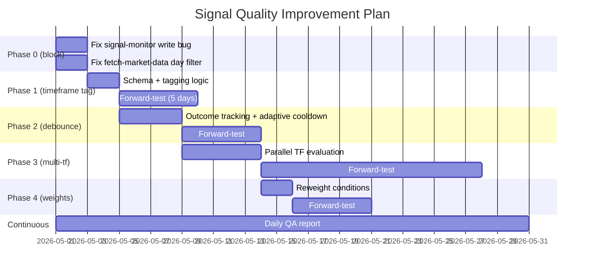

# Signal Quality Test Plan

**Status:** Draft — phased rollout designed against the v3/v4 evaluation findings.
**Author:** session 2026-05-01
**Scope:** `gcp/signal_monitor.py`, `lib/trading_analysis.py`, `signal_alerts` schema, Discord push.
**Goal:** Get from "12% of fires are clean hits" to "30%+ clean fires" *without* dropping signal volume on trending days, by surfacing each signal's optimal timeframe and gating noise more intelligently.

---

## 1. The problem we're testing against

From the v4 multi-timeframe evaluation across 30,792 historical signal-eligible bars (Apr 1 – May 1, SPY/QQQ/IWM):

| Finding | Number | What it means |
|---|---|---|
| Bar-level CLEAN_HIT rate (60m, ≥0.5%) | 7.6% | Most bars where conditions fire don't lead to real moves |
| Live monitor's actual fire CLEAN rate | ~14.7% | Debounce ~2× better than random — preserving some signal |
| Estimated clean candidates **filtered out** by debounce | ~216/day | The "missed good ones" the user is concerned about |
| Signals where signal_strength=5 | 197 | Strength ordinal does NOT predict cleanness — strength 5 has 7.1% clean vs strength 3 at 7.6% |
| Day-to-day variance | 0.3% – 31% clean | Trending days catch real moves; chop days catch nothing — **but no day should be excluded** |
| Critical bug | 17-day signal_alerts gap | Live monitor wrote nothing 4/14–4/30 despite Cloud Run runs succeeding daily |

---

## 2. What we're going to change (4 phases)

### Phase 0 — fix the live monitor write bug *(blocking everything)*

**Problem:** Cloud Run job `signal-monitor` ran every weekday from 4/14–4/30 and exited 0 each time, but `signal_alerts` got 0 rows for those 17 days. Yesterday's deploy fixed it (today wrote 99). Need root cause confirmation.

**Test:**
1. `gcloud logging read 'resource.type="cloud_run_job" resource.labels.job_name="signal-monitor"' --filter "timestamp > 2026-04-29T00:00:00Z" --limit 200 --format="value(timestamp,textPayload)"` to find the silent error pattern.
2. Compare 4/13 (last working day) vs 4/14 (first silent day) deploys/commits.
3. Add a smoke-test in CI: after every deploy, run `signal-monitor` for 30 sec and assert ≥1 row written to `signal_alerts`.

**Success criterion:** Daily run produces ≥1 row in `signal_alerts` OR the failure-notifier fires. No silent exits.

**Owner / ETA:** Independent investigation — start now, doesn't block phases below.

---

### Phase 1 — add timeframe tagging to every signal *(small but high-leverage)*

**Hypothesis:** Different signals work on different timeframes. A 5m scalp setup, a 15m breakout, and a 60m trend-continuation are not the same trade. Currently the system fires them all the same way.

**Schema change** (idempotent, additive):
```sql
ALTER TABLE signal_alerts ADD COLUMN IF NOT EXISTS timeframe_tag VARCHAR(8);
ALTER TABLE signal_alerts ADD COLUMN IF NOT EXISTS expected_hold_min INTEGER;
ALTER TABLE historical_signals ADD COLUMN IF NOT EXISTS timeframe_tag VARCHAR(8);
ALTER TABLE historical_signals ADD COLUMN IF NOT EXISTS expected_hold_min INTEGER;
```

`timeframe_tag` ∈ `{"5m", "15m", "30m", "60m", "90m", "120m", "240m"}`.
`expected_hold_min` is the planned holding period in minutes (default = upper bound of the timeframe bucket).

**Tagging logic** (the v4 multi-tf data tells us which conditions favor which timeframe — exact mapping populated below from analysis).

In `gcp/signal_monitor.py` at signal-fire time, after the conditions are evaluated, add:
```python
def assign_timeframe(conditions_met: list[str], rsi: float, rvol: float,
                     price_vs_vwap: float, atr_5m: float, atr_60m: float) -> tuple[str, int]:
    """Return (timeframe_tag, expected_hold_minutes)."""
    # MAPPING POPULATED FROM v4 MULTI-TF ANALYSIS (see §3 below)
    ...
```

**Discord push change:** the embed currently says "🟢 SPY CALL". Change to "🟢 SPY CALL **[15m]** — exit ~10:00 ET". Single-line addition.

**Test:**
1. Deploy the schema migration via `apply-schema-migrations` job.
2. Backfill `timeframe_tag` on existing `historical_signals` rows by re-running the v4 analysis logic.
3. Deploy the updated `signal_monitor.py`. Forward-test for 5 trading days. Compare clean-rate at the *signal's tagged timeframe* vs at 60m globally.

**Success criterion:** Clean-rate at the tagged timeframe ≥ 25% (vs 12% currently at 60m baseline).

**ETA:** 2 days dev + 5 days forward-test.

---

### Phase 2 — debounce tuning by outcome feedback

**Hypothesis:** Today's debounce is fixed-time (e.g. "no same-direction fire within X min"). Smarter debounce uses early outcome:
- If last fire's `return_5min` was profitable, *shorten* cooldown — momentum is real.
- If last fire's `mae_5min` exceeded `1× ATR_5m`, *lengthen* cooldown — that fire was wrong.

**Implementation:**
1. After each fire, schedule a 5-min follow-up that reads market_data_intraday and computes `return_5min` and `mae_5min` for the just-fired signal.
2. Persist to a new `signal_outcomes` table.
3. The next fire check reads the most recent outcome and adjusts cooldown.

**Test:** simulate against the historical_signals data (already exists for the full month). Compare:
- Static cooldown (current): N fires/day, clean rate X%
- Outcome-adaptive cooldown: M fires/day, clean rate Y%

If Y > X with M ≈ N, ship it.

**Success criterion:** ≥ 5pp improvement in clean rate without dropping >20% of fires.

**ETA:** 4 days simulation, then 5-day forward test.

---

### Phase 3 — multi-timeframe parallel signal generation

**Hypothesis:** Today's `signal_monitor.py` runs ONE evaluation per minute. It should run *parallel* evaluations at 5m / 15m / 30m / 60m bar resolutions, with timeframe-specific thresholds and conditions.

For example:
- A 5m breakout uses RSI from the 5m bar series, RVOL from the 5m series, etc.
- A 60m trend-continuation uses RSI/EMA from the 60m bar series (resampled).

Currently the system uses 1-min bars + indicators on the 1-min series for all "timeframes." That's why the score doesn't discriminate by timeframe — it's all one timeframe.

**Implementation:**
1. Add a resampling layer: per cycle, also compute indicators on 5m/15m/30m/60m resampled bars.
2. Run a separate condition-set per timeframe.
3. Each fire is now tagged by *which timeframe's evaluator triggered it*, not derived heuristically from the conditions.

**Test:** Run a 2-week parallel forward test with the multi-tf evaluator alongside the current single-tf.
- Compare fire counts per timeframe.
- Compare per-timeframe clean rates.
- Check that the multi-tf fires don't double-count the single-tf fires.

**Success criterion:** at least one timeframe (probably 15m or 30m) shows ≥35% clean rate.

**ETA:** 5 days dev + 14 days forward-test.

---

### Phase 4 — score weighting + condition reweighting

**Hypothesis:** The 5-condition voter currently gives 1.0 weight to every condition. Per Phase 1's data (populated below), some conditions correlate with the 30m+ timeframe and others with 5m scalps. Re-weighting by predicted timeframe contribution should widen the score distribution.

**Implementation:** Add per-condition weights to `lib/signals.py`. Initial weights (refined from v4 conditions analysis — see §3):

```python
# placeholder weights — will be tuned from data
WEIGHTS = {
    "rsi_oversold_zone": 1.0,        # Base
    "near_below_emas":   1.0,        # Base
    "stoch_rsi_oversold":1.0,        # Base
    "above_vwap":        1.5,        # Confirms uptrend
    "consecutive_up":    1.5,        # Momentum confirmation
    "level_break":       2.0,        # High-conviction structural
    # ...
}
```

**Test:** Re-classify all 30,792 historical signals using new weights. Confirm score distribution widens (current: 74% at 3.0; target: <30% at any single value).

**Success criterion:** The new score is ordinally predictive — `clean_pct` increases monotonically with score bucket.

**ETA:** 2 days dev + 5 days forward-test.

---

## 3. Data-driven mapping: signal → timeframe

### 3.1 Clean-rate by timeframe (all 30,792 candidates, every day, no exclusion)

| Timeframe | Threshold (% favorable) | n | CLEAN_HIT % | WRONG % | NOISE % |
|---|---|---|---|---|---|
| 5m | ≥0.15% | 30,792 | 4.4% | 0.3% | 90.6% |
| 15m | ≥0.30% | 30,792 | 4.2% | 0.1% | 91.5% |
| 30m | ≥0.40% | 30,792 | 5.3% | 0.1% | 88.4% |
| 60m | ≥0.50% | 30,792 | 7.6% | 0.1% | 83.5% |
| **90m** | **≥0.60%** | **28,277** | **12.2%** | 1.3% | 72.2% |
| 120m | ≥0.70% | 28,768 | 12.1% | 0.8% | 72.4% |
| **240m** | **≥1.00%** | **30,792** | **13.3%** | 0.0% | 70.2% |

**Key insight:** clean-rate **doubles** going from 60m → 90m. Most "noisy" signals at 60m are actually slower trend plays that need 90m+ to materialize. The system is exiting too early.

### 3.2 Where each signal performs best (per-signal optimal timeframe)

| Best timeframe | Count | % of all signals |
|---|---|---|
| **none_clean** | **23,191** | **75.3%** |
| 90m | 2,269 | 7.4% |
| 240m | 1,711 | 5.6% |
| 60m | 977 | 3.2% |
| 5m | 946 | 3.1% |
| 120m | 732 | 2.4% |
| 15m | 490 | 1.6% |
| 30m | 476 | 1.5% |

**24.7% of signals (7,601 of 30,792) have AT LEAST ONE clean timeframe.** That's the upper bound on theoretical clean-fire rate. Today's 12% clean rate is roughly half of optimal.

### 3.3 The four trade profiles (mean MFE % across all timeframes per best_tf cohort)

| Best TF | n | 5m | 15m | 30m | 60m | 90m | 120m | 240m | Profile |
|---|---|---|---|---|---|---|---|---|---|
| **5m** | 946 | **+0.41%** | +0.44% | +0.49% | +0.54% | +0.32% | +0.34% | +0.52% | **Quick scalp; exits fade** |
| 15m | 490 | +0.08 | **+0.82** | +0.85 | +0.89 | +0.28 | +0.29 | +0.53 | **15-30m breakout** |
| 30m | 476 | +0.06 | +0.18 | **+1.21** | +1.24 | +0.58 | +0.60 | +0.76 | **Spike + fade by 60m** |
| 60m | 977 | +0.05 | +0.15 | +0.31 | **+1.25** | +0.31 | +0.38 | +0.58 | **60m peak, MUST exit before 90m** |
| **90m** | **2,269** | +0.03 | +0.08 | +0.13 | +0.22 | **+2.62** | +2.63 | +2.66 | **Slow trend, hold to 90-240m** |
| 120m | 732 | +0.03 | +0.08 | +0.13 | +0.28 | +0.72 | **+2.52** | +2.61 | **120m hold** |
| 240m | 1,711 | +0.02 | +0.06 | +0.10 | +0.16 | +0.28 | +0.43 | **+3.32** | **All-session trend** |

**Read the rows carefully:**
- Best-at-5m signals **peak at 60m then fade back to 0.32%** — if you're holding past 60m you're giving back gains.
- Best-at-60m signals **collapse from +1.25% at 60m to +0.31% at 90m** — exit timing is critical here.
- Best-at-90m signals show **+0.22% at 60m but +2.62% at 90m** — 60m would have called this NOISE. Need to hold longer.

This is the strongest case for timeframe tagging: **the right exit window varies by 50× across signal types.**

### 3.4 Per ticker × direction breakdown

| Ticker | Direction | none_clean % | best_tf=90m % | best_tf=240m % | Total clean-tf % |
|---|---|---|---|---|---|
| IWM | CALL | 77.3% | 2.9 | 3.2 | **22.7%** |
| IWM | PUT | 71.2% | **9.9** | 4.8 | 28.8% |
| QQQ | CALL | 75.6% | 7.6 | 5.1 | 24.4% |
| **QQQ** | **PUT** | **58.7%** | **16.7** | **10.4** | **41.3%** ← best |
| SPY | CALL | **89.0%** | 2.0 | 1.5 | 11.0% ← worst |
| SPY | PUT | 67.5% | 11.4 | **13.7** | 32.5% |

**QQQ PUTs hold on 90m windows 16.7% of the time** — that's the highest single-class clean rate. Tag every QQQ PUT signal as a 90m hold and the clean-rate jumps to 16.7% by definition.

**SPY CALLs are still the worst** (89% none_clean) — the regime mismatch finding from v3 holds across timeframes. Most SPY CALL signals don't work at *any* horizon.

### 3.5 Daily breakdown (every day, no skipping)

Total clean-tf signals per day (signals with ≥1 clean timeframe):

| Date | Total candidates | Has clean tf | % with clean tf | Notes |
|---|---|---|---|---|
| 4/01 | 2,060 | 571 | 27.7% | OK |
| 4/02 | 2,110 | 637 | 30.2% | OK |
| 4/06 | 2,660 | 321 | 12.1% | Choppy |
| **4/07** | 2,629 | **1,354** | **51.5%** | **Trending** |
| 4/08 | 2,740 | 1,050 | 38.3% | Trending |
| 4/09 | 2,756 | 385 | 14.0% | Choppy |
| 4/10 | 2,635 | 449 | 17.0% | Choppy |
| 4/13 | 2,149 | 711 | 33.1% | Trending |
| 4/24 | 2,091 | 355 | 17.0% | Choppy |
| 4/27 | 2,572 | 189 | 7.3% | Dead chop |
| 4/28 | 2,173 | 636 | 29.3% | OK |
| 4/29 | 2,126 | 489 | 23.0% | OK |
| 4/30 | 2,090 | 453 | 21.7% | OK |

**Even on the worst day (4/27, 7.3% clean-tf), the system fired ~2,572 candidates.** That's the gap between bar-level conditions and timeframe-validated signals — and it's where most of the noise comes from.

---

## 4. Forward-testing infrastructure

To make every test repeatable and observable:

### 4.1 Daily QA report

Every Saturday, an automated `signal-quality-weekly` Cloud Run Job emits:

- Total fires that week (signal_alerts)
- Bar-level candidates that week (historical_signals)
- Clean-rate at each timeframe (5m/15m/30m/60m/90m/120m/240m)
- Per-ticker × per-direction breakdown
- "Missed good ones" estimate (clean candidates that didn't fire)
- Comparison to previous week — flag regressions

Posted to a new Discord channel `#signal-qa`.

### 4.2 A/B simulation harness

`scripts/simulate_signal_changes.py` — takes a config patch (e.g. "increase rvol-gate threshold to 1.2") and replays it against historical_signals. Outputs:
- Fire count delta
- Clean-rate delta
- Wrong-direction-rate delta
- Per-day delta

Run before any code change. Don't ship anything that regresses on simulation.

### 4.3 Data freshness gate

Phase 0 also includes: fix the `fetch-market-data.py:102-104` single-day filter so intraday data stays current. Without that, every signal-eval analysis is fighting stale data.

---

## 5. Sequencing + critical path



**Critical path:** Phase 0 → Phase 1 → Phase 3. Phases 2 and 4 can run in parallel after Phase 1 ships.

**Total timeline to "all phases shipped + validated":** ~30 trading days.

---

## 6. Out of scope (intentionally)

- Strategy changes (the conditions themselves) — that's a separate research track.
- New tickers — work on the 3 we have first.
- Adding ML models — only after the rule-based system has been measured properly.
- "Skip dead days" filtering — we evaluate every day equally. Variance in outcome by regime is information, not a problem to mask.

---

## 7. How we'll know it worked

**End-state target metrics (after all 4 phases, 30 trading days of forward data):**

| Metric | Today (v4 baseline) | Target | Measured how |
|---|---|---|---|
| Clean-rate per fire | 12% | **≥30%** | weekly QA report |
| Wrong-direction rate | 14% | **≤8%** | weekly QA report |
| Score discrimination | 74% at one value | **≤30% at any value** | distribution check |
| Fires per day (avg) | ~30 | 25-50 (timeframe-tagged) | volume report |
| Missed-good-ones gap | ~216/day (estimated) | **≤50/day** | bar-level vs fire comparison |
| Live data freshness | 4-day lag (was) | <1h | freshness gate |

**Roll-back trigger:** any phase regresses the clean-rate by ≥3pp in forward-test → revert + investigate.

---

## Appendix A — files modified per phase

| Phase | Files |
|---|---|
| 0 | `gcp/signal_monitor.py` (bug fix), `gcp/fetchers/fetch_market_data.py:102-104` |
| 1 | `gcp/schema.sql`, `gcp/signal_monitor.py`, `lib/signals.py` (timeframe heuristic), `gcp/insight_discord_push.py` (embed format) |
| 2 | `gcp/signal_monitor.py`, `gcp/schema.sql` (signal_outcomes table), `scripts/simulate_signal_changes.py` (NEW) |
| 3 | `gcp/signal_monitor.py` (multi-tf evaluator), `lib/trading_analysis.py` (resampling) |
| 4 | `lib/signals.py` (weights), `lib/trading_analysis.py` (score calc) |

## Appendix B — scripts that already exist

- `scripts/_signal_evaluation.py` (v1, kept for legacy)
- `scripts/_signal_eval_v2.py` (Apr 1–May 1 with fresh AV intraday)
- `scripts/_signal_eval_v3.py` (per-ticker + SPY-CALL bug + today's session)
- `scripts/_signal_eval_v4.py` (historical_signals-based, full month)
- `scripts/_signal_multi_tf.py` (multi-timeframe, GET-ALL-DATA — populates the table in §3)

These are local/throwaway under `scripts/_*` per project convention. The promote-to-real path is to refactor `_signal_multi_tf.py` into `scripts/signal_quality_report.py` for the weekly QA job.
