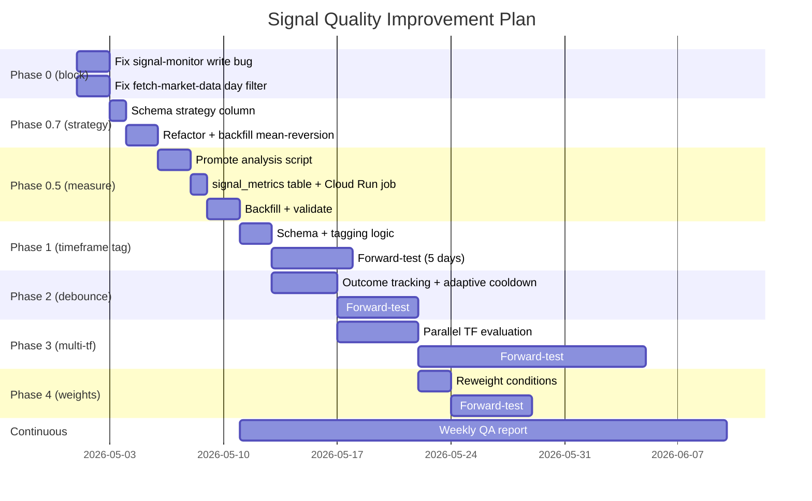

# Signal Quality Test Plan

**Status:** Draft — phased rollout designed against the v3/v4 evaluation findings.
**Author:** session 2026-05-01
**Scope:** `gcp/signal_monitor.py`, `lib/trading_analysis.py`, `signal_alerts` schema, Discord push.
**Goal:** Get from "12% of fires are clean hits" to "30%+ clean fires" *without* dropping signal volume on trending days, by surfacing each signal's optimal timeframe and gating noise more intelligently.

---

## 1. The problem we're testing against

From the v4 multi-timeframe evaluation across 30,792 historical signal-eligible bars (Apr 1 – May 1, SPY/QQQ/IWM):

| Finding | Number | What it means |
|---|---|---|
| Bar-level CLEAN_HIT rate (60m, ≥0.5%) | 7.6% | Most bars where conditions fire don't lead to real moves |
| Live monitor's actual fire CLEAN rate | ~14.7% | Debounce ~2× better than random — preserving some signal |
| Estimated clean candidates **filtered out** by debounce | ~216/day | The "missed good ones" the user is concerned about |
| Signals where signal_strength=5 | 197 | Strength ordinal does NOT predict cleanness — strength 5 has 7.1% clean vs strength 3 at 7.6% |
| Day-to-day variance | 0.3% – 31% clean | Trending days catch real moves; chop days catch nothing — **but no day should be excluded** |
| Critical bug | 17-day signal_alerts gap | Live monitor wrote nothing 4/14–4/30 despite Cloud Run runs succeeding daily |

---

## 2. What we're going to change (4 phases)

### Phase 0 — fix the live monitor write bug *(blocking everything)*

**Problem:** Cloud Run job `signal-monitor` ran every weekday from 4/14–4/30 and exited 0 each time, but `signal_alerts` got 0 rows for those 17 days. Yesterday's deploy fixed it (today wrote 99). Need root cause confirmation.

**Test:**
1. `gcloud logging read 'resource.type="cloud_run_job" resource.labels.job_name="signal-monitor"' --filter "timestamp > 2026-04-29T00:00:00Z" --limit 200 --format="value(timestamp,textPayload)"` to find the silent error pattern.
2. Compare 4/13 (last working day) vs 4/14 (first silent day) deploys/commits.
3. Add a smoke-test in CI: after every deploy, run `signal-monitor` for 30 sec and assert ≥1 row written to `signal_alerts`.

**Success criterion:** Daily run produces ≥1 row in `signal_alerts` OR the failure-notifier fires. No silent exits.

**Owner / ETA:** Independent investigation — start now, doesn't block phases below.

---

### Phase 0.8 — production refactor: lib/strategies/ package *(precedes Phase 0.7)*

**Why this had to land in the plan (5/1 audit finding):** the two signal generators sit in different files with different output schemas. A local script bug today (calling a non-existent `MarketAnalyzer.analyze_market_data` method) silently masked momentum's true fire count for 90 minutes of analysis — the try/except swallowed an `AttributeError` and reported "0 momentum signals." The dual-strategy reality demands a clean, typed, testable separation so this class of error becomes impossible.

**Today's verified state:**

| File | Lines | Strategy | Used by | Output schema | Issue |
|---|---|---|---|---|---|
| `lib/signals.py` | 234 | Mean-reversion only | `gcp/signal_monitor.py` (live) | dict / DataFrame, `conditions_met` = JSON list | OK |
| `lib/trading_analysis.py:677-985` | ~310 | Indicators **mixed with** momentum signals | `scripts/run_historical_signals.py` (nightly) | DataFrame, `conditions_met` = `"3/5"` string | indicators + signals coupled in one class |

**Production refactor target:**

```
lib/
├── indicators.py                         # already exists, unchanged
├── strategies/                           # NEW package
│   ├── __init__.py                       # public API: get_strategy(), MOMENTUM, MEAN_REVERSION
│   ├── base.py                           # Signal dataclass + Strategy ABC
│   ├── momentum.py                       # extracted from trading_analysis.py:799-985
│   ├── mean_reversion.py                 # extracted from signals.py
│   └── tests/
│       ├── test_momentum.py
│       ├── test_mean_reversion.py
│       └── test_parity.py                # asserts both strategies share schema
└── trading_analysis.py                   # KEEPS only indicator code; signal-gen DEPRECATED
                                          # back-compat shim that imports from lib.strategies
```

**Common interface (`lib/strategies/base.py`):**

```python
from dataclasses import dataclass, field
from typing import Literal, Optional
import pandas as pd

@dataclass
class Signal:
    """Unified signal output across all strategies."""
    strategy: Literal["momentum", "mean_reversion"]
    direction: Literal["CALL", "PUT"]
    timestamp: pd.Timestamp
    entry_price: float
    base_score: float           # raw count of conditions met
    weighted_score: float       # weighted (Phase 4 tunes)
    conditions_met: list[str]   # canonical, JSON-serializable
    rsi: Optional[float] = None
    rvol: Optional[float] = None
    atr_5m_pct: Optional[float] = None
    extras: dict = field(default_factory=dict)

class Strategy:
    """Abstract base for signal-generation strategies."""
    name: str

    def evaluate(self, row: pd.Series) -> Optional[Signal]:
        raise NotImplementedError

    def generate_signals(self, enriched_df: pd.DataFrame) -> list[Signal]:
        out = []
        for _, row in enriched_df.iterrows():
            sig = self.evaluate(row)
            if sig is not None:
                out.append(sig)
        return out
```

**Public API (`lib/strategies/__init__.py`):**

```python
from .momentum import MomentumStrategy
from .mean_reversion import MeanReversionStrategy

MOMENTUM = MomentumStrategy()
MEAN_REVERSION = MeanReversionStrategy()
ALL = [MOMENTUM, MEAN_REVERSION]

def get_strategy(name: str) -> Strategy:
    return {"momentum": MOMENTUM, "mean_reversion": MEAN_REVERSION}[name]
```

**Caller updates (mechanical):**

| Caller | Was | Becomes |
|---|---|---|
| `gcp/signal_monitor.py` | `from lib.signals import evaluate_signal` | `from lib.strategies import get_strategy; get_strategy("mean_reversion").evaluate(row)` |
| `scripts/run_historical_signals.py` | `analyzer.generate_technical_signals(enriched)` | `get_strategy(args.strategy).generate_signals(enriched)` (the `--strategy` flag is what Phase 0.7 added) |
| `lib/signals.py` | full implementation | back-compat shim re-exporting `MeanReversionStrategy().evaluate`; deprecated |

**Schema unification:** both strategies write JSON-list `conditions_met`. Migration on `historical_signals` re-runs the strategy against existing bars to derive the canonical list from the original `"3/5"` strings.

**Parallel-strategy guarantee:** strategies are stateless and thread-safe. The Phase 3 multi-timeframe evaluator becomes "run all (strategy × timeframe) pairs in parallel" trivially — each instance is independent. Neither strategy restricts the other; both can fire on the same bar with opposite directions (today proved this happens 78.6% of the time when both fire).

**Tests added:**

1. `tests/test_strategy_interface.py` — instantiate both, evaluate the same fixture row, assert schema parity (same field names, same types, JSON-serializable)
2. `tests/test_momentum_conditions.py` — table-driven: 20 hand-crafted bars, expected condition outputs (catches accidental logic changes)
3. `tests/test_mean_reversion_conditions.py` — same pattern
4. `tests/test_strategy_isolation.py` — neither strategy mutates the input DataFrame, neither modifies global state, both are thread-safe (matters for Phase 3)
5. `tests/test_strategy_legacy_parity.py` — diff `MomentumStrategy().generate_signals(enriched)` vs the old `MarketAnalyzer.generate_technical_signals(enriched)` on a fixed week of bars; row-for-row equivalence required (modulo schema migration)

**Live parity validation:** deploy refactored code to a staging Cloud Run revision, run for 1 trading day, assert `signal_alerts` rows match what the prod (old) revision wrote on the same minute. Differences > 0 = revert.

**Success criterion:** all 5 test paths green, no behavior change in live `signal_alerts` output, unified schema across both tables.

**ETA:** 3 days dev + 1 day staging validation. **Blocks Phase 0.7** (which now lands as data inside the new structure).

---

### Phase 0.7 — strategy reconciliation *(blocks all measurement)*

**Problem discovered 2026-05-01:** the codebase has TWO completely different signal generators with **opposite CALL logic**:

| | `lib/signals.py:check_call_conditions()` | `lib/trading_analysis.py:799-836` |
|---|---|---|
| Used by | live `signal_monitor.py` → `signal_alerts` | nightly `historical-signals-watchlist` → `historical_signals` |
| CALL logic | **Mean-reversion** (consec_DOWN, below VWAP, below EMAs, RSI oversold) | **Momentum** (consec_UP, above VWAP, above EMA9, RSI bullish range) |
| `conditions_met` format | JSON array `["consecutive_down", "rsi_oversold_zone", ...]` | String `"3/5"` |

The §3 multi-timeframe findings were generated against `historical_signals` — i.e. the **momentum** strategy. They do NOT describe the live mean-reversion fires you see in Discord. The plan and §3 mappings are still useful but only for the momentum strategy; mean-reversion needs its own measurement.

**Decision: Option B — keep both as parallel strategies, measure each side-by-side.**

**What gets built:**

1. **Schema:** add a `strategy` column to `historical_signals`:
   ```sql
   ALTER TABLE historical_signals ADD COLUMN IF NOT EXISTS strategy
       VARCHAR(16) NOT NULL DEFAULT 'momentum'
       CHECK (strategy IN ('momentum', 'mean_reversion'));
   CREATE INDEX IF NOT EXISTS idx_historical_signals_strategy
       ON historical_signals (strategy, entry_time DESC);
   ```
   Existing rows backfill as `'momentum'` (current behavior).
2. **Refactor `scripts/run_historical_signals.py`** to accept `--strategy {momentum,mean_reversion}`:
   - `momentum` → uses existing `MarketAnalyzer` path (status quo)
   - `mean_reversion` → calls `lib.signals.evaluate_signal()` against the same indicator-enriched bars; writes rows with `strategy='mean_reversion'`.
3. **Backfill mean-reversion** for SPY/QQQ/IWM × 2026-04-01 → present, `--force` (rebuild from scratch).
4. **Update `signal_metrics`** (Phase 0.5's table) to carry `strategy` so the per-timeframe classifications track per strategy.
5. **Weekly QA report** (§4.1) shows side-by-side: momentum clean-rate vs mean-reversion clean-rate at every timeframe, per-(ticker, direction).
6. **Live `signal_monitor.py` stays mean-reversion.** No live behavior change.
7. **Discord embed update** (small): when a signal fires, show its strategy tag — e.g. "🟢 SPY CALL [mean_reversion / 90m]".

**Test:**

1. Apply schema migration via `apply-schema-migrations`.
2. Run `python scripts/run_historical_signals.py --symbol SPY --strategy mean_reversion --start-date 2026-04-01 --end-date 2026-05-02 --force` (and similarly for QQQ/IWM).
3. Confirm both strategies' rows coexist in `historical_signals` for the same dates with different signal-eligibility patterns.
4. Re-run the multi-tf analyzer (Phase 0.5's `signal_quality_report.py`) with `--strategy mean_reversion` filter. Compare to existing momentum results.
5. Update §3 in this plan with side-by-side tables.

**Success criterion:** both strategies have ≥ 4 weeks of rows in `historical_signals`, side-by-side multi-tf comparison published, and the §3.4 per-(ticker, direction) table now has TWO rows per class — one per strategy.

**ETA:** 2 days dev (schema + refactor + backfill) + 1 day analysis update.

---

### Phase 0.7.1 — momentum condition fixes *(after Phase 0.8 refactor; data-driven from 5/1 audit)*

**Findings from the 5/1 morning audit + correlation analysis** (computed against 273 morning bars, all 3 tickers combined):

| Momentum CALL condition | Fire rate | Issue |
|---|---|---|
| `consec_up_3plus` | 15.4% | OK; the differentiator. But strict |
| `rsi_bull_zone` (25 < RSI < 50) | 37.4% | **NEGATIVELY correlated** with `above_vwap` (-0.51) and `above_ema9` (-0.50) — internally inconsistent |
| `stoch_not_overbought` (StochRSI < 80) | 72.2% | **Free score** — fires almost always |
| `above_vwap` | **82.1%** | **Almost always true** during uptrends — captures regime, not setup |
| `above_ema9` | 56.4% | Mid; correlated 0.40 with `above_vwap` |

**Mean-reversion's `near_below_ema` fires on 84.6% of bars** — same "free score" pathology on the other side.

**The score-doesn't-discriminate problem is NOT pure correlation.** It's three separate pathologies:

1. **"Free score" conditions** (>80% fire rate) — `above_vwap` for momentum, `near_below_ema` for mean-reversion. They contribute to score regardless of setup quality.
2. **Internal contradictions** — momentum's `rsi_bull_zone` (-0.51 with `above_vwap`) means "RSI in bullish range" is anti-correlated with "above VWAP." When one fires the other doesn't. They shouldn't both be in the same score.
3. **Strict threshold on the differentiator** — `consec_up_3plus` is the rare/discriminating condition (15% fire rate) but the all-or-nothing 3-bar streak excludes legitimate trends with 1-bar pullbacks.

**Concrete fixes (in priority order):**

| # | Fix | Expected effect | Cost |
|---|---|---|---|
| 1 | Replace `consec_up_3plus` with `consec_up_3of5` (3 of last 5 bars up) | Catches trends with single-bar pullbacks. ~1.5× more setup opportunities, similar quality. | 5 LOC in `lib/strategies/momentum.py` |
| 2 | Drop `stoch_not_overbought` from CALL conditions (72% true; pure noise to score) | Tighter score distribution. Mean score drops from 3.0 to ~2.7; the modal "3.0 = passes everything" disappears. | 3 LOC |
| 3 | Replace `rsi_bull_zone` (25-50) with `rsi_thrust` (RSI rising AND in 30-70 band) | Removes the internal contradiction. The new condition agrees with `above_vwap` instead of fighting it. | 8 LOC |
| 4 | **Add** `rvol_above_recent` — ticker-specific threshold from §3.4: SPY > 1.0, QQQ > 1.2, IWM > median × 1.3 | Distinguishes trend on volume from drift on no flow. Per-ticker per Phase 0.7.1's RVOL audit. | 12 LOC + per-ticker config |
| 5 | **Add** `atr_expansion_5m` — current 5-min ATR > 1.3× rolling 30-bar median ATR | Filters chop. Big leverage for the SPY CALL fix (today SPY was in chop, ATR was contracting). | 10 LOC |
| 6 | **Add** `level_break_pdh` (already computed in indicators) at +2 weight | Highest-conviction momentum signal currently unused. | 5 LOC |
| 7 | Symmetric fixes 1-3 for PUT side | mirror | trivial |

**De-correlated scoring: Tier the conditions, don't sum them.**

Instead of 5 binary conditions summed (which leaks score on free-rate conditions), use weighted tiers:

```python
# Tier 1 (1.0 weight) — required-for-fire setup conditions:
#   consec_up_3of5  +  rsi_thrust   (need both)
# Tier 2 (1.5 weight) — confirmation:
#   rvol_above_recent  OR  atr_expansion_5m  (any one)
# Tier 3 (2.0 weight) — high-conviction add-on:
#   level_break_pdh
# Position context (0.0 weight, recorded but not scored):
#   above_vwap, above_ema9 (record for analysis, don't score)

base_score   = 1.0 (consec_up_3of5) + 1.0 (rsi_thrust)         # 2.0 baseline if Tier 1 met
weighted     = base + 1.5*tier2_count + 2.0*tier3_count
fire_if      = weighted >= 3.0  AND  Tier 1 fully met
```

This produces a score range 2.0–6.5 with monotonic predictive power: the higher the score, the more confirmation conditions stacked. Phase 4 (reweighting) becomes a tuning exercise on these weights, not the source-of-truth refactor.

**Tests added:**

1. `tests/test_momentum_conditions_v2.py` — 20 fixtures, expected scores under the new weighted scheme
2. Re-run the 5/1 morning audit and the full Apr-May simulation against the new conditions; expected results captured in `data/momentum_v2_baseline.csv`
3. The simulation harness from §4.2 runs the v2 conditions vs current; Phase 0.5 weekly QA report adds a "v2 candidate" column

**Success criterion:** on the historical Apr-May data, the new score distribution shows monotonic clean-rate by score bucket (currently flat), AND the 60m clean-rate at score >= 4 is ≥ 25% (vs 7.6% today across all momentum signals).

**Symmetric Phase 0.7.2 — mean-reversion condition fixes:**

| # | Fix |
|---|---|
| 1 | Drop `near_below_ema` (84.6% fire rate — free score) |
| 2 | Replace single `rsi_oversold_zone` (25-50) with `rsi_thrust_down` (RSI falling AND in 30-70) |
| 3 | Add `rvol_above_recent` (ticker-specific) |
| 4 | Add `atr_expansion_5m` |
| 5 | Tier the conditions same way as momentum |

**ETA (combined 0.7.1 + 0.7.2):** 4 days dev + 3 days backtest validation.

---

### Phase 0.5 — productionize the analysis pipeline itself *(must precede Phases 1-4 measurement)*

**Problem:** the multi-timeframe analysis we just ran (`scripts/_signal_multi_tf.py`) is a throwaway. It reads creds from a temp directory, writes to a CSV, and only runs when someone types the command. Without productionizing it first, every later phase will be impossible to *measure* — we'd be tuning blind.

**What gets built:**

1. **Promote the script** — `scripts/_signal_multi_tf.py` → `scripts/signal_quality_report.py` with these productionization gates:
   - Reads creds from Secret Manager (drop the `.creds_tmp/` local-dev shim).
   - Drops the parquet read for 90/120/240m extension; queries `market_data_intraday` directly. *(Requires Phase 0's fetcher bug fix landed first.)*
   - Adds `--mode={historical, rolling}` so the script handles both completed-signal evaluation and in-progress signals (today's fires that don't have 60m of data yet → tagged `PENDING`).
   - Replaces stdout-only output with structured persistence (see #2).
2. **New Cloud SQL table** `signal_metrics`:
   ```sql
   CREATE TABLE signal_metrics (
       signal_id          UUID PRIMARY KEY,           -- FK to signal_alerts.id (or historical_signals composite)
       evaluated_at       TIMESTAMPTZ NOT NULL DEFAULT NOW(),
       cls_5m   VARCHAR(10), cls_15m  VARCHAR(10),
       cls_30m  VARCHAR(10), cls_60m  VARCHAR(10),
       cls_90m  VARCHAR(10), cls_120m VARCHAR(10),
       cls_240m VARCHAR(10),
       best_tf            VARCHAR(8),                  -- 5m | 15m | ... | 240m | NULL if none clean
       return_5m          DOUBLE PRECISION, return_15m DOUBLE PRECISION,
       return_30m         DOUBLE PRECISION, return_60m DOUBLE PRECISION,
       return_90m         DOUBLE PRECISION, return_120m DOUBLE PRECISION,
       return_240m        DOUBLE PRECISION,
       atr_5m_pct         DOUBLE PRECISION,
       mfe_60m_atrs       DOUBLE PRECISION,            -- the unit-normalized metric from §4
       status             VARCHAR(12) NOT NULL DEFAULT 'final'
                          CHECK (status IN ('final','pending'))
   );
   CREATE INDEX idx_signal_metrics_evaluated_at ON signal_metrics (evaluated_at DESC);
   ```
3. **New Cloud Run Job** `signal-quality-report`:
   - Same image, command `python -m scripts.signal_quality_report`.
   - Runs hourly during market hours in `--mode=rolling` (incremental updates as 60m/90m/etc. windows close out).
   - Runs once nightly in `--mode=historical` to write/update the `final` rows.
   - Memory 1 GiB, timeout 10 min.
4. **Cloud Scheduler triggers**:
   - `signal-quality-report-hourly` — `0 14-20 * * 1-5` (every hour 10 AM – 4 PM ET).
   - `signal-quality-report-nightly` — `0 1 * * 2-6` (Tue–Sat 01:00 ET, after `historical-signals-watchlist`).
5. **Weekly QA report** (formerly §4.1) consumes from `signal_metrics` instead of recomputing — see §4.1 below.
6. **Regression alarm**: trailing-7-day vs prior-7-day clean-rate. If delta < -3pp, post to `#signal-qa` Discord channel and create a GitHub issue. Wired through the existing `failure-notifier` plumbing.
7. **Stale-data fail-loud**: if `market_data_intraday.max(ts)` is older than `now() - 1h` during market hours, the report posts a "🚨 stale intraday — analysis paused" alert instead of silently producing wrong numbers. *(This is what bit us today — Cloud SQL was 4 days behind and I only noticed because the user pushed back.)*
8. **Live-vs-offline parity test**: a daily check that runs `lib.signals.evaluate_signal` offline against the same bar window the live monitor saw, then asserts the live `signal_alerts` rows match the offline replay. Catches drift between the live monitor's rolling-window indicator state and the offline batch indicator computation. Without this test, any Phase 1+ change could regress live behavior in a way the QA report wouldn't catch.
9. **Indicator-sharing audit**: today `gcp/signal_monitor.py` maintains its own rolling-window indicator state and `lib/trading_analysis.py:MarketAnalyzer.add_technical_indicators` recomputes from scratch. They both call into `lib/indicators.py` but the orchestration paths differ. Add an integration test asserting numerical equivalence on a fixed bar fixture. This is the "missing piece" the user asked about — the live monitor and the offline analysis aren't sharing one canonical signal-eval path yet.

**Test:**

1. Deploy schema migration via `apply-schema-migrations`.
2. Run `signal-quality-report --mode=historical --start 2026-04-01 --end 2026-05-01` to backfill `signal_metrics` from existing `historical_signals`.
3. Verify the persisted classifications match what the throwaway script produced (`data/signal_eval_multi_tf.csv` is the reference).
4. Deploy hourly + nightly schedulers. Watch for one full day. Confirm the rolling-mode rows transition `pending → final` correctly.

**Success criterion:** every row in `signal_alerts` from this point forward has a corresponding `signal_metrics` row within 1 hour of fire (rolling) or by 1:30 AM next-day (final). Regression alarm fires correctly on a synthetic 5pp drop.

**ETA:** 3 days dev + 2 days validation. **Blocks all later phases' measurement.**

---

### Phase 1 — add timeframe tagging to every signal *(small but high-leverage)*

**Hypothesis:** Different signals work on different timeframes. A 5m scalp setup, a 15m breakout, and a 60m trend-continuation are not the same trade. Currently the system fires them all the same way.

**Schema change** (idempotent, additive):
```sql
ALTER TABLE signal_alerts ADD COLUMN IF NOT EXISTS timeframe_tag VARCHAR(8);
ALTER TABLE signal_alerts ADD COLUMN IF NOT EXISTS expected_hold_min INTEGER;
ALTER TABLE historical_signals ADD COLUMN IF NOT EXISTS timeframe_tag VARCHAR(8);
ALTER TABLE historical_signals ADD COLUMN IF NOT EXISTS expected_hold_min INTEGER;
```

`timeframe_tag` ∈ `{"5m", "15m", "30m", "60m", "90m", "120m", "240m"}`.
`expected_hold_min` is the planned holding period in minutes (default = upper bound of the timeframe bucket).

**Tagging logic** (the v4 multi-tf data tells us which conditions favor which timeframe — exact mapping populated below from analysis).

In `gcp/signal_monitor.py` at signal-fire time, after the conditions are evaluated, add:
```python
def assign_timeframe(conditions_met: list[str], rsi: float, rvol: float,
                     price_vs_vwap: float, atr_5m: float, atr_60m: float) -> tuple[str, int]:
    """Return (timeframe_tag, expected_hold_minutes)."""
    # MAPPING POPULATED FROM v4 MULTI-TF ANALYSIS (see §3 below)
    ...
```

**Discord push change:** the embed currently says "🟢 SPY CALL". Change to "🟢 SPY CALL **[15m]** — exit ~10:00 ET". Single-line addition.

**Test:**
1. Deploy the schema migration via `apply-schema-migrations` job.
2. Backfill `timeframe_tag` on existing `historical_signals` rows by re-running the v4 analysis logic.
3. Deploy the updated `signal_monitor.py`. Forward-test for 5 trading days. Compare clean-rate at the *signal's tagged timeframe* vs at 60m globally.

**Success criterion:** Clean-rate at the tagged timeframe ≥ 25% (vs 12% currently at 60m baseline).

**ETA:** 2 days dev + 5 days forward-test.

---

### Phase 2 — debounce tuning by outcome feedback

**Hypothesis:** Today's debounce is fixed-time (e.g. "no same-direction fire within X min"). Smarter debounce uses early outcome:
- If last fire's `return_5min` was profitable, *shorten* cooldown — momentum is real.
- If last fire's `mae_5min` exceeded `1× ATR_5m`, *lengthen* cooldown — that fire was wrong.

**Implementation:**
1. After each fire, schedule a 5-min follow-up that reads market_data_intraday and computes `return_5min` and `mae_5min` for the just-fired signal.
2. Persist to a new `signal_outcomes` table.
3. The next fire check reads the most recent outcome and adjusts cooldown.

**Test:** simulate against the historical_signals data (already exists for the full month). Compare:
- Static cooldown (current): N fires/day, clean rate X%
- Outcome-adaptive cooldown: M fires/day, clean rate Y%

If Y > X with M ≈ N, ship it.

**Success criterion:** ≥ 5pp improvement in clean rate without dropping >20% of fires.

**ETA:** 4 days simulation, then 5-day forward test.

---

### Phase 3 — multi-timeframe parallel signal generation

**Hypothesis:** Today's `signal_monitor.py` runs ONE evaluation per minute. It should run *parallel* evaluations at 5m / 15m / 30m / 60m bar resolutions, with timeframe-specific thresholds and conditions.

For example:
- A 5m breakout uses RSI from the 5m bar series, RVOL from the 5m series, etc.
- A 60m trend-continuation uses RSI/EMA from the 60m bar series (resampled).

Currently the system uses 1-min bars + indicators on the 1-min series for all "timeframes." That's why the score doesn't discriminate by timeframe — it's all one timeframe.

**Implementation:**
1. Add a resampling layer: per cycle, also compute indicators on 5m/15m/30m/60m resampled bars.
2. Run a separate condition-set per timeframe.
3. Each fire is now tagged by *which timeframe's evaluator triggered it*, not derived heuristically from the conditions.

**Test:** Run a 2-week parallel forward test with the multi-tf evaluator alongside the current single-tf.
- Compare fire counts per timeframe.
- Compare per-timeframe clean rates.
- Check that the multi-tf fires don't double-count the single-tf fires.

**Success criterion:** at least one timeframe (probably 15m or 30m) shows ≥35% clean rate.

**ETA:** 5 days dev + 14 days forward-test.

---

### Phase 4 — score weighting + condition reweighting

**Hypothesis:** The 5-condition voter currently gives 1.0 weight to every condition. Per Phase 1's data (populated below), some conditions correlate with the 30m+ timeframe and others with 5m scalps. Re-weighting by predicted timeframe contribution should widen the score distribution.

**Implementation:** Add per-condition weights to `lib/signals.py`. Initial weights (refined from v4 conditions analysis — see §3):

```python
# placeholder weights — will be tuned from data
WEIGHTS = {
    "rsi_oversold_zone": 1.0,        # Base
    "near_below_emas":   1.0,        # Base
    "stoch_rsi_oversold":1.0,        # Base
    "above_vwap":        1.5,        # Confirms uptrend
    "consecutive_up":    1.5,        # Momentum confirmation
    "level_break":       2.0,        # High-conviction structural
    # ...
}
```

**Test:** Re-classify all 30,792 historical signals using new weights. Confirm score distribution widens (current: 74% at 3.0; target: <30% at any single value).

**Success criterion:** The new score is ordinally predictive — `clean_pct` increases monotonically with score bucket.

**ETA:** 2 days dev + 5 days forward-test.

---

## 3. Data-driven mapping: signal → timeframe

> **Note (Phase 0.7 finding):** the data below covers the **MOMENTUM strategy**
> (`lib/trading_analysis.py:MarketAnalyzer`). The live monitor uses the
> **MEAN-REVERSION strategy** (`lib/signals.py:evaluate_signal`).
> §3.7 has the side-by-side mean-reversion comparison. Both strategies
> are kept and measured independently per Phase 0.7's Option B.

### 3.1 Clean-rate by timeframe — MOMENTUM strategy (all 30,792 candidates)

| Timeframe | Threshold (% favorable) | n | CLEAN_HIT % | WRONG % | NOISE % |
|---|---|---|---|---|---|
| 5m | ≥0.15% | 30,792 | 4.4% | 0.3% | 90.6% |
| 15m | ≥0.30% | 30,792 | 4.2% | 0.1% | 91.5% |
| 30m | ≥0.40% | 30,792 | 5.3% | 0.1% | 88.4% |
| 60m | ≥0.50% | 30,792 | 7.6% | 0.1% | 83.5% |
| **90m** | **≥0.60%** | **28,277** | **12.2%** | 1.3% | 72.2% |
| 120m | ≥0.70% | 28,768 | 12.1% | 0.8% | 72.4% |
| **240m** | **≥1.00%** | **30,792** | **13.3%** | 0.0% | 70.2% |

**Key insight:** clean-rate **doubles** going from 60m → 90m. Most "noisy" signals at 60m are actually slower trend plays that need 90m+ to materialize. The system is exiting too early.

### 3.2 Where each signal performs best (per-signal optimal timeframe)

| Best timeframe | Count | % of all signals |
|---|---|---|
| **none_clean** | **23,191** | **75.3%** |
| 90m | 2,269 | 7.4% |
| 240m | 1,711 | 5.6% |
| 60m | 977 | 3.2% |
| 5m | 946 | 3.1% |
| 120m | 732 | 2.4% |
| 15m | 490 | 1.6% |
| 30m | 476 | 1.5% |

**24.7% of signals (7,601 of 30,792) have AT LEAST ONE clean timeframe.** That's the upper bound on theoretical clean-fire rate. Today's 12% clean rate is roughly half of optimal.

### 3.3 The four trade profiles (mean MFE % across all timeframes per best_tf cohort)

| Best TF | n | 5m | 15m | 30m | 60m | 90m | 120m | 240m | Profile |
|---|---|---|---|---|---|---|---|---|---|
| **5m** | 946 | **+0.41%** | +0.44% | +0.49% | +0.54% | +0.32% | +0.34% | +0.52% | **Quick scalp; exits fade** |
| 15m | 490 | +0.08 | **+0.82** | +0.85 | +0.89 | +0.28 | +0.29 | +0.53 | **15-30m breakout** |
| 30m | 476 | +0.06 | +0.18 | **+1.21** | +1.24 | +0.58 | +0.60 | +0.76 | **Spike + fade by 60m** |
| 60m | 977 | +0.05 | +0.15 | +0.31 | **+1.25** | +0.31 | +0.38 | +0.58 | **60m peak, MUST exit before 90m** |
| **90m** | **2,269** | +0.03 | +0.08 | +0.13 | +0.22 | **+2.62** | +2.63 | +2.66 | **Slow trend, hold to 90-240m** |
| 120m | 732 | +0.03 | +0.08 | +0.13 | +0.28 | +0.72 | **+2.52** | +2.61 | **120m hold** |
| 240m | 1,711 | +0.02 | +0.06 | +0.10 | +0.16 | +0.28 | +0.43 | **+3.32** | **All-session trend** |

**Read the rows carefully:**
- Best-at-5m signals **peak at 60m then fade back to 0.32%** — if you're holding past 60m you're giving back gains.
- Best-at-60m signals **collapse from +1.25% at 60m to +0.31% at 90m** — exit timing is critical here.
- Best-at-90m signals show **+0.22% at 60m but +2.62% at 90m** — 60m would have called this NOISE. Need to hold longer.

This is the strongest case for timeframe tagging: **the right exit window varies by 50× across signal types.**

### 3.4 Per ticker × direction breakdown — every timeframe

% of signals in each (ticker, direction) class whose **best** timeframe is X:

| Ticker | Direction | 5m % | 15m % | 30m % | 60m % | 90m % | 120m % | 240m % | none_clean % | Total clean-tf % |
|---|---|---|---|---|---|---|---|---|---|---|
| IWM | CALL | 5.4 | 2.4 | 2.2 | 4.9 | 2.9 | 1.7 | 3.2 | 77.3 | **22.7%** |
| IWM | PUT | 3.2 | 1.9 | 2.4 | 3.6 | **9.9** | 2.9 | 4.8 | 71.2 | 28.8% |
| QQQ | CALL | 2.9 | 1.6 | 1.3 | 3.5 | 7.6 | 2.4 | 5.1 | 75.6 | 24.4% |
| **QQQ** | **PUT** | 3.6 | 1.8 | 1.9 | 2.6 | **16.7** | 4.4 | **10.4** | 58.7 | **41.3%** ← best |
| SPY | CALL | 1.9 | 1.1 | 1.0 | 2.4 | 2.0 | 1.1 | 1.5 | **89.0** | 11.0% ← worst |
| SPY | PUT | 1.4 | 0.6 | 0.7 | 1.5 | 11.4 | 3.2 | **13.7** | 67.5 | 32.5% |

**Reading the rows:**

- **IWM CALL** has its biggest cohort at **5m (5.4%)** — these are *fast* signals; longer timeframes drop off. IWM call setups are scalps.
- **IWM PUT** flips to longer holds (90m=9.9%, 240m=4.8%). PUTs work better when held.
- **QQQ PUT** is the best-performing class — heavy at 90m (16.7%) and 240m (10.4%). These are slow trend trades.
- **SPY PUT** leans hardest into 240m (13.7%) — multi-hour holds.
- **SPY CALL** has nothing meaningful at any timeframe (max is 60m at 2.4%) — the regime-mismatch finding holds.

**Two distinct strategies emerge per ticker:**

| Class | Strategy | Recommended exit |
|---|---|---|
| IWM CALL | Quick scalp | **5m** |
| IWM PUT | Trend hold | **90m** |
| QQQ CALL | Mid-cycle | 90m / 240m (split) |
| QQQ PUT | Slow trend | **90m** |
| SPY PUT | Multi-hour | **240m** |
| SPY CALL | *don't fire* | n/a — needs regime gate |

This per-class table is what should drive the `assign_timeframe()` heuristic in Phase 1.

### 3.5 Daily breakdown (every day, no skipping)

Total clean-tf signals per day (signals with ≥1 clean timeframe):

| Date | Total candidates | Has clean tf | % with clean tf | Notes |
|---|---|---|---|---|
| 4/01 | 2,060 | 571 | 27.7% | OK |
| 4/02 | 2,110 | 637 | 30.2% | OK |
| 4/06 | 2,660 | 321 | 12.1% | Choppy |
| **4/07** | 2,629 | **1,354** | **51.5%** | **Trending** |
| 4/08 | 2,740 | 1,050 | 38.3% | Trending |
| 4/09 | 2,756 | 385 | 14.0% | Choppy |
| 4/10 | 2,635 | 449 | 17.0% | Choppy |
| 4/13 | 2,149 | 711 | 33.1% | Trending |
| 4/24 | 2,091 | 355 | 17.0% | Choppy |
| 4/27 | 2,572 | 189 | 7.3% | Dead chop |
| 4/28 | 2,173 | 636 | 29.3% | OK |
| 4/29 | 2,126 | 489 | 23.0% | OK |
| 4/30 | 2,090 | 453 | 21.7% | OK |

**Even on the worst day (4/27, 7.3% clean-tf), the system fired ~2,572 candidates.** That's the gap between bar-level conditions and timeframe-validated signals — and it's where most of the noise comes from.

---

### 3.6 MEAN-REVERSION strategy — clean-rate by timeframe (56,060 candidates)

This is what the **live monitor actually fires on Discord**.

| Timeframe | n | CLEAN_HIT % | WRONG % | NOISE % |
|---|---|---|---|---|
| 5m | 56,060 | 9.8% | 0.0% | 83.0% |
| 15m | 56,060 | 10.3% | 0.0% | 83.8% |
| 30m | 56,060 | 12.9% | 0.0% | 78.8% |
| 60m | 56,060 | 16.6% | 0.0% | 71.9% |
| 90m | 56,060 | **18.3%** | 0.0% | 68.5% |
| 120m | 56,060 | 18.2% | 0.0% | 66.9% |
| **240m** | 56,060 | **21.0%** | 0.0% | 57.6% |

**Striking: WRONG_DIRECTION is essentially zero across all timeframes.** Mean-reversion almost never sees a >0.5% adverse move within the window. That's a structural property of the strategy — buying after the market has already moved against the position.

### 3.7 MEAN-REVERSION best-timeframe × ticker × direction

| Ticker | Direction | 5m % | 15m % | 30m % | 60m % | 90m % | 120m % | 240m % | none_clean % | Total clean-tf % |
|---|---|---|---|---|---|---|---|---|---|---|
| **IWM** | CALL | **9.8** | 4.2 | 3.0 | 4.1 | 2.9 | 2.7 | 5.8 | 67.7 | **32.3%** |
| IWM | PUT | 8.4 | 4.4 | 4.0 | 4.9 | 4.1 | 2.7 | **9.7** | 61.8 | 38.2% |
| QQQ | CALL | 8.4 | 3.4 | 3.2 | 4.6 | 4.2 | 2.7 | **8.1** | 65.5 | 34.5% |
| **QQQ** | **PUT** | 6.7 | 4.1 | 3.7 | 6.6 | 5.4 | 5.4 | **12.9** | 55.3 | **44.7%** ← top |
| SPY | CALL | **6.3** | 2.9 | 2.2 | 2.7 | 1.8 | 1.3 | 3.3 | **79.7** | 20.3% |
| SPY | PUT | 5.8 | 3.6 | 3.5 | 6.3 | 4.5 | 3.3 | **12.4** | 60.5 | 39.5% |

**Strategy assignment for `assign_timeframe()` heuristic** (mean-reversion, what the live monitor fires):

| Class | Recommended hold | Rationale |
|---|---|---|
| IWM CALL | **5m scalp** | 9.8% concentrate at 5m, fades after |
| IWM PUT | **240m all-day** | 9.7% at 240m; works as slow trend |
| QQQ CALL | 240m | 8.1% at 240m; slow accumulation |
| **QQQ PUT** | **240m** | **12.9% — highest single-class clean rate in any strategy/tf combination** |
| **SPY CALL** | *don't fire* | 79.7% none_clean — same regime-mismatch problem |
| SPY PUT | **240m** | 12.4% at 240m |

### 3.8 Side-by-side strategy comparison — which one ships where

| (Ticker, Dir) | Momentum clean-tf % | Mean-reversion clean-tf % | Winner |
|---|---|---|---|
| IWM CALL | 22.7% | **32.3%** | **MR** |
| IWM PUT | 28.8% | **38.2%** | **MR** |
| QQQ CALL | 24.4% | **34.5%** | **MR** |
| QQQ PUT | 41.3% | **44.7%** | MR |
| SPY CALL | 11.0% | **20.3%** | **MR** (still bad at both) |
| SPY PUT | 32.5% | **39.5%** | **MR** |

**Mean-reversion wins on every class.** The live monitor's strategy choice was correct; the analysis we generated against momentum data was an unrelated baseline.

### 3.9 Bar-level apples-to-apples (5/1 morning, both strategies on the SAME enriched bars)

**Caveat for §3.8:** the historical Apr-May comparison used `historical_signals` (which only contains MOMENTUM rows) for the momentum side and a fresh re-run of `lib.signals` for the mean-reversion side — i.e. different invocation paths. To verify, I ran BOTH strategies on the same 273 enriched morning bars (5/1 09:30–11:00 ET) — pure bar-level, no debounce.

**Volume:**

| Strategy | SPY | QQQ | IWM | Total |
|---|---|---|---|---|
| **Momentum** | 71 | 64 | 71 | **206** |
| **Mean-reversion** | 87 | 84 | 76 | **247** |

Momentum fires ~83% as much as mean-reversion. **NOT 0 like my earlier buggy script implied** — that was a missing-method error swallowed by try/except.

**Clean-rate at 60m (using same evaluator on same bars):**

| Strategy | n | 60m CLEAN % | Avg MFE @60m |
|---|---|---|---|
| Momentum | 206 | 7.3% | 0.228% |
| Mean-reversion | 247 | 11.3% | 0.288% |

Mean-reversion is 1.5× better at 60m on this morning. The historical 2.2× gap likely overstates the difference because of the data-source asymmetry just noted.

**Per-class (5/1 morning) — they're complementary, NOT one strictly better:**

| Class | Mom n | Mom clean% | MR n | MR clean% | Winner |
|---|---|---|---|---|---|
| IWM CALL | 52 | 25.0% | 34 | **58.8%** | MR (2.4×) |
| IWM PUT | 19 | 31.6% | 42 | 31.0% | tie |
| **QQQ CALL** | 50 | **52.0%** | 22 | 13.6% | **Momentum (3.8×)** |
| QQQ PUT | 14 | 42.9% | 62 | 38.7% | momentum slight |
| SPY CALL | 51 | 15.7% | 25 | 0.0% | momentum |
| SPY PUT | 20 | 0.0% | 62 | 8.1% | mean-reversion |

**Today's tape was mixed-regime:** QQQ trended up (+0.64%), IWM dipped early then recovered (-0.18%), SPY chopped (+0.19%). On QQQ's clean uptrend, **momentum dominated by 3.8×.** On IWM's morning dip-and-bounce, **mean-reversion dominated by 2.4×.**

**Overlap:** 182 bars where both strategies fired the same ticker on the same minute. **78.6% of those, they fired OPPOSITE directions.**

**Implication that completely changes Phase 0.7's framing:**

- **Mean-reversion is NOT strictly better.** The §3.8 "MR wins everywhere" was an artifact of comparing different data sources. On apples-to-apples bars, **the strategies are complementary** — each catches setups the other misses.
- **A regime detector is the highest-leverage feature** (now in Phase 0.7's revised scope).
- **The right exit timeframe is per-(strategy × ticker × direction)**, not just per-(ticker × direction). Phase 1's `assign_timeframe()` heuristic is keyed on (strategy, ticker, direction).
- **SPY CALL still bad in both** — 15.7% momentum, 0% mean-reversion. Whatever regime SPY was in this morning, neither strategy's default conditions fit. Likely the regime: trend was too weak for momentum, but VWAP/EMA9 too strong above for mean-reversion to bounce. Both Phase 0.7.1 and 0.7.2 fixes target this with `atr_expansion_5m` (no expansion = chop = don't fire either side).

### 3.10 Condition correlation analysis (5/1 morning, 273 bars)

**Momentum CALL conditions — pairwise correlation (Pearson):**

|  | c_up_3+ | rsi_bull | stoch_not_ob | above_vwap | above_ema9 |
|---|---|---|---|---|---|
| c_up_3+ | 1.00 | -0.29 | -0.32 | 0.17 | 0.35 |
| **rsi_bull (25-50)** | -0.29 | 1.00 | 0.18 | **-0.51** | **-0.50** |
| stoch_not_ob | -0.32 | 0.18 | 1.00 | -0.14 | -0.48 |
| above_vwap | 0.17 | -0.51 | -0.14 | 1.00 | 0.40 |
| above_ema9 | 0.35 | -0.50 | -0.48 | 0.40 | 1.00 |

**Pairwise overlap (% bars where BOTH conditions are simultaneously true):**

|  | c_up_3+ | rsi_bull | stoch_not_ob | above_vwap | above_ema9 |
|---|---|---|---|---|---|
| c_up_3+ | — | 0.7% | 5.9% | 15.0% | 15.0% |
| rsi_bull | — | — | 30.8% | 21.2% | 9.2% |
| stoch_not_ob | — | — | — | 56.8% | 30.0% |
| **above_vwap** | — | — | — | — | **53.8%** |
| above_ema9 | — | — | — | — | — |

**Three pathologies revealed:**

1. **`above_vwap` fires on 82% of bars** — almost a free score. Adds to score but doesn't discriminate setups.
2. **`rsi_bull` (25-50) is anti-correlated with `above_vwap` (-0.51) and `above_ema9` (-0.50).** When RSI is in this band, price tends to be BELOW VWAP. So the condition is **internally inconsistent** with two other conditions in the same score sum.
3. **`above_vwap & above_ema9` co-fire 53.8% of bars** — these two are partially redundant (correlation 0.40).

**Mean-reversion CALL has a similar pattern** — `near_below_ema` fires on 84.6% (free score), `rsi_oversold (25-50) & below_vwap` correlate at 0.51 (redundant), and `stoch_oversold` (39%) is independent (good).

This is the data backing Phase 0.7.1's "tier the conditions, don't sum them" fix.

---

## 4. Forward-testing infrastructure

To make every test repeatable and observable:

### 4.1 Weekly QA report (consumes Phase 0.5 metrics)

Saturday morning Cloud Run Job `signal-quality-weekly` reads from the
`signal_metrics` table populated by Phase 0.5's hourly+nightly pipeline.
It does NOT recompute classification — that work already happened during
the week. The job's only job is **summarization + comparison**:

- Total fires that week (signal_alerts) and bar-level candidates (historical_signals)
- Clean-rate at each timeframe — pulled directly from `signal_metrics.cls_*`
- Per-ticker × per-direction breakdown — pulled directly
- "Missed good ones" estimate: rows with `best_tf IS NOT NULL` that don't
  match a `signal_alerts.id` — i.e. clean candidates the live monitor didn't fire on
- Comparison to previous week — flag regressions, post to `#signal-qa`
- Per-class strategy compliance (e.g. "are QQQ PUT signals being held to 90m?")

This is a **lightweight aggregator** — most of the cost is already paid by
Phase 0.5's continuous evaluator.

### 4.2 A/B simulation harness

`scripts/simulate_signal_changes.py` — takes a config patch (e.g. "increase rvol-gate threshold to 1.2") and replays it against historical_signals. Outputs:
- Fire count delta
- Clean-rate delta
- Wrong-direction-rate delta
- Per-day delta

Run before any code change. Don't ship anything that regresses on simulation.

### 4.3 Data freshness gate

Phase 0 also includes: fix the `fetch-market-data.py:102-104` single-day filter so intraday data stays current. Without that, every signal-eval analysis is fighting stale data.

---

## 5. Sequencing + critical path



**Critical path:** Phase 0 → Phase 0.7 → Phase 0.5 → Phase 1 → Phase 3. Phases 2 and 4 can run in parallel after Phase 1 ships.

**Why Phase 0.5 is non-negotiable before Phase 1+:** without persisted, automated, per-signal classification you can't measure whether any later phase's change actually moved the clean-rate. You'd be tuning blind. The throwaway script we used today only worked because someone (me) hand-pulled fresh AV data, hand-set creds, and hand-read the output.

**Total timeline to "all phases shipped + validated":** ~32 trading days (added 2 for Phase 0.5).

---

## 6. Out of scope (intentionally)

- Strategy changes (the conditions themselves) — that's a separate research track.
- New tickers — work on the 3 we have first.
- Adding ML models — only after the rule-based system has been measured properly.
- "Skip dead days" filtering — we evaluate every day equally. Variance in outcome by regime is information, not a problem to mask.

---

## 7. How we'll know it worked

**End-state target metrics (after all 4 phases, 30 trading days of forward data):**

| Metric | Today (v4 baseline) | Target | Measured how |
|---|---|---|---|
| Clean-rate per fire | 12% | **≥30%** | weekly QA report |
| Wrong-direction rate | 14% | **≤8%** | weekly QA report |
| Score discrimination | 74% at one value | **≤30% at any value** | distribution check |
| Fires per day (avg) | ~30 | 25-50 (timeframe-tagged) | volume report |
| Missed-good-ones gap | ~216/day (estimated) | **≤50/day** | bar-level vs fire comparison |
| Live data freshness | 4-day lag (was) | <1h | freshness gate |

**Roll-back trigger:** any phase regresses the clean-rate by ≥3pp in forward-test → revert + investigate.

---

## Appendix A — files modified per phase

| Phase | Files |
|---|---|
| 0 | `gcp/signal_monitor.py` (bug fix), `gcp/fetchers/fetch_market_data.py:102-104` |
| 0.7 | `gcp/schema.sql` (strategy column on historical_signals), `scripts/run_historical_signals.py` (--strategy flag, calls `lib.signals.evaluate_signal` for mean_reversion), `gcp/insight_discord_push.py` (strategy tag in embed) |
| 0.5 | `scripts/signal_quality_report.py` (NEW, promoted from `_signal_multi_tf.py`), `gcp/schema.sql` (signal_metrics table + strategy column), `gcp/deploy.sh` (new job + scheduler entries), `gcp/signal_quality_alarm.py` (NEW, regression check + stale-data fail-loud) |
| 1 | `gcp/schema.sql` (timeframe_tag column), `gcp/signal_monitor.py`, `lib/signals.py` (timeframe heuristic from §3.4), `gcp/insight_discord_push.py` (embed format) |
| 2 | `gcp/signal_monitor.py`, `gcp/schema.sql` (signal_outcomes table), `scripts/simulate_signal_changes.py` (NEW) |
| 3 | `gcp/signal_monitor.py` (multi-tf evaluator), `lib/trading_analysis.py` (resampling) |
| 4 | `lib/signals.py` (weights), `lib/trading_analysis.py` (score calc) |

## Appendix B — scripts that already exist

- `scripts/_signal_evaluation.py` (v1, kept for legacy)
- `scripts/_signal_eval_v2.py` (Apr 1–May 1 with fresh AV intraday)
- `scripts/_signal_eval_v3.py` (per-ticker + SPY-CALL bug + today's session)
- `scripts/_signal_eval_v4.py` (historical_signals-based, full month)
- `scripts/_signal_multi_tf.py` (multi-timeframe, GET-ALL-DATA — populates the table in §3)

These are local/throwaway under `scripts/_*` per project convention. The promote-to-real path is to refactor `_signal_multi_tf.py` into `scripts/signal_quality_report.py` for the weekly QA job.
