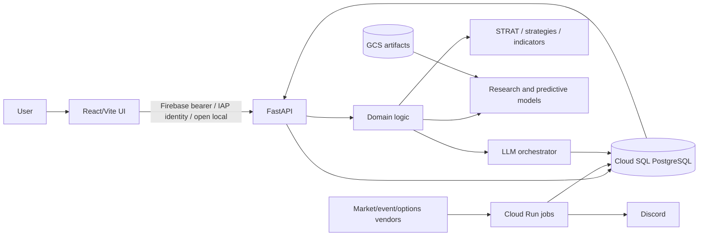
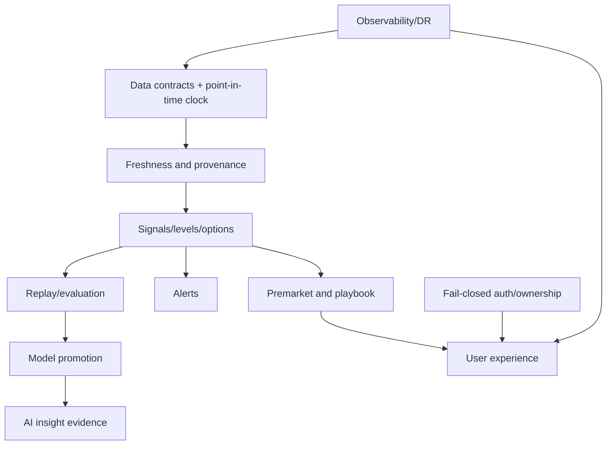

# Product Overview

## Definition and vision

**CURRENT — VERIFIED — CODE:** a single-repository market-intelligence platform combining a public site, authenticated React decision-support UI, FastAPI read/write layer, PostgreSQL analytical store, scheduled ingestion/analysis jobs, deterministic market structure and strategies, experimental predictive models, LLM-produced insights, replay/backtesting, journaling, and Discord delivery. It provides intelligence and simulation; no verified broker-order execution surface was found.

**Vision — PROPOSED — TARGET:** give an individual trader a point-in-time-safe, explainable path from market/event data to context, plan, alert, review, and evidence-based improvement—without representing research output as trade-ready evidence.

**Primary goal:** one trustworthy workflow: authenticate → establish data freshness → review market/premarket state → inspect an instrument → assess levels/options/catalysts → create a bounded plan → monitor signals → journal outcome → evaluate with reproducible evidence.

## Evidence-backed users

| User | Evidence and journey |
|---|---|
| Individual trader/analyst | Dashboard, live, charts, signals, playbook, journal, insights. |
| Platform operator/admin | Admin, health/freshness, routing/calibration, deployment jobs. |
| Model researcher | `gcp/research`, backtest/walk-forward tables and reports. |
| Public visitor | Landing and waitlist. |

Multi-tenant enterprise roles and broker execution are **not verified**.

## Architecture

## Current → target assessment

| Workstream | Current/partial evidence | Target | Gap | Status |
|---|---|---|---|---|
| Web/UI | 15 declared route paths including redirect; protected shell and public landing | coherent, accessible decision workflow | screen trust/freshness and consistent states | Production but needs remediation |
| Auth/user management | Firebase, IAP, open modes; admin checks | fail-closed identity and explicit roles/ownership | unsafe default and incomplete tenancy policy | Production but needs remediation |
| Dashboard/ticker/premarket/live | implemented UI/API/jobs | traceable, fresh, parity-tested context | stale/unfed data and semantic parity defects | Production but needs remediation |
| Signals/trade planning | strategies, alerts, playbook and replay | bounded, explainable decisions with live/replay parity | correctness and provenance gates | Production but needs remediation |
| Options/gamma/catalysts | schemas, jobs, APIs and screens | fresh point-in-time context with graceful unknowns | missing/empty-data semantics and validation | Incomplete |
| AI insights | orchestrator, prompts, routing, persistence | evidence-only explanation with constrained numeric authority | evaluation, provenance, fallback policy | Experimental |
| Models/research | deterministic and learned systems coexist | governed promotion/rollback lifecycle | leakage and untouched-validation gaps | Retest Required |
| Journal/portfolio | CRUD/import-oriented surfaces | user-owned outcome feedback loop | tenancy, completeness, analytics | Incomplete |
| Replay/backtest | engines and result stores | clock-safe production-parity evaluation | leakage and live/replay divergence | Invalidated |
| Data platform | broad scheduled ingestion and SQL domains | contracts, provenance, freshness SLOs | schema drift, silent-empty paths, monitoring coverage | Production but needs remediation |
| Infrastructure/CI/CD | Cloud Run/SQL/Scheduler/Build/scripts/actions | reproducible IaC and least privilege | deployment drift and script asymmetry | Production but needs remediation |
| Operations/security | health, job runs, audits/incidents | SLOs, alerts, DR drills, fail-closed secrets/auth | incomplete monitors/runbooks and recovery evidence | Incomplete |
| Legacy surfaces | Apps Script/Pine/archive/static reports exist | explicit owners or retirement | unclear consumers and lifecycle | Retire candidate |

## Core dependency graph

