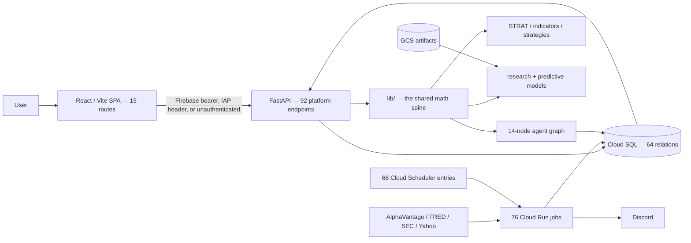
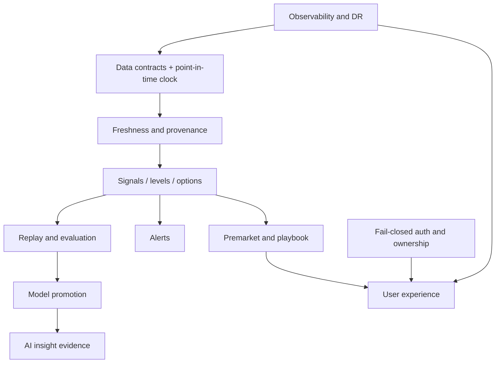

# Product Overview

**Last reviewed:** 2026-08-30 · **Owner:** TBD

## What this is — VERIFIED — CODE

A single-repository market-intelligence platform: a public landing site, an authenticated React
decision-support UI (15 routes), a FastAPI read/write layer (92 platform endpoints), a PostgreSQL
analytical store (64 relations), 76 scheduled Cloud Run jobs driven by 66 Cloud Scheduler
entries, deterministic market-structure and strategy logic in `lib/`, experimental predictive
models, a 14-node LLM insight pipeline, replay and backtesting engines, a per-user trade journal,
and Discord delivery.

**There is no broker-order execution surface.** The product produces intelligence and simulation.

## Vision — PROPOSED — TARGET

Give an individual trader a point-in-time-safe, explainable path from market and event data to
context, plan, alert, review and evidence-based improvement — **without presenting research
output as trade-ready evidence.**

**Primary goal:** one trustworthy workflow — authenticate → establish data freshness → review
market and premarket state → inspect an instrument → assess levels, options and catalysts →
form a bounded plan → monitor signals → journal the outcome → evaluate with reproducible evidence.

## Users — evidence-backed

| User | Evidence in the repository |
|---|---|
| Individual trader / analyst | `/dashboard`, `/live`, `/charts`, `/signals`, `/playbook`, `/journal`, `/insights` |
| Platform operator / admin | `/admin`, `/api/health/freshness`, `job_runs`, model routing, deploy scripts |
| Model researcher | `gcp/research/`, walk-forward and backtest tables, the experiment registry |
| Public visitor | `/` landing and waitlist |

Multi-tenant enterprise roles and broker execution are **not verified** and are not assumed.

## Architecture

## Current vs. target

| Workstream | Current | Target | Gap | Status |
|---|---|---|---|---|
| Web / UI | 15 routes, shared shell, error boundary, 29 E2E + 27 unit tests | coherent, accessible, honest-about-freshness workflow | per-screen state gaps; frontend suites absent from CI | Production but needs remediation |
| Auth / identity | three modes; **only `firebase` enforces at the app layer** | fail-closed identity with explicit roles and ownership | `iap`/`open` pass through; `/dev` public on staging; open signup by default | Production but needs remediation |
| Dashboard / live / charts | implemented UI, API and jobs | traceable, fresh, parity-tested context | stale inputs and semantic parity defects | Production but needs remediation |
| Premarket / playbook | brief job, resolver, cards, as-of review | a plan a trader can act on today | `playbook_cards` 77 days stale, rendered as current | **Broken** |
| Signals / execution | strategies, alerts, exits, Discord routing | bounded, explainable, parity-tested decisions | live has no stop-loss while the validating backtest does; daily loss limit unenforceable | Production but needs remediation |
| Options / gamma | schemas, jobs, APIs, grid UI | fresh point-in-time context with graceful unknowns | fabricated flips, `or 0` on gamma/OI, multiplier and scaling defects | Retest Required |
| AI insights | 14 routed LLM nodes, routing, persistence, cost tracking | evidence-only explanation with constrained numeric authority | no ablation, no outcome evaluation, risk/plan mismatch | Experimental |
| Models / research | deterministic and learned systems coexist | governed promotion and rollback | in-sample calibration auto-writes production; leakage | **Invalidated / Failed** (mixed) |
| Journal / portfolio | per-user trades, CSV import, chart marking | user-owned outcome feedback loop | return-unit mix, tenancy invariants | Production but needs remediation |
| Replay / backtest | replay mode in the production job, walk-forward, EOD resolver | clock-safe production-parity evaluation | nine CRITICAL leakage and parity defects open | **Invalidated** |
| Data platform | broad scheduled ingestion, 64 relations | contracts, provenance, freshness SLOs | silent-empty paths, schema drift, partial monitoring | Production but needs remediation |
| Infrastructure / CI | Cloud Run, SQL, Scheduler, Build, Actions | reproducible IaC, least privilege | scheduler→job drift, secrets via env, no restore drill | Production but needs remediation |
| Legacy surfaces | Apps Script, Pine scripts, archived apps, orphan tables | explicit owner or retirement | unclear consumers | Retire candidate |

**Two of 25 capabilities are at unqualified Production** (Landing, Help). That is the honest
headline, and it is what makes the roadmap's dependency ordering necessary rather than optional.

## Dependency graph

## How to use this plan

Start at the [README](README.md) master matrix. Each row links to the capability record
([02](02-FEATURE-CATALOG.md)), its code ([11](11-CODE-TRACEABILITY.md)) and its open issues and
PR lineage ([12](12-PR-ISSUE-TRACEABILITY.md)). What to do next is
[13](13-ROADMAP.md); how the work decomposes is [14](14-WORK-BREAKDOWN.md); what only you can
decide is [15](15-OPEN-DECISIONS.md).
