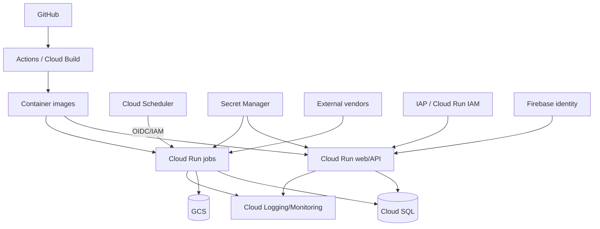

# Infrastructure Plan

## Actual component inventory
| Component | Purpose/runtime | Deployment source | Identity/secrets/network/data | Trigger/monitoring/recovery | Current gap |
|---|---|---|---|---|---|
| React web service | Vite static application on Cloud Run | `platform/Dockerfile`, `platform/cloudbuild.yaml`, `platform/deploy.sh` | IAP/Firebase mode; API URL | HTTPS; Cloud logging | deployed configuration drift must be reconciled |
| FastAPI service | API on Cloud Run | `platform/api`, platform build/deploy files | service account, Cloud SQL, Secret Manager | HTTPS/health | fail-closed auth and endpoint SLO proof |
| Cloud Run jobs (68 names parsed) | ingestion, analysis, insights, alerts, maintenance | `gcp/deploy.sh`, Docker/build files | service accounts, vendor/API secrets, Cloud SQL/GCS | Scheduler/manual; job logs/`job_runs` | create/update convergence, retry/timeout/drift |
| Cloud Scheduler | invokes jobs/services | `gcp/deploy.sh` | OIDC/IAM | cron; scheduler/job logs | schedule source-of-truth and stale jobs |
| Cloud SQL PostgreSQL | analytical and application persistence | `gcp/schema.sql`, migrations/scripts | private/connector path and DB secret | backups/logs | ordered migrations and restore drills |
| GCS | model/report/artifact storage | GCS readers/jobs/deploy config | service IAM | object/version monitoring | retention/provenance/rollback |
| Cloud Build + GitHub Actions | image/test/deploy automation | `gcp/cloudbuild`, `.github/workflows`, platform cloudbuild | build identities/secrets | commit/manual | coverage and reproducibility |
| Secret Manager | vendor, DB, auth, Discord credentials | deploy bindings | least privilege | rotation/audit logs | ownership/rotation evidence |
| Firebase / IAP / Cloud Run IAM | app identity and perimeter | auth code + deployment flags | token/header/service IAM | request | default-mode/perimeter coupling |
| External vendors | Alpha Vantage, FRED, SEC, Discord and code-verified providers | ingestion/client modules | API tokens, egress | scheduled/request | quotas, contracts, fallback semantics |

**Parsed deployed job tokens:** apply-schema-migrations, audit-brief-bias, audit-infra-drift, audit-magnitude-drift, audit-walkforward, auto-refresh-top-n, backfill-daily-indicators, backfill-ticker, backtest, backtest-pipeline, build-options-daily-features, build-options-greeks, build-realtime-gex, calibrate-thresholds, cloud-sql-weekly-export, compute-earnings-reactions, compute-spx-greeks-backfill, db-query, direction-baseline, direction-importance, direction-phase2, direction-probe, earnings-long-watchlist, earnings-options-backfill, earnings-reactions-brief, earnings-sweep, etf-options-retention, evaluate-ew-strikes, fetch-alphavantage-intraday, fetch-av-options-backfill, fetch-av-options-realtime, fetch-earnings-calendar, fetch-earnings-history, fetch-economic-events, fetch-fred-rates, fetch-insider-transactions, fetch-market-data, fetch-news-sentiment, fetch-news-sentiment-earnings, fetch-news-sentiment-topics, fetch-premarket-refresh, fetch-sec-filings, fetch-top-movers, freshness-watchdog, historical-signals-watchlist, indicator-correlation, insight-discord-push, insight-pipeline, intraday-bulk-backfill, leaves, magnitude-engine, magnitude-inference, magnitude-recal, options-exec-backtest, param-sweep, phase6-playbook, premarket-brief, premarket-playbook-resolver, refresh-earnings-views, regime-combo, signal-monitor, signal-monitor-eod-resolver, signal-quality-alarm, signal-quality-report, signal-replay, strat-engine, validate-brief, weekend-review

**Deployment functions (89):** `_build_secret_flag, _env_string, _job_uri, _schedule, _schedule_args, _schedule_brief, _schedule_insight, _schedule_with_args, _secret, backfill_watchlist, build_image, build_research_image, deploy_apply_schema_migrations, deploy_audit_brief_bias, deploy_audit_infra_drift, deploy_audit_magnitude_drift, deploy_audit_walkforward, deploy_auto_refresh_top_n, deploy_av_options_backfill, deploy_av_options_realtime, deploy_backfill_daily_indicators, deploy_backfill_ticker, deploy_backtest, deploy_backtest_pipeline, deploy_build_options_daily_features, deploy_build_options_greeks, deploy_build_realtime_gex, deploy_calibrate_thresholds, deploy_compute_earnings_reactions, deploy_compute_spx_greeks_backfill, deploy_db_query, deploy_direction_baseline, deploy_direction_importance, deploy_direction_phase2, deploy_direction_probe, deploy_discord_interactions, deploy_earnings_long_watchlist, deploy_earnings_options_backfill, deploy_earnings_reactions_brief, deploy_earnings_sweep, deploy_evaluate_ew_strikes, deploy_fetch_alphavantage, deploy_fetch_earnings_calendar, deploy_fetch_earnings_history, deploy_fetch_economic_events, deploy_fetch_fred_rates, deploy_fetch_insider_transactions, deploy_fetch_market_data, deploy_fetch_news_sentiment, deploy_fetch_news_sentiment_earnings, deploy_fetch_news_sentiment_topics, deploy_fetch_premarket_refresh, deploy_fetch_sec_filings, deploy_fetch_top_movers, deploy_fetchers, deploy_freshness_watchdog, deploy_historical_signals_watchlist, deploy_indicator_correlation, deploy_insight_discord_push, deploy_insight_pipeline, deploy_intraday_bulk_backfill, deploy_magnitude_engine, deploy_magnitude_inference, deploy_magnitude_recal, deploy_monitor, deploy_notifier, deploy_options_exec_backtest, deploy_options_retention, deploy_p7b_classifier_DEPRECATED, deploy_param_sweep, deploy_phase6_playbook, deploy_premarket, deploy_premarket_playbook_resolver, deploy_refresh_earnings_views, deploy_regime_combo, deploy_schedulers, deploy_signal_monitor_eod_resolver, deploy_signal_quality_alarm, deploy_signal_quality_report, deploy_signal_replay, deploy_strat_engine, deploy_validate_brief, deploy_weekend, deploy_weekly_pg_dump, migrate, setup, setup_insight_tasks_queue, setup_notifier_secrets, setup_pg_dump_iam`. Functions prove deploy intent, not live resources. Live environment reconciliation is `UNKNOWN / NEEDS HISTORY TRACE`.

## Dependency/deployment architecture

## Reproducibility target
Reviewed declarative configuration shall own runtime, IAM, secrets, network, schedule, timeout/retry, database attachment and alerts. Recovery is redeploy + documented data replay/restore; until restore and drift checks pass, reproducibility remains **Production but needs remediation**.
