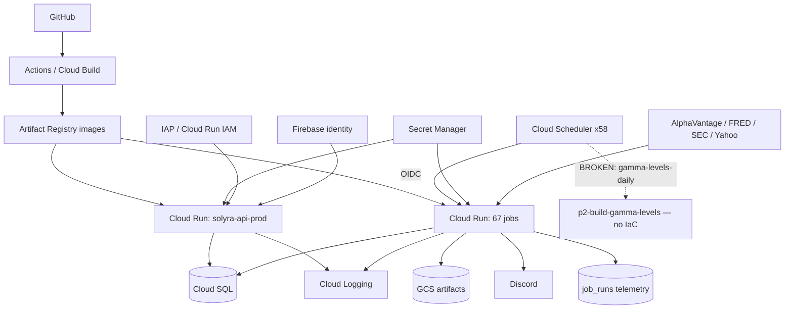

# Infrastructure Plan

**Last reviewed:** 2026-08-30 · **Owner:** TBD

**VERIFIED — CODE.** Parsed from `gcp/deploy.sh` at `d335f2f` by resolving each
`deploy_*()` function body, so flags built into a `common_flags=( ... )` bash array are
captured alongside inline flags. <!-- verify-docs-ok: deliberately the repo-declared count, not the live one; the live count is stated immediately below -->
**67 Cloud Run jobs** and **58 Cloud Scheduler entries** are *declared in the repo*.

**VERIFIED — LIVE, 2026-09-07.** `gcloud run jobs list --region=us-east1` returns
**76 jobs** and `gcloud scheduler jobs list --location=us-east1` returns **66 scheduler
entries** — and 0 in every other Cloud Scheduler location, so 66 is the whole fleet.
This previously read 84, dated 2026-09-06, and that figure does not reproduce; only
the reading above is vouched for here. The dated audit under
`docs/audits/2026-08-27-claude-codebase-review/` also records 84 and is left as
written, being a record of what was measured on its own date.

<!-- verify-docs-ok: the 58-declared figure two paragraphs up is a parse of gcp/deploy.sh at a named commit, a different measurement that has not been redone; a naive count of _schedule* call sites is not a usable corroboration either: it counted a loop body as one entry when those loops existed, and #1004 has since replaced them with single hourly triggers, so the two numbers were never measuring the same thing --> The two numbers answer different questions and both belong here: the code
count is what a fresh `deploy.sh` run would produce, the live count is what is actually
billing and firing. The gap is undeclared infrastructure —

| Direction | Count | Names |
|---|---|---|
| Live but not in `deploy.sh` | 8 | `backtest-playability`, `compare-tier-fires`, `p2-outcomes-grid`, `p45-deep-ds`, `p7-analyze-tf`, `p7-build-multi-tf-features`, `p7a-iwm-30m-pipeline`, `strat-dir-features` |
| In `deploy.sh` but not live | 2 | `compute-spx-greeks-backfill`, `options-exec-backtest` |

Every live scheduler entry runs in `America/New_York` — zero entries in any other
timezone (verified 2026-09-06), so every cron field in this document is a NY
wall-clock time and shifts with DST. `scripts/verify_docs_against_live.py` re-runs
these comparisons.

> **Parser discipline.** An earlier revision reported 68 jobs. The 68th, `leaves`, was a word
> captured from the prose comment `gcloud run jobs update leaves omitted flags untouched`
> at `gcp/deploy.sh:1466`. Comment lines are now stripped before parsing. The count is **67**.
> A naive parse also reported 18 jobs missing `--task-timeout`; function-scoped resolution gives
> **5**, which matches [#851](https://github.com/TeneikaAskew/stocks/issues/851) independently.

## Platform components

| Component | Purpose / runtime | Deployment source | Identity / secrets | Trigger | Current gap |
|---|---|---|---|---|---|
| FastAPI API service | **API only** — the SPA moved to the solyra repo in #957 and `platform/Dockerfile` copies no `dist/`, so `main.py`'s conditional SPA mount never activates. Two services: `solyra-api-prod` and `solyra-api-staging` | `platform/Dockerfile`, `gcp/cloudbuild/*.yaml`, `platform/deploy.sh` | `AUTH_MODE` (`iap` on prod; `firebase` on staging), Cloud SQL connector, Secret Manager | HTTPS | auth unenforced outside `firebase`/`iap` ([09](09-SECURITY-AUTH.md)); `/dev` exposed on public staging |
| Cloud Run jobs (67 declared / 76 live) | ingestion, analysis, insights, alerts, maintenance | `gcp/deploy.sh` | `trading-runner@` SA, vendor secrets | Scheduler (66 live) / manual | 8 jobs exist only by hand — see the table above |
| Cloud Scheduler (58) | invokes jobs | `gcp/deploy.sh` `_schedule*` helpers | OIDC | cron (UTC) | one entry targets a nonexistent job |
| Cloud SQL PostgreSQL | analytical + application store | `gcp/schema.sql`, `apply-schema-migrations` job | private connector, DB secret | — | convergence sprawl ([#918](https://github.com/TeneikaAskew/stocks/issues/918)); restore drills unproven |
| GCS | model/report/query artifacts | job writers, `db_query_cr.sh` | SA IAM | — | retention/provenance |
| Cloud Build + GitHub Actions | image build, test, deploy | `gcp/cloudbuild/`, `.github/workflows/` | build identities | commit / manual | frontend suites not in CI ([solyra#28](https://github.com/TeneikaAskew/solyra/issues/28), formerly #868) |
| Secret Manager | vendor, DB, auth, Discord credentials | `--set-secrets` bindings | least privilege | — | several secrets still via `--set-env-vars` ([#830](https://github.com/TeneikaAskew/stocks/issues/830), [#850](https://github.com/TeneikaAskew/stocks/issues/850)) |

## Deploy-time drift detected mechanically

Diffing scheduler targets against created job names reproduces a known CRITICAL finding
without reading the audit — the plan should carry this check, not just cite it:

| Scheduler | Cron (UTC) | Targets job | Exists in `deploy.sh`? | Issue |
|---|---|---|---|---|
| `gamma-levels-daily` | `30 22 * * 1-5` | `p2-build-gamma-levels` | **NO** | [#829](https://github.com/TeneikaAskew/stocks/issues/829) |

Related infra-drift issues not detectable from source alone (they compare *live* state):
[#833](https://github.com/TeneikaAskew/stocks/issues/833) `signal-quality-report-hourly` PAUSED live · 
[#834](https://github.com/TeneikaAskew/stocks/issues/834) `p2-build-gamma-levels` has zero IaC · 
[#835](https://github.com/TeneikaAskew/stocks/issues/835) five jobs on stale image tags · 
[#859](https://github.com/TeneikaAskew/stocks/issues/859) five live-vs-repo config drifts.

## Environments and URLs

**VERIFIED — DEPLOYMENT.** The production URL was probed on 2026-08-30: both `/` and
`/api/health` return a redirect to Google SSO carrying IAP OAuth client
`369001918367-t5qrahnqdaasaifvk6akpqkpjk9vli58`, which is the same client ID hardcoded at
`platform/deploy.sh:99`. The service is live and IAP is active on it.

| Environment | Service | URL | Auth | Evidence |
|---|---|---|---|---|
| **Production** | `solyra-api-prod` (us-east1) | `https://solyra-api-prod-5sjtb3yl7a-ue.a.run.app` | IAP SSO, audience `bictech.org` | solyra `playwright.config.ts` (`CLOUD_RUN_URL`), `docs/BRIEFING_DECK.md:51,278`; live probe 2026-08-30 |
| **Staging** | `solyra-api-staging` | `https://solyra-api-staging-5sjtb3yl7a-ue.a.run.app` — also served at `api.stocks.insightscollective.org` | **public ingress + Firebase** (`allUsers` run.invoker, `AUTH_MODE=firebase`, `AUTH_OPEN_SIGNUP=1`) | live probe 2026-09-05; solyra `src/lib/apiTargets.ts` (`STAGING_API`) |
| **Discord interactions** | `discord-interactions` | `https://discord-interactions-5sjtb3yl7a-ue.a.run.app` | `--allow-unauthenticated` (Discord cannot IAM-auth); Ed25519 signature verification at the app layer | live read 2026-09-05 |
| **Failure notifier** | `failure-notifier` | `https://failure-notifier-5sjtb3yl7a-ue.a.run.app` | internal | live read 2026-09-05 |
| **Local dev (frontend)** | Vite — in the solyra repo since the #957 split | `http://localhost:5173` | none (`AUTH_MODE` unset → `open`) | solyra `vite.config.ts`; `platform/` here holds only the API |
| **Local dev (API)** | uvicorn | `http://localhost:8000` | none | `Makefile:73`; solyra's Vite proxies `/api` → `:8000` |

**A custom domain now exists.** `api.stocks.insightscollective.org` maps to
`solyra-api-staging` (moved off the prod service 2026-09-05; the CNAME to
`ghs.googlehosted.com` is service-independent so the move needed no DNS change).
It is committed nowhere in source — Cloud Run holds the mapping — so treat
`gcloud beta run domain-mappings list --region=us-east1` as the source of truth.
Read [09](09-SECURITY-AUTH.md) before assuming what that hostname exposes: it
fronts open Firebase self-signup over the production database.

Historically: The landing components brand the
product **Solyra** (solyra `src/components/landing/*` since the #957 split, and [solyra#27](https://github.com/TeneikaAskew/solyra/issues/27)
"Rename internal Heatseeker/Flowseeker tabs before Solyra public launch", formerly #685), but no `solyra.*`
hostname appears in any config, deploy script, or DNS reference. Whether a public domain exists
is **PRODUCT DECISION REQUIRED** / unknown — see [15](15-OPEN-DECISIONS.md).

### On the `XXXXXXXXXX` redactions

Those placeholders hid the project's Cloud Run host suffix, `5sjtb3yl7a-ue`.
The redaction bought nothing: the same suffix is committed in plaintext in
solyra's `src/lib/apiTargets.ts` and `playwright.config.ts`, and in the
production row of the table above. It is one value shared by every service in
the project, so masking it in two rows while publishing it in four others is
inconsistent rather than protective. The URLs are filled in above.

If the intent was to keep Cloud Run hostnames out of the repo, that is a
decision to apply everywhere at once — including `apiTargets.ts`, which needs
the origin at runtime and would have to read it from config instead. Neither
service relies on an unguessable URL for security: `discord-interactions`
verifies Ed25519 signatures, the API services are IAP- or Firebase-gated.

### Resolving service URLs

Cloud Run assigns service URLs, so they are not in source. To re-read them:

```bash
gcloud run services list --region=us-east1 \
  --format="table(metadata.name,status.url)" --project=adept-mountain-474619-d4
```

This could not be run from the session that wrote this plan — `gcloud` reported
`ACCESS_TOKEN_TYPE_UNSUPPORTED` because `CLOUDSDK_AUTH_ACCESS_TOKEN` held a harness placeholder
rather than a real credential. Anyone with working GCP auth should paste the output here.

### Staging exposure, corroborated

`docs/BRIEFING_DECK.md:292` documents the `/dev` gate as *"Gated by
`X-Goog-Authenticated-User-Email == teneika@bictech.org`. Local-dev requests (no header) bypass
the gate."* That assumption holds only where IAP is in front. The staging service runs
`PUBLIC=1` with **no IAP** (`platform/deploy.sh:52-56`), so "no header" describes the open
internet, not a developer laptop — the exposure detailed in [09](09-SECURITY-AUTH.md).

## Cloud Run job inventory

`—` in a config column means the flag is absent from the `deploy_*` function, so Cloud Run's
default applies (task-timeout **600s**, max-retries **3**).

| Job | Deploy fn | Schedule (UTC) | Timeout | Retries | Mem | CPU | Secrets |
|---|---|---|---|---|---|---|---|
| `apply-schema-migrations` | `deploy_apply_schema_migrations` | manual | `600` | `0` | `512Mi` | `1` | — |
| `audit-brief-bias` | `deploy_audit_brief_bias` | `0 10 * * 0` | `1800` | `0` | `1Gi` | `1` | `DB_PASS` |
| `audit-infra-drift` | `deploy_audit_infra_drift` | `30 12 * * *` | `300` | `0` | `512Mi` | `1` | `DISCORD_WEBHOOK_URL` |
| `audit-magnitude-drift` | `deploy_audit_magnitude_drift` | `55 9 * * 1-5` | `180` | `0` | `512Mi` | `1` | `DB_PASS`, `DISCORD_WEBHOOK_URL` |
| `audit-walkforward` | `deploy_audit_walkforward` | `0 9 * * 6` | `1800` | `0` | `1Gi` | `1` | `DB_PASS` |
| `auto-refresh-top-n` | `deploy_auto_refresh_top_n` | `10 8 * * 1-5` | `600` | **`1`** | `1Gi` | `1` | — |
| `backfill-daily-indicators` | `deploy_backfill_daily_indicators` | `30 2 * * 1-6` | `36000` | `0` | `2Gi` | `2` | — |
| `backfill-ticker` | `deploy_backfill_ticker` | manual | `600` | **`1`** | `1Gi` | `1` | — |
| `backtest` | `deploy_backtest` | manual | `900` | **`1`** | `2Gi` | `1` | — |
| `backtest-pipeline` | `deploy_backtest_pipeline` | manual | `28800` | `0` | `8Gi` | `2` | — |
| `build-options-daily-features` | `deploy_build_options_daily_features` | `0 22 * * 1-5` | `3600` | `0` | `4Gi` | `2` | — |
| `build-options-greeks` | `deploy_build_options_greeks` | `15 23 * * 1-5` | `3600` | `0` | `4Gi` | `2` | — |
| `build-realtime-gex` | `deploy_build_realtime_gex` | `0 17 * * 1-5` | `1800` | **`1`** | `4Gi` | `2` | — |
| `calibrate-thresholds` | `deploy_calibrate_thresholds` | `0 2 1 1,4,7,10 *` | `600` | **`1`** | `1Gi` | `1` | — |
| `cloud-sql-weekly-export` | `deploy_weekly_pg_dump` | `0 4 * * 0` | `21600` | `0` | `512Mi` | `1` | — |
| `compute-earnings-reactions` | `deploy_compute_earnings_reactions` | `30 19 * * 1-5`; `30 19 * * 0` | `1800` | **`1`** | `1Gi` | `1` | — |
| `compute-spx-greeks-backfill` | `deploy_compute_spx_greeks_backfill` | manual | `43200` | `0` | `2Gi` | `1` | — |
| `db-query` | `deploy_db_query` | manual | `600` | `0` | `512Mi` | `1` | `DB_PASS` |
| `direction-baseline` | `deploy_direction_baseline` | manual | `10800` | `0` | `8Gi` | `4` | — |
| `direction-importance` | `deploy_direction_importance` | manual | `10800` | `0` | `8Gi` | `4` | — |
| `direction-phase2` | `deploy_direction_phase2` | manual | `10800` | `0` | `8Gi` | `4` | — |
| `direction-probe` | `deploy_direction_probe` | manual | `5400` | `0` | `8Gi` | `4` | — |
| `earnings-long-watchlist` | `deploy_earnings_long_watchlist` | `45 19 * * 0` | `600` | `0` | `512Mi` | `1` | — |
| `earnings-options-backfill` | `deploy_earnings_options_backfill` | manual | `32400` | `0` | `1Gi` | `1` | `DB_PASS` |
| `earnings-reactions-brief` | `deploy_earnings_reactions_brief` | `35 8 * * 1-5` | `600` | `0` | `1Gi` | `1` | — |
| `earnings-sweep` | `deploy_earnings_sweep` | manual | `1800` | `0` | `4Gi` | `2` | — |
| `etf-options-retention` | `deploy_options_retention` | `0 2 * * *` | `3600` | `0` | `512Mi` | `1` | `DB_PASS` |
| `evaluate-ew-strikes` | `deploy_evaluate_ew_strikes` | `0 23 * * 1-5` | `600` | **`1`** | `512Mi` | `1` | — |
| `fetch-alphavantage-intraday` | `deploy_fetch_alphavantage` | `0 21 1 * *`; `0 21 * * 1-6` | `3600` | **`1`** | `2Gi` | `1` | — |
| `fetch-av-options-backfill` | `deploy_av_options_backfill` | `0 21 * * 1-5`; `0 5 1 * *` | `43200` | `0` | `2Gi` | `1` | `DB_PASS` |
| `fetch-av-options-realtime` | `deploy_av_options_realtime` | `*/5 9-15 * * 1-5` | `600` | `0` | `512Mi` | `1` | `DB_PASS` |
| `fetch-earnings-calendar` | `deploy_fetch_earnings_calendar` | `0 19 * * 1-5`; `0 19 * * 0` | `1800` | **`1`** | `512Mi` | `1` | — |
| `fetch-earnings-history` | `deploy_fetch_earnings_history` | `15 19 * * 1-5`; `15 19 * * 0` | `28800` | **`1`** | `1Gi` | `1` | — |
| `fetch-economic-events` | `deploy_fetch_economic_events` | `0 7 * * 1-5` | **— (600s)** | **`1`** | `512Mi` | `1` | — |
| `fetch-fred-rates` | `deploy_fetch_fred_rates` | `30 6 * * *` | `600` | **`1`** | `512Mi` | `1` | — |
| `fetch-insider-transactions` | `deploy_fetch_insider_transactions` | `0 7 * * 1-5` | `1800` | **`1`** | `512Mi` | `1` | — |
| `fetch-market-data` | `deploy_fetch_market_data` | `0 23 * * 1-5` | `5400` | **`2`** | `1Gi` | `1` | — |
| `fetch-news-sentiment` | `deploy_fetch_news_sentiment` | manual | **— (600s)** | **`1`** | `512Mi` | `1` | — |
| `fetch-news-sentiment-earnings` | `deploy_fetch_news_sentiment_earnings` | `0 6 * * 1-5` | **— (600s)** | **`1`** | `512Mi` | `1` | — |
| `fetch-news-sentiment-topics` | `deploy_fetch_news_sentiment_topics` | manual | **— (600s)** | **`1`** | `512Mi` | `1` | — |
| `fetch-premarket-refresh` | `deploy_fetch_premarket_refresh` | `20 8 * * 1-5` | `300` | **`1`** | `512Mi` | `1` | — |
| `fetch-sec-filings` | `deploy_fetch_sec_filings` | `0 7 * * 1-5`; `0 10 * * 1-5`; `0 13 * * 1-5`; `0 17 * * 1-5` | `1800` | **`1`** | `512Mi` | `1` | — |
| `fetch-top-movers` | `deploy_fetch_top_movers` | `15 16 * * 1-5`; `30 9-15 * * 1-5`; `5 16 * * 1-5` | `300` | `0` | `512Mi` | `1` | — |
| `freshness-watchdog` | `deploy_freshness_watchdog` | `0 9-19 * * 1-5`; `30 19 * * *` | `3600` | `0` | `512Mi` | `1` | `DB_PASS` |
| `historical-signals-watchlist` | `deploy_historical_signals_watchlist` | `0 1 * * 2-6` | `1800` | **`1`** | `2Gi` | `1` | — |
| `indicator-correlation` | `deploy_indicator_correlation` | manual | `1800` | **`1`** | `1Gi` | `1` | — |
| `insight-discord-push` | `deploy_insight_discord_push` | `15 9 * * 1-5` | `120` | **`1`** | `512Mi` | `1` | — |
| `insight-pipeline` | `deploy_insight_pipeline` | `45 8 * * 1-5` | `1800` | **`1`** | `2Gi` | `1` | — |
| `intraday-bulk-backfill` | `deploy_intraday_bulk_backfill` | manual | `86400` | `0` | `1Gi` | `1` | `DB_PASS` |
| `magnitude-engine` | `deploy_magnitude_engine` | manual | `5400` | `0` | `8Gi` | `4` | — |
| `magnitude-inference` | `deploy_magnitude_inference` | `25 9 * * 1-5` | `300` | `0` | `1Gi` | `1` | — |
| `magnitude-recal` | `deploy_magnitude_recal` | manual | `10800` | `0` | `8Gi` | `4` | — |
| `options-exec-backtest` | `deploy_options_exec_backtest` | manual | `14400` | `0` | `8Gi` | `2` | `DB_PASS` |
| `param-sweep` | `deploy_param_sweep` | manual | `21600` | `0` | `4Gi` | `1` | — |
| `phase6-playbook` | `deploy_phase6_playbook` | manual | `3600` | `0` | `8Gi` | `4` | — |
| `premarket-brief` | `deploy_premarket` | `30 8 * * 1-5`; `0 21 * * 0` | `1800` | `0` | `1Gi` | `1` | — |
| `premarket-playbook-resolver` | `deploy_premarket_playbook_resolver` | `15 21 * * 1-5` | `3600` | `0` | `1Gi` | `1` | — |
| `refresh-earnings-views` | `deploy_refresh_earnings_views` | `0 20 * * 0`; `30 7 * * 1-5` | `1200` | `0` | `1Gi` | `1` | — |
| `regime-combo` | `deploy_regime_combo` | `0 5 * * 0` | `3600` | **`1`** | `2Gi` | `2` | — |
| `signal-monitor` | `deploy_monitor` | `25 9 * * 1-5`; `45 9 * * 1-5`; `0 10 * * 1-5` | `28800` | `0` | `2Gi` | `1` | — |
| `signal-monitor-eod-resolver` | `deploy_signal_monitor_eod_resolver` | `30 16 * * 1-5` | `3600` | `0` | `1Gi` | `1` | — |
| `signal-quality-alarm` | `deploy_signal_quality_alarm` | manual | `120` | `0` | `512Mi` | `1` | — |
| `signal-quality-report` | `deploy_signal_quality_report` | manual | `3600` | `0` | `1Gi` | `1` | — |
| `signal-replay` | `deploy_signal_replay` | manual | `900` | `0` | `512Mi` | `1` | — |
| `strat-engine` | `deploy_strat_engine` | `35 23 * * 1-5` | `5400` | `0` | `8Gi` | `4` | — |
| `validate-brief` | `deploy_validate_brief` | manual | `300` | **`1`** | `1Gi` | `1` | — |
| `weekend-review` | `deploy_weekend` | `0 9 * * 6` | **— (600s)** | **`1`** | `1Gi` | `1` | — |

### Config findings from this table

- **5 jobs have no `--task-timeout`** and silently inherit 600s: `fetch-economic-events`, `fetch-news-sentiment`, `fetch-news-sentiment-earnings`, `fetch-news-sentiment-topics`, `weekend-review`. Matches [#851](https://github.com/TeneikaAskew/stocks/issues/851).
- **26 jobs carry a non-zero `--max-retries`** against CLAUDE.md Rule 0's default of 0. Matches [#853](https://github.com/TeneikaAskew/stocks/issues/853) ("~23 jobs").
- Capacity issues on specific jobs: [#832](https://github.com/TeneikaAskew/stocks/issues/832) `fetch-market-data` N+1 · [#855](https://github.com/TeneikaAskew/stocks/issues/855) `backtest-pipeline` 1.8× not 4× · [#856](https://github.com/TeneikaAskew/stocks/issues/856) `fetch-premarket-refresh` 1.2× headroom · [#857](https://github.com/TeneikaAskew/stocks/issues/857) `magnitude-engine` 27-way fan-out.
- Reachability/dead code: [#831](https://github.com/TeneikaAskew/stocks/issues/831) · [#852](https://github.com/TeneikaAskew/stocks/issues/852) 19 `deploy_*` reachable only via the bundled fetchers target · [#854](https://github.com/TeneikaAskew/stocks/issues/854) update branches mirror create flags inconsistently.

## Deployment architecture



## Traceability

| Aspect | Reference |
|---|---|
| Job telemetry origin | [#759](https://github.com/TeneikaAskew/stocks/pull/759) `job_runs` + enrichment-coverage and duration-trend watchdog |
| DR | [#389](https://github.com/TeneikaAskew/stocks/pull/389) weekly Cloud SQL→GCS `pg_dump` · [#392](https://github.com/TeneikaAskew/stocks/pull/392) DR documentation |
| Config remediation | [#507](https://github.com/TeneikaAskew/stocks/pull/507) CPU throttling · [#515](https://github.com/TeneikaAskew/stocks/pull/515) backtest-pipeline 2Gi→8Gi OOM · [#552](https://github.com/TeneikaAskew/stocks/pull/552) premarket-brief timeout + retries 0 · [#782](https://github.com/TeneikaAskew/stocks/pull/782) 8h timeout for fetch-earnings-history · [#385](https://github.com/TeneikaAskew/stocks/pull/385) capture backfill job in deploy.sh |
| Scheduler migration | [#489](https://github.com/TeneikaAskew/stocks/pull/489) av-options GH workflow → Cloud Scheduler · [#499](https://github.com/TeneikaAskew/stocks/pull/499) drop redundant crons · [#211](https://github.com/TeneikaAskew/stocks/pull/211) retire GH economic-events pipeline |
| Drift monitoring | [#601](https://github.com/TeneikaAskew/stocks/pull/601) audit-infra-drift uses Python SDKs · [#641](https://github.com/TeneikaAskew/stocks/pull/641) magnitude drift monitor · [#644](https://github.com/TeneikaAskew/stocks/pull/644) column-nullity checks |
| Code | `gcp/deploy.sh`, `gcp/cloudbuild/`, `platform/deploy.sh`, `.github/workflows/` |
