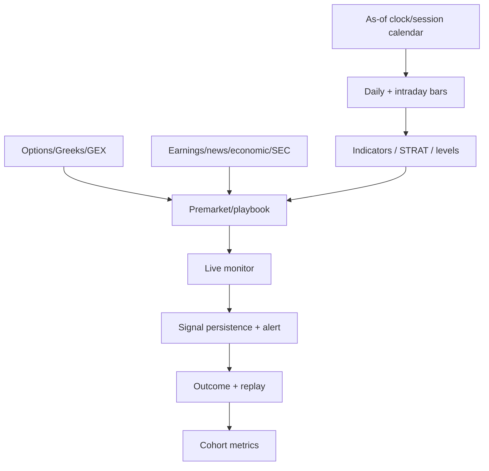
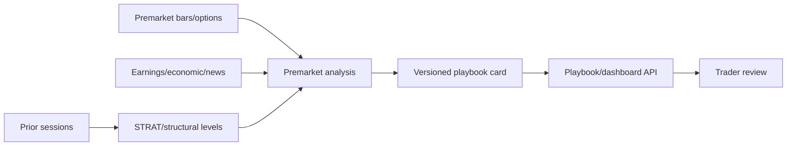
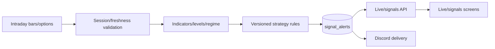
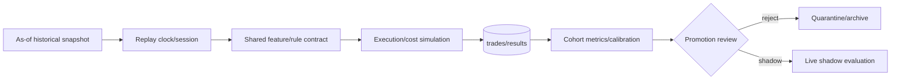

# Data Architecture

**VERIFIED — CODE:** schema assets below come from `gcp/schema.sql`; runtime-created or externally managed objects still require reconciliation. A table's existence does not prove it is fed, fresh, point-in-time safe, or consumed.

## Domain inventory
| Domain | Assets | Producer/consumers | Freshness/retention/PIT status | Gap |
|---|---|---|---|---|
| Market bars | `market_data_daily, market_data_intraday, market_data_intraday_spy, market_data_intraday_iwm, market_data_intraday_qqq, market_data_intraday_spx, market_data_intraday_other, archive_yahoo_market_data_daily, archive_yahoo_market_data_intraday` | producer jobs → API/models/UI | Per-asset SLA and retention TBD; PIT unproven unless tested | owner, keys, provenance, live lineage and freshness evidence |
| Options/Greeks/GEX | `etf_options_snapshots, options_daily_features, etf_options_daily_greeks, earnings_options_snapshots, archive_yahoo_etf_options_snapshots, archive_yahoo_earnings_options_snapshots, earnings_options_strategy_insights, earnings_options_strategy_winners` | producer jobs → API/models/UI | Per-asset SLA and retention TBD; PIT unproven unless tested | owner, keys, provenance, live lineage and freshness evidence |
| Reference/research | `intraday_flow_15m, intraday_gex_15m, realtime_gex_15m, daily_rates, sec_filings, insider_transactions, top_movers_daily, top_movers_intraday, ranker_runs, economic_events, news_sentiment, ticker_info, ticker_calibration, exit_config_overrides, indicator_correlation, regime_combo_results, waitlist_signups, user_style_results` | producer jobs → API/models/UI | Per-asset SLA and retention TBD; PIT unproven unless tested | owner, keys, provenance, live lineage and freshness evidence |
| Earnings/events | `earnings_calendar, earnings_history, earnings_reactions, earnings_calibration, earnings_event_outcomes, earnings_ticker_lean, earnings_upcoming_with_history` | producer jobs → API/models/UI | Per-asset SLA and retention TBD; PIT unproven unless tested | owner, keys, provenance, live lineage and freshness evidence |
| Signals | `signal_alerts, historical_signals, signal_metrics` | producer jobs → API/models/UI | Per-asset SLA and retention TBD; PIT unproven unless tested | owner, keys, provenance, live lineage and freshness evidence |
| Trades/journal | `trades, journal_entries, backtest_trades` | producer jobs → API/models/UI | Per-asset SLA and retention TBD; PIT unproven unless tested | owner, keys, provenance, live lineage and freshness evidence |
| Premarket/playbook | `premarket_analysis, playbook_cards, premarket_analysis_history, playbook_cards_staging` | producer jobs → API/models/UI | Per-asset SLA and retention TBD; PIT unproven unless tested | owner, keys, provenance, live lineage and freshness evidence |
| Models/config | `model_routing` | producer jobs → API/models/UI | Per-asset SLA and retention TBD; PIT unproven unless tested | owner, keys, provenance, live lineage and freshness evidence |
| AI insight | `insight_reports, insight_runs, insight_reports_history` | producer jobs → API/models/UI | Per-asset SLA and retention TBD; PIT unproven unless tested | owner, keys, provenance, live lineage and freshness evidence |
| STRAT/levels | `strat_levels, strat_combo_results` | producer jobs → API/models/UI | Per-asset SLA and retention TBD; PIT unproven unless tested | owner, keys, provenance, live lineage and freshness evidence |
| User/config | `watchlists` | producer jobs → API/models/UI | Per-asset SLA and retention TBD; PIT unproven unless tested | owner, keys, provenance, live lineage and freshness evidence |
| Replay/evaluation | `backtest_sweeps, backtest_reports, backtest_walk_forward_folds, walk_forward_results` | producer jobs → API/models/UI | Per-asset SLA and retention TBD; PIT unproven unless tested | owner, keys, provenance, live lineage and freshness evidence |
| Operations | `job_runs` | producer jobs → API/models/UI | Per-asset SLA and retention TBD; PIT unproven unless tested | owner, keys, provenance, live lineage and freshness evidence |

## Required asset record
Each important asset shall document source; producer/owner; consumers; write cadence and freshness target; retention/mutability; primary/business keys; event/as-of/ingest time; point-in-time rule; source/pipeline/config/model/code provenance; jobs/features; tests; PR/issues; failure and replay procedure.

## Market and decision lineage

```mermaid
flowchart LR
 SRC[Vendor/exchange/event sources] --> ING[Scheduled ingestion]
 ING --> RAW[(Bars/options/events)]
 RAW --> DER[Indicators/levels/features]
 DER --> RULE[Strategy/model/LLM evidence]
 RULE --> DEC[Signal/plan/insight]
 DEC --> UX[UI/Discord]
 UX --> OUT[Trade/journal/outcome]
 OUT --> EVAL[Replay/walk-forward/evaluation]
 EVAL --> GOV[Promotion/calibration/retirement]
```

**Trust boundary:** revised/future observations, silent empty values, unfed tables, timestamps without session semantics, and artifacts lacking versions cannot cross into promotion evidence.

## Premarket workflow

## Live signal workflow

## Replay, backtest, and evaluation workflow

