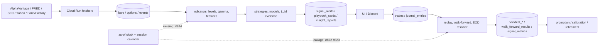

# Data Architecture

**Last reviewed:** 2026-08-30 · **Owner:** TBD

**VERIFIED — CODE.** 64 relations declared in `gcp/schema.sql` (62 tables + 2 materialized
views), extracted from **line-start, comment-stripped** `CREATE` statements.

> **Parser discipline.** A naive parse of this file yields the tokens `IF`, `above`, `clause`,
> `definition` and `skips` as if they were relations. They are words inside `--` comments
> (`schema.sql:1150,1591,1667,3770`) that mention `CREATE TABLE` in prose. Comment lines are
> stripped before parsing and the result is asserted against that set. Any inventory here that
> cannot be traced to a line-start `CREATE` is a bug in the generator, not a real asset.

**Producer/consumer columns are static analysis over `gcp/`, `lib/`, `platform/api/` and
`scripts/`.** They find literal SQL and `upsert_dataframe` calls. **Absence of a producer is
inconclusive** — dynamic table names and helper indirection defeat the scan. Runtime-verified
dormancy lives in [#919](https://github.com/TeneikaAskew/stocks/issues/919) (wired-but-unfed)
and [#920](https://github.com/TeneikaAskew/stocks/issues/920) (write-only surfaces); those are
evidence, this table is a starting point.

## market

| Relation | Kind | Producer (static) | Consumers | Expected cadence | Known problem |
|---|---|---|---|---|---|
| `market_data_daily` | table | `gcp/backfill_ticker.py`, `gcp/fetchers/backfill_daily_indicators.py`, +6 | `gcp/backfill_ticker.py`, `gcp/build_intraday_gex.py`, +31 | daily post-close | — |
| `market_data_intraday` | table | `gcp/backfill_ticker.py`, `gcp/fetchers/fetch_alphavantage_intraday.py`, +2 | `gcp/backfill_ticker.py`, `gcp/build_intraday_gex.py`, +21 | 1-min during RTH | — |
| `market_data_intraday_spy` | table | **none found** | **none found** | TBD | — |
| `market_data_intraday_iwm` | table | **none found** | **none found** | TBD | — |
| `market_data_intraday_qqq` | table | **none found** | **none found** | TBD | — |
| `market_data_intraday_spx` | table | **none found** | **none found** | TBD | — |
| `market_data_intraday_other` | table | **none found** | **none found** | TBD | — |
| `archive_yahoo_market_data_daily` | table | **none found** | **none found** | TBD | — |
| `archive_yahoo_market_data_intraday` | table | **none found** | **none found** | TBD | — |
| `top_movers_daily` | table | `gcp/fetchers/fetch_top_movers.py` | `lib/agents/ranker/candidates.py`, `lib/agents/ranker/signals.py` | TBD | — |
| `top_movers_intraday` | table | `gcp/fetchers/fetch_top_movers.py` | `platform/api/main.py` | TBD | — |

## options / gamma

| Relation | Kind | Producer (static) | Consumers | Expected cadence | Known problem |
|---|---|---|---|---|---|
| `etf_options_snapshots` | table | `gcp/fetchers/fetch_av_historical_options.py`, `gcp/fetchers/fetch_av_realtime_options.py`, +4 | `gcp/build_intraday_gex.py`, `gcp/build_realtime_gex.py`, +25 | TBD | — |
| `options_daily_features` | table | **none found** | **none found** | TBD | — |
| `etf_options_daily_greeks` | table | `gcp/build_options_daily_greeks.py` | `lib/features/flow_direction.py` | TBD | — |
| `earnings_options_snapshots` | table | `gcp/fetchers/fetch_av_earnings_options_backfill.py`, `gcp/migrate_to_gcp.py` | `gcp/fetchers/fetch_av_earnings_options_backfill.py`, `scripts/backtest_playability.py` | TBD | — |
| `archive_yahoo_etf_options_snapshots` | table | **none found** | **none found** | TBD | — |
| `archive_yahoo_earnings_options_snapshots` | table | **none found** | **none found** | TBD | — |
| `intraday_flow_15m` | table | **none found** | `gcp/build_intraday_flow.py`, `lib/features/intraday_flow.py` | TBD | — |
| `intraday_gex_15m` | table | **none found** | `gcp/build_intraday_gex.py` | TBD | — |
| `realtime_gex_15m` | table | **none found** | `gcp/build_realtime_gex.py` | TBD | — |

## earnings / catalysts

| Relation | Kind | Producer (static) | Consumers | Expected cadence | Known problem |
|---|---|---|---|---|---|
| `earnings_calendar` | table | `gcp/fetchers/evaluate_ew_strikes.py`, `scripts/fetch_earnings_calendar.py` | `gcp/earnings_long_watchlist.py`, `gcp/earnings_reactions_brief.py`, +16 | daily | — |
| `earnings_history` | table | `gcp/fetchers/fetch_earnings_history.py` | `gcp/fetchers/compute_earnings_reactions.py`, `gcp/fetchers/fetch_earnings_history.py`, +4 | TBD | — |
| `earnings_reactions` | table | `gcp/fetchers/compute_earnings_reactions.py` | `gcp/earnings_reactions_brief.py`, `gcp/fetchers/compute_earnings_reactions.py`, +3 | TBD | — |
| `earnings_calibration` | table | `scripts/calibrate_earnings.py` | `lib/earnings_reactions.py`, `platform/api/routers/earnings.py` | TBD | — |
| `earnings_event_outcomes` | mat view | **none found** | `gcp/refresh_earnings_views.py`, `platform/api/routers/earnings.py` | TBD | — |
| `earnings_ticker_lean` | mat view | **none found** | `gcp/refresh_earnings_views.py`, `platform/api/routers/earnings.py` | TBD | — |
| `earnings_upcoming_with_history` | table | `gcp/refresh_earnings_views.py` | `gcp/refresh_earnings_views.py`, `platform/api/routers/earnings.py` | TBD | — |
| `earnings_options_strategy_insights` | table | `scripts/backtest_playability.py` | `platform/api/routers/earnings.py` | TBD | — |
| `earnings_options_strategy_winners` | table | `scripts/backtest_playability.py` | `gcp/earnings_long_watchlist.py`, `platform/api/routers/earnings.py` | TBD | **99 days old, posted to Discord** — [#863](https://github.com/TeneikaAskew/stocks/issues/863) |
| `economic_events` | table | `gcp/fetchers/fetch_economic_events.py` | `gcp/premarket_brief.py`, `gcp/research/magnitude_engine/mag_dataset.py`, +5 | TBD | — |
| `news_sentiment` | table | `gcp/backfill_ticker.py`, `gcp/fetchers/fetch_news_sentiment.py`, +2 | `gcp/fetchers/fetch_news_sentiment.py`, `gcp/insight_discord_push.py`, +5 | TBD | — |
| `sec_filings` | table | `gcp/fetchers/fetch_sec_filings.py` | `lib/agents/ranker/candidates.py`, `lib/agents/ranker/signals.py`, +4 | TBD | — |
| `insider_transactions` | table | `gcp/fetchers/fetch_insider_transactions.py` | `gcp/earnings_reactions_brief.py`, `lib/agents/ranker/candidates.py`, +3 | TBD | — |

## signals / decisions

| Relation | Kind | Producer (static) | Consumers | Expected cadence | Known problem |
|---|---|---|---|---|---|
| `signal_alerts` | table | `gcp/signal_monitor.py`, `gcp/signal_monitor_eod_resolver.py`, +2 | `gcp/indicator_correlation_job.py`, `gcp/signal_monitor_eod_resolver.py`, +7 | live, per fire | — |
| `historical_signals` | table | `gcp/historical_signals.py`, `scripts/backfill_timeframe_tags.py` | `gcp/historical_signals.py`, `gcp/research/_archive/p7f_voter_overlay.py`, +5 | TBD | — |
| `signal_metrics` | table | `scripts/signal_quality_report.py` | `gcp/signal_quality_alarm.py`, `scripts/analyze_timeframe_heuristic.py`, +1 | TBD | rolling classification defect — [#863](https://github.com/TeneikaAskew/stocks/issues/863) |
| `exit_config_overrides` | table | `scripts/run_param_sweep.py` | `lib/strategies/exit_config_overrides.py`, `scripts/run_param_sweep.py` | on change (live fire path) | **113 days old, on the live fire path**; guard trips ~2026-11-04 — [#862](https://github.com/TeneikaAskew/stocks/issues/862) |

## levels / STRAT

| Relation | Kind | Producer (static) | Consumers | Expected cadence | Known problem |
|---|---|---|---|---|---|
| `strat_levels` | table | `lib/strat_levels.py` | **none found** | TBD | — |
| `strat_combo_results` | table | **none found** | **none found** | TBD | — |

## premarket / playbook

| Relation | Kind | Producer (static) | Consumers | Expected cadence | Known problem |
|---|---|---|---|---|---|
| `premarket_analysis` | table | `gcp/premarket_brief.py` | `gcp/premarket_brief.py`, `gcp/premarket_playbook_resolver.py`, +5 | daily premarket | — |
| `premarket_analysis_history` | table | `scripts/backfill_history_tables.py` | `scripts/backfill_history_tables.py` | TBD | — |
| `playbook_cards` | table | `scripts/analysis/phase6_playbook.py` | `platform/api/routers/playbook.py` | daily premarket | **77 days stale**, rendered as today’s setups — [#861](https://github.com/TeneikaAskew/stocks/issues/861) |
| `playbook_cards_staging` | table | `platform/api/routers/backtest.py` | **none found** | TBD | — |

## AI insight

| Relation | Kind | Producer (static) | Consumers | Expected cadence | Known problem |
|---|---|---|---|---|---|
| `insight_reports` | table | `gcp/insight_pipeline_job.py`, `platform/api/routers/insights.py`, +1 | `gcp/auto_refresh_top_n.py`, `gcp/insight_discord_push.py`, +6 | daily / on demand | — |
| `insight_runs` | table | `gcp/auto_refresh_top_n.py`, `gcp/discord_interactions/main.py`, +2 | `platform/api/routers/insights.py`, `scripts/backfill_history_tables.py` | TBD | — |
| `insight_reports_history` | table | `gcp/insight_pipeline_job.py`, `scripts/backfill_history_tables.py` | `scripts/backfill_history_tables.py` | TBD | — |
| `model_routing` | table | `lib/agents/model_routing.py` | `lib/agents/model_routing.py` | TBD | — |

## evaluation / replay

| Relation | Kind | Producer (static) | Consumers | Expected cadence | Known problem |
|---|---|---|---|---|---|
| `backtest_sweeps` | table | **none found** | `scripts/generate_backtest_report.py` | TBD | — |
| `backtest_reports` | table | `scripts/generate_backtest_report.py` | **none found** | TBD | — |
| `backtest_trades` | table | **none found** | `scripts/generate_backtest_report.py`, `scripts/run_pipeline.py` | TBD | — |
| `backtest_walk_forward_folds` | table | **none found** | `scripts/calibrate_iwm_strat.py`, `scripts/generate_backtest_report.py` | TBD | — |
| `walk_forward_results` | table | **none found** | **none found** | TBD | — |
| `user_style_results` | table | `platform/api/routers/backtest.py` | **none found** | TBD | — |
| `regime_combo_results` | table | **none found** | **none found** | TBD | — |
| `indicator_correlation` | table | **none found** | **none found** | TBD | — |
| `ranker_runs` | table | `lib/agents/ranker/rank.py` | **none found** | TBD | — |

## journal / user

| Relation | Kind | Producer (static) | Consumers | Expected cadence | Known problem |
|---|---|---|---|---|---|
| `trades` | table | `gcp/migrate_to_gcp.py`, `gcp/signal_monitor.py`, +3 | `gcp/db_query_job.py`, `gcp/trade_logger.py`, +3 | TBD | — |
| `journal_entries` | table | `platform/api/routers/journal.py` | `lib/agents/summarizers.py`, `platform/api/routers/backtest.py`, +2 | TBD | — |
| `watchlists` | table | `gcp/backfill_ticker.py`, `gcp/discord_interactions/main.py`, +1 | `gcp/discord_interactions/main.py`, `gcp/fetchers/_watchlist.py`, +2 | TBD | — |
| `waitlist_signups` | table | `platform/api/routers/waitlist.py` | **none found** | TBD | — |

## reference / config

| Relation | Kind | Producer (static) | Consumers | Expected cadence | Known problem |
|---|---|---|---|---|---|
| `daily_rates` | table | `gcp/fetchers/fetch_fred_rates.py` | `lib/options_exec_backtest/engine.py`, `lib/options_exec_backtest/pricing.py`, +2 | daily (FRED) | — |
| `ticker_info` | table | `lib/ticker_info.py` | `lib/ticker_info.py` | TBD | — |
| `ticker_calibration` | table | `scripts/calibrate_thresholds.py` | `lib/strategies/calibration.py`, `scripts/analysis/per_ticker_calibration.py`, +3 | TBD | written by an in-sample calibration that auto-promotes — [#813](https://github.com/TeneikaAskew/stocks/issues/813) |

## operations

| Relation | Kind | Producer (static) | Consumers | Expected cadence | Known problem |
|---|---|---|---|---|---|
| `job_runs` | table | `gcp/database.py` | `scripts/audit_data_freshness.py` | per job execution | — |

## Point-in-time and provenance

Point-in-time safety is the binding constraint on every evaluation claim in this repository.
The replay-integrity issues below are **CRITICAL and open**; until they close, no historical
result drawn from these tables is admissible as promotion evidence:

| Issue | Defect |
|---|---|
| [#818](https://github.com/TeneikaAskew/stocks/issues/818) | The daily-trade cap never engages in replay |
| [#819](https://github.com/TeneikaAskew/stocks/issues/819) | ORB session window applied against a UTC index in replay |
| [#820](https://github.com/TeneikaAskew/stocks/issues/820) | `backfill_signals.py` silently scores zero into production `signal_alerts` |
| [#821](https://github.com/TeneikaAskew/stocks/issues/821) | `compare_tier_fires.py` is a throwaway harness whose numbers gated a calibration PR |
| [#822](https://github.com/TeneikaAskew/stocks/issues/822) | As-of leakage: `summarize_backtest_metrics` reads the as-of day's completed bar |
| [#823](https://github.com/TeneikaAskew/stocks/issues/823) | As-of leakage: `refresh_level_map` builds level maps from today's daily bars |
| [#824](https://github.com/TeneikaAskew/stocks/issues/824) | `backfill_and_replay.py` re-implements the daily fetcher with a divergent indicator map |
| [#906](https://github.com/TeneikaAskew/stocks/issues/906) | Pre-PR-135 future-leaked artifacts not quarantined or rerun |
| [#910](https://github.com/TeneikaAskew/stocks/issues/910) | No complete decision/experiment provenance manifest |
| [#913](https://github.com/TeneikaAskew/stocks/issues/913) | No raw-versus-adjusted corporate-action policy |
| [#914](https://github.com/TeneikaAskew/stocks/issues/914) | Exchange sessions, holidays, half-days and DST not centralized |
| [#929](https://github.com/TeneikaAskew/stocks/issues/929) | Bars missing their event timestamp are accepted |

Silent-empty defects that make a missing read indistinguishable from a legitimate empty result
(CLAUDE.md Rule 3.7): [#925](https://github.com/TeneikaAskew/stocks/issues/925),
[#926](https://github.com/TeneikaAskew/stocks/issues/926), [#842](https://github.com/TeneikaAskew/stocks/issues/842),
[#828](https://github.com/TeneikaAskew/stocks/issues/828), [#927](https://github.com/TeneikaAskew/stocks/issues/927).
Schema management: [#918](https://github.com/TeneikaAskew/stocks/issues/918) convergence sprawl,
[#860](https://github.com/TeneikaAskew/stocks/issues/860) live columns absent from `schema.sql`.

## Notable architecture facts

- **`playbook_cards` — a user-facing production table — is written by `scripts/analysis/phase6_playbook.py`**,
  deployed as the `phase6-playbook` Cloud Run job. `scripts/analysis/` is also the directory with
  the weakest test coverage ([#849](https://github.com/TeneikaAskew/stocks/issues/849): 17 of 22
  files with no test reference). A P0-stale user-facing surface fed from the least-tested directory
  is a structural risk, not just a staleness bug.
- **`playbook_cards_staging` is deliberately separate**: `platform/api/routers/backtest.py:511-518`
  documents that style-mining candidates land in staging only, and the admin playbook UI reads
  `playbook_cards`, never staging. That boundary is intentional and should not be 'fixed'.
- **Per-ticker intraday tables** (`market_data_intraday_spy|iwm|qqq|spx|other`) are partitioned
  siblings of `market_data_intraday`; no reader was found for the per-ticker variants.

## Lineage

**Trust boundary.** Future or revised observations, silently-empty reads, timestamps without
session semantics, and artifacts lacking a version cannot cross into promotion evidence.

## Traceability

| Aspect | Reference |
|---|---|
| Freshness infrastructure | [#323](https://github.com/TeneikaAskew/stocks/pull/323) watchdog re-enable + NULL-close rejection · [#494](https://github.com/TeneikaAskew/stocks/pull/494) per-table `settle_hour_et` · [#644](https://github.com/TeneikaAskew/stocks/pull/644) column-nullity checks · [#759](https://github.com/TeneikaAskew/stocks/pull/759) `job_runs` telemetry |
| Provenance columns | [#335](https://github.com/TeneikaAskew/stocks/pull/335) `data_as_of` + `freshness_status` on `premarket_analysis` · [#381](https://github.com/TeneikaAskew/stocks/pull/381) `source_data_as_of` on level maps |
| Silent-fallback remediation | [#339](https://github.com/TeneikaAskew/stocks/pull/339) `refresh_level_map` · [#490](https://github.com/TeneikaAskew/stocks/pull/490) Rule 3.7 + fallback-guard agent · [#640](https://github.com/TeneikaAskew/stocks/pull/640) no fabricated 0 for `total_gex` · [#785](https://github.com/TeneikaAskew/stocks/pull/785) RVOL fallback · [#791](https://github.com/TeneikaAskew/stocks/pull/791) loud missing vendor gamma |
| Correctness | [#518](https://github.com/TeneikaAskew/stocks/pull/518) INT-column coercion · [#760](https://github.com/TeneikaAskew/stocks/pull/760) never persist partial current-day bar · [#766](https://github.com/TeneikaAskew/stocks/pull/766) naive-UTC trade timestamps |
| Code | `gcp/schema.sql`, `gcp/fetchers/`, `lib/data_loader.py`, `gcp/database.py`, `scripts/analysis/phase6_playbook.py` |
