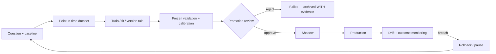

# Model and Algorithm Registry

**Last reviewed:** 2026-09-18 · **Owner:** TBD

Covers deterministic rules, heuristics, statistical systems, trained estimators and LLM
nodes — a model is anything that produces a decision, not only a fitted estimator.

**Column contract.** The previous revision shipped every row shifted one position left, so
lifecycle status appeared under "Runtime exposure" and the recommendation under "Status".
Columns below are: **Status** = lifecycle state from the controlled vocabulary in the
[README](README.md); **Rec** = KEEP / RETEST / RESTRUCTURE / PAUSE / REMOVE; **Doc** =
doc-health from the same README vocabulary (`CURRENT` / `UNVERIFIED` / `CONTRADICTED` /
`NONE`), recording whether the documentation still agrees with the code.

**Issue-state caveat.** Blocking-issue links are a snapshot, and a stale one is worse than
none: on 2026-09-15 this registry still cited [#825](https://github.com/TeneikaAskew/stocks/issues/825)
and [#900](https://github.com/TeneikaAskew/stocks/issues/900) as blockers when both had been
closed on 2026-09-14, so MODEL-BRIEF-001 appeared blocked while having no open blocker at
all. **Re-read every cited issue before acting on a row.** The offline test
`tests/meta/test_model_registry_consistency.py` cannot check issue state — see
[§ How this registry is kept honest](#how-this-registry-is-kept-honest).

**Evidence caveat.** Training cutoff, artifact version and historical results are
`UNKNOWN / NEEDS HISTORY TRACE` unless a versioned artifact or report proves them.
Results produced before the replay-integrity fixes land are not trustworthy evidence —
see [#906](https://github.com/TeneikaAskew/stocks/issues/906).

## Deterministic and heuristic systems

| ID | Name | Type | Decision produced | Code | Status | Rec | Doc | Blocking issues |
|---|---|---|---|---|---|---|---|---|
| MODEL-STRAT-001 | STRAT candle scenarios | Deterministic | classify bars 1 / 2U / 2D / 3 | `lib/strat.py` | Production but needs remediation | KEEP | UNVERIFIED | — |
| MODEL-FTFC-001 | Full Time Frame Continuity | Deterministic | multi-timeframe direction and alignment | `lib/strat.py`, `lib/exec_backtest/ftfc.py` | Production but needs remediation | RETEST | UNVERIFIED | [#884](https://github.com/TeneikaAskew/stocks/issues/884) weighted-vote semantics |
| MODEL-LEVEL-001 | Structural level state / magnitude | Heuristic | proximity, state, targets | `lib/strat_levels.py` | Production but needs remediation | RETEST | UNVERIFIED | [#866](https://github.com/TeneikaAskew/stocks/issues/866) PDH/PDL off-by-one · [#907](https://github.com/TeneikaAskew/stocks/issues/907) legacy positional fallback · [#908](https://github.com/TeneikaAskew/stocks/issues/908) executable repricing |
| MODEL-IND-001 | Technical indicators / RVOL / ORB | Deterministic / statistical | indicator and opening-range context | `lib/indicators.py`, `lib/signals.py` | Production but needs remediation | RETEST | UNVERIFIED | [#870](https://github.com/TeneikaAskew/stocks/issues/870) RSI warm-up · [#892](https://github.com/TeneikaAskew/stocks/issues/892) ATR warm-up · [#894](https://github.com/TeneikaAskew/stocks/issues/894) premarket bars in RTH VWAP · [#912](https://github.com/TeneikaAskew/stocks/issues/912) duplicate implementations |
| MODEL-MOM-001 | Momentum strategy | Heuristic | long/short eligibility | `lib/strategies/momentum.py`, `lib/strategies/config.py` (thresholds) | Production but needs remediation | RETEST | CURRENT · [doc](../models/MODEL-MOM-001.md) | [#285](https://github.com/TeneikaAskew/stocks/issues/285) duplicate inline path · [#701](https://github.com/TeneikaAskew/stocks/issues/701) two divergent voters |
| MODEL-MR-001 | Mean reversion strategy | Heuristic | reversion eligibility | `lib/signals.py` (live path — `evaluate_signal`), `lib/strategies/mean_reversion.py` (class form, not on the fire path), `lib/strategies/config.py` (thresholds) | Production but needs remediation | RETEST | CURRENT · [doc](../models/MODEL-MR-001.md) | [#249](https://github.com/TeneikaAskew/stocks/issues/249) walk-forward RSI thresholds |
| MODEL-AGREE-001 | Agreement scoring | Heuristic / ensemble | combine strategy evidence into a score | `lib/strategies/agreement.py` | Production but needs remediation | RESTRUCTURE | CURRENT · [doc](../models/MODEL-AGREE-001.md) | [#905](https://github.com/TeneikaAskew/stocks/issues/905) freeze and prospectively validate expectancy |
| MODEL-EXIT-001 | Exit / stop / target policy | Heuristic | exit, stop, target selection | `lib/strategies`, `gcp/signal_monitor.py`, `exit_config_overrides` | **Broken** | RESTRUCTURE | UNVERIFIED | [#815](https://github.com/TeneikaAskew/stocks/issues/815) live has no stop-loss, backtest does · [#816](https://github.com/TeneikaAskew/stocks/issues/816) daily loss limit structurally unenforceable · [#862](https://github.com/TeneikaAskew/stocks/issues/862) overrides 113 days stale on the live fire path · [#915](https://github.com/TeneikaAskew/stocks/issues/915) same-minute ordering |
| MODEL-BRIEF-001 | Brief bias / movement statement | Heuristic | market bias and explanation | `lib/strategies/brief_bias.py`, `lib/movement_statement.py` | Experimental | RETEST | CURRENT · [doc](../models/MODEL-BRIEF-001.md) | **none open** — [#900](https://github.com/TeneikaAskew/stocks/issues/900) closed 2026-09-14; the RETEST rests on no current blocker and needs a stated reason or a status change |
| MODEL-GAMMA-001 | Gamma / GEX regime and proximity | Deterministic / statistical | gamma exposure and regime context | `lib/gamma.py`, `lib/features/intraday_gex.py`, `lib/strategies/gamma_proximity.py` | **Retest Required** | RETEST | UNVERIFIED · [DOC-03](#documentation-coverage-and-freshness) | [#812](https://github.com/TeneikaAskew/stocks/issues/812) fabricated flips from float underflow · [#826](https://github.com/TeneikaAskew/stocks/issues/826) `or 0` on gamma/OI · [#871](https://github.com/TeneikaAskew/stocks/issues/871) contract multiplier · [#872](https://github.com/TeneikaAskew/stocks/issues/872) implied-move scaling · [#876](https://github.com/TeneikaAskew/stocks/issues/876) balance semantics · [#880](https://github.com/TeneikaAskew/stocks/issues/880) GEX scope · [#896](https://github.com/TeneikaAskew/stocks/issues/896) VEX invariants |
| MODEL-OPT-001 | Options Greeks / parity / theta | Statistical | Greeks, parity spot, theta path | `lib/options_greeks.py` | Production but needs remediation | RETEST | UNVERIFIED · [DOC-02](#documentation-coverage-and-freshness) | [#878](https://github.com/TeneikaAskew/stocks/issues/878) discount parity spot · [#927](https://github.com/TeneikaAskew/stocks/issues/927) hard-coded rates · [#607](https://github.com/TeneikaAskew/stocks/issues/607) 0DTE theta anchored to EOD |
| MODEL-EARN-001 | Earnings reaction analytics | Statistical / heuristic | event reaction and strategy lean | `lib/earnings_reactions.py` | Experimental | RETEST | CURRENT · [doc](../models/MODEL-EARN-001.md) | [#863](https://github.com/TeneikaAskew/stocks/issues/863) winners posted to Discord at 99 days old |
| MODEL-EARN-002 | Earnings-reaction setup classifier | Heuristic | one of four setup labels per upcoming reporter | `gcp/earnings_reactions_brief.py` (`classify_context`) | Experimental | RETEST | CURRENT · [doc](../models/MODEL-EARN-002.md) | **None filed.** Unevaluated — no experiment tests whether the labels precede the moves they name, and the output is a Discord embed with no table behind it |
| MODEL-PLAY-001 | Phase 6 playbook cards | Heuristic | per-ticker entry cards — setup, direction, confirmation checklist, target/stop | `scripts/analysis/phase6_playbook.py` | Experimental | RETEST | CURRENT · [doc](../models/MODEL-PLAY-001.md) | **None filed.** Card statistics are **in-sample** (no train/test split anywhere in the module) and the published `best_horizon` is an argmax over four holds scored on that same data (`:110`); no costs are modelled (`compute_card_stats` docstring) |
| MODEL-WATCH-001 | Long-side earnings watchlist | Heuristic | which upcoming reporters to consider a long-premium position on | `gcp/earnings_long_watchlist.py` | Experimental | RETEST | CURRENT · [doc](../models/MODEL-WATCH-001.md) | **None filed.** Unevaluated — `min_wins = 2` and the prior-winners-repeat premise carry no derivation and no experiment |
| MODEL-EWV-001 | Earnings Whispers strike verdicts | Deterministic | HIT / MISS / KEPT / ASSIGNED on each strike pick | `gcp/fetchers/evaluate_ew_strikes.py` | Production | KEEP | CURRENT · [doc](../models/MODEL-EWV-001.md) | **None filed.** A vendor-fetch failure and an unsupported strategy take the same `continue` (`:196-197`), so an outage is uncounted |
| MODEL-WEEK-001 | Weekend performance review | Heuristic | realized win rate per score bucket, labelled on the live ladder | `gcp/weekend_review.py` | Production but needs remediation | RESTRUCTURE | CURRENT · [doc](../models/MODEL-WEEK-001.md) | [#1137](https://github.com/TeneikaAskew/stocks/issues/1137) the module docstring claims a backtest comparison the code does not perform · seven §3.7 zero-coercions on financial fields (`:46`, `:50`, `:51`, `:60`, `:74`, `:87`, `:88`) |
| MODEL-QUAL-001 | Signal-quality classification and regression alarm | Deterministic / statistical | CLEAN_HIT / WRONG_DIRECTION / NOISE / MIXED per fire per horizon, and whether the clean rate has regressed | `scripts/signal_quality_report.py`, `gcp/signal_quality_alarm.py` | Production | RETEST | CURRENT · [doc](../models/MODEL-QUAL-001.md) | **None filed.** `CLEAN_THRESHOLD = 0.005` and `NOISE_THRESHOLD = 0.003` decide what counts as a hit for every strategy and carry no derivation; `ticker_calibration.threshold_clean` / `_wrong` / `_noise`, written quarterly by MODEL-CALIB-001, are never read by it |
| MODEL-RANK-001 | Candidate ranker | Heuristic / ensemble | rank trade candidates | `lib/agents/ranker` | Experimental | RESTRUCTURE | UNVERIFIED | — |

### MODEL-GAMMA-001 — what was and was not reproduced, 2026-08-30

**Correction.** An earlier revision of this section claimed
[#812](https://github.com/TeneikaAskew/stocks/issues/812) reproduced live on `main`. That
attribution was wrong and is withdrawn. The test used a chain with equal calls and puts at
identical strikes, so net gamma is zero by **symmetry**, not by the float underflow #812
describes. It demonstrated a real defect, but not that one.

Measured across the #942 merge (`lib/gamma.py::compute_gamma_flip_bs`):

| Case | `8eccde7` (pre-#942) | `b9621c4` (post-#942) |
|---|---|---|
| #812's own DoD case — pure-put 0DTE @ spot 600 | `None` | `None` |
| Balanced-symmetry chain @ spot 100 | **`100.0`** | **`100.0`** |

**On #812 itself:** not reproduced here on either commit. The constructed pure-put 0DTE case
returns `None` both before and after the fix, so this plan has **no evidence** that #812's
underflow mechanism is currently live. #812 remains **open** and its production evidence — 54
`gamma_levels_eod` flips >20% from spot, all on negative-GEX days — stands on its own; it was
established from production data, not from a synthetic chain, and nothing here contradicts it.
Reproducing it needs the real chain that produced `gamma_flip = 424.5 at spot 600`, not a
constructed one.

**Separately, a degenerate case that survives #942:** a chain whose net gamma is identically zero
at every candidate spot returns the spot itself rather than `None`. The docstring's own contract
says it should return `None` when *"G(S) does not change sign anywhere"*, and an identically-zero
G(S) never changes sign. This is narrow — it needs matched call/put open interest at identical
strikes and expiries — and it is **not** filed as an issue. Treat it as an unverified observation
needing a production-data check before anyone opens one.

**#942 merged** (`b9621c4`, 2026-08-30) and carries the "reject gamma underflow as a flip" change
originally proposed in [#936](https://github.com/TeneikaAskew/stocks/pull/936), plus log-space
`_stable_net_gamma` so the PDF cannot underflow, and 136 lines of new tests. #812's remaining
Definition-of-done items — re-running the production query and deciding on the 54 contaminated
rows — are what keep it open.

## Learned models

| ID | Name | Type | Decision produced | Code / artifact | Status | Rec | Doc | Evidence |
|---|---|---|---|---|---|---|---|---|
| MODEL-MAG-001 | Magnitude prediction | ML | target magnitude class / probability | `gcp/research/magnitude_engine`, `platform/api/routers/magnitude.py` | **Invalidated** — but see below, it is not idle | PAUSE | **CONTRADICTED** · [DOC-06](#documentation-coverage-and-freshness) | Research arc closed **PROJECT VERDICT FAIL by gate 7** ([#575](https://github.com/TeneikaAskew/stocks/pull/575)). Later argmax-collapse incident: predicted TIGHT on 588/588 live bars; promotion gate added in [#810](https://github.com/TeneikaAskew/stocks/pull/810), no-op fixed in [#811](https://github.com/TeneikaAskew/stocks/pull/811). **In flight:** [#1117](https://github.com/TeneikaAskew/stocks/pull/1117) changes what is scored, addressing the collapse. Open: [#874](https://github.com/TeneikaAskew/stocks/issues/874), [#875](https://github.com/TeneikaAskew/stocks/issues/875), [#890](https://github.com/TeneikaAskew/stocks/issues/890) |
| MODEL-DIR-001 | STRAT direction model | ML | direction classification | `gcp/research/strat_engine` | **Failed** | REMOVE | UNVERIFIED | Archive rather than delete — the negative result is evidence. Directionality research verdict **DEAD-END** ([#588](https://github.com/TeneikaAskew/stocks/pull/588)); experimental direction features **FAIL** ([#566](https://github.com/TeneikaAskew/stocks/pull/566)) |
| MODEL-TYPE-001 | STRAT type / structure continuation | ML | scenario / type classification | `gcp/research/strat_engine` | Shadow | RETEST | UNVERIFIED · [DOC-07](#documentation-coverage-and-freshness) | Wired behind a feature flag ([#647](https://github.com/TeneikaAskew/stocks/pull/647)); QQQ-30m explicitly gated as not calibrated ([#648](https://github.com/TeneikaAskew/stocks/pull/648)) |
| MODEL-NEXTBAR-001 | STRAT next-bar edge | Statistical / ML | next-candle prediction | `gcp/research/strat_engine`, `lib/strat.py` | Research | RETEST | UNVERIFIED | Held-out OOS forward-walk confirms edge ([#593](https://github.com/TeneikaAskew/stocks/pull/593), [#594](https://github.com/TeneikaAskew/stocks/pull/594)); CLV ablation quantifies mechanical vs genuine ([#595](https://github.com/TeneikaAskew/stocks/pull/595), [#598](https://github.com/TeneikaAskew/stocks/pull/598)) |
| MODEL-BREAK-001 | Breakout meta-model | ML / ensemble | filter / rank breakouts | `gcp/research`, `lib/strategies` | Research | RETEST | UNVERIFIED | Net reconfirmed in [#598](https://github.com/TeneikaAskew/stocks/pull/598) |
| MODEL-STYLE-001 | User style mining | ML | learned personal trading pattern | `lib/style_miner.py` (the miner), `lib/walk_forward.py` (validation), `platform/api/routers/backtest.py` (`/api/style/mine-and-validate`), `user_style_results` | Experimental | RETEST | CURRENT · [doc](../models/MODEL-STYLE-001.md) | Origin [#707](https://github.com/TeneikaAskew/stocks/pull/707) — walk-forward validated into the playbook seam |
| MODEL-CALIB-001 | Ticker threshold calibration (percentile) | Statistical | per-ticker ATR/RVOL/RSI thresholds written to `ticker_calibration` | `scripts/calibrate_thresholds.py`, `ticker_calibration` | **Retest Required** | RETEST | CURRENT · [doc](../models/MODEL-CALIB-001.md) | — no open issue names this system; **nothing in the ledger evaluates it**, which is the standing concern |
| MODEL-SWEEP-001 | Walk-forward parameter sweep | Statistical | winning exit/entry parameter set written to `exit_config_overrides` | `lib/walk_forward.py`, `scripts/run_param_sweep.py`, `scripts/run_walk_forward.py`, `scripts/calibrate_iwm_strat.py`, `exit_config_overrides` | **Invalidated** | RESTRUCTURE | CURRENT · [doc](../models/MODEL-SWEEP-001.md) | [#813](https://github.com/TeneikaAskew/stocks/issues/813) "out-of-sample" calibration is in-sample **and auto-writes production** · [#817](https://github.com/TeneikaAskew/stocks/issues/817) exhaustive in-sample mining, no multiple-testing control · [#886](https://github.com/TeneikaAskew/stocks/issues/886) survivorship bias · [#380](https://github.com/TeneikaAskew/stocks/issues/380) close the loop |
| MODEL-FEAT-X | Experimental feature families | Statistical | cross-asset / news / options / vol features | `lib/features/experimental` | Research | PAUSE | UNVERIFIED | [#784](https://github.com/TeneikaAskew/stocks/issues/784) incremental-vol ablation open |
| MODEL-FLOW-001 | Dealer flow-direction features | Statistical | directional dealer positioning — DEX / vanna / charm | `lib/features/flow_direction.py`, `gcp/build_options_daily_greeks.py`, `etf_options_daily_greeks` | **Failed** | PAUSE | CURRENT · [doc](../models/MODEL-FLOW-001.md) | **None filed.** Falsified by ledger B5 (E5) — *“slow daily positioning adds nothing, dilutes the lone edge”* — yet `options-daily-greeks` still materializes it every weekday and no production path reads the table |

## LLM nodes

Full graph, concurrency and risk controls: [08](08-AI-AGENT-ARCHITECTURE.md). All 14 nodes
are **Experimental**; none has promotion evidence.

| ID | Nodes | Count | Code | Numeric authority | Status |
|---|---|---|---|---|---|
| MODEL-LLM-ANALYST | market, strat, options, gamma, catalyst, sentiment | 6 | `lib/agents/orchestrator.py`, `lib/agents/prompts.py` | explanation only | Experimental |
| MODEL-LLM-DEBATE | bull, bear | 2 | `lib/agents/orchestrator.py` | explanation only | Experimental |
| MODEL-LLM-JUDGE | research_manager | 1 | `lib/agents/orchestrator.py` | no invented confidence or levels | Experimental |
| MODEL-LLM-TRADER | trader | 1 | `lib/agents/orchestrator.py` | narrative over deterministic inputs | Experimental |
| MODEL-LLM-RISK | aggressive, conservative, neutral | 3 | `lib/agents/orchestrator.py` | **numeric plan field discarded** (`lib/agents/orchestrator.py:490-492`) | Experimental |
| MODEL-LLM-PM | portfolio_manager | 1 | `lib/agents/orchestrator.py` | obeys exposure/config constraints | Experimental |
| MODEL-SUM-001 | deterministic + LLM summarizers | — | `lib/agents/summarizers.py` | preserve supplied values | Experimental — [#827](https://github.com/TeneikaAskew/stocks/issues/827) silent fallback |

## Status summary

| Status | Models |
|---|---|
| Production but needs remediation | 9 |
| **Production** | 2 (MODEL-EWV-001, MODEL-QUAL-001) |
| Broken | 1 (MODEL-EXIT-001) |
| Retest Required | 2 (MODEL-GAMMA-001, MODEL-CALIB-001) |
| Invalidated | 2 (MODEL-MAG-001, MODEL-SWEEP-001) |
| Failed | 2 (MODEL-DIR-001, MODEL-FLOW-001) |
| Shadow | 1 (MODEL-TYPE-001) |
| Research | 3 |
| Experimental | 7 (MODEL-BRIEF-001, MODEL-EARN-001, MODEL-EARN-002, MODEL-PLAY-001, MODEL-RANK-001, MODEL-STYLE-001, MODEL-WATCH-001) + 7 LLM node groups |

**29 `MODEL-*` rows**, up from 24 on 2026-09-18 when the scheduler sweep registered five
systems that had been running unregistered: MODEL-PLAY-001, MODEL-WATCH-001, MODEL-EWV-001,
MODEL-WEEK-001 and MODEL-QUAL-001. The two new `Production` rows are the first on this table —
both are **measurement** systems (strike verdicts, signal classification) rather than
predictors, which is the only reason they clear a bar nothing else here does.

**No model in this repository currently meets the promotion bar.** Two carry explicit
recorded FAIL/DEAD-END verdicts ([#575](https://github.com/TeneikaAskew/stocks/pull/575),
[#588](https://github.com/TeneikaAskew/stocks/pull/588)) and are retained here deliberately —
negative results are evidence and must stay visible.

## Promotion criteria

Promotion requires REQ-MODEL-001..003: point-in-time-safe feature generation; a frozen
validation set unseen during selection; realistic costs and session semantics; comparison
against a stated baseline; cohort and sample-size reporting; calibration where probabilistic;
a threshold fixed in advance; shadow evidence; artifact/version lineage; monitoring and a
rollback path. Deterministic systems require shared live/replay fixtures and versioned
configuration. **Training must not write production as a side effect of a job completing**
— the precedent gate is `mag_walk_forward.promotion_verdict` from
[#810](https://github.com/TeneikaAskew/stocks/pull/810); reuse it rather than adding a second mechanism.

## Experiment traceability

**What this is.** The research program numbers its work `E-01…E-34` in
[`docs/EXPERIMENT_REGISTRY.md`](../EXPERIMENT_REGISTRY.md); this registry numbers the
same work `MODEL-*`. Until 2026-09-15 nothing joined the two schemes, so a `MODEL-*`
status could not be traced back to the folds that produced it. This table is that join.

**Evidence basis: `CLAIMED — DOCUMENTATION`.** Every row was read off the registry and
verdict documents named in it, not re-measured. The **evidence caveat** at the top of
this document still governs: results predating the replay-integrity fixes are not
trustworthy evidence ([#906](https://github.com/TeneikaAskew/stocks/issues/906)).

| Model | Experiments | Primary code | Deep doc | Recorded verdict |
|---|---|---|---|---|
| MODEL-TYPE-001 | E-01, E-02, E-03, E-04, E-05, E-06, E-19 (STRAT half), E-20 (probability calibration), E-23 (execution test) | `gcp/research/strat_engine/strat_walk_forward{,_adaptive}.py`, `strat_pred_train.py`, `strat_pred_per_class.py` | [MODEL_REGISTRY §A1](../MODEL_REGISTRY.md) · [STRAT_ENGINE_ARCHITECTURE](../STRAT_ENGINE_ARCHITECTURE.md) · [STRAT_ENGINE_OPERATIONS](../STRAT_ENGINE_OPERATIONS.md) | **Two verdicts, both true.** Prediction: VALIDATED 8/8 folds, ECE ≤ 0.05 (5m/15m), 30m PARTIAL, leakage audit CLEAN (E-19). **Execution: FAIL** — E-23 tested this model's 0.55-confidence 2U/2D calls and got 0/8 positive-expectancy folds in every cell, net expectancy negative after friction ([EXEC_BACKTEST_RESULTS](../EXEC_BACKTEST_RESULTS.md)). Ops doc says **"ON THE SHELF"** |
| MODEL-DIR-001 | E-07, E-08, E-17, E-34 | `gcp/research/strat_engine/strat_dir_walk_forward{,_extended}.py`, `strat_dir_probes.py`, `dir_regime_walk_forward.py`, `gcp/research/direction_program/` | [DIRECTION_RESEARCH_RESULTS](../DIRECTION_RESEARCH_RESULTS.md) · [DIRECTION_FEATURES_R&D](../DIRECTION_FEATURES_R&D.md) · [DIRECTION_LITERATURE_SCAN](../DIRECTION_LITERATURE_SCAN.md) | **No generalizable directional edge**; baseline 0/72 folds; one unresolved IWM-only flicker |
| MODEL-MAG-001 | E-09…E-15, E-19, E-20 (probability calibration), E-34 (SIZE arm) | `gcp/research/magnitude_engine/` (`mag_walk_forward.py`, `mag_pred_train.py`, `mag_leakage_audit.py`, `mag_inference.py`) | [MAGNITUDE_ENGINE_RESULTS](../MAGNITUDE_ENGINE_RESULTS.md) · [MAGNITUDE_DIRECTIONAL_SESSION_HANDOFF](../MAGNITUDE_DIRECTIONAL_SESSION_HANDOFF.md) | **PROJECT VERDICT FAIL** — closed by gate 7, 2026-05-29. Size is learnable; nothing beats option IV |
| MODEL-BREAK-001 | E-18 ★, E-32 | `gcp/research/strat_engine/breakout_meta_walk_forward.py` | [MODEL_RETHINK_PLANS §RESULTS](../MODEL_RETHINK_PLANS.md) · [EXPERIMENT_REGISTRY §E-18](../EXPERIMENT_REGISTRY.md) | Gross 24/24. **Net fragile** — 2026-06-09 reconfirm: only IWM 5m clean net-positive (+0.110 R, 8/8); SPY/QQQ NET_FAIL |
| MODEL-NEXTBAR-001 | E-25 | `scripts/strat_forward_walk{,_oos}.py`, `strat_oos_{clv_ablation,multi_tf}.py`, `strat_clv_demech.py`, `strat_struct_backtest.py`, `strat_next_candle_analysis.py` | [EXPERIMENT_REGISTRY §E-25](../EXPERIMENT_REGISTRY.md) · [MODEL_REGISTRY §CAT-A8](../MODEL_REGISTRY.md) | Held-out OOS edge confirmed; CLV ablation shows it is largely **gap-mechanical** (CLV_LAG1 ≈ 0) |
| MODEL-CALIB-001 | — (no `E-` id) | `scripts/calibrate_thresholds.py` | **none** — no experiment in the ledger evaluates this system | **Unevaluated.** A rolling 60-day percentile calibrator, scheduled quarterly, writing thresholds MODEL-MOM-001 and MODEL-MR-001 read. Whether a 60-day percentile is the right operating threshold has never been tested |
| MODEL-SWEEP-001 | — (no `E-` id) | `lib/walk_forward.py`, `scripts/run_param_sweep.py`, `scripts/calibrate_iwm_strat.py`, `scripts/run_walk_forward.py` | **none** — no experiment in the ledger evaluates this system | **Invalidated** — [#813](https://github.com/TeneikaAskew/stocks/issues/813) “out-of-sample” calibration is in-sample and auto-writes production · [#817](https://github.com/TeneikaAskew/stocks/issues/817) exhaustive in-sample mining · [#886](https://github.com/TeneikaAskew/stocks/issues/886) survivorship bias |
| MODEL-FEAT-X | E-08 (C-news / C-xasset / C-vol / C-options) — committed; **E-34** (Phase 2 feature-family ablation, five families in isolation and full stack via `--features`); E-26, E-31, E-33 — **scratch harness, artifacts unavailable** | E-08: `lib/features/experimental/`. E-34's families: `gcp/research/direction_program/phase2_features.py`. E-26/E-31/E-33: **no code committed** — the ledger records their result JSONs as retained by the author only, so nothing here reproduces them | [DIRECTION_FEATURES_R&D](../DIRECTION_FEATURES_R&D.md) | **FAIL** — three orthogonal families, 0/8 folds each; vol-regime and external-data probes NEUTRAL |
| MODEL-FLOW-001 | **B5 (E5)** — Book II thematic ledger, not an `E-nn` id | `lib/features/flow_direction.py`, `gcp/build_options_daily_greeks.py` | [EXPERIMENT_REGISTRY §B5](../EXPERIMENT_REGISTRY.md) | **failed (null + dilutive)** — IWM +0.053/z2.85 → −0.008/z−0.49; fires 726→881 while precision falls |
| MODEL-GAMMA-001 | E-22 (P2), E-24 | `gcp/research/p2_build_gamma_levels.py`, `p2_outcomes_grid.py`, `lib/gamma.py`, `lib/features/intraday_gex.py` | [docs/research/2026-05-23/P2_gamma_outcomes.md](../research/2026-05-23/P2_gamma_outcomes.md) · [gamma_levels.md](../gamma_levels.md) · [GAMMA_BALANCE_AUDIT](../audits/GAMMA_BALANCE_AUDIT_2026-08-25.md) | VOL signal confirmed, **direction null**; E-24 fixed a `gamma_regime` sign inversion at source |
| MODEL-STYLE-001 | — (no `E-` id) | `lib/style_miner.py`, `platform/api/routers/backtest.py` | [#707](https://github.com/TeneikaAskew/stocks/pull/707) | Walk-forward validated into the playbook seam |
| MODEL-RANK-001 | — (no `E-` id) | `lib/agents/ranker/` | [08](08-AI-AGENT-ARCHITECTURE.md) | Experimental; no promotion evidence |

> **E-20 is deliberately not mapped here.** E-20 asks whether sigmoid or isotonic
> post-hoc calibration improves a LightGBM model's probability ECE, and its artifacts are
> `strat_config.py` / `mag_config.py` — it is a property of the TYPE and MAG engines.
> `MODEL-CALIB-001` is the per-ticker *threshold* system that writes the `ticker_calibration`
> table. They share only the word "calibration". Mapping E-20 to MODEL-CALIB-001 made a
> successful probability experiment look like evidence for a separately invalidated
> production threshold calibrator. E-20 is therefore **not mapped to MODEL-CALIB-001**;
> the ledger scopes it `both (calibration)`, so it is mapped to **MODEL-TYPE-001 and
> MODEL-MAG-001**, and
> MODEL-CALIB-001 carries no experiment. That absence is itself the finding: the system
> that writes thresholds into production has never been evaluated in the ledger.

### Experiments with no `MODEL-*` owner

Recorded so they are not mistaken for gaps in the research, nor for models under
governance. Each is real work with a real verdict that no row above claims.

> **E-22 is an umbrella, not a single experiment**, so it appears in both tables and
> that is not a contradiction: its **P2 (gamma outcomes) arm is owned** by
> MODEL-GAMMA-001 above; the rest of the P1–P7 program and the 7-phase analysis
> pipeline is descriptive work no model claims. The row below is scoped to that
> remainder. **E-23 is split the same way** — its shares-execution arm tested
> MODEL-TYPE-001's own predictions and is listed there; the options arm and the
> general cost/EV analysis belong to no model. Those two are the only split ids.

| Experiments | Subject | Where it lives | Verdict |
|---|---|---|---|
| E-16 | `INTRADAY-MOM` — Gao-Han-Li-Zhou intraday-momentum replication | `gcp/research/strat_engine/intraday_momentum.py` | Replication probe; never promoted to a `MODEL-*` row |
| E-21 | Archived P7 LightGBM + stacked-regression + voter pipeline | `gcp/research/_archive/p7*.py` (9 files) | Archived; precursor to MODEL-TYPE-001 |
| E-22 (excluding its P2 arm — see note above) | 2026-05-23 pre-registered P1–P7 program + the 7-phase analysis pipeline | `scripts/research/`, `scripts/analysis/phase1…phase7`, `docs/research/2026-05-2{3,4,5}/` | Descriptive / EDA; feeds several models, owned by none |
| E-23 (cross-cutting — its shares-execution arm is **also** MODEL-TYPE-001's, see the traceability table) | Cost / EV / friction analysis and the execution backtests | `lib/exec_backtest/`, `lib/options_exec_backtest/` | **FAIL** both — [EXEC_BACKTEST_RESULTS](../EXEC_BACKTEST_RESULTS.md), [OPTIONS_EXEC_BACKTEST_RESULTS](../OPTIONS_EXEC_BACKTEST_RESULTS.md) |
| E-27…E-30, P0.1 | 2026-07-06 forward-window / directional re-probe | scratch harness (**not committed**) | Probe only. Gate-7 re-run showed the apparent edge is a close-of-day benchmark artifact — **priced, not tradeable** |
| — | BSVP + scalping-lanes validation | `scripts/analysis/bsvp_validation.py` | [BSVP_VALIDATION_RESULTS](../BSVP_VALIDATION_RESULTS.md) — 11.5 years of intraday data |

### Which of these actually run

**The rule, replacing the one that failed three rounds running.**

> A scheduled job is **model-bearing** when it produces a **decision, a label or a verdict
> about a trade, a signal or a position** that **reaches a person or a served surface** —
> wherever its thresholds live.

Until 2026-09-18 the working test here was *"does the job import `lib/` code cited in a
`MODEL-*` row"*. That is a **proxy** for the rule above, and it misses every job that hard-codes
its own thresholds. Three consecutive review rounds on PR
[#1111](https://github.com/TeneikaAskew/stocks/pull/1111) each found a scheduled decision system
with no row here — MODEL-FLOW-001, then MODEL-EARN-002, then four more — and all six were
missed the same way. The proxy is now **one sufficient signal, not the definition**.

Two clauses of the rule are doing real work:

- **"about a trade, a signal or a position"** is what keeps ops alarms out.
  `audit-infra-drift-daily` and the two `freshness-watchdog` schedulers post to Discord and a
  person acts on them, so "reaches a person" alone would sweep them in. They decide nothing
  about a position.
- **"reaches a person or a served surface"** is what keeps pure ingest out — and it is a claim
  about a **reader**, not about a write. `regime-combo-weekly` writes `regime_combo_results`
  every Sunday and **nothing in this repository reads that table**: not a router, not another
  job, not the frontend. It stays listed below because an operator paying for it weekly should
  know that, but it is the one row whose output reaches nobody.

**Still no count**, for the reason recorded below. The two tables together must cover every
scheduler in `gcp/deploy.sh`, and `scripts/audit_scheduler_coverage.py` fails the build if one
is missing from both — so a new scheduler cannot be silently unclassified, which is how
`signal-monitor-daily` and the six above went missing.

> **The exclusion this replaces was wrong, and its own words said so.** The previous revision
> excluded `phase6-playbook-daily` on the grounds that it *"has no `from lib.` import of its own
> and writes markdown **decision cards** from earlier phases' output"*. A sentence arguing that a
> job is not a decision system, containing the phrase "decision cards". It passes `--write-db`
> (`gcp/deploy.sh:4430`) and upserts `playbook_cards`
> (`scripts/analysis/phase6_playbook.py:942-993`), which `/api/playbook` serves. Recorded as
> DOC-35. That paragraph existed *because* exclusions should be visible rather than silent; the
> first one written down was false, which is the argument for the gate rather than against the
> practice.

> **An earlier revision of this paragraph used `fred-rates-daily` as its first example and said
> it imports `lib/options_greeks.py`. It does not** — `gcp/fetchers/fetch_fred_rates.py:15` is a
> **docstring mention**; the file's only `lib` import is `lib.logging_config`. Both examples in a
> paragraph arguing for evidence over derived numbers were asserted without being checked, and
> one was false. Recorded as DOC-28.

> **Why the number is gone.** It was stated as `eight`, corrected to `fourteen` on
> 2026-09-17, and was still wrong, because it was derived by hand from a rule that — applied
> literally — sweeps in every fetcher that touches a `lib/` helper. The eight also omitted
> `signal-monitor-daily`, the job that evaluates MODEL-MOM-001, MODEL-MR-001,
> MODEL-AGREE-001, MODEL-EXIT-001 and MODEL-BRIEF-001 every trading morning. Two wrong counts
> in two rounds is enough evidence that the number was the wrong thing to publish; the list
> is what readers actually need, and the test checks it for drift against `gcp/deploy.sh`.

The live fleet is larger — see [05-INFRASTRUCTURE](05-INFRASTRUCTURE.md) for the
declared-versus-live reconciliation.

| Scheduler | Cron (`America/New_York`) | Job | Serves |
|---|---|---|---|
| `strat-engine-daily` | `35 23 * * 1-5` | `strat-engine` | MODEL-TYPE-001 |
| `magnitude-inference-daily` | `25 9 * * 1-5` | `magnitude-inference` | MODEL-MAG-001 |
| `audit-magnitude-drift-daily` | `55 9 * * 1-5` | `audit-magnitude-drift` | MODEL-MAG-001 drift |
| `audit-walkforward-weekly` | `0 9 * * 6` | `audit-walkforward` | MODEL-MOM-001 / MODEL-MR-001 factor audit (`scripts.analysis.per_factor_walkforward`, read-only) |
| `regime-combo-weekly` | `0 5 * * 0` | `regime-combo` | combo mining (E-22) — writes `regime_combo_results`, and **nothing in this repo reads that table**. Owned by the ledger, not by a `MODEL-*` row, because it feeds no decision. Listed so the weekly spend is visible, not because anything consumes it |
| `calibrate-thresholds-quarterly` | `0 2 1 1,4,7,10 *` | `calibrate-thresholds` | MODEL-CALIB-001 writer (A), the percentile calibrator |
| `gamma-levels-daily` | `30 22 * * 1-5` | `p2-build-gamma-levels` | MODEL-GAMMA-001 |
| `audit-brief-bias-weekly` | `0 10 * * 0` | `audit-brief-bias` | MODEL-BRIEF-001 audit |
| `signal-monitor-daily` | `25 9 * * 1-5` | `signal-monitor` | **the live fire path** — MODEL-STRAT-001, MODEL-FTFC-001, MODEL-LEVEL-001, MODEL-IND-001, MODEL-MOM-001, MODEL-MR-001, MODEL-AGREE-001, MODEL-EXIT-001, MODEL-BRIEF-001 |
| `orb-15m-alert` | `45 9 * * 1-5` | `signal-monitor` | MODEL-IND-001 (opening range) |
| `orb-30m-alert` | `0 10 * * 1-5` | `signal-monitor` | MODEL-IND-001 (opening range) |
| `signal-monitor-eod-resolver-daily` | `30 16 * * 1-5` | `signal-monitor-eod-resolver` | MODEL-EXIT-001 outcomes |
| `realtime-gex-daily` | `0 17 * * 1-5` | `build-realtime-gex` | MODEL-GAMMA-001 |
| `refresh-earnings-views-weekly` | `0 20 * * 0` | `refresh-earnings-views` | MODEL-EARN-001 |
| `refresh-earnings-views-daily` | `30 7 * * 1-5` | `refresh-earnings-views` | MODEL-EARN-001 (declared via `_schedule_args`) |
| `premarket-playbook-resolver-daily` | `15 21 * * 1-5` | `premarket-playbook-resolver` | MODEL-LEVEL-001 (calls `build_level_map`) |
| `premarket-brief-daily` | `30 8 * * 1-5` | `premarket-brief` | MODEL-BRIEF-001 — and the MODEL-IND-001 / MODEL-STRAT-001 / MODEL-LEVEL-001 / mean-reversion condition helpers it imports at `gcp/premarket_brief.py:25-28`, plus MODEL-EARN-001 at `:615`. **Also a second live LLM path**: `lib.agents.summarizers` (`:131`), `lib.agents.trade_planner` (`:1416`) and, via `gcp/brief_explanations.py:114-115`, `lib.agents.llm_client` |
| `premarket-brief-sunday` | `0 21 * * 0` | `premarket-brief` | the same job, weekend refresh |
| `auto-refresh-top-n` | `10 8 * * 1-5` | `auto-refresh-top-n` | MODEL-RANK-001 — `lib.agents.ranker.rank_tickers` (`gcp/auto_refresh_top_n.py:53`), its only scheduled caller |
| `options-daily-features` | `0 22 * * 1-5` | `build-options-daily-features` | MODEL-FEAT-X — `lib.features.experimental.options_derived` (`gcp/fetchers/build_options_daily_features.py:30`) |
| `options-daily-greeks` | `15 23 * * 1-5` | `build-options-greeks` | MODEL-FLOW-001 — `lib.features.flow_direction` (lazy import at `gcp/build_options_daily_greeks.py:131`). **Live for a falsified feature set** — see the model's doc |
| `historical-signals-watchlist-daily` | `0 1 * * 2-6` | `historical-signals-watchlist` | MODEL-MOM-001 / MODEL-MR-001 / MODEL-IND-001 replayed over history — `MarketAnalyzer` (`scripts/run_historical_signals.py:40`), `lib.signals.generate_signals` (`:366`). The producer of `historical_signals` |
| `earnings-sweep-sunday` | `30 20 * * 0` | `earnings-sweep` | MODEL-EARN-001 — writes `earnings_calibration`; applying is the **default** (`--no-apply` opts out). **Declared in `gcp/deploy.sh:4707`, absent from the live fleet** — confirmed 2026-09-18 against `gcloud scheduler jobs list`, and pinned by `tests/scripts/test_doc_inventory.py:235` |
| `earnings-reactions-brief-daily` | `35 8 * * 1-5` | `earnings-reactions-brief` | MODEL-EARN-002 — `classify_context` (`gcp/earnings_reactions_brief.py:474`). Output is a Discord embed; there is no table behind it |
| `phase6-playbook-daily` | `30 4 * * 1-5` | `phase6-playbook` | MODEL-PLAY-001 — per-ticker entry cards, `"IF ALL CONFIRMED -> {direction} ENTRY"` (`scripts/analysis/phase6_playbook.py:305`), upserted to `playbook_cards` and served by `/api/playbook`. **Registered 2026-09-18**; it was the deliberate exclusion quoted above |
| `earnings-long-watchlist-sunday` | `45 19 * * 0` | `earnings-long-watchlist` | MODEL-WATCH-001 — ranks upcoming reporters by prior long-side wins, `HAVING COUNT(DISTINCT (structure, event_date)) >= :min_wins` (`gcp/earnings_long_watchlist.py:169`), Discord embed |
| `evaluate-ew-strikes-daily` | `0 23 * * 1-5` | `evaluate-ew-strikes` | MODEL-EWV-001 — HIT / MISS / KEPT / ASSIGNED verdicts on Earnings Whispers strike picks (`gcp/fetchers/evaluate_ew_strikes.py:51-103`), rendered by the premarket brief (`gcp/premarket_brief.py:2391-2396`) |
| `weekend-review-weekly` | `0 9 * * 6` | `weekend-review` | MODEL-WEEK-001 — realized win rate per score bucket, labelled with `get_signal_strength_label` (`gcp/weekend_review.py:72`), the same ladder `gcp/signal_monitor.py:1343` labels live fires with. Discord |
| `signal-quality-report-nightly` | `0 1 * * 2-6` | `signal-quality-report` | MODEL-QUAL-001 — classifies every historical fire at seven horizons into `signal_metrics` (`scripts/signal_quality_report.py:84-106`) |
| `signal-quality-alarm-daily` | `0 2 * * 2-6` | `signal-quality-alarm` | MODEL-QUAL-001 regression alarm — trailing-7d vs prior-7d clean rate, fires below `-3.0` pp on `>= 50` rows per window (`gcp/signal_quality_alarm.py:114-116`) |
| `insight-pipeline-daily` | `45 8 * * 1-5` | `insight-pipeline` | **all 14 LLM nodes** — `lib.agents.orchestrator.run_insight_pipeline`, imported at `gcp/insight_pipeline_job.py:69` and called at `:526` |
| `insight-discord-push-daily` | `15 9 * * 1-5` | `insight-discord-push` | the LLM nodes' delivery half — `lib.agents.model_routing` (`gcp/insight_discord_push.py:36`) |

`direction-baseline`, `direction-phase2`, `direction-probe`, `direction-importance`
and `param-sweep` are deployed but **unscheduled**;
`options-exec-backtest` is defined in `gcp/deploy.sh` but marked **not deployed**.

#### Deliberately not model-bearing

Every other scheduler in `gcp/deploy.sh`, with the reason. This table is not decoration: the
exclusions are what the gate checks, and an unrecorded exclusion is indistinguishable from an
omission. Each row was classified by reading the entrypoint, with
`scripts/audit_scheduler_coverage.py` printing the write / Discord / import evidence.

| Scheduler | Job | Why it is not model-bearing |
|---|---|---|
| `fetch-market-data-daily` | `fetch-market-data` | Vendor bars → `market_data_daily`. It **does** import `lib.indicators` and `lib.strat` (`gcp/fetchers/fetch_market_data.py:290`, `:333`) and writes their output as columns — those are model *inputs*, materialised for later readers. No decision is emitted |
| `backfill-indicators-daily` | `backfill-indicators` | Same computation over history (`gcp/fetchers/backfill_daily_indicators.py:304`, `:320`). Backfill of inputs |
| `premarket-refresh-daily` | `premarket-refresh` | Refreshes the current session's `market_data_daily` row before the brief reads it. Imports `lib.indicators`; emits no decision |
| `av-intraday-nightly` · `av-intraday-monthly` | `av-intraday` | AlphaVantage 1-min bars → `market_data_intraday`. Pure ingest |
| `av-options-daily` · `av-options-monthly` | `av-historical-options` | Historical options chains → `etf_options_snapshots`. Pure ingest |
| `av-options-realtime` | `av-realtime-options` | Intraday chain snapshot → `etf_options_snapshots`. Pure ingest |
| `daily-earnings-refresh-calendar` · `weekly-earnings-refresh-calendar` | `fetch-earnings-calendar` | Earnings dates → `earnings_calendar`. Ingest. (The **verdict** columns on the same table come from `evaluate-ew-strikes-daily`, which is listed above) |
| `daily-earnings-refresh-history` · `weekly-earnings-refresh-history` | `fetch-earnings-history` | Reported EPS / surprise → `earnings_history`. Ingest |
| `daily-earnings-refresh-reactions` · `weekly-earnings-refresh-reactions` | `compute-earnings-reactions` | Derives post-earnings move statistics into `earnings_reactions`. Descriptive statistics over history, not a call on any position; MODEL-EARN-001 is the model that reads them |
| `economic-events-daily` | `economic-events` | Calendar → `economic_events`. Ingest |
| `fred-rates-daily` | `fred-rates` | FRED series → `daily_rates`. Ingest. Its only `lib` import is `lib.logging_config` |
| `insider-transactions-daily` | `insider-transactions` | Form 4 filings → `insider_transactions`. Ingest |
| `sec-filings-intraday` | `sec-filings` | EDGAR filings → `sec_filings`. Ingest |
| `news-sentiment-hourly` · `news-sentiment-earnings-0600` · `news-topics-hourly` | `news-sentiment` | Vendor-scored sentiment → `news_sentiment`. The score is the **vendor's**; this job stores it |
| `top-movers-daily` · `top-movers-intraday-hourly` · `top-movers-intraday-close` | `top-movers` | Ranks by realized % change → `top_movers_daily` / `top_movers_intraday`. A sort of what already happened, with no threshold and no call |
| `freshness-watchdog-hourly` · `freshness-watchdog-nightly` | `freshness-watchdog` | Alarms when a table stops being written. Reaches a person, decides nothing about a position — the clause that keeps ops alarms out |
| `audit-infra-drift-daily` | `audit-infra-drift` | Same shape: deployed GCP state vs `gcp/deploy.sh`, Discord on drift. Infrastructure, not markets |
| `options-retention-daily` | `options-retention` | Prunes aged `etf_options_snapshots` rows. Storage housekeeping |
| `cloud-sql-weekly-export-sunday` | `cloud-sql-weekly-export` | `pg_dump` → GCS. The third backup layer; see CLAUDE.md § Backup and disaster recovery |
| `discord-warm-open` · `discord-warm-close` | *(service `discord-interactions`)* | Pings a Cloud Run **service** to beat the cold start inside Discord's 3-second interaction ack. Not a job at all |

### Research documentation corpus

The long-form evidence behind every verdict above. None of it was linked from this
plan before 2026-09-15.

| Doc | Holds |
|---|---|
| [`docs/models/`](../models/) | **Per-model reference docs** — behaviour, inputs, entry points, thresholds and test coverage for the seven models that previously had none. Each states its rationale or says `UNKNOWN` where the code does not record one |
| [EXPERIMENT_REGISTRY.md](../EXPERIMENT_REGISTRY.md) | **The experiment log.** Per-experiment ledger `E-01…E-34` (Book I) + thematic `G1–G7` / `A·B·C·D·P·L` ledger (Book II) |
| [RESEARCH_COMPENDIUM.md](../RESEARCH_COMPENDIUM.md) | Master research narrative (Part A) + the end-to-end experiment log (Part B, formerly `MODELS_END_TO_END.md`) |
| [MODEL_REGISTRY.md](../MODEL_REGISTRY.md) | Research-side model inventory — families A/B/C (Part A) + catalog `CAT-A0…CAT-A8` (Part B, formerly `MODEL_CATALOG.md`) |
| [INVESTMENT_MODELS_SUMMARY.md](../INVESTMENT_MODELS_SUMMARY.md) | Models #1–#5, `lib/`, the Strat classifier and the backtest engine (formerly also `MODEL_SUMMARY.md`) |
| [MODEL_RETHINK_PLANS.md](../MODEL_RETHINK_PLANS.md) | The B1–B3 "trade the underlying" pivot — why gate-7 dooms options-buying but not directional trading |
| [MAGNITUDE_ENGINE_RESULTS.md](../MAGNITUDE_ENGINE_RESULTS.md) · [MAGNITUDE_DIRECTIONAL_SESSION_HANDOFF.md](../MAGNITUDE_DIRECTIONAL_SESSION_HANDOFF.md) | Magnitude fold tables and the gate-7 closure |
| [DIRECTION_RESEARCH_RESULTS.md](../DIRECTION_RESEARCH_RESULTS.md) · [DIRECTION_FEATURES_R&D.md](../DIRECTION_FEATURES_R&D.md) · [DIRECTION_LITERATURE_SCAN.md](../DIRECTION_LITERATURE_SCAN.md) | Direction verdicts, feature-family R&D, Phase 0 literature |
| [EXEC_BACKTEST_RESULTS.md](../EXEC_BACKTEST_RESULTS.md) · [OPTIONS_EXEC_BACKTEST_RESULTS.md](../OPTIONS_EXEC_BACKTEST_RESULTS.md) · [BSVP_VALIDATION_RESULTS.md](../BSVP_VALIDATION_RESULTS.md) | Execution backtests and BSVP validation |
| [STRAT_ENGINE_AND_COMBO_PIPELINE.md](../STRAT_ENGINE_AND_COMBO_PIPELINE.md) · [STRAT_ENGINE_ARCHITECTURE.md](../STRAT_ENGINE_ARCHITECTURE.md) · [STRAT_ENGINE_OPERATIONS.md](../STRAT_ENGINE_OPERATIONS.md) · [STRAT_IMPLEMENTATION_PLAN.md](../STRAT_IMPLEMENTATION_PLAN.md) | Strat engine design, ERD, operations and build plan |
| [STRAT_METHODOLOGY.md](../STRAT_METHODOLOGY.md) · [gamma_levels.md](../gamma_levels.md) | Methodology references for MODEL-STRAT-001 and MODEL-GAMMA-001 |
| `docs/research/2026-05-2{3,4,5}/` | E-22 pre-registered P1–P7 program, with committed `data/` artifacts |
| `docs/superpowers/specs/`, `docs/superpowers/plans/` | Direction-predictability program design and phase plans |
| `notebooks/` | `p7_eda.ipynb`, `strat_pred_diagnose.ipynb`, `stock_analysis.ipynb`, `trade_analysis.ipynb` |

**Machine-written run records**, distinct from the prose above: the `job_runs` Cloud SQL
table (per-execution status and duration), `magnitude_walk_forward_results` and
`magnitude_per_bar_predictions` (created at runtime by `mag_walk_forward.py`, **not** in
`gcp/schema.sql`), `walk_forward_results`, `backtest_walk_forward_folds`, and the
append-only JSONL written by `gcp/research/direction_program/slice_ledger.py` — which is
per-run, uncommitted and never aggregated.

## Documentation coverage and freshness

The [corpus table](#research-documentation-corpus) above says what documentation exists.
This says what is **wrong** with it.

**What the `Doc` column does and does not promise.** A cell that cites a `DOC-nn` points at a
specific recorded concern, and every id it cites exists here — that is gated. A **bare
`UNVERIFIED`** means only that nobody has checked this model's documentation against its code;
it is not a claim that a finding exists. An earlier revision of this paragraph said every
non-`CURRENT` cell names a row here, which was false while the suite was green — the kind of
published contract a reader would reasonably rely on. Ten of the 29 rows are bare `UNVERIFIED`
today.

**Severity is the documentation scale from
[ARCHITECTURE_DOCS_AUDIT_2026-09-07](../audits/ARCHITECTURE_DOCS_AUDIT_2026-09-07.md) §2**,
reused verbatim rather than invented: **H** = a reader acting on it would do the wrong thing;
**M** = wrong count or name; **L** = stale wording. The `CRITICAL/P0/…` ladder is not used
here — that one belongs to code defects and is owned by
[12](12-PR-ISSUE-TRACEABILITY.md#severity-distribution-open).

### Findings

| ID | Doc | Claim → actual | Kind | Sev | Models |
|---|---|---|---|---|---|
| DOC-01 | `07` (this file) | Cited [#825](https://github.com/TeneikaAskew/stocks/issues/825) and [#900](https://github.com/TeneikaAskew/stocks/issues/900) as open blockers → both closed 2026-09-14 | closed-issue | **H** | MODEL-OPT-001, MODEL-BRIEF-001 |
| DOC-02 | `07` (this file) | MODEL-OPT-001 listed `platform/src/lib/greeksCalculator.ts` → file deleted; BS math is `lib/options_greeks.py`. The repo's own [BRIEFING_DECK](../BRIEFING_DECK.md) already recorded the deletion | dead-path | **H** | MODEL-OPT-001 |
| DOC-03 | `07` (this file) | "six model-bearing jobs are scheduled", `p2-build-gamma-levels` listed unscheduled → `gcp/deploy.sh:4410` declares `gamma-levels-daily`; it is **seven** | contradiction | **M** | MODEL-GAMMA-001 |
| DOC-04 | `07` (this file) | E-20 mapped to MODEL-CALIB-001 → E-20 is LightGBM *probability* calibration; MODEL-CALIB-001 is the per-ticker *threshold* writer. Unrelated systems sharing a word | contradiction | **H** | MODEL-CALIB-001, MODEL-TYPE-001 |
| DOC-05 | `07` (this file) | E-22 appeared as both owned and ownerless → it is an umbrella; only its P2 arm is owned | contradiction | **M** | MODEL-GAMMA-001 |
| DOC-06 | [MAGNITUDE_ENGINE_RESULTS](../MAGNITUDE_ENGINE_RESULTS.md) | Opens "PROJECT VERDICT: FAIL (closed 2026-05-29)" → the engine has source commits on 2026-09-11 and 2026-09-14, runs on two daily schedulers, and [#1025](https://github.com/TeneikaAskew/stocks/issues/1025) reports it argmax-collapsed and serving nothing since 2026-09-03. The doc reads as closed; the system is not | contradiction | **H** | MODEL-MAG-001 |
| DOC-07 | [STRUCTURE_BRIEF_DESIGN](../STRUCTURE_BRIEF_DESIGN.md) | "Deploy is blocked until Track B and Track C both report verdicts" → both reported **FAIL**. The gate condition is met and the doc never moved | stamp | **M** | MODEL-TYPE-001 |
| DOC-08 | `BACKTEST_RESULTS.md` (repo root) | Self-labelled "Auto-generated by `generate_backtest_report.py` — 2026-04-12" while the content is a frozen April snapshot. *This row first called the generator **dead**, on the evidence that `grep -rn generate_backtest_report .github/` is empty. The grep is correct and the inference was wrong: the `report` job was migrated to the on-demand `backtest-pipeline` Cloud Run Job (`gcp/deploy.sh:3013-3037`), which runs `scripts.run_pipeline`, invokes the generator as a subprocess (`scripts/run_pipeline.py:233-243`) and writes `backtest_reports` — executions on 2026-05-24, 2026-08-26 and 2026-08-27. `.github/workflows/backtest-pipeline.yml:3` says so itself. I searched the one directory the workload had been moved out of, under a convention this repo documents* | unsynchronized artifact | **M** | MODEL-CALIB-001 |
| DOC-09 ([#1118](https://github.com/TeneikaAskew/stocks/issues/1118)) | [INVESTMENT_MODELS_SUMMARY](../INVESTMENT_MODELS_SUMMARY.md) | `ticker_calibration` block says "auto-refreshed monthly" → the monthly workflow **does** call `scripts/refresh_calibration_table.py`, but as `python -m … \|\| echo "::warning::"`, so a failure is swallowed and the block silently ages. Data stamped 2026-07-01 | dead-generator | **M** | MODEL-CALIB-001 |
| DOC-10 | Seven models | No doc describes them beyond scattered plan/audit mentions: MODEL-MOM-001, MODEL-MR-001, MODEL-AGREE-001, MODEL-BRIEF-001, MODEL-EARN-001, MODEL-STYLE-001, MODEL-CALIB-001 — measured by searching `docs/` for each one's primary module | omission | **H** | (seven, listed) |
| DOC-11 | [README](README.md) master matrix | Lists **15 of the 29** models in the two registry tables. Absent: **MODEL-BREAK-001, MODEL-DIR-001, MODEL-EARN-002, MODEL-EWV-001, MODEL-FEAT-X, MODEL-FLOW-001, MODEL-MAG-001, MODEL-NEXTBAR-001, MODEL-PLAY-001, MODEL-QUAL-001, MODEL-RANK-001, MODEL-TYPE-001, MODEL-WATCH-001, MODEL-WEEK-001**. *Recomputed 2026-09-18 after the scheduler sweep added five rows; the README was not updated, so the absentee count went 9 → 14 while the fraction's numerator stayed put.* *An earlier revision of this row said "every learned model is absent" and listed MODEL-SUM-001 — both wrong: MODEL-CALIB-001 and MODEL-STYLE-001 are learned and **are** present at README:138, MODEL-RANK-001 is heuristic not learned, and the actually-absent MODEL-FEAT-X was missing from the list. Recomputed from the tables rather than restated* | omission | **M** | (fourteen, listed) |
| DOC-12 | [05-INFRASTRUCTURE](05-INFRASTRUCTURE.md) | "Cloud Run jobs (67 declared / 76 live)… Scheduler (65 live)" → `doc_inventory.py` parses **68** declared jobs and **66** declared schedulers | stamp | **M** | — |
| DOC-13 | `docs/product/*.md` | A first pass counted **57** dead repo-rooted paths across the product plan. Re-measured: **27 distinct**, and **22 of those are not debt** — they are `platform/src/**` and frontend `*.spec.ts` paths the #957 split moved to `TeneikaAskew/solyra`, cited deliberately and explained by a header note in [11](11-CODE-TRACEABILITY.md). Genuinely dead: **2** (`scripts/backfill_signals.py`, `scripts/validate_track2_live.py`). Relocatable and now fixed: **2** (`gcp/freshness_watchdog.py` → `scripts/audit_data_freshness.py`, which is what `gcp/deploy.sh:2471` actually runs; `lib/data_loader` → `lib/data_loader.py`) | dead-path | **M** | — |
| DOC-18 | `lib/strategies/momentum.py`, `lib/strategies/mean_reversion.py` | **Module docstrings describe behaviour the code no longer has.** momentum's lists `StochRSI < 80` (dropped in Phase 0.7.1) and omits `rvol_above_recent` / `atr_expansion` / `rsi_thrust` (added since); mean_reversion's lists an EMA-proximity condition that **does not exist**. momentum's *function* docstring also says `min_conditions=3` while `config.py:108` sets `MIN_CONDITIONS_MOMENTUM = 5`, and says `consecutive_up` was "relaxed ... to 3-of-5" (`:57`) while the body reads the 3-of-3 column (`:78`) and `config.py:101-103` records the reversion. `lib/movement_statement.py:1-7` still says "PHASE 2 (feature-flagged, NOT user-facing) ... Nothing here renders to users" while `platform/deploy.sh:177` sets the flag `true` and `dashboard.py:530-545` serves the card | contradiction | **H** | MODEL-MOM-001, MODEL-MR-001, MODEL-BRIEF-001 |
| DOC-19 | `docs/models/*` (this PR's own first revision) | Six of the seven new reference docs misdescribed production, because they were assembled from **module** docstrings rather than the scoring functions: MOM and MR described a conjunction where the code scores a gate, EARN called recorded archetype thresholds `UNKNOWN`, BRIEF said a flag was `false` that is `true`, AGREE claimed a ranking that does not exist, STYLE listed 5 of 8 conditions | contradiction | **H** | six models |
| DOC-15 | `07` (this file) | MODEL-TYPE-001's row showed only its prediction verdict (VALIDATED 8/8) → E-23 tested that same model's 0.55-confidence calls and returned **0/8 positive-expectancy folds in every cell**, net negative after friction. Filing E-23 as ownerless hid the model's failed tradeability test | contradiction | **H** | MODEL-TYPE-001 |
| DOC-16 | `07` (this file) | E-19 assigned only to MODEL-MAG-001 → its ledger entry is `Engine/area: both (integrity)` and it names `strat_leakage_audit.py`; the integrity evidence underwriting the TYPE verdict was missing from TYPE's row | omission | **M** | MODEL-TYPE-001, MODEL-MAG-001 |
| DOC-17 | `07` (this file) | E-26 / E-31 / E-33 listed beside committed modules → the ledger records their results as from a scratch harness, *“not committed to the repo”* (`EXPERIMENT_REGISTRY.md:1260`); `phase2_features.py` belongs to E-34. The table implied code that reproduces them | dead-path | **M** | MODEL-FEAT-X |
| DOC-14 | Whole corpus | Git dates are unusable as a freshness signal: this is a shallow clone whose graft `4df291d` (2026-09-07) has no parent, so **187 of 220** docs show exactly one commit on that date regardless of when they were written | stamp | **M** | — |
| DOC-20 | `07` (this file) | The scheduler table claimed **eight** model-bearing cron jobs and omitted `signal-monitor-daily` — the live fire path running MODEL-MOM/MR/AGREE/EXIT/BRIEF every trading morning, plus the two ORB triggers, the EOD resolver, `realtime-gex-daily` and `refresh-earnings-views-weekly`. *This row first said the real count was **fourteen**; applied literally the stated rule also catches jobs that merely import model code, so fourteen was wrong too and the table now publishes no count at all — see DOC-22* | omission | **H** | MODEL-MOM-001, MODEL-MR-001, MODEL-AGREE-001, MODEL-EXIT-001, MODEL-BRIEF-001, MODEL-IND-001, MODEL-GAMMA-001, MODEL-EARN-001 |
| DOC-21 | `docs/models/*` (second round) | Eleven further errors in the reference docs, same class as DOC-19: thresholds labelled UNKNOWN that the source records (STYLE's sample floors, BRIEF's actionable threshold), a "canonical" implementation production does not call (`MeanReversionStrategy` vs `lib.signals.evaluate_signal`), a delegating wrapper that is a second implementation (`MarketAnalyzer.generate_technical_signals`), a reverted relaxation described as current (momentum 3-of-5), a tie-break that only applies on ties, two independent systems merged into one model record (MODEL-CALIB-001), and three EARN claims contradicted by source | contradiction | **H** | six models |
| DOC-22 | `07` (this file) + `docs/models/*` | Four corrections applied to one document and left standing in another: the MR registry row still named the non-production class after its doc was fixed; DOC-10's disposition still claimed MODEL-EARN-001 was the only model with a recorded derivation; the MODEL-CALIB-001 row still carried one `Invalidated` status after its doc documented the two-system split; and the scheduler count was corrected to a number that was still wrong. Fixing the instance is not fixing the claim | contradiction | **H** | MODEL-MR-001, MODEL-EARN-001, MODEL-CALIB-001, MODEL-SWEEP-001 |
| DOC-24 | `gcp/refresh_earnings_views.py` | `_derive_archetype` (`:312-336`) reimplements `classify_archetype`'s thresholds for the daily `earnings_upcoming_with_history` rebuild the watchlist reads (`platform/api/routers/earnings.py:122`) instead of calling it, and diverges on missing inputs: `dir_consistency` missing with `reversal_rate >= 0.40` → **`reversal_play`** where the canonical function returns `quiet` (`lib/earnings_reactions.py:481-482`); `reversal_rate` missing → a trend tag where canonical returns `quiet`; `bias = ... or 0.0` (`:328`). The reference doc claimed every consumer read one implementation | contradiction | **H** | MODEL-EARN-001 |
| DOC-23 | `lib/signals.py`, `lib/strategies/mean_reversion.py` | Two mean-reversion implementations. The live path is `lib.signals.evaluate_signal` (`gcp/signal_monitor.py:1107`), which alone applies `SignalConfig.min_conditions`, the per-ticker `consecutive_periods` override and the `disabled_conditions` / `disabled_directions` kill switches (`lib/signals.py:311-344`); `MeanReversionStrategy` is not called in production. The reference doc had called `lib/signals.py` "a thin shim re-exporting from" the class. No issue tracks the MR duplicate the way [#285](https://github.com/TeneikaAskew/stocks/issues/285) tracks momentum's | contradiction | **H** | MODEL-MR-001 |
| DOC-26 | `tests/meta/test_model_registry_consistency.py` | **Six gates reported green while checking less than the invariants table claimed.** A parenthetical suppressed a family mismatch without its contents ever being read, and a `cross-cutting` ledger scope passed on *any* model; the status vocabulary skipped `## LLM nodes`, a third of the inventory; the dead-path regex had no `:` in its character class, so every `file.py:NN` pointer matched nothing — and `docs/models/*.md` was not checked at all; ledger coverage asserted `ledger - owned` but never `owned - ledger`, so `E-99` was citable as evidence; `DOC-01…DOC-05` was not expanded in the disposition gate; and `re.findall(r"E-\d+")` parsed a phantom `E-001` out of `MODEL-AGREE-001` | contradiction | **H** | (the gate, not a model) |
| DOC-27 | `lib/earnings_reactions.py` | `query_typical_daily_return` normalizes over **64 returns, not the 60** its parameter is named for: it binds `window_days + 5` (`:619`), keeps 65 bars (`:599`) and drops one NULL `LAG` (`:616`), with no trim. The median is the divisor in `move_magnitude_norm` (`:199`) and the score is bucketed by fixed cut-points, so the four extra bars can move a name across a quintile. The `+ 5` carries no comment; only the consumer's docstring hedges, with a tilde (`:175`) | contradiction | **M** | MODEL-EARN-001 |
| DOC-28 | `07` (this file) | The scheduler table omitted **six** model-bearing entries, not the one review found: `premarket-brief-daily` / `-sunday` (five registry Code paths), `auto-refresh-top-n` (MODEL-RANK-001's only scheduled caller), `options-daily-features` (MODEL-FEAT-X), `historical-signals-watchlist-daily` (the producer of `historical_signals`) and `earnings-sweep-sunday` (MODEL-EARN-001's calibration writer, **declared but not live**). `MODEL_BEARING` named none of them — the DOC-20 mechanism again. In the same paragraph, **my own justifying example was false**: `fred-rates-daily` does not import `lib/options_greeks.py`; `gcp/fetchers/fetch_fred_rates.py:15` is a docstring mention | omission | **H** | MODEL-BRIEF-001, MODEL-RANK-001, MODEL-FEAT-X, MODEL-EARN-001, MODEL-MOM-001, MODEL-MR-001, MODEL-IND-001 |
| DOC-29 | `docs/models/MODEL-MOM-001.md`, `MODEL-MR-001.md` | Both documents described the scored conditions and the runtime kill switches and **never said when the strategy declines to evaluate at all**. Both classes hard-`return None` on a NaN indicator before scoring (`momentum.py:190-195`, `mean_reversion.py:151-155`), and momentum gates on `StochRSI_K` — a factor it removed from scoring in Phase 0.7.1. The gate outlived the factor | omission | **M** | MODEL-MOM-001, MODEL-MR-001 |
| DOC-30 | `07` (this file) + `BACKTEST_RESULTS.md` | DOC-08 classified the backtest report generator as **dead** on the evidence `grep -rn generate_backtest_report .github/` → empty. The grep was right; the inference was wrong — the workload was migrated to the `backtest-pipeline` Cloud Run Job and last ran 2026-08-27. I searched the directory the work had been moved out of, under a migration convention CLAUDE.md documents | contradiction | **M** | MODEL-CALIB-001 |
| DOC-31 | `docs/models/*.md` | Four issues were filed ([#1135](https://github.com/TeneikaAskew/stocks/issues/1135), [#1136](https://github.com/TeneikaAskew/stocks/issues/1136), [#1137](https://github.com/TeneikaAskew/stocks/issues/1137), [#1138](https://github.com/TeneikaAskew/stocks/issues/1138)) and the register's dispositions repointed at them — **and not one of the eight model docs was**. Two still read “No issue tracks this” and MODEL-BRIEF-001's `Known issues` still said “None open.” while #1137 named its stale header. DOC-22's class, committed in the commit recording DOC-22 closed | contradiction | **M** | MODEL-EARN-001, MODEL-MR-001, MODEL-MOM-001, MODEL-BRIEF-001 |
| DOC-32 | `lib/features/flow_direction.py` | A 587-line module computing dealer DEX / vanna / charm, writing `etf_options_daily_greeks` on a **live weekday cron** (`options-daily-greeks`, `15 23 * * 1-5`, ENABLED), cited across `EXPERIMENT_REGISTRY`, `RESEARCH_COMPENDIUM` and `06-DATA-ARCHITECTURE` — and named by **no** `MODEL-*` row. The completeness gate could not see its job, correctly: its rule is “executes code cited in a `MODEL-*` row”. The registry was short a model, not the whitelist an entry | omission | **H** | MODEL-FLOW-001 |
| DOC-33 | `gcp/earnings_reactions_brief.py` | `classify_context` (`:474-565`) assigns one of **four** setup labels from its own thresholds (`MIN_QUARTERS_FOR_CLASSIFICATION = 4`, `REVERSAL_HIGH = 0.40`, `DRIFT_HOT_PCT = 2.0`, `CONSISTENCY_HIGH = 0.60`), posts them to Discord every weekday — and was covered by no model row and no reference document. It shares **no code** with MODEL-EARN-001: `grep "lib\." gcp/earnings_reactions_brief.py` returns zero matches. It is the **fourth** archetype-shaped classifier in the earnings surface, after `classify_archetype`, `_derive_archetype` (#1135) and `recommended_structure` | omission | **H** | MODEL-EARN-002 |
| DOC-34 | `07` (this file) | The `## LLM nodes` table was the only `MODEL-*` table with **no `Code` column**, so the scheduler-completeness gate — whose rule is “executes code cited in a `MODEL-*` row” — could not see `insight-pipeline`, the job that runs all 14 registered LLM nodes on a weekday cron. Its one code pointer, `orchestrator.py:490-492`, sat in the *Numeric authority* prose and named no directory. `insight-discord-push-daily` was missing for the same reason, and `premarket-brief-daily`'s row never mentioned the second live LLM path it also runs | omission | **H** | the 7 LLM node groups |
| DOC-25 | `07` (this file) | The register's own Disposition table carried **two conflicting verdicts for DOC-24** — “FIXED HERE in the doc, FLAGGED at source” and “FLAGGED — needs a code fix” — left by the same renumbering that produced the DOC-23 collision, and the uniqueness gate written to catch that collision read only the Findings table. DOC-20's disposition also still claimed the scheduler count had been “corrected to fourteen” after the count was deleted | contradiction | **M** | MODEL-EARN-001, MODEL-MR-001 |
| DOC-35 | `07` (this file) | The deliberate-exclusion paragraph excluded `phase6-playbook-daily` because it *"has no `from lib.` import of its own and writes markdown **decision cards** from earlier phases' output"* — a sentence arguing a job is not a decision system, containing the phrase "decision cards". It passes `--write-db` (`gcp/deploy.sh:4430`) and upserts `playbook_cards` (`scripts/analysis/phase6_playbook.py:942-993`), which `/api/playbook` serves. The exclusion was written to make near-misses visible; the first one written down was false | wrong-claim | **H** | MODEL-PLAY-001 |
| DOC-36 | `gcp/weekend_review.py` | Module docstring (`:3-7`) says the job *"compares actual performance to backtest expectations"*. It does not — there is no backtest, expectation or prior referenced anywhere in the file; every number is a realized statistic over `trades`. Tracked under [#1137](https://github.com/TeneikaAskew/stocks/issues/1137) with the other stale module docstrings | wrong-claim | **M** | MODEL-WEEK-001 |
| DOC-37 | `scripts/audit_scheduler_coverage.py` | The sweep written to end the missed-scheduler pattern enumerated **61 of 63** schedulers and reported "61 declared, 61 resolved". Its parser matched line by line, so two `_schedule` calls split across a backslash continuation were never seen — and an entry a parser never sees cannot fail the assertion that every entry resolves. Caught by a *second* parser (the registry gate's `_declared_schedulers`) disagreeing by two, not by the check designed for it | wrong-claim | **H** | MODEL-QUAL-001 |

### Disposition

| ID | Disposition | Why |
|---|---|---|
| DOC-18 | **FIXED HERE** in the docs, **FLAGGED** at source | The reference docs now warn about each stale docstring and say which source to trust. Correcting the docstrings themselves touches `lib/strategies/` and `lib/movement_statement.py` and belongs in a code PR, not this docs PR — **filed as [#1137](https://github.com/TeneikaAskew/stocks/issues/1137)** |
| DOC-24 | **FIXED HERE** in the doc, **FLAGGED** at source | MODEL-EARN-001 now records the duplicate path and quotes the divergence. Routing `refresh_earnings_views.py` through `classify_archetype` changes a production job's output and needs a code PR with a before/after on the affected rows — **filed as [#1135](https://github.com/TeneikaAskew/stocks/issues/1135)** |
| DOC-23 | **FIXED HERE** in the doc, **FLAGGED** at source | MODEL-MR-001 now documents `lib.signals.evaluate_signal` as the live implementation, with the runtime gates only it applies. Making the module delegate to the class, or retiring the class, is code work — **filed as [#1136](https://github.com/TeneikaAskew/stocks/issues/1136)**, paired with [#285](https://github.com/TeneikaAskew/stocks/issues/285) so momentum and mean reversion converge the same way |
| DOC-19 | **FIXED HERE** | All six rewritten from the scoring functions, every condition and constant quoted with its `file:line`. Found by review, not by me — see the note under [How this registry is kept honest](#how-this-registry-is-kept-honest) |
| DOC-20 | **FIXED HERE** | Six rows added and `MODEL_BEARING` in the test extended so the completeness gate can see the fire path. The gate reported green throughout because its substring list never named `signal-monitor`. The count this finding corrected (eight → fourteen) was itself wrong, and is now **deleted rather than corrected a third time** — see DOC-22 |
| DOC-21 | **FIXED HERE** | All eleven rewritten against the cited `file:line`; the MODEL-CALIB-001 split is also recorded as an open decision in [15-OPEN-DECISIONS](15-OPEN-DECISIONS.md). Two recurring habits produced them: labelling a constant undocumented without reading the comment block above it, and naming a class canonical without checking which implementation the scheduled job calls |
| DOC-22 | **FIXED HERE** | MODEL-CALIB-001 split into the scheduled percentile calibrator and the new MODEL-SWEEP-001 (walk-forward, `Invalidated`, owns #813/#817/#886). The scheduler count is deleted rather than corrected a third time. Two new invariants gate the class: a model doc's named live implementation must appear in its registry `Code` cell, and no disposition may claim a model uniquely has a recorded derivation |
| DOC-25 | **FIXED HERE** | The duplicate row is deleted, DOC-20's disposition records that the count was **deleted** rather than corrected a third time, and a new invariant gates the half of the register the old one skipped. Repeating an id across rows stays legal — DOC-13 genuinely has a registry half and a path half — what is gated is two rows disagreeing about what was *done* |
| DOC-26 | **FIXED HERE** | All six widened and each mutation-tested: move `E-23` to MODEL-MAG-001, set an LLM row to `Bogus`, typo a `file.py:NN` pointer in a model doc, cite `E-99`, add a conflicting `DOC-03` row, revert `EXP_ID` to the bare pattern. The invariant descriptions in this section were rewritten to match what each gate now does — they had been describing the intent, not the code |
| DOC-27 | **FIXED HERE** in the doc, **FILED** as [#1138](https://github.com/TeneikaAskew/stocks/issues/1138) | MODEL-EARN-001 now records 65 bars in, 64 returns out, no trim, and that the `+ 5` is undocumented. Changing the SQL would move every playability score and re-bucket quintiles across the watchlist, so it is a code PR with a before/after, not an edit here |
| DOC-28 | **FIXED HERE** | Six rows added with their `deploy.sh` line and live state, `MODEL_BEARING` extended, the deliberate exclusions (`phase6-playbook-daily` and four fetchers) written down so an exclusion is not indistinguishable from an omission, and the false `fred-rates-daily` example replaced with two verified by reading the imports |
| DOC-29 | **FIXED HERE** | Each document gains an availability-gate section kept separate from its scored conditions, with the measurement that decides whether it matters: unreachable under `lib.indicators` (RSI never NaN, `StochRSI_K` NaN on bars 0-1, `min_bars_for_signals = 30`), reachable under `MarketAnalyzer`, which has no `fillna` and skips bars 3-15. That is the path populating `historical_signals`, so it is evidence for the backfill-interchangeability decision already open in 15-OPEN-DECISIONS |
| DOC-30 | **FIXED HERE** | Reclassified *dead-generator* → *unsynchronized artifact*, in the register and in `BACKTEST_RESULTS.md`'s own header, which repeated the inference. The sharper fact is that `run_pipeline.py` has no commit or upload step: the job renders into an ephemeral container filesystem and the canonical output is the `backtest_reports` row, so the checked-in copy **cannot** be refreshed by running the pipeline |
| DOC-31 | **FIXED HERE** | All four references repointed. New invariant `test_no_model_doc_denies_an_issue_the_register_names`: no model doc may deny an issue for a `DOC-nn` whose disposition names one. The two invariants added for DOC-22 both run doc → registry row; neither ran doc → disposition, which is the direction that failed |
| DOC-32 | **FIXED HERE** | Registered as **MODEL-FLOW-001** — `Failed` / `PAUSE`, with the ledger's B5 (E5) verdict (*falsified; null and dilutive*, IWM +0.053/z2.85 → −0.008/z−0.49). Only then added to `MODEL_BEARING` and the scheduler table, so the gate is satisfied rather than bypassed. The governance point is recorded, not decided: a daily cron has been materializing a falsified feature set whose only reader is a research probe |
| DOC-33 | **FIXED HERE** | Registered as **MODEL-EARN-002** — `Experimental` / `RETEST`, since no experiment tests whether the labels precede the moves they name. Registered separately rather than folded into MODEL-EARN-001, following the MODEL-FLOW-001 precedent from the same review cycle: it answers a different question (characterise the historical setup, not tag an archetype for sizing) and shares no code. The four-implementation count is recorded in its document, because the count is itself the observation |
| DOC-34 | **FIXED HERE** | The LLM table gains a `Code` column, `STATUS_COLUMN` moves 5 → 6, and the bare `orchestrator.py` pointer is repointed at `lib/agents/orchestrator.py`. Then `insight-pipeline`, `insight-discord-push` and `earnings-reactions-brief` join `MODEL_BEARING` and the scheduler table — in that order, so the gate is satisfied rather than bypassed. Same structural shape as DOC-32: the whitelist rule was right and the registry could not supply what it asked for |
| DOC-15, DOC-16, DOC-17 | **FIXED HERE** | Found by review, not by this audit — all three were verified against `EXPERIMENT_REGISTRY.md` and `EXEC_BACKTEST_RESULTS.md` before being corrected, and the join is now gated by `tests/meta/test_model_registry_consistency.py` |
| DOC-01…DOC-05 | **FIXED HERE** | Repo facts. Each was checked against the issue tracker, the filesystem or `gcp/deploy.sh` and corrected in this commit |
| DOC-07, DOC-08, DOC-13 (registry half), DOC-14 | **FIXED HERE** | Labelled in place with the measured reality; no result was rewritten |
| DOC-06 | **FLAGGED — needs measurement**, with a fix in flight | Whether recent engine work overturns the gate-7 FAIL is an experiment, not an edit. The verdict stands as recorded; the contradiction is now visible. [#1117](https://github.com/TeneikaAskew/stocks/pull/1117) (opened 2026-09-16) changes what the magnitude model scores — re-read this finding against it when it lands. Fully resolving it still means re-running gate 7 |
| DOC-09 | **FILED** as [#1118](https://github.com/TeneikaAskew/stocks/issues/1118) | The swallow at `refresh-architecture-docs.yml:895` is a real Rule 3.7 defect and is now tracked. Whether the block is *actually* stale still needs a live `ticker_calibration` read — the issue says so and gives the query rather than assuming |
| DOC-10 | **FIXED HERE** | Seven reference docs written to [`docs/models/`](../models/), from source and tests. Each carries a `Rationale` section that states the recorded derivation where one exists and says `UNKNOWN — not recorded in code or tests` where it does not. MODEL-EARN-001's quintiles trace to a 21,592-prediction calibration; MOM and MR record single-change measurements (a walk-forward for MOM's floor, 72.2% and 84.6% fire rates for two dropped conditions); STYLE's floors trace to an endpoint contract; the operating bands of four models remain genuinely undocumented, and saying so is the finding |
| DOC-11 | **FLAGGED — needs your decision** | Which learned models deserve a master-matrix row is a capability question, not a correction |
| DOC-12 | **FLAGGED — deferred** | [#1060](https://github.com/TeneikaAskew/stocks/pull/1060) is an open PR refreshing the infrastructure docs; fixing the same counts here would collide |
| DOC-13 | **FIXED HERE** (mostly) | The two relocatable paths are repointed, and the test now classifies solyra-owned paths instead of counting them as rot — the backlog drops from 57 to **2**, both genuinely deleted scripts. A new invariant replaces the count: any doc citing a solyra path must say where the frontend went, which caught `16-CONSOLIDATION-AUDIT.md` doing so silently |

Merged-PR lineage for every model is owned by
[12](12-PR-ISSUE-TRACEABILITY.md#audit-prs); this section records only open work.
| DOC-35 | **FIXED HERE** | The inclusion rule is rewritten and published: *a scheduled job is model-bearing when it produces a decision, a label or a verdict about a trade, a signal or a position that reaches a person or a served surface — wherever its thresholds live.* Imports become one sufficient signal, not the definition. `phase6-playbook-daily` is registered as **MODEL-PLAY-001**, and every one of the 63 live schedulers now appears in the scheduler table or in a new **deliberate-exclusion table** with its reason, gated by `test_every_live_scheduler_is_classified` |
| DOC-36 | **RECORDED** | Stated in [MODEL-WEEK-001](../models/MODEL-WEEK-001.md) and added to [#1137](https://github.com/TeneikaAskew/stocks/issues/1137), which owns the stale-module-docstring class. Not fixed here: the code change is the docstring's, and the registry's job is to say what runs |
| DOC-37 | **FIXED HERE** | The parser joins backslash continuations before matching, and the module docstring records the failure in the terms that matter — *an assertion that every item resolves says nothing about items the enumeration missed.* The two schedulers it had hidden, `signal-quality-report-nightly` and `signal-quality-alarm-daily`, are registered as **MODEL-QUAL-001**. The durable lesson is that the second parser is what found it: `test_every_live_scheduler_is_classified` enumerates independently and disagreed by two |

### Open pull requests touching this surface

Read live 2026-09-16. Merged-PR lineage for every model is owned by
[12](12-PR-ISSUE-TRACEABILITY.md#audit-prs); this table is only what is in flight.

| PR | Opened | Scope | Bearing on this registry |
|---|---|---|---|
| [#1117](https://github.com/TeneikaAskew/stocks/pull/1117) | 2026-09-16 | `feat(magnitude): score the decision the consumer sees, not argmax` | **Directly addresses MODEL-MAG-001.** [#1025](https://github.com/TeneikaAskew/stocks/issues/1025) reports the serving model argmax-collapsed; this changes what is scored. If it lands, MODEL-MAG-001's status and DOC-06 both need re-reading against it |
| [#1111](https://github.com/TeneikaAskew/stocks/pull/1111) | 2026-09-15 | This work | — |
| [#1060](https://github.com/TeneikaAskew/stocks/pull/1060) | 2026-09-08 | Monthly architecture doc refresh (bot) | Touches `docs/product/infrastructure/05-a,05-c,05-d` and the root README. No model-registry overlap; owns the DOC-12 counts |
| [#1008](https://github.com/TeneikaAskew/stocks/pull/1008) | 2026-09-07 | Shared policy ownership, `lib/eastern_time.py` | None. Carries an audit doc (`PR_LANDING_ORDER_AUDIT_2026-09-07.md`, on that branch only) which is **self-marked a superseded snapshot** — do not read it as current evidence |

## How this registry is kept honest

`tests/meta/test_model_registry_consistency.py` runs in `make test` and in
`.github/workflows/backtest-pipeline.yml`. It pins, offline:

| Invariant | Catches |
|---|---|
| Every repo-rooted path cited here **and in `docs/models/*.md`** exists, `file.py:NN` pointers included | DOC-02 — a model naming deleted code. The path regex had no `:` in its character class, so every line-qualified pointer matched **nothing** and was never checked; the eight reference docs, the most pointer-dense in the corpus, were not read at all |
| Every relative link in `docs/product/*.md` resolves | The gap left by `check_generated_docs.py`, which covers only 05-a/05-c/05-d/README |
| Scheduler rows match `gcp/deploy.sh` name, cron and target; the "unscheduled" claim holds; **the section publishes no count to drift** | DOC-03, and DOC-20's successor — the gate used to check a sentence stating a number, and the number was wrong twice before the sentence was deleted |
| `N Cloud Run Jobs` matches the declared parse **and** is phrased `declared`, the subset cue `verify_docs_against_live.py` looks for | A correct declared count failing the daily live check |
| `Status` / `Doc` cells come from the vocabularies, parsed from [README](README.md) rather than retyped, across **all three** `MODEL-*` tables | Silent vocabulary drift — and the LLM-nodes table, which the first version left out entirely while publishing one vocabulary for the whole inventory |
| Every `DOC-nn` a model cites exists in the register | A dangling concern reference |
| Every scheduler row matches `deploy.sh`, **and every model-bearing scheduled job appears** | DOC-03, and the `audit-brief-bias-weekly` omission the first version of this gate still allowed |
| `Rec` comes from the KEEP/RETEST/RESTRUCTURE/PAUSE/REMOVE vocabulary | MODEL-DIR-001's `REMOVE / archive`, which the first version never checked |
| `Last reviewed` is not older than the newest date in the body | DOC-01's sibling — editing without advancing the stamp, which this branch's first commit did |
| Every issue cited here appears in [12](12-PR-ISSUE-TRACEABILITY.md) | The registry drifting away from the reconciled issue map |
| An experiment scoped `both` in the ledger appears on **both** engine models | DOC-16 — E-19's STRAT half, and E-20's magnitude half, each filed under one engine |
| An experiment cited on a model matches that model's family, or the pair is **declared in `ARM_OWNERSHIP`** | DOC-15 — E-23 attached to nothing, hiding MODEL-TYPE-001's failed execution test. Two escapes had reopened it: a `cross-cutting` scope passed on *any* model, and “some parentheses are present” never read what was inside them |
| An experiment the ledger marks *not committed* is not listed beside code paths | DOC-17 — E-26/E-31/E-33 implying a reproduction route that does not exist |
| Every experiment id the ledger declares is on a model's row or in the ownerless table, **and every id cited is one the ledger declares** — ranges expanded, and not parsed out of `MODEL-AGREE-001` | Total omission of a single-engine experiment — deleting E-01 from MODEL-TYPE-001 passed every earlier invariant |
| Experiments in ledger sections the parser cannot read carry explicit scope metadata and go through the family check | The `UNPARSED_LEDGER_SECTIONS` allowlist, which `continue`d past E-24, E-26…E-31, E-33 and E-34 |
| Model-bearing jobs whose name carries no model word (`signal-monitor`, its resolver) are matched, that classification is itself pinned, and completeness is keyed by **scheduler entry** rather than job — three entries target `signal-monitor`, so a job-keyed check let `signal-monitor-daily` be dropped while the ORB rows kept the job "listed" | DOC-20 |
| **Every `.py` in a model doc's `**Code:**` header** appears in its registry `Code` cell | DOC-22 — `MODEL-MR-001.md` was corrected to name `lib.signals.evaluate_signal` while the row it belongs to still listed only the class. The first two versions of this gate passed **vacuously**: one required a `.py` suffix the doc writes dotted, the next excluded `|`, which is the cell boundary |
| No disposition claims a model is the **only** one with a recorded derivation | DOC-22 — the earnings uniqueness claim, removed from the model doc and left standing in DOC-10's disposition |
| Every cross-document `#anchor` resolves against the target's headings | 16 dead links into `12-PR-ISSUE-TRACEABILITY.md`. The first slug function collapsed whitespace runs and reported 15 of the 16 healthy; GitHub replaces each space one-for-one, so an em-dash heading yields a double hyphen |
| One `DOC-nn`, one finding — counted, not collected into a set | The DOC-23 collision this branch committed while fixing the E-24/E-25 collisions. `test_every_non_current_doc_cell_names_a_finding` missed it because membership cannot see a duplicate |
| One `DOC-nn`, one **disposition verdict**, `DOC-01…DOC-05` ranges expanded | DOC-24 carrying both "FIXED HERE in the doc, FLAGGED at source" and "FLAGGED — needs a code fix". The uniqueness gate above stopped at the Findings table, so half the register was ungated and the suite stayed green |

Each invariant was mutation-tested: the defect was reintroduced and the test
confirmed red before being reverted.

**What it cannot do — and what that cost.** It cannot check whether a cited issue is
still *open*, and it cannot check whether a document's prose matches the code it
describes. The second limit is the expensive one: DOC-19 records six reference docs
that misdescribed production while every invariant here was green. **A passing suite
means the registry is internally consistent, not that it is true.**

The round-2 revision of this section claimed these invariants "replace" external
review. They do not. The review that followed found six holes in the invariants
themselves — an ID check that reset per table, a scheduler parser that read commented-out
declarations, a both-engines check that passed when an experiment was deleted from both,
a range parser that took only the endpoints, a silent `continue` on an unknown
experiment id, and a published contract this section stated that the test explicitly
permitted violating. All six are closed now. The review after that found three more,
of one shape — a check that verified what was present and never asked what was absent:
the scheduler gate matched model words and so never saw `signal-monitor`; the family
check skipped every id in its own allowlist; and nothing checked that a single-engine
experiment was on any table at all. The lesson is that the gate needs reading
adversarially by something other than its author. Two habits
cover the gap: re-read every cited issue before acting on a row, and treat the
`Doc` column as a claim about the last review, not about today. The nearest
offline proxy, that every cited issue appears in
[12](12-PR-ISSUE-TRACEABILITY.md), is asserted.

It also does **not** use git dates for staleness, deliberately. This repository is
a shallow clone: the graft commit `4df291d` (2026-09-07) has no parent, so 187 of
220 documents report exactly one commit on that date whatever their true age, and
CI checks out with no `fetch-depth` at all. A git-based freshness check would read
as green forever while measuring nothing (DOC-14).

## Traceability

| Aspect | Reference |
|---|---|
| Registry origin | [#591](https://github.com/TeneikaAskew/stocks/pull/591) exhaustive experiment registry · [#596](https://github.com/TeneikaAskew/stocks/pull/596) STRAT-NEXTBAR record |
| Validation framework | [#355](https://github.com/TeneikaAskew/stocks/pull/355) per-factor walk-forward · [#548](https://github.com/TeneikaAskew/stocks/pull/548) walk-forward as first-class pipeline stage · [#735](https://github.com/TeneikaAskew/stocks/pull/735) BSVP 11.5-year validation |
| Magnitude arc | [#597](https://github.com/TeneikaAskew/stocks/pull/597) productionize → [#575](https://github.com/TeneikaAskew/stocks/pull/575) FAIL verdict → [#629](https://github.com/TeneikaAskew/stocks/pull/629)/[#637](https://github.com/TeneikaAskew/stocks/pull/637)/[#638](https://github.com/TeneikaAskew/stocks/pull/638) remediation → [#810](https://github.com/TeneikaAskew/stocks/pull/810) promotion gate → [#811](https://github.com/TeneikaAskew/stocks/pull/811) no-op fix |
| Governance | CLAUDE.md Rule 0, Rule 3.6, Rule 3.7; agents `replay-integrity-reviewer`, `trading-logic-reviewer`, `gcp-capacity-cost-reviewer` |
| Tests | `tests/test_walk_forward*.py`, `tests/test_strat*.py`, `tests/test_magnitude*.py`, `tests/test_gamma*.py` |
