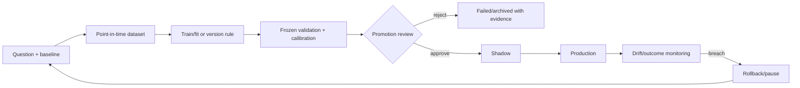

# Model and Algorithm Registry

This registry includes deterministic rules and LLMs, not only trained estimators. **Training cutoff, artifact version, historical result and promotion evidence are `UNKNOWN / NEEDS HISTORY TRACE` unless a versioned artifact/report proves them.** Audit-invalidated results are not trustworthy evidence.

| ID | Name | Type | Decision/output | Code/artifact locus | Runtime/user exposure | Status | Recommendation |
|---|---|---|---|---|---|---|---|
| MODEL-STRAT-001 | STRAT candle scenarios | Deterministic | classify bars 1/2U/2D/3 | lib/strat.py | Production but needs remediation | KEEP | UI/API/job where called; verify live routing |
| MODEL-FTFC-001 | Full Time Frame Continuity | Deterministic | multi-timeframe direction/alignment | lib/strat.py; lib/exec_backtest/ftfc.py | Production but needs remediation | RETEST | UI/API/job where called; verify live routing |
| MODEL-LEVEL-001 | Structural level state/magnitude | Heuristic | proximity/state/targets | lib/strat_levels.py | Production but needs remediation | RETEST | UI/API/job where called; verify live routing |
| MODEL-IND-001 | Technical indicators/RVOL/ORB | Deterministic/statistical | indicator and opening-range context | lib/indicators.py; lib/signals.py | Production but needs remediation | RETEST | UI/API/job where called; verify live routing |
| MODEL-MOM-001 | Momentum strategy | Heuristic | long/short eligibility | lib/strategies/momentum.py | Production but needs remediation | RETEST | UI/API/job where called; verify live routing |
| MODEL-MR-001 | Mean reversion strategy | Heuristic | reversion eligibility | lib/strategies/mean_reversion.py | Production but needs remediation | RETEST | UI/API/job where called; verify live routing |
| MODEL-AGREE-001 | Agreement scoring | Heuristic/ensemble | combine strategy evidence | lib/strategies/agreement.py | Production but needs remediation | RESTRUCTURE | UI/API/job where called; verify live routing |
| MODEL-BRIEF-001 | Brief bias/movement statement | Heuristic | market bias/explanation | lib/strategies/brief_bias.py; lib/movement_statement.py | Experimental | RETEST | UI/API/job where called; verify live routing |
| MODEL-GAMMA-001 | Gamma/GEX regime and proximity | Deterministic/statistical | gamma exposure/regime context | lib/gamma.py; lib/features/intraday_gex.py; lib/strategies/gamma_proximity.py | Retest Required | RETEST | UI/API/job where called; verify live routing |
| MODEL-MAG-001 | Magnitude prediction | ML | target magnitude/probability | gcp/research/magnitude_engine; platform/api/routers/magnitude.py | Invalidated | PAUSE | UI/API/job where called; verify live routing |
| MODEL-DIR-001 | STRAT direction model | ML | direction classification | gcp/research/strat_engine | Research | RETEST | UI/API/job where called; verify live routing |
| MODEL-TYPE-001 | STRAT type model | ML | scenario/type classification | gcp/research/strat_engine | Research | RETEST | UI/API/job where called; verify live routing |
| MODEL-BREAK-001 | Breakout meta-model | ML/ensemble | filter/rank breakouts | gcp/research; lib/strategies | Research | RETEST | UI/API/job where called; verify live routing |
| MODEL-EARN-001 | Earnings reaction/options analytics | Statistical/heuristic | event reaction/strategy lean | lib/earnings_reactions.py; gcp | Experimental | RETEST | UI/API/job where called; verify live routing |
| MODEL-RANK-001 | Candidate ranker | Heuristic/ensemble | rank trade candidates | lib/agents/ranker | Experimental | RESTRUCTURE | UI/API/job where called; verify live routing |
| MODEL-LLM-BULL | Bull analyst | LLM | bull evidence case | lib/agents/orchestrator.py; lib/agents/prompts.py | Experimental | RESTRUCTURE | UI/API/job where called; verify live routing |
| MODEL-LLM-BEAR | Bear analyst | LLM | bear evidence case | lib/agents/orchestrator.py; lib/agents/prompts.py | Experimental | RESTRUCTURE | UI/API/job where called; verify live routing |
| MODEL-LLM-JUDGE | Judge | LLM | synthesize competing cases | lib/agents/orchestrator.py | Experimental | RESTRUCTURE | UI/API/job where called; verify live routing |
| MODEL-LLM-TRADER | Trade planner/trader | LLM + deterministic | structured plan narrative | lib/agents/trade_planner.py; lib/agents/orchestrator.py | Experimental | RESTRUCTURE | UI/API/job where called; verify live routing |
| MODEL-LLM-RISK | Risk reviewer | LLM | risk critique/guardrails | lib/agents/orchestrator.py | Experimental | RETEST | UI/API/job where called; verify live routing |
| MODEL-LLM-PORT | Portfolio manager | LLM/ensemble | portfolio-level synthesis | lib/agents/orchestrator.py | Experimental | RESTRUCTURE | UI/API/job where called; verify live routing |
| MODEL-SUM-001 | Deterministic/LLM summarizers | Hybrid | compress evidence for agents/UI | lib/agents/summarizers.py | Experimental | RETEST | UI/API/job where called; verify live routing |
| MODEL-FEAT-X | Experimental feature families | Statistical | cross-asset/news/options/vol features | lib/features/experimental | Research | PAUSE | UI/API/job where called; verify live routing |

## Mandatory registry fields and promotion criteria
For every model, record purpose; inputs/features; labels/targets; training population/window/cutoff; artifact URI/hash/version; runtime consumer and structured output; production/user exposure; evaluation methodology and untouched results; calibration; leakage/validity findings; tests/PRs/issues; dependencies; rollback.

Promotion requires REQ-MODEL-001..003: point-in-time-safe feature generation, frozen validation unseen by selection, realistic costs/session semantics, strong baseline comparison, cohort/sample-size reporting, calibration, predefined threshold, shadow evidence, artifact/version lineage, monitoring and rollback. Deterministic systems require shared live/replay fixtures and versioned configuration. Failed/negative experiments stay visible; archives are not production.

## Lifecycle

