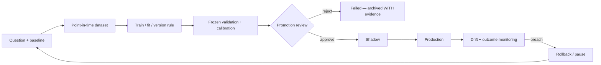

# Model and Algorithm Registry

**Last reviewed:** 2026-09-16 · **Owner:** TBD

Covers deterministic rules, heuristics, statistical systems, trained estimators and LLM
nodes — a model is anything that produces a decision, not only a fitted estimator.

**Column contract.** The previous revision shipped every row shifted one position left, so
lifecycle status appeared under "Runtime exposure" and the recommendation under "Status".
Columns below are: **Status** = lifecycle state from the controlled vocabulary in the
[README](README.md); **Rec** = KEEP / RETEST / RESTRUCTURE / PAUSE / REMOVE; **Doc** =
doc-health from the same README vocabulary (`CURRENT` / `UNVERIFIED` / `CONTRADICTED` /
`NONE`), recording whether the documentation still agrees with the code.

**Issue-state caveat.** Blocking-issue links are a snapshot, and a stale one is worse than
none: on 2026-09-15 this registry still cited [#825](https://github.com/TeneikaAskew/stocks/issues/825)
and [#900](https://github.com/TeneikaAskew/stocks/issues/900) as blockers when both had been
closed on 2026-09-14, so MODEL-BRIEF-001 appeared blocked while having no open blocker at
all. **Re-read every cited issue before acting on a row.** The offline test
`tests/meta/test_model_registry_consistency.py` cannot check issue state — see
[§ How this registry is kept honest](#how-this-registry-is-kept-honest).

**Evidence caveat.** Training cutoff, artifact version and historical results are
`UNKNOWN / NEEDS HISTORY TRACE` unless a versioned artifact or report proves them.
Results produced before the replay-integrity fixes land are not trustworthy evidence —
see [#906](https://github.com/TeneikaAskew/stocks/issues/906).

## Deterministic and heuristic systems

| ID | Name | Type | Decision produced | Code | Status | Rec | Doc | Blocking issues |
|---|---|---|---|---|---|---|---|---|
| MODEL-STRAT-001 | STRAT candle scenarios | Deterministic | classify bars 1 / 2U / 2D / 3 | `lib/strat.py` | Production but needs remediation | KEEP | UNVERIFIED | — |
| MODEL-FTFC-001 | Full Time Frame Continuity | Deterministic | multi-timeframe direction and alignment | `lib/strat.py`, `lib/exec_backtest/ftfc.py` | Production but needs remediation | RETEST | UNVERIFIED | [#884](https://github.com/TeneikaAskew/stocks/issues/884) weighted-vote semantics |
| MODEL-LEVEL-001 | Structural level state / magnitude | Heuristic | proximity, state, targets | `lib/strat_levels.py` | Production but needs remediation | RETEST | UNVERIFIED | [#866](https://github.com/TeneikaAskew/stocks/issues/866) PDH/PDL off-by-one · [#907](https://github.com/TeneikaAskew/stocks/issues/907) legacy positional fallback · [#908](https://github.com/TeneikaAskew/stocks/issues/908) executable repricing |
| MODEL-IND-001 | Technical indicators / RVOL / ORB | Deterministic / statistical | indicator and opening-range context | `lib/indicators.py`, `lib/signals.py` | Production but needs remediation | RETEST | UNVERIFIED | [#870](https://github.com/TeneikaAskew/stocks/issues/870) RSI warm-up · [#892](https://github.com/TeneikaAskew/stocks/issues/892) ATR warm-up · [#894](https://github.com/TeneikaAskew/stocks/issues/894) premarket bars in RTH VWAP · [#912](https://github.com/TeneikaAskew/stocks/issues/912) duplicate implementations |
| MODEL-MOM-001 | Momentum strategy | Heuristic | long/short eligibility | `lib/strategies/momentum.py` | Production but needs remediation | RETEST | CURRENT · [doc](../models/MODEL-MOM-001.md) | [#285](https://github.com/TeneikaAskew/stocks/issues/285) duplicate inline path · [#701](https://github.com/TeneikaAskew/stocks/issues/701) two divergent voters |
| MODEL-MR-001 | Mean reversion strategy | Heuristic | reversion eligibility | `lib/strategies/mean_reversion.py` | Production but needs remediation | RETEST | CURRENT · [doc](../models/MODEL-MR-001.md) | [#249](https://github.com/TeneikaAskew/stocks/issues/249) walk-forward RSI thresholds |
| MODEL-AGREE-001 | Agreement scoring | Heuristic / ensemble | combine strategy evidence into a score | `lib/strategies/agreement.py` | Production but needs remediation | RESTRUCTURE | CURRENT · [doc](../models/MODEL-AGREE-001.md) | [#905](https://github.com/TeneikaAskew/stocks/issues/905) freeze and prospectively validate expectancy |
| MODEL-EXIT-001 | Exit / stop / target policy | Heuristic | exit, stop, target selection | `lib/strategies`, `gcp/signal_monitor.py`, `exit_config_overrides` | **Broken** | RESTRUCTURE | UNVERIFIED | [#815](https://github.com/TeneikaAskew/stocks/issues/815) live has no stop-loss, backtest does · [#816](https://github.com/TeneikaAskew/stocks/issues/816) daily loss limit structurally unenforceable · [#862](https://github.com/TeneikaAskew/stocks/issues/862) overrides 113 days stale on the live fire path · [#915](https://github.com/TeneikaAskew/stocks/issues/915) same-minute ordering |
| MODEL-BRIEF-001 | Brief bias / movement statement | Heuristic | market bias and explanation | `lib/strategies/brief_bias.py`, `lib/movement_statement.py` | Experimental | RETEST | CURRENT · [doc](../models/MODEL-BRIEF-001.md) | **none open** — [#900](https://github.com/TeneikaAskew/stocks/issues/900) closed 2026-09-14; the RETEST rests on no current blocker and needs a stated reason or a status change |
| MODEL-GAMMA-001 | Gamma / GEX regime and proximity | Deterministic / statistical | gamma exposure and regime context | `lib/gamma.py`, `lib/features/intraday_gex.py`, `lib/strategies/gamma_proximity.py` | **Retest Required** | RETEST | UNVERIFIED · [DOC-03](#documentation-coverage-and-freshness) | [#812](https://github.com/TeneikaAskew/stocks/issues/812) fabricated flips from float underflow · [#826](https://github.com/TeneikaAskew/stocks/issues/826) `or 0` on gamma/OI · [#871](https://github.com/TeneikaAskew/stocks/issues/871) contract multiplier · [#872](https://github.com/TeneikaAskew/stocks/issues/872) implied-move scaling · [#876](https://github.com/TeneikaAskew/stocks/issues/876) balance semantics · [#880](https://github.com/TeneikaAskew/stocks/issues/880) GEX scope · [#896](https://github.com/TeneikaAskew/stocks/issues/896) VEX invariants |
| MODEL-OPT-001 | Options Greeks / parity / theta | Statistical | Greeks, parity spot, theta path | `lib/options_greeks.py` | Production but needs remediation | RETEST | UNVERIFIED · [DOC-02](#documentation-coverage-and-freshness) | [#878](https://github.com/TeneikaAskew/stocks/issues/878) discount parity spot · [#927](https://github.com/TeneikaAskew/stocks/issues/927) hard-coded rates · [#607](https://github.com/TeneikaAskew/stocks/issues/607) 0DTE theta anchored to EOD |
| MODEL-EARN-001 | Earnings reaction analytics | Statistical / heuristic | event reaction and strategy lean | `lib/earnings_reactions.py` | Experimental | RETEST | CURRENT · [doc](../models/MODEL-EARN-001.md) | [#863](https://github.com/TeneikaAskew/stocks/issues/863) winners posted to Discord at 99 days old |
| MODEL-RANK-001 | Candidate ranker | Heuristic / ensemble | rank trade candidates | `lib/agents/ranker` | Experimental | RESTRUCTURE | UNVERIFIED | — |

### MODEL-GAMMA-001 — what was and was not reproduced, 2026-08-30

**Correction.** An earlier revision of this section claimed
[#812](https://github.com/TeneikaAskew/stocks/issues/812) reproduced live on `main`. That
attribution was wrong and is withdrawn. The test used a chain with equal calls and puts at
identical strikes, so net gamma is zero by **symmetry**, not by the float underflow #812
describes. It demonstrated a real defect, but not that one.

Measured across the #942 merge (`lib/gamma.py::compute_gamma_flip_bs`):

| Case | `8eccde7` (pre-#942) | `b9621c4` (post-#942) |
|---|---|---|
| #812's own DoD case — pure-put 0DTE @ spot 600 | `None` | `None` |
| Balanced-symmetry chain @ spot 100 | **`100.0`** | **`100.0`** |

**On #812 itself:** not reproduced here on either commit. The constructed pure-put 0DTE case
returns `None` both before and after the fix, so this plan has **no evidence** that #812's
underflow mechanism is currently live. #812 remains **open** and its production evidence — 54
`gamma_levels_eod` flips >20% from spot, all on negative-GEX days — stands on its own; it was
established from production data, not from a synthetic chain, and nothing here contradicts it.
Reproducing it needs the real chain that produced `gamma_flip = 424.5 at spot 600`, not a
constructed one.

**Separately, a degenerate case that survives #942:** a chain whose net gamma is identically zero
at every candidate spot returns the spot itself rather than `None`. The docstring's own contract
says it should return `None` when *"G(S) does not change sign anywhere"*, and an identically-zero
G(S) never changes sign. This is narrow — it needs matched call/put open interest at identical
strikes and expiries — and it is **not** filed as an issue. Treat it as an unverified observation
needing a production-data check before anyone opens one.

**#942 merged** (`b9621c4`, 2026-08-30) and carries the "reject gamma underflow as a flip" change
originally proposed in [#936](https://github.com/TeneikaAskew/stocks/pull/936), plus log-space
`_stable_net_gamma` so the PDF cannot underflow, and 136 lines of new tests. #812's remaining
Definition-of-done items — re-running the production query and deciding on the 54 contaminated
rows — are what keep it open.

## Learned models

| ID | Name | Type | Decision produced | Code / artifact | Status | Rec | Doc | Evidence |
|---|---|---|---|---|---|---|---|---|
| MODEL-MAG-001 | Magnitude prediction | ML | target magnitude class / probability | `gcp/research/magnitude_engine`, `platform/api/routers/magnitude.py` | **Invalidated** — but see below, it is not idle | PAUSE | **CONTRADICTED** · [DOC-06](#documentation-coverage-and-freshness) | Research arc closed **PROJECT VERDICT FAIL by gate 7** ([#575](https://github.com/TeneikaAskew/stocks/pull/575)). Later argmax-collapse incident: predicted TIGHT on 588/588 live bars; promotion gate added in [#810](https://github.com/TeneikaAskew/stocks/pull/810), no-op fixed in [#811](https://github.com/TeneikaAskew/stocks/pull/811). **In flight:** [#1117](https://github.com/TeneikaAskew/stocks/pull/1117) changes what is scored, addressing the collapse. Open: [#874](https://github.com/TeneikaAskew/stocks/issues/874), [#875](https://github.com/TeneikaAskew/stocks/issues/875), [#890](https://github.com/TeneikaAskew/stocks/issues/890) |
| MODEL-DIR-001 | STRAT direction model | ML | direction classification | `gcp/research/strat_engine` | **Failed** | REMOVE / archive | UNVERIFIED | Directionality research verdict **DEAD-END** ([#588](https://github.com/TeneikaAskew/stocks/pull/588)); experimental direction features **FAIL** ([#566](https://github.com/TeneikaAskew/stocks/pull/566)) |
| MODEL-TYPE-001 | STRAT type / structure continuation | ML | scenario / type classification | `gcp/research/strat_engine` | Shadow | RETEST | UNVERIFIED · [DOC-07](#documentation-coverage-and-freshness) | Wired behind a feature flag ([#647](https://github.com/TeneikaAskew/stocks/pull/647)); QQQ-30m explicitly gated as not calibrated ([#648](https://github.com/TeneikaAskew/stocks/pull/648)) |
| MODEL-NEXTBAR-001 | STRAT next-bar edge | Statistical / ML | next-candle prediction | `gcp/research/strat_engine`, `lib/strat.py` | Research | RETEST | UNVERIFIED | Held-out OOS forward-walk confirms edge ([#593](https://github.com/TeneikaAskew/stocks/pull/593), [#594](https://github.com/TeneikaAskew/stocks/pull/594)); CLV ablation quantifies mechanical vs genuine ([#595](https://github.com/TeneikaAskew/stocks/pull/595), [#598](https://github.com/TeneikaAskew/stocks/pull/598)) |
| MODEL-BREAK-001 | Breakout meta-model | ML / ensemble | filter / rank breakouts | `gcp/research`, `lib/strategies` | Research | RETEST | UNVERIFIED | Net reconfirmed in [#598](https://github.com/TeneikaAskew/stocks/pull/598) |
| MODEL-STYLE-001 | User style mining | ML | learned personal trading pattern | `platform/api/routers/backtest.py` (`/api/style/mine-and-validate`), `user_style_results` | Experimental | RETEST | CURRENT · [doc](../models/MODEL-STYLE-001.md) | Origin [#707](https://github.com/TeneikaAskew/stocks/pull/707) — walk-forward validated into the playbook seam |
| MODEL-CALIB-001 | Ticker calibration / walk-forward | Statistical | per-ticker thresholds written to production | `lib/walk_forward.py`, `ticker_calibration` | **Invalidated** | RESTRUCTURE | CURRENT · [doc](../models/MODEL-CALIB-001.md) | [#813](https://github.com/TeneikaAskew/stocks/issues/813) "out-of-sample" calibration is in-sample **and auto-writes production** · [#817](https://github.com/TeneikaAskew/stocks/issues/817) exhaustive in-sample mining, no multiple-testing control · [#886](https://github.com/TeneikaAskew/stocks/issues/886) survivorship bias · [#380](https://github.com/TeneikaAskew/stocks/issues/380) close the loop |
| MODEL-FEAT-X | Experimental feature families | Statistical | cross-asset / news / options / vol features | `lib/features/experimental` | Research | PAUSE | UNVERIFIED | [#784](https://github.com/TeneikaAskew/stocks/issues/784) incremental-vol ablation open |

## LLM nodes

Full graph, concurrency and risk controls: [08](08-AI-AGENT-ARCHITECTURE.md). All 14 nodes
are **Experimental**; none has promotion evidence.

| ID | Nodes | Count | Numeric authority | Status |
|---|---|---|---|---|
| MODEL-LLM-ANALYST | market, strat, options, gamma, catalyst, sentiment | 6 | explanation only | Experimental |
| MODEL-LLM-DEBATE | bull, bear | 2 | explanation only | Experimental |
| MODEL-LLM-JUDGE | research_manager | 1 | no invented confidence or levels | Experimental |
| MODEL-LLM-TRADER | trader | 1 | narrative over deterministic inputs | Experimental |
| MODEL-LLM-RISK | aggressive, conservative, neutral | 3 | **numeric plan field discarded** (`orchestrator.py:490-492`) | Experimental |
| MODEL-LLM-PM | portfolio_manager | 1 | obeys exposure/config constraints | Experimental |
| MODEL-SUM-001 | deterministic + LLM summarizers | — | preserve supplied values | Experimental — [#827](https://github.com/TeneikaAskew/stocks/issues/827) silent fallback |

## Status summary

| Status | Models |
|---|---|
| Production but needs remediation | 8 |
| Broken | 1 (MODEL-EXIT-001) |
| Retest Required | 1 (MODEL-GAMMA-001) |
| Invalidated | 2 (MODEL-MAG-001, MODEL-CALIB-001) |
| Failed | 1 (MODEL-DIR-001) |
| Shadow | 1 (MODEL-TYPE-001) |
| Research | 3 |
| Experimental | 3 + 7 LLM node groups |

**No model in this repository currently meets the promotion bar.** Two carry explicit
recorded FAIL/DEAD-END verdicts ([#575](https://github.com/TeneikaAskew/stocks/pull/575),
[#588](https://github.com/TeneikaAskew/stocks/pull/588)) and are retained here deliberately —
negative results are evidence and must stay visible.

## Promotion criteria

Promotion requires REQ-MODEL-001..003: point-in-time-safe feature generation; a frozen
validation set unseen during selection; realistic costs and session semantics; comparison
against a stated baseline; cohort and sample-size reporting; calibration where probabilistic;
a threshold fixed in advance; shadow evidence; artifact/version lineage; monitoring and a
rollback path. Deterministic systems require shared live/replay fixtures and versioned
configuration. **Training must not write production as a side effect of a job completing**
— the precedent gate is `mag_walk_forward.promotion_verdict` from
[#810](https://github.com/TeneikaAskew/stocks/pull/810); reuse it rather than adding a second mechanism.

## Experiment traceability

**What this is.** The research program numbers its work `E-01…E-34` in
[`docs/EXPERIMENT_REGISTRY.md`](../EXPERIMENT_REGISTRY.md); this registry numbers the
same work `MODEL-*`. Until 2026-09-15 nothing joined the two schemes, so a `MODEL-*`
status could not be traced back to the folds that produced it. This table is that join.

**Evidence basis: `CLAIMED — DOCUMENTATION`.** Every row was read off the registry and
verdict documents named in it, not re-measured. The **evidence caveat** at the top of
this document still governs: results predating the replay-integrity fixes are not
trustworthy evidence ([#906](https://github.com/TeneikaAskew/stocks/issues/906)).

| Model | Experiments | Primary code | Deep doc | Recorded verdict |
|---|---|---|---|---|
| MODEL-TYPE-001 | E-01, E-02, E-03, E-04, E-05, E-06, E-19 (STRAT half), E-20 (probability calibration), E-23 (execution test) | `gcp/research/strat_engine/strat_walk_forward{,_adaptive}.py`, `strat_pred_train.py`, `strat_pred_per_class.py` | [MODEL_REGISTRY §A1](../MODEL_REGISTRY.md) · [STRAT_ENGINE_ARCHITECTURE](../STRAT_ENGINE_ARCHITECTURE.md) · [STRAT_ENGINE_OPERATIONS](../STRAT_ENGINE_OPERATIONS.md) | **Two verdicts, both true.** Prediction: VALIDATED 8/8 folds, ECE ≤ 0.05 (5m/15m), 30m PARTIAL, leakage audit CLEAN (E-19). **Execution: FAIL** — E-23 tested this model's 0.55-confidence 2U/2D calls and got 0/8 positive-expectancy folds in every cell, net expectancy negative after friction ([EXEC_BACKTEST_RESULTS](../EXEC_BACKTEST_RESULTS.md)). Ops doc says **"ON THE SHELF"** |
| MODEL-DIR-001 | E-07, E-08, E-17, E-34 | `gcp/research/strat_engine/strat_dir_walk_forward{,_extended}.py`, `strat_dir_probes.py`, `dir_regime_walk_forward.py`, `gcp/research/direction_program/` | [DIRECTION_RESEARCH_RESULTS](../DIRECTION_RESEARCH_RESULTS.md) · [DIRECTION_FEATURES_R&D](../DIRECTION_FEATURES_R&D.md) · [DIRECTION_LITERATURE_SCAN](../DIRECTION_LITERATURE_SCAN.md) | **No generalizable directional edge**; baseline 0/72 folds; one unresolved IWM-only flicker |
| MODEL-MAG-001 | E-09…E-15, E-19, E-20 (probability calibration), E-34 (SIZE arm) | `gcp/research/magnitude_engine/` (`mag_walk_forward.py`, `mag_pred_train.py`, `mag_leakage_audit.py`, `mag_inference.py`) | [MAGNITUDE_ENGINE_RESULTS](../MAGNITUDE_ENGINE_RESULTS.md) · [MAGNITUDE_DIRECTIONAL_SESSION_HANDOFF](../MAGNITUDE_DIRECTIONAL_SESSION_HANDOFF.md) | **PROJECT VERDICT FAIL** — closed by gate 7, 2026-05-29. Size is learnable; nothing beats option IV |
| MODEL-BREAK-001 | E-18 ★, E-32 | `gcp/research/strat_engine/breakout_meta_walk_forward.py` | [MODEL_RETHINK_PLANS §RESULTS](../MODEL_RETHINK_PLANS.md) · [EXPERIMENT_REGISTRY §E-18](../EXPERIMENT_REGISTRY.md) | Gross 24/24. **Net fragile** — 2026-06-09 reconfirm: only IWM 5m clean net-positive (+0.110 R, 8/8); SPY/QQQ NET_FAIL |
| MODEL-NEXTBAR-001 | E-25 | `scripts/strat_forward_walk{,_oos}.py`, `strat_oos_{clv_ablation,multi_tf}.py`, `strat_clv_demech.py`, `strat_struct_backtest.py`, `strat_next_candle_analysis.py` | [EXPERIMENT_REGISTRY §E-25](../EXPERIMENT_REGISTRY.md) · [MODEL_REGISTRY §CAT-A8](../MODEL_REGISTRY.md) | Held-out OOS edge confirmed; CLV ablation shows it is largely **gap-mechanical** (CLV_LAG1 ≈ 0) |
| MODEL-CALIB-001 | — (no `E-` id) | `lib/walk_forward.py`, `scripts/calibrate_thresholds.py`, `scripts/calibrate_iwm_strat.py`, `scripts/run_walk_forward.py` | **none** — no experiment in the ledger evaluates this system | **Invalidated** — [#813](https://github.com/TeneikaAskew/stocks/issues/813) “out-of-sample” calibration is in-sample and auto-writes production · [#817](https://github.com/TeneikaAskew/stocks/issues/817) exhaustive in-sample mining · [#886](https://github.com/TeneikaAskew/stocks/issues/886) survivorship bias |
| MODEL-FEAT-X | E-08 (C-news / C-xasset / C-vol / C-options) — committed; E-26, E-31, E-33 — **scratch harness, artifacts unavailable** | E-08: `lib/features/experimental/`. E-34's families: `gcp/research/direction_program/phase2_features.py`. E-26/E-31/E-33: **no code committed** — the ledger records their result JSONs as retained by the author only, so nothing here reproduces them | [DIRECTION_FEATURES_R&D](../DIRECTION_FEATURES_R&D.md) | **FAIL** — three orthogonal families, 0/8 folds each; vol-regime and external-data probes NEUTRAL |
| MODEL-GAMMA-001 | E-22 (P2), E-24 | `gcp/research/p2_build_gamma_levels.py`, `p2_outcomes_grid.py`, `lib/gamma.py`, `lib/features/intraday_gex.py` | [docs/research/2026-05-23/P2_gamma_outcomes.md](../research/2026-05-23/P2_gamma_outcomes.md) · [gamma_levels.md](../gamma_levels.md) · [GAMMA_BALANCE_AUDIT](../audits/GAMMA_BALANCE_AUDIT_2026-08-25.md) | VOL signal confirmed, **direction null**; E-24 fixed a `gamma_regime` sign inversion at source |
| MODEL-STYLE-001 | — (no `E-` id) | `lib/style_miner.py`, `platform/api/routers/backtest.py` | [#707](https://github.com/TeneikaAskew/stocks/pull/707) | Walk-forward validated into the playbook seam |
| MODEL-RANK-001 | — (no `E-` id) | `lib/agents/ranker/` | [08](08-AI-AGENT-ARCHITECTURE.md) | Experimental; no promotion evidence |

> **E-20 is deliberately not mapped here.** E-20 asks whether sigmoid or isotonic
> post-hoc calibration improves a LightGBM model's probability ECE, and its artifacts are
> `strat_config.py` / `mag_config.py` — it is a property of the TYPE and MAG engines.
> `MODEL-CALIB-001` is the per-ticker *threshold* system that writes the `ticker_calibration`
> table. They share only the word "calibration". Mapping E-20 to MODEL-CALIB-001 made a
> successful probability experiment look like evidence for a separately invalidated
> production threshold calibrator, so E-20 now sits with MODEL-TYPE-001 and
> MODEL-CALIB-001 carries no experiment. That absence is itself the finding: the system
> that writes thresholds into production has never been evaluated in the ledger.

### Experiments with no `MODEL-*` owner

Recorded so they are not mistaken for gaps in the research, nor for models under
governance. Each is real work with a real verdict that no row above claims.

> **E-22 is an umbrella, not a single experiment**, so it appears in both tables and
> that is not a contradiction: its **P2 (gamma outcomes) arm is owned** by
> MODEL-GAMMA-001 above; the rest of the P1–P7 program and the 7-phase analysis
> pipeline is descriptive work no model claims. The row below is scoped to that
> remainder. **E-23 is split the same way** — its shares-execution arm tested
> MODEL-TYPE-001's own predictions and is listed there; the options arm and the
> general cost/EV analysis belong to no model. Those two are the only split ids.

| Experiments | Subject | Where it lives | Verdict |
|---|---|---|---|
| E-16 | `INTRADAY-MOM` — Gao-Han-Li-Zhou intraday-momentum replication | `gcp/research/strat_engine/intraday_momentum.py` | Replication probe; never promoted to a `MODEL-*` row |
| E-21 | Archived P7 LightGBM + stacked-regression + voter pipeline | `gcp/research/_archive/p7*.py` (9 files) | Archived; precursor to MODEL-TYPE-001 |
| E-22 (excluding its P2 arm — see note above) | 2026-05-23 pre-registered P1–P7 program + the 7-phase analysis pipeline | `scripts/research/`, `scripts/analysis/phase1…phase7`, `docs/research/2026-05-2{3,4,5}/` | Descriptive / EDA; feeds several models, owned by none |
| E-23 (cross-cutting — its shares-execution arm is **also** MODEL-TYPE-001's, see the traceability table) | Cost / EV / friction analysis and the execution backtests | `lib/exec_backtest/`, `lib/options_exec_backtest/` | **FAIL** both — [EXEC_BACKTEST_RESULTS](../EXEC_BACKTEST_RESULTS.md), [OPTIONS_EXEC_BACKTEST_RESULTS](../OPTIONS_EXEC_BACKTEST_RESULTS.md) |
| E-27…E-30, P0.1 | 2026-07-06 forward-window / directional re-probe | scratch harness (**not committed**) | Probe only. Gate-7 re-run showed the apparent edge is a close-of-day benchmark artifact — **priced, not tradeable** |
| — | BSVP + scalping-lanes validation | `scripts/analysis/bsvp_validation.py` | [BSVP_VALIDATION_RESULTS](../BSVP_VALIDATION_RESULTS.md) — 11.5 years of intraday data |

### Which of these actually run

Of the 68 Cloud Run Jobs declared in `gcp/deploy.sh`, seven model-bearing jobs are on a Cloud Scheduler cron; the rest of the research surface is on-demand only.
The live fleet is larger — see [05-INFRASTRUCTURE](05-INFRASTRUCTURE.md) for the
declared-versus-live reconciliation.

| Scheduler | Cron (`America/New_York`) | Job | Serves |
|---|---|---|---|
| `strat-engine-daily` | `35 23 * * 1-5` | `strat-engine` | MODEL-TYPE-001 |
| `magnitude-inference-daily` | `25 9 * * 1-5` | `magnitude-inference` | MODEL-MAG-001 |
| `audit-magnitude-drift-daily` | `55 9 * * 1-5` | `audit-magnitude-drift` | MODEL-MAG-001 drift |
| `audit-walkforward-weekly` | `0 9 * * 6` | `audit-walkforward` | MODEL-CALIB-001 |
| `regime-combo-weekly` | `0 5 * * 0` | `regime-combo` | combo mining (E-22) |
| `calibrate-thresholds-quarterly` | `0 2 1 1,4,7,10 *` | `calibrate-thresholds` | MODEL-CALIB-001 |
| `gamma-levels-daily` | `30 22 * * 1-5` | `p2-build-gamma-levels` | MODEL-GAMMA-001 |

`direction-baseline`, `direction-phase2`, `direction-probe`, `direction-importance`
and `param-sweep` are deployed but **unscheduled**;
`options-exec-backtest` is defined in `gcp/deploy.sh` but marked **not deployed**.

### Research documentation corpus

The long-form evidence behind every verdict above. None of it was linked from this
plan before 2026-09-15.

| Doc | Holds |
|---|---|
| [`docs/models/`](../models/) | **Per-model reference docs** — behaviour, inputs, entry points, thresholds and test coverage for the seven models that previously had none. Each states its rationale or says `UNKNOWN` where the code does not record one |
| [EXPERIMENT_REGISTRY.md](../EXPERIMENT_REGISTRY.md) | **The experiment log.** Per-experiment ledger `E-01…E-34` (Book I) + thematic `G1–G7` / `A·B·C·D·P·L` ledger (Book II) |
| [RESEARCH_COMPENDIUM.md](../RESEARCH_COMPENDIUM.md) | Master research narrative (Part A) + the end-to-end experiment log (Part B, formerly `MODELS_END_TO_END.md`) |
| [MODEL_REGISTRY.md](../MODEL_REGISTRY.md) | Research-side model inventory — families A/B/C (Part A) + catalog `CAT-A0…CAT-A8` (Part B, formerly `MODEL_CATALOG.md`) |
| [INVESTMENT_MODELS_SUMMARY.md](../INVESTMENT_MODELS_SUMMARY.md) | Models #1–#5, `lib/`, the Strat classifier and the backtest engine (formerly also `MODEL_SUMMARY.md`) |
| [MODEL_RETHINK_PLANS.md](../MODEL_RETHINK_PLANS.md) | The B1–B3 "trade the underlying" pivot — why gate-7 dooms options-buying but not directional trading |
| [MAGNITUDE_ENGINE_RESULTS.md](../MAGNITUDE_ENGINE_RESULTS.md) · [MAGNITUDE_DIRECTIONAL_SESSION_HANDOFF.md](../MAGNITUDE_DIRECTIONAL_SESSION_HANDOFF.md) | Magnitude fold tables and the gate-7 closure |
| [DIRECTION_RESEARCH_RESULTS.md](../DIRECTION_RESEARCH_RESULTS.md) · [DIRECTION_FEATURES_R&D.md](../DIRECTION_FEATURES_R&D.md) · [DIRECTION_LITERATURE_SCAN.md](../DIRECTION_LITERATURE_SCAN.md) | Direction verdicts, feature-family R&D, Phase 0 literature |
| [EXEC_BACKTEST_RESULTS.md](../EXEC_BACKTEST_RESULTS.md) · [OPTIONS_EXEC_BACKTEST_RESULTS.md](../OPTIONS_EXEC_BACKTEST_RESULTS.md) · [BSVP_VALIDATION_RESULTS.md](../BSVP_VALIDATION_RESULTS.md) | Execution backtests and BSVP validation |
| [STRAT_ENGINE_AND_COMBO_PIPELINE.md](../STRAT_ENGINE_AND_COMBO_PIPELINE.md) · [STRAT_ENGINE_ARCHITECTURE.md](../STRAT_ENGINE_ARCHITECTURE.md) · [STRAT_ENGINE_OPERATIONS.md](../STRAT_ENGINE_OPERATIONS.md) · [STRAT_IMPLEMENTATION_PLAN.md](../STRAT_IMPLEMENTATION_PLAN.md) | Strat engine design, ERD, operations and build plan |
| [STRAT_METHODOLOGY.md](../STRAT_METHODOLOGY.md) · [gamma_levels.md](../gamma_levels.md) | Methodology references for MODEL-STRAT-001 and MODEL-GAMMA-001 |
| `docs/research/2026-05-2{3,4,5}/` | E-22 pre-registered P1–P7 program, with committed `data/` artifacts |
| `docs/superpowers/specs/`, `docs/superpowers/plans/` | Direction-predictability program design and phase plans |
| `notebooks/` | `p7_eda.ipynb`, `strat_pred_diagnose.ipynb`, `stock_analysis.ipynb`, `trade_analysis.ipynb` |

**Machine-written run records**, distinct from the prose above: the `job_runs` Cloud SQL
table (per-execution status and duration), `magnitude_walk_forward_results` and
`magnitude_per_bar_predictions` (created at runtime by `mag_walk_forward.py`, **not** in
`gcp/schema.sql`), `walk_forward_results`, `backtest_walk_forward_folds`, and the
append-only JSONL written by `gcp/research/direction_program/slice_ledger.py` — which is
per-run, uncommitted and never aggregated.

## Documentation coverage and freshness

The [corpus table](#research-documentation-corpus) above says what documentation exists.
This says what is **wrong** with it. Every `Doc` cell in the two registry tables that is not
`CURRENT` names a row here.

**Severity is the documentation scale from
[ARCHITECTURE_DOCS_AUDIT_2026-09-07](../audits/ARCHITECTURE_DOCS_AUDIT_2026-09-07.md) §2**,
reused verbatim rather than invented: **H** = a reader acting on it would do the wrong thing;
**M** = wrong count or name; **L** = stale wording. The `CRITICAL/P0/…` ladder is not used
here — that one belongs to code defects and is owned by
[12](12-PR-ISSUE-TRACEABILITY.md#severity-distribution-open).

### Findings

| ID | Doc | Claim → actual | Kind | Sev | Models |
|---|---|---|---|---|---|
| DOC-01 | `07` (this file) | Cited [#825](https://github.com/TeneikaAskew/stocks/issues/825) and [#900](https://github.com/TeneikaAskew/stocks/issues/900) as open blockers → both closed 2026-09-14 | closed-issue | **H** | MODEL-OPT-001, MODEL-BRIEF-001 |
| DOC-02 | `07` (this file) | MODEL-OPT-001 listed `platform/src/lib/greeksCalculator.ts` → file deleted; BS math is `lib/options_greeks.py`. The repo's own [BRIEFING_DECK](../BRIEFING_DECK.md) already recorded the deletion | dead-path | **H** | MODEL-OPT-001 |
| DOC-03 | `07` (this file) | "six model-bearing jobs are scheduled", `p2-build-gamma-levels` listed unscheduled → `gcp/deploy.sh:4410` declares `gamma-levels-daily`; it is **seven** | contradiction | **M** | MODEL-GAMMA-001 |
| DOC-04 | `07` (this file) | E-20 mapped to MODEL-CALIB-001 → E-20 is LightGBM *probability* calibration; MODEL-CALIB-001 is the per-ticker *threshold* writer. Unrelated systems sharing a word | contradiction | **H** | MODEL-CALIB-001, MODEL-TYPE-001 |
| DOC-05 | `07` (this file) | E-22 appeared as both owned and ownerless → it is an umbrella; only its P2 arm is owned | contradiction | **M** | MODEL-GAMMA-001 |
| DOC-06 | [MAGNITUDE_ENGINE_RESULTS](../MAGNITUDE_ENGINE_RESULTS.md) | Opens "PROJECT VERDICT: FAIL (closed 2026-05-29)" → the engine has source commits on 2026-09-11 and 2026-09-14, runs on two daily schedulers, and [#1025](https://github.com/TeneikaAskew/stocks/issues/1025) reports it argmax-collapsed and serving nothing since 2026-09-03. The doc reads as closed; the system is not | contradiction | **H** | MODEL-MAG-001 |
| DOC-07 | [STRUCTURE_BRIEF_DESIGN](../STRUCTURE_BRIEF_DESIGN.md) | "Deploy is blocked until Track B and Track C both report verdicts" → both reported **FAIL**. The gate condition is met and the doc never moved | stamp | **M** | MODEL-TYPE-001 |
| DOC-08 | `BACKTEST_RESULTS.md` (repo root) | Self-labelled "Auto-generated by `generate_backtest_report.py` — 2026-04-12" → no workflow invokes that generator (`grep -rn generate_backtest_report .github/` is empty). The content is a frozen April snapshot presented as generated | dead-generator | **M** | MODEL-CALIB-001 |
| DOC-09 ([#1118](https://github.com/TeneikaAskew/stocks/issues/1118)) | [INVESTMENT_MODELS_SUMMARY](../INVESTMENT_MODELS_SUMMARY.md) | `ticker_calibration` block says "auto-refreshed monthly" → the monthly workflow **does** call `scripts/refresh_calibration_table.py`, but as `python -m … \|\| echo "::warning::"`, so a failure is swallowed and the block silently ages. Data stamped 2026-07-01 | dead-generator | **M** | MODEL-CALIB-001 |
| DOC-10 | Seven models | No doc describes them beyond scattered plan/audit mentions: MODEL-MOM-001, MODEL-MR-001, MODEL-AGREE-001, MODEL-BRIEF-001, MODEL-EARN-001, MODEL-STYLE-001, MODEL-CALIB-001 — measured by searching `docs/` for each one's primary module | omission | **H** | (seven, listed) |
| DOC-11 | [README](README.md) master matrix | Lists 14 of 21 models; every *learned* model is absent — MODEL-BREAK-001, MODEL-DIR-001, MODEL-MAG-001, MODEL-NEXTBAR-001, MODEL-RANK-001, MODEL-SUM-001, MODEL-TYPE-001 | omission | **M** | (seven, listed) |
| DOC-12 | [05-INFRASTRUCTURE](05-INFRASTRUCTURE.md) | "Cloud Run jobs (67 declared / 76 live)… Scheduler (65 live)" → `doc_inventory.py` parses **68** declared jobs and **66** declared schedulers | stamp | **M** | — |
| DOC-13 | `docs/product/*.md` | A first pass counted **57** dead repo-rooted paths across the product plan. Re-measured: **27 distinct**, and **22 of those are not debt** — they are `platform/src/**` and frontend `*.spec.ts` paths the #957 split moved to `TeneikaAskew/solyra`, cited deliberately and explained by a header note in [11](11-CODE-TRACEABILITY.md). Genuinely dead: **2** (`scripts/backfill_signals.py`, `scripts/validate_track2_live.py`). Relocatable and now fixed: **2** (`gcp/freshness_watchdog.py` → `scripts/audit_data_freshness.py`, which is what `gcp/deploy.sh:2471` actually runs; `lib/data_loader` → `lib/data_loader.py`) | dead-path | **M** | — |
| DOC-15 | `07` (this file) | MODEL-TYPE-001's row showed only its prediction verdict (VALIDATED 8/8) → E-23 tested that same model's 0.55-confidence calls and returned **0/8 positive-expectancy folds in every cell**, net negative after friction. Filing E-23 as ownerless hid the model's failed tradeability test | contradiction | **H** | MODEL-TYPE-001 |
| DOC-16 | `07` (this file) | E-19 assigned only to MODEL-MAG-001 → its ledger entry is `Engine/area: both (integrity)` and it names `strat_leakage_audit.py`; the integrity evidence underwriting the TYPE verdict was missing from TYPE's row | omission | **M** | MODEL-TYPE-001, MODEL-MAG-001 |
| DOC-17 | `07` (this file) | E-26 / E-31 / E-33 listed beside committed modules → the ledger records their results as from a scratch harness, *“not committed to the repo”* (`EXPERIMENT_REGISTRY.md:1260`); `phase2_features.py` belongs to E-34. The table implied code that reproduces them | dead-path | **M** | MODEL-FEAT-X |
| DOC-14 | Whole corpus | Git dates are unusable as a freshness signal: this is a shallow clone whose graft `4df291d` (2026-09-07) has no parent, so **187 of 220** docs show exactly one commit on that date regardless of when they were written | stamp | **M** | — |

### Disposition

| ID | Disposition | Why |
|---|---|---|
| DOC-15, DOC-16, DOC-17 | **FIXED HERE** | Found by review, not by this audit — all three were verified against `EXPERIMENT_REGISTRY.md` and `EXEC_BACKTEST_RESULTS.md` before being corrected, and the join is now gated by `tests/meta/test_model_registry_consistency.py` |
| DOC-01…DOC-05 | **FIXED HERE** | Repo facts. Each was checked against the issue tracker, the filesystem or `gcp/deploy.sh` and corrected in this commit |
| DOC-07, DOC-08, DOC-13 (registry half), DOC-14 | **FIXED HERE** | Labelled in place with the measured reality; no result was rewritten |
| DOC-06 | **FLAGGED — needs measurement**, with a fix in flight | Whether recent engine work overturns the gate-7 FAIL is an experiment, not an edit. The verdict stands as recorded; the contradiction is now visible. [#1117](https://github.com/TeneikaAskew/stocks/pull/1117) (opened 2026-09-16) changes what the magnitude model scores — re-read this finding against it when it lands. Fully resolving it still means re-running gate 7 |
| DOC-09 | **FILED** as [#1118](https://github.com/TeneikaAskew/stocks/issues/1118) | The swallow at `refresh-architecture-docs.yml:895` is a real Rule 3.7 defect and is now tracked. Whether the block is *actually* stale still needs a live `ticker_calibration` read — the issue says so and gives the query rather than assuming |
| DOC-10 | **FIXED HERE** | Seven reference docs written to [`docs/models/`](../models/), from source and tests. Each carries a `Rationale` section that states the recorded derivation where one exists and says `UNKNOWN — not recorded in code or tests` where it does not. Only MODEL-EARN-001 had a real one (a 21,592-prediction calibration); the rest are genuinely undocumented decisions, and saying so is the finding |
| DOC-11 | **FLAGGED — needs your decision** | Which learned models deserve a master-matrix row is a capability question, not a correction |
| DOC-12 | **FLAGGED — deferred** | [#1060](https://github.com/TeneikaAskew/stocks/pull/1060) is an open PR refreshing the infrastructure docs; fixing the same counts here would collide |
| DOC-13 | **FIXED HERE** (mostly) | The two relocatable paths are repointed, and the test now classifies solyra-owned paths instead of counting them as rot — the backlog drops from 57 to **2**, both genuinely deleted scripts. A new invariant replaces the count: any doc citing a solyra path must say where the frontend went, which caught `16-CONSOLIDATION-AUDIT.md` doing so silently |

Merged-PR lineage for every model is owned by
[12](12-PR-ISSUE-TRACEABILITY.md#audit-prs); this section records only open work.

### Open pull requests touching this surface

Read live 2026-09-16. Merged-PR lineage for every model is owned by
[12](12-PR-ISSUE-TRACEABILITY.md#audit-prs); this table is only what is in flight.

| PR | Opened | Scope | Bearing on this registry |
|---|---|---|---|
| [#1117](https://github.com/TeneikaAskew/stocks/pull/1117) | 2026-09-16 | `feat(magnitude): score the decision the consumer sees, not argmax` | **Directly addresses MODEL-MAG-001.** [#1025](https://github.com/TeneikaAskew/stocks/issues/1025) reports the serving model argmax-collapsed; this changes what is scored. If it lands, MODEL-MAG-001's status and DOC-06 both need re-reading against it |
| [#1111](https://github.com/TeneikaAskew/stocks/pull/1111) | 2026-09-15 | This work | — |
| [#1060](https://github.com/TeneikaAskew/stocks/pull/1060) | 2026-09-08 | Monthly architecture doc refresh (bot) | Touches `docs/product/infrastructure/05-a,05-c,05-d` and the root README. No model-registry overlap; owns the DOC-12 counts |
| [#1008](https://github.com/TeneikaAskew/stocks/pull/1008) | 2026-09-07 | Shared policy ownership, `lib/eastern_time.py` | None. Carries an audit doc (`PR_LANDING_ORDER_AUDIT_2026-09-07.md`, on that branch only) which is **self-marked a superseded snapshot** — do not read it as current evidence |

## How this registry is kept honest

`tests/meta/test_model_registry_consistency.py` runs in `make test` and in
`.github/workflows/backtest-pipeline.yml`. It pins, offline:

| Invariant | Catches |
|---|---|
| Every repo-rooted path cited here exists | DOC-02 — a model naming deleted code |
| Every relative link in `docs/product/*.md` resolves | The gap left by `check_generated_docs.py`, which covers only 05-a/05-c/05-d/README |
| Scheduler rows match `gcp/deploy.sh` name, cron and target; the "unscheduled" claim holds; the prose count matches the table | DOC-03 |
| `N Cloud Run Jobs` matches the declared parse **and** is phrased `declared`, the subset cue `verify_docs_against_live.py` looks for | A correct declared count failing the daily live check |
| `Status` / `Doc` cells come from the vocabularies, parsed from [README](README.md) rather than retyped | Silent vocabulary drift |
| Every `DOC-nn` a model cites exists in the register | A dangling concern reference |
| `Last reviewed` is not older than the newest date in the body | DOC-01's sibling — editing without advancing the stamp, which this branch's first commit did |
| Every issue cited here appears in [12](12-PR-ISSUE-TRACEABILITY.md) | The registry drifting away from the reconciled issue map |
| An experiment scoped `both` in the ledger appears on **both** engine models | DOC-16 — E-19's STRAT half, and E-20's magnitude half, each filed under one engine |
| An experiment cited on a model matches that model's family, or says which arm applies | DOC-15 — E-23 attached to nothing, hiding MODEL-TYPE-001's failed execution test |
| An experiment the ledger marks *not committed* is not listed beside code paths | DOC-17 — E-26/E-31/E-33 implying a reproduction route that does not exist |

Each invariant was mutation-tested: the defect was reintroduced and the test
confirmed red before being reverted.

**What it cannot do.** It cannot tell whether a cited issue is still *open* — that
needs the network, and it is exactly the defect that produced DOC-01. Two habits
cover the gap: re-read every cited issue before acting on a row, and treat the
`Doc` column as a claim about the last review, not about today. The nearest
offline proxy, that every cited issue appears in
[12](12-PR-ISSUE-TRACEABILITY.md), is asserted.

It also does **not** use git dates for staleness, deliberately. This repository is
a shallow clone: the graft commit `4df291d` (2026-09-07) has no parent, so 187 of
220 documents report exactly one commit on that date whatever their true age, and
CI checks out with no `fetch-depth` at all. A git-based freshness check would read
as green forever while measuring nothing (DOC-14).

## Traceability

| Aspect | Reference |
|---|---|
| Registry origin | [#591](https://github.com/TeneikaAskew/stocks/pull/591) exhaustive experiment registry · [#596](https://github.com/TeneikaAskew/stocks/pull/596) STRAT-NEXTBAR record |
| Validation framework | [#355](https://github.com/TeneikaAskew/stocks/pull/355) per-factor walk-forward · [#548](https://github.com/TeneikaAskew/stocks/pull/548) walk-forward as first-class pipeline stage · [#735](https://github.com/TeneikaAskew/stocks/pull/735) BSVP 11.5-year validation |
| Magnitude arc | [#597](https://github.com/TeneikaAskew/stocks/pull/597) productionize → [#575](https://github.com/TeneikaAskew/stocks/pull/575) FAIL verdict → [#629](https://github.com/TeneikaAskew/stocks/pull/629)/[#637](https://github.com/TeneikaAskew/stocks/pull/637)/[#638](https://github.com/TeneikaAskew/stocks/pull/638) remediation → [#810](https://github.com/TeneikaAskew/stocks/pull/810) promotion gate → [#811](https://github.com/TeneikaAskew/stocks/pull/811) no-op fix |
| Governance | CLAUDE.md Rule 0, Rule 3.6, Rule 3.7; agents `replay-integrity-reviewer`, `trading-logic-reviewer`, `gcp-capacity-cost-reviewer` |
| Tests | `tests/test_walk_forward*.py`, `tests/test_strat*.py`, `tests/test_magnitude*.py`, `tests/test_gamma*.py` |
