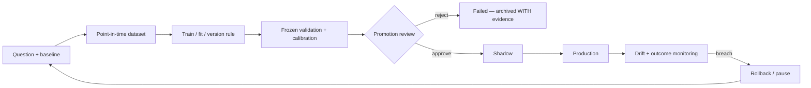

# Model and Algorithm Registry

**Last reviewed:** 2026-09-26 · **Owner:** TBD

Covers deterministic rules, heuristics, statistical systems, trained estimators and LLM
nodes — a model is anything that produces a decision, not only a fitted estimator.

**Column contract.** The previous revision shipped every row shifted one position left, so
lifecycle status appeared under "Runtime exposure" and the recommendation under "Status".
Columns below are: **Status** = lifecycle state from the controlled vocabulary in the
[README](README.md); **Rec** = KEEP / RETEST / RESTRUCTURE / PAUSE / REMOVE; **Doc** =
doc-health from the same README vocabulary (`CURRENT` / `UNVERIFIED` / `CONTRADICTED` /
`NONE`), recording whether the documentation still agrees with the code.

**Issue-state caveat.** Blocking-issue links are a snapshot, and a stale one is worse than
none: on 2026-09-15 this registry still cited [#825](https://github.com/TeneikaAskew/stocks/issues/825)
and [#900](https://github.com/TeneikaAskew/stocks/issues/900) as blockers when both had been
closed on 2026-09-14, so MODEL-BRIEF-001 appeared blocked while having no open blocker at
all. **Re-read every cited issue before acting on a row.** The offline test
`tests/meta/test_model_registry_consistency.py` cannot check issue state — see
[§ How this registry is kept honest](#how-this-registry-is-kept-honest).

**Evidence caveat.** Training cutoff, artifact version and historical results are
`UNKNOWN / NEEDS HISTORY TRACE` unless a versioned artifact or report proves them.
Results produced before the replay-integrity fixes land are not trustworthy evidence —
see [#906](https://github.com/TeneikaAskew/stocks/issues/906).

## Deterministic and heuristic systems

| ID | Name | Type | Decision produced | Code | Status | Rec | Doc | Blocking issues |
|---|---|---|---|---|---|---|---|---|
| MODEL-STRAT-001 | STRAT candle scenarios | Deterministic | classify bars 1 / 2U / 2D / 3 | `lib/strat.py` | Production but needs remediation | KEEP | UNVERIFIED | — |
| MODEL-FTFC-001 | Full Time Frame Continuity | Deterministic | multi-timeframe direction and alignment | `lib/strat.py`, `lib/exec_backtest/ftfc.py` | Production but needs remediation | RETEST | UNVERIFIED | [#884](https://github.com/TeneikaAskew/stocks/issues/884) weighted-vote semantics |
| MODEL-LEVEL-001 | Structural level state / magnitude | Heuristic | proximity, state, targets | `lib/strat_levels.py` | Production but needs remediation | RETEST | UNVERIFIED | [#866](https://github.com/TeneikaAskew/stocks/issues/866) PDH/PDL off-by-one · [#907](https://github.com/TeneikaAskew/stocks/issues/907) legacy positional fallback · [#908](https://github.com/TeneikaAskew/stocks/issues/908) executable repricing |
| MODEL-IND-001 | Technical indicators / RVOL / ORB | Deterministic / statistical | indicator and opening-range context | `lib/indicators.py`, `lib/signals.py` | Production but needs remediation | RETEST | UNVERIFIED | [#870](https://github.com/TeneikaAskew/stocks/issues/870) RSI warm-up · [#892](https://github.com/TeneikaAskew/stocks/issues/892) ATR warm-up · [#894](https://github.com/TeneikaAskew/stocks/issues/894) premarket bars in RTH VWAP · [#912](https://github.com/TeneikaAskew/stocks/issues/912) duplicate implementations |
| MODEL-MOM-001 | Momentum strategy | Heuristic | long/short eligibility | `lib/strategies/momentum.py`, `lib/strategies/config.py` (thresholds) | Production but needs remediation | RETEST | CURRENT · [doc](../models/MODEL-MOM-001.md) | [#285](https://github.com/TeneikaAskew/stocks/issues/285) duplicate inline path · [#701](https://github.com/TeneikaAskew/stocks/issues/701) two divergent voters |
| MODEL-MR-001 | Mean reversion strategy | Heuristic | reversion eligibility | `lib/signals.py` (live path — `evaluate_signal`), `lib/strategies/mean_reversion.py` (class form, not on the fire path), thresholds in `lib/strategies/config.py` and `lib/config.py:SignalConfig` (`lib/config.py:424`, imported at `lib/signals.py:15` and taken by `evaluate_signal` at `lib/signals.py:185`) | Production but needs remediation | RETEST | CURRENT · [doc](../models/MODEL-MR-001.md) | [#249](https://github.com/TeneikaAskew/stocks/issues/249) walk-forward RSI thresholds |
| MODEL-AGREE-001 | Agreement scoring | Heuristic / ensemble | combine strategy evidence into a score | `lib/strategies/agreement.py` | Production but needs remediation | RESTRUCTURE | CURRENT · [doc](../models/MODEL-AGREE-001.md) | [#905](https://github.com/TeneikaAskew/stocks/issues/905) freeze and prospectively validate expectancy |
| MODEL-EXIT-001 | Exit / stop / target policy | Heuristic | exit, stop, target selection | `lib/strategies`, `gcp/signal_monitor.py`, `exit_config_overrides` | **Broken** | RESTRUCTURE | UNVERIFIED | [#815](https://github.com/TeneikaAskew/stocks/issues/815) live has no stop-loss, backtest does · [#816](https://github.com/TeneikaAskew/stocks/issues/816) daily loss limit structurally unenforceable · [#862](https://github.com/TeneikaAskew/stocks/issues/862) overrides 113 days stale on the live fire path · [#915](https://github.com/TeneikaAskew/stocks/issues/915) same-minute ordering |
| MODEL-BRIEF-001 | Brief bias / movement statement | Heuristic | market bias and explanation | `lib/strategies/brief_bias.py`, `lib/movement_statement.py` | Experimental | RETEST | CURRENT · [doc](../models/MODEL-BRIEF-001.md) | **none open** — its last one (`#900`, unlinked: it is closed and `12` maps only open issues) closed 2026-09-14; the RETEST rests on no current blocker and needs a stated reason or a status change |
| MODEL-GAMMA-001 | Gamma / GEX regime and proximity | Deterministic / statistical | gamma exposure and regime context | `lib/gamma.py`, `lib/features/intraday_gex.py`, `lib/strategies/gamma_proximity.py` | **Retest Required** | RETEST | UNVERIFIED · [DOC-03](#documentation-coverage-and-freshness) | [#812](https://github.com/TeneikaAskew/stocks/issues/812) fabricated flips from float underflow · [#826](https://github.com/TeneikaAskew/stocks/issues/826) `or 0` on gamma/OI · [#871](https://github.com/TeneikaAskew/stocks/issues/871) contract multiplier · [#872](https://github.com/TeneikaAskew/stocks/issues/872) implied-move scaling · [#876](https://github.com/TeneikaAskew/stocks/issues/876) balance semantics · [#880](https://github.com/TeneikaAskew/stocks/issues/880) GEX scope · [#896](https://github.com/TeneikaAskew/stocks/issues/896) VEX invariants |
| MODEL-OPT-001 | Options Greeks / parity / theta | Statistical | Greeks, parity spot, theta path | `lib/options_greeks.py` | Production but needs remediation | RETEST | UNVERIFIED · [DOC-02](#documentation-coverage-and-freshness) | [#878](https://github.com/TeneikaAskew/stocks/issues/878) discount parity spot · [#927](https://github.com/TeneikaAskew/stocks/issues/927) hard-coded rates · [#607](https://github.com/TeneikaAskew/stocks/issues/607) 0DTE theta anchored to EOD |
| MODEL-EARN-001 | Earnings reaction analytics | Statistical / heuristic | event reaction and strategy lean | `lib/earnings_reactions.py` | Experimental | RETEST | CURRENT · [doc](../models/MODEL-EARN-001.md) | [#863](https://github.com/TeneikaAskew/stocks/issues/863) winners posted to Discord at 99 days old |
| MODEL-EARN-002 | Earnings-reaction setup classifier | Heuristic | one of four setup labels per upcoming reporter | `gcp/earnings_reactions_brief.py` (`classify_context`) | Experimental | RETEST | CURRENT · [doc](../models/MODEL-EARN-002.md) | **None filed.** Unevaluated — no experiment tests whether the labels precede the moves they name, and the output is a Discord embed with no table behind it |
| MODEL-PLAY-001 | Phase 6 playbook cards | Heuristic | per-ticker entry cards — setup, direction, confirmation checklist, target/stop | `scripts/analysis/phase6_playbook.py` | Experimental | RETEST | CURRENT · [doc](../models/MODEL-PLAY-001.md) | **None filed.** Card statistics are **in-sample** (no train/test split anywhere in the module) and the published `best_horizon` is an argmax over four holds scored on that same data (`:110`); no costs are modelled (`compute_card_stats` docstring). **And the statistics do not score the rule the card states**: 11 of 12 cards pass a setup-only mask to `compute_card_stats` while displaying a confirmation checklist that narrows it; Card 12 (`:703`) is the only one whose mask carries its own RSI / EMA / ORB terms |
| MODEL-WATCH-001 | Long-side earnings watchlist | Heuristic | which upcoming reporters to consider a long-premium position on | `gcp/earnings_long_watchlist.py` | Experimental | RETEST | CURRENT · [doc](../models/MODEL-WATCH-001.md) | **None filed.** Unevaluated — `min_wins = 2` and the prior-winners-repeat premise carry no derivation and no experiment |
| MODEL-EWV-001 | Earnings Whispers strike verdicts | Deterministic | HIT / MISS / KEPT / ASSIGNED on each strike pick | `gcp/fetchers/evaluate_ew_strikes.py` | Production but needs remediation | KEEP | CURRENT · [doc](../models/MODEL-EWV-001.md) | **#1151 fixed and re-scored 2026-09-26**: after-close reporters had been scored against the **pre-announcement** session, 1,263 of 2,383 scored rows. Each pick is now scored on the NYSE session its news reaches, and the stored verdicts were re-computed: 1,233 of 1,251 stored after-close closes are now nearer the next session's daily close than the report day's, where 1,226 of 1,249 were nearer the report day's before, and 328 of 1,263 verdicts flipped · [#1168](https://github.com/TeneikaAskew/stocks/issues/1168) the live premarket brief never shows a verdict; only `BRIEF_AS_OF` replays do · [#1181](https://github.com/TeneikaAskew/stocks/issues/1181) the outage rule counts symbols AlphaVantage rejects as an outage |
| MODEL-WEEK-001 | Weekend performance review | Heuristic | realized win rate per score bucket, labelled on the live ladder | `gcp/weekend_review.py` | Production but needs remediation | RESTRUCTURE | CURRENT · [doc](../models/MODEL-WEEK-001.md) | [#1137](https://github.com/TeneikaAskew/stocks/issues/1137) the module docstring claims a backtest comparison the code does not perform · **§3.7 — fixed 2026-09-22 (DOC-62)**: a week whose `return_pct` was entirely NULL published `0.0` to Discord from **five** code sites, not the two this cell used to name — overall `win_rate` and `total_pnl`, both per-direction rates, both per-ticker figures, and one per strength rung, the last of them introduced by DOC-56's own fix. All five now carry `NaN` end to end and render as an em-dash; a measured 0% still reads `0.0%`. A `trades` frame missing the column still raises, now a `ValueError` naming it rather than pandas' `IndexingError`. Measured through `generate_weekly_review`, not inferred. *The line pointers this cell carried described the pre-fix code and were briefly bumped mechanically on 2026-09-22, which pointed them at unrelated lines; historical pointers are dropped rather than maintained.* |
| MODEL-QUAL-001 | Signal-quality classification and regression alarm | Deterministic / statistical | CLEAN_HIT / WRONG_DIRECTION / NOISE / MIXED per fire per horizon, and whether the clean rate has regressed | `scripts/signal_quality_report.py`, `gcp/signal_quality_alarm.py` | Production but needs remediation | RETEST | CURRENT · [doc](../models/MODEL-QUAL-001.md) | **#1152 fixed and verified 2026-09-25**: the score-discrimination half never ran, because its timestamp join matched **0** live rows, and the minute-truncated join the issue proposed would have paired live mean-reversion alerts with unrelated momentum replay rows. Each alert is now paired with its own `exit_return_pct`, the comparison is signed, and the check is **report-only**, because on real rows its fortnightly rho swings from -0.8 to +0.8 and the score has no measurable edge (Spearman -0.004, p = 0.91, n = 1,024, measured 2026-09-24; [#905](https://github.com/TeneikaAskew/stocks/issues/905)). The deployed job's first run paired n = 116 and gave rho = +0.200 · **#1166 fixed 2026-09-26**: the nightly report fired at the same minute as its writer, so it read `historical_signals` before each session was written and never scored a Friday (0 of 20,323 Friday rows over 120 days). It now fires at 01:30 ET, also scores any row from the last 7 days still missing from `signal_metrics`, and exits 1 when a row it selected stays unscored · [#1167](https://github.com/TeneikaAskew/stocks/issues/1167) the timeframe lookup was fitted on the 100x-lenient classes · **#1154 fixed and re-classified 2026-09-25**: the 5/15/30/60m classes had compared fraction thresholds with percentage-point returns, 100x too lenient; `cls_60m` moved from 90.2% to 32.0% `CLEAN_HIT` · `CLEAN_THRESHOLD = 0.005` and `NOISE_THRESHOLD = 0.003` decide what counts as a hit for every strategy and carry no derivation; `ticker_calibration.threshold_clean` / `_wrong` / `_noise`, written quarterly by MODEL-CALIB-001, are never read by it |
| MODEL-RANK-001 | Candidate ranker | Heuristic / ensemble | rank trade candidates | `lib/agents/ranker` | Experimental | RESTRUCTURE | UNVERIFIED | — |

### MODEL-GAMMA-001 — what was and was not reproduced, 2026-08-30

**Correction.** An earlier revision of this section claimed
[#812](https://github.com/TeneikaAskew/stocks/issues/812) reproduced live on `main`. That
attribution was wrong and is withdrawn. The test used a chain with equal calls and puts at
identical strikes, so net gamma is zero by **symmetry**, not by the float underflow #812
describes. It demonstrated a real defect, but not that one.

Measured across the #942 merge (`lib/gamma.py::compute_gamma_flip_bs`):

| Case | `8eccde7` (pre-#942) | `b9621c4` (post-#942) |
|---|---|---|
| #812's own DoD case — pure-put 0DTE @ spot 600 | `None` | `None` |
| Balanced-symmetry chain @ spot 100 | **`100.0`** | **`100.0`** |

**On #812 itself:** not reproduced here on either commit. The constructed pure-put 0DTE case
returns `None` both before and after the fix, so this plan has **no evidence** that #812's
underflow mechanism is currently live. #812 remains **open** and its production evidence — 54
`gamma_levels_eod` flips >20% from spot, all on negative-GEX days — stands on its own; it was
established from production data, not from a synthetic chain, and nothing here contradicts it.
Reproducing it needs the real chain that produced `gamma_flip = 424.5 at spot 600`, not a
constructed one.

**Separately, a degenerate case that survives #942:** a chain whose net gamma is identically zero
at every candidate spot returns the spot itself rather than `None`. The docstring's own contract
says it should return `None` when *"G(S) does not change sign anywhere"*, and an identically-zero
G(S) never changes sign. This is narrow — it needs matched call/put open interest at identical
strikes and expiries — and it is **not** filed as an issue. Treat it as an unverified observation
needing a production-data check before anyone opens one.

**#942 merged** (`b9621c4`, 2026-08-30) and carries the "reject gamma underflow as a flip" change
originally proposed in [#936](https://github.com/TeneikaAskew/stocks/pull/936), plus log-space
`_stable_net_gamma` so the PDF cannot underflow, and 136 lines of new tests. #812's remaining
Definition-of-done items — re-running the production query and deciding on the 54 contaminated
rows — are what keep it open.

## Learned models

| ID | Name | Type | Decision produced | Code / artifact | Status | Rec | Doc | Evidence |
|---|---|---|---|---|---|---|---|---|
| MODEL-MAG-001 | Magnitude prediction | ML | target magnitude class / probability | `gcp/research/magnitude_engine`, `platform/api/routers/magnitude.py` | **Experimental** — 5m promoted 2026-09-15; research verdict still FAIL by gate 7 | RETEST | **CONTRADICTED** · [DOC-06](#documentation-coverage-and-freshness) | Research arc closed **PROJECT VERDICT FAIL by gate 7** ([#575](https://github.com/TeneikaAskew/stocks/pull/575)). Later argmax-collapse incident: predicted TIGHT on 588/588 live bars; promotion gate added in [#810](https://github.com/TeneikaAskew/stocks/pull/810), no-op fixed in [#811](https://github.com/TeneikaAskew/stocks/pull/811). **2026-09-14 (E-35):** the serving `c49qf` artifacts measured as constants (TIGHT on 99.9-100% of bars); the two promotion criteria were shown mutually unsatisfiable for any class weighting because they scored argmax; `pred_bucket` is now the decision rule P(bucket) ≥ 2× prior, recorded in CONTRACT.json; on 2026-09-15 the amended criteria promoted `magnitude-engine-6hp7l` (α=0) on SPY/QQQ/IWM 5m (gate 5 100%, gate 6 0.9-1.2×), replacing three of the four constants; IWM 15m still serves `c49qf` and the detector sample-size question is open in [15](15-OPEN-DECISIONS.md). Open: [#874](https://github.com/TeneikaAskew/stocks/issues/874), [#875](https://github.com/TeneikaAskew/stocks/issues/875), [#890](https://github.com/TeneikaAskew/stocks/issues/890) |
| MODEL-DIR-001 | STRAT direction model | ML | direction classification | `gcp/research/strat_engine` | **Failed** | REMOVE | UNVERIFIED | Archive rather than delete — the negative result is evidence. Directionality research verdict **DEAD-END** ([#588](https://github.com/TeneikaAskew/stocks/pull/588)); experimental direction features **FAIL** ([#566](https://github.com/TeneikaAskew/stocks/pull/566)) |
| MODEL-TYPE-001 | STRAT type / structure continuation | ML | scenario / type classification | `gcp/research/strat_engine` | Shadow | RETEST | UNVERIFIED · [DOC-07](#documentation-coverage-and-freshness) | Wired behind a feature flag ([#647](https://github.com/TeneikaAskew/stocks/pull/647)); QQQ-30m explicitly gated as not calibrated ([#648](https://github.com/TeneikaAskew/stocks/pull/648)) |
| MODEL-NEXTBAR-001 | STRAT next-bar edge | Statistical / ML | next-candle prediction | `gcp/research/strat_engine`, `lib/strat.py` | Research | RETEST | UNVERIFIED | Held-out OOS forward-walk confirms edge ([#593](https://github.com/TeneikaAskew/stocks/pull/593), [#594](https://github.com/TeneikaAskew/stocks/pull/594)); CLV ablation quantifies mechanical vs genuine ([#595](https://github.com/TeneikaAskew/stocks/pull/595), [#598](https://github.com/TeneikaAskew/stocks/pull/598)) |
| MODEL-BREAK-001 | Breakout meta-model | ML / ensemble | filter / rank breakouts | `gcp/research`, `lib/strategies` | Research | RETEST | UNVERIFIED | Net reconfirmed in [#598](https://github.com/TeneikaAskew/stocks/pull/598) |
| MODEL-STYLE-001 | User style mining | ML | learned personal trading pattern | `lib/style_miner.py` (the miner), `lib/walk_forward.py` (validation), `platform/api/routers/backtest.py` (`/api/style/mine-and-validate`), `user_style_results` | Experimental | RETEST | CURRENT · [doc](../models/MODEL-STYLE-001.md) | Origin [#707](https://github.com/TeneikaAskew/stocks/pull/707) — walk-forward validated into the playbook seam |
| MODEL-CALIB-001 | Ticker threshold calibration (percentile) | Statistical | per-ticker ATR/RVOL/RSI thresholds written to `ticker_calibration` | `scripts/calibrate_thresholds.py`, `ticker_calibration` | **Retest Required** | RETEST | CURRENT · [doc](../models/MODEL-CALIB-001.md) | — no open issue names this system; **nothing in the ledger evaluates it**, which is the standing concern |
| MODEL-SWEEP-001 | Walk-forward parameter sweep | Statistical | winning exit/entry parameter set written to `exit_config_overrides` | `lib/walk_forward.py`, `scripts/run_param_sweep.py`, `scripts/run_walk_forward.py`, `scripts/calibrate_iwm_strat.py`, `exit_config_overrides` | **Invalidated** | RESTRUCTURE | CURRENT · [doc](../models/MODEL-SWEEP-001.md) | [#813](https://github.com/TeneikaAskew/stocks/issues/813) "out-of-sample" calibration is in-sample **and auto-writes production** · [#817](https://github.com/TeneikaAskew/stocks/issues/817) exhaustive in-sample mining, no multiple-testing control · [#886](https://github.com/TeneikaAskew/stocks/issues/886) survivorship bias · [#380](https://github.com/TeneikaAskew/stocks/issues/380) close the loop |
| MODEL-FEAT-X | Experimental feature families | Statistical | cross-asset / news / options / vol features | `lib/features/experimental` | Research | PAUSE | UNVERIFIED | [#784](https://github.com/TeneikaAskew/stocks/issues/784) incremental-vol ablation open |
| MODEL-FLOW-001 | Dealer flow-direction features | Statistical | directional dealer positioning — DEX / vanna / charm | `lib/features/flow_direction.py`, `gcp/build_options_daily_greeks.py`, `etf_options_daily_greeks` | **Failed** | PAUSE | CURRENT · [doc](../models/MODEL-FLOW-001.md) | **None filed.** Falsified by ledger B5 (E5) — *“slow daily positioning adds nothing, dilutes the lone edge”* — yet `options-daily-greeks` still materializes it every weekday and no production path reads the table |

## LLM nodes

Full graph, concurrency and risk controls: [08](08-AI-AGENT-ARCHITECTURE.md). All 14 nodes
are **Experimental**; none has promotion evidence.

| ID | Nodes | Count | Code | Numeric authority | Status |
|---|---|---|---|---|---|
| MODEL-LLM-ANALYST | market, strat, options, gamma, catalyst, sentiment | 6 | `lib/agents/orchestrator.py`, `lib/agents/prompts.py` | explanation only | Experimental |
| MODEL-LLM-DEBATE | bull, bear | 2 | `lib/agents/orchestrator.py` | explanation only | Experimental |
| MODEL-LLM-JUDGE | research_manager | 1 | `lib/agents/orchestrator.py` | no invented confidence or levels | Experimental |
| MODEL-LLM-TRADER | trader | 1 | `lib/agents/orchestrator.py` | narrative over deterministic inputs | Experimental |
| MODEL-LLM-RISK | aggressive, conservative, neutral | 3 | `lib/agents/orchestrator.py` | **numeric plan field discarded** (`lib/agents/orchestrator.py:490-492`) | Experimental |
| MODEL-LLM-PM | portfolio_manager | 1 | `lib/agents/orchestrator.py` | obeys exposure/config constraints | Experimental |
| MODEL-SUM-001 | deterministic + LLM summarizers | — | `lib/agents/summarizers.py` | preserve supplied values | Experimental — [#827](https://github.com/TeneikaAskew/stocks/issues/827) silent fallback |

## Status summary

| Status | Models |
|---|---|
| Production but needs remediation | 11 |
| Broken | 1 (MODEL-EXIT-001) |
| Retest Required | 2 (MODEL-GAMMA-001, MODEL-CALIB-001) |
| Invalidated | 1 (MODEL-SWEEP-001) |
| Failed | 2 (MODEL-DIR-001, MODEL-FLOW-001) |
| Shadow | 1 (MODEL-TYPE-001) |
| Research | 3 |
| Experimental | 8 (MODEL-BRIEF-001, MODEL-EARN-001, MODEL-EARN-002, MODEL-MAG-001, MODEL-PLAY-001, MODEL-RANK-001, MODEL-STYLE-001, MODEL-WATCH-001) + 7 LLM node groups |

**MODEL-MAG-001 moved `Invalidated` → `Experimental` on 2026-09-21**, not by a decision
taken here but by merging `main`: [#1117](https://github.com/TeneikaAskew/stocks/pull/1117)
landed as `164b262` on 2026-09-18 and replaced argmax with the decision rule
`P(bucket) ≥ 2× prior`, after which the amended criteria promoted `magnitude-engine-6hp7l`
on SPY / QQQ / IWM 5m. This branch had described that PR as *"In flight"* in three places.

**29 `MODEL-*` rows**, up from 24 on 2026-09-18 when the scheduler sweep registered five
systems that had been running unregistered: MODEL-PLAY-001, MODEL-WATCH-001, MODEL-EWV-001,
MODEL-WEEK-001 and MODEL-QUAL-001.

> **The two `Production` rows lasted four days.** MODEL-EWV-001 and MODEL-QUAL-001 were
> registered `Production` on the reasoning that a **measurement** system has no edge to
> validate — no threshold to derive, one right answer. Review then found that each measures
> the wrong thing: EWV scored the session *before* the news for 53% of its picks
> ([#1151](https://github.com/TeneikaAskew/stocks/issues/1151)), and QUAL's score-discrimination
> half joined on timestamps that never matched, so it had never run
> ([#1152](https://github.com/TeneikaAskew/stocks/issues/1152)). Both are fixed (#1152 closed
> 2026-09-25; #1151 closed 2026-09-26 after its verdicts were re-scored) and stay
> `Production but needs remediation` for their remaining issues, so **no row on this table is plain `Production`.**
> "It only measures" turned out to be a reason to check the measurement, not a reason to
> trust it.

**No model in this repository currently meets the promotion bar.** Two carry explicit
recorded FAIL/DEAD-END verdicts ([#575](https://github.com/TeneikaAskew/stocks/pull/575),
[#588](https://github.com/TeneikaAskew/stocks/pull/588)) and are retained here deliberately —
negative results are evidence and must stay visible.

> **That still holds after MODEL-MAG-001's promotion, and the two words are not the same
> word.** The magnitude engine's own gate promoted `magnitude-engine-6hp7l` on 5m by
> clearing *its* gates 5 and 6. This registry's bar is REQ-MODEL-001..003 below, and the
> criterion that matters here is the one the engine still fails: **gate 7 — realised versus
> implied — FAILs on every cell**, 0 of 23 IV-covered folds, aggregate 0.67-0.73
> ([MAGNITUDE_ENGINE_RESULTS](../MAGNITUDE_ENGINE_RESULTS.md), §12). A model can be live,
> non-constant and promoted by its own pipeline while still having no measured edge over
> the option chain.

## Promotion criteria

Promotion requires REQ-MODEL-001..003: point-in-time-safe feature generation; a frozen
validation set unseen during selection; realistic costs and session semantics; comparison
against a stated baseline; cohort and sample-size reporting; calibration where probabilistic;
a threshold fixed in advance; shadow evidence; artifact/version lineage; monitoring and a
rollback path. Deterministic systems require shared live/replay fixtures and versioned
configuration. **Training must not write production as a side effect of a job completing**
— the precedent gate is `mag_walk_forward.promotion_verdict` from
[#810](https://github.com/TeneikaAskew/stocks/pull/810); reuse it rather than adding a second mechanism.

## Experiment traceability

**What this is.** The research program numbers its work `E-01…E-35` in
[`docs/EXPERIMENT_REGISTRY.md`](../EXPERIMENT_REGISTRY.md); this registry numbers the
same work `MODEL-*`. Until 2026-09-15 nothing joined the two schemes, so a `MODEL-*`
status could not be traced back to the folds that produced it. This table is that join.

**Evidence basis: `CLAIMED — DOCUMENTATION`.** Every row was read off the registry and
verdict documents named in it, not re-measured. The **evidence caveat** at the top of
this document still governs: results predating the replay-integrity fixes are not
trustworthy evidence ([#906](https://github.com/TeneikaAskew/stocks/issues/906)).

| Model | Experiments | Primary code | Deep doc | Recorded verdict |
|---|---|---|---|---|
| MODEL-TYPE-001 | E-01, E-02, E-03, E-04, E-05, E-06, E-19 (STRAT half), E-20 (probability calibration), E-23 (execution test) | `gcp/research/strat_engine/strat_walk_forward{,_adaptive}.py`, `strat_pred_train.py`, `strat_pred_per_class.py` | [MODEL_REGISTRY §A1](../MODEL_REGISTRY.md) · [STRAT_ENGINE_ARCHITECTURE](../STRAT_ENGINE_ARCHITECTURE.md) · [STRAT_ENGINE_OPERATIONS](../STRAT_ENGINE_OPERATIONS.md) | **Two verdicts, both true.** Prediction: VALIDATED 8/8 folds, ECE ≤ 0.05 (5m/15m), 30m PARTIAL, leakage audit CLEAN (E-19). **Execution: FAIL** — E-23 tested this model's 0.55-confidence 2U/2D calls and got 0/8 positive-expectancy folds in every cell, net expectancy negative after friction ([EXEC_BACKTEST_RESULTS](../EXEC_BACKTEST_RESULTS.md)). Ops doc says **"ON THE SHELF"** |
| MODEL-DIR-001 | E-07, E-08, E-17, E-34 | `gcp/research/strat_engine/strat_dir_walk_forward{,_extended}.py`, `strat_dir_probes.py`, `dir_regime_walk_forward.py`, `gcp/research/direction_program/` | [DIRECTION_RESEARCH_RESULTS](../DIRECTION_RESEARCH_RESULTS.md) · [DIRECTION_FEATURES_R&D](../DIRECTION_FEATURES_R&D.md) · [DIRECTION_LITERATURE_SCAN](../DIRECTION_LITERATURE_SCAN.md) | **No generalizable directional edge**; baseline 0/72 folds; one unresolved IWM-only flicker |
| MODEL-MAG-001 | E-09…E-15, E-19, E-20 (probability calibration), E-34 (SIZE arm), **E-35** (class-weight sweep + the 2026-09-14 gate-4 decision-rule amendment — renumbered 2026-09-22 out of a duplicated id, DOC-57) | `gcp/research/magnitude_engine/` (`mag_walk_forward.py`, `mag_pred_train.py`, `mag_leakage_audit.py`, `mag_inference.py`) | [MAGNITUDE_ENGINE_RESULTS](../MAGNITUDE_ENGINE_RESULTS.md) · [MAGNITUDE_DIRECTIONAL_SESSION_HANDOFF](../MAGNITUDE_DIRECTIONAL_SESSION_HANDOFF.md) | **PROJECT VERDICT FAIL** — closed by gate 7, 2026-05-29. Size is learnable; nothing beats option IV |
| MODEL-BREAK-001 | E-18 ★, E-32 | `gcp/research/strat_engine/breakout_meta_walk_forward.py` | [MODEL_RETHINK_PLANS §RESULTS](../MODEL_RETHINK_PLANS.md) · [EXPERIMENT_REGISTRY §E-18](../EXPERIMENT_REGISTRY.md) | Gross 24/24. **Net fragile** — 2026-06-09 reconfirm: only IWM 5m clean net-positive (+0.110 R, 8/8); SPY/QQQ NET_FAIL |
| MODEL-NEXTBAR-001 | E-25 | `scripts/strat_forward_walk{,_oos}.py`, `strat_oos_{clv_ablation,multi_tf}.py`, `strat_clv_demech.py`, `strat_struct_backtest.py`, `strat_next_candle_analysis.py` | [EXPERIMENT_REGISTRY §E-25](../EXPERIMENT_REGISTRY.md) · [MODEL_REGISTRY §CAT-A8](../MODEL_REGISTRY.md) | Held-out OOS edge confirmed; CLV ablation shows it is largely **gap-mechanical** (CLV_LAG1 ≈ 0) |
| MODEL-CALIB-001 | — (no `E-` id) | `scripts/calibrate_thresholds.py` | **none** — no experiment in the ledger evaluates this system | **Unevaluated.** A rolling 60-day percentile calibrator, scheduled quarterly, writing thresholds MODEL-MOM-001 and MODEL-MR-001 read. Whether a 60-day percentile is the right operating threshold has never been tested |
| MODEL-SWEEP-001 | — (no `E-` id) | `lib/walk_forward.py`, `scripts/run_param_sweep.py`, `scripts/calibrate_iwm_strat.py`, `scripts/run_walk_forward.py` | **none** — no experiment in the ledger evaluates this system | **Invalidated** — [#813](https://github.com/TeneikaAskew/stocks/issues/813) “out-of-sample” calibration is in-sample and auto-writes production · [#817](https://github.com/TeneikaAskew/stocks/issues/817) exhaustive in-sample mining · [#886](https://github.com/TeneikaAskew/stocks/issues/886) survivorship bias |
| MODEL-FEAT-X | E-08 (C-news / C-xasset / C-vol / C-options) — committed; **E-34** (Phase 2 feature-family ablation, five families in isolation and full stack via `--features`); E-26, E-31, E-33 — **scratch harness, artifacts unavailable** | E-08: `lib/features/experimental/`. E-34's families: `gcp/research/direction_program/phase2_features.py`. E-26/E-31/E-33: **no code committed** — the ledger records their result JSONs as retained by the author only, so nothing here reproduces them | [DIRECTION_FEATURES_R&D](../DIRECTION_FEATURES_R&D.md) | **FAIL** — three orthogonal families, 0/8 folds each; vol-regime and external-data probes NEUTRAL |
| MODEL-FLOW-001 | **B5 (E5)** — Book II thematic ledger, not an `E-nn` id | `lib/features/flow_direction.py`, `gcp/build_options_daily_greeks.py` | [EXPERIMENT_REGISTRY §B5](../EXPERIMENT_REGISTRY.md) | **failed (null + dilutive)** — IWM +0.053/z2.85 → −0.008/z−0.49; fires 726→881 while precision falls |
| MODEL-GAMMA-001 | E-22 (P2), E-24 | `gcp/research/p2_build_gamma_levels.py`, `p2_outcomes_grid.py`, `lib/gamma.py`, `lib/features/intraday_gex.py` | [docs/research/2026-05-23/P2_gamma_outcomes.md](../research/2026-05-23/P2_gamma_outcomes.md) · [gamma_levels.md](../gamma_levels.md) · [GAMMA_BALANCE_AUDIT](../audits/GAMMA_BALANCE_AUDIT_2026-08-25.md) | VOL signal confirmed, **direction null**; E-24 fixed a `gamma_regime` sign inversion at source |
| MODEL-STYLE-001 | — (no `E-` id) | `lib/style_miner.py`, `platform/api/routers/backtest.py` | [#707](https://github.com/TeneikaAskew/stocks/pull/707) | Walk-forward validated into the playbook seam |
| MODEL-RANK-001 | — (no `E-` id) | `lib/agents/ranker/` | [08](08-AI-AGENT-ARCHITECTURE.md) | Experimental; no promotion evidence |

> **E-20 is deliberately not mapped here.** E-20 asks whether sigmoid or isotonic
> post-hoc calibration improves a LightGBM model's probability ECE, and its artifacts are
> `strat_config.py` / `mag_config.py` — it is a property of the TYPE and MAG engines.
> `MODEL-CALIB-001` is the per-ticker *threshold* system that writes the `ticker_calibration`
> table. They share only the word "calibration". Mapping E-20 to MODEL-CALIB-001 made a
> successful probability experiment look like evidence for an entirely separate,
> **never-evaluated** production threshold calibrator. *(Until 2026-09-22 this read
> "separately **invalidated**" — a status that belongs to MODEL-SWEEP-001, not to the
> percentile calibrator, whose row says `Retest Required`. Third surviving instance of
> the claim DOC-21 and DOC-22 both book as fixed, and DOC-22 is the one that reads
> "fixing the instance is not fixing the claim". DOC-54.)* E-20 is therefore **not mapped to MODEL-CALIB-001**;
> the ledger scopes it `both (calibration)`, so it is mapped to **MODEL-TYPE-001 and
> MODEL-MAG-001**, and
> MODEL-CALIB-001 carries no experiment. That absence is itself the finding: the system
> that writes thresholds into production has never been evaluated in the ledger.

### Experiments with no `MODEL-*` owner

Recorded so they are not mistaken for gaps in the research, nor for models under
governance. Each is real work with a real verdict that no row above claims.

> **E-22 is an umbrella, not a single experiment**, so it appears in both tables and
> that is not a contradiction: its **P2 (gamma outcomes) arm is owned** by
> MODEL-GAMMA-001 above; the rest of the P1–P7 program and the 7-phase analysis
> pipeline is descriptive work no model claims. The row below is scoped to that
> remainder. **E-23 is split the same way** — its shares-execution arm tested
> MODEL-TYPE-001's own predictions and is listed there; the options arm and the
> general cost/EV analysis belong to no model. Those two are the only split ids.

| Experiments | Subject | Where it lives | Verdict |
|---|---|---|---|
| E-16 | `INTRADAY-MOM` — Gao-Han-Li-Zhou intraday-momentum replication | `gcp/research/strat_engine/intraday_momentum.py` | Replication probe; never promoted to a `MODEL-*` row |
| E-21 | Archived P7 LightGBM + stacked-regression + voter pipeline | `gcp/research/_archive/p7*.py` (9 files) | Archived; precursor to MODEL-TYPE-001 |
| E-22 (excluding its P2 arm — see note above) | 2026-05-23 pre-registered P1–P7 program + the 7-phase analysis pipeline | `scripts/research/`, `scripts/analysis/phase[1-7]_*.py`, `docs/research/2026-05-2{3,4,5}/` | Descriptive / EDA; feeds several models, owned by none |
| E-23 (cross-cutting — its shares-execution arm is **also** MODEL-TYPE-001's, see the traceability table) | Cost / EV / friction analysis and the execution backtests | `lib/exec_backtest/`, `lib/options_exec_backtest/` | **FAIL** both — [EXEC_BACKTEST_RESULTS](../EXEC_BACKTEST_RESULTS.md), [OPTIONS_EXEC_BACKTEST_RESULTS](../OPTIONS_EXEC_BACKTEST_RESULTS.md) |
| E-27…E-30, P0.1 | 2026-07-06 forward-window / directional re-probe | scratch harness (**not committed**) | Probe only. Gate-7 re-run showed the apparent edge is a close-of-day benchmark artifact — **priced, not tradeable** |
| — | BSVP + scalping-lanes validation | `scripts/analysis/bsvp_validation.py` | [BSVP_VALIDATION_RESULTS](../BSVP_VALIDATION_RESULTS.md) — 11.5 years of intraday data |

### Which of these actually run

**The rule, replacing the one that failed three rounds running.**

> A scheduled job is **model-bearing** when it produces a **decision, a label or a verdict
> about a trade, a signal or a position** that **reaches a person or a served surface** —
> wherever its thresholds live.

Until 2026-09-18 the working test here was *"does the job import `lib/` code cited in a
`MODEL-*` row"*. That is a **proxy** for the rule above, and it misses every job that hard-codes
its own thresholds. Three consecutive review rounds on PR
[#1111](https://github.com/TeneikaAskew/stocks/pull/1111) each found a scheduled decision system
with no row here — MODEL-FLOW-001, then MODEL-EARN-002, then four more — and all six were
missed the same way. The proxy is now **one sufficient signal, not the definition**.

Two clauses of the rule are doing real work:

- **"about a trade, a signal or a position"** is what keeps ops alarms out.
  `audit-infra-drift-daily` and the two `freshness-watchdog` schedulers post to Discord and a
  person acts on them, so "reaches a person" alone would sweep them in. They decide nothing
  about a position.
- **"reaches a person or a served surface"** is what keeps pure ingest out — and it is a claim
  about a **reader**, not about a write.

  **Two listed rows fail that clause and are listed anyway, as a named exception.** A live cron
  whose output reaches nobody is the thing an operator paying for it most needs to see, so it is
  recorded here rather than filed under "not model-bearing", where it would read as intentional
  ingest:

  | Row | Writes | Read by |
  |---|---|---|
  | `regime-combo-weekly` | `regime_combo_results` | nothing — only its own writer, `gcp/regime_combo_job.py` |
  | `options-daily-greeks` | `etf_options_daily_greeks` | only `lib/features/flow_direction.py`, whose own comment at `:485` says *"Experiments read the materialized…"*. MODEL-FLOW-001 is `Failed` / `PAUSE` |

  Until 2026-09-22 this paragraph said `regime-combo-weekly` *"is the one row whose output
  reaches nobody"*. It was not, and the second case was already written down in the model's own
  document while this sentence claimed uniqueness (DOC-49).

  **Not a swept set.** Both rows above were established by searching for readers of the named
  table. The other listed rows have **not** been checked for this property, and several reach
  readers indirectly — `calibrate-thresholds-quarterly` writes `ticker_calibration`, which
  `lib/strategies/calibration.py:91` reads and serves to the live monitor through
  `get_call_rsi_range` / `get_put_rsi_range` (`gcp/signal_monitor.py:1084-1085`) — so a
  naive "writes no served table" scan over-reports and is not quoted here.

  > **Corrected 2026-09-22 (DOC-52).** This sentence named
  > `lib/strategies/exit_config_overrides.py` as that reader. It contains **zero**
  > occurrences of `ticker_calibration`: it reads `FROM exit_config_overrides` (`:124`),
  > a different table written by **MODEL-SWEEP-001** (`run_param_sweep.py:134`).
  > MODEL-CALIB-001's own doc states the split at `:102`
  > (`| Writes | ticker_calibration | exit_config_overrides |`). The wrong reader was
  > offered as the evidence for being careful about counts.

**Still no count**, for the reason recorded below. The two tables together must cover every
scheduler in `gcp/deploy.sh`, and `scripts/audit_scheduler_coverage.py` fails the build if one
is missing from both — so a new scheduler cannot be silently unclassified, which is how
`signal-monitor-daily` and the six above went missing.

> **The exclusion this replaces was wrong, and its own words said so.** The previous revision
> excluded `phase6-playbook-daily` on the grounds that it *"has no `from lib.` import of its own
> and writes markdown **decision cards** from earlier phases' output"*. A sentence arguing that a
> job is not a decision system, containing the phrase "decision cards". It passes `--write-db`
> (`gcp/deploy.sh:4430`) and upserts `playbook_cards`
> (`scripts/analysis/phase6_playbook.py:942-993`), which `/api/playbook` serves. Recorded as
> DOC-35. That paragraph existed *because* exclusions should be visible rather than silent; the
> first one written down was false, which is the argument for the gate rather than against the
> practice.

> **An earlier revision of this paragraph used `fred-rates-daily` as its first example and said
> it imports `lib/options_greeks.py`. It does not** — `gcp/fetchers/fetch_fred_rates.py:15` is a
> **docstring mention**; the file's only `lib` import is `lib.logging_config`. Both examples in a
> paragraph arguing for evidence over derived numbers were asserted without being checked, and
> one was false. Recorded as DOC-28.

> **Why the number is gone.** It was stated as `eight`, corrected to `fourteen` on
> 2026-09-17, and was still wrong, because it was derived by hand from a rule that — applied
> literally — sweeps in every fetcher that touches a `lib/` helper. The eight also omitted
> `signal-monitor-daily`, the job that evaluates MODEL-MOM-001, MODEL-MR-001,
> MODEL-AGREE-001, MODEL-EXIT-001 and MODEL-BRIEF-001 every trading morning. Two wrong counts
> in two rounds is enough evidence that the number was the wrong thing to publish; the list
> is what readers actually need, and the test checks it for drift against `gcp/deploy.sh`.

The live fleet is larger — see [05-INFRASTRUCTURE](05-INFRASTRUCTURE.md) for the
declared-versus-live reconciliation.

| Scheduler | Cron (`America/New_York`) | Job | Serves |
|---|---|---|---|
| `strat-engine-daily` | `35 23 * * 1-5` | `strat-engine` | MODEL-TYPE-001 |
| `magnitude-inference-daily` | `25 9 * * 1-5` | `magnitude-inference` | MODEL-MAG-001 |
| `audit-magnitude-drift-daily` | `55 9 * * 1-5` | `audit-magnitude-drift` | MODEL-MAG-001 drift |
| `audit-walkforward-weekly` | `0 9 * * 6` | `audit-walkforward` | MODEL-MOM-001 / MODEL-MR-001 factor audit (`scripts.analysis.per_factor_walkforward`, read-only) |
| `regime-combo-weekly` | `0 5 * * 0` | `regime-combo` | combo mining (E-22) — writes `regime_combo_results`, and **nothing in this repo reads that table**. Owned by the ledger, not by a `MODEL-*` row, because it feeds no decision. Listed so the weekly spend is visible, not because anything consumes it |
| `calibrate-thresholds-quarterly` | `0 2 1 1,4,7,10 *` | `calibrate-thresholds` | MODEL-CALIB-001 writer (A), the percentile calibrator |
| `gamma-levels-daily` | `30 22 * * 1-5` | `p2-build-gamma-levels` | MODEL-GAMMA-001 |
| `audit-brief-bias-weekly` | `0 10 * * 0` | `audit-brief-bias` | MODEL-BRIEF-001 audit |
| `signal-monitor-daily` | `25 9 * * 1-5` | `signal-monitor` | **the live fire path** — MODEL-STRAT-001, MODEL-FTFC-001, MODEL-LEVEL-001, MODEL-IND-001, MODEL-MOM-001, MODEL-MR-001, MODEL-AGREE-001, MODEL-EXIT-001, MODEL-BRIEF-001 |
| `orb-15m-alert` | `45 9 * * 1-5` | `signal-monitor` | MODEL-IND-001 (opening range) |
| `orb-30m-alert` | `0 10 * * 1-5` | `signal-monitor` | MODEL-IND-001 (opening range) |
| `signal-monitor-eod-resolver-daily` | `30 16 * * 1-5` | `signal-monitor-eod-resolver` | MODEL-EXIT-001 outcomes |
| `realtime-gex-daily` | `0 17 * * 1-5` | `build-realtime-gex` | MODEL-GAMMA-001 |
| `refresh-earnings-views-weekly` | `0 20 * * 0` | `refresh-earnings-views` | MODEL-EARN-001 |
| `refresh-earnings-views-daily` | `30 7 * * 1-5` | `refresh-earnings-views` | MODEL-EARN-001 (declared via `_schedule_args`) |
| `premarket-playbook-resolver-daily` | `15 21 * * 1-5` | `premarket-playbook-resolver` | MODEL-LEVEL-001 (calls `build_level_map`) |
| `premarket-brief-daily` | `30 8 * * 1-5` | `premarket-brief` | MODEL-BRIEF-001 — and the MODEL-IND-001 / MODEL-STRAT-001 / MODEL-LEVEL-001 / mean-reversion condition helpers it imports at `gcp/premarket_brief.py:25-28`, plus MODEL-EARN-001 at `:615`. **Also a second live LLM path**: `lib.agents.summarizers` (`:131`), `lib.agents.trade_planner` (`:1416`) and, via `gcp/brief_explanations.py:114-115`, `lib.agents.llm_client` |
| `premarket-brief-sunday` | `0 21 * * 0` | `premarket-brief` | the same job, weekend refresh |
| `auto-refresh-top-n` | `10 8 * * 1-5` | `auto-refresh-top-n` | MODEL-RANK-001 — `lib.agents.ranker.rank_tickers` (`gcp/auto_refresh_top_n.py:53`), its only scheduled caller |
| `options-daily-features` | `0 22 * * 1-5` | `build-options-daily-features` | MODEL-FEAT-X — `lib.features.experimental.options_derived` (`gcp/fetchers/build_options_daily_features.py:30`) |
| `options-daily-greeks` | `15 23 * * 1-5` | `build-options-greeks` | MODEL-FLOW-001 — `lib.features.flow_direction` (lazy import at `gcp/build_options_daily_greeks.py:131`). **Live for a falsified feature set**, and one of the two **visibility-only exceptions** above: `etf_options_daily_greeks` has no production reader, only the research joiner in `lib/features/flow_direction.py`. Listed so the weekly spend is visible, not because it satisfies the rule — see the model's doc |
| `historical-signals-watchlist-daily` | `0 1 * * 2-6` | `historical-signals-watchlist` | MODEL-MOM-001 / MODEL-MR-001 / MODEL-IND-001 replayed over history — `MarketAnalyzer` (`scripts/run_historical_signals.py:40`), `lib.signals.generate_signals` (`:366`). The producer of `historical_signals` |
| `earnings-sweep-sunday` | `30 20 * * 0` | `earnings-sweep` | MODEL-EARN-001 — writes `earnings_calibration`; applying is the **default** (`--no-apply` opts out). **Declared in `gcp/deploy.sh:4707`, absent from the live fleet** — confirmed 2026-09-18 against `gcloud scheduler jobs list`, and pinned by `tests/scripts/test_doc_inventory.py:235` |
| `earnings-reactions-brief-daily` | `35 8 * * 1-5` | `earnings-reactions-brief` | MODEL-EARN-002 — `classify_context` (`gcp/earnings_reactions_brief.py:474`). Output is a Discord embed; there is no table behind it |
| `phase6-playbook-daily` | `30 4 * * 1-5` | `phase6-playbook` | MODEL-PLAY-001 — per-ticker entry cards, `"IF ALL CONFIRMED -> {direction} ENTRY"` (`scripts/analysis/phase6_playbook.py:305`), upserted to `playbook_cards` and served by `/api/playbook`. **Registered 2026-09-18**; it was the deliberate exclusion quoted above |
| `earnings-long-watchlist-sunday` | `45 19 * * 0` | `earnings-long-watchlist` | MODEL-WATCH-001 — ranks upcoming reporters by prior long-side wins, `HAVING COUNT(DISTINCT (structure, event_date)) >= :min_wins` (`gcp/earnings_long_watchlist.py:169`), Discord embed |
| `evaluate-ew-strikes-daily` | `0 23 * * 1-5` | `evaluate-ew-strikes` | MODEL-EWV-001 — HIT / MISS / KEPT / ASSIGNED verdicts on Earnings Whispers strike picks (`gcp/fetchers/evaluate_ew_strikes.py:91-170`), with a render path in the premarket brief (`gcp/premarket_brief.py:2391-2396`) that only `BRIEF_AS_OF` replays reach (#1168) |
| `weekend-review-weekly` | `0 9 * * 6` | `weekend-review` | MODEL-WEEK-001 — realized win rate per score bucket, labelled with `get_signal_strength_label` (`gcp/weekend_review.py:72`), the same ladder `gcp/signal_monitor.py:1343` labels live fires with. Discord |
| `signal-quality-report-nightly` | `30 1 * * 2-6` | `signal-quality-report` | MODEL-QUAL-001 — classifies every historical fire at seven horizons into `signal_metrics` (`scripts/signal_quality_report.py:92-115`). Fires half an hour after its writer, `historical-signals-watchlist-daily`, and heals any row from the last 7 days still unscored (#1166) |
| `signal-quality-alarm-daily` | `0 2 * * 2-6` | `signal-quality-alarm` | MODEL-QUAL-001 regression alarm — trailing-7d vs prior-7d clean rate, fires below `-3.0` pp on `>= 50` rows per window (`gcp/signal_quality_alarm.py:120-122`); plus a report-only score-discrimination check over 14 days of live exits |
| `fetch-market-data-daily` | `0 23 * * 1-5` | `fetch-market-data` | MODEL-STRAT-001 / MODEL-FTFC-001 — **emits the decision, not just the inputs**: `StratClassifier.classify_series` + `detect_combos` (`gcp/fetchers/fetch_market_data.py:332-345`), then `ftfc_score`, `ftfc_direction` and the thresholded `strat_setup = last_combo and abs(ftfc_score) >= 0.3` (`:370-379`), upserted to `market_data_daily` (`:439`). Served by `/api/dashboard` (`platform/api/routers/dashboard.py:146-149`) and scored by MODEL-RANK-001 (`lib/agents/ranker/signals.py:55`, `:68-73`) |
| `backfill-indicators-daily` | `30 2 * * 1-6` | `backfill-daily-indicators` | MODEL-STRAT-001 — the **label** clause, not the decision one: it writes `strat_candle` and `strat_combo` over history (`gcp/fetchers/backfill_daily_indicators.py:320-341`) and its own comment at `:137-138` records that `ftfc_score` / `strat_setup` are *"populated only by the live writer's per-day pass"*. The candle classification is MODEL-STRAT-001's output and the dashboard serves it |
| `backfill-indicators-weekly` | `0 3 * * 0` | `backfill-daily-indicators` | MODEL-STRAT-001 — the **same job** as `backfill-indicators-daily` above, on a Sunday full-history pass (`BACKFILL_MODE=full`). Same label clause, same `strat_candle` / `strat_combo` output, same dashboard reader. Declared with a raw `gcloud scheduler jobs create http`, which is why it was invisible to the coverage audit until 2026-09-22 (DOC-48) |
| `insight-pipeline-daily` | `45 8 * * 1-5` | `insight-pipeline` | **all 14 LLM nodes** — `lib.agents.orchestrator.run_insight_pipeline`, imported at `gcp/insight_pipeline_job.py:69` and called at `:526` |
| `insight-discord-push-daily` | `15 9 * * 1-5` | `insight-discord-push` | the LLM nodes' delivery half — `lib.agents.model_routing` (`gcp/insight_discord_push.py:36`) |

`direction-baseline`, `direction-phase2`, `direction-probe`, `direction-importance`
and `param-sweep` are deployed but **unscheduled**;
`options-exec-backtest` is defined in `gcp/deploy.sh` but marked **not deployed**.

#### Deliberately not model-bearing

Every other scheduler in `gcp/deploy.sh`, with the reason. This table is not decoration: the
exclusions are what the gate checks, and an unrecorded exclusion is indistinguishable from an
omission. Each row was classified by reading the entrypoint, with
`scripts/audit_scheduler_coverage.py` printing the write / Discord / import evidence.

| Scheduler | Job | Why it is not model-bearing |
|---|---|---|
| `strat-enrich-daily` | `strat-engine` (overridden to `gcp.research.strat_engine.strat_enrich_levels`) | **Inputs only —** backfills `strat_features_levels_{tf}` with ORB windows, historical levels and order blocks. It imports `lib.indicators` (cited by MODEL-IND-001), which is why the tripwire flags it, and the justification is checkable: the module contains no classifier call, no threshold and no label — `grep -n "StratClassifier\|strat_setup\|ftfc_score" gcp/research/strat_engine/strat_enrich_levels.py` returns nothing. Every reader of `strat_features_levels_*` is under `gcp/research/strat_engine/` or is tooling (`audit_data_freshness`, `doc_inventory`); no router, no Discord, no served surface. Note this scheduler **overrides the job's entrypoint**: the `strat-engine` job defaults to `strat_data_builder`, so classifying it on the job's own module would judge the wrong code |
| `reconcile-failure-notifier-hourly` | `failure-notifier` (Cloud Run **service**, `${service_url}/reconcile`) | Ops only — hourly reconciliation of the workflow-failure notifier. It decides nothing about a trade, a signal or a position, and runs no entrypoint of its own. Same shape as the `discord-warm-*` service pings already excluded here |
| `premarket-refresh-daily` | `fetch-premarket-refresh` | **Inputs only —** refreshes the current session's `market_data_daily` row before the brief reads it. It imports `lib.indicators` (cited by MODEL-IND-001), which is why the tripwire below flags it, and the justification is checkable: `grep -n "StratClassifier\|strat_setup\|ftfc_score" gcp/fetchers/fetch_premarket_refresh.py` returns nothing. It writes indicator columns and no classification, label or threshold. The two jobs that *did* emit one — `fetch-market-data-daily` and `backfill-indicators-daily` — were excluded from this table on the same wording until 2026-09-22 (DOC-43) |
| `av-intraday-nightly` · `av-intraday-monthly` | `fetch-alphavantage-intraday` | AlphaVantage 1-min bars → `market_data_intraday`. Pure ingest |
| `av-options-daily` · `av-options-monthly` | `fetch-av-options-backfill` | Historical options chains → `etf_options_snapshots`. Pure ingest |
| `av-options-realtime` | `fetch-av-options-realtime` | Intraday chain snapshot → `etf_options_snapshots`. Pure ingest |
| `daily-earnings-refresh-calendar` · `weekly-earnings-refresh-calendar` | `fetch-earnings-calendar` | Earnings dates → `earnings_calendar`. Ingest. (The **verdict** columns on the same table come from `evaluate-ew-strikes-daily`, which is listed above) |
| `daily-earnings-refresh-history` · `weekly-earnings-refresh-history` | `fetch-earnings-history` | Reported EPS / surprise → `earnings_history`. Ingest |
| `daily-earnings-refresh-reactions` · `weekly-earnings-refresh-reactions` | `compute-earnings-reactions` | Derives post-earnings move statistics into `earnings_reactions`. Descriptive statistics over history, not a call on any position; MODEL-EARN-001 is the model that reads them |
| `economic-events-daily` | `fetch-economic-events` | Calendar → `economic_events`. Ingest |
| `fred-rates-daily` | `fetch-fred-rates` | FRED series → `daily_rates`. Ingest. Its only `lib` import is `lib.logging_config` |
| `insider-transactions-daily` | `fetch-insider-transactions` | Form 4 filings → `insider_transactions`. Ingest |
| `sec-filings-intraday` | `fetch-sec-filings` | EDGAR filings → `sec_filings`. Ingest |
| `news-sentiment-hourly` · `news-sentiment-earnings-0600` · `news-topics-hourly` | `fetch-news-sentiment` · `fetch-news-sentiment-earnings` · `fetch-news-sentiment-topics` | Vendor-scored sentiment → `news_sentiment`. The score is the **vendor's**; this job stores it |
| `top-movers-daily` · `top-movers-intraday-hourly` · `top-movers-intraday-close` | `fetch-top-movers` | Ranks by realized % change → `top_movers_daily` / `top_movers_intraday`. A sort of what already happened, with no threshold and no call |
| `freshness-watchdog-hourly` · `freshness-watchdog-nightly` | `freshness-watchdog` | Alarms when a table stops being written. Reaches a person, decides nothing about a position — the clause that keeps ops alarms out |
| `audit-infra-drift-daily` | `audit-infra-drift` | Same shape: deployed GCP state vs `gcp/deploy.sh`, Discord on drift. Infrastructure, not markets |
| `options-retention-daily` | `etf-options-retention` | Prunes aged `etf_options_snapshots` rows. Storage housekeeping |
| `cloud-sql-weekly-export-sunday` | `cloud-sql-weekly-export` | `pg_dump` → GCS. The third backup layer; see CLAUDE.md § Backup and disaster recovery |
| `discord-warm-open` · `discord-warm-close` | `discord-interactions` | Pings a Cloud Run **service** to beat the cold start inside Discord's 3-second interaction ack. Not a job at all |

### Research documentation corpus

The long-form evidence behind every verdict above. None of it was linked from this
plan before 2026-09-15.

| Doc | Holds |
|---|---|
| [`docs/models/`](../models/) | **Per-model reference docs** — behaviour, inputs, entry points, thresholds and test coverage for the seven models that previously had none. Each states its rationale or says `UNKNOWN` where the code does not record one |
| [EXPERIMENT_REGISTRY.md](../EXPERIMENT_REGISTRY.md) | **The experiment log.** Per-experiment ledger `E-01…E-35`, split into Book I (`E-01`…`E-25` + `E-32`) and Book II (`E-26`…`E-31`, `E-33`…`E-35`) **by position, not by id** + thematic `G1–G7` / `A·B·C·D·P·L` entries |
| [RESEARCH_COMPENDIUM.md](../RESEARCH_COMPENDIUM.md) | Master research narrative (Part A) + the end-to-end experiment log (Part B, formerly `MODELS_END_TO_END.md`) |
| [MODEL_REGISTRY.md](../MODEL_REGISTRY.md) | Research-side model inventory — families A/B/C (Part A) + catalog `CAT-A0…CAT-A8` (Part B, formerly `MODEL_CATALOG.md`) |
| [INVESTMENT_MODELS_SUMMARY.md](../INVESTMENT_MODELS_SUMMARY.md) | Models #1–#5, `lib/`, the Strat classifier and the backtest engine (formerly also `MODEL_SUMMARY.md`) |
| [MODEL_RETHINK_PLANS.md](../MODEL_RETHINK_PLANS.md) | The B1–B3 "trade the underlying" pivot — why gate-7 dooms options-buying but not directional trading |
| [MAGNITUDE_ENGINE_RESULTS.md](../MAGNITUDE_ENGINE_RESULTS.md) · [MAGNITUDE_DIRECTIONAL_SESSION_HANDOFF.md](../MAGNITUDE_DIRECTIONAL_SESSION_HANDOFF.md) | Magnitude fold tables and the gate-7 closure |
| [DIRECTION_RESEARCH_RESULTS.md](../DIRECTION_RESEARCH_RESULTS.md) · [DIRECTION_FEATURES_R&D.md](../DIRECTION_FEATURES_R&D.md) · [DIRECTION_LITERATURE_SCAN.md](../DIRECTION_LITERATURE_SCAN.md) | Direction verdicts, feature-family R&D, Phase 0 literature |
| [EXEC_BACKTEST_RESULTS.md](../EXEC_BACKTEST_RESULTS.md) · [OPTIONS_EXEC_BACKTEST_RESULTS.md](../OPTIONS_EXEC_BACKTEST_RESULTS.md) · [BSVP_VALIDATION_RESULTS.md](../BSVP_VALIDATION_RESULTS.md) | Execution backtests and BSVP validation |
| [STRAT_ENGINE_AND_COMBO_PIPELINE.md](../STRAT_ENGINE_AND_COMBO_PIPELINE.md) · [STRAT_ENGINE_ARCHITECTURE.md](../STRAT_ENGINE_ARCHITECTURE.md) · [STRAT_ENGINE_OPERATIONS.md](../STRAT_ENGINE_OPERATIONS.md) · [STRAT_IMPLEMENTATION_PLAN.md](../STRAT_IMPLEMENTATION_PLAN.md) | Strat engine design, ERD, operations and build plan |
| [STRAT_METHODOLOGY.md](../STRAT_METHODOLOGY.md) · [gamma_levels.md](../gamma_levels.md) | Methodology references for MODEL-STRAT-001 and MODEL-GAMMA-001 |
| `docs/research/2026-05-2{3,4,5}/` | E-22 pre-registered P1–P7 program, with committed `data/` artifacts |
| `docs/superpowers/specs/`, `docs/superpowers/plans/` | Direction-predictability program design and phase plans |
| `notebooks/` | `p7_eda.ipynb`, `strat_pred_diagnose.ipynb`, `stock_analysis.ipynb`, `trade_analysis.ipynb` |

**Machine-written run records**, distinct from the prose above: the `job_runs` Cloud SQL
table (per-execution status and duration), `magnitude_walk_forward_results` and
`magnitude_per_bar_predictions` (created at runtime by `mag_walk_forward.py`, **not** in
`gcp/schema.sql`), `walk_forward_results`, `backtest_walk_forward_folds`, and the
append-only JSONL written by `gcp/research/direction_program/slice_ledger.py` — which is
per-run, uncommitted and never aggregated.

## Documentation coverage and freshness

The [corpus table](#research-documentation-corpus) above says what documentation exists.
This says what is **wrong** with it.

**What the `Doc` column does and does not promise.** A cell that cites a `DOC-nn` points at a
specific recorded concern, and every id it cites exists here — that is gated. A **bare
`UNVERIFIED`** means only that nobody has checked this model's documentation against its code;
it is not a claim that a finding exists. An earlier revision of this paragraph said every
non-`CURRENT` cell names a row here, which was false while the suite was green — the kind of
published contract a reader would reasonably rely on. Ten of the 29 rows are bare `UNVERIFIED`
today.

**Severity is the documentation scale from
[ARCHITECTURE_DOCS_AUDIT_2026-09-07](../audits/ARCHITECTURE_DOCS_AUDIT_2026-09-07.md) §2**,
reused verbatim rather than invented: **H** = a reader acting on it would do the wrong thing;
**M** = wrong count or name; **L** = stale wording. The `CRITICAL/P0/…` ladder is not used
here — that one belongs to code defects and is owned by
[12](12-PR-ISSUE-TRACEABILITY.md#severity-distribution-open).

### Findings

| ID | Doc | Claim → actual | Kind | Sev | Models |
|---|---|---|---|---|---|
| DOC-01 | `07` (this file) | Cited [#825](https://github.com/TeneikaAskew/stocks/issues/825) and [#900](https://github.com/TeneikaAskew/stocks/issues/900) as open blockers → both closed 2026-09-14 | closed-issue | **H** | MODEL-OPT-001, MODEL-BRIEF-001 |
| DOC-02 | `07` (this file) | MODEL-OPT-001 listed `platform/src/lib/greeksCalculator.ts` → file deleted; BS math is `lib/options_greeks.py`. The repo's own [BRIEFING_DECK](../BRIEFING_DECK.md) already recorded the deletion | dead-path | **H** | MODEL-OPT-001 |
| DOC-03 | `07` (this file) | "six model-bearing jobs are scheduled", `p2-build-gamma-levels` listed unscheduled → `gcp/deploy.sh:4410` declares `gamma-levels-daily`; it is **seven** | contradiction | **M** | MODEL-GAMMA-001 |
| DOC-04 | `07` (this file) | E-20 mapped to MODEL-CALIB-001 → E-20 is LightGBM *probability* calibration; MODEL-CALIB-001 is the per-ticker *threshold* writer. Unrelated systems sharing a word | contradiction | **H** | MODEL-CALIB-001, MODEL-TYPE-001 |
| DOC-05 | `07` (this file) | E-22 appeared as both owned and ownerless → it is an umbrella; only its P2 arm is owned | contradiction | **M** | MODEL-GAMMA-001 |
| DOC-06 | [MAGNITUDE_ENGINE_RESULTS](../MAGNITUDE_ENGINE_RESULTS.md) | Opens "PROJECT VERDICT: FAIL (closed 2026-05-29)" → the engine has source commits on 2026-09-11 and 2026-09-14, runs on two daily schedulers, and [#1025](https://github.com/TeneikaAskew/stocks/issues/1025) reported it argmax-collapsed and serving nothing since 2026-09-03 (resolved by [#1117](https://github.com/TeneikaAskew/stocks/pull/1117), merged `164b262`; 5m now serves a promoted non-constant model). The doc reads as closed; the system is not | contradiction | **H** | MODEL-MAG-001 |
| DOC-07 | [STRUCTURE_BRIEF_DESIGN](../STRUCTURE_BRIEF_DESIGN.md) | "Deploy is blocked until Track B and Track C both report verdicts" → both reported **FAIL**. The gate condition is met and the doc never moved | stamp | **M** | MODEL-TYPE-001 |
| DOC-08 | `BACKTEST_RESULTS.md` (repo root) | Self-labelled "Auto-generated by `generate_backtest_report.py` — 2026-04-12" while the content is a frozen April snapshot. *This row first called the generator **dead**, on the evidence that `grep -rn generate_backtest_report .github/` is empty. The grep is correct and the inference was wrong: the `report` job was migrated to the on-demand `backtest-pipeline` Cloud Run Job (`gcp/deploy.sh:3013-3037`), which runs `scripts.run_pipeline`, invokes the generator as a subprocess (`scripts/run_pipeline.py:233-243`) and writes `backtest_reports` — executions on 2026-05-24, 2026-08-26 and 2026-08-27. `.github/workflows/backtest-pipeline.yml:3` says so itself. I searched the one directory the workload had been moved out of, under a convention this repo documents* | unsynchronized artifact | **M** | MODEL-CALIB-001 |
| DOC-09 ([#1118](https://github.com/TeneikaAskew/stocks/issues/1118)) | [INVESTMENT_MODELS_SUMMARY](../INVESTMENT_MODELS_SUMMARY.md) | `ticker_calibration` block says "auto-refreshed monthly" → the monthly workflow **does** call `scripts/refresh_calibration_table.py`, but as `python -m … \|\| echo "::warning::"`, so a failure is swallowed and the block silently ages. Data stamped 2026-07-01 | dead-generator | **M** | MODEL-CALIB-001 |
| DOC-10 | Seven models | No doc describes them beyond scattered plan/audit mentions: MODEL-MOM-001, MODEL-MR-001, MODEL-AGREE-001, MODEL-BRIEF-001, MODEL-EARN-001, MODEL-STYLE-001, MODEL-CALIB-001 — measured by searching `docs/` for each one's primary module | omission | **H** | (seven, listed) |
| DOC-11 | [README](README.md) master matrix | Lists **15 of the 29** models in the two registry tables. Absent: **MODEL-BREAK-001, MODEL-DIR-001, MODEL-EARN-002, MODEL-EWV-001, MODEL-FEAT-X, MODEL-FLOW-001, MODEL-MAG-001, MODEL-NEXTBAR-001, MODEL-PLAY-001, MODEL-QUAL-001, MODEL-RANK-001, MODEL-TYPE-001, MODEL-WATCH-001, MODEL-WEEK-001**. *Recomputed 2026-09-18 after the scheduler sweep added five rows; the README was not updated, so the absentee count went 9 → 14 while the fraction's numerator stayed put.* *An earlier revision of this row said "every learned model is absent" and listed MODEL-SUM-001 — both wrong: MODEL-CALIB-001 and MODEL-STYLE-001 are learned and **are** present at README:138, MODEL-RANK-001 is heuristic not learned, and the actually-absent MODEL-FEAT-X was missing from the list. Recomputed from the tables rather than restated* | omission | **M** | (fourteen, listed) |
| DOC-12 | [05-INFRASTRUCTURE](05-INFRASTRUCTURE.md) | "Cloud Run jobs (67 declared / 76 live)… Scheduler (65 live)" → `doc_inventory.py` parses **68** declared jobs and **66** declared schedulers | stamp | **M** | — |
| DOC-13 | `docs/product/*.md` | A first pass counted **57** dead repo-rooted paths across the product plan. Re-measured: **27 distinct**, and **22 of those are not debt** — they are `platform/src/**` and frontend `*.spec.ts` paths the #957 split moved to `TeneikaAskew/solyra`, cited deliberately and explained by a header note in [11](11-CODE-TRACEABILITY.md). Genuinely dead: **2** (`scripts/backfill_signals.py`, `scripts/validate_track2_live.py`). Relocatable and now fixed: **2** (`gcp/freshness_watchdog.py` → `scripts/audit_data_freshness.py`, which is what `gcp/deploy.sh:2471` actually runs; `lib/data_loader` → `lib/data_loader.py`) | dead-path | **M** | — |
| DOC-18 | `lib/strategies/momentum.py`, `lib/strategies/mean_reversion.py` | **Module docstrings describe behaviour the code no longer has.** momentum's lists `StochRSI < 80` (dropped in Phase 0.7.1) and omits `rvol_above_recent` / `atr_expansion` / `rsi_thrust` (added since); mean_reversion's lists an EMA-proximity condition that **does not exist**. momentum's *function* docstring also says `min_conditions=3` while `config.py:108` sets `MIN_CONDITIONS_MOMENTUM = 5`, and says `consecutive_up` was "relaxed ... to 3-of-5" (`:57`) while the body reads the 3-of-3 column (`:78`) and `config.py:101-103` records the reversion. `lib/movement_statement.py:1-7` still says "PHASE 2 (feature-flagged, NOT user-facing) ... Nothing here renders to users" while `platform/deploy.sh:177` sets the flag `true` and `dashboard.py:530-545` serves the card | contradiction | **H** | MODEL-MOM-001, MODEL-MR-001, MODEL-BRIEF-001 |
| DOC-19 | `docs/models/*` (this PR's own first revision) | Six of the seven new reference docs misdescribed production, because they were assembled from **module** docstrings rather than the scoring functions: MOM and MR described a conjunction where the code scores a gate, EARN called recorded archetype thresholds `UNKNOWN`, BRIEF said a flag was `false` that is `true`, AGREE claimed a ranking that does not exist, STYLE listed 5 of 8 conditions | contradiction | **H** | six models |
| DOC-15 | `07` (this file) | MODEL-TYPE-001's row showed only its prediction verdict (VALIDATED 8/8) → E-23 tested that same model's 0.55-confidence calls and returned **0/8 positive-expectancy folds in every cell**, net negative after friction. Filing E-23 as ownerless hid the model's failed tradeability test | contradiction | **H** | MODEL-TYPE-001 |
| DOC-16 | `07` (this file) | E-19 assigned only to MODEL-MAG-001 → its ledger entry is `Engine/area: both (integrity)` and it names `strat_leakage_audit.py`; the integrity evidence underwriting the TYPE verdict was missing from TYPE's row | omission | **M** | MODEL-TYPE-001, MODEL-MAG-001 |
| DOC-17 | `07` (this file) | E-26 / E-31 / E-33 listed beside committed modules → the ledger records their results as from a scratch harness, *“not committed to the repo”* (`EXPERIMENT_REGISTRY.md:1260`); `phase2_features.py` belongs to E-34. The table implied code that reproduces them | dead-path | **M** | MODEL-FEAT-X |
| DOC-14 | Whole corpus | Git dates are unusable as a freshness signal: this is a shallow clone whose graft `4df291d` (2026-09-07) has no parent, so **187 of 220** docs show exactly one commit on that date regardless of when they were written | stamp | **M** | — |
| DOC-20 | `07` (this file) | The scheduler table claimed **eight** model-bearing cron jobs and omitted `signal-monitor-daily` — the live fire path running MODEL-MOM/MR/AGREE/EXIT/BRIEF every trading morning, plus the two ORB triggers, the EOD resolver, `realtime-gex-daily` and `refresh-earnings-views-weekly`. *This row first said the real count was **fourteen**; applied literally the stated rule also catches jobs that merely import model code, so fourteen was wrong too and the table now publishes no count at all — see DOC-22* | omission | **H** | MODEL-MOM-001, MODEL-MR-001, MODEL-AGREE-001, MODEL-EXIT-001, MODEL-BRIEF-001, MODEL-IND-001, MODEL-GAMMA-001, MODEL-EARN-001 |
| DOC-21 | `docs/models/*` (second round) | Eleven further errors in the reference docs, same class as DOC-19: thresholds labelled UNKNOWN that the source records (STYLE's sample floors, BRIEF's actionable threshold), a "canonical" implementation production does not call (`MeanReversionStrategy` vs `lib.signals.evaluate_signal`), a delegating wrapper that is a second implementation (`MarketAnalyzer.generate_technical_signals`), a reverted relaxation described as current (momentum 3-of-5), a tie-break that only applies on ties, two independent systems merged into one model record (MODEL-CALIB-001), and three EARN claims contradicted by source | contradiction | **H** | six models |
| DOC-22 | `07` (this file) + `docs/models/*` | Four corrections applied to one document and left standing in another: the MR registry row still named the non-production class after its doc was fixed; DOC-10's disposition still claimed MODEL-EARN-001 was the only model with a recorded derivation; the MODEL-CALIB-001 row still carried one `Invalidated` status after its doc documented the two-system split; and the scheduler count was corrected to a number that was still wrong. Fixing the instance is not fixing the claim | contradiction | **H** | MODEL-MR-001, MODEL-EARN-001, MODEL-CALIB-001, MODEL-SWEEP-001 |
| DOC-24 | `gcp/refresh_earnings_views.py` | `_derive_archetype` (`:312-336`) reimplements `classify_archetype`'s thresholds for the daily `earnings_upcoming_with_history` rebuild the watchlist reads (`platform/api/routers/earnings.py:122`) instead of calling it, and diverges on missing inputs: `dir_consistency` missing with `reversal_rate >= 0.40` → **`reversal_play`** where the canonical function returns `quiet` (`lib/earnings_reactions.py:481-482`); `reversal_rate` missing → a trend tag where canonical returns `quiet`; `bias = ... or 0.0` (`:328`). The reference doc claimed every consumer read one implementation | contradiction | **H** | MODEL-EARN-001 |
| DOC-23 | `lib/signals.py`, `lib/strategies/mean_reversion.py` | Two mean-reversion implementations. The live path is `lib.signals.evaluate_signal` (`gcp/signal_monitor.py:1107`), which alone applies `SignalConfig.min_conditions`, the per-ticker `consecutive_periods` override and the `disabled_conditions` / `disabled_directions` kill switches (`lib/signals.py:311-344`); `MeanReversionStrategy` is not called in production. The reference doc had called `lib/signals.py` "a thin shim re-exporting from" the class. No issue tracks the MR duplicate the way [#285](https://github.com/TeneikaAskew/stocks/issues/285) tracks momentum's | contradiction | **H** | MODEL-MR-001 |
| DOC-26 | `tests/meta/test_model_registry_consistency.py` | **Six gates reported green while checking less than the invariants table claimed.** A parenthetical suppressed a family mismatch without its contents ever being read, and a `cross-cutting` ledger scope passed on *any* model; the status vocabulary skipped `## LLM nodes`, a third of the inventory; the dead-path regex had no `:` in its character class, so every `file.py:NN` pointer matched nothing — and `docs/models/*.md` was not checked at all; ledger coverage asserted `ledger - owned` but never `owned - ledger`, so `E-99` was citable as evidence; `DOC-01…DOC-05` was not expanded in the disposition gate; and `re.findall(r"E-\d+")` parsed a phantom `E-001` out of `MODEL-AGREE-001` | contradiction | **H** | (the gate, not a model) |
| DOC-27 | `lib/earnings_reactions.py` | `query_typical_daily_return` normalizes over **64 returns, not the 60** its parameter is named for: it binds `window_days + 5` (`:619`), keeps 65 bars (`:599`) and drops one NULL `LAG` (`:616`), with no trim. The median is the divisor in `move_magnitude_norm` (`:199`) and the score is bucketed by fixed cut-points, so the four extra bars can move a name across a quintile. The `+ 5` carries no comment; only the consumer's docstring hedges, with a tilde (`:175`) | contradiction | **M** | MODEL-EARN-001 |
| DOC-28 | `07` (this file) | The scheduler table omitted **six** model-bearing entries, not the one review found: `premarket-brief-daily` / `-sunday` (five registry Code paths), `auto-refresh-top-n` (MODEL-RANK-001's only scheduled caller), `options-daily-features` (MODEL-FEAT-X), `historical-signals-watchlist-daily` (the producer of `historical_signals`) and `earnings-sweep-sunday` (MODEL-EARN-001's calibration writer, **declared but not live**). `MODEL_BEARING` named none of them — the DOC-20 mechanism again. In the same paragraph, **my own justifying example was false**: `fred-rates-daily` does not import `lib/options_greeks.py`; `gcp/fetchers/fetch_fred_rates.py:15` is a docstring mention | omission | **H** | MODEL-BRIEF-001, MODEL-RANK-001, MODEL-FEAT-X, MODEL-EARN-001, MODEL-MOM-001, MODEL-MR-001, MODEL-IND-001 |
| DOC-29 | `docs/models/MODEL-MOM-001.md`, `MODEL-MR-001.md` | Both documents described the scored conditions and the runtime kill switches and **never said when the strategy declines to evaluate at all**. Both classes hard-`return None` on a NaN indicator before scoring (`momentum.py:190-195`, `mean_reversion.py:151-155`), and momentum gates on `StochRSI_K` — a factor it removed from scoring in Phase 0.7.1. The gate outlived the factor | omission | **M** | MODEL-MOM-001, MODEL-MR-001 |
| DOC-30 | `07` (this file) + `BACKTEST_RESULTS.md` | DOC-08 classified the backtest report generator as **dead** on the evidence `grep -rn generate_backtest_report .github/` → empty. The grep was right; the inference was wrong — the workload was migrated to the `backtest-pipeline` Cloud Run Job and last ran 2026-08-27. I searched the directory the work had been moved out of, under a migration convention CLAUDE.md documents | contradiction | **M** | MODEL-CALIB-001 |
| DOC-31 | `docs/models/*.md` | Four issues were filed ([#1135](https://github.com/TeneikaAskew/stocks/issues/1135), [#1136](https://github.com/TeneikaAskew/stocks/issues/1136), [#1137](https://github.com/TeneikaAskew/stocks/issues/1137), [#1138](https://github.com/TeneikaAskew/stocks/issues/1138)) and the register's dispositions repointed at them — **and not one of the eight model docs was**. Two still read “No issue tracks this” and MODEL-BRIEF-001's `Known issues` still said “None open.” while #1137 named its stale header. DOC-22's class, committed in the commit recording DOC-22 closed | contradiction | **M** | MODEL-EARN-001, MODEL-MR-001, MODEL-MOM-001, MODEL-BRIEF-001 |
| DOC-32 | `lib/features/flow_direction.py` | A 587-line module computing dealer DEX / vanna / charm, writing `etf_options_daily_greeks` on a **live weekday cron** (`options-daily-greeks`, `15 23 * * 1-5`, ENABLED), cited across `EXPERIMENT_REGISTRY`, `RESEARCH_COMPENDIUM` and `06-DATA-ARCHITECTURE` — and named by **no** `MODEL-*` row. The completeness gate could not see its job, correctly: its rule is “executes code cited in a `MODEL-*` row”. The registry was short a model, not the whitelist an entry | omission | **H** | MODEL-FLOW-001 |
| DOC-33 | `gcp/earnings_reactions_brief.py` | `classify_context` (`:474-565`) assigns one of **four** setup labels from its own thresholds (`MIN_QUARTERS_FOR_CLASSIFICATION = 4`, `REVERSAL_HIGH = 0.40`, `DRIFT_HOT_PCT = 2.0`, `CONSISTENCY_HIGH = 0.60`), posts them to Discord every weekday — and was covered by no model row and no reference document. It shares **no code** with MODEL-EARN-001: `grep "lib\." gcp/earnings_reactions_brief.py` returns zero matches. It is the **fourth** archetype-shaped classifier in the earnings surface, after `classify_archetype`, `_derive_archetype` (#1135) and `recommended_structure` | omission | **H** | MODEL-EARN-002 |
| DOC-34 | `07` (this file) | The `## LLM nodes` table was the only `MODEL-*` table with **no `Code` column**, so the scheduler-completeness gate — whose rule is “executes code cited in a `MODEL-*` row” — could not see `insight-pipeline`, the job that runs all 14 registered LLM nodes on a weekday cron. Its one code pointer, `orchestrator.py:490-492`, sat in the *Numeric authority* prose and named no directory. `insight-discord-push-daily` was missing for the same reason, and `premarket-brief-daily`'s row never mentioned the second live LLM path it also runs | omission | **H** | the 7 LLM node groups |
| DOC-25 | `07` (this file) | The register's own Disposition table carried **two conflicting verdicts for DOC-24** — “FIXED HERE in the doc, FLAGGED at source” and “FLAGGED — needs a code fix” — left by the same renumbering that produced the DOC-23 collision, and the uniqueness gate written to catch that collision read only the Findings table. DOC-20's disposition also still claimed the scheduler count had been “corrected to fourteen” after the count was deleted | contradiction | **M** | MODEL-EARN-001, MODEL-MR-001 |
| DOC-35 | `07` (this file) | The deliberate-exclusion paragraph excluded `phase6-playbook-daily` because it *"has no `from lib.` import of its own and writes markdown **decision cards** from earlier phases' output"* — a sentence arguing a job is not a decision system, containing the phrase "decision cards". It passes `--write-db` (`gcp/deploy.sh:4430`) and upserts `playbook_cards` (`scripts/analysis/phase6_playbook.py:942-993`), which `/api/playbook` serves. The exclusion was written to make near-misses visible; the first one written down was false | wrong-claim | **H** | MODEL-PLAY-001 |
| DOC-36 | `gcp/weekend_review.py` | Module docstring (then `:3-7`, now `:1-14`) said the job *"compares actual performance to backtest expectations"*. It does not — there is no backtest, expectation or prior referenced anywhere in the file; every number is a realized statistic over `trades`. Tracked under [#1137](https://github.com/TeneikaAskew/stocks/issues/1137) with the other stale module docstrings | wrong-claim | **M** | MODEL-WEEK-001 |
| DOC-37 | `scripts/audit_scheduler_coverage.py` | The sweep written to end the missed-scheduler pattern enumerated **61 of 63** schedulers and reported "61 declared, 61 resolved". Its parser matched line by line, so two `_schedule` calls split across a backslash continuation were never seen — and an entry a parser never sees cannot fail the assertion that every entry resolves. Caught by a *second* parser (the registry gate's `_declared_schedulers`) disagreeing by two, not by the check designed for it | wrong-claim | **H** | MODEL-QUAL-001 |
| DOC-38 | [MODEL-EWV-001](../models/MODEL-EWV-001.md) | Called the session handling *"right, and non-obviously so"* and used that to justify `Production` / `KEEP`. `evaluate_ew_strikes.py` never read `earnings_time`: it selected by `earnings_date` and fetched bars for that same date, so every **after-close** reporter was scored against the session *before* the announcement. Measured 2026-09-22: **1,261 of 2,372 scored rows, 53.2%**. *(Line pointers into the pre-fix code are dropped rather than maintained; #1151 replaced it.)* The timezone of the window was verified; which day the window was on was never asked | wrong-claim | **H** | MODEL-EWV-001 |
| DOC-39 | [MODEL-QUAL-001](../models/MODEL-QUAL-001.md) | Presented the score-discrimination alarm as operating, giving its threshold and its non-zero exit, without checking whether its query returns anything. The join needs a wall-clock `alert_ts` (`signal_monitor.py:1662`, `:1849-1877`) to equal a bar-timestamp `entry_time` (`signal_quality_report.py:417-419`). Measured 2026-09-22: **0** live rows join, **230** when truncated to the minute. That half of the job has never run | wrong-claim | **H** | MODEL-QUAL-001 |
| DOC-40 | [MODEL-MOM-001](../models/MODEL-MOM-001.md) | Described the firing rule without `SignalConfig.enable_standalone_momentum`, which is `False` (`lib/config.py:444`, executed via `load_config()`) and which `gcp/signal_monitor.py:1139` requires before keeping a momentum-only result. Momentum alone never reaches a person; it contributes only by agreeing with a mean-reversion fire. The document overstated this model's production exposure | wrong-claim | **M** | MODEL-MOM-001 |
| DOC-41 | `07` (this file) | The deliberate-exclusion table's **Job** column named jobs that do not exist on **12 of 21 rows** — `fred-rates` for `fetch-fred-rates`, `av-intraday` for `fetch-alphavantage-intraday`, and one row collapsing **three** distinct jobs into a single invented `news-sentiment`. Derived by stripping each scheduler's suffix instead of reading `deploy.sh`. Both parsers read only the FIRST cell, so every gate stayed green; the listed table's Job cell was already checked, so only the exclusion table could rot | wrong-claim | **H** | (12 excluded schedulers) |
| DOC-42 | [MODEL-AGREE-001](../models/MODEL-AGREE-001.md) | Republished *"same-direction agreement is **~21%** of overlapping fires — the other ~79% are the opposing-direction case"*. Both halves wrong, and the correction was already in this repository: `gcp/schema.sql:1133-1138` names `docs/plans/SIGNAL_QUALITY_TEST_PLAN.md`'s 21% **stale** and gives the measured **17 of 782 = 2.2%** (per-ticker 1.4-3.2%), while `docs/audit/2026-05-08/track-D.md:308-315` shows the remainder is not disagreement at all — on **765 of 782** only mean reversion fired and momentum returned `None` | wrong-claim | **H** | MODEL-AGREE-001, MODEL-MOM-001 |
| DOC-43 | `07` (this file) | The exclusion table excluded `fetch-market-data-daily` and `backfill-indicators-daily` on the words *"those are model **inputs**, materialised for later readers. **No decision is emitted**"*. One is emitted: `strat_setup = last_combo and abs(ftfc_score) >= 0.3` (`gcp/fetchers/fetch_market_data.py:370-379`), served by `/api/dashboard` (`platform/api/routers/dashboard.py:146-149`) and scored by the ranker (`lib/agents/ranker/signals.py:55`). **The shape is new: the rule was replaced and the evidence for it was not re-derived.** DOC-28 fixed this same paragraph by verifying its examples' *imports* — then round 10 changed the rule from "imports `lib/` code" to "emits a decision", and the examples were never re-checked against the new question | wrong-claim | **H** | MODEL-STRAT-001, MODEL-FTFC-001 |
| DOC-44 | [`docs/models/*.md`](../models/) | **Five of the fifteen model docs stated test coverage that was wrong, in three modes.** *Wrong file* — MODEL-CALIB-001 and MODEL-PLAY-001 both carried the identical sentence *"`tests/scripts/test_scripts.py` covers the CLI surface"*; that file references neither model, while `test_calibrate_thresholds.py` (28 tests) and `test_phase6_playbook.py` + `test_phase6_playbook_scheduler.py` (23) do. *Falsely claims none* — MODEL-WEEK-001 and MODEL-WATCH-001 both said *"No test file targets this module"*; both modules are imported outright, by `test_trade_logger_reads.py` and `test_earnings_long_watchlist_freshness.py`. MODEL-WATCH-001 added that a test *"would need a real or fixture database; none exists"* — the suite that exists monkeypatches `get_engine`. *Silent omission* — MODEL-QUAL-001 named no file at all while 70 tests across two suites target it. **Each was asserted without searching for the tests**, and in both "no test" cases the real file's NAME does not contain the module's, so a filename search misses what a content search finds instantly | wrong-claim | **H** | MODEL-CALIB-001, MODEL-PLAY-001, MODEL-WEEK-001, MODEL-WATCH-001, MODEL-QUAL-001 |
| DOC-45 | `tests/meta/test_model_registry_consistency.py` | The dead-path invariant **silently collected nothing for five pointer forms** while publishing *"every repo-rooted path cited here exists"*: brace expansion (`strat_walk_forward{,_adaptive}.py`), globs (`p7*.py`, 9 files), `::symbol` qualifiers, non-numeric `:` suffixes and comma line-ranges. `lib/gamma.py` and `lib/walk_forward.py` were checked by **nothing at all**. Enabling glob expansion then exposed **36 genuinely dead pointers** across 8 documents, left over from the `tests/<area>/` reorganisation. The section describing the invariant (`:540`) used two forms the invariant could not parse. Rule 3.7's forbidden pattern in a test: on input it cannot handle, return empty and report success | vacuous-gate | **H** | all |
| DOC-46 | `tests/meta/test_model_registry_consistency.py` | `test_product_docs_have_no_dead_relative_links` globbed `docs/product/*.md` only, so **`docs/models/` — the directory the `Doc` column sends every reader to — had no link gate**. MODEL-WEEK-001 linked to `MODEL-IND-001.md`, which has never existed; MODEL-IND-001 is a registry row. The gate was named for the directory it happened to check rather than the invariant it claimed | vacuous-gate | **M** | MODEL-WEEK-001, MODEL-IND-001 |
| DOC-47 | [15-OPEN-DECISIONS](15-OPEN-DECISIONS.md) | The model-documentation decision row was wrong in **four** ways at once: it claimed *"a reference doc per model"* against 29 models and 15 files; it said **seven** models were absent from the master matrix **while linking to DOC-11**, which lists fourteen and records the 9 → 14 recomputation; it called MODEL-EARN-001 the exception to the `UNKNOWN` rationale although that document records its `window_days + 5` as *"not recorded anywhere"*; and *"among the seven"* was stale at fifteen. All of it beside a disclaimer reading *"No bare count is published here"*, added after DOC-28 for this exact reason, in the same sentence as two bare counts | wrong-claim | **M** | all |
| DOC-48 | `scripts/audit_scheduler_coverage.py`, `tests/meta/test_model_registry_consistency.py` | **Three live schedulers were in neither registry table while both completeness gates reported full coverage.** `reconcile-failure-notifier-hourly`, `strat-enrich-daily` and `backfill-indicators-weekly` are declared with a raw `gcloud scheduler jobs create http`; both parsers recognised only `_schedule*` helpers, so all three were invisible and could not be counted as unclassified. Two invoke model-producing jobs. The canonical `scripts/maintenance/doc_inventory.py` already parsed both forms and reported **66** where these reported **63** — and the two that agreed were agreeing about the same blind spot, which reads exactly like corroboration. A completeness check over an incomplete enumeration is a check over nothing, which is DOC-37's shape one level up: that round fixed the parser's *continuations*, this one its *declaration forms* | vacuous-gate | **H** | MODEL-STRAT-001 |
| DOC-49 | `07` (this file) | The inclusion-rule section said `regime-combo-weekly` *"is the one row whose output reaches nobody"*. `options-daily-greeks` is a second: `etf_options_daily_greeks` is read only by `lib/features/flow_direction.py`, whose own comment at `:485` says *"Experiments read the materialized…"*. The counter-example was already written in MODEL-FLOW-001's own document while this sentence claimed uniqueness | wrong-claim | **M** | MODEL-FLOW-001 |
| DOC-50 | `scripts/audit_scheduler_coverage.py` | Classification was a precedence chain — `"listed" if s in listed else "excluded" if s in excluded` — so a scheduler appearing in **both** tables silently reported as `listed` and the script exited 0, while its own stated contract is that every scheduler appears in *exactly one*. The pytest suite had an overlap assertion; this script is the one the registry tells reviewers to run | vacuous-gate | **M** | all |
| DOC-51 | [MODEL-MOM-001](../models/MODEL-MOM-001.md), [MODEL-AGREE-001](../models/MODEL-AGREE-001.md) | Both concluded that `enable_standalone_momentum = False` *"costs little because there is little to discard"*, from the Track D finding that momentum returned `None` on 765 of 782 alerts. **The sample cannot support it.** `signal_alerts` holds only alerts that were emitted, and with the flag off a momentum-eligible bar on which mean reversion misses emits nothing (`gcp/signal_monitor.py:1139`, fall-through at `:1181-1183`) — so the discarded population is exactly the one excluded from the 782. A low *overlap* rate was quoted as a low *eligibility* rate: CLAUDE.md §3.11's "an aggregate cannot characterise a population", committed twice and defended once in review | wrong-claim | **H** | MODEL-MOM-001, MODEL-AGREE-001 |
| DOC-52 | `07` (this file) | **A correction that introduced the next defect, twice.** DOC-49's text named `lib/strategies/exit_config_overrides.py` as the reader putting `ticker_calibration` on the live fire path. That file contains **zero** occurrences of `ticker_calibration` — it reads `FROM exit_config_overrides` (`:124`), a different table written by MODEL-SWEEP-001 (`run_param_sweep.py:134`). The real path is `lib/strategies/calibration.py:91` → `get_call_rsi_range` / `get_put_rsi_range` → `gcp/signal_monitor.py:1084-1085`. Made **twice** — the prose named the wrong module, DOC-49's own disposition named the wrong table — and repeated in the review reply, as the evidence offered for being careful about counts. MODEL-CALIB-001's doc states the split at `:102`, and it had been read a round earlier | wrong-claim | **H** | MODEL-CALIB-001, MODEL-SWEEP-001 |
| DOC-53 | `07` (this file) | DOC-42's disposition still concluded that `enable_standalone_momentum = False` *"costs so little — … it is not eligible on 765 of 782 **bars**"* — the inference DOC-51 marks `wrong-claim`/**H** and declares *"RETRACTED in both documents"*, surviving nine rows above it in the same table. **"bars" is the load-bearing word**: the 782 are rows in `signal_alerts`, i.e. emitted alerts, and `MODEL-AGREE-001.md:46-47` now says *"not the same as 98% of bars"* — so the register contradicted the document it points at. DOC-22's class (*corrections applied to one document and left standing in another*), committed inside the commit that made the correction | wrong-claim | **H** | MODEL-MOM-001, MODEL-AGREE-001 |
| DOC-54 | `07` (this file) | Called MODEL-CALIB-001 *"a separately **invalidated** production threshold calibrator"*. Its row says **Retest Required**, its issues cell says *"no open issue names this system"*, the status tally has exactly one `Invalidated` model (MODEL-SWEEP-001), and its reference doc opens *"This model is not Invalidated, and until 2026-09-18 this document said it was."* **Third surviving instance of a claim DOC-21 and DOC-22 both book as fixed** — and DOC-22 is the entry whose own text reads *"Fixing the instance is not fixing the claim"* | wrong-claim | **M** | MODEL-CALIB-001, MODEL-SWEEP-001 |
| DOC-55 | [EXPERIMENT_REGISTRY](../EXPERIMENT_REGISTRY.md) + 10 docs | **Two contradictory book contracts, neither matching the file.** `EXPERIMENT_REGISTRY` advertised Book I as `E-01…E-24` in three places, silently dropping `E-25` and `E-32` — the latter the follow-up to the ledger's only claimed real edge. Ten other documents advertised `E-01…E-34`, sweeping all of Book II into Book I; two of them are in this file. By heading position Book I is `E-01…E-25` + `E-32` and Book II is `E-26…E-31`, `E-33`…`E-35`. Nothing caught it because the one code consumer collects by position and is book-agnostic: the contract lived only in prose, which is why DOC-44's coverage claims survived a green suite too. **Also:** MODEL-EARN-001 claimed its quintile boundaries were measured, when the backtest froze two of the score's five inputs and bucketed by `pd.qcut` rank rather than the absolute cut-points production applies → [#1158](https://github.com/TeneikaAskew/stocks/issues/1158) | wrong-claim | **H** | MODEL-EARN-001 |
| DOC-56 | `gcp/weekend_review.py` | The weekly report labelled each score with `get_signal_strength_label(**int(score)**, …)` while the live monitor passes the unrounded `total_score` (`gcp/signal_monitor.py:1343`). Four of six catalyst multipliers are non-integral and `strat_bonus` moves in quarter points, so fractional scores are the normal case, and `int()` truncates toward zero — **every mismatch a downgrade**, twelve on integer raw scores alone. Each rung's win rate was contaminated by the rung above it, in the one report used to judge the ladder. It also grouped by the raw float and rendered `int(score)`, producing duplicate rows with conflicting win rates, and labelled a `NaN` score **`perfect`** via the ladder's else-branch. MODEL-WEEK-001 quoted the `int(score)` call and asserted equivalence with the live path in the same sentence | code-defect | **H** | MODEL-WEEK-001 |
| DOC-57 | [EXPERIMENT_REGISTRY](../EXPERIMENT_REGISTRY.md) | `E-26` named **two** experiments: the vol-regime-features probe (2026-07-06 session table) and the magnitude class-weight sweep (its own `## E-26` section, 2026-09-14). Nine documents cited it, meaning one or the other. **Round 1's class — ID collisions — still live in the ledger this registry joins against**, through fifteen further rounds. The overrides table made it worse rather than catching it: `LEDGER_SCOPE_OVERRIDES["E-26"]` was written for the session entry and masked the magnitude entry's **missing `Engine/area:` field**, which every other section carries. Two defects covering for each other under one id | id-collision | **H** | MODEL-MAG-001 |
| DOC-58 | [MODEL-WEEK-001](../models/MODEL-WEEK-001.md) | Its **Tests** section said *"The statistics themselves are untested. Nothing exercises win rate, total P&L, average return, **the score-bucket grouping**, or the all-NULL week"* — written in the same commit that added `tests/gcp/test_weekend_review_score_labels.py`, which covers the score grouping, and left standing while that suite grew. **DOC-44's gate cannot see it**: `test_no_test_claims_are_true` keys on the phrase *"no test"*, and this sentence does not contain it. A gate built one round earlier for exactly this class, scoped to the wording of the instance that prompted it | wrong-claim | **M** | MODEL-WEEK-001 |
| DOC-59 | [`docs/models/*.md`](../models/) | **Line-pointer drift.** The DOC-56 fix inserted 38 lines into `gcp/weekend_review.py` and updated none of the references below the insertion, so MODEL-WEEK-001 cited `main` at `:163` (really `:294`) and `format_discord_message` at `:103` (really `:214`), plus five stale ranges and a worked example of a row shape that no longer renders. A repo-wide sweep found a third, never filed: MODEL-EARN-002 cited `has_sufficient_history` at `:152`; it is at `:143`. Every pointer below an insertion goes stale silently, and prose review is the slowest way to find it | wrong-claim | **H** | MODEL-WEEK-001, MODEL-EARN-002 |
| DOC-60 | `tests/meta/test_model_registry_consistency.py` | `test_registry_code_column_names_the_live_implementation` was **vacuous twice over, and fixing either half alone left it green**. (1) its token class `` `[A-Za-z0-9_./]+\.py` `` has no `:`, so `` `lib/config.py:SignalConfig` `` did not match at all and was skipped in silence — 25 of 26 header tokens matched and the single miss was the only one that disagreed. (2) it compared an **unsuffixed basename as a substring**, so `config.py` was satisfied by the cell's different `lib/strategies/config.py`. The `found >= 8` tripwire is what made it feel safe: a corpus-wide count satisfied by 25 unrelated paths. Underneath sat a real disagreement — `lib/config.py:424` defines `SignalConfig`, `lib/signals.py:15` imports it, `evaluate_signal` takes it at `:185`, MODEL-MR-001's header names it, and the registry row listed a different `config.py` | vacuous-gate | **H** | MODEL-MR-001 |
| DOC-61 | `scripts/audit_scheduler_coverage.py` | The Job-cell check was `if not real <= claimed` — a **subset** test, where the pytest mirror asserts equality. It catches a MISSING job and never an EXTRA one: a bogus `fred-rates` beside the real `fetch-fred-rates` left the script at **exit 0** while `test_exclusion_table_job_cells_match_deploy_sh` failed on the same text. DOC-50's shape one column over, and again on the permissive surface the registry tells reviewers to run. **The obvious in-place fix is wrong**: `excluded_job_cells()` flattened rows to `scheduler -> claimed`, discarding the grouping, so `real` was always a singleton and `!=` would false-positive on the legitimate three-scheduler `news-sentiment-*` row. `07:560` meanwhile claimed this gate was *"mirrored … and mutation-tested both ways"* | vacuous-gate | **H** | all |
| DOC-62 | `gcp/weekend_review.py` | **On a week whose `return_pct` is entirely NULL the embed published `0.0%` in seven places, from FIVE code sites** — overall `win_rate` and `total_pnl`, both per-direction rates, both per-ticker figures, and one per rung. `avg_return` alone reported `nan`. Four predate this PR; **the per-rung one was introduced by DOC-56's fix**, in the commit that removed a different fabricated value. MODEL-WEEK-001 said the violation *"is two values, not seven"* — understated when written, and counted from the two sites the sentence before it happened to name rather than from a run. §3.7 forbidden pattern 2, on the surface a person reads to judge the score ladder | code-defect | **H** | MODEL-WEEK-001 |
| DOC-63 | [02-FEATURE-CATALOG](02-FEATURE-CATALOG.md), [12-PR-ISSUE-TRACEABILITY](12-PR-ISSUE-TRACEABILITY.md) | **Five different open-issue totals, none of them the repository's.** Summary column **121**, detail blocks **123**, the anchor slugs those blocks link to **127**, the rows behind those anchors **131**, the severity table **121**. Six cells disagree with the anchor beside them; review filed three. And the rows are not a baseline either: `list_issues(state=OPEN)` returns **127**, against **129** stocks rows — **16 listed as open that are closed** and **14 open with no row at all**, including [#1154](https://github.com/TeneikaAskew/stocks/issues/1154), filed by this PR two rounds ago and cited from MODEL-QUAL-001 without a row. `test_cross_document_anchors_resolve` checks only that a fragment RESOLVES, never that the displayed count matches the `-(\d+)-open` in the slug — so renaming a heading breaks the anchor and the minimal green-making edit is to change the slug alone, which is what `2385c240` did, in the commit whose stated purpose was widening gates that reported green while checking less | wrong-claim | **H** | all |
| DOC-64 | `gcp/weekend_review.py` | The module docstring, **rewritten in `e9de5e0`**, said the Discord summary is *"broken down by direction, by signal-strength rung, by ticker and by exit reason"*. `format_discord_message` emits three fields — `Overall`, the per-direction pair, `By Signal Strength` — so `by_ticker` and `by_exit_reason` reach only stdout. **The same commit established that fact in MODEL-WEEK-001** and then contradicted it one file over. DOC-36's own fix, carrying DOC-36's defect | wrong-claim | **M** | MODEL-WEEK-001 |
| DOC-65 | [MODEL-WEEK-001](../models/MODEL-WEEK-001.md) | **The same sentence wrong a third time, each version narrower than the last.** DOC-44: *"no test file targets this module"*. DOC-58: *"nothing exercises the score-bucket grouping"*, in the commit adding the suite that does. DOC-65: after being "narrowed", *"overall win rate, total P&L and average return are executed but never asserted"* and *"`by_ticker` has no test at all"* — both false. `test_partial_returns_compute_what_is_known_and_dash_what_is_not` and `test_a_real_zero_is_still_a_zero` assert `review["win_rate"]` and `review["total_pnl"]`; `test_all_null_week_publishes_no_per_ticker_zero` asserts **both** per-ticker figures. Narrowing a claim by eye is not checking it | wrong-claim | **H** | MODEL-WEEK-001 |
| DOC-66 | [MODEL-QUAL-001](../models/MODEL-QUAL-001.md) | Stated *"the real count is 63"* schedulers. DOC-48 corrected that to **66** one round earlier and the sweep reached the registry but not this document — the identical shape to the defect the paragraph itself narrates, one document over. Also worth pinning, because it is what makes this look like a contradiction elsewhere: **66 is declared in `deploy.sh`, 65 is live in GCP** (read 2026-09-22), and the several documents saying 65 about the live fleet are correct | wrong-claim | **M** | MODEL-QUAL-001 |
| DOC-67 | [MODEL-AGREE-001](../models/MODEL-AGREE-001.md) | The entry-point table called `composite_score` *"the ranking score"* **two lines above** the paragraph headed *"The composite score does not rank anything"*, and the rationale thirty lines below called it *"a ranking heuristic"*. Nothing in the repository sorts, filters or gates on it; it is persisted and displayed. Describing an unvalidated value by the use it does not have also buried the one that matters: `AGREEMENT_BONUS` **is** consumed, moving `total_score`, position size and the strength label | wrong-claim | **M** | MODEL-AGREE-001 |

### Disposition

| ID | Disposition | Why |
|---|---|---|
| DOC-18 | **FIXED HERE** in the docs, **FLAGGED** at source | The reference docs now warn about each stale docstring and say which source to trust. Correcting the docstrings themselves touches `lib/strategies/` and `lib/movement_statement.py` and belongs in a code PR, not this docs PR — **filed as [#1137](https://github.com/TeneikaAskew/stocks/issues/1137)** |
| DOC-24 | **FIXED HERE** in the doc, **FLAGGED** at source | MODEL-EARN-001 now records the duplicate path and quotes the divergence. Routing `refresh_earnings_views.py` through `classify_archetype` changes a production job's output and needs a code PR with a before/after on the affected rows — **filed as [#1135](https://github.com/TeneikaAskew/stocks/issues/1135)** |
| DOC-23 | **FIXED HERE** in the doc, **FLAGGED** at source | MODEL-MR-001 now documents `lib.signals.evaluate_signal` as the live implementation, with the runtime gates only it applies. Making the module delegate to the class, or retiring the class, is code work — **filed as [#1136](https://github.com/TeneikaAskew/stocks/issues/1136)**, paired with [#285](https://github.com/TeneikaAskew/stocks/issues/285) so momentum and mean reversion converge the same way |
| DOC-19 | **FIXED HERE** | All six rewritten from the scoring functions, every condition and constant quoted with its `file:line`. Found by review, not by me — see the note under [How this registry is kept honest](#how-this-registry-is-kept-honest) |
| DOC-20 | **FIXED HERE** | Six rows added and `MODEL_BEARING` in the test extended so the completeness gate can see the fire path. The gate reported green throughout because its substring list never named `signal-monitor`. The count this finding corrected (eight → fourteen) was itself wrong, and is now **deleted rather than corrected a third time** — see DOC-22 |
| DOC-21 | **FIXED HERE** | All eleven rewritten against the cited `file:line`; the MODEL-CALIB-001 split is also recorded as an open decision in [15-OPEN-DECISIONS](15-OPEN-DECISIONS.md). Two recurring habits produced them: labelling a constant undocumented without reading the comment block above it, and naming a class canonical without checking which implementation the scheduled job calls |
| DOC-22 | **FIXED HERE** | MODEL-CALIB-001 split into the scheduled percentile calibrator and the new MODEL-SWEEP-001 (walk-forward, `Invalidated`, owns #813/#817/#886). The scheduler count is deleted rather than corrected a third time. Two new invariants gate the class: a model doc's named live implementation must appear in its registry `Code` cell, and no disposition may claim a model uniquely has a recorded derivation |
| DOC-25 | **FIXED HERE** | The duplicate row is deleted, DOC-20's disposition records that the count was **deleted** rather than corrected a third time, and a new invariant gates the half of the register the old one skipped. Repeating an id across rows stays legal — DOC-13 genuinely has a registry half and a path half — what is gated is two rows disagreeing about what was *done* |
| DOC-26 | **FIXED HERE** | All six widened and each mutation-tested: move `E-23` to MODEL-MAG-001, set an LLM row to `Bogus`, typo a `file.py:NN` pointer in a model doc, cite `E-99`, add a conflicting `DOC-03` row, revert `EXP_ID` to the bare pattern. The invariant descriptions in this section were rewritten to match what each gate now does — they had been describing the intent, not the code |
| DOC-27 | **FIXED HERE** in the doc, **FILED** as [#1138](https://github.com/TeneikaAskew/stocks/issues/1138) | MODEL-EARN-001 now records 65 bars in, 64 returns out, no trim, and that the `+ 5` is undocumented. Changing the SQL would move every playability score and re-bucket quintiles across the watchlist, so it is a code PR with a before/after, not an edit here |
| DOC-28 | **FIXED HERE** | Six rows added with their `deploy.sh` line and live state, `MODEL_BEARING` extended, the deliberate exclusions (`phase6-playbook-daily` and four fetchers) written down so an exclusion is not indistinguishable from an omission, and the false `fred-rates-daily` example replaced with two verified by reading the imports |
| DOC-29 | **FIXED HERE** | Each document gains an availability-gate section kept separate from its scored conditions, with the measurement that decides whether it matters: unreachable under `lib.indicators` (RSI never NaN, `StochRSI_K` NaN on bars 0-1, `min_bars_for_signals = 30`), reachable under `MarketAnalyzer`, which has no `fillna` and skips bars 3-15. That is the path populating `historical_signals`, so it is evidence for the backfill-interchangeability decision already open in 15-OPEN-DECISIONS |
| DOC-30 | **FIXED HERE** | Reclassified *dead-generator* → *unsynchronized artifact*, in the register and in `BACKTEST_RESULTS.md`'s own header, which repeated the inference. The sharper fact is that `run_pipeline.py` has no commit or upload step: the job renders into an ephemeral container filesystem and the canonical output is the `backtest_reports` row, so the checked-in copy **cannot** be refreshed by running the pipeline |
| DOC-31 | **FIXED HERE** | All four references repointed. New invariant `test_no_model_doc_denies_an_issue_the_register_names`: no model doc may deny an issue for a `DOC-nn` whose disposition names one. The two invariants added for DOC-22 both run doc → registry row; neither ran doc → disposition, which is the direction that failed |
| DOC-32 | **FIXED HERE** | Registered as **MODEL-FLOW-001** — `Failed` / `PAUSE`, with the ledger's B5 (E5) verdict (*falsified; null and dilutive*, IWM +0.053/z2.85 → −0.008/z−0.49). Only then added to `MODEL_BEARING` and the scheduler table, so the gate is satisfied rather than bypassed. The governance point is recorded, not decided: a daily cron has been materializing a falsified feature set whose only reader is a research probe |
| DOC-33 | **FIXED HERE** | Registered as **MODEL-EARN-002** — `Experimental` / `RETEST`, since no experiment tests whether the labels precede the moves they name. Registered separately rather than folded into MODEL-EARN-001, following the MODEL-FLOW-001 precedent from the same review cycle: it answers a different question (characterise the historical setup, not tag an archetype for sizing) and shares no code. The four-implementation count is recorded in its document, because the count is itself the observation |
| DOC-34 | **FIXED HERE** | The LLM table gains a `Code` column, `STATUS_COLUMN` moves 5 → 6, and the bare `orchestrator.py` pointer is repointed at `lib/agents/orchestrator.py`. Then `insight-pipeline`, `insight-discord-push` and `earnings-reactions-brief` join `MODEL_BEARING` and the scheduler table — in that order, so the gate is satisfied rather than bypassed. Same structural shape as DOC-32: the whitelist rule was right and the registry could not supply what it asked for |
| DOC-15, DOC-16, DOC-17 | **FIXED HERE** | Found by review, not by this audit — all three were verified against `EXPERIMENT_REGISTRY.md` and `EXEC_BACKTEST_RESULTS.md` before being corrected, and the join is now gated by `tests/meta/test_model_registry_consistency.py` |
| DOC-01…DOC-05 | **FIXED HERE** | Repo facts. Each was checked against the issue tracker, the filesystem or `gcp/deploy.sh` and corrected in this commit |
| DOC-07, DOC-08, DOC-13 (registry half), DOC-14 | **FIXED HERE** | Labelled in place with the measured reality; no result was rewritten |
| DOC-06 | **FLAGGED — needs measurement**, re-stated 2026-09-21 | [#1117](https://github.com/TeneikaAskew/stocks/pull/1117) landed as `164b262`; this row's previous text said to re-read the finding against it, so that was done against the merged document rather than the PR's commit message. **Gate 7 was not overturned.** `MAGNITUDE_ENGINE_RESULTS.md:3` still opens `PROJECT VERDICT: FAIL (closed 2026-05-29 by gate 7)` and `:519` still reads *"Gate 7 verdict: FAIL on every cell"* — 0 of 23 IV-covered folds, aggregate 0.67-0.73 over 24 folds in §12. What changed is the other half: `pred_bucket` is now `P(bucket) ≥ 2× prior` instead of argmax, and `magnitude-engine-6hp7l` is promoted on SPY/QQQ/IWM 5m, so the engine is no longer serving constants on three of four cells. The contradiction therefore **narrows and survives**: it was "the doc reads closed, the system is collapsed and serving nothing"; it is now "the doc reads closed, and the system serves real per-bar decisions whose edge over the option chain is still measured at 0.67-0.73". Resolving it still means re-running gate 7 |
| DOC-09 | **FILED** as [#1118](https://github.com/TeneikaAskew/stocks/issues/1118) | The swallow at `refresh-architecture-docs.yml:895` is a real Rule 3.7 defect and is now tracked. Whether the block is *actually* stale still needs a live `ticker_calibration` read — the issue says so and gives the query rather than assuming |
| DOC-10 | **FIXED HERE** | Seven reference docs written to [`docs/models/`](../models/), from source and tests. Each carries a `Rationale` section that states the recorded derivation where one exists and says `UNKNOWN — not recorded in code or tests` where it does not. MODEL-EARN-001's quintiles trace to a 21,592-prediction calibration; MOM and MR record single-change measurements (a walk-forward for MOM's floor, 72.2% and 84.6% fire rates for two dropped conditions); STYLE's floors trace to an endpoint contract; the operating bands of four models remain genuinely undocumented, and saying so is the finding |
| DOC-11 | **FLAGGED — needs your decision** | Which learned models deserve a master-matrix row is a capability question, not a correction |
| DOC-12 | **FLAGGED — deferred** | [#1060](https://github.com/TeneikaAskew/stocks/pull/1060) is an open PR refreshing the infrastructure docs; fixing the same counts here would collide |
| DOC-13 | **FIXED HERE** (mostly) | The two relocatable paths are repointed, and the test now classifies solyra-owned paths instead of counting them as rot — the backlog drops from 57 to **2**, both genuinely deleted scripts. A new invariant replaces the count: any doc citing a solyra path must say where the frontend went, which caught `16-CONSOLIDATION-AUDIT.md` doing so silently |
| DOC-35 | **FIXED HERE** | The inclusion rule is rewritten and published: *a scheduled job is model-bearing when it produces a decision, a label or a verdict about a trade, a signal or a position that reaches a person or a served surface — wherever its thresholds live.* Imports become one sufficient signal, not the definition. `phase6-playbook-daily` is registered as **MODEL-PLAY-001**, and every live scheduler now appears in the scheduler table or in a new **deliberate-exclusion table** with its reason, gated by `test_every_live_scheduler_is_classified`. *The count said 63 until 2026-09-22; it is 66, and the three the parsers could not see were the ones that mattered — DOC-48.* |
| DOC-36 | **FIXED HERE** | The docstring is rewritten (`gcp/weekend_review.py:1-21`) to describe what the module does, naming DOC-36 and [#1137](https://github.com/TeneikaAskew/stocks/issues/1137) so the correction is greppable from the code. *This row previously read "RECORDED — and its issue may close without it", warning that [#1139](https://github.com/TeneikaAskew/stocks/pull/1139) says `Closes #1137` while fixing three other docstrings. That risk is now closed from this side: the file was already being edited for DOC-62, and a one-sentence correction cost nothing next to the chance of the issue closing over it.* #1137 stays open for the docstrings it also covers |
| DOC-37 | **FIXED HERE** | The parser joins backslash continuations before matching, and the module docstring records the failure in the terms that matter — *an assertion that every item resolves says nothing about items the enumeration missed.* Both schedulers it had hidden — `signal-quality-report-nightly` and `signal-quality-alarm-daily` — are registered as **MODEL-QUAL-001**. The durable lesson is that the second parser is what found it: `test_every_live_scheduler_is_classified` enumerates independently and disagreed by two |
| DOC-38 | **FILED — [#1151](https://github.com/TeneikaAskew/stocks/issues/1151)** | Status moves `Production` / `KEEP` → `Production but needs remediation` / `RESTRUCTURE`: the arithmetic is right and the input is the wrong day's bars. The doc now leads with the measured table and keeps the timezone reasoning below it, marked as the thing that was true and was not the thing to be confident about. The fix is code — resolve a `postmarket` row to the next trading session — and existing rows need re-evaluation with an explicit `--start`/`--end` |
| DOC-39 | **FILED — [#1152](https://github.com/TeneikaAskew/stocks/issues/1152)** | Status moves `Production` → `Production but needs remediation`. The issue proposes truncating both sides of the join to the minute, which the 230-row measurement shows would clear the alarm's own `QUALITY_CORRELATION_MIN_SAMPLE = 50`. The `abs(rho)` finding rides the same issue. Note what separates the two findings in this document: `abs(rho)` was measured by calling the function with synthetic rows and is sound; the join was described rather than queried, and the function works — nothing reaches it |
| DOC-40 | **FIXED HERE** | A new section separates **eligibility** from **persistence**: the conditions and thresholds govern whether momentum would be eligible, and the flag governs whether anything survives. Not filed — the flag is a deliberate setting, not a defect; what was wrong was the document |
| DOC-41 | **FIXED HERE** | All 12 cells regenerated from `deploy.sh` by script rather than retyped, with the `news-sentiment` row now naming its three jobs. Gated by `test_exclusion_table_job_cells_match_deploy_sh` and mutation-tested both ways — a single wrong name, and the subtler case of three jobs collapsed to one. *This cell also said the gate was "mirrored in `scripts/audit_scheduler_coverage.py`". **It was not, and that claim is what DOC-61 is**: the script used a subset test where the pytest asserts equality, so the two disagreed on any EXTRA name and only the pytest was ever mutation-tested. Corrected 2026-09-22; the mirror is now real and mutation-tested on both surfaces.* **This is the second consecutive round whose defect was "the other direction, or the other column, was never checked"** (DOC-37 was the scheduler set; this is the job column). The pattern is worth naming: a parser written for one purpose gets reused as though it validated everything it touched |
| DOC-42 | **FIXED HERE** | Replaced with the measured rate, quoted from `schema.sql` and the track-D audit rather than re-derived, and the solo-fire distinction the old text erased is now stated: ~98% of fires are mean reversion alone, so the agreement bonus touches roughly 1 fire in 45. Cross-linked both ways with MODEL-MOM-001. *The second half of this cell used to read that the same measurement "explains why `enable_standalone_momentum = False` costs so little — … it is not eligible on 765 of 782 **bars**". Retracted 2026-09-22 (DOC-53): the 782 are rows in `signal_alerts`, i.e. **emitted alerts**, not bars, and the sample excludes the discarded population by construction. DOC-51 declared this "RETRACTED in both documents" while it survived nine rows above, in the same table — DOC-22's class, committed inside the commit that retracted it.* Not filed: a documentation error, not a code defect |
| DOC-43 | **FIXED HERE** | Both rows moved into the scheduler table, each with what it actually emits and at what strength — the live writer on the rule's **decision** clause, the backfill on its **label** clause, since `backfill_daily_indicators.py:137-138` records that `ftfc_score` / `strat_setup` are *"populated only by the live writer's per-day pass"*. Gated by `test_excluded_jobs_importing_model_code_justify_it`, which demotes the old proxy from a failed inclusion rule to an exclusion **tripwire**: an excluded job importing MODEL-cited code must carry an explicit `Inputs only —` justification. Exactly one row trips it today, `premarket-refresh-daily`, whose justification is a grep a reader can re-run. Mutation-tested both ways, including restoring the original defect. Not filed: the jobs are correctly built and were wrongly classified |
| DOC-44 | **FIXED HERE** | All five sections rewritten against the suites, with counts taken from `pytest --collect-only` rather than read off. Each carries a blockquote quoting the wrong claim it replaces. Three gates added, because the three modes fail differently: `test_cited_test_files_cover_the_model` (cited file must reference the model), `test_no_test_claims_are_true` (a "no test" claim must survive an **import** search — import, not mention, so MODEL-EWV-001's correct section stays green), and `test_every_model_doc_states_its_test_surface` (a section may not stay silent). This PR's own description claimed the suite *cannot* check prose against code; that is true of behaviour and false of coverage claims, which are three mechanical questions |
| DOC-45 | **FIXED HERE** | `_cited_paths` rewritten: the character class is now open, braces and globs are **expanded and every file they name checked**, `::`/`:Symbol`/comma-range suffixes are stripped, and anything still unresolvable **raises** rather than returning empty — `test_doc_pointers_are_all_validatable`. The 36 exposed pointers were repointed at the real `tests/<area>/` locations and `gcp/failure_notifier.py`; `scripts/analysis/phase1…phase7` became `phase[1-7]_*.py`. Mutation: renaming `strat_walk_forward_adaptive.py` is now red and was green before. Separately, `KNOWN_BACKLOG` became an exceptions table rather than the list of documents that get checked — it named 7 of 16, leaving 9 product docs with no dead-path gate at all |
| DOC-46 | **FIXED HERE** | The link gate now covers `docs/models/` as well, and the MODEL-IND-001 link points at its registry row |
| DOC-47 | **FIXED HERE** | All four corrected and gated by `test_open_decisions_coverage_row_matches_the_registry`, which recomputes coverage from the filesystem and takes the absentee count from DOC-11's own bolded list. **The gate's first version was itself vacuous** — it searched the whole row, and two of three mutations passed because the correction note legitimately repeats "fourteen" and "MODEL-STRAT-001". Each claim is now matched as its own clause. Writing a substring check while documenting DOC-45 is the round's own joke at my expense |
| DOC-48 | **FIXED HERE** | Both parsers now delegate to `doc_inventory.deploy_schedulers()` — a FOURTH hand-rolled parse of `deploy.sh` is how the first three came to disagree, and this file's DOC-37 note already said so. The audit also resolves a scheduler's `containerOverrides` module ahead of the job's default, because `strat-enrich-daily` targets the model-bearing `strat-engine` job while running `strat_enrich_levels`; judging it by the job's name says model-bearing, judging it by the code it runs says inputs-only. All three are now classified — the weekly backfill as model-bearing (same job, same label clause as its daily twin), the other two excluded with reasons. `test_scheduler_enumeration_matches_the_canonical_parser` fails if any of the three enumerations diverges again |
| DOC-49 | **FIXED HERE** | Rewritten as a named **visibility-only exception** covering both rows, with what each writes and who reads it, since a live cron whose output reaches nobody is the row an operator most needs to see. Explicitly **not** presented as a swept set: only these two were checked, and a naive "writes no served table" scan over-reports — `calibrate-thresholds-quarterly` reaches the live fire path through `lib/strategies/calibration.py`'s RSI-range resolvers, read at `gcp/signal_monitor.py:1084-1085` — so no count is published. *This cell said `exit_config_overrides` until 2026-09-22: the wrong table, in the disposition of the correction it describes. DOC-52* |
| DOC-50 | **FIXED HERE** | The audit now reports `IN BOTH` and exits non-zero. Mutation: adding `weekend-review-weekly` to the exclusion table while it is listed gives rc=1 |
| DOC-51 | **RETRACTED in both documents** | Each now states what the 782 rows do establish (a low overlap rate among emitted alerts), why they cannot establish the other thing, and names the measurement that would — `momentum_evaluated_count` and `momentum_fired_count`, already recorded at `gcp/signal_monitor.py:1098` and `:1102-1103` and logged at `:2493` — marked **not checked**, per §3.11's rule that this is a complete answer |
| DOC-52 | **FIXED HERE** | Both instances corrected to name `lib/strategies/calibration.py` and its RSI-range resolvers, each carrying a note saying what it used to say. Gated is the harder half: see the note on `test_cited_readers_actually_read_the_table` below |
| DOC-53 | **RETRACTED HERE** | The second half of DOC-42's disposition is withdrawn in place, with what it used to claim quoted. The first half — the overlap rate among emitted alerts — is correct and stays, because that is precisely what DOC-51 concedes the sample does establish. A repo-wide sweep confirms this was the only surviving instance |
| DOC-54 | **FIXED HERE — and deliberately NOT gated** | One word deleted. The paragraph needed only that the two systems are unrelated, and *"an entirely separate, never-evaluated production threshold calibrator"* lands its actual conclusion — that MODEL-CALIB-001 carries no experiment at all — more strongly than the wrong status did. **A gate was prototyped and rejected.** Comparing a status word in prose against the model's row requires attributing the word to a subject, and the block carrying this very defect names FOUR model ids, so the prototype skipped it: green on the defect it existed to catch. Shipping it would have added a vacuous gate in the round that fixes three of them (DOC-45, DOC-48, DOC-50). Recorded rather than dropped quietly, because "no gate" and "a gate that passes" look identical six months from now |
| DOC-55 | **FIXED HERE**, boundary claim **FILED** | All eleven range statements corrected, and `EXPERIMENT_REGISTRY` now publishes the rule that book membership is read off position rather than id number. `test_book_membership_matches_heading_position` checks coverage in both directions and asserts the rule is present. **It deliberately does not check Book I set-equality**: Book I is non-contiguous, and three successive versions of that check were wrong in three different granularities — per line it missed a wrapped bullet, per block it merged two adjacent ones. A gate that cannot be stated precisely is not a weaker gate, it is a misleading one |
| DOC-56 | **FIXED HERE — behaviour change, and it introduced DOC-62** | Grouped by label from the unrounded score, one rung per row with its observed span, `NaN` counted and surfaced rather than labelled. `tests/gcp/test_weekend_review_score_labels.py`, now 23 cases, mutation-tested eight ways. **Weekly reports before 2026-09-22 used the truncated labels, so their per-rung win rates are not comparable with later ones.** *Giving each rung its own `(s > 0).mean()` added a fifth fabricated zero to a module that already had four — see DOC-62. The fix removed one §3.7 violation and added another, and I did not re-read the document describing the module I had just changed, which is how DOC-58 and DOC-59 happened in the same commit* |
| DOC-58 | **FIXED HERE** | The **Tests** section is rewritten against `pytest --collect-only` and narrowed rather than deleted: it now names what the 23 cases cover and what is still untested — overall win rate / total P&L / average return executed but never asserted, `by_ticker` and `by_exit_reason` untouched — which is what `RESTRUCTURE` rests on. Not gated. DOC-44's gate keys on the phrase *"no test"* and this sentence never contained it; a gate matching any prose that could be a coverage claim is the DOC-54 prototype again. What is gated is the adjacent, mechanical half: DOC-59's pointer check |
| DOC-59 | **FIXED HERE — and gated** | All eight stale references in MODEL-WEEK-001 repointed, plus MODEL-EARN-002's `:152` → `:143`, which no review filed. `test_symbol_anchored_line_pointers_resolve` resolves every `` `sym` (`:N`) `` in `docs/models/` against the nearest cited source that **defines** that symbol and fails if the symbol is not within 3 lines. **Three prototypes, two of them wrong, and the count would not have told me which:** *any file the doc names* reported 2 stale and was green on the real drift, answered by the test file the doc cites; *header files only* reported 4 and false-positived on a correct pointer in a file the header does not name; *nearest-preceding + mentions* was still green on the drift, for the same reason as the first. Reading which file answered each pointer is what separated them. Mutation-tested six ways; scope stated in the docstring — 30 of 33 pointers, sensitivity exactly the 3-line window, and the 93 bare `` `:A-B` `` ranges deliberately uncovered because resolving them by proximity produces false positives rather than findings |
| DOC-60 | **FIXED HERE** | Token regex extended to `path.py:Symbol`, comparison moved from unsuffixed basename-as-substring to the full path, and `found >= 8` replaced with a per-document assertion — a corpus count cannot notice a single skipped token. The disagreement it was hiding is fixed: MODEL-MR-001's row now names `lib/config.py:SignalConfig` with its definition, import and use sites. Mutation-tested four ways, one of which *passed* and was a faulty mutation rather than a gap: the row names `lib/signals.py` three times and I replaced one. Reading why it passed is the only thing that separates the two |
| DOC-61 | **FIXED HERE** | `excluded_job_cells()` returns rows rather than a flattened map, and the audit compares `real == claimed` per row, as the pytest already did. Both surfaces now go red on all three mutations: an extra invented name, three jobs collapsed to one, and one of a three-job row's names dropped. DOC-41's disposition, which claimed this mirror already existed and was mutation-tested both ways, is corrected in place |
| DOC-62 | **FIXED HERE — behaviour change** | All five sites carry `NaN` end to end; the embed renders unknown as an em-dash and takes the grey "no data" colour rather than the red "losing week" branch that `NaN > 0` selected. **A measured 0% still reads `0.0%`** — that distinction is the whole change and has its own test. The missing-column case still raises, now as a `ValueError` naming the column instead of pandas' `IndexingError`. Eight mutations, eight reds. DOC-36 is fixed in the same file while it was open |
| DOC-63 | **FIXED HERE — and gated** | 16 closed rows removed, 13 missing ones added, every heading, slug, count cell, blocker list and severity row recomputed from the rows. Five layers now agree at **128 = 126 open in stocks + 2 in solyra**, verified against `list_issues(state=OPEN)` rather than against each other — reconciling them to each other would have made them agree on a wrong number, which is worse than visibly disagreeing. `test_issue_counts_agree_across_layers` and `test_severity_table_totals_the_rows_it_summarises`, six mutations including the `2385c240` shape (change the count, leave the slug). Three conventions that had been applied inconsistently are now written down in `12`: severity ordering, how blocker lists are derived, and that a closed issue does not keep a row |
| DOC-64 | **FIXED HERE** | The docstring now says the embed carries three of the five groupings and names the two that reach only stdout, with what it used to say. **Not gated**: checking a docstring's prose against `format_discord_message`'s field names needs the same subject attribution DOC-54's rejected prototype needed. What *is* gated is the MODEL-WEEK-001 side, where the same fact is stated against a line range the pointer gate checks |
| DOC-65 | **FIXED HERE — and gated, reversing a call I made one round ago** | The claim is now three items, each checked against the assertions: `avg_return` (asserted nowhere), `by_exit_reason` (no test), the 7-day window boundary. `test_untested_claims_name_nothing_the_suite_asserts` parses the cited suite and fails if an "untested" sentence names a key it exercises. **In the DOC-58 reply I argued this gate would repeat DOC-54's vacuous prototype. That was wrong.** DOC-54 needed subject attribution across four model ids in one block; this needs none — the subject is the module, the claim names backticked identifiers, and the suite is cited by path in the same section. Four mutations; the one that *passes* is the load-bearing result: restricting extraction to subscripts lexically inside `assert` misses `by_ticker`, because the test loops `for row in review["by_ticker"]` and asserts on `row[...]` — that narrower gate would have been **green on this very finding** |
| DOC-66 | **FIXED HERE — a gate PROTOTYPED and REJECTED** | Corrected to 66, with the declared-vs-live distinction written down so the next sweep does not "fix" the correct 65s. A count gate was built and measured across `docs/**`: it produced **four flags, all four false positives** (a "1 scheduler block", a PR-rename row, and two correct live-fleet counts) **and missed this defect entirely**, because MODEL-QUAL-001 says *"the real count is 63"* and never the string "63 schedulers". Green on the defect it existed to catch and red on four correct statements — DOC-54's shape exactly. Recorded rather than dropped quietly, because "no gate" and "a gate that passes" look identical six months from now. <!-- verify-docs-ok: quotes "63 schedulers" as the string that does NOT appear in MODEL-QUAL-001, not a live-fleet count claim; verify_docs_against_live.py's own bare-number regex matched it as one, the same false-positive shape this paragraph describes --> |
| DOC-67 | **FIXED HERE** | The cell says what `composite_score` is (persisted, displayed, ordered by nothing) and the rationale is rewritten to keep the two values apart — the asymmetry that `AGREEMENT_BONUS` is consumed and the composite is not is now the stated reason for `RESTRUCTURE`, rather than a claim about ranking quality. Both withdrawn phrasings are quoted in correction notes, so `test_retracted_claims_stay_retracted`'s contract holds |
| DOC-57 | **FIXED HERE** | The 2026-07-06 session keeps `E-26`; the magnitude sweep is renumbered **E-35**, following the `E-24` → `E-32` precedent, with a banner on the section and an entry in the disambiguation note. Nine citations were disambiguated **individually by date and subject** before being edited — the ambiguity was the defect, so a blanket replace would have been the same mistake. The missing `Engine/area:` field is added, which is what the override had been covering for. `test_experiment_ids_are_unique_in_the_ledger` rejects an id that holds both a section and a session claim |

Merged-PR lineage for every model is owned by
[12](12-PR-ISSUE-TRACEABILITY.md#audit-prs); this section records only open work.

### Open pull requests touching this surface

Read live 2026-09-21 (`list_pull_requests`, state `open`). Merged-PR lineage for every model is owned by
[12](12-PR-ISSUE-TRACEABILITY.md#audit-prs); this table is only what is in flight.

| PR | Opened | Scope | Bearing on this registry |
|---|---|---|---|
| [#1139](https://github.com/TeneikaAskew/stocks/pull/1139) | 2026-09-18 | `docs: reconcile module docstrings with live implementation (DOC-18)` | **Fixes DOC-18 at source** in `momentum.py`, `mean_reversion.py` and `movement_statement.py` — the code change this register has been deferring. It says `Closes #1137`, and that is a gap worth watching: [#1137](https://github.com/TeneikaAskew/stocks/issues/1137) also carries `gcp/weekend_review.py`'s false *"compares actual performance to backtest expectations"* (**DOC-36**, added 2026-09-18), and this PR does not touch that file. Merging it would close the issue with one of its findings unfixed |
| [#1121](https://github.com/TeneikaAskew/stocks/pull/1121) | 2026-09-16 | `docs: audit documentation against the repo, its issues and its PRs` | Adds `scripts/maintenance/docs_audit.py`, the tooling a recurring freshness audit of these documents depends on. No model-row content |
| [#1111](https://github.com/TeneikaAskew/stocks/pull/1111) | 2026-09-15 | This work | — |
| [#1060](https://github.com/TeneikaAskew/stocks/pull/1060) | 2026-09-08 | Monthly architecture doc refresh (bot) | Touches `docs/product/infrastructure/05-a,05-c,05-d` and the root README. No model-registry overlap; owns the DOC-12 counts |
| [#1008](https://github.com/TeneikaAskew/stocks/pull/1008) | 2026-09-07 | Shared policy ownership, `lib/eastern_time.py` | None. Carries an audit doc (`PR_LANDING_ORDER_AUDIT_2026-09-07.md`, on that branch only) which is **self-marked a superseded snapshot** — do not read it as current evidence |

## How this registry is kept honest

`tests/meta/test_model_registry_consistency.py` runs in `make test` and in
`.github/workflows/backtest-pipeline.yml`. It pins, offline:

| Invariant | Catches |
|---|---|
| Every repo-rooted path cited here **and in `docs/models/*.md`** exists, `file.py:NN` pointers included | DOC-02 — a model naming deleted code. The path regex had no `:` in its character class, so every line-qualified pointer matched **nothing** and was never checked; the eight reference docs, the most pointer-dense in the corpus, were not read at all |
| Every relative link in `docs/product/*.md` **and `docs/models/*.md`** resolves | The gap left by `check_generated_docs.py`, which covers only 05-a/05-c/05-d/README — and DOC-46, where the `Doc` column's own directory had no link gate |
| Scheduler rows match `gcp/deploy.sh` name, cron and target; the "unscheduled" claim holds; **the section publishes no count to drift** | DOC-03, and DOC-20's successor — the gate used to check a sentence stating a number, and the number was wrong twice before the sentence was deleted |
| `N Cloud Run Jobs` matches the declared parse **and** is phrased `declared`, the subset cue `verify_docs_against_live.py` looks for | A correct declared count failing the daily live check |
| `Status` / `Doc` cells come from the vocabularies, parsed from [README](README.md) rather than retyped, across **all three** `MODEL-*` tables | Silent vocabulary drift — and the LLM-nodes table, which the first version left out entirely while publishing one vocabulary for the whole inventory |
| Every `DOC-nn` a model cites exists in the register | A dangling concern reference |
| Every scheduler row matches `deploy.sh`, **and every model-bearing scheduled job appears** | DOC-03, and the `audit-brief-bias-weekly` omission the first version of this gate still allowed |
| `Rec` comes from the KEEP/RETEST/RESTRUCTURE/PAUSE/REMOVE vocabulary | MODEL-DIR-001's `REMOVE / archive`, which the first version never checked |
| `Last reviewed` is not older than the newest date in the body | DOC-01's sibling — editing without advancing the stamp, which this branch's first commit did |
| Every issue cited here appears in [12](12-PR-ISSUE-TRACEABILITY.md) | The registry drifting away from the reconciled issue map |
| An experiment scoped `both` in the ledger appears on **both** engine models | DOC-16 — E-19's STRAT half, and E-20's magnitude half, each filed under one engine |
| An experiment cited on a model matches that model's family, or the pair is **declared in `ARM_OWNERSHIP`** | DOC-15 — E-23 attached to nothing, hiding MODEL-TYPE-001's failed execution test. Two escapes had reopened it: a `cross-cutting` scope passed on *any* model, and “some parentheses are present” never read what was inside them |
| An experiment the ledger marks *not committed* is not listed beside code paths | DOC-17 — E-26/E-31/E-33 implying a reproduction route that does not exist |
| Every experiment id the ledger declares is on a model's row or in the ownerless table, **and every id cited is one the ledger declares** — ranges expanded, and not parsed out of `MODEL-AGREE-001` | Total omission of a single-engine experiment — deleting E-01 from MODEL-TYPE-001 passed every earlier invariant |
| Experiments in ledger sections the parser cannot read carry explicit scope metadata and go through the family check | The `UNPARSED_LEDGER_SECTIONS` allowlist, which `continue`d past E-24, E-26…E-31, E-33 and E-34 |
| Model-bearing jobs whose name carries no model word (`signal-monitor`, its resolver) are matched, that classification is itself pinned, and completeness is keyed by **scheduler entry** rather than job — three entries target `signal-monitor`, so a job-keyed check let `signal-monitor-daily` be dropped while the ORB rows kept the job "listed" | DOC-20 |
| **Every `.py` in a model doc's `**Code:**` header** appears in its registry `Code` cell | DOC-22 — `MODEL-MR-001.md` was corrected to name `lib.signals.evaluate_signal` while the row it belongs to still listed only the class. The first two versions of this gate passed **vacuously**: one required a `.py` suffix the doc writes dotted, the next excluded `|`, which is the cell boundary |
| No disposition claims a model is the **only** one with a recorded derivation | DOC-22 — the earnings uniqueness claim, removed from the model doc and left standing in DOC-10's disposition |
| Every cross-document `#anchor` resolves against the target's headings | 16 dead links into `12-PR-ISSUE-TRACEABILITY.md`. The first slug function collapsed whitespace runs and reported 15 of the 16 healthy; GitHub replaces each space one-for-one, so an em-dash heading yields a double hyphen |
| One `DOC-nn`, one finding — counted, not collected into a set | The DOC-23 collision this branch committed while fixing the E-24/E-25 collisions. `test_every_non_current_doc_cell_names_a_finding` missed it because membership cannot see a duplicate |
| One `DOC-nn`, one **disposition verdict**, `DOC-01…DOC-05` ranges expanded | DOC-24 carrying both "FIXED HERE in the doc, FLAGGED at source" and "FLAGGED — needs a code fix". The uniqueness gate above stopped at the Findings table, so half the register was ungated and the suite stayed green |
| A cited test file **references the model it is cited under** | DOC-44 — MODEL-CALIB-001 and MODEL-PLAY-001 both cited `tests/scripts/test_scripts.py`, which names neither |
| A *"No test file targets this module"* claim survives an **import** search of `tests/` | DOC-44 — MODEL-WEEK-001 and MODEL-WATCH-001, both modules imported outright. Import rather than mention, so MODEL-EWV-001's accurate claim stays green against a docstring appearance |
| A `## Tests` section names a file **or** makes the no-test claim explicitly | DOC-44 — MODEL-QUAL-001 named nothing while 70 tests targeted it. Saying nothing is how a coverage claim avoids being wrong without becoming right |
| Brace groups and globs in pointers are **expanded and every file they name checked**; shorthand that cannot be resolved **raises** | DOC-45 — five forms collected nothing at all, and `lib/gamma.py` and `lib/walk_forward.py` were checked by nothing |
| Dead-path checking **enumerates `docs/product/*.md`** rather than an allowlist | DOC-45 — `KNOWN_BACKLOG` named 7 of 16 documents, so 9 had no gate |
| [15-OPEN-DECISIONS](15-OPEN-DECISIONS.md)'s coverage row is **recomputed** from the filesystem, and its absentee count taken from DOC-11's own list | DOC-47 — four wrong numbers in one row, one of them contradicting the row it cited as evidence |
| The scheduler enumeration **matches `doc_inventory.deploy_schedulers()`**, in this file's gate and in the audit script | DOC-48 — three raw `gcloud scheduler` declarations invisible to both `_schedule*`-only parsers, in neither table, while both gates reported complete coverage |
| A scheduler's **`containerOverrides` module** is classified ahead of its job's default | DOC-48 — `strat-enrich-daily` targets the model-bearing `strat-engine` job and runs an inputs-only module |
| No scheduler appears in **both** tables — reported by the audit, not only by pytest | DOC-50 — a precedence chain silently resolved a duplicate to `listed` and exited 0 |

Each invariant was mutation-tested: the defect was reintroduced and the test
confirmed red before being reverted.

**What it cannot do — and what that cost.** It cannot check whether a cited issue is
still *open*, and it cannot check whether a document's prose matches the **behaviour**
of the code it describes. That limit is the expensive one: DOC-19 records six reference
docs that misdescribed production while every invariant here was green. **A passing suite
means the registry is internally consistent, not that it is true.**

> **This paragraph used to claim more than that, and the claim was doing harm.** It read
> *"it cannot check whether a document's prose matches the code it describes"* — no
> qualifier. That is true of prose about behaviour and false of **test-coverage claims**,
> which are three mechanical questions: does the cited file exist, does it reference the
> module, and if the doc says no test exists, does a search agree. Under the shelter of
> that sentence, five of fifteen model docs stated coverage that was wrong (DOC-44). The
> three gates above are what it was excusing. A stated limit is worth re-testing
> occasionally; this one had grown past its evidence.

The round-2 revision of this section claimed these invariants "replace" external
review. They do not. The review that followed found six holes in the invariants
themselves — an ID check that reset per table, a scheduler parser that read commented-out
declarations, a both-engines check that passed when an experiment was deleted from both,
a range parser that took only the endpoints, a silent `continue` on an unknown
experiment id, and a published contract this section stated that the test explicitly
permitted violating. All six are closed now. The review after that found three more,
of one shape — a check that verified what was present and never asked what was absent:
the scheduler gate matched model words and so never saw `signal-monitor`; the family
check skipped every id in its own allowlist; and nothing checked that a single-engine
experiment was on any table at all. The lesson is that the gate needs reading
adversarially by something other than its author. Two habits
cover the gap: re-read every cited issue before acting on a row, and treat the
`Doc` column as a claim about the last review, not about today. The nearest
offline proxy, that every cited issue appears in
[12](12-PR-ISSUE-TRACEABILITY.md), is asserted.

It also does **not** use git dates for staleness, deliberately. This repository is
a shallow clone: the graft commit `4df291d` (2026-09-07) has no parent, so 187 of
220 documents report exactly one commit on that date whatever their true age, and
CI checks out with no `fetch-depth` at all. A git-based freshness check would read
as green forever while measuring nothing (DOC-14).

## Traceability

| Aspect | Reference |
|---|---|
| Registry origin | [#591](https://github.com/TeneikaAskew/stocks/pull/591) exhaustive experiment registry · [#596](https://github.com/TeneikaAskew/stocks/pull/596) STRAT-NEXTBAR record |
| Validation framework | [#355](https://github.com/TeneikaAskew/stocks/pull/355) per-factor walk-forward · [#548](https://github.com/TeneikaAskew/stocks/pull/548) walk-forward as first-class pipeline stage · [#735](https://github.com/TeneikaAskew/stocks/pull/735) BSVP 11.5-year validation |
| Magnitude arc | [#597](https://github.com/TeneikaAskew/stocks/pull/597) productionize → [#575](https://github.com/TeneikaAskew/stocks/pull/575) FAIL verdict → [#629](https://github.com/TeneikaAskew/stocks/pull/629)/[#637](https://github.com/TeneikaAskew/stocks/pull/637)/[#638](https://github.com/TeneikaAskew/stocks/pull/638) remediation → [#810](https://github.com/TeneikaAskew/stocks/pull/810) promotion gate → [#811](https://github.com/TeneikaAskew/stocks/pull/811) no-op fix |
| Governance | CLAUDE.md Rule 0, Rule 3.6, Rule 3.7; agents `replay-integrity-reviewer`, `trading-logic-reviewer`, `gcp-capacity-cost-reviewer` |
| Tests | `tests/lib/test_walk_forward*.py`, `tests/*/test_strat*.py`, `tests/*/test_magnitude*.py`, `tests/lib/test_gamma*.py` |
