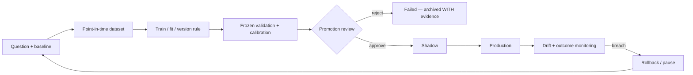

# Model and Algorithm Registry

**Last reviewed:** 2026-08-30 · **Owner:** TBD

Covers deterministic rules, heuristics, statistical systems, trained estimators and LLM
nodes — a model is anything that produces a decision, not only a fitted estimator.

**Column contract.** The previous revision shipped every row shifted one position left, so
lifecycle status appeared under "Runtime exposure" and the recommendation under "Status".
Columns below are: **Status** = lifecycle state from the controlled vocabulary in the
[README](README.md); **Rec** = KEEP / RETEST / RESTRUCTURE / PAUSE / REMOVE.

**Evidence caveat.** Training cutoff, artifact version and historical results are
`UNKNOWN / NEEDS HISTORY TRACE` unless a versioned artifact or report proves them.
Results produced before the replay-integrity fixes land are not trustworthy evidence —
see [#906](https://github.com/TeneikaAskew/stocks/issues/906).

## Deterministic and heuristic systems

| ID | Name | Type | Decision produced | Code | Status | Rec | Blocking issues |
|---|---|---|---|---|---|---|---|
| MODEL-STRAT-001 | STRAT candle scenarios | Deterministic | classify bars 1 / 2U / 2D / 3 | `lib/strat.py` | Production but needs remediation | KEEP | — |
| MODEL-FTFC-001 | Full Time Frame Continuity | Deterministic | multi-timeframe direction and alignment | `lib/strat.py`, `lib/exec_backtest/ftfc.py` | Production but needs remediation | RETEST | [#884](https://github.com/TeneikaAskew/stocks/issues/884) weighted-vote semantics |
| MODEL-LEVEL-001 | Structural level state / magnitude | Heuristic | proximity, state, targets | `lib/strat_levels.py` | Production but needs remediation | RETEST | [#866](https://github.com/TeneikaAskew/stocks/issues/866) PDH/PDL off-by-one · [#907](https://github.com/TeneikaAskew/stocks/issues/907) legacy positional fallback · [#908](https://github.com/TeneikaAskew/stocks/issues/908) executable repricing |
| MODEL-IND-001 | Technical indicators / RVOL / ORB | Deterministic / statistical | indicator and opening-range context | `lib/indicators.py`, `lib/signals.py` | Production but needs remediation | RETEST | [#870](https://github.com/TeneikaAskew/stocks/issues/870) RSI warm-up · [#892](https://github.com/TeneikaAskew/stocks/issues/892) ATR warm-up · [#894](https://github.com/TeneikaAskew/stocks/issues/894) premarket bars in RTH VWAP · [#912](https://github.com/TeneikaAskew/stocks/issues/912) duplicate implementations |
| MODEL-MOM-001 | Momentum strategy | Heuristic | long/short eligibility | `lib/strategies/momentum.py` | Production but needs remediation | RETEST | [#285](https://github.com/TeneikaAskew/stocks/issues/285) duplicate inline path · [#701](https://github.com/TeneikaAskew/stocks/issues/701) two divergent voters |
| MODEL-MR-001 | Mean reversion strategy | Heuristic | reversion eligibility | `lib/strategies/mean_reversion.py` | Production but needs remediation | RETEST | [#249](https://github.com/TeneikaAskew/stocks/issues/249) walk-forward RSI thresholds |
| MODEL-AGREE-001 | Agreement scoring | Heuristic / ensemble | combine strategy evidence into a score | `lib/strategies/agreement.py` | Production but needs remediation | RESTRUCTURE | [#905](https://github.com/TeneikaAskew/stocks/issues/905) freeze and prospectively validate expectancy |
| MODEL-EXIT-001 | Exit / stop / target policy | Heuristic | exit, stop, target selection | `lib/strategies`, `gcp/signal_monitor.py`, `exit_config_overrides` | **Broken** | RESTRUCTURE | [#815](https://github.com/TeneikaAskew/stocks/issues/815) live has no stop-loss, backtest does · [#816](https://github.com/TeneikaAskew/stocks/issues/816) daily loss limit structurally unenforceable · [#862](https://github.com/TeneikaAskew/stocks/issues/862) overrides 113 days stale on the live fire path · [#915](https://github.com/TeneikaAskew/stocks/issues/915) same-minute ordering |
| MODEL-BRIEF-001 | Brief bias / movement statement | Heuristic | market bias and explanation | `lib/strategies/brief_bias.py`, `lib/movement_statement.py` | Experimental | RETEST | [#900](https://github.com/TeneikaAskew/stocks/issues/900) cache not keyed by session date |
| MODEL-GAMMA-001 | Gamma / GEX regime and proximity | Deterministic / statistical | gamma exposure and regime context | `lib/gamma.py`, `lib/features/intraday_gex.py`, `lib/strategies/gamma_proximity.py` | **Broken on `main`** | RETEST | [#812](https://github.com/TeneikaAskew/stocks/issues/812) fabricated flips from float underflow · [#826](https://github.com/TeneikaAskew/stocks/issues/826) `or 0` on gamma/OI · [#871](https://github.com/TeneikaAskew/stocks/issues/871) contract multiplier · [#872](https://github.com/TeneikaAskew/stocks/issues/872) implied-move scaling · [#876](https://github.com/TeneikaAskew/stocks/issues/876) balance semantics · [#880](https://github.com/TeneikaAskew/stocks/issues/880) GEX scope · [#896](https://github.com/TeneikaAskew/stocks/issues/896) VEX invariants |
| MODEL-OPT-001 | Options Greeks / parity / theta | Statistical | Greeks, parity spot, theta path | `lib/options_greeks.py`, `platform/src/lib/greeksCalculator.ts` | Production but needs remediation | RETEST | [#825](https://github.com/TeneikaAskew/stocks/issues/825) fabricated $100 underlying · [#878](https://github.com/TeneikaAskew/stocks/issues/878) discount parity spot · [#927](https://github.com/TeneikaAskew/stocks/issues/927) hard-coded rates · [#607](https://github.com/TeneikaAskew/stocks/issues/607) 0DTE theta anchored to EOD |
| MODEL-EARN-001 | Earnings reaction analytics | Statistical / heuristic | event reaction and strategy lean | `lib/earnings_reactions.py` | Experimental | RETEST | [#863](https://github.com/TeneikaAskew/stocks/issues/863) winners posted to Discord at 99 days old |
| MODEL-RANK-001 | Candidate ranker | Heuristic / ensemble | rank trade candidates | `lib/agents/ranker` | Experimental | RESTRUCTURE | — |

### MODEL-GAMMA-001 — reproduced on `main`, 2026-08-30

[#812](https://github.com/TeneikaAskew/stocks/issues/812) is **live on `main` at `8eccde7`**,
not merely reported. Reproduced directly against `lib/gamma.py::compute_gamma_flip_bs`: a chain
whose contracts all underflow to zero BS gamma (deep-OTM strikes, near-zero IV) at `spot=100.0`
returns **`100.0`** — a fabricated gamma flip located exactly at spot, which downstream code
cannot distinguish from a real one.

```
main @ 8eccde7, all-underflow chain, spot=100 -> 100.0
```

The docstring promises the opposite: *"NO SILENT FALLBACK (§3.7): returns `None` — never a
fabricated 0"*. The guard covers too few contracts and unusable IV, but not the case where every
gamma underflows and `G(S)` is identically zero, so every grid point reads as a crossing.

Two open PRs fix it and **both return `None`** on this case:
[#936](https://github.com/TeneikaAskew/stocks/pull/936) (reject gamma underflow as a flip) and
[#942](https://github.com/TeneikaAskew/stocks/pull/942) (preserve isolated zero-gamma grid
crossings). Neither is merged. Until one lands, any `gamma_flip` value at or very near spot
should be treated as suspect, and #812's own note about **54 contaminated `gamma_levels_eod`
rows** remains outstanding — the issue calls those "a silent lie to anything reading
`gamma_levels_eod`".

This is why MODEL-GAMMA-001 reads **Broken on `main`** rather than Retest Required: the defect is
not awaiting re-evaluation, it is presently emitting wrong values in production.

## Learned models

| ID | Name | Type | Decision produced | Code / artifact | Status | Rec | Evidence |
|---|---|---|---|---|---|---|---|
| MODEL-MAG-001 | Magnitude prediction | ML | target magnitude class / probability | `gcp/research/magnitude_engine`, `platform/api/routers/magnitude.py` | **Invalidated** | PAUSE | Research arc closed **PROJECT VERDICT FAIL by gate 7** ([#575](https://github.com/TeneikaAskew/stocks/pull/575)). Later argmax-collapse incident: predicted TIGHT on 588/588 live bars; promotion gate added in [#810](https://github.com/TeneikaAskew/stocks/pull/810), no-op fixed in [#811](https://github.com/TeneikaAskew/stocks/pull/811). Open: [#874](https://github.com/TeneikaAskew/stocks/issues/874), [#875](https://github.com/TeneikaAskew/stocks/issues/875), [#890](https://github.com/TeneikaAskew/stocks/issues/890) |
| MODEL-DIR-001 | STRAT direction model | ML | direction classification | `gcp/research/strat_engine` | **Failed** | REMOVE / archive | Directionality research verdict **DEAD-END** ([#588](https://github.com/TeneikaAskew/stocks/pull/588)); experimental direction features **FAIL** ([#566](https://github.com/TeneikaAskew/stocks/pull/566)) |
| MODEL-TYPE-001 | STRAT type / structure continuation | ML | scenario / type classification | `gcp/research/strat_engine` | Shadow | RETEST | Wired behind a feature flag ([#647](https://github.com/TeneikaAskew/stocks/pull/647)); QQQ-30m explicitly gated as not calibrated ([#648](https://github.com/TeneikaAskew/stocks/pull/648)) |
| MODEL-NEXTBAR-001 | STRAT next-bar edge | Statistical / ML | next-candle prediction | `gcp/research/strat_engine`, `lib/strat.py` | Research | RETEST | Held-out OOS forward-walk confirms edge ([#593](https://github.com/TeneikaAskew/stocks/pull/593), [#594](https://github.com/TeneikaAskew/stocks/pull/594)); CLV ablation quantifies mechanical vs genuine ([#595](https://github.com/TeneikaAskew/stocks/pull/595), [#598](https://github.com/TeneikaAskew/stocks/pull/598)) |
| MODEL-BREAK-001 | Breakout meta-model | ML / ensemble | filter / rank breakouts | `gcp/research`, `lib/strategies` | Research | RETEST | Net reconfirmed in [#598](https://github.com/TeneikaAskew/stocks/pull/598) |
| MODEL-STYLE-001 | User style mining | ML | learned personal trading pattern | `platform/api/routers/backtest.py` (`/api/style/mine-and-validate`), `user_style_results` | Experimental | RETEST | Origin [#707](https://github.com/TeneikaAskew/stocks/pull/707) — walk-forward validated into the playbook seam |
| MODEL-CALIB-001 | Ticker calibration / walk-forward | Statistical | per-ticker thresholds written to production | `lib/walk_forward.py`, `ticker_calibration` | **Invalidated** | RESTRUCTURE | [#813](https://github.com/TeneikaAskew/stocks/issues/813) "out-of-sample" calibration is in-sample **and auto-writes production** · [#817](https://github.com/TeneikaAskew/stocks/issues/817) exhaustive in-sample mining, no multiple-testing control · [#886](https://github.com/TeneikaAskew/stocks/issues/886) survivorship bias · [#380](https://github.com/TeneikaAskew/stocks/issues/380) close the loop |
| MODEL-FEAT-X | Experimental feature families | Statistical | cross-asset / news / options / vol features | `lib/features/experimental` | Research | PAUSE | [#784](https://github.com/TeneikaAskew/stocks/issues/784) incremental-vol ablation open |

## LLM nodes

Full graph, concurrency and risk controls: [08](08-AI-AGENT-ARCHITECTURE.md). All 14 nodes
are **Experimental**; none has promotion evidence.

| ID | Nodes | Count | Numeric authority | Status |
|---|---|---|---|---|
| MODEL-LLM-ANALYST | market, strat, options, gamma, catalyst, sentiment | 6 | explanation only | Experimental |
| MODEL-LLM-DEBATE | bull, bear | 2 | explanation only | Experimental |
| MODEL-LLM-JUDGE | research_manager | 1 | no invented confidence or levels | Experimental |
| MODEL-LLM-TRADER | trader | 1 | narrative over deterministic inputs | Experimental |
| MODEL-LLM-RISK | aggressive, conservative, neutral | 3 | **numeric plan field discarded** (`orchestrator.py:490-492`) | Experimental |
| MODEL-LLM-PM | portfolio_manager | 1 | obeys exposure/config constraints | Experimental |
| MODEL-SUM-001 | deterministic + LLM summarizers | — | preserve supplied values | Experimental — [#827](https://github.com/TeneikaAskew/stocks/issues/827) silent fallback |

## Status summary

| Status | Models |
|---|---|
| Production but needs remediation | 8 |
| Broken | 1 (MODEL-EXIT-001) |
| Retest Required | 1 (MODEL-GAMMA-001) |
| Invalidated | 2 (MODEL-MAG-001, MODEL-CALIB-001) |
| Failed | 1 (MODEL-DIR-001) |
| Shadow | 1 (MODEL-TYPE-001) |
| Research | 3 |
| Experimental | 3 + 7 LLM node groups |

**No model in this repository currently meets the promotion bar.** Two carry explicit
recorded FAIL/DEAD-END verdicts ([#575](https://github.com/TeneikaAskew/stocks/pull/575),
[#588](https://github.com/TeneikaAskew/stocks/pull/588)) and are retained here deliberately —
negative results are evidence and must stay visible.

## Promotion criteria

Promotion requires REQ-MODEL-001..003: point-in-time-safe feature generation; a frozen
validation set unseen during selection; realistic costs and session semantics; comparison
against a stated baseline; cohort and sample-size reporting; calibration where probabilistic;
a threshold fixed in advance; shadow evidence; artifact/version lineage; monitoring and a
rollback path. Deterministic systems require shared live/replay fixtures and versioned
configuration. **Training must not write production as a side effect of a job completing**
— the precedent gate is `mag_walk_forward.promotion_verdict` from
[#810](https://github.com/TeneikaAskew/stocks/pull/810); reuse it rather than adding a second mechanism.



## Traceability

| Aspect | Reference |
|---|---|
| Registry origin | [#591](https://github.com/TeneikaAskew/stocks/pull/591) exhaustive experiment registry · [#596](https://github.com/TeneikaAskew/stocks/pull/596) STRAT-NEXTBAR record |
| Validation framework | [#355](https://github.com/TeneikaAskew/stocks/pull/355) per-factor walk-forward · [#548](https://github.com/TeneikaAskew/stocks/pull/548) walk-forward as first-class pipeline stage · [#735](https://github.com/TeneikaAskew/stocks/pull/735) BSVP 11.5-year validation |
| Magnitude arc | [#597](https://github.com/TeneikaAskew/stocks/pull/597) productionize → [#575](https://github.com/TeneikaAskew/stocks/pull/575) FAIL verdict → [#629](https://github.com/TeneikaAskew/stocks/pull/629)/[#637](https://github.com/TeneikaAskew/stocks/pull/637)/[#638](https://github.com/TeneikaAskew/stocks/pull/638) remediation → [#810](https://github.com/TeneikaAskew/stocks/pull/810) promotion gate → [#811](https://github.com/TeneikaAskew/stocks/pull/811) no-op fix |
| Governance | CLAUDE.md Rule 0, Rule 3.6, Rule 3.7; agents `replay-integrity-reviewer`, `trading-logic-reviewer`, `gcp-capacity-cost-reviewer` |
| Tests | `tests/test_walk_forward*.py`, `tests/test_strat*.py`, `tests/test_magnitude*.py`, `tests/test_gamma*.py` |
