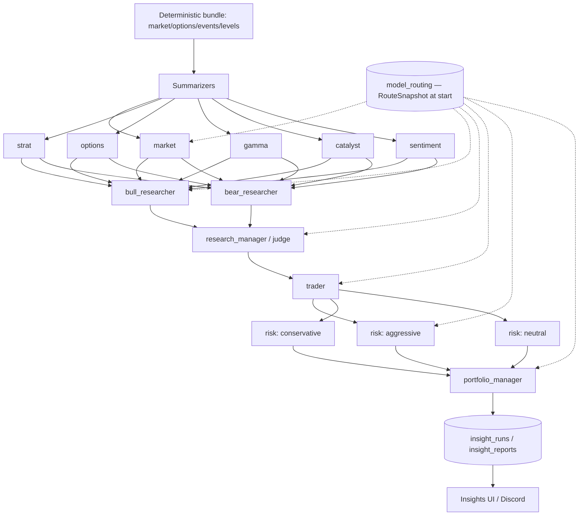
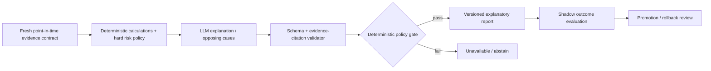

# AI / LLM Agent Architecture

**Last reviewed:** 2026-08-30 · **Owner:** TBD

## Current graph — VERIFIED — CODE

Reconstructed from `lib/agents/orchestrator.py` at `d335f2f`, node by node, from the
`_run_node(role=...)` call sites rather than from any diagram.

> **The module's own docstring is stale.** `lib/agents/orchestrator.py:4-33` claims
> "Graph topology (11 nodes)" and lists **four** analysts (market, strat, options,
> catalyst). The executable declaration at line 310 is **six**:
> `analyst_sections = ("market", "strat", "options", "gamma", "catalyst", "sentiment")`.
> The real total is **14 routed LLM calls**. This stale docstring is the upstream cause
> of the same error in the 2026-08-27 audit (corrected in `59fd6eb`) and in the first
> revision of this plan. Fixing the docstring is tracked as a code change, not a doc
> change — see "Drift control" below.

| # | Tier | Nodes | Concurrency | Code |
|---|---|---|---|---|
| 1 | Analyst | `market`, `strat`, `options`, `gamma`, `catalyst`, `sentiment` (6) | `asyncio.gather(..., return_exceptions=True)` | `orchestrator.py:309-337` |
| 2 | Debate | `bull`, `bear` (2) | parallel | `orchestrator.py:350-370` |
| 3 | Judge | `judge` / research_manager (1) | serial | `orchestrator.py:384` |
| 4 | Planner | `trader` (1) | serial | `orchestrator.py:397` |
| 5 | Risk | `aggressive`, `conservative`, `neutral` (3) | `asyncio.gather` | `orchestrator.py:419-432` |
| 6 | Synthesis | `portfolio_manager` (1) | serial | `orchestrator.py:445` |

## Existing risk controls — VERIFIED — CODE

The plan must not describe the LLM tier as numerically unconstrained; two controls exist today.

| Control | Evidence | Effect |
|---|---|---|
| Persona numeric output is discarded | `orchestrator.py:490-492` — "The numeric `plan` field the LLM personas may emit is intentionally IGNORED here" | Risk personas cannot set prices, stops or targets; they contribute flags only |
| Neutral persona is canonical | `orchestrator.py:597-608` — neutral is the headline plan (1 ATR stop, 1R/2R/3R targets); aggressive/conservative retained as alternates | Deterministic selection, not LLM choice |
| Routes snapshotted at start | `RouteSnapshot`, design note `orchestrator.py:38-41` | `model_versions` in the report is internally consistent; no mid-run route drift |
| Tier failures isolated | `return_exceptions=True` on analyst and risk tiers; failures recorded in `failed_sections` | One analyst failure degrades the report rather than killing the run |

**Open defect against these controls:** [#867](https://github.com/TeneikaAskew/stocks/issues/867) — risk reviewers
evaluate a different plan than the final deterministic plan. The controls above are necessary
but not currently sufficient.

## Node contract

| Node | Input | Output / downstream | Numeric authority | Failure behavior | Status |
|---|---|---|---|---|---|
| Summarizers | deterministic bundle | compressed context → analysts | preserve supplied values and as-of; no fabrication | silent fallback open: [#827](https://github.com/TeneikaAskew/stocks/issues/827) (`summarizers.py:547-565`) | Experimental |
| Analyst ×6 | bundle section via `_analyst_payload` | `AnalystOutput` → debate | explain supplied numbers only | recorded in `failed_sections`, run continues | Experimental |
| Bull / Bear | full analyst tier via `_debate_payload` | structured thesis → judge | explanation only | adapter/schema error explicit | Experimental |
| Judge | both cases | `JudgeOutput` → trader | no invented confidence or levels | fail-closed or marked incomplete | Experimental |
| Trader | judge synthesis | `TraderOutput` → risk tier | narrative over deterministic inputs | plan-unavailable stub on LLM error (`orchestrator.py:415-417`) | Experimental |
| Risk ×3 | `_risk_payload(bundle, trader)` | `RiskPersonaOutput` → PM | **numeric plan field discarded** | gather-isolated | Experimental |
| Portfolio manager | persona plans + trader | `InsightReport` → persistence | obeys exposure/config constraints | — | Experimental |

Providers/adapters: `lib/agents/anthropic_adapter.py`, `lib/agents/vertex_adapter.py`.
Cost is totalled per call from `Usage.cost_usd()` and attributed per role/sub
(`orchestrator.py:100-102`, e.g. `analyst:market`, `risk:neutral`).

## Drift control — required, not yet implemented

This graph has now been documented incorrectly three times (module docstring, the
2026-08-27 audit, this plan's first revision). Documentation discipline has failed
repeatedly; the fix is executable.

**REQ-LLM-002 (PROPOSED):** A test SHALL assert that the node roster documented here
equals the roster declared in `orchestrator.py` (`analyst_sections`, `risk_sub_names`,
and the `_run_node(role=...)` call sites), failing CI on divergence. The stale
`orchestrator.py:4-33` docstring SHALL be corrected in the same change.

## Target graph — PROPOSED — TARGET

Whether any node may recommend actions rather than explain them is
**PRODUCT DECISION REQUIRED** — see [15](15-OPEN-DECISIONS.md).

## Traceability

| Aspect | Reference |
|---|---|
| Blocking issues | [#916](https://github.com/TeneikaAskew/stocks/issues/916) ablate graph + prohibit unsupported numeric recommendations · [#867](https://github.com/TeneikaAskew/stocks/issues/867) risk/plan mismatch · [#827](https://github.com/TeneikaAskew/stocks/issues/827) summarizer silent fallback · [#442](https://github.com/TeneikaAskew/stocks/issues/442) ORB feed for direction |
| Origin / evolution PRs | [#344](https://github.com/TeneikaAskew/stocks/pull/344) reflection memory · [#351](https://github.com/TeneikaAskew/stocks/pull/351) deterministic conviction calibration · [#353](https://github.com/TeneikaAskew/stocks/pull/353) brief↔insights divergence card · [#362](https://github.com/TeneikaAskew/stocks/pull/362) key-levels derivation · [#417](https://github.com/TeneikaAskew/stocks/pull/417) RiskMetrics column + reviewers read facts · [#450](https://github.com/TeneikaAskew/stocks/pull/450) unify Gemini callers · [#451](https://github.com/TeneikaAskew/stocks/pull/451) remove signal_alerts from bundle (break feedback loop) |
| Audit evidence | [#290](https://github.com/TeneikaAskew/stocks/pull/290) track-C AI insights eval · [#416](https://github.com/TeneikaAskew/stocks/pull/416) risk-reviewer empirical validation (reverses earlier eyeballed conclusions) · [#804](https://github.com/TeneikaAskew/stocks/pull/804) |
| Code | `lib/agents/orchestrator.py`, `prompts.py`, `schemas.py`, `summarizers.py`, `trade_planner.py`, `anthropic_adapter.py`, `vertex_adapter.py` |
| Tests | `tests/test_agents_*.py`, `tests/test_insight_pipeline*.py` — no graph-shape assertion exists (see REQ-LLM-002) |
