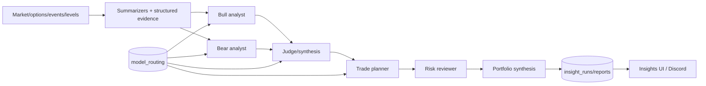
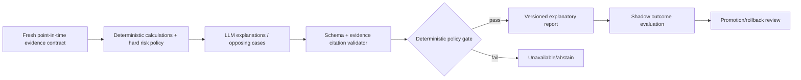

# AI / LLM Agent Architecture

## Current graph — VERIFIED — CODE at graph level
`lib/agents/orchestrator.py`, prompts, schemas, routing/adapters, summarizers, ranker and trade planner define the current implementation. Exact conditional edges and deployed provider/model must be read with runtime `model_routing`; documentation diagrams do not override code.

## Node contract
| Node | Role/input | Schema/output/downstream | Numeric authority/risk | Failure/cost/persistence | Status/target |
|---|---|---|---|---|---|
| Summarizers | deterministic data and derived evidence | compressed context → analysts | preserve values/as-of; no fabrication | explicit unavailable; token reduction | Experimental; version inputs |
| Bull/Bear | opposing evidence cases | structured thesis → judge | explain supplied numbers only | adapter/schema failure explicit; pricing catalog | Experimental; evidence citations |
| Judge | reconcile cases | structured synthesis → planner | no invented confidence/levels | fail closed or marked incomplete | Experimental; deterministic conflict rules |
| Trader/planner | transform approved evidence | bounded plan → risk | calculations should be deterministic inputs | persist node/model/prompt version | Experimental; narrative-only authority |
| Risk reviewer | challenge plan | risks/veto/amendment → portfolio | veto/flag, not invent replacements | validation evidence is limited | Experimental; hard deterministic gates |
| Portfolio manager | cross-candidate synthesis | final report → persistence | obey exposure/config constraints | persist trace/cost/outcome | Experimental; constrained aggregation |

Providers/adapters are in `anthropic_adapter.py` and `vertex_adapter.py`; selected model, prompts, schema, token/cost accounting and fallback must be persisted per node. Historical evaluation is insufficient for a Production label.

## Target graph — PROPOSED

LLMs should explain and organize verified inputs; product owners must explicitly decide whether any node may recommend actions. Cost, latency, schema failure, hallucination, abstention, and outcome metrics require cohort-aware monitoring.
