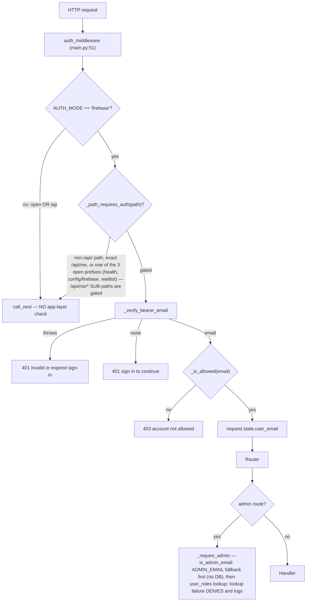

# Security, Authentication, Authorization, Tenancy

**Last reviewed:** 2026-09-04 · **Owner:** TBD · **Trust status:** Production but needs remediation

> 2026-09-04 refresh: admin authorization is now role-based (the shared
> `X-Admin-Token` gate is gone), the open-path list split into exact vs
> prefix matching, `/api/me/profile` landed with fail-closed ownership, and
> deploys gained a CI identity with its own trust boundary. Citations
> re-verified against current line numbers.

## Enforcement mechanism — VERIFIED — CODE

Authentication is **global ASGI middleware**, not a FastAPI dependency. There are no
`Depends(...)` authentication dependencies anywhere in `platform/api`. A maintainer
looking for auth decorators on routers will find none and may wrongly conclude a route
is ungated.

| Fact | Evidence |
|---|---|
| Registered as HTTP middleware on the app | `platform/api/main.py:70` — `app.middleware("http")(auth_middleware)` |
| Runs before any router | ASGI middleware ordering |
| Gate decided purely by URL path | `auth.py:139-144` — `_path_requires_auth(path)` |
| Non-`/api/` paths are never gated | `auth.py:140-141` — `if not path.startswith("/api/"): return False` |
| Open paths split EXACT vs PREFIX | `auth.py:48-49` — `_OPEN_API_EXACT = ("/api/me",)`; `_OPEN_API_PREFIXES = ("/api/health", "/api/config/firebase", "/api/waitlist")`. `/api/me` is exact-only so its sub-paths (`/api/me/preferences`, `/api/me/profile`) stay gated — the old prefix match opened `/api/me/anything` |
| Admin uses a direct call, not a dependency | `admin.py:51` `_require_admin(request)` invoked inside each handler; role check via `auth.is_admin_email` (see Authorization) |



## The three modes, and what each actually enforces

| Mode | App-layer enforcement | Identity source | Notes |
|---|---|---|---|
| `firebase` | **Yes** — bearer verified, allowlist applied | `_verify_bearer_email` | The only mode with application enforcement |
| `iap` | **None** — `call_next` unconditionally | `_iap_email` header, read lazily | Relies entirely on the perimeter |
| `open` | **None** — `call_next` unconditionally | none | Intended for local development |

`auth.py:134-140`:
```python
if AUTH_MODE != "firebase":
    # iap: edge already gated; identity read lazily via current_user_email.
    # open: local dev, no auth.
    return await call_next(request)
```

## Default disagreement — deployment vs. source (Evidence Rule 26)

| Layer | Default | Evidence |
|---|---|---|
| Application source | `open` | `auth.py:34` — `os.environ.get("AUTH_MODE", "open")` |
| Primary deploy script | `iap` | `platform/deploy.sh:91` — `AUTH_MODE_VAL="${AUTH_MODE:-iap}"` |
| Staging deploy path | `firebase` + **public ingress** | `platform/deploy.sh:93-98` — `STAGING_SERVICE=1` sets `PUBLIC=1`, `AUTH_MODE_VAL="firebase"` |

**These differ, and the difference changes the risk statement for
[#911](https://github.com/TeneikaAskew/stocks/issues/911).** The exposure is not "production runs
`open`" — the standard deploy path sets `iap`. It is that **neither `open` nor `iap` performs any
application-layer check**, so:

1. Any deploy path that does not set `AUTH_MODE` (a manual `gcloud run deploy`, a new job or
   service, a container run outside `platform/deploy.sh`) silently degrades to `open`.
2. In `iap` mode, if the service becomes reachable around the perimeter — misconfigured ingress,
   a public revision, a direct `run.app` URL — a **missing IAP identity is not rejected by the
   application**. Remediation scoped only to `open` leaves this untested.

## Confirmed exposure: `/dev` on public Firebase staging — VERIFIED — CODE

Found by Codex review on PR #931 and reproduced here.

| Step | Evidence |
|---|---|
| Staging is public with Firebase auth | `platform/deploy.sh:93-98` — `PUBLIC=1`, `AUTH_MODE_VAL="firebase"`, no IAP |
| Middleware exempts `/dev` (not `/api/`) | `auth.py:140-141` |
| Handler allows when no IAP header present | `main.py:366-372` — `email = _iap_user_email(request)`; the 403 fires only `if email is not None and email != _DEV_ALLOWED_EMAIL`. With no IAP in staging, `email is None` → falls through. Re-verified 2026-09-04: unchanged |
| Page contents | service account, IAP OAuth audience, `K_REVISION`, service URL, strat-engine model state |

Net: on a `STAGING_SERVICE=1` deployment, `/dev` is reachable **without sign-in**.
Neither gate applies — the middleware skips non-`/api/` paths and the handler's own check
is a no-op without an IAP header. `_DEV_ALLOWED_EMAIL` defaults to a hardcoded address
(`main.py:245`). Formerly covered by `platform/tests/dev.spec.ts`, which was deleted in the
#957 frontend split with no replacement, and which in any case did not exercise the staging
(`PUBLIC=1`, no-IAP) configuration — [#943](https://github.com/TeneikaAskew/stocks/issues/943)'s
acceptance tests must be written fresh in this repo (starting point recoverable via
`git show 9f28a60^:platform/tests/dev.spec.ts`).

**Status:** tracked by [#943](https://github.com/TeneikaAskew/stocks/issues/943). **Next action:** choose whether to authenticate, remove, or explicitly accept the endpoint after security review; do not treat it as covered by #911, whose scope is the `AUTH_MODE` default.

## Authorization

| Boundary | Implementation | Gap |
|---|---|---|
| Admin — VERIFIED — CODE | Role-based, no shared secret. `admin.py:51 _require_admin` calls `auth.is_admin_email` (`auth.py:188-228`): `ADMIN_EMAIL` env fallback checked FIRST without touching the DB (so an outage or empty table cannot lock out the operator), then a `user_roles` lookup (`role='admin'`). A failed lookup DENIES and logs at ERROR — never grants on error, never a silent deny. The former `X-Admin-Token` gate is fully removed (grep: zero references in `platform/api`). Identity is per-user, revocable, attributable. In `open` mode `current_user_email` is None, so admin routes are closed rather than falling back to a secret. `is_admin_email` is shared with `/api/me`, so the `is_admin` flag the frontend renders cannot drift from the check gating the routes | `ADMIN_EMAIL` defaults to a hardcoded personal address (`auth.py:180`) — an unset env var silently grants that address admin on any deployment |
| Admin role management | `PUT /api/admin/users/{uid}/roles` (`admin.py:884`) writes `user_roles`; itself admin-gated | Bootstrap is the env fallback by design |
| Allowlist | `auth.py:128-136 _is_allowed` | **`AUTH_OPEN_SIGNUP` defaults to `"1"`**, so any verified Firebase identity is allowed. `AUTH_ALLOWED_EMAILS` is only consulted when signup is explicitly closed. The product is effectively open-registration by default |
| Ownership / tenancy | per-user scoping for journal ([#626](https://github.com/TeneikaAskew/stocks/pull/626)) and watchlists ([#635](https://github.com/TeneikaAskew/stocks/pull/635)); preferences and profile scope every row by the SERVER-verified identity with a fail-closed guard (see below) | No repo-wide immutable-owner invariant; multi-user policy **not verified** |
| Deployment perimeter | IAP, Cloud Run IAM/ingress, service identities | `PUBLIC=1` paths bypass the IAM gate by design |

### Per-user rows: preferences and profile — VERIFIED — CODE

`/api/me/preferences` and `/api/me/profile` (the latter added in
[#982](https://github.com/TeneikaAskew/stocks/pull/982)) follow one pattern:

| Property | Evidence |
|---|---|
| Gated despite living under `/api/me` | `/api/me` is in `_OPEN_API_EXACT`, not the prefix list (`auth.py:48`) — sub-paths require a verified token in firebase mode |
| Row key is the server-resolved identity, never request-body input | `profile.py:105-117 _profile_owner` — `auth.current_user_email(request)`; mirrors `preferences._prefs_owner`. **Verification strength is mode-dependent**: in `firebase` mode the key comes from a cryptographically verified ID token; in `iap` mode it is read from the `X-Goog-Authenticated-User-Email` header with no application-layer verification (`auth.py:100-104`), so IAP tenancy depends entirely on the perimeter — under the perimeter-bypass scenario documented above, a direct caller could supply the owner value |
| Fail-closed if the middleware gate ever regresses | same function: absent identity in firebase mode raises 401 rather than serving the shared `"local"` row to an anonymous caller |
| Unknown fields rejected, not dropped | `ProfileUpdate` uses `extra="forbid"` → 422 (no fabricated "saved") |
| Non-finite floats rejected before the DB | `Field(allow_inf_nan=False)` on `account_size` / `risk_per_trade_pct` — a stored `inf` would 500 every later read |
| DB failure is a loud 503, never an empty result | `profile.py:142-156` |

### Frontend/backend open-list sync — DRIFT — VERIFIED — CODE

`auth.py:37-40` requires solyra's `src/lib/authedFetch.ts` open list to stay in
sync. The two have drifted **in shape**: the backend split `/api/me` into an
EXACT match (sub-paths gated), while solyra still prefix-matches its whole
list (`authedFetch.ts:45` includes `/api/me` in `OPEN_PREFIXES`;
`authedFetch.ts:91` — `path === p || path.startsWith(p)`). Consequence: the
frontend treats `/api/me/preferences` / `/api/me/profile` as "open", meaning a
401 there is read as "signed out" rather than tripping the blocked-session
state, and the request may go out anonymously when token acquisition fails
(guaranteed 401). The token still attaches whenever present, so signed-in
behaviour is correct — this is a degraded-path semantics drift, not an
exposure. Fix belongs in solyra: mirror the exact/prefix split.

## Secrets

| Item | Status | Issue |
|---|---|---|
| `DISCORD_BOT_TOKEN`, `DISCORD_PUBLIC_KEY` via `--set-env-vars` on a public service | CRITICAL | [#830](https://github.com/TeneikaAskew/stocks/issues/830) |
| `ADMIN_TOKEN`, `EW_USER`/`EW_PASS` via `--set-env-vars` — still OPEN. The API's token GATE is gone, but `gcp/deploy.sh` still reads the `admin-token` secret and injects it in plaintext into the insight-pipeline job env (`gcp/deploy.sh:75-92`); the exposure persists (and its consumer may now be vestigial, since the API no longer accepts the token) | HIGH | [#850](https://github.com/TeneikaAskew/stocks/issues/850) |
| Secret pasted into ad-hoc SQL is logged at INFO | MEDIUM | [#836](https://github.com/TeneikaAskew/stocks/issues/836) |
| Pervasive `SELECT *` (data minimization) | MEDIUM | [#837](https://github.com/TeneikaAskew/stocks/issues/837) |
| Token in `run:` argv in a retired workflow | LOW | [#839](https://github.com/TeneikaAskew/stocks/issues/839) |
| Non-constant-time admin token comparison | Resolved — token gate removed entirely; role check replaced it | [#838](https://github.com/TeneikaAskew/stocks/issues/838) |
| API keys moved to `--set-secrets` | Done | [#318](https://github.com/TeneikaAskew/stocks/pull/318) |

Environment variables in scope: `AUTH_MODE`, `AUTH_OPEN_SIGNUP`, `AUTH_ALLOWED_EMAILS`,
`ADMIN_EMAIL`, `DEV_ALLOWED_EMAIL`, `IAP_OAUTH_CLIENT_ID`, `FIREBASE_API_KEY`.
All verified present in code. (`ADMIN_TOKEN` is no longer read by the API —
the token gate is gone — but is still injected into the insight-pipeline job
by `gcp/deploy.sh`; see the #850 row above.)
`FIREBASE_API_KEY`, `FIREBASE_AUTH_DOMAIN`, and `FIREBASE_APP_ID` are public
web-SDK identifiers — access is enforced server-side by token verification,
not by hiding them; a firebase-mode deploy fails fast when any of the three
is unset (`platform/deploy.sh:161-168`).

## CI deploy identity — added 2026-09-04 — VERIFIED — CODE

There are TWO CI deploy identities with different boundaries; conflating
them mis-scopes a review:

1. **GitHub Actions → `trading-platform-staging` only.**
   `.github/workflows/deploy-staging.yml`
   ([#983](https://github.com/TeneikaAskew/stocks/pull/983) /
   [#985](https://github.com/TeneikaAskew/stocks/pull/985)) hardcodes the
   staging service and runs `STAGING_SERVICE=1 ./platform/deploy.sh` as the
   WIF SA. The WIF trust boundary below applies to THIS path only.
2. **Cloud Build triggers → production, as `trading-runner@`.**
   `gcp/cloudbuild/README.md` records live triggers whose authoritative
   config is in Cloud Build itself: `deploy-platform-staging` (push to main
   touching `platform/`, `lib/`, …) runs `./platform/deploy.sh`, and
   `promote-platform-prod` (manual) shifts `trading-platform` traffic to the
   `staging` tag. Its boundary is Cloud Build trigger config + the
   `trading-runner@` IAM, NOT WIF. **Open discrepancy:** the in-repo config
   (`deploy-platform-staging-cloudbuild.yaml`) invokes `platform/deploy.sh`
   with NO `STAGING=1`/`STAGING_SERVICE=1`, which in that script means a
   full-traffic PRODUCTION deploy — contradicting the file's own header
   ("staging-tagged revision, 0% traffic") and making the promote trigger
   moot. Verify the live trigger (`gcloud builds triggers describe
   deploy-platform-staging`) and reconcile; until then, treat "what deploys
   production, when, with what traffic" as unverified.

Operator-run `platform/deploy.sh` under a personal gcloud identity remains a
third, manual path for both services.

Staging deploys moved from an operator's personal gcloud login to the
workflow running as the WIF service account `arch-refresh-bot@…`. That SA is
no longer read-only. Each role below was proven necessary by an observed
failed run on 2026-09-04; where a claim is about the LIVE project rather than
the workflow's requirement, it says so and carries the date it was checked.

| Role | On | Why |
|---|---|---|
| `cloudbuild.builds.editor` | project | `gcloud builds submit` |
| `serviceusage.serviceUsageConsumer` | project | also required by `builds submit`; its absence reports as a *bucket* error |
| object write + `storage.buckets.get` | the Cloud Build bucket | `objectAdmin` ALONE silently fails (verified with `gcloud iam roles describe`: it has no `storage.buckets.get`). Least privilege is `objectAdmin` + `legacyBucketReader`; the live project instead grants the broader `storage.admin` (checked 2026-09-04), which is the variant actually exercised end-to-end |
| `run.admin` | project | deploy the service (staging is `--allow-unauthenticated`, which asserts IAM) and execute the refresh job |
| `iam.serviceAccountUser` | **two** SAs | `trading-platform-svc@…` (the deploy sets the revision's runtime identity) AND `28960574877-compute@developer…`, the default Cloud Build SA — Cloud Build executes the image build as that account, so submitting a build means acting as it |
| `secretmanager.viewer` | project | `platform/deploy.sh`'s `trading-db-pass` existence check |
| `cloudsql.client` | project | the optional schema step's connector from the runner |

That inventory is a least-privilege hazard worth naming. `run.admin` plus
`actAs` on the compute SA is broad for a staging deployer, and in **this
project** `28960574877-compute@developer` is bound to `roles/editor` (verified
2026-09-04 against the live project IAM policy — not assumed from the GCP
default, since that automatic grant is conditional on the
`iam.automaticIamGrantsForDefaultServiceAccounts` org policy and must be
checked per project). Chained, the staging deploy identity can therefore act
as an Editor on the project. A tighter shape would be a dedicated build
service account (`gcloud builds submit --service-account`) scoped to this
build alone. The trust model:

| Control | Mechanism | Evidence |
|---|---|---|
| Who can obtain the deploy identity | WIF provider **attribute condition** — the intended boundary. Must clamp both `assertion.repository` and `assertion.ref=='refs/heads/main'`, because `workflow_dispatch` executes the workflow file from the caller-selected ref: a write-capable actor could otherwise dispatch a branch whose copy removes any in-file check. **Live provider state UNVERIFIED**: the repo proves only the documented condition; the ref clamp reaches GCP solely via the operator-run `update-oidc` roll-forward, which no workflow applies. Until an operator confirms it (`gcloud iam workload-identity-pools providers describe github-provider …`), treat the boundary as a rollout prerequisite, not an active control | `SETUP.md` §4a (condition + `update-oidc` roll-forward command) |
| Wrong-ref dispatch UX | In-file guard fails the run loudly on any ref but `main` — an accident rail, explicitly NOT the boundary | `deploy-staging.yml` "Refuse non-main refs" step |
| Credential file never leaves the runner | `gha-creds-*.json` (written by google-github-actions/auth) is excluded from Cloud Build source uploads | `.gcloudignore` / `.dockerignore` Security blocks |
| No new secret material for deploys | Firebase web config + access policy are read off the LIVE service and re-supplied; `DB_PASS` stays in Secret Manager (`describe` exposes only the ref). DB creds for the CI schema path are the pre-existing GitHub Actions secrets | `deploy-staging.yml` "Read live service config" step |
| Schema changes from CI | `apply_schema=true` is opt-in; destructive mat-view DDL runs as one transaction (`ATOMIC` markers) with an always-on repopulation step, so an interrupted apply cannot leave shared views absent | `gcp/apply_schema.py`, `gcp/schema.sql` earnings section |

Residual: the runtime SA (`trading-platform-svc`) still needs one-time
operator grants for the admin surface — `roles/firebaseauth.admin` (the
Users tab manages Firebase accounts via the Admin SDK; ADC alone does not
authorize the Identity Toolkit user-management APIs) and `roles/run.invoker`
on each allowlisted fetcher job (the Refresh buttons). `SETUP_IAM=1
./platform/deploy.sh` performs both (`platform/deploy.sh:25-64`); until it
runs, those admin features 503 by design rather than degrade.

## Requirements

- **REQ-AUTH-001:** A non-local deployment SHALL reject unauthenticated `/api/*` requests
  unless an approved perimeter authenticator has established identity. A deploy SHALL fail
  when `AUTH_MODE` resolves to `open` outside local development.
- **REQ-AUTH-002 (new):** `iap` mode SHALL verify the IAP identity header at the application
  layer rather than assuming the perimeter, so a service reachable around IAP fails closed.
- **REQ-AUTH-003 (new):** Non-`/api/` operational endpoints that expose infrastructure detail
  (`/dev`) SHALL be gated by the same mechanism as `/api/*`, or SHALL NOT be deployed on a
  public service.
- **REQ-AUTHZ-001:** Admin operations SHALL require a server-enforced role; email presentation
  alone SHALL NOT grant privilege. (The constant-time-token clause is obsolete: the shared
  admin token was removed; `is_admin_email` satisfies the role requirement, with the
  `ADMIN_EMAIL` env fallback as the documented bootstrap.)
- **REQ-AUTHZ-002 (new):** The frontend's open-path list SHALL mirror the backend's
  exact/prefix split (`_OPEN_API_EXACT` vs `_OPEN_API_PREFIXES`), so degraded-path
  handling (blocked-session detection, anonymous sends) agrees with what the server
  actually gates.
- **REQ-DEPLOY-001 (new):** The CI deploy identity SHALL be obtainable only by workflow
  runs from the default branch, enforced at the WIF provider attribute condition — never
  solely by a check inside the (branch-controlled) workflow file.
- **REQ-TENANCY-001:** User-owned rows SHALL carry an immutable owner identifier enforced on
  every access path.
- **REQ-SECRET-001:** Secrets SHALL be passed via `--set-secrets`, never `--set-env-vars`.

## Traceability

| Aspect | Reference |
|---|---|
| Origin PR | [#623](https://github.com/TeneikaAskew/stocks/pull/623) Firebase auth end-to-end (backend + frontend + fail-closed deploy) |
| Evolution | [#674](https://github.com/TeneikaAskew/stocks/pull/674) clock-skew tolerance · [#677](https://github.com/TeneikaAskew/stocks/pull/677) test coverage guarding #674 · [#626](https://github.com/TeneikaAskew/stocks/pull/626) journal per-user scoping · [#635](https://github.com/TeneikaAskew/stocks/pull/635) watchlist scoping · [#982](https://github.com/TeneikaAskew/stocks/pull/982) `/api/me/profile` with fail-closed ownership · [#983](https://github.com/TeneikaAskew/stocks/pull/983)/[#985](https://github.com/TeneikaAskew/stocks/pull/985) CI deploy identity, WIF ref clamp, `gha-creds` exclusion |
| Secret hardening | [#318](https://github.com/TeneikaAskew/stocks/pull/318) · [#424](https://github.com/TeneikaAskew/stocks/pull/424) split Discord webhooks · [#385](https://github.com/TeneikaAskew/stocks/pull/385) IaC drift + secret hardening |
| Open issues | [#911](https://github.com/TeneikaAskew/stocks/issues/911) · [#830](https://github.com/TeneikaAskew/stocks/issues/830) · [#850](https://github.com/TeneikaAskew/stocks/issues/850) · [#836](https://github.com/TeneikaAskew/stocks/issues/836) · [#837](https://github.com/TeneikaAskew/stocks/issues/837) · [#838](https://github.com/TeneikaAskew/stocks/issues/838) · [#839](https://github.com/TeneikaAskew/stocks/issues/839) · [#943](https://github.com/TeneikaAskew/stocks/issues/943) |
| Code | `platform/api/auth.py`, `platform/api/main.py:70,245,366-372`, `platform/api/routers/admin.py:51`, `platform/api/routers/profile.py`, `platform/deploy.sh:25-64,91-98`, `.github/workflows/deploy-staging.yml`, solyra `src/lib/authedFetch.ts:45,91` |
| Tests | solyra `tests/auth-gate.spec.ts`, `admin-auth.spec.ts` (moved in #957); `dev.spec.ts` deleted in #957 — [#943](https://github.com/TeneikaAskew/stocks/issues/943) tests to be written fresh |
