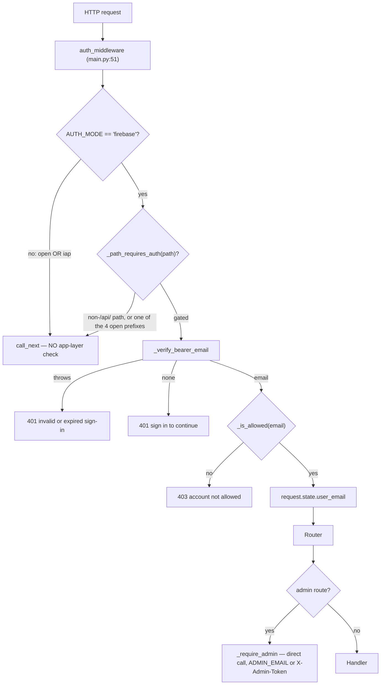

# Security, Authentication, Authorization, Tenancy

**Last reviewed:** 2026-08-30 · **Owner:** TBD · **Trust status:** Production but needs remediation

## Enforcement mechanism — VERIFIED — CODE

Authentication is **global ASGI middleware**, not a FastAPI dependency. There are no
`Depends(...)` authentication dependencies anywhere in `platform/api`. A maintainer
looking for auth decorators on routers will find none and may wrongly conclude a route
is ungated.

| Fact | Evidence |
|---|---|
| Registered as HTTP middleware on the app | `platform/api/main.py:51` — `app.middleware("http")(auth_middleware)` |
| Runs before any router | ASGI middleware ordering |
| Gate decided purely by URL prefix | `auth.py:128-132` — `_path_requires_auth(path)` |
| Non-`/api/` paths are never gated | `auth.py:129-130` — `if not path.startswith("/api/"): return False` |
| Four open `/api/` prefixes | `auth.py:38` — `("/api/health", "/api/me", "/api/config/firebase", "/api/waitlist")` |
| Admin uses a direct call, not a dependency | `admin.py:59` `_require_admin(request, x_admin_token)` invoked inside each handler |



## The three modes, and what each actually enforces

| Mode | App-layer enforcement | Identity source | Notes |
|---|---|---|---|
| `firebase` | **Yes** — bearer verified, allowlist applied | `_verify_bearer_email` | The only mode with application enforcement |
| `iap` | **None** — `call_next` unconditionally | `_iap_email` header, read lazily | Relies entirely on the perimeter |
| `open` | **None** — `call_next` unconditionally | none | Intended for local development |

`auth.py:134-140`:
```python
if AUTH_MODE != "firebase":
    # iap: edge already gated; identity read lazily via current_user_email.
    # open: local dev, no auth.
    return await call_next(request)
```

## Default disagreement — deployment vs. source (Evidence Rule 26)

| Layer | Default | Evidence |
|---|---|---|
| Application source | `open` | `auth.py:31` — `os.environ.get("AUTH_MODE", "open")` |
| Primary deploy script | `iap` | `platform/deploy.sh:50` — `AUTH_MODE_VAL="${AUTH_MODE:-iap}"` |
| Staging deploy path | `firebase` + **public ingress** | `platform/deploy.sh:52-56` — `STAGING_SERVICE=1` sets `PUBLIC=1`, `AUTH_MODE_VAL="firebase"` |

**These differ, and the difference changes the risk statement for
[#911](https://github.com/TeneikaAskew/stocks/issues/911).** The exposure is not "production runs
`open`" — the standard deploy path sets `iap`. It is that **neither `open` nor `iap` performs any
application-layer check**, so:

1. Any deploy path that does not set `AUTH_MODE` (a manual `gcloud run deploy`, a new job or
   service, a container run outside `platform/deploy.sh`) silently degrades to `open`.
2. In `iap` mode, if the service becomes reachable around the perimeter — misconfigured ingress,
   a public revision, a direct `run.app` URL — a **missing IAP identity is not rejected by the
   application**. Remediation scoped only to `open` leaves this untested.

## Confirmed exposure: `/dev` on public Firebase staging — VERIFIED — CODE

Found by Codex review on PR #931 and reproduced here.

| Step | Evidence |
|---|---|
| Staging is public with Firebase auth | `platform/deploy.sh:52-56` — `PUBLIC=1`, `AUTH_MODE_VAL="firebase"`, no IAP |
| Middleware exempts `/dev` (not `/api/`) | `auth.py:129-130` |
| Handler allows when no IAP header present | `main.py:285-288` — `email = _iap_user_email(request)`; the 403 fires only `if email is not None and email != _DEV_ALLOWED_EMAIL`. With no IAP in staging, `email is None` → falls through |
| Page contents | service account, IAP OAuth audience, `K_REVISION`, service URL, strat-engine model state (`main.py:290-301`) |

Net: on a `STAGING_SERVICE=1` deployment, `/dev` is reachable **without sign-in**.
Neither gate applies — the middleware skips non-`/api/` paths and the handler's own check
is a no-op without an IAP header. `_DEV_ALLOWED_EMAIL` defaults to a hardcoded address
(`main.py:160`). Covered by `platform/tests/dev.spec.ts`; that spec does not exercise the
staging (`PUBLIC=1`, no-IAP) configuration.

**Status:** no issue filed as of 2026-08-30. **Next action:** file one; do not treat as
covered by #911, whose scope is the `AUTH_MODE` default.

## Authorization

| Boundary | Implementation | Gap |
|---|---|---|
| Admin | `admin.py:59 _require_admin` — passes if IAP email equals `_ADMIN_EMAIL`, else requires `X-Admin-Token` header | Token compared non-constant-time ([#838](https://github.com/TeneikaAskew/stocks/issues/838)); `ADMIN_TOKEN` shipped via `--set-env-vars` not `--set-secrets` ([#850](https://github.com/TeneikaAskew/stocks/issues/850)) |
| Allowlist | `auth.py:117-126 _is_allowed` | **`AUTH_OPEN_SIGNUP` defaults to `"1"`**, so any verified Firebase identity is allowed. `AUTH_ALLOWED_EMAILS` is only consulted when signup is explicitly closed. The product is effectively open-registration by default |
| Ownership / tenancy | per-user scoping for journal ([#626](https://github.com/TeneikaAskew/stocks/pull/626)) and watchlists ([#635](https://github.com/TeneikaAskew/stocks/pull/635)) | No repo-wide immutable-owner invariant; multi-user policy **not verified** |
| Deployment perimeter | IAP, Cloud Run IAM/ingress, service identities | `PUBLIC=1` paths bypass the IAM gate by design |

## Secrets

| Item | Status | Issue |
|---|---|---|
| `DISCORD_BOT_TOKEN`, `DISCORD_PUBLIC_KEY` via `--set-env-vars` on a public service | CRITICAL | [#830](https://github.com/TeneikaAskew/stocks/issues/830) |
| `ADMIN_TOKEN`, `EW_USER`/`EW_PASS` via `--set-env-vars` | HIGH | [#850](https://github.com/TeneikaAskew/stocks/issues/850) |
| Secret pasted into ad-hoc SQL is logged at INFO | MEDIUM | [#836](https://github.com/TeneikaAskew/stocks/issues/836) |
| Pervasive `SELECT *` (data minimization) | MEDIUM | [#837](https://github.com/TeneikaAskew/stocks/issues/837) |
| Token in `run:` argv in a retired workflow | LOW | [#839](https://github.com/TeneikaAskew/stocks/issues/839) |
| Non-constant-time admin token comparison | LOW | [#838](https://github.com/TeneikaAskew/stocks/issues/838) |
| API keys moved to `--set-secrets` | Done | [#318](https://github.com/TeneikaAskew/stocks/pull/318) |

Environment variables in scope: `AUTH_MODE`, `AUTH_OPEN_SIGNUP`, `AUTH_ALLOWED_EMAILS`,
`ADMIN_EMAIL`, `ADMIN_TOKEN`, `DEV_ALLOWED_EMAIL`, `IAP_OAUTH_CLIENT_ID`,
`FIREBASE_API_KEY`. All verified present in code.

## Requirements

- **REQ-AUTH-001:** A non-local deployment SHALL reject unauthenticated `/api/*` requests
  unless an approved perimeter authenticator has established identity. A deploy SHALL fail
  when `AUTH_MODE` resolves to `open` outside local development.
- **REQ-AUTH-002 (new):** `iap` mode SHALL verify the IAP identity header at the application
  layer rather than assuming the perimeter, so a service reachable around IAP fails closed.
- **REQ-AUTH-003 (new):** Non-`/api/` operational endpoints that expose infrastructure detail
  (`/dev`) SHALL be gated by the same mechanism as `/api/*`, or SHALL NOT be deployed on a
  public service.
- **REQ-AUTHZ-001:** Admin operations SHALL require a server-enforced role; email presentation
  alone SHALL NOT grant privilege. Token comparison SHALL be constant-time.
- **REQ-TENANCY-001:** User-owned rows SHALL carry an immutable owner identifier enforced on
  every access path.
- **REQ-SECRET-001:** Secrets SHALL be passed via `--set-secrets`, never `--set-env-vars`.

## Traceability

| Aspect | Reference |
|---|---|
| Origin PR | [#623](https://github.com/TeneikaAskew/stocks/pull/623) Firebase auth end-to-end (backend + frontend + fail-closed deploy) |
| Evolution | [#674](https://github.com/TeneikaAskew/stocks/pull/674) clock-skew tolerance · [#677](https://github.com/TeneikaAskew/stocks/pull/677) test coverage guarding #674 · [#626](https://github.com/TeneikaAskew/stocks/pull/626) journal per-user scoping · [#635](https://github.com/TeneikaAskew/stocks/pull/635) watchlist scoping |
| Secret hardening | [#318](https://github.com/TeneikaAskew/stocks/pull/318) · [#424](https://github.com/TeneikaAskew/stocks/pull/424) split Discord webhooks · [#385](https://github.com/TeneikaAskew/stocks/pull/385) IaC drift + secret hardening |
| Open issues | [#911](https://github.com/TeneikaAskew/stocks/issues/911) · [#830](https://github.com/TeneikaAskew/stocks/issues/830) · [#850](https://github.com/TeneikaAskew/stocks/issues/850) · [#836](https://github.com/TeneikaAskew/stocks/issues/836) · [#837](https://github.com/TeneikaAskew/stocks/issues/837) · [#838](https://github.com/TeneikaAskew/stocks/issues/838) · [#839](https://github.com/TeneikaAskew/stocks/issues/839) · [#943](https://github.com/TeneikaAskew/stocks/issues/943) |
| Code | `platform/api/auth.py`, `platform/api/main.py:51,281-301`, `platform/api/routers/admin.py:59`, `platform/deploy.sh:44-60,99-110` |
| Tests | `platform/tests/auth-gate.spec.ts`, `admin-auth.spec.ts`, `dev.spec.ts` (staging config not covered) |
