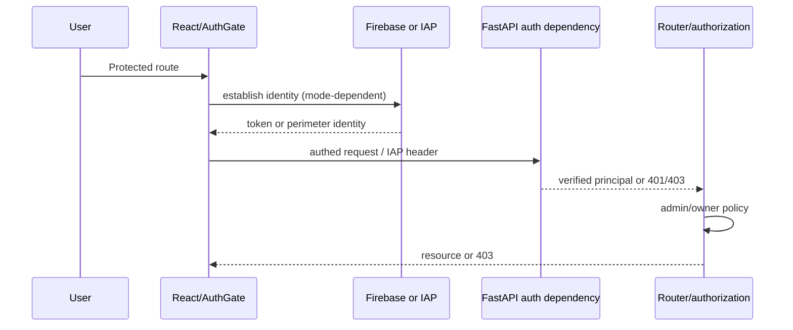

# Security, Authentication, Authorization, Tenancy

## Four separate boundaries
1. **Authentication:** `platform/api/auth.py` supports `AUTH_MODE=open|firebase|iap`. Firebase validates bearer identity; IAP trusts the perimeter-injected identity header; open mode supplies local/no-auth behavior. The React `AuthGate`, `SignInScreen`, Firebase client, `authedFetch`, and `/api/me` create the product flow.
2. **Authorization:** server-side admin dependencies/checks govern privileged routers. Identity is not automatically authorization; UI hiding is not enforcement.
3. **Tenancy/ownership:** journals, watchlists/configuration and other user rows require immutable owner keys and query-level enforcement. A complete multi-user policy is **not verified**.
4. **Deployment perimeter:** IAP, Cloud Run IAM/ingress and service identities protect reachability independently of application auth.

## Product flow

| Mode | Credential/source | Local/non-local use | Failure | Risk/status |
|---|---|---|---|---|
| `firebase` | client bearer token, server verification | application identity | invalid/missing identity → 401/403 | configured projects/allowlists and token tests required |
| `iap` | trusted IAP identity header after perimeter | perimeter-authenticated deployment | missing/invalid perimeter identity must reject | header trust requires unreachable bypass path |
| `open` | no user credential | explicitly local development only | permits access | source default creates fail-open deployment risk (#911) |

## Configuration and secrets
Audit and trace `AUTH_MODE`, `AUTH_OPEN_SIGNUP`, `AUTH_ALLOWED_EMAILS`, `ADMIN_EMAIL`, `ADMIN_TOKEN`, Firebase project/client values, IAP headers, DB/vendor/Discord secrets, service accounts and Secret Manager bindings. Secrets must not be defaults, CLI literals, images, logs, or client bundles. Rotation owner/date remain TBD.

## Target gates
Non-local deploy validation rejects `open`; IAP header trust is coupled to verified ingress/IAM; Firebase issuer/audience and allowlist are tested; admin roles are server-enforced; every user-owned query is adversarially tested; permission states are usable; auth events are auditable without logging credentials; break-glass access expires and is reviewed.
