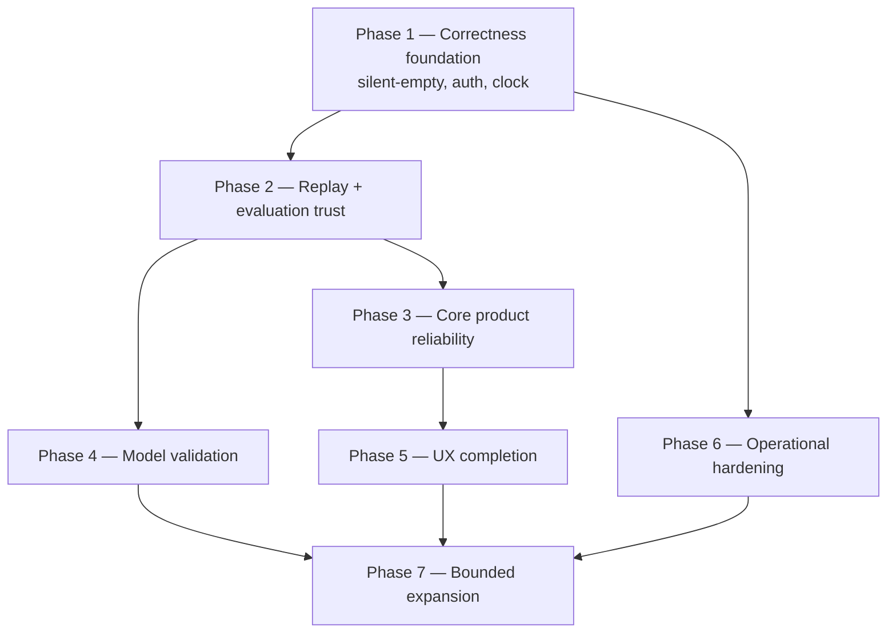

# Dependency-Driven Roadmap

**Last reviewed:** 2026-08-31 · Dates, releases and owners are **TBD**. Status is planning
status, never a production claim.

Sequenced by **dependency**, not severity: a CRITICAL issue whose fix cannot be validated
until replay is trustworthy is scheduled after replay, because fixing it earlier produces no
verifiable result.

## Why this order

**The load-bearing dependency:** every model and strategy claim rests on replay being
point-in-time-safe. Nine CRITICAL replay-integrity issues were open; [#818](https://github.com/TeneikaAskew/stocks/issues/818)
closed 2026-08-30 with a measured 42× trade-count inflation, leaving **eight**. Until they close, model
validation (Phase 4) cannot produce admissible evidence, so it is scheduled after Phase 2 —
not because model defects are less severe, but because fixing them early yields numbers no
one should trust.

## Validated delivery-stream gates

These gates were re-derived from current issue contracts and code on 2026-08-31. “Depends on”
means **validation/rerun is blocked**; an independently safe code correction may land earlier but
cannot establish a baseline or promotion result.

| Work | Required predecessor | Evidence and executable gate | Current disposition |
|---|---|---|---|
| PR-B options/gamma validation | PR-A input semantics (#825/#826) | `lib/gamma.py` and `platform/api/routers/grid.py` still contain missing-OI/gamma zero-fill paths; rerun gamma tests and coverage distribution only after null/coverage semantics land | **Blocked for validation** |
| PR-C research validity (#813/#817/#905/#909) | PR-A, then remaining PR-F/PR-G replay/data repairs (#822/#823/#824 et al.) | #905 requires untouched prospective evidence; #909 rejects mixed cohorts; current summarizer reads `date <= cutoff`, level refresh loads an unbounded full daily frame and selects its latest row before applying `analysis_date`, and `backfill_and_replay.py` duplicates production enrichment | **Blocked for baseline freeze** |
| PR-D cross-system parity | PR-F repaired replay | Backtest/live comparison cannot isolate fill/exit semantics on a known-invalid replay; #815’s within-live stop counterfactual is independent and may proceed | **Split gate** |
| PR-E risk controls (#816) | cap-engaging replay, live/replay fire-identity parity, then #940 persistent-state restore | #818 proves cap engagement (15 replay = 15 live counts; 969 suppressions) but capped counts can hide different fire sets. Compare ticker/direction/timestamp/position identities before calibration; #940 blocks activation | **Calibration and activation blocked** |
| PR-M/PR-N freshness (#833/#863/#922) | shared PR-0 read-side freshness primitive | Issue bodies identify the same stopped-writer/still-reading class; one registry/age/error contract must precede consumer-specific policy | **Blocked on PR-0** |

## Phases

| Phase | Theme | Capabilities | Depends on | Status | Blocking issues (top) | Acceptance gate |
|---|---|---|---|---|---|---|
| **0** | Baseline & governance | all | catalog completeness; evidence tags; every open issue mapped | **In progress** — this plan | — | Traceability is complete and maintained; REQ-GOV-001 enforced by branch protection |
| **1** | Correctness foundation | FEAT-DATA-001, FEAT-SIGNAL-001, FEAT-AUTH-001, FEAT-STRAT-001, FEAT-IND-001 | explicit data contracts; fail-closed identity; shared clock | Planned | [#830](https://github.com/TeneikaAskew/stocks/issues/830) [#926](https://github.com/TeneikaAskew/stocks/issues/926) [#925](https://github.com/TeneikaAskew/stocks/issues/925) [#908](https://github.com/TeneikaAskew/stocks/issues/908) [#866](https://github.com/TeneikaAskew/stocks/issues/866) | No decision path silently substitutes empty data; no deployment is fail-open |
| **2** | Replay & evaluation trust | FEAT-REPLAY-001, FEAT-REPORT-001 | Phase 1 clock and provenance | Planned | [#824](https://github.com/TeneikaAskew/stocks/issues/824) [#823](https://github.com/TeneikaAskew/stocks/issues/823) [#822](https://github.com/TeneikaAskew/stocks/issues/822) [#821](https://github.com/TeneikaAskew/stocks/issues/821) [#820](https://github.com/TeneikaAskew/stocks/issues/820) [#819](https://github.com/TeneikaAskew/stocks/issues/819) | Point-in-time-safe replay; leaked artifacts quarantined and rerun; live/replay parity fixtures pass |
| **3** | Core product reliability | FEAT-MARKET-001, FEAT-LIVE-001, FEAT-PLAYBOOK-001, FEAT-OPTION-001, FEAT-ALERT-001 | Phases 1–2 plus freshness ownership | Planned | [#861](https://github.com/TeneikaAskew/stocks/issues/861) [#826](https://github.com/TeneikaAskew/stocks/issues/826) [#825](https://github.com/TeneikaAskew/stocks/issues/825) [#816](https://github.com/TeneikaAskew/stocks/issues/816) [#815](https://github.com/TeneikaAskew/stocks/issues/815) [#812](https://github.com/TeneikaAskew/stocks/issues/812) | A dependable plan-to-alert workflow with measured freshness and explicit unavailability |
| **4** | Model validation | FEAT-MODEL-001, FEAT-INSIGHT-001 | valid replay and evaluation from Phase 2 | Planned | [#817](https://github.com/TeneikaAskew/stocks/issues/817) [#813](https://github.com/TeneikaAskew/stocks/issues/813) [#910](https://github.com/TeneikaAskew/stocks/issues/910) [#909](https://github.com/TeneikaAskew/stocks/issues/909) [#888](https://github.com/TeneikaAskew/stocks/issues/888) [#875](https://github.com/TeneikaAskew/stocks/issues/875) | Every model is promoted, paused or retired against REQ-MODEL-001..003 with shadow evidence |
| **5** | Product UX completion | FEAT-UI-001, FEAT-JOURNAL-001, FEAT-SETTINGS-001, FEAT-CHART-001, FEAT-CATALYST-001 | reliable APIs and ownership | Planned | [#722](https://github.com/TeneikaAskew/stocks/issues/722) [#717](https://github.com/TeneikaAskew/stocks/issues/717) [#716](https://github.com/TeneikaAskew/stocks/issues/716) [solyra#27](https://github.com/TeneikaAskew/solyra/issues/27) [solyra#26](https://github.com/TeneikaAskew/solyra/issues/26) | Every screen satisfies REQ-UX-001; ownership tested; E2E and a11y coverage in CI |
| **6** | Operational hardening | FEAT-DEPLOY-001, FEAT-OPS-001, FEAT-CICD-001, FEAT-AUTH-001 | owned components from Phase 1 | Planned | [#835](https://github.com/TeneikaAskew/stocks/issues/835) [#834](https://github.com/TeneikaAskew/stocks/issues/834) [#833](https://github.com/TeneikaAskew/stocks/issues/833) [#831](https://github.com/TeneikaAskew/stocks/issues/831) [#829](https://github.com/TeneikaAskew/stocks/issues/829) [#859](https://github.com/TeneikaAskew/stocks/issues/859) | Drift-free reproducible deploy, paging on freshness, a completed restore drill |
| **7** | Bounded expansion | selected proven capabilities | all prior gates | Planned | — | An explicit go-live review — see [15](15-OPEN-DECISIONS.md) |

## Phase 1 and 2 in full

These two carry the dependency load; their issue sets are listed completely rather than topped.

### Phase 1 — Correctness foundation

| Issue | Sev | Title |
|---|---|---|
| [#830](https://github.com/TeneikaAskew/stocks/issues/830) | CRITICAL | [audit] K2 — DISCORD_BOT_TOKEN and DISCORD_PUBLIC_KEY passed via --set-env-vars on a public service |
| [#926](https://github.com/TeneikaAskew/stocks/issues/926) | P0 | [P0][Data Loader] Remove the second silent empty-data swallow |
| [#925](https://github.com/TeneikaAskew/stocks/issues/925) | P0 | [P0][Data Access] Stop legacy database query failures from becoming empty data |
| [#908](https://github.com/TeneikaAskew/stocks/issues/908) | P0 | [P0][Levels] Reprice level outcomes with executable gap, spread, and latency semantics |
| [#866](https://github.com/TeneikaAskew/stocks/issues/866) | P0 | [P0][Levels] Effective PDH/PDL mother-bar walk-back is off by one in premarket mode |
| [#863](https://github.com/TeneikaAskew/stocks/issues/863) | HIGH | [audit] S2 + S4 — earnings_options_strategy_winners posted to Discord at 99 days old; signal_metrics rolling classification |
| [#862](https://github.com/TeneikaAskew/stocks/issues/862) | HIGH | [audit] S3 — exit_config_overrides: 113 days old, on the live fire path, guard trips ~2026-11-04 |
| [#850](https://github.com/TeneikaAskew/stocks/issues/850) | HIGH | [audit] K4 + K5 — ADMIN_TOKEN, EW_USER/EW_PASS passed via --set-env-vars instead of --set-secrets |
| [#828](https://github.com/TeneikaAskew/stocks/issues/828) | HIGH | [audit] H2 — Partially-remediated fallback in gcp/signal_monitor.py:433-513 |
| [#927](https://github.com/TeneikaAskew/stocks/issues/927) | P1 | [P1][Rates] Do not silently price Greeks with hard-coded rates |
| [#914](https://github.com/TeneikaAskew/stocks/issues/914) | P1 | [P1][Calendar] Centralize exchange sessions, holidays, half-days, and DST |
| [#913](https://github.com/TeneikaAskew/stocks/issues/913) | P1 | [P1][Data] Enforce a raw-versus-adjusted corporate-action policy |
| [#911](https://github.com/TeneikaAskew/stocks/issues/911) | P1 | [P1][Security] Fail closed on application authentication outside local development |
| [#907](https://github.com/TeneikaAskew/stocks/issues/907) | P1 | [P1][Levels] Remove legacy positional compute_previous_levels fallback |
| [#894](https://github.com/TeneikaAskew/stocks/issues/894) | P1 | [P1][Indicators] Exclude premarket bars from RTH VWAP |
| [#892](https://github.com/TeneikaAskew/stocks/issues/892) | P1 | [P1][Indicators] Enforce ATR warm-up and unit contracts |
| [#870](https://github.com/TeneikaAskew/stocks/issues/870) | P1 | [P1][Indicators] RSI warm-up fabrication causes live/resolver exit divergence |

### Phase 2 — Replay & evaluation trust

| Issue | Sev | Title |
|---|---|---|
| [#824](https://github.com/TeneikaAskew/stocks/issues/824) | CRITICAL | [audit] R7 — scripts/backfill_and_replay.py re-implements the daily fetcher with a divergent indicator map |
| [#823](https://github.com/TeneikaAskew/stocks/issues/823) | CRITICAL | [audit] R6 — As-of leakage: refresh_level_map builds level maps from today's daily bars |
| [#822](https://github.com/TeneikaAskew/stocks/issues/822) | CRITICAL | [audit] R5 — As-of leakage: summarize_backtest_metrics reads the as-of day's completed bar |
| [#821](https://github.com/TeneikaAskew/stocks/issues/821) | CRITICAL | [audit] R4 — scripts/compare_tier_fires.py is a throwaway harness whose numbers gated a calibration PR |
| [#820](https://github.com/TeneikaAskew/stocks/issues/820) | CRITICAL | [audit] R3 — scripts/backfill_signals.py silently scores zero, into production signal_alerts |
| [#819](https://github.com/TeneikaAskew/stocks/issues/819) | CRITICAL | [audit] R2 — ORB session window applied against a UTC index in replay (the 5/6 V1 bug, now in production code) |
| [#814](https://github.com/TeneikaAskew/stocks/issues/814) | CRITICAL | [audit] T3 — Backtest signals and fills use the same bar's close; zero slippage/commission |
| [#906](https://github.com/TeneikaAskew/stocks/issues/906) | P0 | [P0][Replay] Quarantine and rerun pre-PR-135 future-leaked artifacts |
| [#898](https://github.com/TeneikaAskew/stocks/issues/898) | P0 | [P0][Replay] Apply RTH filtering regardless of persistence mode |
| [#873](https://github.com/TeneikaAskew/stocks/issues/873) | P0 | [P0][Replay] Use replay clock for lifecycle timestamps and elapsed time |
| [#929](https://github.com/TeneikaAskew/stocks/issues/929) | P1 | [P1][Replay] Reject bars missing their event timestamp |
| [#904](https://github.com/TeneikaAskew/stocks/issues/904) | P1 | [P1][Replay] Remove hard-coded EDT offset from historical insight timestamps |
| [#903](https://github.com/TeneikaAskew/stocks/issues/903) | P1 | [P1][Replay] Assert canonical indicator columns across replay and backfill |
| [#902](https://github.com/TeneikaAskew/stocks/issues/902) | P1 | [P1][Resolver] Make historical resolver upper bounds replay-aware |
| [#901](https://github.com/TeneikaAskew/stocks/issues/901) | P1 | [P1][Replay] Enforce premarket cutoff in signal-alert summaries |
| [#900](https://github.com/TeneikaAskew/stocks/issues/900) | P1 | [P1][Replay] Key brief-bias cache by session date |
| [#899](https://github.com/TeneikaAskew/stocks/issues/899) | P1 | [P1][Replay] Persist replay alerts through the production schema contract |
| [#897](https://github.com/TeneikaAskew/stocks/issues/897) | P1 | [P1][Replay] Scope LevelMap timestamps and caches to the replay date |
| [#882](https://github.com/TeneikaAskew/stocks/issues/882) | P1 | [P1][Backtest] Make profit factor and aggregate metrics position-size aware |
| [#869](https://github.com/TeneikaAskew/stocks/issues/869) | P1 | [P1][Resolver] Restrict EOD resolution and target hits to RTH bars |
| [#923](https://github.com/TeneikaAskew/stocks/issues/923) | P2 | [P2][Architecture] Isolate divergent legacy replay, backfill, and analysis stacks |

## Recommended next ten

1. Remove silent-empty and unresolved-configuration behavior from decision-critical paths — [#925](https://github.com/TeneikaAskew/stocks/issues/925), [#926](https://github.com/TeneikaAskew/stocks/issues/926), [#928](https://github.com/TeneikaAskew/stocks/issues/928)
2. Quarantine and rerun leaked replay/model artifacts — [#906](https://github.com/TeneikaAskew/stocks/issues/906), [#822](https://github.com/TeneikaAskew/stocks/issues/822), [#823](https://github.com/TeneikaAskew/stocks/issues/823)
3. Establish replay/live clock, session and persistence parity — [#873](https://github.com/TeneikaAskew/stocks/issues/873), [#819](https://github.com/TeneikaAskew/stocks/issues/819), [#898](https://github.com/TeneikaAskew/stocks/issues/898) — [#818](https://github.com/TeneikaAskew/stocks/issues/818) is **done**, and its 42× measurement is the template for the rest: fix, then quantify
4. Fail closed on authentication outside local development, **covering `iap` as well as `open`** — [#911](https://github.com/TeneikaAskew/stocks/issues/911) + the unfiled `/dev` exposure in [09](09-SECURITY-AUTH.md)
5. Correct signal, level, stop and exit semantics — [#815](https://github.com/TeneikaAskew/stocks/issues/815), [#816](https://github.com/TeneikaAskew/stocks/issues/816), [#866](https://github.com/TeneikaAskew/stocks/issues/866), [#908](https://github.com/TeneikaAskew/stocks/issues/908)
6. Stop training from auto-writing production — [#813](https://github.com/TeneikaAskew/stocks/issues/813), [#817](https://github.com/TeneikaAskew/stocks/issues/817)
7. Persist complete decision/config/model/code provenance — [#910](https://github.com/TeneikaAskew/stocks/issues/910)
8. Make evaluation cohort-aware, baseline-compared and calibrated — [#909](https://github.com/TeneikaAskew/stocks/issues/909), [#890](https://github.com/TeneikaAskew/stocks/issues/890)
9. Restore stale production surfaces or retire them — [#861](https://github.com/TeneikaAskew/stocks/issues/861), [#862](https://github.com/TeneikaAskew/stocks/issues/862), [#863](https://github.com/TeneikaAskew/stocks/issues/863)
10. Close infrastructure drift and get frontend suites into CI — [#829](https://github.com/TeneikaAskew/stocks/issues/829), [#833](https://github.com/TeneikaAskew/stocks/issues/833), [#834](https://github.com/TeneikaAskew/stocks/issues/834), [#835](https://github.com/TeneikaAskew/stocks/issues/835), [solyra#28](https://github.com/TeneikaAskew/solyra/issues/28) (was #868; moved 2026-09-03 after the #957 frontend split)

## Product-development dependencies

Foundation trust blocks model validation → model validation blocks any actionable-intelligence
claim → identity and tenancy block multi-user journal and configuration → data freshness blocks
every surfaced conclusion → reproducible deploy and DR block production expansion.
